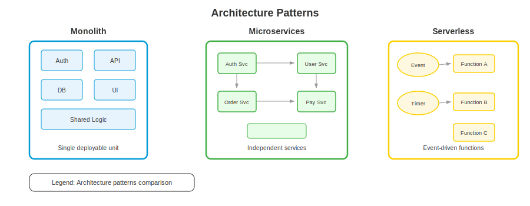

# Level 4-3 -- The Fortress Map: Software Architecture

---

## Change Log

| Version | Date       | Author                                  | Description        |
|---------|------------|----------------------------------------|--------------------|
| 1.0.0   | 2026-03-18 | Paula Silva - @paulasilvatech | Initial creation   |

---

## Table of Contents

- [Prologue: The Castle Blueprint](#prologue-the-castle-blueprint)
- [1. What Is Software Architecture?](#1-what-is-software-architecture)
  - [1.1 Why Architecture Matters](#11-why-architecture-matters)
  - [1.2 Architectural Decisions](#12-architectural-decisions)
- [2. Monolith: The Single Castle](#2-monolith-the-single-castle)
  - [2.1 What Is a Monolith](#21-what-is-a-monolith)
  - [2.2 Structure of a Monolith](#22-structure-of-a-monolith)
  - [2.3 Advantages and Disadvantages](#23-advantages-and-disadvantages)
  - [2.4 When the Monolith Is the Right Choice](#24-when-the-monolith-is-the-right-choice)
- [3. Microservices: The Village of Specialized Houses](#3-microservices-the-village-of-specialized-houses)
  - [3.1 What Are Microservices](#31-what-are-microservices)
  - [3.2 Anatomy of a Microservices Architecture](#32-anatomy-of-a-microservices-architecture)
  - [3.3 Communication Between Services](#33-communication-between-services)
  - [3.4 Advantages and Disadvantages](#34-advantages-and-disadvantages)
  - [3.5 When to Use Microservices](#35-when-to-use-microservices)
- [4. Serverless Architecture](#4-serverless-architecture)
  - [4.1 Functions as Building Blocks](#41-functions-as-building-blocks)
  - [4.2 Common Serverless Patterns](#42-common-serverless-patterns)
  - [4.3 When to Use Serverless](#43-when-to-use-serverless)
- [5. Event-Driven Architecture: Messenger Bells](#5-event-driven-architecture-messenger-bells)
  - [5.1 What Is Event-Driven Architecture](#51-what-is-event-driven-architecture)
  - [5.2 Main Components](#52-main-components)
  - [5.3 Practical Example: TodoApp Event-Driven](#53-practical-example-todoapp-event-driven)
  - [5.4 Event Sourcing and CQRS](#54-event-sourcing-and-cqrs)
- [6. MVC: The Three Rooms of the Castle](#6-mvc-the-three-rooms-of-the-castle)
  - [6.1 What Is MVC](#61-what-is-mvc)
  - [6.2 How MVC Works](#62-how-mvc-works)
  - [6.3 MVC in Express.js](#63-mvc-in-expressjs)
- [7. Clean Architecture: The Castle with Concentric Walls](#7-clean-architecture-the-castle-with-concentric-walls)
  - [7.1 The Dependency Principle](#71-the-dependency-principle)
  - [7.2 The 4 Layers](#72-the-4-layers)
  - [7.3 Practical Example](#73-practical-example)
- [8. Complementary Architectural Patterns](#8-complementary-architectural-patterns)
  - [8.1 API Gateway](#81-api-gateway)
  - [8.2 BFF: Backend for Frontend](#82-bff-backend-for-frontend)
  - [8.3 Strangler Fig: Migrating from the Monolith](#83-strangler-fig-migrating-from-the-monolith)
- [9. Comparison: Which Architecture to Choose?](#9-comparison-which-architecture-to-choose)
  - [9.1 Comparison Table](#91-comparison-table)
  - [9.2 Decision Tree](#92-decision-tree)
- [10. Final Summary Table](#10-final-summary-table)
- [References](#references)

---

## Prologue: The Castle Blueprint

Sofia was planning to expand the TodoApp. She was going to add notifications, a team system, reports, and calendar integration. But with each new feature, the code got more confusing, slower, and harder to maintain.

Toadette — the Code Reviewer — stopped Sofia mid-commit.

*"Sofia, you're building a castle without a blueprint. Every room you add is connected to all the others. If you change the bathroom, the kitchen stops working."*

Sofia sighed. *"But it works..."*

*"For now,"* said Toadette. *"Imagine that in Super Mario, all levels were a single giant map, without divisions. If Nintendo needed to fix a bug in level 1-1, ALL other levels would be affected. That's why there are separate worlds, levels, and castles."*

*"This is **software architecture** — deciding how to organize the parts of your system BEFORE building. It's like having the castle blueprint before laying the first brick."*

---

## 1. What Is Software Architecture?

### 1.1 Why Architecture Matters

**Software architecture** is the fundamental structure of a system — how its components are organized, how they communicate, and what constraints govern its design.

> **Mario Analogy**: Architecture is the **blueprint of the Mushroom Kingdom**. It defines how many castles exist, how they're connected, what each one's function is, and how the roads (communication) link everything together. Without a good blueprint, the kingdom becomes a chaotic labyrinth.

**Good architecture allows:**

- Adding new features without breaking existing ones
- Scaling parts of the system independently
- Different teams working in parallel
- Swapping technologies without rewriting everything
- Understanding the system quickly

**Bad architecture causes:**

- Simple changes take days (everything is coupled)
- Cascading bugs (changing A breaks B, C, and D)
- Impossible to scale (all or nothing)
- New developers take months to understand
- Rewriting is easier than fixing

### 1.2 Architectural Decisions

The most important architectural decisions are the hardest to reverse:

| Decision | Question | Mario Analogy |
|----------|----------|---------------|
| **Style** | Monolith or microservices? | One giant castle or a village of houses? |
| **Communication** | Synchronous or asynchronous? | Direct shout or messenger bell? |
| **Data** | One database or many? | One central vault or vaults per room? |
| **Deploy** | Together or separate? | All levels in one cartridge or individual levels? |
| **Scale** | Vertical or horizontal? | Bigger castle or more castles? |

---

## 2. Monolith: The Single Castle

### 2.1 What Is a Monolith

A **monolith** is an application where all code is in a single project, compiled and deployed as a single unit.

> **Mario Analogy**: The monolith is a **single giant castle** where everything happens — the kitchen, the bedrooms, the throne room, the vault, the dungeon — all inside the same structure. If you want to renovate the kitchen, you need to close the entire castle.

```
┌──────────────────────────────────────────────┐
│              MONOLITH CASTLE                  │
│                                               │
│  ┌─────────┐  ┌──────────┐  ┌────────────┐  │
│  │ Frontend │  │ Backend  │  │  Database   │  │
│  │  (View)  │  │ (Logic)  │  │  (Storage)  │  │
│  └────┬─────┘  └────┬─────┘  └─────┬──────┘  │
│       │              │              │          │
│       └──────────────┼──────────────┘          │
│                      │                         │
│              ONE SINGLE DEPLOY                 │
└──────────────────────────────────────────────┘
```

### 2.2 Structure of a Monolith

```
todoapp/                          # A single project
├── src/
│   ├── controllers/              # Request logic
│   │   ├── todoController.js
│   │   ├── userController.js
│   │   └── teamController.js
│   ├── models/                   # Data models
│   │   ├── Todo.js
│   │   ├── User.js
│   │   └── Team.js
│   ├── services/                 # Business logic
│   │   ├── todoService.js
│   │   ├── userService.js
│   │   ├── emailService.js
│   │   └── reportService.js
│   ├── routes/                   # API routes
│   │   ├── todoRoutes.js
│   │   ├── userRoutes.js
│   │   └── teamRoutes.js
│   ├── middleware/                # Auth, logging, etc.
│   └── app.js                    # Entry point
├── public/                       # Frontend
├── prisma/                       # Database schema
├── package.json                  # ONE package.json
└── Dockerfile                    # ONE Dockerfile
```

### 2.3 Advantages and Disadvantages

**Advantages:**

| Advantage | Why | Mario |
|----------|-----|-------|
| **Simple to develop** | One project, one repo, one deploy | One castle, one blueprint |
| **Simple to test** | Everything together, easy end-to-end testing | Test all rooms at once |
| **Simple to debug** | Single process, complete stack trace | Bug is SOMEWHERE in this castle |
| **Internal performance** | In-memory calls (no network) | Walk between rooms (without leaving the castle) |
| **Simple transactions** | One database, native ACID transactions | One vault, one key |

**Disadvantages:**

| Disadvantage | Why | Mario |
|-------------|-----|-------|
| **Scale all or nothing** | Can't scale just the most-used part | To expand the kitchen, must enlarge the entire castle |
| **Risky deploy** | Any change redeploys EVERYTHING | Kitchen renovation closes the entire castle |
| **Coupling** | Modules tend to mix over time | Kitchen plumbing runs through the bedroom |
| **Single tech stack** | Everything in the same language/framework | All rooms with the same decor |
| **Blocked team** | Everyone works on the same code | All builders in the same room |

### 2.4 When the Monolith Is the Right Choice

**Use a monolith when:**

- Starting a new project (MVP, startup)
- Small team (1-5 devs)
- Simple, well-understood domain
- Need to deliver fast
- Don't know yet how the system will grow

> **Martin Fowler's Golden Rule**: *"Almost all the successful microservice stories have started with a monolith that got too big and was broken up."* — Start monolith, migrate when necessary.

---

## 3. Microservices: The Village of Specialized Houses

### 3.1 What Are Microservices

**Microservices** is an architectural style where the application is composed of **small, independent, and specialized services**, each with its own database and deploy.

> **Mario Analogy**: Instead of one giant castle, we have a **village** with several specialized houses. The bakery (auth service), the blacksmith (tasks service), the post office (notifications service), the bank (payments service). Each house operates independently. If the bakery closes for renovation, the blacksmith keeps operating.

```
┌─────────────┐    ┌─────────────┐    ┌─────────────┐
│  Auth House  │    │  Todo House  │    │  Email House │
│  ┌────────┐  │    │  ┌────────┐  │    │  ┌────────┐  │
│  │  API   │  │    │  │  API   │  │    │  │  API   │  │
│  │ Logic  │  │    │  │ Logic  │  │    │  │ Logic  │  │
│  │   DB   │  │    │  │   DB   │  │    │  │   DB   │  │
│  └────────┘  │    │  └────────┘  │    │  └────────┘  │
└──────┬───────┘    └──────┬───────┘    └──────┬───────┘
       │                   │                   │
       └───────────────────┼───────────────────┘
                           │
                    ┌──────┴───────┐
                    │  API Gateway  │
                    └──────────────┘
```

### 3.2 Anatomy of a Microservices Architecture

```
todoapp-microservices/
├── services/
│   ├── auth-service/              # Authentication service
│   │   ├── src/
│   │   ├── prisma/schema.prisma   # ITS OWN database
│   │   ├── Dockerfile             # ITS OWN container
│   │   ├── package.json           # ITS OWN dependencies
│   │   └── tests/
│   │
│   ├── todo-service/              # Tasks service
│   │   ├── src/
│   │   ├── prisma/schema.prisma   # ITS OWN database
│   │   ├── Dockerfile
│   │   ├── package.json
│   │   └── tests/
│   │
│   ├── notification-service/      # Notifications service
│   │   ├── src/
│   │   ├── Dockerfile
│   │   ├── package.json
│   │   └── tests/
│   │
│   └── report-service/            # Reports service
│       ├── src/
│       ├── Dockerfile
│       ├── package.json
│       └── tests/
│
├── api-gateway/                   # Single entry point
│   ├── src/
│   └── Dockerfile
│
├── docker-compose.yml             # Local orchestration
└── k8s/                           # Kubernetes for production
    ├── auth-deployment.yml
    ├── todo-deployment.yml
    └── notification-deployment.yml
```

### 3.3 Communication Between Services

| Type | How It Works | When to Use | Mario |
|------|-------------|-------------|-------|
| **HTTP/REST** | Service A calls Service B's API | Need immediate response | Mario shouts to Luigi in the house next door |
| **gRPC** | Binary RPC, faster than REST | High-performance internal communication | Walkie-talkie between houses |
| **Message Queue** | Service A puts message in queue | Don't need immediate response | Mario leaves a letter in the mailbox |
| **Event Bus** | Service A publishes event, B and C listen | Multiple services need to react | Bell in the square — everyone hears |

```javascript
// Synchronous communication: Auth Service calling Todo Service
// auth-service/src/services/todoClient.js
const axios = require('axios');

async function getUserTodos(userId, token) {
  const response = await axios.get(
    `http://todo-service:3002/api/todos?userId=${userId}`,
    { headers: { Authorization: `Bearer ${token}` } }
  );
  return response.data;
}

// Asynchronous communication: Todo Service publishing event
// todo-service/src/events/publisher.js
const amqp = require('amqplib');

async function publishTodoCreated(todo) {
  const connection = await amqp.connect('amqp://rabbitmq:5672');
  const channel = await connection.createChannel();

  await channel.assertExchange('todo-events', 'topic');
  channel.publish(
    'todo-events',
    'todo.created',
    Buffer.from(JSON.stringify(todo))
  );
}
```

### 3.4 Advantages and Disadvantages

**Advantages:**

| Advantage | Mario |
|----------|-------|
| **Independent deploy** | Renovate the bakery without closing the blacksmith |
| **Independent scaling** | Build more bakeries if there's high demand |
| **Autonomous teams** | Each house has its own master builder |
| **Varied technology** | Bakery in Python, blacksmith in Node.js |
| **Resilience** | Bakery goes down, village keeps functioning |

**Disadvantages:**

| Disadvantage | Mario |
|-------------|-------|
| **Operational complexity** | Managing 20 houses is more complex than 1 castle |
| **Network communication** | Messages between houses can get lost |
| **Distributed transactions** | Transferring gold between vaults of different houses |
| **Difficult debugging** | Bug could be in any house |
| **Infrastructure overhead** | Each house needs pipes, electrical, roof |

### 3.5 When to Use Microservices

**Use microservices when:**

- Large, complex system with well-defined domains
- Large teams (multiple teams of 5-8 devs)
- Parts of the system need to scale independently
- Different parts evolve at different rates
- You have DevOps maturity (CI/CD, monitoring, containers)

**DON'T use microservices when:**

- Small team (complexity will swallow you)
- New project without a clear domain
- Don't have mature CI/CD infrastructure
- The monolith works well

---

## 4. Serverless Architecture

### 4.1 Functions as Building Blocks

In serverless architecture, you don't think in services, but in **individual functions** that respond to events.

> **Mario Analogy**: Instead of permanent houses, imagine **"?" magic blocks** scattered throughout the Mushroom Kingdom. Each block only appears when someone needs it, does its job, and disappears. No castle, no house — just instant action blocks.

```
Event: "Task created"
   │
   ├──→ [Function: Save to database]     → executes → disappears
   ├──→ [Function: Send notification]    → executes → disappears
   └──→ [Function: Update report]        → executes → disappears
```

### 4.2 Common Serverless Patterns

**API Functions:**

```javascript
// Azure Function: GET /api/todos
module.exports = async function (context, req) {
  const userId = req.headers['x-user-id'];
  const todos = await db.todos.findMany({ where: { userId } });
  context.res = { status: 200, body: todos };
};
```

**Event Processing:**

```javascript
// Azure Function: Process image when upload happens
module.exports = async function (context, myBlob) {
  context.log(`Processing image: ${context.bindingData.name}`);
  const thumbnail = await generateThumbnail(myBlob);
  context.bindings.outputBlob = thumbnail;
};
```

**Scheduled Tasks:**

```javascript
// Azure Function: Daily cleanup at 3 AM
// CRON: 0 0 3 * * *
module.exports = async function (context, timer) {
  const deletedCount = await db.todos.deleteMany({
    where: { completed: true, updatedAt: { lt: thirtyDaysAgo } }
  });
  context.log(`Cleanup: ${deletedCount} tasks removed`);
};
```

### 4.3 When to Use Serverless

| Scenario | Serverless? | Why |
|---------|:-----------:|---------|
| API with unpredictable traffic | Yes | Scales from 0 to infinity automatically |
| Event processing | Yes | Ideal for event-driven |
| Scheduled tasks (cron) | Yes | Runs only when needed |
| Application with constant traffic | Maybe not | Can be more expensive than PaaS |
| Long processing (+10 min) | No | Execution time limit |
| WebSocket/persistent connections | No | Functions are ephemeral |

---

## 5. Event-Driven Architecture: Messenger Bells

### 5.1 What Is Event-Driven Architecture

In **event-driven architecture**, components communicate through **events** — something happened and other components react to it.

> **Mario Analogy**: Imagine that in the Mushroom Kingdom there are **messenger bells** in each tower. When something important happens (Mario saved Toad!), a bell rings. All towers that are "listening" for that type of bell react automatically — the kitchen prepares a feast, the treasury releases coins, the post office sends notifications. Nobody needs to explicitly tell each tower what to do.

### 5.2 Main Components

| Component | Function | Mario Analogy |
|-----------|--------|---------------|
| **Event Producer** | Generates the event | Mario who rings the bell |
| **Event Broker** | Distributes the event | The bell network between towers |
| **Event Consumer** | Reacts to the event | Towers that listen and act |
| **Event** | The message | The bell sound (with information) |

```
Producer          Broker               Consumers
┌────────┐    ┌────────────┐    ┌──────────────────┐
│  Todo   │──→ │            │──→ │ Notification Svc │
│ Service │    │   Event    │    └──────────────────┘
└────────┘    │   Bus      │    ┌──────────────────┐
              │ (RabbitMQ) │──→ │  Analytics Svc   │
┌────────┐    │            │    └──────────────────┘
│  User  │──→ │            │    ┌──────────────────┐
│ Service │    │            │──→ │   Audit Svc      │
└────────┘    └────────────┘    └──────────────────┘
```

### 5.3 Practical Example: TodoApp Event-Driven

```javascript
// Event definitions
const EVENTS = {
  TODO_CREATED: 'todo.created',
  TODO_COMPLETED: 'todo.completed',
  TODO_DELETED: 'todo.deleted',
  USER_REGISTERED: 'user.registered',
  USER_LOGGED_IN: 'user.logged_in'
};

// Producer: Todo Service publishes event
async function createTodo(req, res) {
  const todo = await db.todos.create({ data: req.body });

  // Publish event — doesn't know (and doesn't need to know) who will consume
  await eventBus.publish(EVENTS.TODO_CREATED, {
    todoId: todo.id,
    userId: todo.userId,
    title: todo.title,
    priority: todo.priority,
    timestamp: new Date().toISOString()
  });

  res.status(201).json(todo);
}

// Consumer 1: Notification Service listens and sends email
eventBus.subscribe(EVENTS.TODO_CREATED, async (event) => {
  const user = await getUser(event.userId);
  await sendEmail(user.email, `New task: ${event.title}`);
});

// Consumer 2: Analytics Service listens and records metric
eventBus.subscribe(EVENTS.TODO_CREATED, async (event) => {
  await analytics.track('todo_created', {
    userId: event.userId,
    priority: event.priority
  });
});

// Consumer 3: Audit Service listens and records log
eventBus.subscribe(EVENTS.TODO_CREATED, async (event) => {
  await auditLog.write({
    action: 'CREATE_TODO',
    actor: event.userId,
    target: event.todoId,
    timestamp: event.timestamp
  });
});
```

### 5.4 Event Sourcing and CQRS

**Event Sourcing**: instead of storing the current state, store all events that led to that state.

> **Mario Analogy**: Instead of just storing "Mario has 5 coins", store the ENTIRE history: "Mario picked up coin 1, picked up coin 2, lost coin 3, picked up coin 4, picked up coin 5, picked up coin 6". If you need to recalculate, just replay the events.

**CQRS (Command Query Responsibility Segregation)**: separating write operations (commands) from read operations (queries).

> **Mario Analogy**: In the castle, the ENTRY door (write) is different from the EXIT door (read). The entry guards check if you can come in. The exit guards check if you can see information.

---

## 6. MVC: The Three Rooms of the Castle

### 6.1 What Is MVC

**MVC (Model-View-Controller)** is an architectural pattern that separates the application into three components:

> **Mario Analogy**:
> - **Model (Vault)** = where data and business logic live. The castle vault — stores treasures, knows the rules of gold.
> - **View (Throne Room)** = what the user sees. The throne room — beautiful, decorated, where visitors are received.
> - **Controller (War Room)** = who coordinates everything. The war room — receives requests, decides what to do, delegates to the right people.

```
Visitor → [View: Throne Room]
                    ↕
           [Controller: War Room]
                    ↕
            [Model: Vault]
```

### 6.2 How MVC Works

```
1. Visitor (user) knocks on the castle door (HTTP request)
2. Guard (Router) forwards to the War Room (Controller)
3. War Room analyzes the request and goes to the Vault (Model) to fetch data
4. Vault returns data to the War Room
5. War Room sends data to the Throne Room (View) to format
6. Throne Room delivers the formatted response to the Visitor
```

### 6.3 MVC in Express.js

```javascript
// MODEL — models/Todo.js (The Vault)
class TodoModel {
  static async findAll(userId) {
    return await prisma.todo.findMany({
      where: { userId },
      orderBy: { createdAt: 'desc' }
    });
  }

  static async create(data) {
    return await prisma.todo.create({ data });
  }

  static async update(id, data) {
    return await prisma.todo.update({ where: { id }, data });
  }

  static async delete(id) {
    return await prisma.todo.delete({ where: { id } });
  }
}

// CONTROLLER — controllers/todoController.js (War Room)
class TodoController {
  static async index(req, res) {
    try {
      const todos = await TodoModel.findAll(req.user.id);
      res.json({ success: true, data: todos });
    } catch (error) {
      res.status(500).json({ success: false, error: error.message });
    }
  }

  static async create(req, res) {
    try {
      const todo = await TodoModel.create({
        ...req.body,
        userId: req.user.id
      });
      res.status(201).json({ success: true, data: todo });
    } catch (error) {
      res.status(400).json({ success: false, error: error.message });
    }
  }

  static async update(req, res) {
    try {
      const todo = await TodoModel.update(req.params.id, req.body);
      res.json({ success: true, data: todo });
    } catch (error) {
      res.status(400).json({ success: false, error: error.message });
    }
  }

  static async delete(req, res) {
    try {
      await TodoModel.delete(req.params.id);
      res.status(204).send();
    } catch (error) {
      res.status(400).json({ success: false, error: error.message });
    }
  }
}

// VIEW — In the case of a REST API, the "View" is the JSON format
// In apps with a template engine, it would be the rendered HTML

// ROUTES — routes/todoRoutes.js (The Guard/Router)
const router = express.Router();
router.get('/todos', verifyToken, TodoController.index);
router.post('/todos', verifyToken, TodoController.create);
router.put('/todos/:id', verifyToken, TodoController.update);
router.delete('/todos/:id', verifyToken, TodoController.delete);
```

---

## 7. Clean Architecture: The Castle with Concentric Walls

### 7.1 The Dependency Principle

**Clean Architecture** (Robert C. Martin) organizes code in concentric layers where dependencies always point **inward**.

> **Mario Analogy**: Imagine Peach's castle with **concentric walls**:
> - **Center** (Throne Room) = pure business rules — depend on NOTHING external
> - **Second wall** = use cases — orchestrate the rules
> - **Third wall** = adapters — translate between the external and internal worlds
> - **Outer wall** = frameworks, database, UI — things that can change
>
> The rule is: those inside do NOT know who is outside. The Throne Room doesn't know if the castle is made of stone or wood.

### 7.2 The 4 Layers

```
┌────────────────────────────────────────────────┐
│  Frameworks & Drivers (Outer Wall)              │
│  Express, Prisma, React, PostgreSQL             │
│  ┌──────────────────────────────────────────┐   │
│  │  Interface Adapters (Third Wall)         │   │
│  │  Controllers, Presenters, Gateways       │   │
│  │  ┌──────────────────────────────────┐    │   │
│  │  │  Use Cases (Second Wall)         │    │   │
│  │  │  CreateTodo, DeleteTodo          │    │   │
│  │  │  ┌──────────────────────────┐    │    │   │
│  │  │  │  Entities (Center)       │    │    │   │
│  │  │  │  Todo, User, Team        │    │    │   │
│  │  │  │  Pure business rules     │    │    │   │
│  │  │  └──────────────────────────┘    │    │   │
│  │  └──────────────────────────────────┘    │   │
│  └──────────────────────────────────────────┘   │
└────────────────────────────────────────────────┘
```

### 7.3 Practical Example

```
src/
├── domain/                    # Center — Entities
│   ├── entities/
│   │   ├── Todo.js            # Pure entity (no dependencies)
│   │   └── User.js
│   └── errors/
│       └── DomainError.js
│
├── usecases/                  # Second layer — Use Cases
│   ├── CreateTodo.js
│   ├── CompleteTodo.js
│   ├── DeleteTodo.js
│   └── interfaces/            # Ports (interfaces)
│       ├── ITodoRepository.js
│       └── INotificationService.js
│
├── adapters/                  # Third layer — Adapters
│   ├── controllers/
│   │   └── TodoController.js
│   ├── repositories/
│   │   └── PrismaTodoRepository.js  # Implements ITodoRepository
│   └── services/
│       └── EmailNotificationService.js
│
└── frameworks/                # Outer layer — Frameworks
    ├── express/
    │   ├── app.js
    │   └── routes.js
    ├── prisma/
    │   └── schema.prisma
    └── config/
        └── env.js
```

```javascript
// domain/entities/Todo.js — ZERO external dependencies
class Todo {
  constructor({ id, title, userId, completed = false, priority = 'medium' }) {
    if (!title || title.trim().length < 3) {
      throw new Error('Title must have at least 3 characters');
    }
    if (!['low', 'medium', 'high'].includes(priority)) {
      throw new Error('Invalid priority');
    }
    this.id = id;
    this.title = title.trim();
    this.userId = userId;
    this.completed = completed;
    this.priority = priority;
  }

  complete() {
    this.completed = true;
  }

  isHighPriority() {
    return this.priority === 'high';
  }
}

// usecases/CreateTodo.js — Depends ONLY on interfaces
class CreateTodo {
  constructor(todoRepository, notificationService) {
    this.todoRepository = todoRepository;      // interface, not implementation
    this.notificationService = notificationService;
  }

  async execute({ title, userId, priority }) {
    const todo = new Todo({ title, userId, priority });
    const saved = await this.todoRepository.save(todo);

    if (todo.isHighPriority()) {
      await this.notificationService.notify(userId, `Urgent task created: ${title}`);
    }

    return saved;
  }
}
```

---

## 8. Complementary Architectural Patterns

### 8.1 API Gateway

An **API Gateway** is the single entry point for all microservices.

> **Mario Analogy**: The API Gateway is the **main gate** of the Mushroom Kingdom. All visitors pass through it. The gatekeeper (gateway) decides which castle to forward each visitor to.

```
                        Client
                          │
                    ┌─────┴─────┐
                    │  API      │    Single entry point
                    │  Gateway  │    Auth, rate limit, routing
                    └─────┬─────┘
              ┌───────────┼───────────┐
              ▼           ▼           ▼
        ┌──────────┐ ┌──────────┐ ┌──────────┐
        │ Auth Svc │ │ Todo Svc │ │ Email Svc│
        └──────────┘ └──────────┘ └──────────┘
```

### 8.2 BFF: Backend for Frontend

**BFF (Backend for Frontend)** is creating specific backends for each type of frontend.

> **Mario Analogy**: Each type of visitor (Web, Mobile, TV) has their own specialized guide who translates everything into the visitor's language.

```
Web App  ──→  BFF Web  ──→  Microservices
Mobile   ──→  BFF Mobile ──→  Microservices
TV App   ──→  BFF TV ──→  Microservices
```

### 8.3 Strangler Fig: Migrating from the Monolith

The **Strangler Fig** pattern allows gradually migrating from monolith to microservices, without rewriting everything at once.

> **Mario Analogy**: Imagine building new houses around the old castle. With each new house that's completed, you close one room of the old castle. Eventually, the old castle is demolished and only the new houses remain.

```
Phase 1: [Monolith: Auth + Todo + Email + Report]

Phase 2: [Monolith: Auth + Todo + Report]  +  [Email Service]

Phase 3: [Monolith: Auth + Report]  +  [Todo Service]  +  [Email Service]

Phase 4: [Auth Service]  +  [Todo Service]  +  [Email Service]  +  [Report Service]
```

---

## 9. Comparison: Which Architecture to Choose?

<div align="center">

<br/><em>Architecture patterns comparison</em>
</div>

### 9.1 Comparison Table

| Criteria | Monolith | Microservices | Serverless | Event-Driven |
|----------|:--------:|:-------------:|:----------:|:------------:|
| **Initial complexity** | Low | High | Medium | High |
| **Scalability** | Limited | Excellent | Excellent | Excellent |
| **Deploy** | Simple | Complex | Simple | Complex |
| **Performance** | Good | Variable | Variable | Good |
| **Team needed** | Small | Large | Medium | Medium-Large |
| **Initial cost** | Low | High | Very low | Medium |
| **Maintenance** | Grows over time | Distributed | Low | Medium |

### 9.2 Decision Tree

```
Does the team have fewer than 5 people?
  ├── YES → Start with Monolith
  │         └── Grew? → Strangler Fig to Microservices
  │
  └── NO → Does the system have well-defined domains?
            ├── YES → Microservices
            │         └── Event-driven parts? → Hybrid with Event-Driven
            │
            └── NO → Is the traffic unpredictable?
                      ├── YES → Serverless
                      └── NO → Modular monolith (well organized)
```

---

## 10. Final Summary Table

| Concept | What It Is | Mario Analogy |
|---------|---------|----------------|
| **Architecture** | System blueprint | Castle/kingdom blueprint |
| **Monolith** | Everything in one place | One giant castle |
| **Microservices** | Independent services | Village of specialized houses |
| **Serverless** | Functions on demand | Magic "?" blocks |
| **Event-Driven** | Communication by events | Messenger bells between towers |
| **MVC** | Model-View-Controller | Vault + Throne Room + War Room |
| **Clean Architecture** | Concentric layers | Concentric castle walls |
| **API Gateway** | Single entry point | Kingdom's main gate |
| **BFF** | Backend per frontend | Specialized guide per visitor |
| **Strangler Fig** | Gradual migration | Build houses around the old castle |
| **Event Sourcing** | Store all events | Complete coin history |
| **CQRS** | Separate read from write | Separate entry and exit doors |

---

## References

- [Microsoft — Microservices Architecture](https://learn.microsoft.com/en-us/azure/architecture/microservices/)
- [Microsoft — Cloud Design Patterns](https://learn.microsoft.com/en-us/azure/architecture/patterns/)
- [Martin Fowler — Microservices](https://martinfowler.com/articles/microservices.html)
- [Martin Fowler — MonolithFirst](https://martinfowler.com/bliki/MonolithFirst.html)
- [Martin Fowler — Strangler Fig Application](https://martinfowler.com/bliki/StranglerFigApplication.html)
- [Robert C. Martin — Clean Architecture](https://blog.cleancoder.com/uncle-bob/2012/08/13/the-clean-architecture.html)
- [Azure Architecture Center](https://learn.microsoft.com/en-us/azure/architecture/)
- [Azure Functions — Documentation](https://learn.microsoft.com/en-us/azure/azure-functions/)
- [Event-Driven Architecture — Microsoft](https://learn.microsoft.com/en-us/azure/architecture/guide/architecture-styles/event-driven)

---

*Level 4-3 complete! You learned the main software architecture styles. In the next level, we'll explore advanced deployment strategies — how to launch new versions without tearing down the castle. Get ready for Level 4-4!*

---

<div align="center">

⬅️ [Previous: Level 4-2: Cloud Models](4-2-cloud_models.md) · 🗺️ [World Map](../INDEX.md) · ➡️ [Next: Level 4-4: Advanced Deploy](4-4-deploy_avancado.md)

</div>
