# Agentic DevOps - Super Mario Edition: Diagrams for Worlds 3 & 4

---

## 1. Docker Architecture - The Lunchbox System (World 3-3)

How Docker works: you write a recipe (Dockerfile), build an image (template), and run containers (live instances). Docker Hub is where you share recipes, Volumes keep data alive, and Networks connect containers.

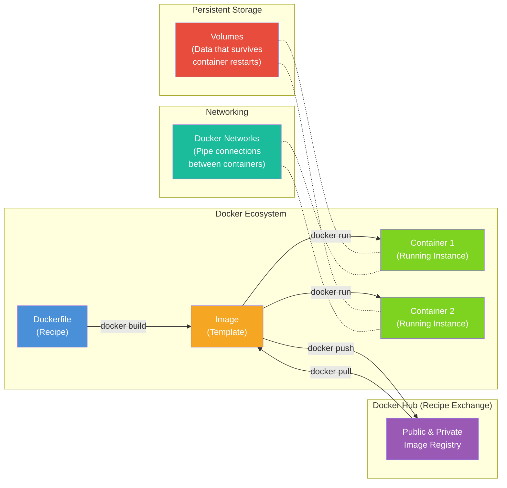

---

## 2. Test Pyramid (World 3-4)

The test pyramid: many fast unit tests at the base, some integration tests in the middle, and few slow E2E tests at the top. Build your confidence from the bottom up.

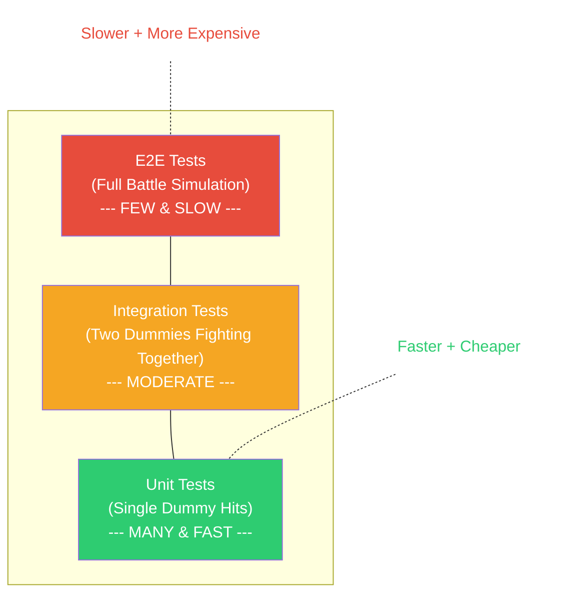

---

## 3. Software Development Lifecycle (World 3)

The full lifecycle of software: from the spark of an idea all the way through deployment and maintenance, with a feedback loop that drives continuous improvement.

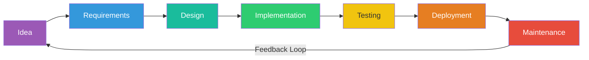

---

## 4. Programming Languages Map (World 3-9)

A mind map of programming languages organized by their primary domain. Some languages (like Rust) appear in multiple categories because they are versatile.

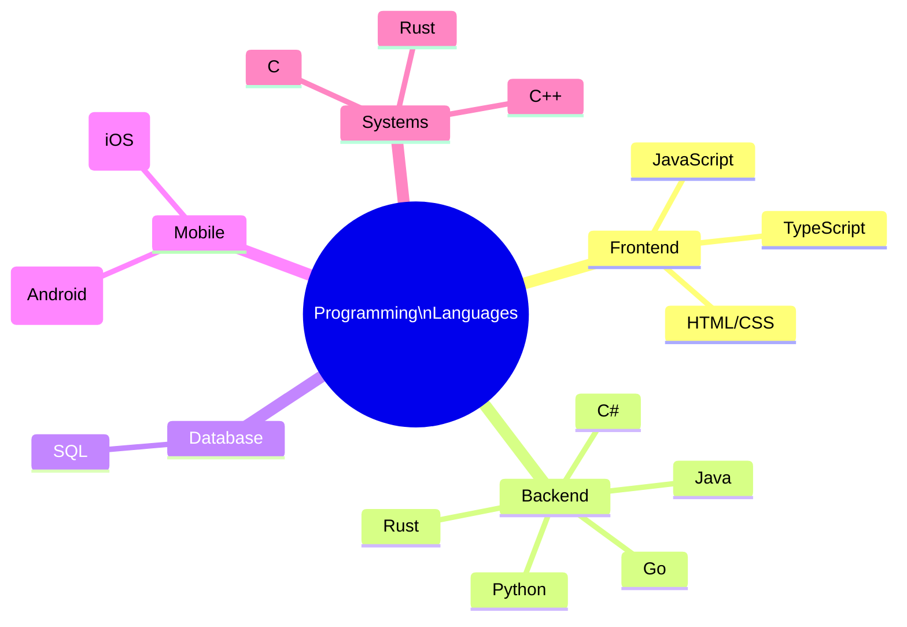

---

## 5. Package Dependency Tree (World 3-11)

Your app depends on packages, which depend on other packages. Conflicts arise when two packages need different versions of the same dependency -- the dreaded "dependency hell."

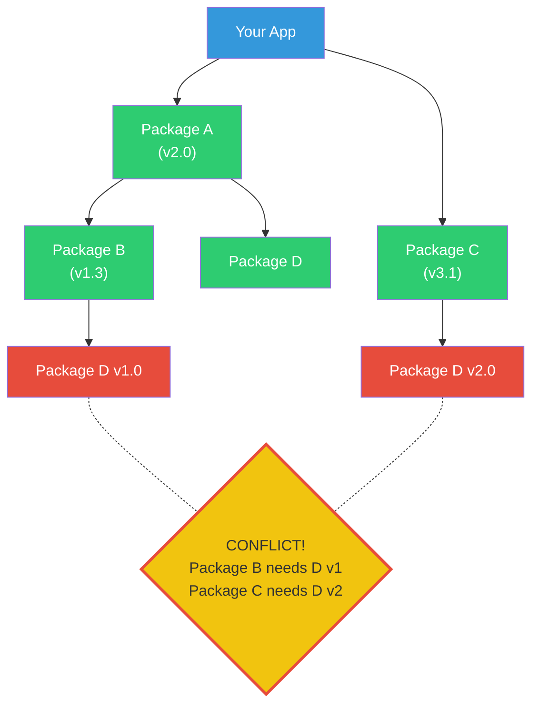

---

## 6. Authentication Flow - JWT (World 4-1)

JSON Web Token (JWT) authentication: the user logs in once, receives a signed token, and presents it with every subsequent request. The server validates the token without needing to look anything up in a database.

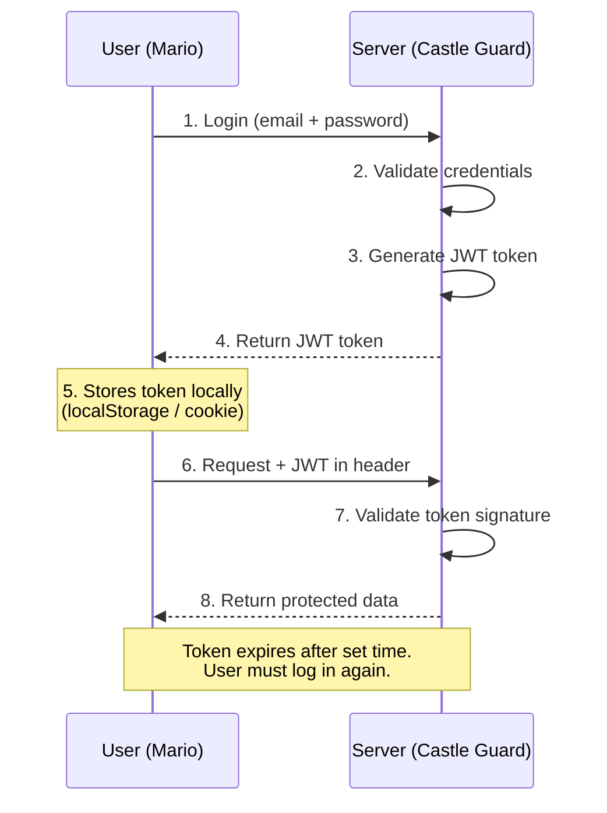

---

## 7. OAuth 2.0 Flow (World 4-1)

OAuth 2.0 lets users log into your app using their Google, Microsoft, or GitHub account. Your app never sees their password -- it only receives a token from the identity provider.

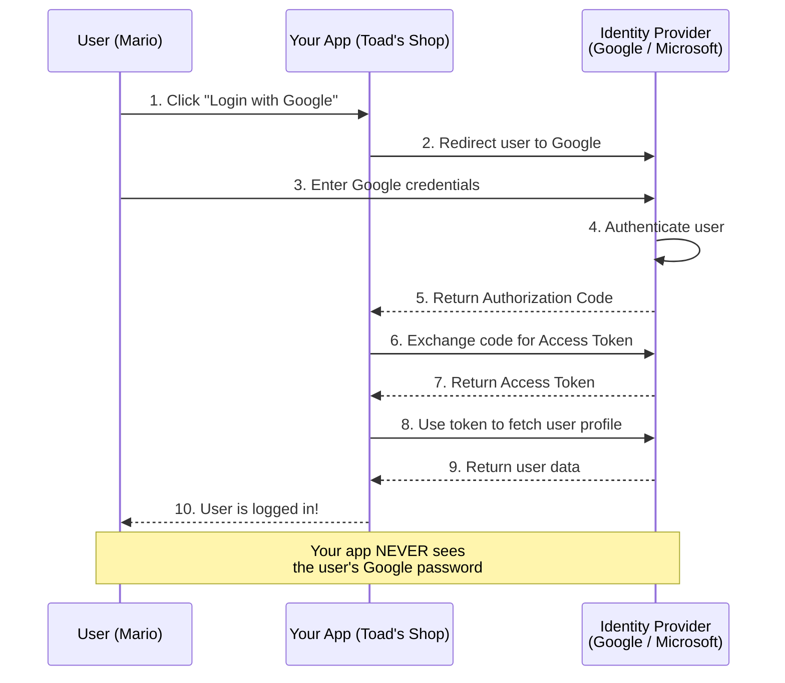

---

## 8. Cloud Service Models (World 4-2)

Cloud service models determine how much you manage vs. how much the provider manages. Moving from left to right, you give up more control but gain more convenience.

---

## 9. Microservices vs Monolith (World 4-3)

A monolith packs everything into one deployable unit. Microservices split the system into small, independently deployable services connected through APIs. Each has trade-offs.

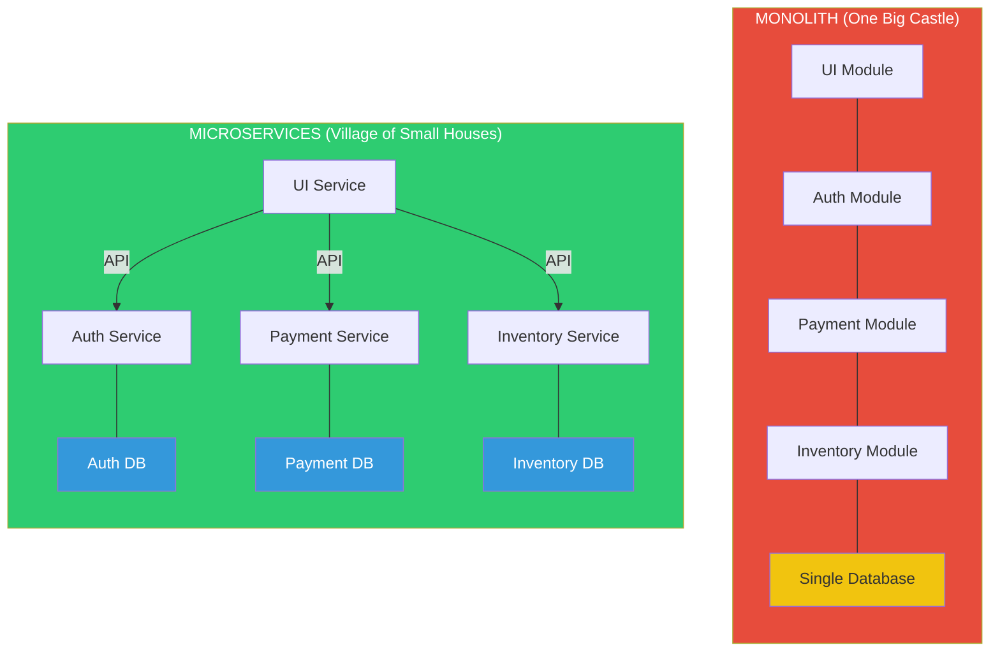

---

## 10. Deployment Strategies (World 4-4)

Three common deployment strategies: Blue-Green (instant swap), Canary (gradual traffic shift), and Rolling (one instance at a time). Each reduces risk in a different way.

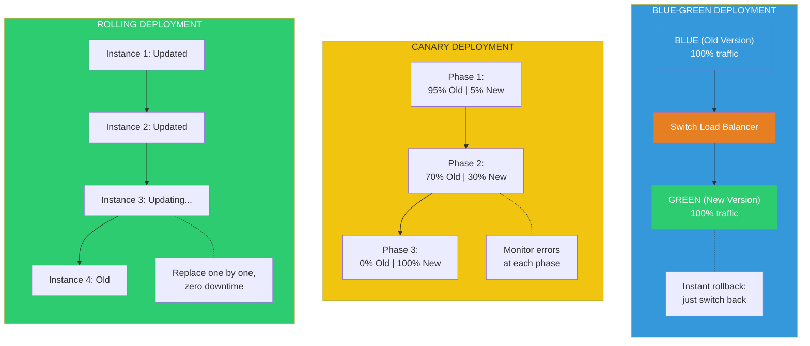

---

## 11. Git Flow vs GitHub Flow (World 4-5)

Git Flow uses multiple long-lived branches for structured releases. GitHub Flow keeps it simple: one main branch and short-lived feature branches merged via pull requests.

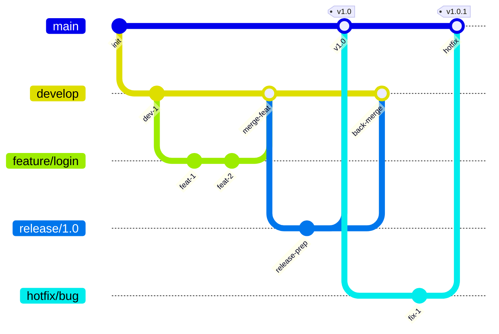

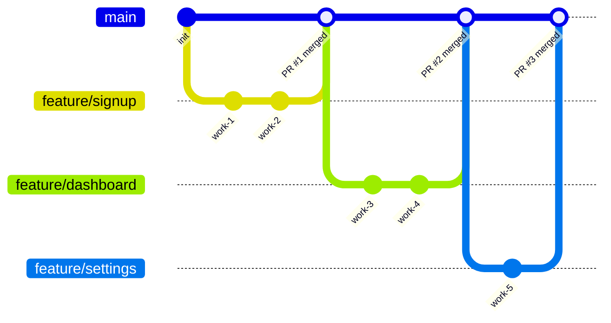

**Git Flow** (first diagram): Multiple long-lived branches -- `main`, `develop`, `feature/*`, `release/*`, `hotfix/*`. Best for scheduled release cycles.

**GitHub Flow** (second diagram): Only `main` and short-lived feature branches. Every merge goes through a Pull Request. Best for continuous deployment.

---

## 12. Caching Layers (World 4-7)

Caching stores copies of data at multiple levels to avoid slow trips to the database. The closer to the user, the faster the response -- but the harder it is to keep data fresh.

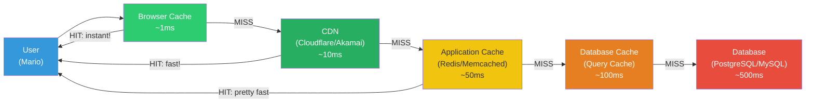

---

## 13. Message Queue Pattern (World 4-8)

Message queues decouple producers from consumers. Mario (producer) drops messages into the queue (post office) and moves on immediately. Toads (consumers) process messages at their own pace. This is asynchronous communication.

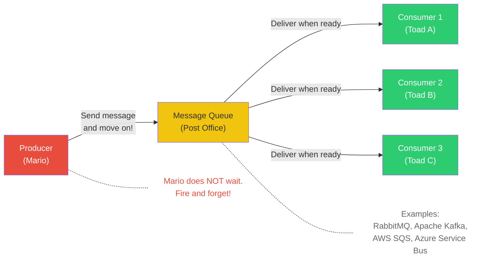

---

> **Tip:** To render these diagrams, paste them into any Mermaid-compatible viewer such as [mermaid.live](https://mermaid.live), GitHub markdown preview, VS Code with a Mermaid extension, or Notion.
