# Mermaid Diagrams - Worlds 5 and 6

---

## 1. DevOps Evolution Timeline (World 5-1)

Shows the three eras of DevOps: from manual operations, through security-integrated pipelines, to AI-driven autonomous agents.

```mermaid
graph LR
    subgraph ERA1["Traditional DevOps (2010s)"]
        A1[Manual Scripts]
        A2[CI/CD Pipelines]
        A3[Infrastructure as Code]
        A4[Monitoring & Alerts]
    end

    subgraph ERA2["DevSecOps (2018+)"]
        B1[Security Shift-Left]
        B2[Automated Scanning]
        B3[Policy as Code]
        B4[Compliance Built-in]
    end

    subgraph ERA3["Agentic DevOps (2024+)"]
        C1[AI Agents in Pipeline]
        C2[Self-Healing Systems]
        C3[Natural Language Ops]
        C4[Autonomous Decisions]
    end

    ERA1 -->|"+ Security"| ERA2
    ERA2 -->|"+ AI Agents"| ERA3

    style ERA1 fill:#4a90d9,stroke:#333,color:#fff
    style ERA2 fill:#e6a817,stroke:#333,color:#fff
    style ERA3 fill:#2ecc71,stroke:#333,color:#fff
```

---

## 2. AI Maturity Levels (World 5-2)

A staircase showing the five levels of AI maturity in DevOps, from no AI at all to fully autonomous agent armies.

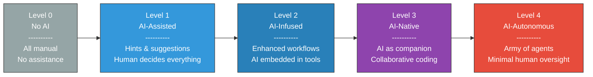

---

## 3. GitHub Copilot Modes (World 5-3)

All GitHub Copilot modes arranged by autonomy level, from simple code completions to fully autonomous coding agent.

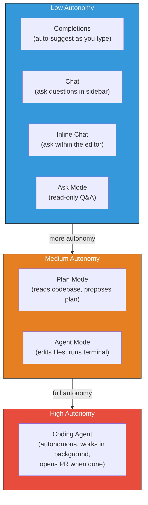

---

## 4. What Is an Agent - Components (World 5-4)

An agent has five core components, each serving a distinct purpose. The Brain (LLM) sits at the center.

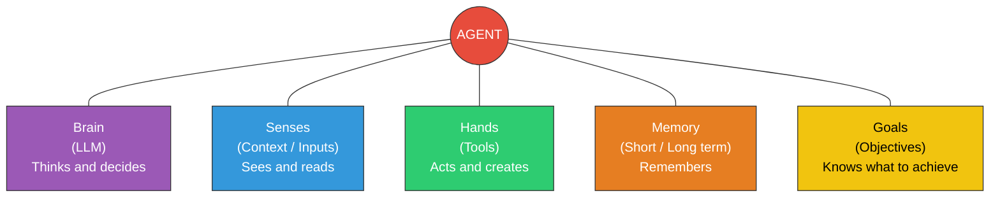

---

## 5. Agent Loop - Sense-Think-Act (World 5-4)

The continuous agent loop: observe the environment, think about it, plan next steps, act, get results, and repeat.

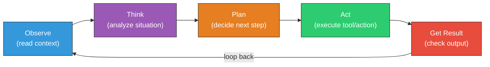

---

## 6. Types of Agents (World 5-5)

Four types of agents arranged along two axes: interactivity (real-time vs async) and audience (developer vs end-user).

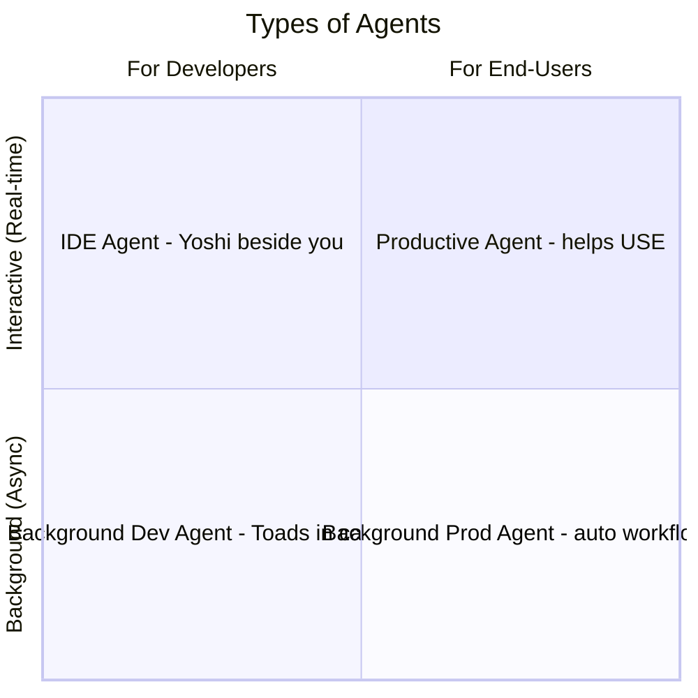

---

## 7. Autonomous Agent with Guardrails (World 5-6)

An autonomous agent decomposes goals into sub-tasks, executes them, and self-evaluates -- all within strict guardrails.

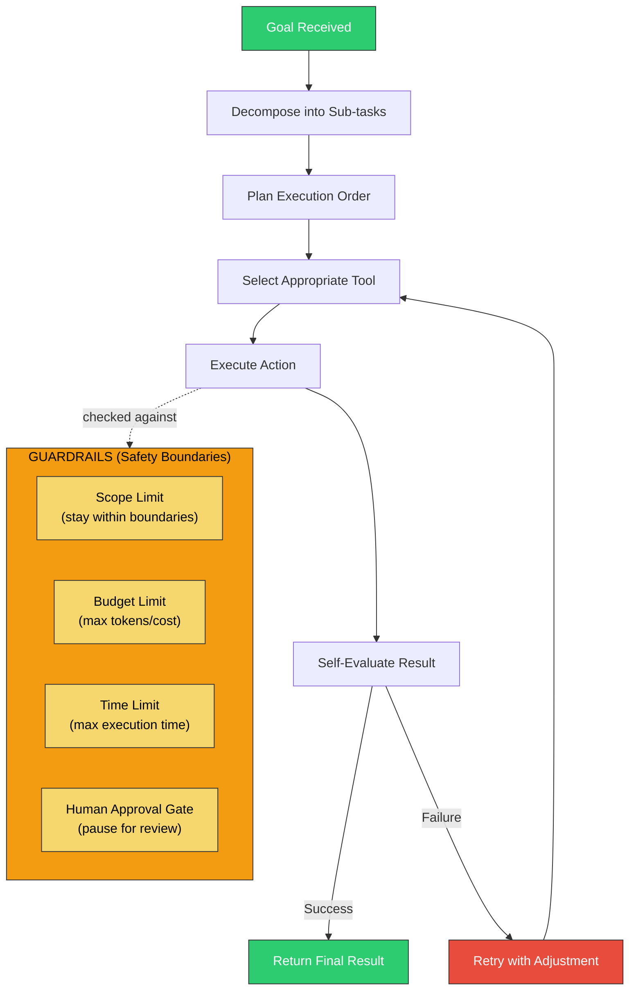

---

## 8. MCP Architecture (World 5-7)

The Model Context Protocol (MCP) connects a client (your agent) to multiple specialized servers through a standardized protocol.

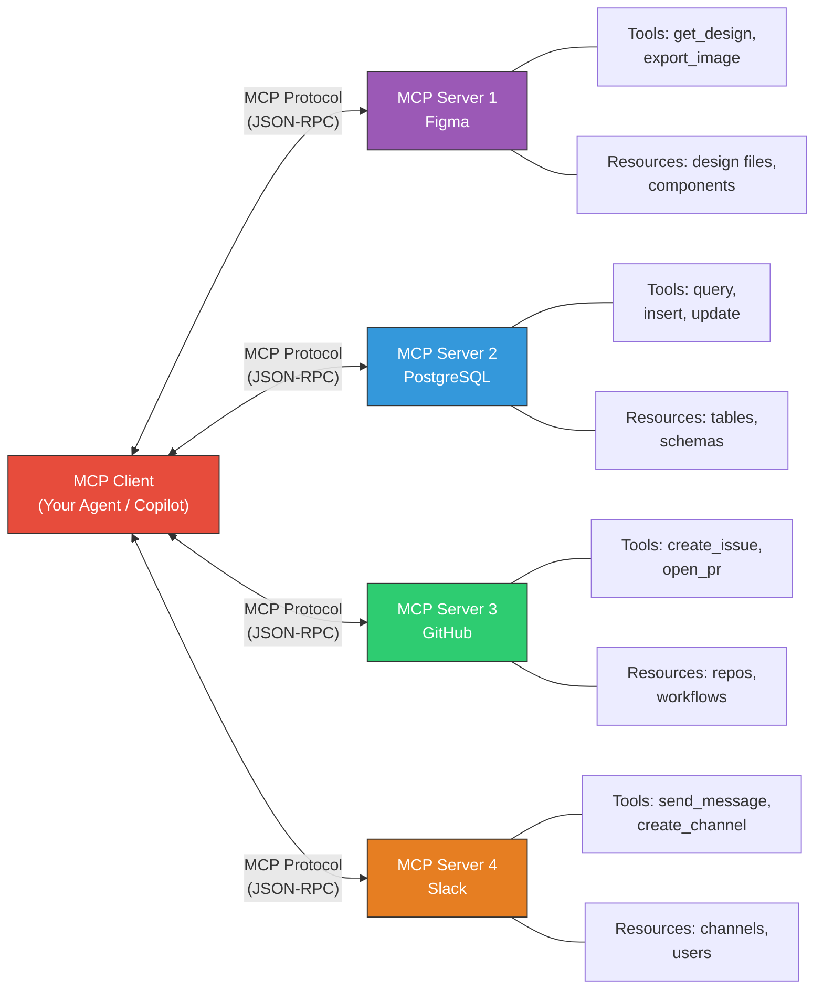

---

## 9. GitHub Advanced Security (World 5-9)

GHAS provides five integrated security features that work together to protect your codebase.

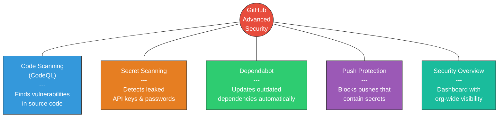

---

## 10. Custom Agent Structure (World 6-1)

The anatomy of a `.agent.md` file: YAML frontmatter for configuration and Markdown body for behavior instructions.

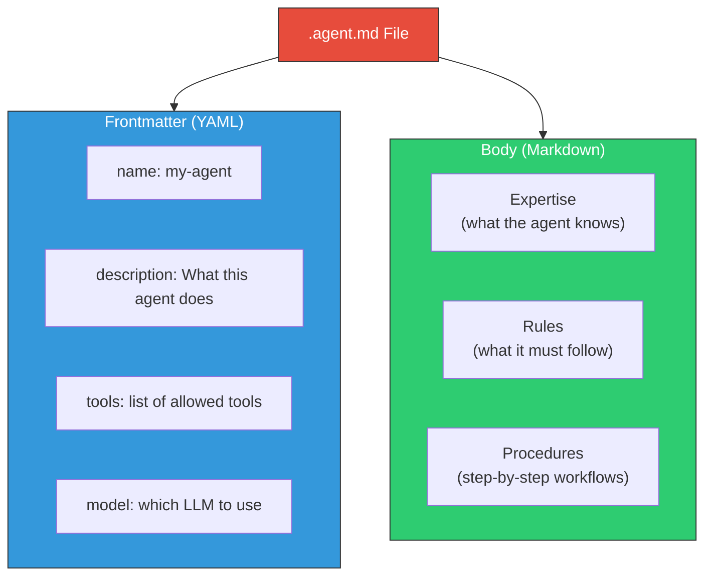

---

## 11. Skill Activation Flow (World 6-2)

When a user sends a prompt, Copilot reads all SKILL.md descriptions, looks for a semantic match, and loads the matching skill.

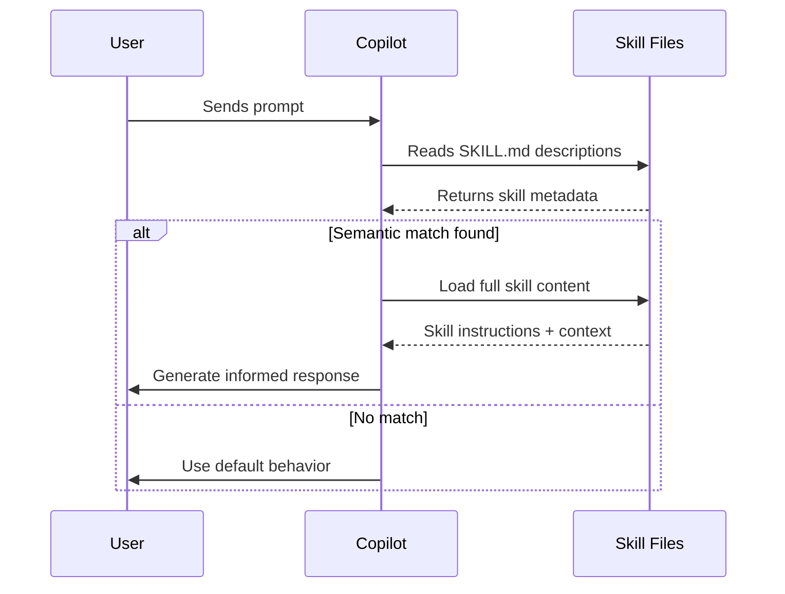

---

## 12. Instructions vs Skills vs Agents vs Prompts (World 6)

A comparison of the four customization mechanisms, showing when and how each is activated.

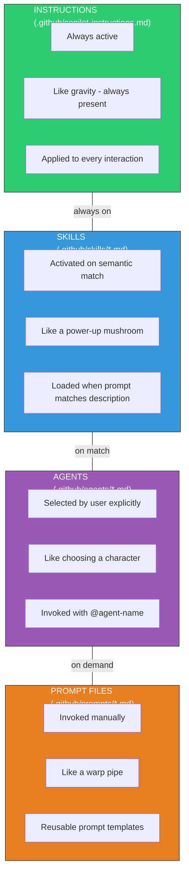

---

## 13. Hooks Lifecycle (World 6-5)

The complete Git hooks lifecycle: from editing code to pushing to GitHub, with validation gates at every step.

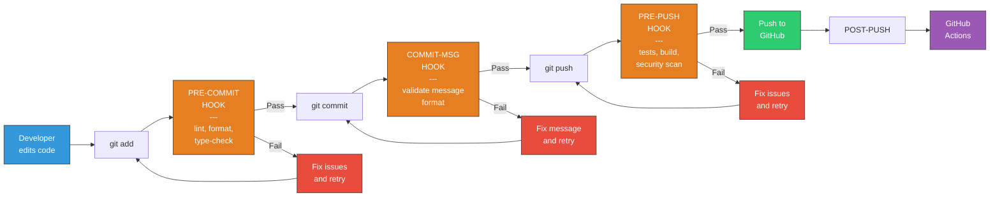

---

## 14. Orchestration Flow (World 6-7)

The orchestrator receives a user request, classifies it, loads the right skill, delegates to a specialist agent, and manages gates.

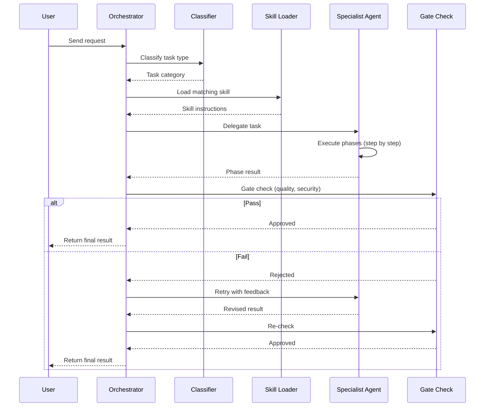

---

## 15. Token Optimization - COIN Framework (World 6-8)

An efficient prompt is built from four components: Context, Objective, Input, and Nuances. Together they minimize token waste.

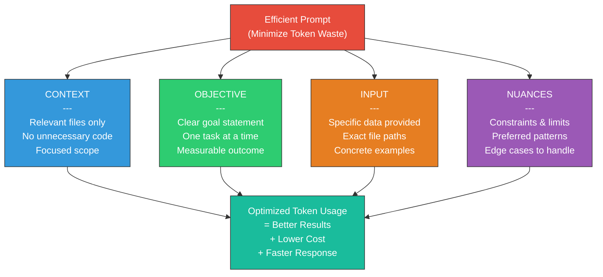
