# DIAGRAMS - WORLDS 7 & 8
## Agentic DevOps for Beginners

---

## 1. AZURE AI FOUNDRY PIPELINE (World 7-1)

The Azure AI Foundry is like a factory where you select, configure, test, and deploy AI models. This diagram shows the end-to-end pipeline from model selection to production monitoring.

```mermaid
flowchart LR
    subgraph CATALOG["1 - MODEL CATALOG"]
        SELECT["Select Model"]
        GPT4o["GPT-4o"]
        CLAUDE["Claude"]
        LLAMA["Llama"]
        PHI["Phi"]
        GPT4o --- SELECT
        CLAUDE --- SELECT
        LLAMA --- SELECT
        PHI --- SELECT
    end

    subgraph PLAYGROUND["2 - PLAYGROUND"]
        CONFIG["Configure Model\nTemperature, Tokens,\nSystem Prompt"]
    end

    subgraph PROMPTFLOW["3 - PROMPT FLOW"]
        BUILD["Build Flow\nChain prompts,\nAdd logic,\nConnect data"]
    end

    subgraph TESTING["4 - TESTING ARENA"]
        EVAL["Evaluate\nAccuracy, Latency,\nGroundedness,\nSafety"]
    end

    subgraph DEPLOY["5 - DEPLOYMENT"]
        ENDPOINT["Deploy to Endpoint\nREST API\nScaling rules\nAuth keys"]
    end

    subgraph OPS["6 - OPERATIONS"]
        MONITOR["Monitor\nUsage metrics\nCost tracking\nDrift detection"]
    end

    CATALOG -->|"Pick best model\nfor your task"| PLAYGROUND
    PLAYGROUND -->|"Tune parameters\ntest interactively"| PROMPTFLOW
    PROMPTFLOW -->|"Design the\nfull pipeline"| TESTING
    TESTING -->|"Passes quality\ngates"| DEPLOY
    DEPLOY -->|"Live in\nproduction"| OPS
    OPS -->|"Feedback loop\nretrain/update"| CATALOG

    style CATALOG fill:#4A90D9,color:#fff
    style PLAYGROUND fill:#7B68EE,color:#fff
    style PROMPTFLOW fill:#E67E22,color:#fff
    style TESTING fill:#27AE60,color:#fff
    style DEPLOY fill:#E74C3C,color:#fff
    style OPS fill:#8E44AD,color:#fff
```

---

## 2. RAG ARCHITECTURE (World 7-2)

RAG (Retrieval-Augmented Generation) is the technique that gives LLMs access to YOUR data. It has three phases: Indexing (prepare documents), Retrieval (find relevant pieces), and Generation (produce a grounded answer).

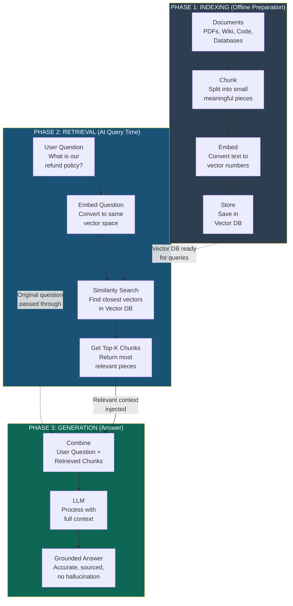

---

## 3. RAG vs NO RAG (World 7-2)

A side-by-side comparison showing why RAG matters. Without RAG, the LLM can only use its training data and may hallucinate. With RAG, it retrieves real documents first and produces grounded, accurate answers.

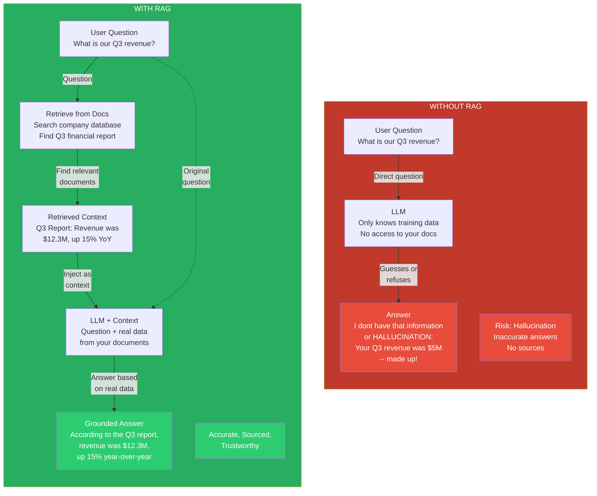

---

## 4. LANGCHAIN COMPONENTS (World 7-3)

LangChain is a framework that connects LLMs to the real world. Think of it as a toolbox where each drawer holds a different capability. The central hub connects all the pieces together.

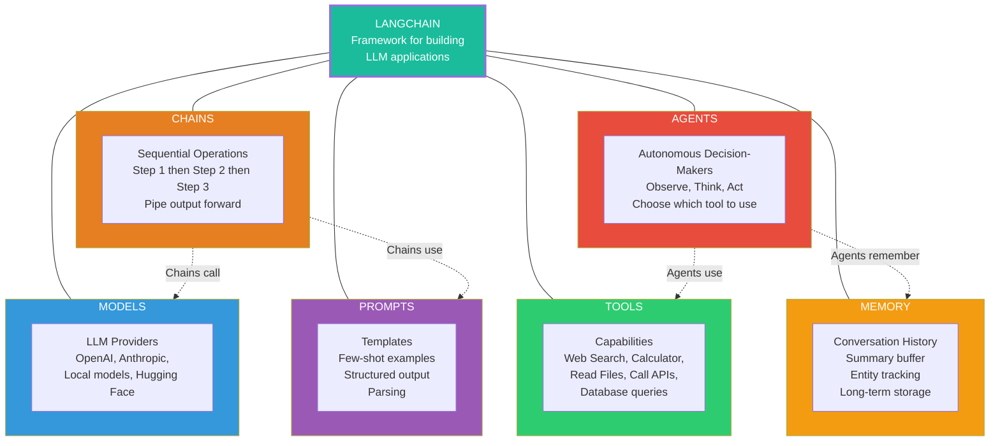

---

## 5. LANGCHAIN vs SEMANTIC KERNEL vs AUTOGEN (World 7-4)

Three major frameworks for building AI applications. Each has a different philosophy and approach, but all three can build intelligent agents.

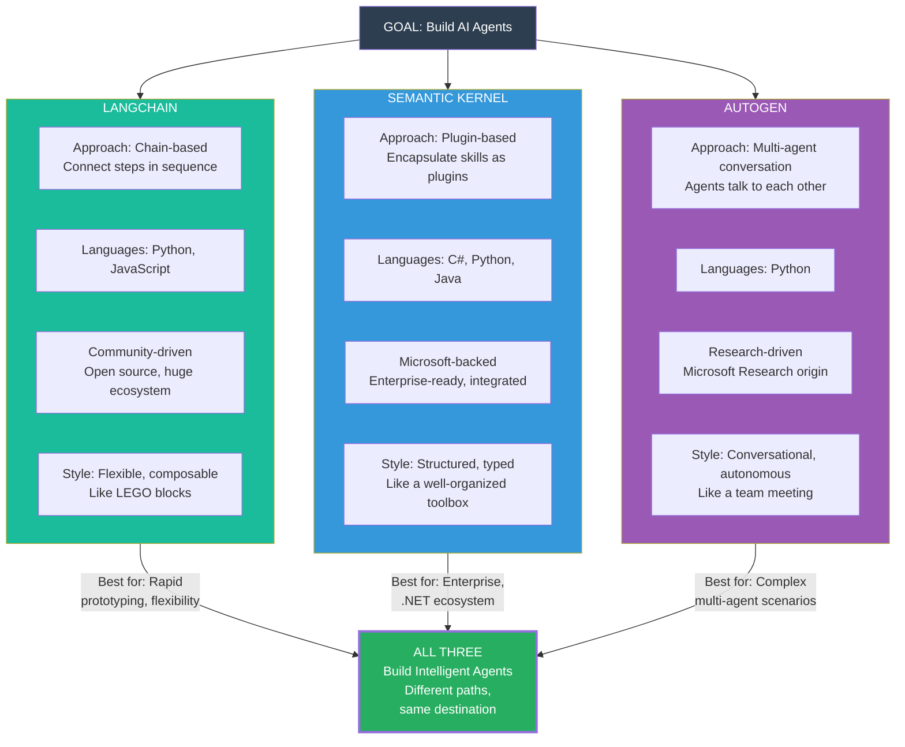

---

## 6. MICROSOFT AGENTIC FRAMEWORK ECOSYSTEM (World 7-4)

How all the Microsoft AI tools fit together. Azure AI Foundry provides the models, Semantic Kernel is the SDK that powers applications, and multiple tools build on top of this foundation.

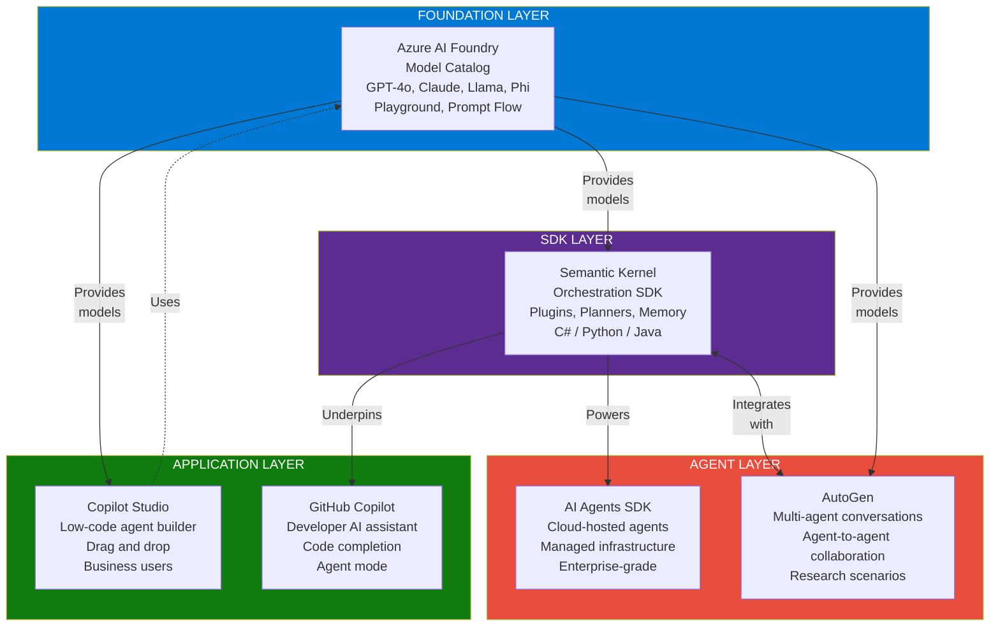

---

## 7. THE 4 CHANNELS OF AGENT OPERATION (World 7-5) -- CRITICAL DIAGRAM

This is one of the most important concepts: agents do not operate in just one way. There are FOUR distinct channels where AI agents work, each with different interaction patterns and use cases.

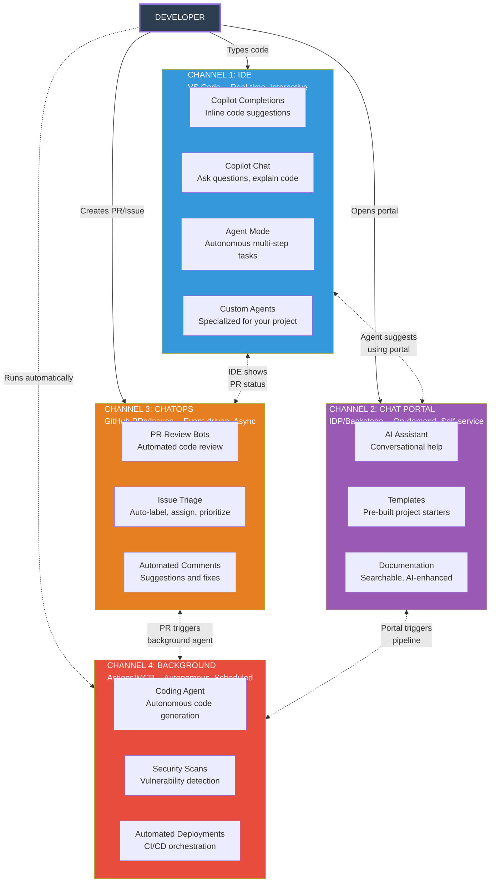

---

## 8. IDP / BACKSTAGE ARCHITECTURE (World 7-6)

Backstage is the Internal Developer Platform (IDP) -- a central hub (like a castle) where developers find everything they need. It connects all tools and services into one unified portal.

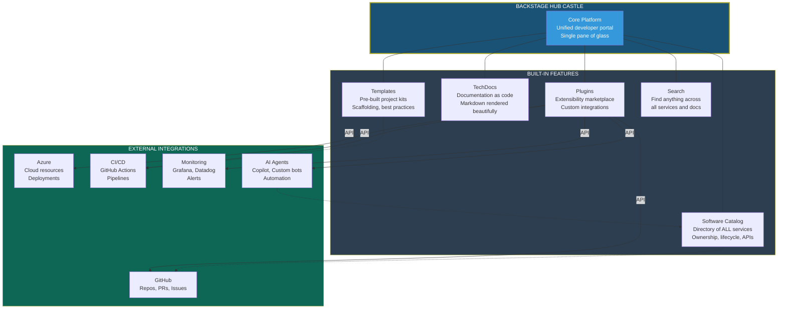

---

## 9. THE COMPLETE ECOSYSTEM MAP (World 8-1) -- MOST IMPORTANT DIAGRAM

This is the big picture. Every tool, platform, and concept from all 8 worlds connected together. This shows how everything fits into one unified Agentic DevOps ecosystem.

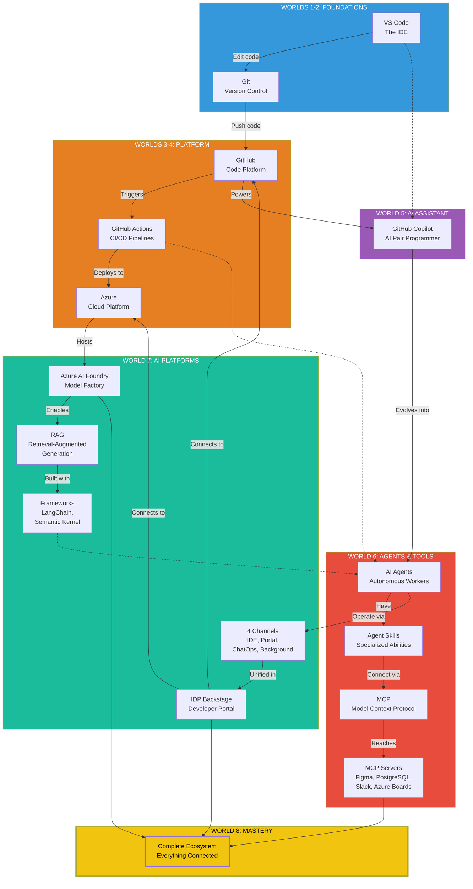

---

## 10. DEVELOPER JOURNEY - From START to FINAL (World 8-1)

The complete path through all 8 worlds. Each step builds on the previous one, taking you from beginner to Agentic DevOps master.

---

## 11. THE THREE LOOPS (World 8-1)

Modern development has three loops. The Inner Loop is fast (on your machine), the Outer Loop goes through the pipeline, and the AI Loop is the new autonomous layer that observes and acts independently.

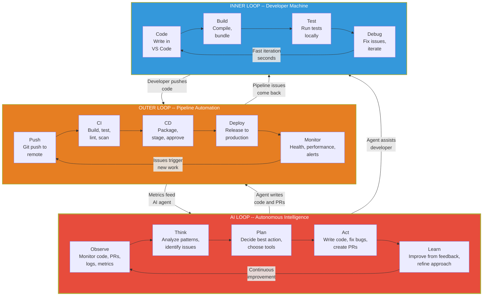

---

## 12. BOSS BATTLE SEQUENCE (World 8)

The final challenge! Four bosses guard the path to production. Each one tests a different aspect of code quality. You must defeat ALL four to deploy.

```mermaid
flowchart LR
    CODE["YOUR CODE\nReady for battle"]

    subgraph BOSS1["BOSS 1: TSC\nBowser Jr\nType Checking"]
        TSC["TypeScript Compiler\nAre all types correct?\nNo type errors allowed!"]
        TSC_PASS["DEFEATED"]
        TSC_FAIL["GAME OVER\nFix type errors"]
    end

    subgraph BOSS2["BOSS 2: JEST\nBoom Boom\nAll Tests Passing"]
        JEST["Test Runner\nDo all tests pass?\nNo failures allowed!"]
        JEST_PASS["DEFEATED"]
        JEST_FAIL["GAME OVER\nFix failing tests"]
    end

    subgraph BOSS3["BOSS 3: ESLINT\nKamek\nCode Quality"]
        ESLINT["Linter\nIs code clean?\nNo lint errors allowed!"]
        ESLINT_PASS["DEFEATED"]
        ESLINT_FAIL["GAME OVER\nFix lint errors"]
    end

    subgraph BOSS4["BOSS 4: ZERO ANY\nBowser\nNo TypeScript Escapes"]
        ZEROANY["Any Counter\nZero uses of any type?\nNo escapes allowed!"]
        ZEROANY_PASS["DEFEATED"]
        ZEROANY_FAIL["GAME OVER\nRemove all any types"]
    end

    VICTORY["VICTORY\nAll bosses defeated!"]
    DEPLOY["DEPLOY TO PRODUCTION\nGame Complete!"]

    CODE -->|"Challenge 1"| TSC
    TSC -->|"PASS"| TSC_PASS
    TSC -->|"FAIL"| TSC_FAIL
    TSC_PASS -->|"Challenge 2"| JEST
    JEST -->|"PASS"| JEST_PASS
    JEST -->|"FAIL"| JEST_FAIL
    JEST_PASS -->|"Challenge 3"| ESLINT
    ESLINT -->|"PASS"| ESLINT_PASS
    ESLINT -->|"FAIL"| ESLINT_FAIL
    ESLINT_PASS -->|"Final Boss"| ZEROANY
    ZEROANY -->|"PASS"| ZEROANY_PASS
    ZEROANY -->|"FAIL"| ZEROANY_FAIL
    ZEROANY_PASS -->|"ALL CLEAR"| VICTORY
    VICTORY -->|"Ship it!"| DEPLOY

    TSC_FAIL -->|"Retry"| CODE
    JEST_FAIL -->|"Retry"| CODE
    ESLINT_FAIL -->|"Retry"| CODE
    ZEROANY_FAIL -->|"Retry"| CODE

    style CODE fill:#3498DB,color:#fff
    style BOSS1 fill:#E67E22,color:#fff
    style BOSS2 fill:#9B59B6,color:#fff
    style BOSS3 fill:#E67E22,color:#fff
    style BOSS4 fill:#C0392B,color:#fff
    style VICTORY fill:#F1C40F,color:#000,stroke-width:3px
    style DEPLOY fill:#27AE60,color:#fff,stroke-width:4px
    style TSC_FAIL fill:#E74C3C,color:#fff
    style JEST_FAIL fill:#E74C3C,color:#fff
    style ESLINT_FAIL fill:#E74C3C,color:#fff
    style ZEROANY_FAIL fill:#E74C3C,color:#fff
    style TSC_PASS fill:#27AE60,color:#fff
    style JEST_PASS fill:#27AE60,color:#fff
    style ESLINT_PASS fill:#27AE60,color:#fff
    style ZEROANY_PASS fill:#27AE60,color:#fff
```
