# Agentic DevOps -- Super Mario Edition: World Map Diagrams (W1 & W2)

A visual collection of Mermaid diagrams covering the complete world map overview,
all World 1 levels, and all World 2 levels of the Agentic DevOps guide.

---

## 1. THE COMPLETE WORLD MAP -- Overview of All 8 Worlds

This diagram shows the full journey from World 1 through World 8.
Each world is a major chapter in the Agentic DevOps adventure, with key topics listed as sub-nodes.

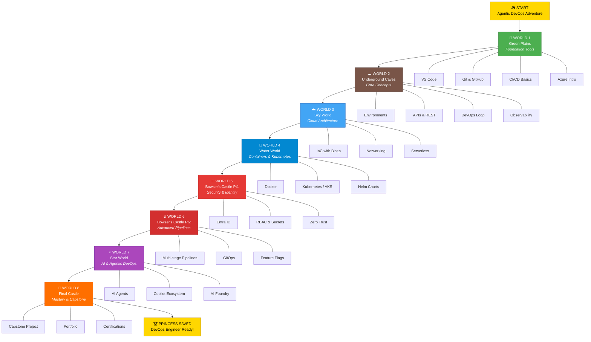

---

## 2. VS CODE ECOSYSTEM -- World 1-1

World 1-1 introduces VS Code as Mario's main tool belt.
This diagram shows VS Code at the center and all the key capabilities surrounding it.

```mermaid
graph TD
    VSC["🔧 VS CODE<br/>Mario's Workshop"]

    VSC --> EXT["🧩 Extensions<br/>Power-Up Marketplace"]
    VSC --> TERM["💻 Integrated Terminal<br/>Command Warp Pipe"]
    VSC --> GIT["🔀 Git Integration<br/>Save Game System"]
    VSC --> COP["🤖 GitHub Copilot<br/>Yoshi AI Companion"]
    VSC --> SET["⚙️ Settings & Config<br/>Controller Setup"]
    VSC --> DBG["🐛 Debugger<br/>Bug Squashing Mode"]

    EXT --> EXT1["Python / JS / C#"]
    EXT --> EXT2["Docker Extension"]
    EXT --> EXT3["Azure Extensions"]
    EXT --> EXT4["Prettier / ESLint"]

    COP --> COP1["Code Completion"]
    COP --> COP2["Copilot Chat"]
    COP --> COP3["Copilot Edits"]

    GIT --> GIT1["Diff Viewer"]
    GIT --> GIT2["Branch Manager"]
    GIT --> GIT3["Commit History"]

    DBG --> DBG1["Breakpoints"]
    DBG --> DBG2["Watch Variables"]
    DBG --> DBG3["Call Stack"]

    style VSC fill:#007ACC,stroke:#005A9E,color:#fff
    style EXT fill:#68217A,stroke:#4B0E5E,color:#fff
    style TERM fill:#1E1E1E,stroke:#333,color:#0f0
    style GIT fill:#F05032,stroke:#C03022,color:#fff
    style COP fill:#000,stroke:#333,color:#fff
    style SET fill:#6C6C6C,stroke:#444,color:#fff
    style DBG fill:#CC6633,stroke:#994422,color:#fff
```

---

## 3. GIT WORKFLOW -- Save Game System (World 1-2)

World 1-2 teaches Git as the "Save Game System."
This flowchart shows the complete lifecycle of code changes, including branching and merging.

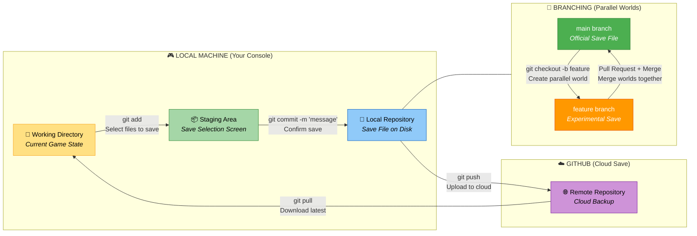

---

## 4. GITHUB PLATFORM MAP -- World 1-3

World 1-3 explores the GitHub platform as a full adventure hub.
This diagram maps GitHub at the center with all its major features radiating outward.

```mermaid
graph TD
    GH["🐙 GITHUB<br/>The Adventure Hub"]

    GH --> REPO["📁 Repositories<br/>Game Worlds"]
    GH --> ISS["📋 Issues<br/>Quest Board"]
    GH --> PR["🔀 Pull Requests<br/>Level Review Gate"]
    GH --> ACT["⚡ Actions<br/>CI/CD Automation"]
    GH --> PROJ["📊 Projects<br/>Campaign Map"]
    GH --> CS["☁️ Codespaces<br/>Portable Dev Console"]
    GH --> PAG["🌐 Pages<br/>Trophy Display"]
    GH --> DISC["💬 Discussions<br/>Toad's Town Forum"]
    GH --> SEC["🔒 Security<br/>Castle Defenses"]

    REPO --> REPO1["Code Storage"]
    REPO --> REPO2["README & Docs"]
    REPO --> REPO3["Releases & Tags"]

    ISS --> ISS1["Bug Reports"]
    ISS --> ISS2["Feature Requests"]
    ISS --> ISS3["Task Tracking"]

    PR --> PR1["Code Review"]
    PR --> PR2["Status Checks"]
    PR --> PR3["Auto-merge"]

    ACT --> ACT1["Workflows"]
    ACT --> ACT2["Reusable Actions"]
    ACT --> ACT3["Self-hosted Runners"]

    SEC --> SEC1["Dependabot"]
    SEC --> SEC2["Code Scanning"]
    SEC --> SEC3["Secret Scanning"]

    style GH fill:#24292E,stroke:#1B1F23,color:#fff
    style REPO fill:#0366D6,stroke:#0246A2,color:#fff
    style ISS fill:#28A745,stroke:#1E7E34,color:#fff
    style PR fill:#6F42C1,stroke:#4C2889,color:#fff
    style ACT fill:#2088FF,stroke:#0066CC,color:#fff
    style PROJ fill:#0075CA,stroke:#005EA6,color:#fff
    style CS fill:#F9826C,stroke:#D65D4A,color:#fff
    style PAG fill:#22863A,stroke:#176F2C,color:#fff
    style DISC fill:#8957E5,stroke:#6639BA,color:#fff
    style SEC fill:#D73A49,stroke:#B42D3A,color:#fff
```

---

## 5. CI/CD PIPELINE -- Lakitu's Assembly Line (World 1-4)

World 1-4 introduces CI/CD pipelines using the metaphor of Lakitu running an assembly line in the clouds.
Each step is a cloud station where Lakitu checks the code before it moves on.

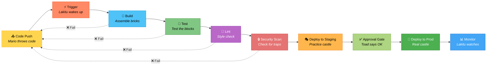

---

## 6. AZURE SERVICES MAP -- World 1-5

World 1-5 introduces Azure as the cloud kingdom.
This diagram shows Azure at the center with its main service categories and key services in each.

```mermaid
graph TD
    AZ["☁️ AZURE<br/>The Cloud Kingdom"]

    AZ --> COMP["⚙️ Compute"]
    AZ --> STOR["📦 Storage"]
    AZ --> DB["🗄️ Database"]
    AZ --> IDEN["🔐 Identity"]
    AZ --> AI["🤖 AI Services"]
    AZ --> DEVOPS["🔧 DevOps"]

    COMP --> C1["App Service<br/><i>Web App Hosting</i>"]
    COMP --> C2["AKS<br/><i>Kubernetes Cluster</i>"]
    COMP --> C3["Functions<br/><i>Serverless Power-Ups</i>"]
    COMP --> C4["Container Apps<br/><i>Managed Containers</i>"]

    STOR --> S1["Blob Storage<br/><i>Item Chest</i>"]
    STOR --> S2["Queue Storage<br/><i>Message Pipeline</i>"]
    STOR --> S3["Table Storage<br/><i>Simple Data Grid</i>"]

    DB --> D1["Azure SQL<br/><i>Relational Vault</i>"]
    DB --> D2["Cosmos DB<br/><i>Multi-Model Galaxy DB</i>"]

    IDEN --> I1["Entra ID<br/><i>Castle Gatekeeper</i>"]
    IDEN --> I2["Key Vault<br/><i>Secret Star Storage</i>"]

    AI --> A1["Azure OpenAI<br/><i>AI Brain</i>"]
    AI --> A2["AI Foundry<br/><i>Agent Workshop</i>"]

    DEVOPS --> DV1["Azure DevOps<br/><i>Pipeline HQ</i>"]
    DEVOPS --> DV2["GitHub Integration<br/><i>Adventure Hub Link</i>"]

    style AZ fill:#0078D4,stroke:#005A9E,color:#fff
    style COMP fill:#F25022,stroke:#C4401C,color:#fff
    style STOR fill:#7FBA00,stroke:#5F8C00,color:#fff
    style DB fill:#00A4EF,stroke:#0082BE,color:#fff
    style IDEN fill:#FFB900,stroke:#CC9400,color:#000
    style AI fill:#737373,stroke:#505050,color:#fff
    style DEVOPS fill:#0078D4,stroke:#005A9E,color:#fff
```

---

## 7. HOW EVERYTHING CONNECTS -- World 1 Complete Flow (World 1-7)

World 1-7 ties together all World 1 concepts into a single end-to-end sequence.
This sequence diagram shows the journey of code from a developer's keyboard to the end user.

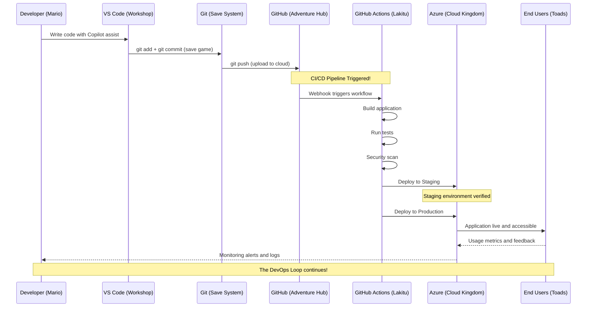

---

## 8. ENVIRONMENTS -- Parallel Worlds (World 2-1)

World 2-1 explains environments as parallel worlds in the game.
Code must pass through each world before reaching the real players.

```mermaid
graph LR
    subgraph DEV_WORLD ["🟢 DEV WORLD (Practice Mode)"]
        DEV1["Developers test freely"]
        DEV2["Bugs are expected"]
        DEV3["Frequent deploys"]
    end

    subgraph STG_WORLD ["🟡 STAGING WORLD (Dress Rehearsal)"]
        STG1["Mirrors production"]
        STG2["QA team testing"]
        STG3["Performance checks"]
    end

    subgraph PROD_WORLD ["🔴 PRODUCTION WORLD (The Real Deal)"]
        PROD1["Real users here"]
        PROD2["Maximum stability"]
        PROD3["24/7 monitoring"]
    end

    DEV_WORLD -- "✅ Tests pass<br/>PR approved" --> STG_WORLD
    STG_WORLD -- "✅ QA approved<br/>Load tested" --> PROD_WORLD

    CODE["💻 New Code"] --> DEV_WORLD
    PROD_WORLD --> USERS["👥 Real Users"]

    style DEV_WORLD fill:#C8E6C9,stroke:#388E3C,color:#000
    style STG_WORLD fill:#FFF9C4,stroke:#F9A825,color:#000
    style PROD_WORLD fill:#FFCDD2,stroke:#C62828,color:#000
    style CODE fill:#E3F2FD,stroke:#1565C0,color:#000
    style USERS fill:#F3E5F5,stroke:#7B1FA2,color:#000
```

---

## 9. API REQUEST/RESPONSE -- Toad the Messenger (World 2-2)

World 2-2 explains APIs using Toad as the messenger between Mario (client) and the Castle (server).
This sequence diagram shows a full API request/response cycle.

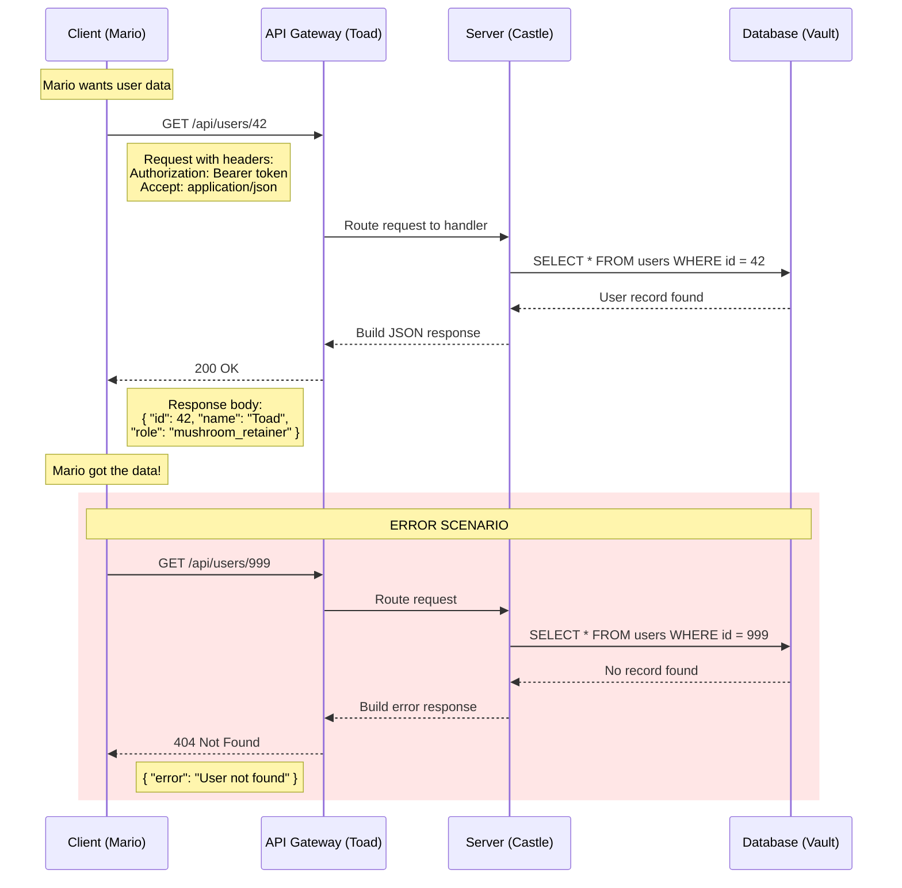

---

## 10. DEVOPS INFINITY LOOP -- World 2-6

World 2-6 presents the classic DevOps infinity loop.
This diagram shows the continuous cycle that never ends -- from planning to monitoring and back again.

```mermaid
graph LR
    PLAN["📋 PLAN<br/><i>Choose your quest</i>"]
    CODE["💻 CODE<br/><i>Write the solution</i>"]
    BUILD["🔨 BUILD<br/><i>Compile & package</i>"]
    TEST["🧪 TEST<br/><i>Verify it works</i>"]

    RELEASE["📦 RELEASE<br/><i>Prepare for launch</i>"]
    DEPLOY["🚀 DEPLOY<br/><i>Ship to castle</i>"]
    OPERATE["🔧 OPERATE<br/><i>Keep it running</i>"]
    MONITOR["📊 MONITOR<br/><i>Watch the kingdom</i>"]

    PLAN --> CODE --> BUILD --> TEST
    TEST --> RELEASE --> DEPLOY --> OPERATE --> MONITOR
    MONITOR --> PLAN

    style PLAN fill:#1976D2,stroke:#0D47A1,color:#fff
    style CODE fill:#388E3C,stroke:#1B5E20,color:#fff
    style BUILD fill:#F57C00,stroke:#E65100,color:#fff
    style TEST fill:#7B1FA2,stroke:#4A148C,color:#fff
    style RELEASE fill:#C2185B,stroke:#880E4F,color:#fff
    style DEPLOY fill:#D32F2F,stroke:#B71C1C,color:#fff
    style OPERATE fill:#00796B,stroke:#004D40,color:#fff
    style MONITOR fill:#455A64,stroke:#263238,color:#fff
```

The infinity loop represents the core DevOps principle: software delivery is never "done."
The left side (Plan through Test) represents the **DEV** side. The right side (Release through Monitor) represents the **OPS** side. Together they form a continuous loop.

---

## 11. OBSERVABILITY -- The Three Pillars (World 2-7)

World 2-7 covers observability using three pillars: Logs, Metrics, and Traces.
Each pillar has a Mario-themed metaphor and maps to real Azure tools.

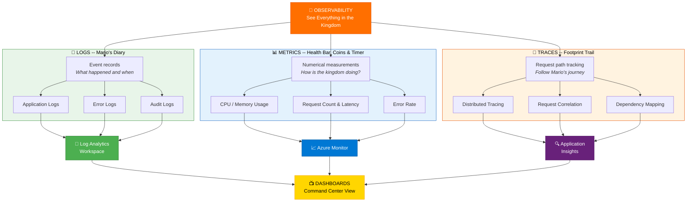

---

## Quick Reference: Diagram Index

| # | Diagram | World-Level | Type |
|---|---------|-------------|------|
| 1 | Complete World Map | Overview | graph TD |
| 2 | VS Code Ecosystem | W1-1 | graph TD |
| 3 | Git Workflow | W1-2 | flowchart LR |
| 4 | GitHub Platform Map | W1-3 | graph TD |
| 5 | CI/CD Pipeline | W1-4 | flowchart LR |
| 6 | Azure Services Map | W1-5 | graph TD |
| 7 | End-to-End Flow | W1-7 | sequence diagram |
| 8 | Environments | W2-1 | graph LR |
| 9 | API Request/Response | W2-2 | sequence diagram |
| 10 | DevOps Infinity Loop | W2-6 | graph LR |
| 11 | Observability Pillars | W2-7 | graph TD |
