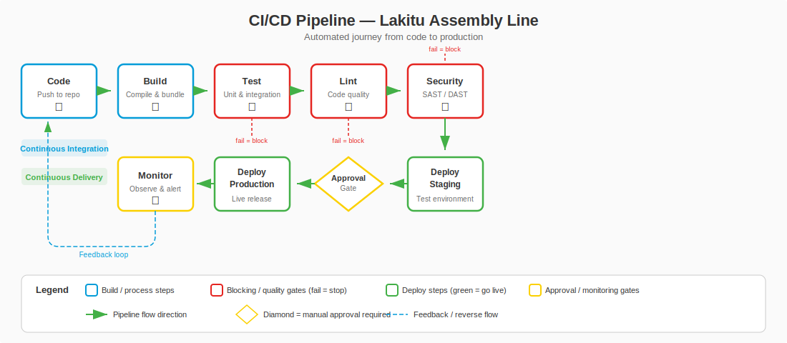

# Level 1-4 — The Working Lakitus: GitHub Actions and CI/CD

---

## Change Log

| Version | Date       | Author       | Description                     |
|---------|------------|--------------|-------------------------------|
| 1.0.0   | 2026-03-18 | Paula Silva  | Initial creation (Mario Edition)|

---

## Table of Contents

- [Prologue — The Lakitu That Works for You](#prologue--the-lakitu-that-works-for-you)
- [1. The Problem: Repetitive Tasks](#1-the-problem-repetitive-tasks)
  - [1.1 The Exhausting Manual Cycle](#11-the-exhausting-manual-cycle)
  - [1.2 What Could Be Automated?](#12-what-could-be-automated)
- [2. What Is CI/CD?](#2-what-is-cicd)
  - [2.1 CI — Continuous Integration](#21-ci--continuous-integration)
  - [2.2 CD — Continuous Delivery/Deployment](#22-cd--continuous-deliverydeployment)
  - [2.3 Table: CI/CD vs Lakitu](#23-table-cicd-vs-lakitu)
  - [2.4 Diagram: The CI/CD Pipeline](#24-diagram-the-cicd-pipeline)

<div align="center">

<br><em>CI/CD Pipeline: from code to deploy</em>
</div>
- [3. What Is GitHub Actions?](#3-what-is-github-actions)
  - [3.1 GitHub's Automation Platform](#31-githubs-automation-platform)
  - [3.2 Essential Vocabulary](#32-essential-vocabulary)
  - [3.3 Table: Actions Vocabulary vs Mario](#33-table-actions-vocabulary-vs-mario)
- [4. YAML — The Lakitu's Instruction Scroll](#4-yaml--the-lakitus-instruction-scroll)
  - [4.1 What Is YAML?](#41-what-is-yaml)
  - [4.2 Basic YAML Rules](#42-basic-yaml-rules)
  - [4.3 Annotated Example](#43-annotated-example)
- [5. Your First Workflow — Waking Up the Lakitu](#5-your-first-workflow--waking-up-the-lakitu)
  - [5.1 Directory Structure](#51-directory-structure)
  - [5.2 "Hello Mushroom Kingdom" Workflow](#52-hello-mushroom-kingdom-workflow)
  - [5.3 Line-by-Line Explanation](#53-line-by-line-explanation)
  - [5.4 Running the Workflow](#54-running-the-workflow)
- [6. Triggers — When the Lakitu Wakes Up](#6-triggers--when-the-lakitu-wakes-up)
  - [6.1 Types of Triggers](#61-types-of-triggers)
  - [6.2 Common Triggers Table](#62-common-triggers-table)
  - [6.3 Practical Examples](#63-practical-examples)
- [7. Jobs and Steps — The Lakitu's Tasks](#7-jobs-and-steps--the-lakitus-tasks)
  - [7.1 Jobs — Work Blocks](#71-jobs--work-blocks)
  - [7.2 Steps — Individual Steps](#72-steps--individual-steps)
  - [7.3 Runners — Where the Lakitu Works](#73-runners--where-the-lakitu-works)
  - [7.4 Diagram: Workflow > Jobs > Steps](#74-diagram-workflow--jobs--steps)
- [8. Marketplace Actions — Power-Ups for the Lakitu](#8-marketplace-actions--power-ups-for-the-lakitu)
  - [8.1 What Are Reusable Actions?](#81-what-are-reusable-actions)
  - [8.2 Essential Actions](#82-essential-actions)
- [9. Practical Workflow Examples](#9-practical-workflow-examples)
  - [9.1 Basic CI Workflow (Test on Every Push)](#91-basic-ci-workflow-test-on-every-push)
  - [9.2 Lint Workflow (Check Quality)](#92-lint-workflow-check-quality)
  - [9.3 Workflow with Deploy (CD)](#93-workflow-with-deploy-cd)
- [10. Viewing Results — The Lakitu's Report](#10-viewing-results--the-lakitus-report)
  - [10.1 The Actions Tab on GitHub](#101-the-actions-tab-on-github)
  - [10.2 Workflow Statuses](#102-workflow-statuses)
  - [10.3 Badges — Quality Seals](#103-badges--quality-seals)
- [11. Secrets — The Lakitu's Secret Keys](#11-secrets--the-lakitus-secret-keys)
- [Summary — What We Learned in Level 1-4](#summary--what-we-learned-in-level-1-4)
- [References](#references)

---

## Prologue — The Lakitu That Works for You

You know Lakitu? That Mario character who floats on a cloud, watching everything from above? In the original game, Lakitu is an enemy — he keeps throwing Spinies (those spiky creatures) at your head.

But imagine if Lakitu worked FOR you instead of AGAINST you. Imagine if every time you finished a level, Lakitu automatically checked if you got all the coins, tested if the blocks are in the right place, and only unlocked the next level if everything was perfect.

That's **GitHub Actions**. And that's **CI/CD**.

In Level 1-4, you'll tame the Lakitu. Instead of throwing Spinies at your head, he'll work for you — automating all those repetitive tasks nobody likes doing manually. Test code? Lakitu does it. Check quality? Lakitu does it. Publish the project? Lakitu does it.

"The best employee is one who works 24 hours a day, never complains, never forgets, and does everything exactly as instructed," said the voice. "That employee is the Lakitu."

---

## 1. The Problem: Repetitive Tasks

### 1.1 The Exhausting Manual Cycle

Without automation, the development cycle looks like this:

```
1. Write code
2. Save
3. Test manually ("it worked here...")
4. Make a commit
5. Push to GitHub
6. Ask someone to review
7. Someone tests manually again
8. Merge
9. Deploy manually (copy files to the server)
10. Check if the deploy worked
11. Pray nothing broke
```

Steps 3, 7, 9, 10, and 11 are **manual, repetitive, and error-prone**. Humans forget. Humans skip steps. Humans get tired.

### 1.2 What Could Be Automated?

| Manual Task | Problem | Automated Solution |
|------------|---------|---------------------|
| Run tests | We forget to run them | CI runs automatically every time |
| Check formatting | Inconsistent style | Automatic lint on every push |
| Project build | Works on my machine, not yours | Build in a standardized environment |
| Deploy | Long and manual process | Automatic deploy when tests pass |
| Notify the team | We forget to notify | Automatic notification |

> **MARIO ANALOGY:** Imagine if every time Mario completed a level, he had to MANUALLY check: "Did I get all the coins? Are the blocks in place? No hidden enemies? Is the path clear?" That would be exhausting. Instead, the Lakitu does all of this automatically from above — and only unlocks the next level when everything is right.

---

## 2. What Is CI/CD?

### 2.1 CI — Continuous Integration

**CI (Continuous Integration)** is the practice of **integrating** (merging) everyone's code on the team **frequently** (on every push or PR), with **automatic verification** (tests, lint, build).

In simple terms: every time someone pushes, a Lakitu automatically:
1. Grabs the latest code
2. Runs the tests
3. Checks quality
4. Reports if everything is OK or not

> **MARIO ANALOGY:** CI is the **inspector Lakitu** hovering over every level. Every time a player finishes building something, the Lakitu automatically descends from the cloud and inspects: "Are the blocks aligned? Do the pipes work? Are the enemies in the right places? All verified — level approved!" Or: "Found a misplaced block on line 42. Level FAILED. Go back and fix it."

### 2.2 CD — Continuous Delivery/Deployment

**CD (Continuous Delivery/Deployment)** is the practice of **delivering** or **publishing** software automatically after the tests pass.

- **Continuous Delivery** = the software is READY to publish at any time (one button)
- **Continuous Deployment** = the software is published AUTOMATICALLY when tests pass

> **MARIO ANALOGY:** CD is the **transporter Lakitu**. After the inspector Lakitu approves the level, the transporter Lakitu automatically takes the level and places it in the game for players to access. No manual intervention. The level goes from "construction mode" straight to "playable mode."

### 2.3 Table: CI/CD vs Lakitu

| Concept | What It Does | Mario Analogy |
|----------|-----------|----------------|
| **CI** | Automatically tests code on every push | Inspector Lakitu — checks everything from above |
| **CD** | Automatically publishes when tests pass | Transporter Lakitu — carries the level to players |
| **Pipeline** | The complete CI + CD sequence | The path the Lakitu follows: inspect → approve → transport |
| **Build** | Compile/prepare the code | Build the level from the blueprints |
| **Test** | Run automated tests | Test if the level works correctly |
| **Deploy** | Publish to production | Release the level for real players |

### 2.4 Diagram: The CI/CD Pipeline

```
  Developer            Lakitu CI              Lakitu CD
  pushes               (Inspection)           (Transport)
       |                     |                      |
       v                     v                      v
  [git push] --------→ [Build] --------→ [Staging] --------→ [Production]
                           |                                       |
                        [Test]                              [Real
                           |                                 users!]
                        [Lint]
                           |
                      Passed? ----→ NO → Reject (feedback to dev)
                           |
                          YES
                           |
                    [Approve for CD]
```

---

## 3. What Is GitHub Actions?

### 3.1 GitHub's Automation Platform

**GitHub Actions** is the automation tool integrated into GitHub. With it, you can configure **workflows** (automated work flows) that run in response to **events** in your repository.

In essence: you write a file that tells the Lakitu exactly what to do and when. The Lakitu follows the instructions faithfully.

### 3.2 Essential Vocabulary

Before starting, let's define the terms:

| Term | Definition | Mario Analogy |
|------|----------|----------------|
| **Workflow** | Complete automated process (YAML file) | The Lakitu's **instruction scroll** |
| **Event/Trigger** | What fires the workflow | The **alarm** that wakes up the Lakitu |
| **Job** | A block of work within the workflow | A **mission** the Lakitu must complete |
| **Step** | An individual step within a job | A single **action** within the mission |
| **Runner** | The machine where the job executes | The **cloud** where the Lakitu works |
| **Action** | Reusable component (plugin) | **Power-up** that gives the Lakitu extra abilities |
| **Artifact** | File generated by the workflow | **Item** the Lakitu collected during the mission |
| **Secret** | Sensitive variable (password, token) | **Secret key** kept in the Lakitu's pocket |

### 3.3 Table: Actions Vocabulary vs Mario

| GitHub Actions | Technical Description | Mario Equivalent |
|---------------|-------------------|-------------------|
| **Workflow file (.yml)** | YAML file with instructions | Lakitu's scroll with step-by-step instructions |
| **on: push** | Trigger: when someone pushes | Lakitu wakes up when a player finishes the level |
| **on: pull_request** | Trigger: when a PR is opened | Lakitu wakes up when someone proposes changes |
| **on: schedule** | Trigger: scheduled (cron) | Lakitu has an alarm clock — wakes up every day at 6am |
| **jobs:** | List of work blocks | Lakitu's mission list |
| **runs-on: ubuntu-latest** | Virtual machine OS | Type of Lakitu's cloud (Ubuntu, Windows, macOS) |
| **steps:** | Steps within the job | Mission checklist |
| **uses: actions/checkout** | Use a pre-made action | Lakitu equips a reusable power-up |
| **run:** | Execute a shell command | Lakitu executes an action directly |

---

## 4. YAML — The Lakitu's Instruction Scroll

### 4.1 What Is YAML?

**YAML** (YAML Ain't Markup Language) is a file format for structured data. It's like an **organized list** that humans can read easily.

> **MARIO ANALOGY:** YAML is the format of the Lakitu's **instruction scroll**. Instead of confusing and jumbled instructions, YAML organizes everything in clear levels, with spaces indicating hierarchy. It's as if the scroll said:
> ```
> Mission: Inspect Level 1-1
>   Steps:
>     - Check blocks
>     - Count coins
>     - Test pipes
> ```

### 4.2 Basic YAML Rules

```yaml
# This is a comment

# Simple key and value
name: "Sofia"
age: 15
level: beginner

# Lists (start with -)
tools:
  - VS Code
  - Git
  - Node.js

# Nested objects (indent with 2 spaces!)
player:
  name: "Mario"
  lives: 3
  inventory:
    - Super Mushroom
    - Fire Flower
```

**Golden rules:**
1. **Use spaces, NEVER tabs** (2 spaces per level)
2. **Indentation matters** — defines the hierarchy
3. **Strings with special characters** should be in quotes
4. **Lists** start with `-`

### 4.3 Annotated Example

```yaml
# Workflow name (appears in GitHub's Actions tab)
name: CI - Lakitu Inspects

# When the Lakitu wakes up (trigger)
on:
  push:
    branches: [main]

# What the Lakitu does (jobs)
jobs:
  inspect:                          # Job name
    runs-on: ubuntu-latest          # Cloud type
    steps:                          # Mission steps
      - name: Download code         # Step description
        uses: actions/checkout@v4   # Use a pre-made action

      - name: Run tests             # Step description
        run: npm test               # Command to execute
```

---

## 5. Your First Workflow — Waking Up the Lakitu

### 5.1 Directory Structure

Workflows live in a specific folder:

```
mushroom-kingdom/
├── .github/
│   └── workflows/
│       └── hello.yml          ← Your first workflow!
├── fase1-1.js
└── README.md
```

### 5.2 "Hello Mushroom Kingdom" Workflow

Create the file `.github/workflows/hello.yml`:

```yaml
name: Hello Mushroom Kingdom

on:
  push:
    branches: [main]
  workflow_dispatch:

jobs:
  greeting:
    runs-on: ubuntu-latest
    steps:
      - name: Greet the hero
        run: echo "Welcome to the Mushroom Kingdom, Sofia!"

      - name: Show information
        run: |
          echo "==================================="
          echo "  LAKITU REPORT"
          echo "==================================="
          echo "Date: $(date)"
          echo "Runner: $(uname -a)"
          echo "Event: ${{ github.event_name }}"
          echo "Branch: ${{ github.ref_name }}"
          echo "Author: ${{ github.actor }}"
          echo "==================================="

      - name: Level complete
        run: echo "Lakitu completed the inspection successfully!"
```

### 5.3 Line-by-Line Explanation

| Line | Meaning | Analogy |
|------|-----------|----------|
| `name: Hello Mushroom Kingdom` | Workflow name | Lakitu's mission title |
| `on: push: branches: [main]` | Fires when push to main | Lakitu wakes when someone pushes to main |
| `workflow_dispatch:` | Allows manual trigger | Button to wake the Lakitu by force |
| `jobs:` | Start of job list | Start of mission list |
| `greeting:` | Job name | Mission name |
| `runs-on: ubuntu-latest` | Runs on Ubuntu machine | Lakitu's cloud type |
| `steps:` | Job steps | Mission checklist |
| `- name: ...` | Step description | Action description |
| `run: echo ...` | Executes shell command | Lakitu executes the action |
| `${{ github.actor }}` | Context variable | Information the Lakitu checks in the air |

### 5.4 Running the Workflow

1. Commit the file:
```bash
git add .github/workflows/hello.yml
git commit -m "ci: add first Lakitu workflow"
git push origin main
```

2. Go to your repository on GitHub
3. Click the **"Actions"** tab
4. You'll see the workflow running (or already completed)
5. Click on it to see the details (Lakitu logs)

> **MARIO ANALOGY:** You just wrote the first instruction scroll and delivered it to the Lakitu. He woke up, read the scroll, executed each step, and reported: "Mission complete!" Now, every time you push to main, the Lakitu will wake up and repeat the process.

---

## 6. Triggers — When the Lakitu Wakes Up

### 6.1 Types of Triggers

The Lakitu needs to know WHEN to wake up. Triggers define that.

### 6.2 Common Triggers Table

| Trigger | When It Fires | Mario Analogy |
|---------|---------------|----------------|
| `push` | When someone pushes | Player finished building something |
| `pull_request` | When a PR is opened/updated | Player asks the team to accept changes |
| `schedule` | On scheduled times (cron) | Lakitu's alarm clock — wakes up every day at 6am |
| `workflow_dispatch` | Manually (button on GitHub) | Wake the Lakitu by force pressing a button |
| `release` | When a release is created | New game version launched |
| `issues` | When an issue is created/edited | New quest on the board |
| `workflow_run` | When another workflow finishes | One Lakitu wakes up another Lakitu |

### 6.3 Practical Examples

```yaml
# Trigger on push and PR
on:
  push:
    branches: [main, develop]
  pull_request:
    branches: [main]

# Trigger on schedule (every day at 8am UTC)
on:
  schedule:
    - cron: '0 8 * * *'

# Trigger manually with parameters
on:
  workflow_dispatch:
    inputs:
      environment:
        description: 'Environment for deploy'
        required: true
        default: 'staging'
```

---

## 7. Jobs and Steps — The Lakitu's Tasks

### 7.1 Jobs — Work Blocks

A workflow can have **multiple jobs**. By default, jobs run **in parallel** (at the same time). If you want them to run sequentially, use `needs:`.

```yaml
jobs:
  build:
    runs-on: ubuntu-latest
    steps:
      - run: echo "Building..."

  test:
    needs: build              # Only runs AFTER build
    runs-on: ubuntu-latest
    steps:
      - run: echo "Testing..."

  deploy:
    needs: test               # Only runs AFTER test
    runs-on: ubuntu-latest
    steps:
      - run: echo "Publishing..."
```

> **MARIO ANALOGY:** Each job is a **separate mission** for the Lakitu. Multiple Lakitus can work on different missions at the same time (parallel). But if one mission depends on another (`needs`), the Lakitu waits for the companion to finish before starting.

### 7.2 Steps — Individual Steps

Within each job, steps are executed **sequentially**. Each step can:
- **Execute a command** (`run:`)
- **Use a pre-made action** (`uses:`)

```yaml
steps:
  # Step using pre-made action
  - name: Download code
    uses: actions/checkout@v4

  # Step using action with parameters
  - name: Configure Node.js
    uses: actions/setup-node@v4
    with:
      node-version: '20'

  # Step executing a command
  - name: Install dependencies
    run: npm install

  # Step executing multiple commands
  - name: Run tests and lint
    run: |
      npm test
      npm run lint
```

### 7.3 Runners — Where the Lakitu Works

| Runner | Operating System | When to Use |
|--------|-------------------|------------|
| `ubuntu-latest` | Linux Ubuntu | Most projects (faster and cheaper) |
| `windows-latest` | Windows Server | Projects that need Windows |
| `macos-latest` | macOS | iOS/macOS projects |

### 7.4 Diagram: Workflow > Jobs > Steps

```
WORKFLOW (hello.yml)
│
├── JOB 1: build
│   ├── Step 1: actions/checkout
│   ├── Step 2: actions/setup-node
│   └── Step 3: npm run build
│
├── JOB 2: test (needs: build)
│   ├── Step 1: actions/checkout
│   ├── Step 2: npm install
│   └── Step 3: npm test
│
└── JOB 3: deploy (needs: test)
    ├── Step 1: actions/checkout
    └── Step 2: deploy to Azure

    Lakitu 1        Lakitu 2        Lakitu 3
   (build)    ──→   (test)    ──→   (deploy)
   [cloud 1]        [cloud 2]       [cloud 3]
```

---

## 8. Marketplace Actions — Power-Ups for the Lakitu

### 8.1 What Are Reusable Actions?

The **GitHub Marketplace** has thousands of **pre-made actions** you can use in your workflows. Instead of writing everything from scratch, you equip the Lakitu with power-ups created by the community.

> **MARIO ANALOGY:** Marketplace Actions are **ready-made power-ups** for the Lakitu. Instead of teaching the Lakitu to do everything from scratch, you equip him: "Lakitu, equip the 'checkout' power-up to download the code. Now equip the 'setup-node' to configure Node.js." The Lakitu already knows how to use these power-ups — you just need to hand them over.

### 8.2 Essential Actions

| Action | What It Does | When to Use |
|--------|-----------|------------|
| `actions/checkout@v4` | Downloads the repository code | Almost ALWAYS (first step) |
| `actions/setup-node@v4` | Configures Node.js | JavaScript/TypeScript projects |
| `actions/setup-python@v5` | Configures Python | Python projects |
| `actions/cache@v4` | Caches dependencies (faster) | Save installation time |
| `actions/upload-artifact@v4` | Saves files generated by the workflow | Store builds, reports |
| `azure/webapps-deploy@v3` | Deploy to Azure App Service | Publish on Azure |
| `github/codeql-action@v3` | Code security analysis | Find vulnerabilities |

---

## 9. Practical Workflow Examples

### 9.1 Basic CI Workflow (Test on Every Push)

```yaml
name: CI - Automated Tests

on:
  push:
    branches: [main]
  pull_request:
    branches: [main]

jobs:
  test:
    runs-on: ubuntu-latest
    steps:
      - name: Download code
        uses: actions/checkout@v4

      - name: Configure Node.js
        uses: actions/setup-node@v4
        with:
          node-version: '20'

      - name: Install dependencies
        run: npm ci

      - name: Run tests
        run: npm test

      - name: Check build
        run: npm run build
```

> **MARIO ANALOGY:** This workflow is the **basic inspector Lakitu**. Every time someone pushes or opens a PR, the Lakitu wakes up, downloads the code, sets up the environment, runs the tests, and checks if the build works. If any step fails, the Lakitu reports: "Failed! Level rejected."

### 9.2 Lint Workflow (Check Quality)

```yaml
name: Lint - Quality Inspection

on:
  pull_request:
    branches: [main]

jobs:
  lint:
    runs-on: ubuntu-latest
    steps:
      - uses: actions/checkout@v4

      - uses: actions/setup-node@v4
        with:
          node-version: '20'

      - run: npm ci

      - name: Check formatting
        run: npm run lint

      - name: Check TypeScript types
        run: npm run type-check
```

### 9.3 Workflow with Deploy (CD)

```yaml
name: CD - Deploy to Azure

on:
  push:
    branches: [main]

jobs:
  build-and-test:
    runs-on: ubuntu-latest
    steps:
      - uses: actions/checkout@v4
      - uses: actions/setup-node@v4
        with:
          node-version: '20'
      - run: npm ci
      - run: npm test
      - run: npm run build

  deploy:
    needs: build-and-test
    runs-on: ubuntu-latest
    steps:
      - uses: actions/checkout@v4
      - name: Deploy to Azure App Service
        uses: azure/webapps-deploy@v3
        with:
          app-name: 'mushroom-kingdom-app'
          publish-profile: ${{ secrets.AZURE_WEBAPP_PUBLISH_PROFILE }}
          package: './build'
```

> **MARIO ANALOGY:** This workflow has TWO Lakitus working sequentially. **Lakitu 1** (build-and-test) builds and tests the level. If everything passes, **Lakitu 2** (deploy) takes the approved level and puts it on the server for players to access. All automatic.

---

## 10. Viewing Results — The Lakitu's Report

### 10.1 The Actions Tab on GitHub

In your repository, the **Actions** tab shows:
- All configured workflows
- Execution history
- Status of each execution
- Detailed logs for each step

### 10.2 Workflow Statuses

| Status | Icon | Meaning | Mario Analogy |
|--------|------|-----------|----------------|
| **Queued** | Gray circle | In queue, waiting for runner | Lakitu in line, waiting for available cloud |
| **In Progress** | Yellow circle | Running | Lakitu working on the mission |
| **Success** | Green check | All steps passed | Mission complete! Level approved |
| **Failure** | Red X | Some step failed | Failed! Lakitu found a problem |
| **Cancelled** | Gray circle | Cancelled manually | Mission cancelled by the player |

### 10.3 Badges — Quality Seals

You can add **badges** to your project's README to show CI status:

```markdown

```

> **MARIO ANALOGY:** Badges are like **quality seals** on the game's cover. "Tested and approved by Lakitu" — shows any visitor that the project has guaranteed quality.

---

## 11. Secrets — The Lakitu's Secret Keys

Some information is sensitive — passwords, API tokens, deploy keys. You NEVER put this in the code. Instead, use **GitHub Secrets**.

```yaml
# In the workflow, access secrets like this:
- name: Deploy
  run: deploy --token ${{ secrets.DEPLOY_TOKEN }}
```

To configure secrets:
1. Repository → Settings → Secrets and variables → Actions
2. Click "New repository secret"
3. Add name and value

> **MARIO ANALOGY:** Secrets are the **secret keys** the Lakitu keeps in a special pocket. Nobody can see the contents — not other players, not even the code itself. The Lakitu only takes the key out of the pocket at the exact moment it needs to use it.

---

## Summary — What We Learned in Level 1-4

| Concept | What It Is | Mario Analogy |
|----------|---------|----------------|
| **CI/CD** | Continuous integration and deployment | Lakitu inspecting and transporting levels |
| **GitHub Actions** | GitHub's automation platform | Working Lakitus system |
| **Workflow** | YAML file with instructions | Lakitu's instruction scroll |
| **Trigger** | Event that fires the workflow | Alarm that wakes the Lakitu |
| **Job** | Work block | Lakitu's mission |
| **Step** | Individual step | Action within the mission |
| **Runner** | Machine that executes the job | Lakitu's cloud |
| **Action** | Reusable Marketplace component | Power-up for the Lakitu |
| **Secret** | Sensitive variable stored securely | Secret key in the Lakitu's pocket |
| **Badge** | Status seal in the README | Quality seal on the game cover |

```
+-------------------------------------------+
|                                           |
|    LEVEL 1-4 COMPLETE!                    |
|                                           |
|    ★ CI/CD understood                     |
|    ★ YAML mastered                        |
|    ★ First workflow created              |
|    ★ Triggers configured                 |
|    ★ Jobs and Steps organized            |
|    ★ Lakitu working for you              |
|                                           |
|    → Next level: 1-5 Azure              |
|      (The Open World)                    |
|                                           |
+-------------------------------------------+
```

---

## References

- [GitHub Actions — Official Documentation](https://docs.github.com/en/actions)
- [GitHub Actions — Quickstart](https://docs.github.com/en/actions/quickstart)
- [GitHub Actions Marketplace](https://github.com/marketplace?type=actions)
- [YAML Specification](https://yaml.org/spec/)
- [GitHub Actions — Workflow Syntax](https://docs.github.com/en/actions/using-workflows/workflow-syntax-for-github-actions)
- [GitHub Actions — Contexts and Expressions](https://docs.github.com/en/actions/learn-github-actions/contexts)
- [GitHub Actions — Encrypted Secrets](https://docs.github.com/en/actions/security-guides/encrypted-secrets)

---

*"Now I have an army of Lakitus working for me. They never sleep, never forget, and never complain." — Sofia, watching her workflows pass.*

---

<div align="center">

⬅️ [Previous: Level 1-3: GitHub](1-3-github.md) · 🗺️ [World Map](../INDEX.md) · ➡️ [Next: Level 1-5: Azure](1-5-azure.md)

</div>
