# Level 1-5 — The Open World: Azure

---

## Change Log

| Version | Date       | Author       | Description                     |
|---------|------------|--------------|-------------------------------|
| 1.0.0   | 2026-03-18 | Paula Silva  | Initial creation (Mario Edition)|

---

## Table of Contents

- [Prologue — Beyond the Console](#prologue--beyond-the-console)
- [1. What Is Cloud Computing?](#1-what-is-cloud-computing)
  - [1.1 The Problem: Your Console Has Limits](#11-the-problem-your-console-has-limits)
  - [1.2 The Solution: Someone Else's Computers](#12-the-solution-someone-elses-computers)
  - [1.3 The 3 Cloud Models (IaaS, PaaS, SaaS)](#13-the-3-cloud-models-iaas-paas-saas)
  - [1.4 Table: Cloud Models vs Game Levels](#14-table-cloud-models-vs-game-levels)
- [2. What Is Azure?](#2-what-is-azure)
  - [2.1 Microsoft's Open World](#21-microsofts-open-world)
  - [2.2 Azure vs Other Providers](#22-azure-vs-other-providers)
  - [2.3 Regions — The Map's Kingdoms](#23-regions--the-maps-kingdoms)
- [3. Creating Your Azure Account — Entering the Open World](#3-creating-your-azure-account--entering-the-open-world)
  - [3.1 Azure Free Account](#31-azure-free-account)
  - [3.2 The Azure Portal — The World Map](#32-the-azure-portal--the-world-map)
  - [3.3 Azure CLI — Terminal Control](#33-azure-cli--terminal-control)
- [4. Resource Groups — The Organized Kingdoms](#4-resource-groups--the-organized-kingdoms)
  - [4.1 What Is a Resource Group?](#41-what-is-a-resource-group)
  - [4.2 Creating a Resource Group](#42-creating-a-resource-group)
- [5. Essential Services — Kingdom Buildings](#5-essential-services--kingdom-buildings)
  - [5.1 Azure App Service — The Ready-Made Castle](#51-azure-app-service--the-ready-made-castle)
  - [5.2 Azure Kubernetes Service (AKS) — The Yoshi Fleet](#52-azure-kubernetes-service-aks--the-yoshi-fleet)
  - [5.3 Azure Storage — The Treasure Vault](#53-azure-storage--the-treasure-vault)
  - [5.4 Azure SQL / Cosmos DB — The Royal Library](#54-azure-sql--cosmos-db--the-royal-library)
  - [5.5 Microsoft Entra ID — The Royal ID Card](#55-microsoft-entra-id--the-royal-id-card)
  - [5.6 Azure Monitor — The Watchtowers](#56-azure-monitor--the-watchtowers)
  - [5.7 Azure Functions — The Freelance Toads](#57-azure-functions--the-freelance-toads)
  - [5.8 Azure Container Apps — The Self-Managed Yoshis](#58-azure-container-apps--the-self-managed-yoshis)
  - [5.9 Complete Table: Azure Services vs Mario Buildings](#59-complete-table-azure-services-vs-mario-buildings)
- [6. Subscriptions and Costs — The Kingdom's Coins](#6-subscriptions-and-costs--the-kingdoms-coins)
  - [6.1 How Billing Works](#61-how-billing-works)
  - [6.2 Tips to Avoid Overspending](#62-tips-to-avoid-overspending)
  - [6.3 Azure Pricing Calculator](#63-azure-pricing-calculator)
- [7. Your First Azure Deploy — Publishing the Game](#7-your-first-azure-deploy--publishing-the-game)
  - [7.1 Static Site Deploy](#71-static-site-deploy)
  - [7.2 Deploy via GitHub Actions](#72-deploy-via-github-actions)
- [8. Basic Security — Protecting the Kingdom](#8-basic-security--protecting-the-kingdom)
  - [8.1 Principle of Least Privilege](#81-principle-of-least-privilege)
  - [8.2 Managed Identity — The Automatic Royal Seal](#82-managed-identity--the-automatic-royal-seal)
  - [8.3 Azure Key Vault — The Key Safe](#83-azure-key-vault--the-key-safe)
- [Summary — What We Learned in Level 1-5](#summary--what-we-learned-in-level-1-5)
- [References](#references)

---

## Prologue — Beyond the Console

Up until now, Sofia had done everything on her personal computer. She wrote code in VS Code (console), saved with Git (memory card), shared on GitHub (multiplayer server), and automated with Actions (Lakitus). But there was a problem: the program ran only on her computer.

"If I want other people to use my program — not developers, but regular people, real players — how do I do that?"

The answer was simple and terrifying at the same time: you need a place in the **cloud** where your program runs 24 hours a day, 7 days a week, accessible by anyone in the world.

Sofia looked out the window and saw, there on the horizon, an entire world floating in the clouds. Castles, towers, roads, markets — a complete civilization hovering in the sky. In that world, her program wouldn't be trapped on her computer. It would live up there, accessible from anywhere on the planet.

"That's **Azure**," said the voice. "Microsoft's open world in the cloud. It has more than 200 different services — from ready-made castles to host your program to security fortresses, data libraries, watchtowers, and artificial intelligence factories. Today you'll take your first steps in that world."

---

## 1. What Is Cloud Computing?

### 1.1 The Problem: Your Console Has Limits

Your computer (console) is good for developing, but has limitations:

| Limitation | Problem |
|-----------|---------|
| **Availability** | If you turn off the computer, the program stops |
| **Capacity** | Your computer has limited resources (memory, processor) |
| **Accessibility** | People in other countries can't access your computer |
| **Reliability** | If your hard drive fails, you lose everything |
| **Scalability** | If 1 million people access at the same time, your PC crashes |

### 1.2 The Solution: Someone Else's Computers

**Cloud Computing** is using another company's computers — giant, powerful, distributed around the world — to run your programs. Instead of buying servers, you **rent** computational capacity.

> **MARIO ANALOGY:** Imagine you built an incredible level on your home console. Only you can play, because the level is on your TV. Now imagine publishing that level on a **worldwide server** — any player on the planet can access and play, 24 hours a day. The level runs on giant computers in data centers, not on your console. Your console can turn off — the level is still there. And if 1 million players want to play at the same time? The server scales automatically to handle it. THAT is cloud computing.

### 1.3 The 3 Cloud Models (IaaS, PaaS, SaaS)

| Model | What You Manage | What the Provider Manages | Mario Analogy |
|-------|-----------------|--------------------------|----------------|
| **IaaS** (Infrastructure as a Service) | Operating system, runtime, app, data | Hardware, network, virtualization | You get an **empty lot** — build the castle from scratch |
| **PaaS** (Platform as a Service) | App and data | Everything else | You get a **ready-made castle** — just need to decorate |
| **SaaS** (Software as a Service) | Nothing (just use it) | Everything | You get a **ready-made game** — just play |

### 1.4 Table: Cloud Models vs Game Levels

| Model | Azure Example | Real Example | Who Uses It | Analogy |
|-------|-------------|-------------|---------|----------|
| **IaaS** | Azure Virtual Machines | Linux server in the cloud | System admins | Empty lot — build everything |
| **PaaS** | Azure App Service | Web app hosting | Developers | Ready-made castle — decorate and live in |
| **SaaS** | Microsoft 365, GitHub | Gmail, Slack | End users | Ready-made game — just play |

---

## 2. What Is Azure?

### 2.1 Microsoft's Open World

**Microsoft Azure** is Microsoft's cloud platform. It's one of the three largest cloud platforms in the world (along with AWS from Amazon and GCP from Google).

Azure offers more than **200 services** organized in categories:
- **Compute** (run programs)
- **Storage** (store data)
- **Database** (structured data)
- **Networking** (connect everything)
- **AI and Machine Learning** (artificial intelligence)
- **Security** (protect everything)
- **DevOps** (automate everything)
- **IoT** (Internet of Things)
- And much more...

> **MARIO ANALOGY:** Azure is the game's **open world** — like a giant map with dozens of different kingdoms. Each kingdom offers something specific: the Castle Kingdom (App Service) hosts your program, the Treasure Kingdom (Storage) stores your data, the Guard Kingdom (Entra ID) protects everything with identity. You don't need to visit all kingdoms now — start with the ones you need and explore the rest over time.

### 2.2 Azure vs Other Providers

| Aspect | Azure | AWS | GCP |
|--------|-------|-----|-----|
| **Company** | Microsoft | Amazon | Google |
| **Strength** | Integration with Microsoft (Office, GitHub, VS Code) | Largest market, most services | AI and Big Data |
| **In this guide** | Primary focus | Mentioned for comparison | Mentioned for comparison |

For this journey, we use Azure because it integrates perfectly with **VS Code**, **GitHub**, **GitHub Actions**, and **GitHub Copilot** — everything we've already learned.

### 2.3 Regions — The Map's Kingdoms

Azure has **data centers** in more than **60 regions** around the world. When you create a resource (service), you choose which region it will exist in.

| Region | Location | When to Use |
|--------|-----------|------------|
| `brazilsouth` | Sao Paulo | Users in Brazil |
| `eastus` | Virginia, USA | Users in the USA |
| `westeurope` | Netherlands | Users in Europe |

> **MARIO ANALOGY:** Regions are the **kingdoms** on the map. If your players are in Brazil, you host the level in the `brazilsouth` kingdom (Sao Paulo) so latency (response time) is low. If players are in the USA, use `eastus`. The closer the kingdom is to the players, the faster the game.

---

## 3. Creating Your Azure Account — Entering the Open World

### 3.1 Azure Free Account

Microsoft offers a **free account** with:
- **$200 in credit** for the first 30 days
- **Free services** for 12 months (VMs, Storage, DB)
- **Always-free services** (Functions, App Service with limits, etc.)

To create:
1. Go to **https://azure.microsoft.com/free**
2. Click **"Start free"**
3. Sign in with your Microsoft account (or create one)
4. Fill in your information (credit card required for verification, but you will NOT be charged)
5. Done — you have access to Azure!

### 3.2 The Azure Portal — The World Map

The **Azure Portal** (https://portal.azure.com) is the web interface for managing all your resources. It's like the **world map** — from there you access any kingdom, create resources, monitor services.

Portal elements:
| Element | Function | Mario Analogy |
|---------|--------|----------------|
| **Dashboard** | Customizable overview | Map home screen with shortcuts |
| **Resource Groups** | Resource organization | Kingdoms (group buildings) |
| **All Services** | Complete service list | Catalog of all kingdoms |
| **Cloud Shell** | Terminal in the browser | Terminal built into the map |
| **Cost Management** | Spending monitoring | Coin counter |

### 3.3 Azure CLI — Terminal Control

The **Azure CLI** lets you manage Azure through the terminal — perfect for automation and for those who prefer commands.

Installation:
```bash
# macOS
brew install azure-cli

# Windows (PowerShell)
winget install Microsoft.AzureCLI

# Linux (Ubuntu)
curl -sL https://aka.ms/InstallAzureCLIDeb | sudo bash
```

Login:
```bash
az login
```

Examples:
```bash
# List your subscriptions
az account list --output table

# List resource groups
az group list --output table

# Create a resource group
az group create --name my-kingdom --location brazilsouth
```

---

## 4. Resource Groups — The Organized Kingdoms

### 4.1 What Is a Resource Group?

A **Resource Group** is a logical container that groups related resources. It's like a folder that organizes everything for a project.

> **MARIO ANALOGY:** A Resource Group is a **kingdom** on the map. Inside the "Mushroom Kingdom" you have: the Castle (App Service), the Treasure Vault (Storage), the Library (Database), the Watchtowers (Monitor). Everything for one project stays together, in the same kingdom. If you want to destroy everything at once, you delete the entire kingdom.

### 4.2 Creating a Resource Group

**Through the Portal:**
1. Azure Portal → "Resource groups" → "Create"
2. Choose the subscription, name, and region
3. Click "Review + Create" → "Create"

**Through CLI:**
```bash
az group create \
  --name rg-mushroom-kingdom \
  --location brazilsouth
```

---

## 5. Essential Services — Kingdom Buildings

### 5.1 Azure App Service — The Ready-Made Castle

**App Service** is a PaaS service for hosting **web applications**, APIs, and backends. You upload the code, and Azure takes care of everything: server, operating system, scalability, SSL certificate.

| Feature | Description |
|---------|----------|
| **Languages** | Node.js, Python, .NET, Java, PHP, Ruby |
| **Deploy** | Via GitHub Actions, Git, CLI, VS Code |
| **Scale** | Automatic (can scale to more instances) |
| **SSL** | Free HTTPS certificate |
| **Cost** | Has a free tier (F1) for testing |

> **MARIO ANALOGY:** App Service is a **ready-made castle**. You don't need to build the walls, the roof, the foundation — it's all already there. You just need to decorate the interior (put in your code). The castle already has doors (HTTPS), guards (firewall), and grows automatically if many visitors arrive.

```bash
# Create an App Service (via CLI)
az webapp up \
  --name mushroom-kingdom-app \
  --resource-group rg-mushroom-kingdom \
  --runtime "NODE:20-lts" \
  --sku F1
```

### 5.2 Azure Kubernetes Service (AKS) — The Yoshi Fleet

**AKS** is Azure's **managed Kubernetes** service. Kubernetes orchestrates **containers** — packaged programs that run in isolation.

> **MARIO ANALOGY:** AKS is a **fleet of Yoshis**. Each Yoshi carries a container (program) on its back. If one Yoshi falls, another Yoshi takes over automatically. If many players show up, more Yoshis are summoned. Kubernetes is the **general** coordinating the fleet — decides how many Yoshis are needed, who carries what, and replaces those that fall.

### 5.3 Azure Storage — The Treasure Vault

**Azure Storage** stores unstructured data: files, images, videos, backups.

| Type | What It Stores | Analogy |
|------|-------------|----------|
| **Blob Storage** | Large files (images, videos) | Chest of assorted treasures |
| **File Storage** | File sharing | Shared cabinet between characters |
| **Queue Storage** | Message queues | Mail between castles |
| **Table Storage** | Simple tabular data | Message board |

> **MARIO ANALOGY:** Storage is the kingdom's **treasure vault**. Everything you need to store goes there: coins (data), stars (important files), maps (backups). The vault is virtually infinite — the more you store, the more it grows. And it's protected by multiple locks (encryption).

### 5.4 Azure SQL / Cosmos DB — The Royal Library

| Service | Type | When to Use | Analogy |
|---------|------|------------|----------|
| **Azure SQL** | Relational database (SQL) | Structured data, tables | Library with shelves organized by subject |
| **Cosmos DB** | NoSQL database (multi-model) | Flexible, globally distributed data | Magic library that adapts to the book's format |
| **Azure Database for PostgreSQL** | Managed PostgreSQL | Projects that use PostgreSQL | Library wing dedicated to PostgreSQL |

> **MARIO ANALOGY:** The database is the **Royal Library** — where the kingdom's knowledge is organized. Azure SQL is the library with rigid shelves (each book has an exact place). Cosmos DB is the magic library that accepts any book format and replicates across libraries in multiple kingdoms simultaneously.

### 5.5 Microsoft Entra ID — The Royal ID Card

**Microsoft Entra ID** (formerly Azure Active Directory) is the **identity and access** service. It controls who can enter the kingdom and what they can do.

| Function | What It Does | Analogy |
|--------|-----------|----------|
| **Authentication** | Verifies who you are | Guards at the door check your ID |
| **Authorization** | Defines what you can do | You can enter the library but not the vault |
| **SSO** | Single sign-on for multiple services | One card that opens all doors |
| **MFA** | Multi-factor authentication | Two levels of verification (card + password) |

> **MARIO ANALOGY:** Entra ID is the **royal ID card**. Every character entering the kingdom must show their card. The card says: "This is Mario. He can access the castle, the library, and the market, but CANNOT access the treasure vault. And he needs double verification to enter the throne room."

### 5.6 Azure Monitor — The Watchtowers

**Azure Monitor** collects and analyzes performance and health data from your resources.

| Component | What It Does | Analogy |
|-----------|-----------|----------|
| **Metrics** | Real-time numbers (CPU, memory) | Character health and energy levels |
| **Logs** | Detailed event records | Kingdom logbook |
| **Alerts** | Notifications when something goes wrong | Alarm when enemies approach |
| **Application Insights** | App monitoring | Security camera inside the castle |

> **MARIO ANALOGY:** Azure Monitor consists of the kingdom's **watchtowers**. From up there, guards observe everything: "The castle is receiving many visitors — needs more guards." "The library is slow — something's wrong." "Alert: invasion attempt detected!" The towers never sleep.

### 5.7 Azure Functions — The Freelance Toads

**Azure Functions** is a **serverless** service — you write a function, and it only runs when someone calls it. You pay only for the time it executes.

> **MARIO ANALOGY:** Functions are like **freelance Toads**. You don't need to keep a Toad employed full-time. When you need something, you call the Toad, he does the job, and leaves. You only pay for the time he worked. Perfect for sporadic tasks.

### 5.8 Azure Container Apps — The Self-Managed Yoshis

**Azure Container Apps** is like AKS, but simpler. You deploy containers without worrying about Kubernetes complexity.

> **MARIO ANALOGY:** Container Apps is like having Yoshis that manage themselves. You say "I need 3 Yoshis carrying these containers" and that's it — they organize themselves. No need to be the general (like in AKS).

### Diagram: Azure Services Map

```mermaid
graph TD
    AZ["☁️ AZURE<br/>The Cloud Kingdom"]

    AZ --> COMP["⚙️ Compute"]
    AZ --> STOR["📦 Storage"]
    AZ --> DB["🗄️ Database"]
    AZ --> IDEN["🔐 Identity"]
    AZ --> AI["🤖 AI Services"]
    AZ --> DEVOPS["🔧 DevOps"]

    COMP --> C1["App Service<br/><i>Web App Hosting</i>"]
    COMP --> C2["AKS<br/><i>Kubernetes Cluster</i>"]
    COMP --> C3["Functions<br/><i>Serverless Power-Ups</i>"]
    COMP --> C4["Container Apps<br/><i>Managed Containers</i>"]

    STOR --> S1["Blob Storage<br/><i>Item Chest</i>"]
    STOR --> S2["Queue Storage<br/><i>Message Pipeline</i>"]
    STOR --> S3["Table Storage<br/><i>Simple Data Grid</i>"]

    DB --> D1["Azure SQL<br/><i>Relational Vault</i>"]
    DB --> D2["Cosmos DB<br/><i>Multi-Model Galaxy DB</i>"]

    IDEN --> I1["Entra ID<br/><i>Castle Gatekeeper</i>"]
    IDEN --> I2["Key Vault<br/><i>Secret Star Storage</i>"]

    AI --> A1["Azure OpenAI<br/><i>AI Brain</i>"]
    AI --> A2["AI Foundry<br/><i>Agent Workshop</i>"]

    DEVOPS --> DV1["Azure DevOps<br/><i>Pipeline HQ</i>"]
    DEVOPS --> DV2["GitHub Integration<br/><i>Adventure Hub Link</i>"]

    style AZ fill:#0078D4,stroke:#005A9E,color:#fff
    style COMP fill:#F25022,stroke:#C4401C,color:#fff
    style STOR fill:#7FBA00,stroke:#5F8C00,color:#fff
    style DB fill:#00A4EF,stroke:#0082BE,color:#fff
    style IDEN fill:#FFB900,stroke:#CC9400,color:#000
    style AI fill:#737373,stroke:#505050,color:#fff
    style DEVOPS fill:#0078D4,stroke:#005A9E,color:#fff
```



### 5.9 Complete Table: Azure Services vs Mario Buildings

| Azure Service | Category | Mario Analogy | When to Use |
|--------------|----------|----------------|------------|
| **App Service** | Compute | Ready-made castle to live in | Host web apps and APIs |
| **AKS** | Containers | Yoshi fleet with general | Complex apps with containers |
| **Container Apps** | Containers | Self-managed Yoshis | Containers without complexity |
| **Functions** | Serverless | Freelance Toads | Sporadic tasks, events |
| **Virtual Machines** | Compute | Empty lot + materials | Full server control |
| **Storage** | Storage | Treasure vault | Files, images, backups |
| **Azure SQL** | Database | Library with fixed shelves | Structured data (SQL) |
| **Cosmos DB** | Database | Adaptable magic library | Global, flexible data |
| **Entra ID** | Identity | Royal ID card | Authentication and authorization |
| **Monitor** | Observability | Watchtowers | Monitor health and performance |
| **Key Vault** | Security | Secret key safe | Store passwords and certificates |
| **API Management** | Networking | Bridge between kingdoms with toll | Manage APIs |
| **CDN** | Networking | Teleportation portals | Faster content, closer to users |

---

## 6. Subscriptions and Costs — The Kingdom's Coins

### 6.1 How Billing Works

Azure charges by **usage**. Most services have a **pay-as-you-go** model — you pay for what you use, nothing more.

| Concept | Mario Analogy |
|---------|----------------|
| **Subscription** | Your coin wallet — where payment comes from |
| **Resource Group** | Kingdom — groups buildings for a project |
| **Resource** | Individual building (castle, tower, vault) |
| **SKU/Tier** | Building size (small, medium, large) |

### 6.2 Tips to Avoid Overspending

1. **Use the free tier** (F1/Free) whenever possible for testing
2. **Delete unused resources** — an empty castle still costs coins
3. **Use Azure Cost Management** to monitor spending
4. **Configure spending alerts** — receive a warning when you exceed a threshold
5. **Delete entire Resource Groups** when you finish experiments

> **MARIO ANALOGY:** In Azure, every building costs coins per hour. A large castle costs more than a small castle. If you build 10 castles and forget to demolish the ones you're not using, your coins keep disappearing. **Always clean up after yourself.**

### 6.3 Azure Pricing Calculator

Use the **Azure Pricing Calculator** (https://azure.microsoft.com/pricing/calculator/) to estimate costs before creating resources.

---

## 7. Your First Azure Deploy — Publishing the Game

### 7.1 Static Site Deploy

The simplest way to publish something on Azure:

```bash
# 1. Create a Resource Group
az group create --name rg-my-site --location brazilsouth

# 2. Create a Storage Account with static site
az storage account create \
  --name mysitemario \
  --resource-group rg-my-site \
  --location brazilsouth \
  --sku Standard_LRS

# 3. Enable static site
az storage blob service-properties update \
  --account-name mysitemario \
  --static-website \
  --index-document index.html

# 4. Upload files
az storage blob upload-batch \
  --account-name mysitemario \
  --source ./my-site \
  --destination '$web'
```

### 7.2 Deploy via GitHub Actions

Connecting what we learned in Level 1-4 (Actions) with Azure:

```yaml
name: Deploy to Azure

on:
  push:
    branches: [main]

jobs:
  deploy:
    runs-on: ubuntu-latest
    steps:
      - uses: actions/checkout@v4

      - name: Login to Azure
        uses: azure/login@v2
        with:
          creds: ${{ secrets.AZURE_CREDENTIALS }}

      - name: Deploy to App Service
        uses: azure/webapps-deploy@v3
        with:
          app-name: 'mushroom-kingdom-app'
          package: '.'
```

> **MARIO ANALOGY:** You just connected the Lakitus (GitHub Actions) to the open world (Azure). Now, every time you push, the Lakitu grabs your code, takes it to Azure, and publishes automatically. From your console to the open world — all automatic.

---

## 8. Basic Security — Protecting the Kingdom

### 8.1 Principle of Least Privilege

Each person (and each service) should have access **only** to what they need. Nothing more.

> **MARIO ANALOGY:** The castle cook needs access to the kitchen, but doesn't need the vault key. The guard needs the gate key, but not the library key. Each person receives ONLY the keys necessary for their job.

### 8.2 Managed Identity — The Automatic Royal Seal

**Managed Identity** allows Azure services to authenticate with each other without passwords.

> **MARIO ANALOGY:** Instead of each Toad carrying a key (password) to enter other castles, the kingdom itself automatically recognizes: "This Toad works here — let him in." No keys to lose or steal.

### 8.3 Azure Key Vault — The Key Safe

**Key Vault** stores passwords, certificates, and cryptographic keys with maximum security.

```bash
# Create a Key Vault
az keyvault create \
  --name my-secret-vault \
  --resource-group rg-mushroom-kingdom \
  --location brazilsouth

# Store a secret
az keyvault secret set \
  --vault-name my-secret-vault \
  --name "DatabasePassword" \
  --value "my-super-secret-password"
```

> **MARIO ANALOGY:** Key Vault is the kingdom's **most secure safe**. The most important keys — the treasure key, the king's password, the emergency code — are kept inside. Nobody accesses them directly. When a service needs a key, the safe delivers it securely and records who took it.

---

## Summary — What We Learned in Level 1-5

| Concept | What It Is | Mario Analogy |
|----------|---------|----------------|
| **Cloud Computing** | Using remote computers via internet | Publishing your levels on a worldwide server |
| **Azure** | Microsoft's cloud platform | The open world with dozens of kingdoms |
| **Resource Group** | Logical resource container | Kingdom that groups buildings |
| **App Service** | Web app hosting (PaaS) | Ready-made castle to live in |
| **AKS** | Managed Kubernetes | Yoshi fleet with general |
| **Storage** | File storage | Treasure vault |
| **Azure SQL** | Relational database | Library with fixed shelves |
| **Entra ID** | Identity and access | Royal ID card |
| **Monitor** | Observability and alerts | Watchtowers |
| **Functions** | Serverless compute | Freelance Toads |
| **Key Vault** | Secrets vault | Safe for the most important keys |

```
+-------------------------------------------+
|                                           |
|    LEVEL 1-5 COMPLETE!                    |
|                                           |
|    ★ Cloud computing understood           |
|    ★ Azure explored                       |
|    ★ Essential services mapped            |
|    ★ First deploy completed               |
|    ★ Basic security understood            |
|                                           |
|    → Next level: 1-6 Azure AI            |
|      (The Game's Magic)                  |
|                                           |
+-------------------------------------------+
```

---

## References

- [Microsoft Azure — Official Site](https://azure.microsoft.com)
- [Azure Documentation](https://learn.microsoft.com/azure)
- [Azure Free Account](https://azure.microsoft.com/free)
- [Azure App Service Documentation](https://learn.microsoft.com/azure/app-service)
- [Azure CLI Documentation](https://learn.microsoft.com/cli/azure)
- [Azure Pricing Calculator](https://azure.microsoft.com/pricing/calculator)
- [Microsoft Entra ID](https://learn.microsoft.com/entra/identity)
- [Azure Monitor](https://learn.microsoft.com/azure/azure-monitor)
- [Azure Key Vault](https://learn.microsoft.com/azure/key-vault)
- [Microsoft Learn — Azure Fundamentals](https://learn.microsoft.com/training/paths/azure-fundamentals)

---

*"My code doesn't live on my computer anymore. It lives in the clouds — accessible by any player, anywhere in the world." — Sofia, admiring her first deploy.*
