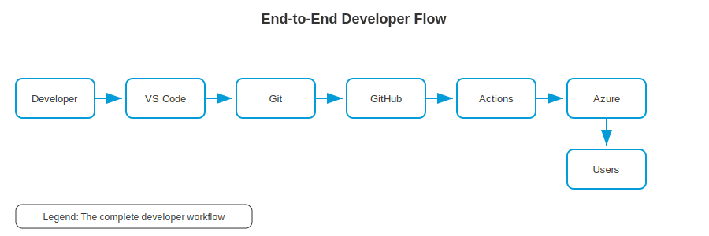

# Level 1-7 — The Complete Flow: How Everything Connects (World 1)

---

## Change Log

| Version | Date       | Author       | Description                     |
|---------|------------|--------------|-------------------------------|
| 1.0.0   | 2026-03-18 | Paula Silva  | Initial creation (Mario Edition)|

---

## Table of Contents

- [Prologue — The Complete Map of World 1](#prologue--the-complete-map-of-world-1)
- [1. Overview: From Code to End User](#1-overview-from-code-to-end-user)
  - [1.1 The Flow in One Sentence](#11-the-flow-in-one-sentence)
  - [1.2 The 6 Stations of the Journey](#12-the-6-stations-of-the-journey)
  - [1.3 Diagram: The Complete Map of World 1](#13-diagram-the-complete-map-of-world-1)
- [2. Station 1: VS Code — Where It All Begins](#2-station-1-vs-code--where-it-all-begins)
  - [2.1 Level 1-1 Recap](#21-level-1-1-recap)
  - [2.2 Connections to Other Stations](#22-connections-to-other-stations)
- [3. Station 2: Git — Saving Your Progress](#3-station-2-git--saving-your-progress)
  - [3.1 Level 1-2 Recap](#31-level-1-2-recap)
  - [3.2 Connections to Other Stations](#32-connections-to-other-stations)
- [4. Station 3: GitHub — Sharing and Collaborating](#4-station-3-github--sharing-and-collaborating)
  - [4.1 Level 1-3 Recap](#41-level-1-3-recap)
  - [4.2 Connections to Other Stations](#42-connections-to-other-stations)
- [5. Station 4: GitHub Actions — Automation](#5-station-4-github-actions--automation)
  - [5.1 Level 1-4 Recap](#51-level-1-4-recap)
  - [5.2 Connections to Other Stations](#52-connections-to-other-stations)
- [6. Station 5: Azure — The Production World](#6-station-5-azure--the-production-world)
  - [6.1 Level 1-5 Recap](#61-level-1-5-recap)
  - [6.2 Connections to Other Stations](#62-connections-to-other-stations)
- [7. Station 6: Azure AI — The Intelligence Layer](#7-station-6-azure-ai--the-intelligence-layer)
  - [7.1 Level 1-6 Recap](#71-level-1-6-recap)
  - [7.2 Connections to Other Stations](#72-connections-to-other-stations)
- [8. The Complete Flow in Action — A Day in Sofia's Life](#8-the-complete-flow-in-action--a-day-in-sofias-life)
  - [8.1 The Scenario](#81-the-scenario)
  - [8.2 Detailed Step by Step](#82-detailed-step-by-step)
  - [8.3 Timeline Diagram](#83-timeline-diagram)
- [9. The ASCII Map of World 1](#9-the-ascii-map-of-world-1)
  - [9.1 How the Pipes Connect the Levels](#91-how-the-pipes-connect-the-levels)
  - [9.2 Complete Connection Map](#92-complete-connection-map)
- [10. Frequently Asked Questions — "What if...?"](#10-frequently-asked-questions--what-if)
- [11. World 1 Checklist — Are You Ready?](#11-world-1-checklist--are-you-ready)
- [Summary — What We Learned in Level 1-7](#summary--what-we-learned-in-level-1-7)
- [References](#references)

---

## Prologue — The Complete Map of World 1

Sofia stopped at the top of a green hill and looked back. Behind her, six completed levels. For the first time, she could see all of World 1 — from Level 1-1 to here. And for the first time, she understood how everything connected.

"Each level seemed isolated when I was playing it," Sofia reflected. "VS Code was one thing. Git was another. GitHub another. But now, looking from above, I can see: they're all **pipes** that connect. What I do in VS Code goes to Git, which goes to GitHub, which wakes up the Lakitus, which publish to Azure. And Copilot is with me in every level."

It was like that moment in Mario where you discover that the green pipes aren't just decoration — they form an **underground network** that connects the entire world. Each pipe leads somewhere. Each level feeds the next.

"This level is special," said the voice. "You won't learn anything new. You'll understand how EVERYTHING you've already learned fits together. It's like seeing the world map for the first time — without fog."

---

## 1. Overview: From Code to End User

### 1.1 The Flow in One Sentence

> **You write code in VS Code** -> **save with Git** -> **share on GitHub** -> **Lakitus (Actions) test and build** -> **publish to Azure** -> **user accesses via the internet** — and **Copilot (AI)** helps you at every step.

### 1.2 The 6 Stations of the Journey

| # | Station | Tool | Function | Mario Analogy |
|---|---------|------|---------|---------------|
| 1 | **Write** | VS Code | Create the code | Play the level — build with blocks |
| 2 | **Save** | Git | Record progress | Save to the memory card |
| 3 | **Share** | GitHub | Collaborate with the team | Upload save to the multiplayer server |
| 4 | **Automate** | GitHub Actions | Test and build automatically | Lakitus inspecting and building |
| 5 | **Publish** | Azure | Host for the world | Publish the level for everyone to play |
| 6 | **Add Intelligence** | Azure AI + Copilot | Add magic | The game's magic system |

### 1.3 Diagram: The Complete Map of World 1

<div align="center">

<br/><em>Complete developer flow</em>
</div>

```
╔══════════════════════════════════════════════════════════════════════════╗
║                        WORLD 1 — GREEN PLAINS                          ║
║                        The Complete Flow Map                           ║
╠══════════════════════════════════════════════════════════════════════════╣
║                                                                        ║
║   [1-1 VS Code]                                                        ║
║   The Game       ═══════╗                                              ║
║   Console                ║ Ctrl+S                                      ║
║                          ▼                                              ║
║                   [1-2 Git]                                             ║
║                   The Memory  ═══════╗                                  ║
║                   Card               ║ git push                        ║
║                                      ▼                                  ║
║                               [1-3 GitHub]                              ║
║                               The Multiplayer ═══════╗                 ║
║                               Server                 ║ on: push        ║
║                                                       ▼                ║
║                                             [1-4 Actions]              ║
║                                             The Lakitus  ═══════╗      ║
║                                             Workers              ║deploy║
║                                                                  ▼     ║
║                                                         [1-5 Azure]    ║
║                                                         The Open       ║
║                                                         World          ║
║                                                                        ║
║   [1-6 Azure AI / Copilot] ◄═══════════════════════════════════════╗   ║
║   The Game's Magic — present at ALL stations                       ║   ║
║                                                                        ║
║   [1-7 YOU ARE HERE] — Seeing everything from above                    ║
║                                                                        ║
╚══════════════════════════════════════════════════════════════════════════╝
```

---

## 2. Station 1: VS Code — Where It All Begins

### 2.1 Level 1-1 Recap

| Learning | Summary |
|----------|---------|
| What code is | Instructions written for the computer |
| VS Code | The editor (console) where you write code |
| Interface | Sidebar, editor, terminal, status bar |
| Extensions | Plugins that add functionality (accessories) |
| Terminal | Command line inside VS Code |
| First file | `fase1-1.js` — your first program |

### 2.2 Connections to Other Stations

```
VS Code ──── Built-in Git (Source Control panel)
   │
   ├──── GitHub (push/pull directly from the editor)
   │
   ├──── Terminal (run git, node, az, gh)
   │
   ├──── Copilot (integrated extension)
   │
   └──── Azure (Azure Tools extension)
```

> **MARIO ANALOGY:** VS Code is the **central hub** — like the main room of the castle from which you access all other rooms. It's not just an editor — it's the operations base from which everything starts and to which everything returns.

---

## 3. Station 2: Git — Saving Your Progress

### 3.1 Level 1-2 Recap

| Learning | Summary |
|----------|---------|
| Git | Version control system (memory card) |
| Repository | Folder tracked by Git (cartridge) |
| Commit | Permanent snapshot (save game) |
| Staging | Preparation area (confirmation screen) |
| Branch | Parallel line of development (parallel universe) |
| git log | Commit history (save list) |

### 3.2 Connections to Other Stations

```
Git (local) ──── VS Code (Source Control panel)
     │
     ├──── GitHub (git push / git pull)
     │
     └──── GitHub Actions (trigger on push/PR)
```

> **Key point:** Git is the **bridge** between what you do locally (VS Code) and what goes to the server (GitHub). Without Git, your code dies on your computer.

---

## 4. Station 3: GitHub — Sharing and Collaborating

### 4.1 Level 1-3 Recap

| Learning | Summary |
|----------|---------|
| GitHub | Hosting and collaboration platform (multiplayer server) |
| Push/Pull | Send and receive commits (upload/download saves) |
| Clone/Fork | Copy repositories (download/create version of the game) |
| Issues | Task and bug tracking (quest board) |
| Pull Requests | Proposed changes for review (acceptance request) |
| Projects | Visual task management (campaign map) |
| Codespaces | VS Code in the cloud (cloud arcade) |

### 4.2 Connections to Other Stations

```
GitHub ──── Git (remote repository)
   │
   ├──── GitHub Actions (triggered by repo events)
   │
   ├──── Azure (automatic deploy via Actions)
   │
   ├──── Copilot (companion directly on GitHub)
   │
   ├──── Issues → Projects (work management)
   │
   └──── PRs → Code Review → Merge (collaboration)
```

> **Key point:** GitHub is the **nerve center** of collaboration. Everything converges here — code, tasks, automation, review. If VS Code is the local hub, GitHub is the global hub.

---

## 5. Station 4: GitHub Actions — Automation

### 5.1 Level 1-4 Recap

| Learning | Summary |
|----------|---------|
| CI/CD | Continuous integration and deployment (Lakitu inspector and transporter) |
| Workflow | YAML file with instructions (Lakitu's scroll) |
| Trigger | Event that fires the workflow (Lakitu's alarm) |
| Job/Step | Work block / individual step (mission / action) |
| Actions Marketplace | Reusable components (Lakitu's power-ups) |
| Secrets | Sensitive variables (Lakitu's secret keys) |

### 5.2 Connections to Other Stations

```
GitHub Actions ──── GitHub (triggered by events)
       │
       ├──── Azure (automatic deploy)
       │
       ├──── Tests (CI — run tests automatically)
       │
       └──── Notifications (alert the team)
```

> **Key point:** Actions is the **automatic glue** between GitHub and Azure. Without Actions, you'd have to deploy manually every time. With Actions, Lakitu does everything for you.

---

## 6. Station 5: Azure — The Production World

### 6.1 Level 1-5 Recap

| Learning | Summary |
|----------|---------|
| Cloud | Remote computers via internet (world server) |
| Azure | Microsoft's cloud platform (open world) |
| App Service | Web app hosting (ready-made castle) |
| Storage | File storage (treasure vault) |
| Entra ID | Identity and access (real ID card) |
| Monitor | Observability and alerts (watchtowers) |

### 6.2 Connections to Other Stations

```
Azure ──── GitHub Actions (automatic deploy)
  │
  ├──── Azure AI Services (spells in the app)
  │
  ├──── Azure Monitor (observe health)
  │
  ├──── Entra ID (protect access)
  │
  └──── End users (access via the internet)
```

> **Key point:** Azure is where code **comes to life for the real world**. Everything before is preparation — here is the moment of truth. Real users access your program here.

---

## 7. Station 6: Azure AI — The Intelligence Layer

### 7.1 Level 1-6 Recap

| Learning | Summary |
|----------|---------|
| AI | Computers performing intelligent tasks (magic) |
| Azure OpenAI | GPT models on Azure (spell book) |
| AI Foundry | Platform for building AI solutions (Magikoopa's Forge) |
| Copilot | AI for devs in VS Code (magical companion) |
| Prompts | Instructions for the AI (requests to the wizard) |
| Tokens | Processing/cost units (coins for magic) |

### 7.2 Connections to Other Stations

```
Azure AI / Copilot ──── VS Code (Copilot as extension)
        │
        ├──── GitHub (Copilot in chat, PRs, Issues)
        │
        ├──── Azure (AI Services integrated into apps)
        │
        ├──── AI Foundry (create custom solutions)
        │
        └──── All stations (AI permeates everything)
```

> **Key point:** AI is not an isolated station — it **permeates all the others**. Copilot helps you write code (VS Code), understand diffs (Git), create PRs (GitHub), write workflows (Actions), and configure resources (Azure). It's the magic that makes everything faster.

---

## 8. The Complete Flow in Action — A Day in Sofia's Life

### 8.1 The Scenario

Sofia needs to add a new feature to her project: a **scoring system** for the Mushroom Kingdom.

### 8.2 Detailed Step by Step

| Step | What Sofia Does | Tool | Mario Analogy |
|------|----------------|------|---------------|
| 1 | Opens VS Code and sees Issue #12 on GitHub: "Add scoring system" | VS Code + GitHub | Looks at the quest board and picks a quest |
| 2 | Creates a branch: `git switch -c feature/pontuacao` | Git | Enters a parallel universe |
| 3 | Asks Copilot: "Create a Scoring class with methods to add and subtract points" | Copilot (AI) | Asks the magical companion for help |
| 4 | Reviews and adjusts the code generated by Copilot | VS Code | Inspects what the companion did |
| 5 | Tests locally: `node pontuacao.test.js` | VS Code (terminal) | Tests the level before publishing |
| 6 | Commits: `git commit -m "feat: adicionar sistema de pontuacao"` | Git | Saves to the memory card |
| 7 | Pushes: `git push origin feature/pontuacao` | Git -> GitHub | Uploads the save to the server |
| 8 | Creates a PR on GitHub linked to Issue #12 | GitHub | Asks the team to accept the changes |
| 9 | GitHub Actions runs automatically: tests, lint, build | Actions | Lakitu inspects everything from above |
| 10 | Colleague reviews the PR and approves | GitHub (PR) | Toadette inspects and approves the level |
| 11 | Merge to main | GitHub | Parallel universe is merged into the main one |
| 12 | Actions triggers automatic deploy to Azure | Actions -> Azure | Lakitu transports the level to the world |
| 13 | New feature is live! Users can access it | Azure | Players from around the world play the level |
| 14 | Azure Monitor shows usage metrics | Azure Monitor | Watchtowers report status |

### 8.3 Timeline Diagram

```
MORNING               AFTERNOON                EVENING
  |                     |                        |
  v                     v                        v
[Issue #12] → [Branch] → [Code+Copilot] → [Commit] → [Push]
                                                         |
                                                         v
                                                [PR] → [Actions CI]
                                                         |
                                                         v
                                                  [Code Review]
                                                         |
                                                         v
                                                   [Approved!]
                                                         |
                                                         v
                                                  [Merge → main]
                                                         |
                                                         v
                                                 [Actions CD → Azure]
                                                         |
                                                         v
                                                 [LIVE! Users
                                                  access the feature]
```

---

## 9. The ASCII Map of World 1

### 9.1 How the Pipes Connect the Levels

In Mario, green pipes connect areas that seem distant. In software development, tools connect through **protocols, APIs, and integrations**:

| Connection | Technical "Pipe" | What It Transports |
|-----------|-----------------|-------------------|
| VS Code -> Git | Built-in extension + terminal | Files and changes |
| Git -> GitHub | HTTPS/SSH protocol (push/pull) | Commits and branches |
| GitHub -> Actions | Webhooks (automatic events) | Workflow triggers |
| Actions -> Azure | Azure CLI + credentials (secrets) | Compiled code (deploy) |
| Copilot -> Everything | OpenAI API integrated into the editor | Code suggestions and chat |

### 9.2 Complete Connection Map

```
╔══════════════════════════════════════════════════════════════════════╗
║                                                                      ║
║          ┌──────────────────────────────────────────────┐            ║
║          │            GITHUB COPILOT (AI)               │            ║
║          │     Companion present in all levels           │            ║
║          └──────┬───────────┬──────────┬────────────────┘            ║
║                 │           │          │                              ║
║                 ▼           ▼          ▼                              ║
║           ┌──────────┐ ┌──────────┐ ┌──────────┐                    ║
║           │ VS CODE  │ │  GITHUB  │ │  AZURE   │                    ║
║           │ (Console)│ │ (Server) │ │ (World)  │                    ║
║           └────┬─────┘ └────┬─────┘ └────┬─────┘                    ║
║                │            │            │                            ║
║           ┌────┴─────┐     │       ┌────┴─────┐                     ║
║           │   GIT    │     │       │  AZURE   │                     ║
║           │ (Memory  ├─────┘       │  MONITOR │                     ║
║           │  Card)   │             │ (Towers) │                     ║
║           └──────────┘             └──────────┘                     ║
║                                                                      ║
║     ┌────────────────────────────────────────────┐                  ║
║     │            GITHUB ACTIONS (Lakitus)         │                  ║
║     │  Connects GitHub to Azure automatically     │                  ║
║     └────────────────────────────────────────────┘                  ║
║                                                                      ║
║  ┌─────────────────────────────────────────────────────────┐        ║
║  │                    AZURE AI FOUNDRY                      │        ║
║  │     When the app needs its own AI (custom spells)        │        ║
║  └─────────────────────────────────────────────────────────┘        ║
║                                                                      ║
╚══════════════════════════════════════════════════════════════════════╝

  FLOW: You → VS Code → Git → GitHub → Actions → Azure → Users
```

---

## 10. Frequently Asked Questions — "What if...?"

| Question | Answer | Level |
|---------|--------|-------|
| "What if I don't use Git?" | You have no history, can't go back, can't collaborate. | 1-2 |
| "What if I don't use GitHub?" | Your code stays only on your computer. No cloud backup, no collaboration. | 1-3 |
| "What if I don't use Actions?" | You do everything manually — tests, build, deploy. It works, but it's slow and error-prone. | 1-4 |
| "What if I don't use Azure?" | Your program runs only locally. No one else can access it. | 1-5 |
| "What if I don't use AI?" | You program "by hand" — slower, but totally possible. AI accelerates, it doesn't replace. | 1-6 |
| "Can I skip straight to Azure?" | You can, but without Git/GitHub you have no organization or automation. The foundation matters. | All |
| "Do I need to pay for anything?" | VS Code (free), Git (free), GitHub (free for personal use), Azure (has a free tier), Copilot (free for students). | All |
| "Can I use editors other than VS Code?" | Yes (Vim, JetBrains, etc.), but VS Code has the best integration with the entire Microsoft+GitHub ecosystem. | 1-1 |

---

## 11. World 1 Checklist — Are You Ready?

Before moving on to World 2, check that you've mastered the fundamentals:

| # | Item | Level | Status |
|---|------|-------|--------|
| 1 | I know what code is and what it's for | 1-1 | [ ] |
| 2 | I have VS Code installed and configured | 1-1 | [ ] |
| 3 | I know how to use basic terminal (cd, ls, mkdir) | 1-1 | [ ] |
| 4 | I have essential extensions installed | 1-1 | [ ] |
| 5 | I understand what Git is and why to use it | 1-2 | [ ] |
| 6 | I know how to do git init, add, commit, log | 1-2 | [ ] |
| 7 | I understand branches (create, switch, merge) | 1-2 | [ ] |
| 8 | I have a GitHub account | 1-3 | [ ] |
| 9 | I know how to push and pull | 1-3 | [ ] |
| 10 | I know how to create Issues and PRs | 1-3 | [ ] |
| 11 | I understand what CI/CD is | 1-4 | [ ] |
| 12 | I can read and write a basic YAML workflow | 1-4 | [ ] |
| 13 | I understand what cloud computing is | 1-5 | [ ] |
| 14 | I know the essential Azure services | 1-5 | [ ] |
| 15 | I understand what AI is and how to use Copilot | 1-6 | [ ] |
| 16 | I know how to write basic prompts | 1-6 | [ ] |
| 17 | I understand how everything connects | 1-7 | [ ] |

> **If you checked at least 14 out of 17, you're ready for World 2.** If you checked fewer, go back and review the levels that had gaps. Don't skip — the following worlds depend on this foundation.

---

## Summary — What We Learned in Level 1-7

| Concept | Summary |
|---------|---------|
| **Complete flow** | VS Code -> Git -> GitHub -> Actions -> Azure (-> Users) |
| **AI as a cross-cutting layer** | Copilot and Azure AI permeate every step |
| **Each tool has a role** | None replaces the other — they all complement each other |
| **Automation is the glue** | GitHub Actions connects development (GitHub) to production (Azure) |
| **The foundation matters** | Without Git, without GitHub, without the terminal — the advanced worlds don't work |

```
+═══════════════════════════════════════════+
║                                           ║
║     ★★★ WORLD 1 COMPLETE! ★★★           ║
║                                           ║
║    All 7 levels completed!               ║
║                                           ║
║    Level 1-1: VS Code (Console)     ★     ║
║    Level 1-2: Git (Memory Card)     ★     ║
║    Level 1-3: GitHub (Multiplayer)  ★     ║
║    Level 1-4: Actions (Lakitus)     ★     ║
║    Level 1-5: Azure (Open World)    ★     ║
║    Level 1-6: AI (Magic)            ★     ║
║    Level 1-7: Connections (Map)     ★     ║
║                                           ║
║    → Next: Level 1-BOSS                   ║
║      Boss Battle against Bowser Jr!       ║
║                                           ║
║    "Thank you Mario!                      ║
║     The princess is in another castle!"   ║
║    (But now you know how to get there.)   ║
║                                           ║
+═══════════════════════════════════════════+
```

---

## References

- [Visual Studio Code](https://code.visualstudio.com)
- [Git](https://git-scm.com)
- [GitHub](https://github.com)
- [GitHub Actions](https://docs.github.com/en/actions)
- [Microsoft Azure](https://azure.microsoft.com)
- [Azure AI Services](https://learn.microsoft.com/azure/ai-services)
- [GitHub Copilot](https://docs.github.com/en/copilot)
- [Azure AI Foundry](https://ai.azure.com)
- [Microsoft Learn — Azure Fundamentals](https://learn.microsoft.com/training/paths/azure-fundamentals)
- [GitHub Skills](https://skills.github.com)

---

*"Now I can see the entire map. Each pipe connects to something. Each tool has its role. And I know how to use them all." — Sofia, at the top of World 1's hill.*

---

<div align="center">

⬅️ [Previous: Level 1-6: Azure AI](1-6-azure-ai.md) · 🗺️ [World Map](../INDEX.md) · ➡️ [Next: Level 1-BOSS: Exercises](1-boss-exercises.md)

</div>
