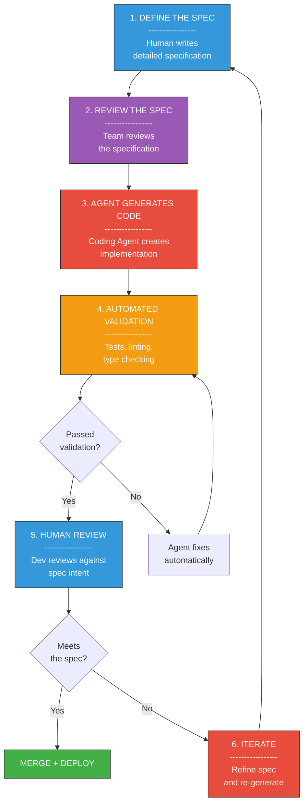
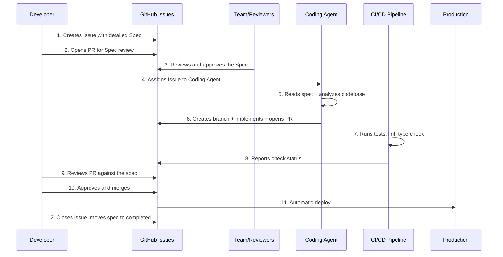

# Level 5-10 -- The Castle Blueprint: Spec-Driven Development (SDD) Complete Guide

## Change Log

| Version | Date       | Author       | Description                        |
|---------|------------|--------------|------------------------------------|
| 1.0.0   | 2026-03-18 | Paula Silva  | Initial creation                   |

---

## Table of Contents

- [Introduction -- The Secret of the Great Builders](#introduction--the-secret-of-the-great-builders)
- [Section 1 -- What is Spec-Driven Development](#section-1--what-is-spec-driven-development)
  - [1.1 Definition](#11-definition)
  - [1.2 Why It Matters: The Most Valuable Skill of the Future](#12-why-it-matters-the-most-valuable-skill-of-the-future)
  - [1.3 The Mario Analogy: Before and After the Blueprint](#13-the-mario-analogy-before-and-after-the-blueprint)
  - [1.4 The Paradigm Shift](#14-the-paradigm-shift)
- [Section 2 -- The Complete SDD Flow](#section-2--the-complete-sdd-flow)
  - [2.1 The 6 Steps of SDD](#21-the-6-steps-of-sdd)
  - [2.2 Flow Diagram](#22-flow-diagram)
  - [2.3 Typical Timelines](#23-typical-timelines)
- [Section 3 -- Anatomy of a Perfect Spec](#section-3--anatomy-of-a-perfect-spec)
  - [3.1 Complete Structure](#31-complete-structure)
  - [3.2 Mario Analogy: Parts of the Castle Blueprint](#32-mario-analogy-parts-of-the-castle-blueprint)
  - [3.3 Complete Example of a Real Spec](#33-complete-example-of-a-real-spec)
- [Section 4 -- 5 Spec Templates for Different Scenarios](#section-4--5-spec-templates-for-different-scenarios)
  - [4.1 Template 1: New Feature](#41-template-1-new-feature)
  - [4.2 Template 2: Bug Fix](#42-template-2-bug-fix)
  - [4.3 Template 3: Refactoring](#43-template-3-refactoring)
  - [4.4 Template 4: API Endpoint](#44-template-4-api-endpoint)
  - [4.5 Template 5: Database Migration](#45-template-5-database-migration)
- [Section 5 -- Spec-Kit: The Official Tool](#section-5--spec-kit-the-official-tool)
  - [5.1 What is Spec-Kit](#51-what-is-spec-kit)
  - [5.2 Installation and Configuration](#52-installation-and-configuration)
  - [5.3 Integration with GitHub Copilot and Coding Agent](#53-integration-with-github-copilot-and-coding-agent)
  - [5.4 Workflow with Spec-Kit](#54-workflow-with-spec-kit)
  - [5.5 Practical Example: From Spec to PR](#55-practical-example-from-spec-to-pr)
- [Section 6 -- SDD + Complete GitHub Workflow](#section-6--sdd--complete-github-workflow)
  - [6.1 The End-to-End Flow](#61-the-end-to-end-flow)
  - [6.2 Sequence Diagram](#62-sequence-diagram)
  - [6.3 Each Step in Detail](#63-each-step-in-detail)
- [Section 7 -- Good Spec vs Bad Spec](#section-7--good-spec-vs-bad-spec)
  - [7.1 Comparison Table](#71-comparison-table)
  - [7.2 Example 1: Authentication Spec](#72-example-1-authentication-spec)
  - [7.3 Example 2: Performance Spec](#73-example-2-performance-spec)
  - [7.4 Example 3: API Spec](#74-example-3-api-spec)
- [Section 8 -- Spec Validation Checklist](#section-8--spec-validation-checklist)
  - [8.1 The Complete Checklist](#81-the-complete-checklist)
  - [8.2 How to Use the Checklist](#82-how-to-use-the-checklist)
- [Section 9 -- SDD Anti-Patterns](#section-9--sdd-anti-patterns)
  - [9.1 The 6 Deadly Anti-Patterns](#91-the-6-deadly-anti-patterns)
  - [9.2 How to Avoid Each Anti-Pattern](#92-how-to-avoid-each-anti-pattern)
- [Section 10 -- Quality Metrics](#section-10--quality-metrics)
  - [10.1 The 5 Essential Metrics](#101-the-5-essential-metrics)
  - [10.2 SDD Dashboard](#102-sdd-dashboard)
- [Section 11 -- SDD with Copilot: Hands-On Step by Step](#section-11--sdd-with-copilot-hands-on-step-by-step)
  - [11.1 Environment Setup](#111-environment-setup)
  - [11.2 Tutorial: TodoApp with Priority](#112-tutorial-todoapp-with-priority)
  - [11.3 Reviewing the Generated PR](#113-reviewing-the-generated-pr)
  - [11.4 Iterating and Merging](#114-iterating-and-merging)
- [Boss Battle: Hands-On Exercise](#boss-battle-hands-on-exercise)
- [POWER-UP UNLOCKED!](#power-up-unlocked)
- [What We Learned -- Summary Table](#what-we-learned--summary-table)
- [References](#references)

---

## Introduction -- The Secret of the Great Builders

Sofia walked into an enormous castle room where Toad the architect was hunched over a massive table. On the table lay a detailed drawing -- lines, annotations, measurements, materials -- a complete blueprint for a new castle.

"Toad, aren't you going to start building?" Sofia asked.

"Build WITHOUT the blueprint?" Toad's eyes went wide. "Sofia, the secret of great builders isn't knowing how to lay bricks. ANY NPC can lay bricks. The secret is knowing how to DRAW THE BLUEPRINT. The blueprint says which bricks, where, how many, and why. Without a blueprint, you build and hope for the best. With a blueprint, you build with CERTAINTY."

Sofia looked at the blueprint. It was impressively detailed: every room had a described purpose, every corridor had dimensions, every door had a note about where it led.

"What if the blueprint is bad?" she asked.

"Then the castle will be bad," Toad replied. "The quality of the castle NEVER exceeds the quality of the blueprint. If the blueprint says 'just build some castle,' the NPC builder will build anything. If the blueprint says 'castle with 7 rooms, watchtower on the east side, drawbridge 3 meters wide, moat 2 meters deep' -- THEN the castle turns out perfect."

"So... the most important skill isn't building. It's planning?"

Toad smiled. "Welcome to Spec-Driven Development."

---

## Section 1 -- What is Spec-Driven Development

### 1.1 Definition

**Spec-Driven Development (SDD)** is the practice of writing detailed specifications BEFORE any code, then using AI agents to generate the implementation based on those specifications.

In simple terms:

- **You** write WHAT needs to be built (the spec)
- **The agent** writes HOW to build it (the code)
- **Tests and validations** confirm the code meets the spec
- **You** review and adjust

SDD is not a tool. It's a **way of working**. It's the natural evolution of software development in the AI era.

### 1.2 Why It Matters: The Most Valuable Skill of the Future

Here's the truth that few have realized:

> **The most important skill of the future is NOT writing code. It's writing CLEAR SPECIFICATIONS.**

Why? Because code will increasingly be generated by AI agents. But specifications -- the clear definition of what to build, why to build it, how to validate it -- that requires **human thinking**. It requires understanding the problem, the user, the business, the constraints.

| Era | Primary Skill | Who Writes Code |
|-----|--------------|-----------------|
| **Before AI** | Writing code | Human |
| **AI-Assisted (Level 1-2)** | Writing code + using AI | Human with AI help |
| **AI-Native (Level 3+)** | Writing specifications | AI, guided by human |
| **AI-Autonomous (Level 4)** | Defining strategy | AI coordinated by human |

### 1.3 The Mario Analogy: Before and After the Blueprint

> **MARIO ANALOGY:** Before SDD, Mario built castles brick by brick, without a blueprint. He'd look at the terrain and think: "I guess a room here would be nice..." He'd lay bricks, backtrack, undo, redo. The castle ended up crooked, with rooms that didn't connect properly and doors that led to walls. It took WEEKS and the result was unpredictable.
>
> With SDD, Mario FIRST sits down and draws the COMPLETE BLUEPRINT for the castle. The blueprint has: the purpose of each room, the dimensions, the materials, how rooms connect to each other, where the emergency exits are, and even the inspection checklist. Then Mario hands the blueprint to the NPC builders (agents), who follow every instruction faithfully. The castle is ready in HOURS, not weeks, and the result is exactly what was specified.
>
> **Golden rule: Better blueprint = better castle. Better spec = better code.**

### 1.4 The Paradigm Shift

SDD represents a fundamental shift in the developer's role:

```
BEFORE (Traditional Development):
  Developer --> [writes code] --> Code --> [tests] --> Deploy

NOW (Spec-Driven Development):
  Developer --> [writes spec] --> Spec --> [agent generates code] --> Code --> [validates vs spec] --> Deploy
```

| Aspect | Traditional Development | Spec-Driven Development |
|--------|------------------------|------------------------|
| **Dev focus** | Writing code | Writing specifications |
| **Who codes** | Human | AI agent |
| **Code review** | Review HOW it was written | Review if it meets the SPEC |
| **Speed** | Days/weeks | Hours |
| **Consistency** | Depends on the dev | Depends on the spec |
| **Scalability** | Linear (more devs = more code) | Exponential (better spec = more output) |

---

## Section 2 -- The Complete SDD Flow

### 2.1 The 6 Steps of SDD

The complete Spec-Driven Development flow has 6 stages:

**Step 1: Define the Spec**
Write a detailed specification: what, why, how, acceptance criteria.

**Step 2: Review the Spec**
Team reviews the spec (not code review -- SPEC review). Is the spec clear? Complete? Testable?

**Step 3: Agent Generates Code**
The Coding Agent reads the spec and creates the implementation: code, tests, documentation.

**Step 4: Automated Validation**
Tests, linting, type checking validate the code against the spec.

**Step 5: Human Review**
Developer reviews the generated code against the spec's INTENT. Does the code do what the spec asked for?

**Step 6: Iterate**
If needed, refine the spec and re-generate. Each iteration improves the result.

### 2.2 Flow Diagram



### 2.3 Typical Timelines

| Step | Typical Time | Who Does It |
|------|-------------|-------------|
| Define the Spec | 20-45 min | Human |
| Review the Spec | 10-20 min | Team |
| Agent Generates Code | 3-10 min | Agent |
| Automated Validation | 2-5 min | CI/CD |
| Human Review | 10-20 min | Human |
| Iterate (if needed) | 10-15 min | Human + Agent |
| **TOTAL** | **~55 min - 2h** | **Human + AI** |

Compare with the traditional method: **1-3 days** for the same feature.

> **MARIO ANALOGY:** Before, Mario took 3 days to build one castle room. Now, Mario spends 30 minutes drawing the perfect blueprint and the NPC builder constructs the room in 5 minutes. Total time: 35 minutes vs 3 days. The secret? The blueprint.

---

## Section 3 -- Anatomy of a Perfect Spec

### 3.1 Complete Structure

A perfect spec has the following sections:

```markdown
# Feature: [Feature Name]

## Context
Why this feature is needed. Business context. User problem.
What pain it solves. Who requested it and why.

## Requirements

### Functional Requirements
- [ ] When [trigger], the system should [behavior]
- [ ] Given [context], when [action], then [result]
- [ ] The user can [action] and see [result]

### Non-Functional Requirements
- Performance: response time < 200ms
- Security: input validation required
- Accessibility: WCAG 2.1 AA compliant
- Scalability: support 1000 requests/second

## Technical Design

### Architecture
Where this feature fits in the system. Which services/components are affected.
Diagram of how components interact.

### Data Model
New tables, fields, relationships.
Required migrations.

### API Contract
Endpoints, HTTP methods, request/response schemas.
Error codes and handling.

## Acceptance Criteria
- [ ] Criterion 1 (testable, measurable)
- [ ] Criterion 2
- [ ] Criterion 3

## Out of Scope
What this spec does NOT cover. Explicitly state what will not be done.

## Dependencies
What must exist before this feature can be built.
Other features, services, external APIs.

## Risks and Mitigations
Known risks and how to handle them.

| Risk | Probability | Impact | Mitigation |
|------|------------|--------|------------|
| ... | ... | ... | ... |
```

### 3.2 Mario Analogy: Parts of the Castle Blueprint

> **MARIO ANALOGY:** A good castle blueprint has all these parts:
>
> - **Context** = The PURPOSE of the castle ("Defense castle against Bowser, on the northern border")
> - **Functional Requirements** = The ROOMS needed ("Throne room, armory, kitchen, 3 bedrooms")
> - **Non-Functional Requirements** = The QUALITIES ("Fire-resistant walls, doors that open in 2 seconds, stairs wide enough for 3 Toads side by side")
> - **Architecture** = How rooms CONNECT ("Central corridor links throne room to armory, north stairs lead to bedrooms")
> - **Data Model** = The MATERIALS LIST ("500 stone blocks, 20 oak doors, 50 torches")
> - **API Contract** = The DOORS AND WINDOWS ("Main door: 3m tall, opens outward. Tower window: 1m x 1m, with bars")
> - **Acceptance Criteria** = The INSPECTION CHECKLIST ("Do all walls support 500kg? Do doors lock? Does the moat have water?")
> - **Out of Scope** = What NOT to build ("Does not include garden, does not include stable, does not include magic tower")
> - **Dependencies** = What MUST EXIST ("Leveled terrain, access bridge built, stone supplier confirmed")
> - **Risks** = KNOWN DANGERS ("Flood risk in moat -> install drainage. Air attack risk -> watchtower")

### 3.3 Complete Example of a Real Spec

```markdown
# Feature: Task Search with Autocomplete

## Context
TodoApp users report difficulty finding tasks when they have more than
50 items in their list. Currently they must manually scroll through the entire
list. This increases the time to locate tasks by 300% when the list exceeds
100 items (data from March 2026 usability session).

## Requirements

### Functional Requirements
- [ ] Search field positioned at the top of the task list
- [ ] Real-time search with 300ms debounce
- [ ] Results filtered as the user types
- [ ] Visual highlight of the searched term in results
- [ ] If no results, display message "No tasks found"
- [ ] Magnifying glass icon on the left of the field
- [ ] "X" button to clear the search (appears when there is text)
- [ ] When search is cleared, full list reappears

### Non-Functional Requirements
- Performance: complete filtering in < 100ms for 1000 items
- Accessibility: field with accessible label, keyboard navigation
- Responsiveness: works on screens from 320px to 1920px
- Case-insensitive search
- Substring search (not just prefix)

## Technical Design

### Architecture
- New component: `SearchBar.tsx` inside `src/components/`
- New hook: `useSearch.ts` inside `src/hooks/`
- Modify: `TaskList.tsx` to integrate SearchBar above the list
- No backend changes -- search is 100% client-side

### Data Model
No data model changes. Search uses data already loaded
in the `TaskList` component state.

### API Contract
No new endpoints. Search is client-side.

## Acceptance Criteria
- [ ] Typing "shopping" filters and shows only tasks containing "shopping"
- [ ] Searching "SHOPPING" returns the same results as "shopping"
- [ ] Searching "opp" returns tasks like "Shopping list" (substring)
- [ ] List with 1000 items filters in less than 100ms
- [ ] Field is accessible via Tab and has aria-label
- [ ] Highlight appears on the matching portion
- [ ] Clicking "X" clears search and restores full list
- [ ] On 320px screen, field takes 100% width

## Out of Scope
- Backend search / API search
- Search by tags or categories (separate feature)
- Search history
- Regular expression search

## Dependencies
- Existing and functional `TaskList.tsx` component
- Task list loaded in component state
- Highlight library (suggestion: `mark.js` or custom implementation)

## Risks and Mitigations

| Risk | Probability | Impact | Mitigation |
|------|------------|--------|------------|
| Poor performance with many items | Medium | High | Use `useMemo` to cache filtered results |
| Excessive re-renders | Medium | Medium | Implement debounce on input |
| Visual conflict with existing header | Low | Low | Review design before implementing |
```

---

## Section 4 -- 5 Spec Templates for Different Scenarios

### 4.1 Template 1: New Feature

```markdown
# Feature Spec: [Feature Name]

## Metadata
- **Author:** [name]
- **Date:** [date]
- **Issue:** #[number]
- **Priority:** [High/Medium/Low]

## Context
### Problem
[What user problem does this feature solve?]

### Evidence
[Data, metrics, user feedback justifying the feature]

### Goal
[What this feature should achieve in terms of outcomes]

## Functional Requirements
- [ ] FR1: [When X happens, the system does Y]
- [ ] FR2: [Given context A, when action B, result C]
- [ ] FR3: ...

## Non-Functional Requirements
- **Performance:** [specific metrics]
- **Security:** [specific requirements]
- **Accessibility:** [standard to follow]
- **Scalability:** [expected limits]

## Technical Design
### Affected Components
- [Component 1]: [what changes]
- [Component 2]: [what changes]

### New Components
- [New component]: [purpose and responsibility]

### Data Model
[New tables, fields, relationships]

### API
[New endpoints or changes to existing ones]

## Acceptance Criteria
- [ ] AC1: [testable and measurable criterion]
- [ ] AC2: ...
- [ ] AC3: ...

## Out of Scope
- [What this spec does NOT cover]

## Dependencies
- [What must exist first]

## Risks
| Risk | Mitigation |
|------|------------|
| [risk] | [mitigation] |
```

**Filled example: OAuth Authentication**

```markdown
# Feature Spec: OAuth 2.0 Authentication

## Metadata
- **Author:** Sofia
- **Date:** 2026-03-18
- **Issue:** #142
- **Priority:** High

## Context
### Problem
Users must create an account with email/password to access the app.
70% of users abandon the registration midway (Google Analytics data).
Competitors offer social login and have 3x higher conversion rates.

### Evidence
- Registration abandonment rate: 70% (GA, last quarter)
- NPS feedback: "I don't want to create yet another account" (mentioned 45 times)
- Benchmark: competitor X has social login and 85% conversion rate

### Goal
Enable login with Google and Microsoft using OAuth 2.0 with PKCE flow,
reducing registration abandonment rate from 70% to under 30%.

## Functional Requirements
- [ ] FR1: "Login with Google" button on the login screen
- [ ] FR2: "Login with Microsoft" button on the login screen
- [ ] FR3: OAuth 2.0 flow with PKCE (no client secret on frontend)
- [ ] FR4: Auto-create account on first social login
- [ ] FR5: Link social account to existing account (same email)
- [ ] FR6: Allow unlinking provider in settings
- [ ] FR7: JWT token with 1-hour expiration
- [ ] FR8: Refresh token with 7-day expiration
- [ ] FR9: Logout invalidates tokens on the server

## Non-Functional Requirements
- **Performance:** Complete login in < 3 seconds (excluding provider time)
- **Security:** PKCE mandatory, tokens stored in httpOnly cookies, CSRF protection
- **Accessibility:** Buttons with aria-labels, keyboard navigation
- **Scalability:** Support 10,000 simultaneous logins

## Technical Design
### Affected Components
- `LoginPage.tsx`: Add social login buttons
- `AuthContext.tsx`: Support OAuth tokens
- `api/auth.ts`: New OAuth endpoints

### New Components
- `SocialLoginButton.tsx`: Reusable component for social buttons
- `OAuthCallback.tsx`: OAuth callback page
- `auth/oauth.service.ts`: Backend service for OAuth flow

### Data Model
```sql
-- New table
CREATE TABLE oauth_providers (
  id UUID PRIMARY KEY,
  user_id UUID REFERENCES users(id),
  provider VARCHAR(50) NOT NULL, -- 'google' | 'microsoft'
  provider_user_id VARCHAR(255) NOT NULL,
  email VARCHAR(255),
  created_at TIMESTAMP DEFAULT NOW(),
  UNIQUE(provider, provider_user_id)
);

-- Add column to users table
ALTER TABLE users ADD COLUMN auth_method VARCHAR(50) DEFAULT 'email';
```

### API
```
POST /api/auth/oauth/google    - Initiates Google flow
POST /api/auth/oauth/microsoft - Initiates Microsoft flow
GET  /api/auth/oauth/callback  - Provider callback
POST /api/auth/oauth/unlink    - Unlinks provider
POST /api/auth/refresh         - Refreshes token
```

## Acceptance Criteria
- [ ] AC1: User clicks "Login with Google" and completes login in < 3 clicks
- [ ] AC2: JWT expires in exactly 1 hour, refresh token in 7 days
- [ ] AC3: User with existing email has account linked automatically
- [ ] AC4: User can unlink Google and keep access via email
- [ ] AC5: Tokens stored in httpOnly secure cookies
- [ ] AC6: Flow works on Chrome, Firefox, Safari, and Edge
- [ ] AC7: Login screen accessible via keyboard and screen reader

## Out of Scope
- Login with Apple (separate feature, issue #143)
- Two-factor authentication / 2FA (issue #150)
- Password reset (already exists)
- Login with GitHub (phase 2)

## Dependencies
- OAuth credentials from Google Cloud Console (DevOps needs to configure)
- OAuth credentials from Azure AD (DevOps needs to configure)
- Domain configured on providers for callback URL

## Risks
| Risk | Mitigation |
|------|------------|
| Provider down | Maintain email/password login as fallback, show clear message |
| Token leaked | httpOnly cookies, refresh token rotation, revocation on logout |
| Provider rate limiting | Token caching, retry with exponential backoff |
```

### 4.2 Template 2: Bug Fix

```markdown
# Bug Fix Spec: [Bug Title]

## Metadata
- **Author:** [name]
- **Date:** [date]
- **Issue:** #[number]
- **Severity:** [Critical/High/Medium/Low]
- **Reported by:** [user/team]

## Bug Description
### Current Behavior (Wrong)
[What happens TODAY]

### Expected Behavior (Correct)
[What SHOULD happen]

### Steps to Reproduce
1. [Step 1]
2. [Step 2]
3. [Step 3]
4. [Incorrect result observed]

### Evidence
[Screenshots, logs, stack traces, metrics]

## Root Cause Analysis
[What is the technical cause of the bug]

## Proposed Solution
[How to fix it, what technical approach]

### Affected Files
- [file 1]: [what to change]
- [file 2]: [what to change]

## Acceptance Criteria
- [ ] AC1: [Bug no longer occurs in the described scenario]
- [ ] AC2: [Regression test added]
- [ ] AC3: [Adjacent scenarios still work]

## Regression Risks
[What other features might be affected by the fix]
```

**Filled example: N+1 Query**

```markdown
# Bug Fix Spec: N+1 Query in Task Listing

## Metadata
- **Author:** Sofia
- **Date:** 2026-03-18
- **Issue:** #187
- **Severity:** High
- **Reported by:** Performance Team

## Bug Description
### Current Behavior (Wrong)
The task listing page makes 1 query to fetch tasks and then N additional
queries to fetch the author of each task. With 100 tasks, that's 101 database
queries. Response time: 3.2 seconds.

### Expected Behavior (Correct)
The listing should use JOIN or eager loading to fetch tasks AND authors
in at most 2 queries. Expected response time: < 200ms.

### Steps to Reproduce
1. Create 100 tasks with different authors
2. Access GET /api/tasks
3. Observe in ORM log: 101 queries executed
4. Response time: 3.2 seconds

### Evidence
```
-- ORM log showing N+1:
SELECT * FROM tasks ORDER BY created_at DESC;         -- 1 query
SELECT * FROM users WHERE id = 'uuid-1';               -- +1 query
SELECT * FROM users WHERE id = 'uuid-2';               -- +1 query
... (repeats for each task)                            -- +N queries
-- Total: 101 queries in 3200ms
```

## Root Cause Analysis
The `TaskRepository.findAll()` method uses `find()` without the `relations`
parameter, causing the ORM (TypeORM) to load each relation with lazy loading
(one query per record).

File: `src/repositories/TaskRepository.ts`, line 23.

## Proposed Solution
Add eager loading to the query using `relations: ['author']` or
use QueryBuilder with LEFT JOIN.

### Affected Files
- `src/repositories/TaskRepository.ts`: Add eager loading
- `src/tests/task-repository.test.ts`: Add performance test

## Acceptance Criteria
- [ ] AC1: GET /api/tasks with 100 tasks executes at most 2 queries
- [ ] AC2: Response time < 200ms for 100 tasks
- [ ] AC3: Response time < 500ms for 1000 tasks
- [ ] AC4: Automated test validates maximum number of queries
- [ ] AC5: All author information still appears in response

## Regression Risks
- Endpoints using TaskRepository.findAll() may return more data than before
- Verify that serializers don't expose sensitive author fields
```

### 4.3 Template 3: Refactoring

```markdown
# Refactoring Spec: [Refactoring Title]

## Metadata
- **Author:** [name]
- **Date:** [date]
- **Issue:** #[number]

## Motivation
### Why Refactor
[What technical problem the refactoring solves]

### Current State
[How the architecture/code looks TODAY]

### Desired State
[How it should look AFTER refactoring]

## Refactoring Scope
### What Changes
- [Component/Module 1]: [from X to Y]
- [Component/Module 2]: [from X to Y]

### What Does NOT Change
- [Feature/API that stays the same]

## Migration Plan
### Phase 1: [description]
### Phase 2: [description]
### Phase 3: [description]

## Acceptance Criteria
- [ ] AC1: All existing tests pass without modification
- [ ] AC2: No changes to public API
- [ ] AC3: [performance/quality criterion]

## Risks
| Risk | Mitigation |
|------|------------|
| [risk] | [mitigation] |
```

**Filled example: REST to GraphQL Migration**

```markdown
# Refactoring Spec: REST to GraphQL Migration

## Metadata
- **Author:** Sofia
- **Date:** 2026-03-18
- **Issue:** #201

## Motivation
### Why Refactor
The frontend makes an average of 7 REST calls to assemble a single page
(tasks + authors + categories + comments + tags + permissions + configs).
This causes over-fetching (unnecessary data) and under-fetching (missing data
requiring extra calls). GraphQL will allow the frontend to request exactly
the data it needs in a SINGLE call.

### Current State
- 12 REST endpoints at `/api/v1/`
- Frontend makes 5-8 calls per page
- Average page load time: 2.1s
- Average total payload per page: 450KB (75% is unused data)

### Desired State
- 1 GraphQL endpoint at `/graphql`
- Frontend makes 1 call per page
- Average page load time: < 800ms
- Average payload: only necessary data (~80KB)
- REST endpoints maintained for compatibility (deprecated)

## Refactoring Scope
### What Changes
- Backend: add GraphQL layer (Apollo Server)
- Schema: types for Task, User, Category, Comment, Tag
- Resolvers: map to existing services
- Frontend: migrate REST calls to GraphQL queries

### What Does NOT Change
- Services layer (business logic remains identical)
- Data model (database doesn't change)
- Authentication (JWT stays the same, passed in header)
- Existing REST endpoints (kept as deprecated)

## Migration Plan
### Phase 1: GraphQL Setup (Week 1)
- Install Apollo Server
- Create base schema (types and queries)
- Create resolvers connected to existing services
- Make `/graphql` endpoint available

### Phase 2: Migrate Frontend (Weeks 2-3)
- Install Apollo Client on frontend
- Migrate page by page: start with TaskList
- Each migrated page keeps REST fallback

### Phase 3: Deprecate REST (Week 4)
- Mark REST endpoints as deprecated
- Add deprecation headers
- Document removal timeline

## Acceptance Criteria
- [ ] AC1: All 47 existing tests pass without modification
- [ ] AC2: `/graphql` endpoint responds to all queries equivalent to REST
- [ ] AC3: TaskList load time < 800ms
- [ ] AC4: TaskList payload < 100KB
- [ ] AC5: REST endpoints continue working (deprecated, not removed)
- [ ] AC6: GraphQL schema documented with descriptions on all types
- [ ] AC7: Rate limiting configured on GraphQL endpoint

## Risks
| Risk | Mitigation |
|------|------------|
| N+1 queries in GraphQL | DataLoader for query batching |
| Overly complex queries | Limit maximum depth (depth limit: 5) |
| Worse performance than REST | Before/after benchmark, query caching |
| Frontend breaks during migration | Feature flag to toggle REST/GraphQL |
```

### 4.4 Template 4: API Endpoint

```markdown
# API Spec: [Method] [Endpoint]

## Metadata
- **Author:** [name]
- **Date:** [date]
- **Issue:** #[number]
- **API Version:** [v1/v2]

## Description
[What this endpoint does and why it's needed]

## Endpoint
```
[METHOD] [URL]
```

## Authentication
[How to authenticate: Bearer token, API key, etc.]

## Request
### Headers
| Header | Type | Required | Description |
|--------|------|----------|-------------|

### Path Parameters
| Param | Type | Description |
|-------|------|-------------|

### Query Parameters
| Param | Type | Required | Default | Description |
|-------|------|----------|---------|-------------|

### Body
```json
{
  "field1": "type and description",
  "field2": "type and description"
}
```

## Response

### Success (200/201)
```json
{
  "field1": "value",
  "field2": "value"
}
```

### Errors
| Status | Code | Description |
|--------|------|-------------|
| 400 | VALIDATION_ERROR | [when it happens] |
| 401 | UNAUTHORIZED | [when it happens] |
| 404 | NOT_FOUND | [when it happens] |
| 429 | RATE_LIMITED | [when it happens] |

## Limits
- Rate limit: [X requests/minute]
- Max body size: [X KB]
- Pagination: [details]

## Acceptance Criteria
- [ ] [criterion 1]
- [ ] [criterion 2]
```

**Filled example: Users Endpoint**

```markdown
# API Spec: GET /api/v2/users

## Metadata
- **Author:** Sofia
- **Date:** 2026-03-18
- **Issue:** #215
- **API Version:** v2

## Description
List users with pagination, filters, and sorting. Replaces the v1 endpoint
that didn't support pagination and returned all users at once, causing
timeouts with more than 10,000 records.

## Endpoint
```
GET /api/v2/users
```

## Authentication
Bearer JWT token in the Authorization header. Requires "admin" or "manager" role.

## Request
### Headers
| Header | Type | Required | Description |
|--------|------|----------|-------------|
| Authorization | string | Yes | Bearer {jwt_token} |
| Accept | string | No | application/json (default) |

### Query Parameters
| Param | Type | Required | Default | Description |
|-------|------|----------|---------|-------------|
| page | integer | No | 1 | Current page (1-indexed) |
| per_page | integer | No | 20 | Items per page (max: 100) |
| sort | string | No | created_at | Sort field |
| order | string | No | desc | asc or desc |
| search | string | No | - | Search by name or email |
| role | string | No | - | Filter by role |
| status | string | No | - | active, inactive, suspended |

## Response

### Success (200)
```json
{
  "data": [
    {
      "id": "uuid",
      "name": "Sofia Silva",
      "email": "sofia@example.com",
      "role": "developer",
      "status": "active",
      "created_at": "2026-01-15T10:30:00Z",
      "last_login_at": "2026-03-18T14:22:00Z"
    }
  ],
  "pagination": {
    "page": 1,
    "per_page": 20,
    "total": 1523,
    "total_pages": 77
  }
}
```

### Errors
| Status | Code | Description |
|--------|------|-------------|
| 400 | INVALID_PARAMS | per_page > 100, page < 1, invalid sort |
| 401 | UNAUTHORIZED | Missing, expired, or invalid token |
| 403 | FORBIDDEN | User doesn't have admin or manager role |
| 429 | RATE_LIMITED | More than 100 requests/minute |

## Limits
- Rate limit: 100 requests/minute per user
- Maximum per_page: 100
- Minimum search: 2 characters

## Acceptance Criteria
- [ ] AC1: Returns paginated list with pagination metadata
- [ ] AC2: Searching "sof" returns users with name/email containing "sof"
- [ ] AC3: Filtering by role=developer returns only developers
- [ ] AC4: per_page=101 returns 400 error
- [ ] AC5: Response time < 200ms for 10,000 users
- [ ] AC6: User without admin role receives 403
- [ ] AC7: Sensitive fields (password_hash, tokens) NEVER appear in response
```

### 4.5 Template 5: Database Migration

```markdown
# Database Migration Spec: [Title]

## Metadata
- **Author:** [name]
- **Date:** [date]
- **Issue:** #[number]
- **Database:** [PostgreSQL/MySQL/etc.]

## Motivation
[Why this migration is needed]

## Changes

### New Tables
```sql
-- Table description
CREATE TABLE table_name (
  -- columns with comments explaining each one
);
```

### Changes to Existing Tables
```sql
-- Change description
ALTER TABLE table_name ADD/MODIFY/DROP ...;
```

### Indexes
```sql
-- Reason for the index
CREATE INDEX idx_name ON table(column);
```

### Seed Data
```sql
-- Data needed for the feature to work
INSERT INTO ...;
```

## Rollback Plan
```sql
-- How to revert EACH change
DROP TABLE IF EXISTS ...;
ALTER TABLE ... DROP COLUMN ...;
```

## Performance Impact
[Large tables that will be affected, estimated migration time]

## Acceptance Criteria
- [ ] AC1: Migration runs without errors in staging
- [ ] AC2: Rollback restores previous state without data loss
- [ ] AC3: Existing queries continue working
- [ ] AC4: Migration time < [X minutes] in production
```

**Filled example: Email Verification Column**

```markdown
# Database Migration Spec: Add Email Verification

## Metadata
- **Author:** Sofia
- **Date:** 2026-03-18
- **Issue:** #230
- **Database:** PostgreSQL 15

## Motivation
Implement email verification for new users. Currently, anyone can create
an account with a fake email. We need to track whether the email was
verified and when, as well as store the verification token.

## Changes

### Changes to Existing Tables
```sql
-- Add verification fields to users table
ALTER TABLE users
  ADD COLUMN email_verified BOOLEAN NOT NULL DEFAULT FALSE,
  ADD COLUMN email_verified_at TIMESTAMP NULL,
  ADD COLUMN email_verification_token VARCHAR(255) NULL,
  ADD COLUMN email_verification_sent_at TIMESTAMP NULL;

-- Mark existing users as verified (they're already using the system)
UPDATE users SET email_verified = TRUE, email_verified_at = NOW()
WHERE created_at < '2026-03-18';
```

### Indexes
```sql
-- Index for verification token lookup (used in email link)
CREATE UNIQUE INDEX idx_users_email_verification_token
  ON users(email_verification_token)
  WHERE email_verification_token IS NOT NULL;

-- Index for filtering unverified users (admin reports)
CREATE INDEX idx_users_email_verified
  ON users(email_verified)
  WHERE email_verified = FALSE;
```

## Rollback Plan
```sql
-- Rollback: remove added fields
DROP INDEX IF EXISTS idx_users_email_verified;
DROP INDEX IF EXISTS idx_users_email_verification_token;
ALTER TABLE users
  DROP COLUMN IF EXISTS email_verification_sent_at,
  DROP COLUMN IF EXISTS email_verification_token,
  DROP COLUMN IF EXISTS email_verified_at,
  DROP COLUMN IF EXISTS email_verified;
```

## Performance Impact
- Users table: 15,000 records currently
- ALTER TABLE with DEFAULT: instant execution on PostgreSQL 11+
- UPDATE of existing records: ~2 seconds for 15,000 records
- New indexes: creation < 1 second
- **Estimated total time: < 5 seconds, zero downtime**

## Acceptance Criteria
- [ ] AC1: Migration completes in < 10 seconds in staging
- [ ] AC2: Existing users marked as email_verified = TRUE
- [ ] AC3: New users created with email_verified = FALSE
- [ ] AC4: Token index is UNIQUE (no duplicates allowed)
- [ ] AC5: Rollback removes all added fields and indexes
- [ ] AC6: Existing queries on users table are not affected
```

---

## Section 5 -- Spec-Kit: The Official Tool

### 5.1 What is Spec-Kit

**spec-kit** (https://github.com/github/spec-kit) is GitHub's official tool for Spec-Driven Development. It was created to solve a fundamental problem: AI agents generate better code when they receive structured, high-quality specifications.

Spec-kit provides:

- **Structured templates** for different types of specs
- **Spec validation** to ensure they're complete and clear
- **GitHub integration** (Issues, PRs, Coding Agent)
- **Spec linting** to identify ambiguities and gaps
- **Tracking** of which specs generated which implementations

> **MARIO ANALOGY:** Spec-Kit is the MAGICAL DRAFTING KIT for the castle. Before, Mario drew blueprints freehand -- sometimes he'd forget a room, not specify door sizes, or leave corridors as dead ends. The Magical Drafting Kit has: castle templates (for different types), enchanted rulers that warn if something is missing, and a direct connection to the NPC builders who automatically receive the blueprint when it's ready.

### 5.2 Installation and Configuration

```bash
# Install spec-kit globally
npm install -g @github/spec-kit

# Or install as a project dependency
npm install --save-dev @github/spec-kit

# Verify installation
spec-kit --version
```

**Project configuration:**

Create a `.spec-kit.yml` file at the project root:

```yaml
# .spec-kit.yml
version: 1

# Directory where specs are stored
spec_dir: specs/

# Available templates
templates:
  - feature
  - bugfix
  - refactoring
  - api
  - migration

# Required validations
validation:
  require_context: true
  require_acceptance_criteria: true
  require_out_of_scope: true
  min_acceptance_criteria: 3
  require_dependencies: true

# GitHub integration
github:
  create_issue: true
  link_to_pr: true
  label: "spec-driven"

# Coding Agent integration
agent:
  auto_assign: true
  include_repo_context: true
```

**Recommended folder structure:**

```
my-project/
  .spec-kit.yml           # Spec-kit configuration
  specs/                   # Specs directory
    templates/             # Custom templates
      feature.md
      bugfix.md
    active/                # In-progress specs
      142-oauth-login.md
      187-n1-query-fix.md
    completed/             # Implemented specs
      100-dark-mode.md
  src/                     # Source code
  tests/                   # Tests
```

### 5.3 Integration with GitHub Copilot and Coding Agent

Spec-kit integrates natively with the GitHub ecosystem:

**With GitHub Copilot (Agent Mode):**
```
1. You open the spec in VS Code
2. In Copilot Chat, type: "Implement the spec in specs/active/142-oauth-login.md"
3. Agent Mode reads the spec, analyzes the codebase, and generates the implementation
4. You review the generated code in the VS Code diff
```

**With GitHub Coding Agent:**
```
1. You create an Issue on GitHub with the spec (or reference to spec file)
2. Assign the Issue to Coding Agent: @copilot implement
3. Coding Agent reads the spec, creates branch, writes code, writes tests
4. Coding Agent opens a PR with detailed description
5. You review and merge
```

**With GitHub Actions (Automated Validation):**

```yaml
# .github/workflows/spec-validation.yml
name: Spec Validation

on:
  pull_request:
    paths:
      - 'specs/**'

jobs:
  validate:
    runs-on: ubuntu-latest
    steps:
      - uses: actions/checkout@v4
      - uses: actions/setup-node@v4
        with:
          node-version: '20'
      - run: npm install -g @github/spec-kit
      - run: spec-kit validate specs/active/
      - run: spec-kit lint specs/active/
```

### 5.4 Workflow with Spec-Kit

The complete workflow with spec-kit:

```bash
# 1. Create a new spec from template
spec-kit new feature --name "oauth-login" --issue 142
# Creates: specs/active/142-oauth-login.md (from the feature template)

# 2. Edit the spec (in your favorite editor)
code specs/active/142-oauth-login.md

# 3. Validate the spec
spec-kit validate specs/active/142-oauth-login.md
# Output:
#   Checking context... OK
#   Checking requirements... OK
#   Checking acceptance criteria... OK (7 criteria found)
#   Checking out of scope... OK
#   Checking dependencies... OK
#   All checks passed!

# 4. Lint the spec (find ambiguities)
spec-kit lint specs/active/142-oauth-login.md
# Output:
#   Line 23: "should work well" -- vague language, be specific
#   Line 45: Missing performance metrics in non-functional requirements
#   2 warnings found

# 5. Submit to the Coding Agent
spec-kit submit specs/active/142-oauth-login.md
# Creates GitHub Issue, assigns to Coding Agent, links the spec

# 6. After merge, move to completed
spec-kit complete specs/active/142-oauth-login.md
# Moves to: specs/completed/142-oauth-login.md
# Links to the PR that implemented it
```

### 5.5 Practical Example: From Spec to PR

Let's follow the complete flow of a feature using spec-kit:

```bash
# Sofia creates a spec to add dark mode to TodoApp
spec-kit new feature --name "dark-mode" --issue 250
```

Sofia edits the generated spec:

```markdown
# Feature: Dark Mode

## Context
40% of users access the TodoApp at night (analytics data).
Without dark mode, the white screen causes visual discomfort.
Most voted feature request in feedback (89 votes).

## Functional Requirements
- [ ] Theme toggle in the header (sun/moon icon)
- [ ] Persist preference in localStorage
- [ ] Respect OS preference (prefers-color-scheme)
- [ ] Smooth transition between themes (0.3s)
- [ ] All pages must support both themes

## Non-Functional Requirements
- Performance: theme switch in < 50ms (no color flash)
- Accessibility: minimum contrast 4.5:1 in both themes
- Compatibility: Chrome, Firefox, Safari, Edge (last 2 versions)

## Technical Design
### Affected Components
- `App.tsx`: Add ThemeProvider
- `Header.tsx`: Add theme toggle
- `styles/`: Add CSS variables for dark mode

### New Components
- `ThemeToggle.tsx`: Sun/moon toggle button
- `ThemeProvider.tsx`: Context managing the theme
- `hooks/useTheme.ts`: Hook to access current theme

## Acceptance Criteria
- [ ] Toggle switches between light and dark
- [ ] Preference persists after reload
- [ ] No white flash when loading in dark mode
- [ ] WCAG AA contrast on all text
- [ ] Responds to prefers-color-scheme OS change
```

```bash
# Sofia validates the spec
spec-kit validate specs/active/250-dark-mode.md
# All checks passed!

# Sofia submits to the Coding Agent
spec-kit submit specs/active/250-dark-mode.md
```

The Coding Agent:
1. Reads the complete spec
2. Analyzes the existing codebase
3. Creates branch `copilot/250-dark-mode`
4. Implements ThemeProvider, ThemeToggle, useTheme
5. Adds CSS variables for dark mode
6. Writes tests for all acceptance criteria
7. Opens PR with detailed description referencing the spec

Sofia reviews the PR in 15 minutes and merges.

> **MARIO ANALOGY:** Sofia used the Magical Drafting Kit to create a perfect blueprint for the new dark room in the castle. The kit verified the blueprint was complete, then automatically sent it to the NPC builder. The NPC built the room in minutes. Sofia inspected and approved. Mission accomplished!

---

## Section 6 -- SDD + Complete GitHub Workflow

### 6.1 The End-to-End Flow

The complete flow combines SDD with all GitHub tools:

1. **Create Issue with Spec** -- The castle's Quest Board
2. **Spec Review by Team** -- PR for the spec itself
3. **Assign to Coding Agent** -- NPC builder receives the mission
4. **Agent Creates Branch and Code** -- NPC builds following the blueprint
5. **Automated Checks (CI/CD)** -- Castle inspectors verify
6. **Human Review** -- Sofia inspects personally
7. **Merge and Deploy** -- Castle opens to the public

### 6.2 Sequence Diagram



### 6.3 Each Step in Detail

**Step 1: Create Issue with Spec**

```markdown
<!-- Issue title: [Feature] Add dark mode -->

## Spec
[Paste the complete spec here or reference the file]

Spec file: `specs/active/250-dark-mode.md`

## Acceptance Criteria
- [ ] Working theme toggle
- [ ] Persistence in localStorage
- [ ] No white flash
- [ ] WCAG AA contrast
```

**Step 2: Spec Review**

Before the agent starts, the team reviews the SPEC (not the code). Review questions:

- Is the spec clear enough for an agent to implement?
- Are the acceptance criteria testable?
- Is the scope well-defined?
- Is anything missing from "out of scope"?
- Are all dependencies satisfied?

**Step 3: Assign to Coding Agent**

```
Comment on Issue:
@copilot implement this feature based on the spec in specs/active/250-dark-mode.md
```

**Steps 4-6: Agent Works**

The Coding Agent works autonomously:
- Reads the spec
- Analyzes the codebase
- Plans the implementation
- Creates branch, writes code, writes tests
- Opens PR with detailed description

**Steps 7-8: CI/CD Validates**

```yaml
# The pipeline runs automatically:
- Unit tests
- Integration tests
- Linting (ESLint, Prettier)
- Type checking (TypeScript)
- Security scan (GHAS)
- Spec validation (spec-kit validate)
```

**Steps 9-10: Human Review**

The dev reviews AGAINST THE SPEC, not just the code:

| Review Question | What to Verify |
|-----------------|----------------|
| Does the code meet all functional requirements? | Each FR in the spec has corresponding implementation |
| Are acceptance criteria covered by tests? | Each AC has at least 1 test |
| Is the code within scope? | Nothing "out of scope" was implemented |
| Are non-functional requirements met? | Performance, security, accessibility |

---

## Section 7 -- Good Spec vs Bad Spec

### 7.1 Comparison Table

| Aspect | Bad Spec | Good Spec |
|--------|----------|-----------|
| **Goal** | "Add authentication" | "Add OAuth 2.0 authentication with Google and Microsoft, using PKCE flow, to reduce registration abandonment from 70% to 30%" |
| **Criteria** | (none) | "User logs in with Google in < 3 clicks, JWT expires in 1h, refresh token in 7d" |
| **Scope** | "Make it work" | "Covers: login, logout, token refresh. Does NOT cover: 2FA, password reset, Apple login" |
| **Performance** | "Be fast" | "Complete login in < 3 seconds, support 10,000 simultaneous logins" |
| **Security** | "Be secure" | "PKCE mandatory, tokens in httpOnly cookies, CSRF protection, rate limiting" |
| **UX** | "Add a button" | "'Login with Google' blue button with Google logo, 44px height, below the login form" |
| **Data** | (none) | "New oauth_providers table with columns: id, user_id, provider, provider_user_id, email, created_at" |
| **Edge Cases** | (none) | "If provider is down: show message and offer email login. If email already exists: link accounts automatically" |
| **Dependencies** | (none) | "OAuth credentials configured in Google Cloud Console and Azure AD" |

### 7.2 Example 1: Authentication Spec

**BAD SPEC:**

```markdown
# Add Login

Need login with Google.
It has to work well and be secure.
```

Problems:
- Doesn't say which protocol (OAuth? SAML? OpenID?)
- "Work well" and "be secure" are not testable
- No acceptance criteria defined
- No scope defined
- No edge cases mentioned

**GOOD SPEC (rewritten):**

```markdown
# Feature: Social Login with Google OAuth 2.0

## Context
70% of users abandon registration. Social login reduces friction
and increases conversion by 3x (market benchmark).

## Functional Requirements
- [ ] "Continue with Google" button on login screen (below email/password form)
- [ ] OAuth 2.0 Authorization Code flow with PKCE
- [ ] Auto-create account on first login
- [ ] Automatic linking if email already exists
- [ ] JWT (1h) + Refresh Token (7d) in httpOnly cookies

## Non-Functional Requirements
- Complete login: < 3 seconds
- Security: PKCE, httpOnly, CSRF, rate limit (10 attempts/min)
- Accessibility: button with aria-label, keyboard, visible focus

## Acceptance Criteria
- [ ] Login with Google works on Chrome, Firefox, Safari, Edge
- [ ] First login creates account + redirects to dashboard
- [ ] Expired token redirects to login without error
- [ ] Rate limiting blocks after 10 attempts/minute

## Out of Scope
- Login with Microsoft (issue #143)
- 2FA (issue #150)
- Login with Apple (phase 2)
```

### 7.3 Example 2: Performance Spec

**BAD SPEC:**

```markdown
# Improve Performance

The site is slow, needs to be faster.
```

**GOOD SPEC (rewritten):**

```markdown
# Bug Fix: Optimize Dashboard Load Time

## Context
Dashboard takes 4.2 seconds to load (Lighthouse). Target: < 1.5s.
Core Web Vitals: LCP 4.1s (poor), FID 180ms (needs improvement), CLS 0.15 (needs improvement).

## Root Cause Identified
1. 2.8MB JS bundle (no code splitting)
2. 14 sequential API calls on mount
3. Unoptimized images (PNG 4000x3000)
4. No API response caching

## Proposed Solution
1. Code splitting with React.lazy per route
2. Parallelize API calls with Promise.all
3. Convert images to WebP, use srcset
4. Implement SWR/React Query for caching

## Acceptance Criteria
- [ ] LCP < 1.5 seconds (Lighthouse mobile, slow 4G)
- [ ] FID < 100ms
- [ ] CLS < 0.1
- [ ] Initial bundle < 200KB (gzipped)
- [ ] Maximum 4 API calls on mount
- [ ] Lighthouse Performance score > 90
```

### 7.4 Example 3: API Spec

**BAD SPEC:**

```markdown
# Create Users API

Endpoint to list users with filters.
```

**GOOD SPEC (rewritten):**

```markdown
# API Spec: GET /api/v2/users

## Description
List users with cursor-based pagination, full-text search, and filters.

## Endpoint
GET /api/v2/users?cursor={cursor}&limit={limit}&search={term}&role={role}

## Request
| Param | Type | Default | Validation |
|-------|------|---------|------------|
| cursor | string | null | Valid UUID or null (first page) |
| limit | integer | 20 | 1-100 |
| search | string | null | min 2 chars, max 100 chars |
| role | enum | null | admin, developer, viewer |

## Response (200)
```json
{
  "data": [{"id": "uuid", "name": "string", "email": "string", "role": "string"}],
  "pagination": {"next_cursor": "uuid|null", "has_more": true}
}
```

## Errors
| Status | When |
|--------|------|
| 400 | limit > 100, search < 2 chars, invalid cursor |
| 401 | Missing or expired token |
| 403 | Role without listing permission |
| 429 | > 100 req/min |

## Acceptance Criteria
- [ ] Cursor-based pagination works for 50,000 users
- [ ] Search returns results in < 200ms
- [ ] password_hash NEVER appears in response
- [ ] Rate limiting works correctly
```

---

## Section 8 -- Spec Validation Checklist

### 8.1 The Complete Checklist

Use this checklist to validate EVERY spec before sending it to the agent:

**Context and Purpose:**
- [ ] Context explains WHY (not just WHAT)
- [ ] There is evidence or data justifying the feature
- [ ] The user problem is clearly described

**Requirements:**
- [ ] Requirements are TESTABLE (not vague)
- [ ] Each requirement uses specific language ("300ms", not "fast")
- [ ] Non-functional requirements include concrete numbers
- [ ] Edge cases are documented

**Acceptance Criteria:**
- [ ] At least 3 acceptance criteria defined
- [ ] Each criterion is MEASURABLE (can be verified with a test)
- [ ] Criteria cover success AND error scenarios

**Scope:**
- [ ] "Out of Scope" is explicitly defined
- [ ] Doesn't try to solve everything in a single spec

**Technical:**
- [ ] Technical design is specific enough for an agent to implement
- [ ] Affected components are listed with file paths
- [ ] Data model defined (if applicable)
- [ ] API contract defined (if applicable)

**Language:**
- [ ] No ambiguous language ("should work well", "be fast", "handle errors")
- [ ] No undefined terms without explanation
- [ ] UX specifications include visual details

**Dependencies and Risks:**
- [ ] Dependencies listed
- [ ] Risks identified with mitigations
- [ ] Rollback plan (if applicable)

### 8.2 How to Use the Checklist

1. **Write the spec** using one of the templates
2. **Go through the checklist** item by item
3. **Fix each item** that didn't pass
4. **Request review** from at least 1 colleague
5. **Only then** send to the agent

> **MARIO ANALOGY:** Before handing the blueprint to the NPC builder, Mario goes through an inspection checklist. "Do all rooms have a defined purpose? Do doors have dimensions? Is the moat depth specified? Is the materials list complete?" If any item fails, Mario fixes the blueprint BEFORE sending it to be built. Much cheaper to fix on the blueprint than to demolish and rebuild.

---

## Section 9 -- SDD Anti-Patterns

### 9.1 The 6 Deadly Anti-Patterns

**Anti-Pattern 1: Vague Spec**

What it is: A spec without enough detail for implementation.

```markdown
# Bad:
Add login.

# Good:
Add OAuth 2.0 authentication with Google, PKCE flow, JWT 1h, refresh 7d,
"Login with Google" button below the form, auto-create account on first login.
```

> **MARIO ANALOGY:** It's like telling the NPC builder "build some castle." Which castle? Big? Small? With a moat? With a tower? The NPC will build anything -- and it's probably not what you wanted. Result: demolish and start over. Time wasted.

**Anti-Pattern 2: Novel Spec**

What it is: 50 pages of elaborate prose that say nothing concrete.

```markdown
# Bad:
"In the current landscape of the ever-evolving digital market, we have identified
a transformational opportunity to enhance the user experience through a modern
and intuitive authentication interface that aligns with industry best practices
and the expectations of the contemporary consumer..." (continues for 20 paragraphs)

# Good:
## Context
70% of users abandon registration (GA data, Q1 2026).
Competitors with social login have 3x more conversion.
## Requirements
- [ ] Login with Google OAuth 2.0
- [ ] Complete login in < 3 clicks
```

> **MARIO ANALOGY:** It's like writing a novel about why the castle should exist, without ever saying how many rooms it has. The NPC builder reads 50 pages and at the end asks: "But... how many floors do you want?" Specs are TECHNICAL documents, not novels.

**Anti-Pattern 3: Spec Without Criteria**

What it is: Requirements listed without any acceptance criteria or way to verify.

```markdown
# Bad:
## Requirements
- Add search
- Add filter
- Improve performance
(no acceptance criteria)

# Good:
## Requirements
- [ ] Search by title with 300ms debounce
## Acceptance Criteria
- [ ] Case-insensitive search returns results in < 100ms for 1000 items
- [ ] Searching "shopping" correctly filters tasks with "shopping" in the title
```

> **MARIO ANALOGY:** It's like building a castle without an inspection checklist. "It's done when it's done." But how do you know if it's good? How does the inspector evaluate? Without criteria, nobody knows when the mission is complete. The NPC builder delivers something and nobody can tell if it's right or wrong.

**Anti-Pattern 4: Eternal Spec**

What it is: A single spec that tries to cover EVERYTHING -- feature, refactoring, bug fix, infrastructure -- in a single 100-page document.

```markdown
# Bad:
# Super Spec: Complete User System
(100 pages covering: registration, login, OAuth, 2FA, profile, avatar,
notifications, permissions, auditing, GDPR, data migration...)

# Good:
# Spec 1: Basic registration (issue #100)
# Spec 2: OAuth login (issue #142)
# Spec 3: 2FA (issue #150)
# Spec 4: Profile and avatar (issue #155)
(each with 2-4 focused pages)
```

> **MARIO ANALOGY:** It's like drawing the blueprint for an entire castle with 200 rooms on a single scroll. The NPC builder looks at it and panics. "Where do I even start?!" Break it into phases: first the foundation, then the ground floor, then the first floor. Each phase has its own blueprint. Each blueprint is manageable.

**Anti-Pattern 5: Abandoned Spec**

What it is: The spec was written once and never updated. The code evolved, the spec was left behind.

> **MARIO ANALOGY:** It's like using the original castle blueprint for renovations 5 years later. "But the blueprint says there's a wall here!" The wall was removed 3 years ago, nobody updated the blueprint. Result: the NPC builder crashes into a wall that doesn't exist anymore -- or builds over a wall that should have been removed. Specs must be LIVING DOCUMENTS.

**Anti-Pattern 6: Disconnected Spec**

What it is: The spec describes an ideal system that doesn't correspond to the actual codebase. It mentions components that don't exist, uses different names than the real ones, ignores existing technical constraints.

```markdown
# Bad:
## Technical Design
Modify the UserService to add OAuth.
(but the codebase doesn't have any "UserService" -- it's called "AuthController")

# Good:
## Technical Design
Modify `src/controllers/AuthController.ts` (method `login()`)
to accept OAuth tokens in addition to email/password.
```

> **MARIO ANALOGY:** It's like drawing a blueprint that assumes the castle has 3 floors, when it actually has 2. The NPC builder looks for the third floor and can't find it. The blueprint must match the REAL terrain, not the terrain you wish existed.

### 9.2 How to Avoid Each Anti-Pattern

| Anti-Pattern | Prevention |
|-------------|------------|
| **Vague Spec** | Use templates. Run `spec-kit lint`. Ask colleague for review. |
| **Novel Spec** | Maximum 4 pages. Use bullet points, not paragraphs. Every sentence must be actionable. |
| **Spec Without Criteria** | Minimum 3 acceptance criteria. Each must be verifiable with an automated test. |
| **Eternal Spec** | Maximum 1 feature per spec. If it's over 5 pages, split it. |
| **Abandoned Spec** | Review specs when closing PRs. Use `spec-kit complete` to archive. |
| **Disconnected Spec** | Reference real files (full paths). Run `spec-kit validate` against the codebase. |

---

## Section 10 -- Quality Metrics

### 10.1 The 5 Essential Metrics

To know if your SDD process is working, measure these 5 metrics:

**1. Agent Success Rate**

```
Agent Success Rate = (Agent PRs merged without rewrite) / (Total agent PRs)
```

| Range | Meaning | Action |
|-------|---------|--------|
| < 30% | Specs are very bad | Urgently improve spec quality |
| 30-60% | Specs are mediocre | Use checklist and request more reviews |
| 60-80% | Specs are good | Keep refining |
| > 80% | Specs are excellent | You've mastered SDD! |

**2. Iteration Count**

```
Iteration Count = Number of times the spec was revised before PR was accepted
```

| Range | Meaning |
|-------|---------|
| 1 | Perfect spec on first try (rare, but possible) |
| 2-3 | Normal and healthy |
| 4-5 | Spec needs improvement |
| > 5 | Spec has serious problems |

**3. Time to Merge**

```
Time to Merge = Merge date - Spec creation date
```

| Range | Meaning |
|-------|---------|
| < 4 hours | Excellent - SDD working perfectly |
| 4-24 hours | Good - normal flow with review |
| 1-3 days | Acceptable - complex specs or slow review |
| > 3 days | Problem - investigate bottlenecks |

**4. Spec Coverage**

```
Spec Coverage = (Features with specs) / (Total features implemented)
```

Goal: > 80% of features with specs before implementation.

**5. Agent Autonomy Level**

```
Autonomy Level = 1 - (Human comments on PR / Total lines of code)
```

The higher, the less the human needed to intervene in the agent-generated PR.

### 10.2 SDD Dashboard

Create a dashboard to track your metrics:

```markdown
# SDD Dashboard - Week 12/2026

| Metric | Value | Target | Status |
|--------|-------|--------|--------|
| Agent Success Rate | 72% | > 70% | OK |
| Avg Iteration Count | 2.3 | < 3 | OK |
| Avg Time to Merge | 6h | < 8h | OK |
| Spec Coverage | 65% | > 80% | NEEDS IMPROVEMENT |
| Agent Autonomy Level | 0.85 | > 0.80 | OK |

## Trend
- Agent Success Rate: 55% -> 65% -> 72% (improving!)
- Spec Coverage: 40% -> 55% -> 65% (improving, but needs to accelerate)

## Actions
- Train team on spec templates (target: coverage 80%)
- Lint specs before submitting (target: success rate 80%)
```

---

## Section 11 -- SDD with Copilot: Hands-On Step by Step

### 11.1 Environment Setup

```bash
# 1. Make sure you have VS Code with Copilot installed
code --install-extension GitHub.copilot
code --install-extension GitHub.copilot-chat

# 2. Install spec-kit
npm install -g @github/spec-kit

# 3. Create the folder structure in your project
mkdir -p specs/active specs/completed specs/templates

# 4. Initialize spec-kit in the project
spec-kit init
```

### 11.2 Tutorial: TodoApp with Priority

Let's add "priority" to TodoApp tasks, from zero to merge.

**Step 1: Create the Spec**

```bash
spec-kit new feature --name "task-priority" --issue 300
```

Edit `specs/active/300-task-priority.md`:

```markdown
# Feature: Task Priority

## Context
Users have been requesting the ability to prioritize tasks for months.
Currently all tasks have the same visual weight and sorting. With 50+ tasks,
it's impossible to know which one to do first.

## Functional Requirements
- [ ] Each task has a priority: low, medium, high, urgent
- [ ] Default priority: medium
- [ ] Priority dropdown on task creation and editing
- [ ] Visual priority indicator (color + icon)
- [ ] Sort by priority (urgent first) as an option
- [ ] Filter by priority in the list

### Priority Visual Mapping
| Priority | Color | Icon | Order |
|----------|-------|------|-------|
| urgent | #E52521 (red) | !! | 1 |
| high | #FF6B35 (orange) | ! | 2 |
| medium | #FBD000 (yellow) | - | 3 |
| low | #43B047 (green) | . | 4 |

## Non-Functional Requirements
- Performance: no noticeable impact on load time
- Accessibility: colors with sufficient contrast, aria-labels on icons

## Technical Design
### Affected Components
- `src/components/TaskItem.tsx`: Add priority badge
- `src/components/TaskForm.tsx`: Add priority dropdown
- `src/components/TaskList.tsx`: Add sort option and filter

### New Components
- `src/components/PriorityBadge.tsx`: Visual priority badge
- `src/components/PriorityFilter.tsx`: Filter dropdown

### Data Model
```sql
-- Add enum and column
CREATE TYPE task_priority AS ENUM ('low', 'medium', 'high', 'urgent');
ALTER TABLE tasks ADD COLUMN priority task_priority NOT NULL DEFAULT 'medium';
CREATE INDEX idx_tasks_priority ON tasks(priority);
```

### API
```
-- Modified existing endpoints:
POST /api/tasks       -- body now accepts "priority": "low"|"medium"|"high"|"urgent"
PUT  /api/tasks/:id   -- body now accepts "priority"
GET  /api/tasks       -- query params: ?priority=high&sort=priority
```

## Acceptance Criteria
- [ ] Create task without priority -> defaults to medium
- [ ] Create task with priority urgent -> red badge with "!!"
- [ ] Edit existing priority -> badge updates in real time
- [ ] Filter by "high" -> shows only high priority tasks
- [ ] Sort by priority -> urgent first, low last
- [ ] Badge has descriptive aria-label (e.g., "Priority: urgent")
- [ ] Database migration runs without error in less than 5 seconds

## Out of Scope
- Automatic priority based on due date
- Notifications for urgent tasks
- Sub-priorities (1-10 within each level)

## Dependencies
- Existing TodoApp with working task CRUD
- PostgreSQL as database (for enum type)
```

**Step 2: Validate the Spec**

```bash
spec-kit validate specs/active/300-task-priority.md

# Output:
#  Checking context... OK
#  Checking functional requirements... OK (6 requirements)
#  Checking non-functional requirements... OK
#  Checking acceptance criteria... OK (7 criteria)
#  Checking out of scope... OK
#  Checking dependencies... OK
#  Checking technical design... OK
#
#  All checks passed! Spec is ready for implementation.
```

**Step 3: Submit to the Coding Agent**

Option A - Via spec-kit:
```bash
spec-kit submit specs/active/300-task-priority.md
```

Option B - Via GitHub Issue:
```markdown
@copilot implement the feature described in specs/active/300-task-priority.md
```

Option C - Via Copilot Agent Mode in VS Code:
```
In Copilot Chat (Agent Mode):
"Implement the feature spec in specs/active/300-task-priority.md.
Follow all requirements and acceptance criteria exactly."
```

### 11.3 Reviewing the Generated PR

The Coding Agent will generate a PR with:

- Database migration
- `PriorityBadge.tsx` component
- `PriorityFilter.tsx` component
- Modifications to `TaskItem.tsx`, `TaskForm.tsx`, `TaskList.tsx`
- Tests for all acceptance criteria
- API documentation update

**What to check in the review:**

```markdown
## PR Review Checklist

### Against the Spec
- [ ] All 4 priorities exist (low, medium, high, urgent)
- [ ] Correct colors for each priority
- [ ] Default is "medium"
- [ ] Sorting works (urgent first)
- [ ] Filter works

### Code Quality
- [ ] Tests cover all 7 acceptance criteria
- [ ] No unnecessary code (out of scope)
- [ ] Migration has rollback
- [ ] TypeScript without errors
- [ ] Accessible components (aria-labels)
```

### 11.4 Iterating and Merging

If something doesn't meet the spec:

```markdown
# Comment on PR:
"The priority badge for 'urgent' is using orange instead of red (#E52521).
The spec defines red for urgent and orange for high. Please fix."
```

The agent fixes and updates the PR. When everything is OK:

1. Approve the PR
2. Merge
3. Mark the spec as complete:

```bash
spec-kit complete specs/active/300-task-priority.md
# Moves to specs/completed/300-task-priority.md
# Adds metadata: PR #305, merged on 2026-03-18
```

---

## Boss Battle: Hands-On Exercise

### The Challenge

You've been hired to add a **real-time notification system** to the TodoApp. Users want to be notified when:
- A task assigned to them changes status
- Someone comments on their task
- An urgent task is created in the project

**Your mission:**

1. **Write a COMPLETE spec** using the New Feature template
2. **Validate with the checklist** from Section 8 -- all items must pass
3. **Identify at least 3 anti-patterns** you must avoid
4. **Describe what the agent should generate** from your spec

**Evaluation criteria:**

| Criterion | Points |
|-----------|--------|
| Context with evidence/data | 10 |
| Specific functional requirements (minimum 8) | 20 |
| Non-functional requirements with numbers | 10 |
| Technical design with files and components | 15 |
| Complete data model | 10 |
| Testable acceptance criteria (minimum 5) | 15 |
| Out of scope defined | 5 |
| Dependencies and risks | 5 |
| No anti-patterns | 10 |
| **TOTAL** | **100** |

> **Toad's Hint:** "Sofia, remember: the agent only knows what you write in the spec. If you forgot to say notifications should work in real time (WebSocket), the agent might implement it with 30-second polling. Be SPECIFIC!"

---

## POWER-UP UNLOCKED!

```
================================================
   POWER-UP UNLOCKED!
   "Master Architect"
================================================

   You now write BLUEPRINTS, not bricks.

   Skills unlocked:
   - Write specs that agents understand
   - Validate specs before sending
   - Use spec-kit in your workflow
   - Measure SDD process quality
   - Avoid the 6 deadly anti-patterns

   "The most important skill of the future
    is not writing code —
    it's writing clear specifications."

   Previous level: Brick Layer
   Current level: MASTER ARCHITECT
================================================
```

---

## What We Learned -- Summary Table

| Concept | What It Is | Mario Analogy | Why It Matters |
|---------|-----------|---------------|----------------|
| **SDD** | Write specs first, agents generate code | Draw blueprint before building castle | Better spec = better code, 10x faster |
| **Perfect Spec** | Document with context, requirements, criteria, technical design | Complete blueprint with all measurements and materials | Agents need clear instructions to produce good code |
| **Spec-Kit** | Official SDD tool | Magical drafting kit with templates and validation | Automates creation, validation, and submission of specs |
| **Good vs Bad Spec** | Specific vs vague, testable vs ambiguous | Detailed blueprint vs "build some castle" | Bad spec = bad code, always |
| **Checklist** | 20 items to validate every spec | Blueprint inspection before building | Prevents problems before they become expensive |
| **Anti-Patterns** | 6 common spec-writing mistakes | 6 wrong ways to draw blueprints | Knowing what to avoid is as important as knowing what to do |
| **Metrics** | 5 KPIs to measure SDD quality | Game scoreboard showing if you're leveling up | You can't improve what you don't measure |
| **Templates** | 5 ready-to-use models for different scenarios | Pre-designed blueprints for castle types | Don't reinvent the wheel, use tested templates |

---

## References

| Resource | Type | Link |
|----------|------|------|
| GitHub Spec-Kit | Official repository | https://github.com/github/spec-kit |
| GitHub Copilot Coding Agent | Documentation | https://docs.github.com/en/copilot/using-github-copilot/using-copilot-coding-agent |
| GitHub Copilot Docs | Full documentation | https://docs.github.com/copilot |
| GitHub Next | Research and innovation | https://githubnext.com/ |
| Spec-Driven Development Blog | Official GitHub Blog | https://github.blog/ai-and-ml/github-copilot/ |
| Microsoft AI Agents for Beginners | Course | https://github.com/microsoft/ai-agents-for-beginners |

---

*Level 5-10 complete! You now master Spec-Driven Development -- the most valuable skill of the AI era. You're no longer someone who lays bricks. You are an ARCHITECT who draws blueprints that command armies of builders. In the next level, we'll put it all together and see the big picture. Get ready for the Final Boss!*
