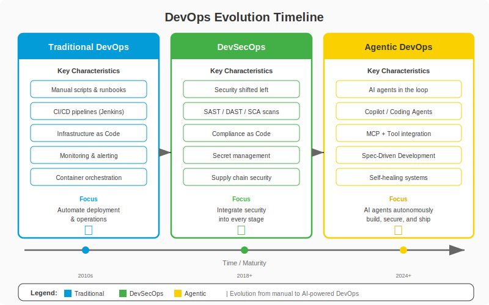

# Level 5-1 -- From Swords to Robots: The Evolution of DevOps

## Change Log

| Version | Date       | Author       | Description                        |
|---------|------------|--------------|------------------------------------|
| 1.0.0   | 2026-03-18 | Paula Silva  | Initial chapter creation           |

---

## Table of Contents

- [Introduction -- The Trophy Room](#introduction--the-trophy-room)
- [Section 1 -- The Timeline: Three Eras of Combat](#section-1--the-timeline-three-eras-of-combat)
  - [1.1 Overview of the Eras](#11-overview-of-the-eras)
  - [1.2 Comparison Table: The Three Eras](#12-comparison-table-the-three-eras)
- [Section 2 -- 1st Era: Traditional DevOps (Manual Combat)](#section-2--1st-era-traditional-devops-manual-combat)
  - [2.1 What is Traditional DevOps](#21-what-is-traditional-devops)
  - [2.2 The Mario Analogy: Fighting with Swords](#22-the-mario-analogy-fighting-with-swords)
  - [2.3 Tools of the 1st Era](#23-tools-of-the-1st-era)
  - [2.4 Limitations of Manual Combat](#24-limitations-of-manual-combat)
  - [2.5 What Traditional DevOps Achieved](#25-what-traditional-devops-achieved)
- [Section 3 -- 2nd Era: DevSecOps (Swords + Shields)](#section-3--2nd-era-devsecops-swords--shields)
  - [3.1 What is DevSecOps](#31-what-is-devsecops)
  - [3.2 The Mario Analogy: Adding Shields to the Arsenal](#32-the-mario-analogy-adding-shields-to-the-arsenal)
  - [3.3 Shift Left: Security from the Start](#33-shift-left-security-from-the-start)
  - [3.4 Tools of the 2nd Era](#34-tools-of-the-2nd-era)
  - [3.5 What DevSecOps Achieved](#35-what-devsecops-achieved)
- [Section 4 -- 3rd Era: Agentic DevOps (Autonomous Companions)](#section-4--3rd-era-agentic-devops-autonomous-companions)
  - [4.1 What is Agentic DevOps](#41-what-is-agentic-devops)
  - [4.2 The Mario Analogy: Commanding an Army of Companions](#42-the-mario-analogy-commanding-an-army-of-companions)
  - [4.3 What Agents Do in Agentic DevOps](#43-what-agents-do-in-agentic-devops)
  - [4.4 Tools of the 3rd Era](#44-tools-of-the-3rd-era)
  - [4.5 The Fundamental Shift](#45-the-fundamental-shift)
- [Section 5 -- Comparing the Three Eras in Practice](#section-5--comparing-the-three-eras-in-practice)
  - [5.1 Scenario: Fixing a Bug in Production](#51-scenario-fixing-a-bug-in-production)
  - [5.2 Scenario: Building a New Feature](#52-scenario-building-a-new-feature)
  - [5.3 Scenario: Doing Code Review](#53-scenario-doing-code-review)
- [Section 6 -- The Simplified Evolution](#section-6--the-simplified-evolution)
  - [6.1 The Evolution Formula](#61-the-evolution-formula)
  - [6.2 Final Analogy: The History of the Mushroom Kingdom](#62-final-analogy-the-history-of-the-mushroom-kingdom)
- [Section 7 -- Why Understanding the Evolution Matters](#section-7--why-understanding-the-evolution-matters)
  - [7.1 You Need to Know Where You Came From](#71-you-need-to-know-where-you-came-from)
  - [7.2 The Future is Agentic](#72-the-future-is-agentic)
- [What We Learned -- Summary Table](#what-we-learned--summary-table)
- [References](#references)

---

## Introduction -- The Trophy Room

<div align="center">

<br><em>DevOps Evolution: Traditional → DevSecOps → Agentic</em>
</div>

Sofia entered an enormous room in the basement of the Mushroom Kingdom's main castle. On the walls, three huge illuminated display cases showed weapons and equipment from different eras. Each case had a plaque:

- **Case 1:** *"Era of Swords"* -- simple swords, heavy armor, paper maps.
- **Case 2:** *"Era of Swords + Shields"* -- the same swords, but now with gleaming shields and trap detectors.
- **Case 3:** *"Era of Autonomous Companions"* -- brilliant robots, companions with their own intelligence, an army that fights ALONGSIDE you.

A historian Toad appeared next to Sofia. "Welcome to the Trophy Room, Sofia. Here we tell the story of how the Mushroom Kingdom evolved its defenses. In the beginning, all combat was manual -- every strike planned by humans. Then, we added shields and automatic defenses. And now..." he pointed to the third case, "...now we have companions that think, plan, and act on their own."

"Is this the history of DevOps?" asked Sofia.

"Exactly. Three eras. Three philosophies. Each one built upon the previous. And you're entering the third era -- the most powerful of all."

---

## Section 1 -- The Timeline: Three Eras of Combat

### 1.1 Overview of the Eras

Software development has evolved dramatically over the past two decades. Just as RPGs evolved from text games (MUDs) to open 3D worlds, DevOps has gone through three major transformations:

- **1st Era -- Traditional DevOps (~2010-2018):** Unification of Dev and Ops. Basic automation with CI/CD, containers, and monitoring. Everything configured and maintained by humans.
- **2nd Era -- DevSecOps (~2018-2024):** DevOps + Security integrated from day 1. Automated security testing in the pipeline. Security "shift left".
- **3rd Era -- Agentic DevOps (~2024-present):** AI agents actively participate in the entire cycle. They write code, review PRs, detect vulnerabilities, respond to incidents, and even self-recover.

> **MARIO ANALOGY:** Think of the evolution of combat in the Mushroom Kingdom. In the first era, Mario fought alone -- every jump, every attack was manually decided by the player. In the second era, Mario gained shields and armor that automatically protected him from certain attacks. In the third era, Mario began commanding an army of intelligent companions -- Yoshi, Luigi, Toad -- who fight alongside him, make their own decisions, and even complete missions on their own while Mario focuses on strategy.

### 1.2 Comparison Table: The Three Eras

| Aspect | 1st Era: Traditional DevOps | 2nd Era: DevSecOps | 3rd Era: Agentic DevOps |
|---|---|---|---|
| **Mario Analogy** | Manual combat -- every strike is planned | Combat with shield -- security from the start | Combat with autonomous AI companion |
| **Period** | ~2010-2018 | ~2018-2024 | ~2024-present |
| **Philosophy** | "Dev and Ops together" | "Dev, Sec, and Ops together" | "Dev, Sec, Ops, and AI together" |
| **Automation** | Basic CI/CD, scripts | CI/CD + security scans | CI/CD + intelligent agents |
| **Security** | Thought of at the end | Integrated from the start | Detected and fixed by agents |
| **Human role** | Does everything | Does almost everything, with automatic help | Supervises and directs agents |
| **Speed** | Fast (vs waterfall) | Fast + secure | Very fast + secure + intelligent |
| **Who writes code** | 100% humans | 100% humans (with templates) | Humans + AI agents |
| **Who does code review** | Humans | Humans + linters | Humans + AI agents |
| **Who responds to incidents** | Humans on call | Humans + automatic alerts | Humans + autonomous SRE agents |

---

## Section 2 -- 1st Era: Traditional DevOps (Manual Combat)

### 2.1 What is Traditional DevOps

Before DevOps, there were two separate worlds: the **Developers** (Dev) who wrote code and the **Operators** (Ops) who maintained the servers. They rarely talked to each other, and when code "worked on my machine" but broke in production, the blame game began.

**Traditional DevOps** united these two worlds. The core idea: Dev and Ops work together, from the first commit to the production deploy. Basic automation with CI/CD, containers to standardize environments, and monitoring to know when something breaks.

Fundamental principles of Traditional DevOps:

- **Culture of collaboration:** Dev and Ops on the same team
- **Pipeline automation:** CI/CD for build, test, and deploy
- **Infrastructure as Code:** Infrastructure defined in code (Terraform, CloudFormation)
- **Continuous monitoring:** Knowing what's happening in production (Prometheus, Grafana)
- **Fast feedback loops:** Quickly knowing if something broke

### 2.2 The Mario Analogy: Fighting with Swords

> **MARIO ANALOGY:** In the 1st Era, Mario fights with simple swords. Every strike is manually planned by the player. You see the Goomba, calculate the distance, press the attack button. If you miss, you take damage. If you hit, the Goomba dies. Every fight requires the player's full attention. There are no companions, no automatic attacks, no protective shield. It's pure manual skill.
>
> This is exactly how Traditional DevOps works: the developer configures each pipeline manually. Every CI/CD script is handwritten. Every monitoring alert is individually configured. Does it work well? Yes! But it demands constant attention and technical skill at every step.

The sword metaphor works because:

- **Sword = basic tool.** CI/CD, Docker, Kubernetes -- they are powerful tools, but they require the human to wield them correctly.
- **Every strike is manual.** Every pipeline needs to be written, tested, and maintained by humans.
- **The player does everything.** There's no assistant, no companion. The dev configures, monitors, fixes, deploys.

### 2.3 Tools of the 1st Era

| Tool | Category | What It Does | Mario Analogy |
|---|---|---|---|
| **Jenkins** | CI/CD | Build and deploy automation | The forge where you sharpen your swords |
| **Docker** | Containers | Packages applications in standardized containers | Portable chest that works in any castle |
| **Kubernetes** | Orchestration | Manages containers at scale | The map that organizes chests across multiple castles |
| **Terraform** | IaC | Defines infrastructure as code | The castle blueprint -- written on magic paper |
| **Prometheus** | Monitoring | Collects metrics in real time | The Lakitu watching from above with a lens |
| **Grafana** | Visualization | Monitoring dashboards | The control panel in the throne room |
| **Ansible** | Configuration | Server configuration automation | The castle construction script |
| **GitHub Actions** | CI/CD | Automation pipelines on GitHub | The Lakitu that executes tasks automatically |

### 2.4 Limitations of Manual Combat

Even with all these tools, the 1st Era had significant limitations:

1. **Everything depends on the human.** If the dev doesn't configure the pipeline, there's no automation. It's like playing Mario without power-ups -- possible, but much harder.

2. **Security as an afterthought.** In the 1st Era, security was checked AT THE END of the process. The castle was built first, and only then someone checked for traps. Often, too late.

3. **Limited scalability.** The more projects, the more pipelines to maintain manually. It's like having 100 castles and needing to sharpen 100 different swords every day.

4. **Alerts without intelligence.** Monitoring would warn "something broke", but wouldn't say WHY it broke or HOW to fix it. The Lakitu would shout "DANGER!" but wouldn't help solve it.

5. **100% human code review.** Every Pull Request needed a human to review it. On large teams, this became a bottleneck.

### 2.5 What Traditional DevOps Achieved

Despite the limitations, the 1st Era was revolutionary:

- **Unified Dev and Ops** -- ended the war between teams
- **Introduced CI/CD** -- deploy in minutes, not weeks
- **Standardized environments** -- "works on my machine" was no longer a problem
- **Created a culture of automation** -- the foundation for everything that came after
- **Fast feedback** -- knowing in minutes if something broke

> **MARIO ANALOGY:** The 1st Era is like level 1-1 of Super Mario Bros. It looks simple compared to the final levels, but it's where you learn the fundamentals: jumping, running, collecting coins, avoiding enemies. Without mastering level 1-1, you never reach World 8. Traditional DevOps is the foundation of EVERYTHING that came after.

---

## Section 3 -- 2nd Era: DevSecOps (Swords + Shields)

### 3.1 What is DevSecOps

**DevSecOps** was born from a painful realization: security cannot be an afterthought. When you build an entire castle and only then check for traps, the cost of fixing it is enormous. Often, you need to tear down entire walls.

The DevSecOps philosophy is simple: **security integrated into EVERY step of the process**, from the first commit to production monitoring. It's not an extra phase at the end -- it's an ingredient that permeates everything.

Principles added by DevSecOps:

- **Shift Left:** Move security checks to the BEGINNING of the process
- **Security as Code:** Security policies defined as code
- **Security automation:** Automatic scans on every commit and PR
- **Shared responsibility:** Security is EVERYONE's responsibility, not just the security team's
- **Continuous compliance:** Automatic compliance verification

### 3.2 The Mario Analogy: Adding Shields to the Arsenal

> **MARIO ANALOGY:** In the 2nd Era, Mario still fights with swords, but now has SHIELDS. The shield isn't something you activate manually -- it's ALWAYS active, protecting automatically. When a Koopa throws a shell, the shield blocks it without you needing to press a button. When you approach a suspicious block, the shield glows red, warning: "Watch out, trap!"
>
> This is DevSecOps: security is always active, automatically. Every commit goes through a security check. Every dependency is scanned. Every secret is protected. You don't need to remember to activate security -- it's PART of the equipment.

### 3.3 Shift Left: Security from the Start

The most important concept in DevSecOps is **Shift Left** -- moving security checks to the left on the development timeline:

```
BEFORE (Traditional DevOps):
  Code -> Build -> Test -> Deploy -> [Security] -> Production
                                      ^
                              Too late! Expensive to fix.

AFTER (DevSecOps):
  [Security] -> Code -> [Security] -> Build -> [Security] -> Test -> Deploy -> Production
       ^                     ^                      ^
  Pre-commit            On every PR            In the pipeline
  Local check          Automatic scan         Security tests
```

> **MARIO ANALOGY:** In old Mario, you only discovered a level had traps BY PLAYING the level and dying. In modern Mario with DevSecOps, the shield detects traps BEFORE you step on them. The trap detector works at three moments: when you enter the level (pre-commit), when you reach a checkpoint (PR), and when you're on the path to the boss (pipeline).

### 3.4 Tools of the 2nd Era

| Tool | Category | What It Does | Mario Analogy |
|---|---|---|---|
| **SAST (CodeQL)** | Code Scanning | Analyzes source code looking for vulnerabilities | Detector of invisible traps in the walls |
| **DAST** | Runtime Scanning | Tests the running application looking for flaws | Sending a scout Toad through the level |
| **SCA (Dependabot)** | Dependency Scanning | Checks for vulnerable dependencies | Shop item inspector -- "this mushroom is expired!" |
| **Secret Scanning** | Secret Detection | Detects exposed keys and passwords in code | Anti-theft alarm -- detects exposed castle keys |
| **Snyk** | Full-Stack Security | Code, container, and IaC security | Complete guard watching over everything |
| **OWASP ZAP** | Pentesting | Automated penetration tests | Koopa hired to test the castle's defenses |
| **Trivy** | Container Scanning | Scans Docker images for vulnerabilities | Chest inspector -- checks there's no trap inside |
| **Push Protection** | Prevention | Blocks push of secrets before it happens | Gate that won't open if you're carrying exposed keys |

### 3.5 What DevSecOps Achieved

- **Security from day 1** -- not as an afterthought
- **Automatic scans** -- every commit verified
- **Lower fix cost** -- security bugs found early are cheap to fix
- **Security culture** -- every dev thinks about security, not just the sec team
- **Automated compliance** -- audits become simpler

> **MARIO ANALOGY:** With the shield, Mario no longer needs to worry about being caught off guard by known attacks. The shield handles that automatically. This frees the player to focus on what matters: strategy, exploration, creativity. DevSecOps freed devs to focus on code without forgetting about security.

---

## Section 4 -- 3rd Era: Agentic DevOps (Autonomous Companions)

### 4.1 What is Agentic DevOps

**Agentic DevOps** is the next evolution. Instead of just USING AI tools (like Copilot suggesting code), AI agents become **active team members**. They don't just help -- they ACT autonomously within defined boundaries.

The fundamental difference:

- **Traditional DevOps:** Humans automate with scripts
- **DevSecOps:** Humans automate with scripts + security
- **Agentic DevOps:** AI + humans automate together, with AI acting autonomously

In Agentic DevOps, AI agents:

- **Write code** based on specifications (Spec-Driven Development)
- **Review Pull Requests** automatically, identifying bugs and suggesting improvements
- **Detect and fix** security vulnerabilities
- **Respond to incidents** in production (Azure SRE Agent)
- **Generate tests** automatically for new code
- **Create documentation** from code
- **Plan and execute** infrastructure migrations

### 4.2 The Mario Analogy: Commanding an Army of Companions

> **MARIO ANALOGY:** In the 3rd Era, Mario no longer fights alone. He commands an ARMY of intelligent companions. Yoshi goes ahead eating enemies. Luigi covers the rear. Toad checks for traps. Peach tests if the path is safe. Each companion has its own intelligence -- they don't wait for Mario to say "jump now". They SEE the enemy and DECIDE the best action.
>
> Mario has gone from being the warrior who does everything alone. Now he's the COMMANDER who defines the strategy, and the companions execute. If a companion finds a problem it can't solve, it ESCALATES to Mario: "Boss, I found something strange here. What should I do?" Mario decides, and the companion executes.

The complete evolution in one sentence:

```
Era 1: Mario fights alone with swords (Traditional DevOps)
Era 2: Mario fights with swords + automatic shields (DevSecOps)
Era 3: Mario commands intelligent companions that fight WITH him (Agentic DevOps)
```

### 4.3 What Agents Do in Agentic DevOps

| What the Agent Does | Manual Equivalent | Gain | Mario Analogy |
|---|---|---|---|
| **Writes code from specs** | Dev writes line by line | 10x faster | Yoshi builds the level based on the blueprint |
| **Reviews PRs automatically** | Dev reads each PR manually | Reviews in seconds | Toadette inspects every block built |
| **Detects vulnerabilities** | Sec team does an audit | Real-time detection | Star Shield that glows when detecting danger |
| **Responds to incidents** | On-call dev woken up at 3am | Response in seconds | Autonomous Yoshi that defends the castle 24/7 |
| **Generates tests** | Dev writes each test | Automatic full coverage | Peach creates training obstacles for each level |
| **Creates documentation** | Dev writes docs (or doesn't) | Always up-to-date docs | Historian Toad who records everything automatically |
| **Resolves issues** | Dev picks up issue, analyzes, implements | Issues resolved autonomously | Coding Agent that receives a mission and returns with a solution |

### 4.4 Tools of the 3rd Era

| Tool | Category | What It Does | Mario Analogy |
|---|---|---|---|
| **GitHub Copilot (Agent Mode)** | IDE Agent | Companion that codes WITH you | Yoshi playing alongside Mario |
| **GitHub Coding Agent** | Background Agent | Resolves issues and opens PRs on its own | Yoshi who goes on a solo mission and returns with the result |
| **Azure SRE Agent** | Autonomous SRE | Responds to incidents in production | Autonomous guardians that defend the castle 24/7 |
| **MCP (Model Context Protocol)** | Integration | Connects agents to external tools | Warp Zones to other worlds |
| **Spec-Kit** | Development | Specification-driven development | Detailed castle blueprint that the NPC builder follows |
| **Custom Agents (.agent.md)** | Configuration | Specialized agents for each domain | Character sheets for each companion |
| **Agent Skills (SKILL.md)** | Skills | Reusable skills for agents | Power-Ups that any companion can use |
| **Copilot Autofix** | Security | Automatic vulnerability fixing | Shield that not only detects but also fixes traps |

### 4.5 The Fundamental Shift

The deepest change of the 3rd Era isn't technological -- it's **philosophical**. The developer's role changes:

| Aspect | Before (1st and 2nd Era) | Now (3rd Era) |
|---|---|---|
| **Main role** | Code writer | Architect and supervisor |
| **Time spent coding** | 80% | 40% |
| **Time spent reviewing** | 15% | 30% |
| **Time spent directing agents** | 0% | 25% |
| **Most valuable skill** | Writing code fast | Writing clear specifications |
| **Metaphor** | Solo warrior | Army commander |

> **MARIO ANALOGY:** It's the difference between BEING the Mario who jumps on every Goomba (1st Era) and being the PLAYER who commands Mario, Luigi, Yoshi, and the whole team (3rd Era). The player is still essential -- without them, the companions don't know WHERE to go. But now the player focuses on strategy, not on executing each individual jump.

---

## Section 5 -- Comparing the Three Eras in Practice

### 5.1 Scenario: Fixing a Bug in Production

**1st Era (Traditional DevOps):**
1. Alert fires at 3am
2. On-call dev wakes up, opens laptop
3. Manually analyzes logs for 30 minutes
4. Identifies the bug, writes the fix
5. Runs tests, opens PR, waits for review
6. Deploys manually
7. Total time: 2-4 hours

**2nd Era (DevSecOps):**
1. Alert fires at 3am with more context (security scans included)
2. On-call dev wakes up, opens laptop
3. Dashboard shows logs + security scan + metrics
4. Identifies the bug faster with better context
5. Writes the fix, automatic scan verifies the fix's security
6. Automated deploy after approval
7. Total time: 1-2 hours

**3rd Era (Agentic DevOps):**
1. Alert fires at 3am
2. Azure SRE Agent detects the incident automatically
3. Agent analyzes logs, identifies root cause, proposes fix
4. Agent applies fix to staging, runs automated tests
5. If tests pass, notifies the dev: "Incident resolved. Here's what I did and why."
6. Dev reviews in the morning and approves (or adjusts)
7. Total time: 15-30 minutes (mostly autonomous)

> **MARIO ANALOGY:** In the 1st Era, you wake up at 3am because a Koopa invaded the castle and you need to go there personally to fight. In the 2nd Era, you wake up but the castle already has defenses that contained the Koopa -- you just need to deliver the final blow. In the 3rd Era, Yoshi already defeated the Koopa, cleaned up the mess, and sends you a report in the morning: "Boss, a Koopa got in at 3am. I handled it. Here's what happened."

### 5.2 Scenario: Building a New Feature

**1st Era (Traditional DevOps):**
1. Dev reads the spec in Jira/Azure Boards
2. Writes all the code manually (frontend, backend, tests)
3. Configures CI/CD pipeline for the new feature
4. Opens PR, waits for review from another human dev
5. Resolves comments, merges
6. Monitors the deploy
7. Total time: 3-5 days

**2nd Era (DevSecOps):**
1. Dev reads the spec
2. Writes the code (with templates and snippets)
3. Pipeline already includes automatic security scans
4. PR automatically includes SAST/DAST scan
5. Human review + automatic scan
6. Deploy with automatic compliance check
7. Total time: 2-4 days

**3rd Era (Agentic DevOps):**
1. Dev writes a detailed SPECIFICATION (spec)
2. Coding Agent reads the spec and generates the code (frontend, backend, tests)
3. Agent opens a complete PR with a detailed description
4. Dev reviews the PR (review agent has already passed)
5. Dev adjusts what's necessary, merges
6. Automatic deploy with agent monitoring
7. Total time: 4-8 hours

### 5.3 Scenario: Doing Code Review

**1st Era:** Human dev reads every line, comments, waits for fixes. Time: 30min to 2h per PR.

**2nd Era:** Linter and automated tools make the first pass. Human dev focuses on the real problems. Time: 15min to 1h per PR.

**3rd Era:** Code review agent analyzes everything (style, security, performance, tests), comments on the PR with specific suggestions. Human dev reviews the agent's comments and makes the final decision. Time: 5-15min per PR.

---

## Section 6 -- The Simplified Evolution

### 6.1 The Evolution Formula

The evolution can be summarized in a simple formula:

```
DevOps (humans automate)
    -> DevSecOps (humans automate with security)
        -> Agentic DevOps (AI + humans automate together, with AI acting autonomously)
```

Each era does NOT eliminate the previous one. It ADDS:

- Agentic DevOps INCLUDES everything from DevSecOps
- DevSecOps INCLUDES everything from Traditional DevOps
- You don't discard the swords when you gain the shield
- You don't discard the shield when you gain companions

### 6.2 Final Analogy: The History of the Mushroom Kingdom

> **MARIO ANALOGY:** Imagine the complete history of the Mushroom Kingdom:
>
> **Chapter 1 (DevOps):** Mario learns to fight with swords. He and Ops unite. Together, they build the first castles with basic automation. Each brick placed manually, but at least Dev and Ops work together.
>
> **Chapter 2 (DevSecOps):** Mario discovers that the castles are being invaded. He adds automatic shields, trap detectors, anti-theft alarms. Now every castle built already comes with BUILT-IN security. Invaders still try, but the shield catches most of them.
>
> **Chapter 3 (Agentic DevOps):** Mario realizes he can't build and defend 100 castles alone. He recruits an army of intelligent companions. Yoshi builds castles. Toad inspects defenses. Luigi patrols at night. Peach tests every door and window. Mario becomes the COMMANDER -- defines the strategy, and the army executes. And when someone finds something they can't solve, they ESCALATE to Mario.

---

## Section 7 -- Why Understanding the Evolution Matters

### 7.1 You Need to Know Where You Came From

Understanding the three eras isn't just history -- it's **fundamental** to working in the current era:

- If you don't understand CI/CD (1st Era), you can't configure pipelines for agents
- If you don't understand security (2nd Era), you can't define guardrails for autonomous agents
- If you jump straight to agents without the fundamentals, you create chaos instead of productivity

> **MARIO ANALOGY:** You can't command an army if you've never wielded a sword. The commander needs to understand manual combat to give intelligent orders. A Mario who never fought alone doesn't know how to evaluate if Yoshi is doing a good job.

### 7.2 The Future is Agentic

The future of software development is clear: **increasingly agentic**. This doesn't mean devs will lose their jobs -- it means devs will change roles:

- From **code writers** to **architects and supervisors**
- From **executors** to **strategists**
- From **solo warriors** to **team commanders**

The most valuable skill of the future isn't writing code fast. It's **writing clear specifications, defining effective guardrails, and supervising intelligent agents**.

---

## What We Learned -- Summary Table

| Concept | What It Is | Mario Analogy | Why It Matters |
|---|---|---|---|
| **Traditional DevOps** | Dev + Ops together, basic automation | Manual combat with swords | Foundation of everything: CI/CD, containers, monitoring |
| **DevSecOps** | DevOps + integrated security | Swords + automatic shields | Security isn't optional, it's part of the equipment |
| **Agentic DevOps** | DevOps + autonomous AI agents | Commanding an army of companions | The future: humans direct, agents execute |
| **Shift Left** | Security from the start | Detecting traps before stepping on them | Cheaper to fix early than late |
| **Spec-Driven Dev** | Write specs, agents generate code | Giving the blueprint to the NPC builder | The most valuable skill of the future |
| **Cumulative evolution** | Each era includes the previous one | Sword + shield + companions | Don't discard fundamentals when adopting the new |

---

## References

| Resource | Type | Link |
|---|---|---|
| Microsoft DevOps Resource Center | Documentation | https://learn.microsoft.com/en-us/devops/ |
| GitHub Blog -- Agentic DevOps | Official blog | https://github.blog/ai-and-ml/github-copilot/ |
| OWASP DevSecOps Guideline | Framework | https://owasp.org/www-project-devsecops-guideline/ |
| Azure SRE Agent | Documentation | https://learn.microsoft.com/en-us/azure/sre-agent |
| GitHub Spec-Kit | Repository | https://github.com/github/spec-kit |
| GitHubNext Agentics | Research | https://github.com/githubnext/agentics |
| DevOps Handbook (Kim, Humble, et al.) | Book | https://itrevolution.com/product/the-devops-handbook-second-edition/ |

---

*Level 5-1 complete! You now understand the three eras of DevOps and know that we're entering the most powerful era -- the era of autonomous companions. In the next level, we'll learn about AI maturity levels. Get ready to evolve from Apprentice to Legendary!*

---

<div align="center">

⬅️ [Previous: Level 4-BOSS: Partial Glossary](../world-4-water/4-BOSS-glossario_parcial.md) · 🗺️ [World Map](../INDEX.md) · ➡️ [Next: Level 5-2: AI Maturity](5-2_ai-maturity.md)

</div>
