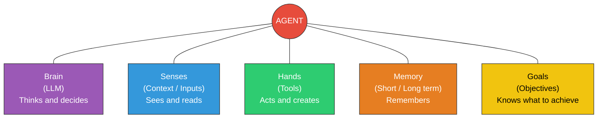
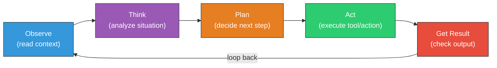

## Change Log

| Version | Date | Author | Changes |
|---------|------|--------|---------|
| 1.0.0 | 2026-03-18 | Paula Silva | Initial version — Super Mario Bros Edition |

# Level 5-4 -- NPCs that Came to Life: What Is an AI Agent

---

**Prepared for:** Sofia
**Version:** 1.0 (Mushroom Kingdom Edition)
**Author:** Paula Silva | Microsoft Latam Software GBB
**Date:** March 2026
**Language:** Brazilian Portuguese (pt-BR)
**Collection:** Agentic DevOps -- Complete Software Development Guide

---

## TABLE OF CONTENTS

- [Introduction -- The NPC that Learned to Think](#introduction--the-npc-that-learned-to-think)
- [Section 1 -- What Is an AI Agent, Anyway?](#section-1--what-is-an-ai-agent-anyway)
  - [Fundamental Definition](#fundamental-definition)
  - [The 5 Components of an Agent](#the-5-components-of-an-agent)
  - [Table: Agent Components vs Mario Character Anatomy](#table-agent-components-vs-mario-character-anatomy)
- [Section 2 -- The Sense-Think-Act Cycle: How an Agent Works](#section-2--the-sense-think-act-cycle-how-an-agent-works)
  - [The Fundamental Loop](#the-fundamental-loop)
  - [Practical Example: The Agent Solving a Bug](#practical-example-the-agent-solving-a-bug)
  - [The Complete Loop in Detail](#the-complete-loop-in-detail)
- [Section 3 -- Chatbot vs Agent: The Big Difference](#section-3--chatbot-vs-agent-the-big-difference)
  - [The Regular NPC vs The NPC that Came to Life](#the-regular-npc-vs-the-npc-that-came-to-life)
  - [Comparison Table: Chatbot vs Agent vs Autonomous Agent](#comparison-table-chatbot-vs-agent-vs-autonomous-agent)
  - [The 3 Levels of Evolution](#the-3-levels-of-evolution)
- [Section 4 -- The 5 Organs of an Agent in Detail](#section-4--the-5-organs-of-an-agent-in-detail)
  - [1. The Brain (LLM)](#1-the-brain-llm)
  - [2. The Senses (Inputs and Context)](#2-the-senses-inputs-and-context)
  - [3. The Hands (Tools)](#3-the-hands-tools)
  - [4. Memory (Short and Long Term)](#4-memory-short-and-long-term)
  - [5. Goals](#5-goals)
  - [Complete Table: The 5 Organs](#complete-table-the-5-organs)
- [Section 5 -- The Agent Loop: Observe-Think-Plan-Act](#section-5--the-agent-loop-observe-think-plan-act)
  - [The Complete Cycle in 6 Steps](#the-complete-cycle-in-6-steps)
  - [Agent Loop Diagram](#agent-loop-diagram)
  - [Real Example: GitHub Copilot as an Agent](#real-example-github-copilot-as-an-agent)
  - [Real Example: Claude as an Agent](#real-example-claude-as-an-agent)
- [Section 6 -- Why Agents Matter for DevOps](#section-6--why-agents-matter-for-devops)
  - [Before and After: The World Without and With Agents](#before-and-after-the-world-without-and-with-agents)
  - [The Future that Has Already Begun](#the-future-that-has-already-begun)
- [What We Learned -- Summary Table](#what-we-learned--summary-table)

---

## Introduction -- The NPC that Learned to Think

Sofia was running through a level in the Mushroom Kingdom when something strange happened. She passed by a Toad -- that classic NPC that always stands in front of a little house -- expecting to hear the same old line: *"Thank you Mario! But the princess is in another castle!"*

But this time, Toad did something different.

He looked at Sofia, noticed she was low on health, checked her inventory, remembered that the last time they met she had trouble with flying Koopas, and said: *"Sofia, you're low on energy. There's a Super Mushroom hidden behind that block over there. And be careful -- in the next section there are three flying Koopas. Last time they got you. Want me to go ahead and show you the safe route?"*

Sofia froze. That NPC... *thought*. He *remembered*. He *offered help*. He *planned a route*. He was no longer an NPC -- he was an **Agent**.

"Welcome to Level 5-4," said Toad, now with a different gleam in his eyes. "Here you'll understand what transformed me from a simple NPC with scripted lines into a character that thinks, plans, acts, and learns. The difference between a chatbot and an agent is the same difference between me standing still repeating the same line forever... and me truly coming to life."

---

## Section 1 -- What Is an AI Agent, Anyway?

### Fundamental Definition

An **AI Agent** is a system that can **perceive** its environment, **reason** about what it perceives, **plan** actions, **execute** those actions using tools, and **learn** from the results -- all autonomously or semi-autonomously, to achieve a **goal**.

In simple terms: an agent is an AI that doesn't just *answer questions*, but *does things*.

The fundamental formula of an agent:

```
AGENT = LLM + Tools + Memory + Goals
```

Where:
- **LLM** (Large Language Model) = the brain that reasons
- **Tools** = the hands that execute actions in the real world
- **Memory** = the ability to remember context and lessons learned
- **Goals** = the purpose that guides all decisions

> **MARIO ANALOGY:** Think of a classic Mario NPC. It stands still, says a scripted line, and repeats that line forever. It doesn't matter if you're at full health or almost dying. It doesn't matter if you've passed by 50 times already. It always says the same thing. Now imagine that NPC gained a **brain** (LLM), **eyes** (context sensors), **hands** (tools to interact with the world), **memory** (remembers previous conversations), and a **goal** (help you complete the level). It stopped being an NPC and became an AGENT -- a character that truly *lives* in the game.

### The 5 Components of an Agent

Every AI agent, whether simple or complex, has 5 fundamental components. Without any one of them, you have something less than a complete agent.

### Diagram: What Is an Agent - Components



### Table: Agent Components vs Mario Character Anatomy

| Component | What It Does | Mario Analogy | Without It... |
|---|---|---|---|
| **Brain (LLM)** | Reasons, interprets, generates text, makes decisions | **Mario's brain** -- decides when to jump, when to run, when to attack | No brain = NPC that just repeats lines. Doesn't think, doesn't decide. |
| **Senses (Inputs)** | Receives information from the environment and user | **Mario's eyes and ears** -- sees enemies, hears danger music, reads signs | No senses = blind and deaf character. Acts without knowing what's happening around it. |
| **Hands (Tools)** | Executes actions in the real world (create files, run commands, access APIs) | **Mario's hands** -- grabs coins, opens blocks, throws fireballs, uses items | No hands = only talks, doesn't do. Can think of the solution but can't implement it. |
| **Memory** | Remembers past interactions and accumulates knowledge | **Mario's save game** -- remembers which levels he completed, which secrets he found | No memory = every conversation starts from zero. Forgets everything after each interaction. |
| **Goals** | Defines the purpose that guides all actions | **Mario's mission** -- save Princess Peach, collect all stars | No goals = acts randomly. Does things without direction or purpose. |

---

## Section 2 -- The Sense-Think-Act Cycle: How an Agent Works

### The Fundamental Loop

An agent's behavior can be summarized in three words: **Sense**, **Think**, **Act**. This cycle repeats continuously while the agent is active.

```
┌─────────────────────────────────────────────────┐
│                                                 │
│    ┌──────────┐    ┌──────────┐    ┌─────────┐ │
│    │  SENSE   │───>│  THINK   │───>│   ACT   │ │
│    │          │    │          │    │         │ │
│    └──────────┘    └──────────┘    └─────────┘ │
│         ^                               │       │
│         │                               │       │
│         └───────────────────────────────┘       │
│              (Observe result)                   │
│                                                 │
└─────────────────────────────────────────────────┘
```

**SENSE:** The agent receives information from the environment. This can be a user message, file contents, a command result, API data, or any other input.

**THINK:** The agent uses its brain (LLM) to process the information. It interprets, reasons, evaluates options, and decides what to do. This is where the "intelligence" happens.

**ACT:** The agent executes an action in the real world using its tools. It could be writing code, running a test, sending a message, or creating a file.

After acting, the agent **observes the result** of its action (what changed in the environment?) and the cycle starts again. This loop continues until the goal is reached or the agent decides it needs human help.

> **MARIO ANALOGY:** Mario is in a level. He **senses** (sees a Goomba coming his way), **thinks** (it's an enemy, I need to jump on it or dodge it, the best option is to jump because I'm at ground level), and **acts** (jumps on top of the Goomba). Then, he **observes the result** (the Goomba was defeated, earned 100 points, path is clear). And continues the level. If the jump fails, he observes that he lost health and adjusts his strategy. It's a constant loop of sense-think-act-observe.

### Practical Example: The Agent Solving a Bug

Let's see how the Sense-Think-Act cycle works in a real DevOps scenario:

| Step | Cycle Phase | What the Agent Does | Mario Analogy |
|---|---|---|---|
| 1 | **SENSE** | Receives the message: "The login button doesn't work on mobile" | Mario sees a locked door in the castle |
| 2 | **THINK** | Analyzes: "I need to investigate the login component, specifically for mobile screens" | Mario thinks: "I need a key. Where could it be?" |
| 3 | **ACT** | Searches for the file `LoginButton.tsx` and analyzes the code | Mario searches the blocks around the door |
| 4 | **SENSE** | Reads the code and detects an `onClick` that doesn't work on touch screens | Mario finds the key in a hidden block |
| 5 | **THINK** | Reasons: "I need to add `onTouchStart` in addition to `onClick`" | Mario thinks: "This key opens that door" |
| 6 | **ACT** | Modifies the file, adds the touch handler | Mario uses the key on the door |
| 7 | **SENSE** | Runs the tests and sees they passed | Mario sees the door open |
| 8 | **THINK** | Evaluates: "Bug fixed. I should create a PR with the fix." | Mario thinks: "Mission accomplished, time to move forward" |
| 9 | **ACT** | Creates a Pull Request with a clear description of the fix | Mario goes through the door and heads to the next level |

### The Complete Loop in Detail

In practice, the loop of a modern agent is more detailed than the basic Sense-Think-Act. It includes planning and self-evaluation steps:

```
1. OBSERVE     → Receive information from the environment
2. INTERPRET   → Understand what the information means
3. PLAN        → Create a plan of actions
4. SELECT      → Choose the right tool for each action
5. EXECUTE     → Use the tool to act
6. EVALUATE    → Verify if the action had the expected result
7. ITERATE     → If not, adjust the plan and repeat
8. CONCLUDE    → If yes, report the result
```

This loop is what differentiates an agent from a simple program that follows fixed instructions. The agent can **change plans** mid-execution if something doesn't go as expected -- exactly like Mario who changes route when he encounters an unexpected obstacle.

---

## Section 3 -- Chatbot vs Agent: The Big Difference

### The Regular NPC vs The NPC that Came to Life

The most common confusion in the AI world is thinking that every chatbot is an agent. It's not. The difference is fundamental and has enormous practical consequences.

A **chatbot** is like a classic Mario NPC: it's there, you interact with it, it responds based on a script (even if that script is very sophisticated, like an LLM). But it doesn't *do* anything beyond talking. You ask, it answers. End.

An **agent** is that NPC that came to life. It doesn't just respond -- it *investigates*, *plans*, *executes*, *learns*. If you ask it to fix a bug, it doesn't give you a text response with suggestions. It goes to the code, finds the problem, writes the fix, runs the tests, and creates the Pull Request. It *acts* in the real world.

> **MARIO ANALOGY:** Imagine two Toads. The **Chatbot Toad** stands at the castle entrance and always says: *"The princess is in another castle!"* No matter how many times you ask, no matter if you already saved the princess, nothing matters. He repeats the same line. Now the **Agent Toad**: he looks at you, sees you're lost, pulls up the map, identifies the fastest route, opens the secret door, and says: *"Follow this way, I'll clear the path for you."* He **thinks**, **plans**, and **acts**. That's the difference.

### Comparison Table: Chatbot vs Agent vs Autonomous Agent

| Characteristic | Chatbot (Regular NPC) | Agent (Living NPC) | Autonomous Agent (NPC with Its Own Mission) |
|---|---|---|---|
| **What it does** | Answers questions | Answers AND executes actions | Completes entire missions on its own |
| **Tools** | None (text only) | Uses tools | Uses tools and chooses which to use |
| **Memory** | Only current conversation | Conversation + project context | Conversation + project + long-term history |
| **Planning** | Doesn't plan | Plans simple steps | Decomposes missions into sub-tasks |
| **Autonomy** | Zero -- only responds when asked | Medium -- acts when requested | High -- acts proactively |
| **Example** | Basic ChatGPT, Siri | GitHub Copilot Agent Mode | GitHub Coding Agent (opens PRs on its own) |
| **Mario Analogy** | Toad that repeats a line | Yoshi that executes commands | Yoshi that completes levels on its own |
| **Interaction** | Question → Answer | Request → Planning → Execution | Goal → Complete mission |
| **Errors** | Answers wrong and doesn't know | Tries again with a different approach | Tries multiple strategies and escalates if needed |
| **Learning** | Doesn't learn between sessions | Learns within the session | Learns and accumulates across sessions |

### The 3 Levels of Evolution

Think of the evolution of an NPC in Mario:

**Level 1 -- The Static NPC (Chatbot)**
```
Player: "Where is the princess?"
NPC: "The princess is in another castle!"
Player: "But I already saved the princess!"
NPC: "The princess is in another castle!"
Player: "Can you help me fight?"
NPC: "The princess is in another castle!"
```
The NPC doesn't understand context, doesn't change behavior, doesn't do anything beyond repeating lines. Basic chatbots are like this -- impressively good at generating text, but incapable of *acting*.

**Level 2 -- The Living NPC (Agent)**
```
Player: "There's a bug in my code."
NPC: "Let me take a look... [opens file] [analyzes code] [finds error]
      Found it! Line 42, you forgot to close the parenthesis. Want me to fix it?"
Player: "Yes!"
NPC: [edits file] [runs tests] "Done! Fixed and tested."
```
The NPC understands context, uses tools to investigate, and executes concrete actions. Most modern AI agents are at this level.

**Level 3 -- The NPC with Its Own Mission (Autonomous Agent)**
```
[The agent detects a new issue on GitHub]
NPC: "I see there's a new issue about performance. I'll investigate."
     [analyzes code] [identifies bottleneck] [writes fix]
     [runs tests] [creates Pull Request]
NPC: "I created PR #142 with the performance fix. Reduced response
      time from 3s to 200ms. Can you review?"
```
The NPC acts without being asked, takes on missions, and completes entire tasks on its own. This is the future being built right now.

---

## Section 4 -- The 5 Organs of an Agent in Detail

Let's dive into each component of an agent. Understanding these "organs" is essential to know how agents work and how to configure them correctly.

### 1. The Brain (LLM)

The brain of an agent is a **Large Language Model (LLM)** -- an AI model trained on enormous amounts of text that can understand natural language, reason, generate code, and make decisions.

The LLM is responsible for:
- **Interpreting** what the user wants
- **Reasoning** about the best approach
- **Generating** text, code, action plans
- **Deciding** which tool to use and when
- **Evaluating** whether the result was satisfactory

Examples of LLMs that serve as agent brains:
- **Claude** (Anthropic) -- used in GitHub Copilot and Claude Code
- **GPT-4o** (OpenAI) -- used in ChatGPT and custom agents
- **Gemini** (Google) -- used in Google tools

> **MARIO ANALOGY:** The LLM is like **Mario's brain**. It's what decides: "There's a hole there, I need to jump. There's a Goomba, I need to jump on it or dodge. There's a question block, it's worth hitting." Without a brain, Mario would be like a character in demo mode -- walking in a straight line until falling into a hole. The brain is what transforms movement into *strategy*.

**Brain quality matters:** Just as there's a difference between small Mario (no power-ups) and Mario with a Super Star, there's a difference between LLMs. A more capable model makes better decisions, makes fewer mistakes, and solves more complex problems. That's why the model choice (`model: "claude-opus-4-6"` in `.agent.md` files) matters.

### 2. The Senses (Inputs and Context)

An agent's senses are all the channels through which it receives information:

| Sense | What It Captures | Mario Analogy | Example |
|---|---|---|---|
| **User message** | What you asked for | The player's command (pressing button A = jump) | "Fix the login bug" |
| **Project files** | Code, configurations, docs | The level scenery (blocks, platforms, coins) | The contents of `LoginButton.tsx` |
| **Tool results** | Output from executed commands | The result of an action (coin collected, enemy defeated) | Output from `npm test` |
| **Conversation history** | Previous messages | Short-term memory (what happened in this level) | "You asked me to use TypeScript" |
| **System instructions** | Rules and configurations | Level rules (gravity, time limit) | Contents of `.instructions.md` |
| **Environment context** | IDE, terminal, system | The surrounding world (which world, which level) | "We're in VS Code, React project" |

The more senses an agent has, the better it understands the situation and the more accurate its decisions are. A blind agent (without access to the code) is like Mario playing blindfolded -- he might land some jumps, but he'll fall into many holes.

### 3. The Hands (Tools)

Tools are what transform a chatbot into an agent. They are the **hands** that allow the agent to interact with the real world.

| Tool | What It Does | Mario Analogy | Usage Example |
|---|---|---|---|
| **File reading** | Reads code and documents | Mario looking at a block's contents | Read `package.json` to see dependencies |
| **File writing** | Creates and edits code | Mario building blocks and platforms | Edit `LoginButton.tsx` to fix a bug |
| **Terminal / Shell** | Executes commands | Mario activating levers and mechanisms | Run `npm test`, `git commit` |
| **Code search** | Finds patterns in the project | Mario using the map to find items | Search all uses of `useAuth()` |
| **External APIs** | Connects with services | Mario using Warp Pipes to other worlds | Access GitHub API, Slack, database |
| **Web browser** | Searches the internet | Mario visiting the item shop | Search React documentation |

Without tools, the agent is a philosopher -- thinks a lot, does nothing. With tools, it's an engineer -- thinks AND builds.

> **MARIO ANALOGY:** Tools are like Mario's **Power-Up inventory**. Without any power-ups, Mario can only run and jump. With Fire Flower, he can attack from a distance. With Cape Feather, he can fly. With Super Star, he becomes invincible. Each tool expands what the agent CAN DO. And just as Mario doesn't need all power-ups in every level, an agent doesn't need all tools for every task -- what matters is having the right tools for the current challenge.

### 4. Memory (Short and Long Term)

Memory is what allows the agent to maintain coherence and learn. There are two fundamental types:

**Short-Term Memory (Working Memory)**
- Lasts while the conversation/session is active
- Includes: exchanged messages, tool results, decisions made
- Mario analogy: remembering what happened IN THIS LEVEL -- which blocks you already hit, which enemies you defeated, which paths you tried

**Long-Term Memory**
- Persists between sessions
- Includes: user preferences, project patterns, interaction history
- Mario analogy: the SAVE GAME -- remembers which levels you completed, which stars you collected, which secrets you discovered

| Memory Type | Duration | What It Stores | Mario Analogy | Example |
|---|---|---|---|---|
| **Short-Term** | One session | Current conversation, recent results | Current level memory | "You asked me to use TypeScript in this conversation" |
| **Long-Term** | Permanent | Preferences, patterns, history | Save game across sessions | "You always prefer React with functional hooks" |
| **Contextual** | Variable | Open files, current project | The scenery visible on screen | "The project uses Next.js 14 with App Router" |

Memory is crucial because without it, every interaction starts from zero. Imagine playing Mario without a save game -- every time you turn on the console, you go back to Level 1-1. Frustrating, right? That's exactly how a chatbot without memory works.

### 5. Goals

Goals are what give *purpose* to an agent's actions. Without goals, an agent with a brain, senses, hands, and memory would be like Mario walking in circles -- capable of everything, but with no direction.

Goals can come from different sources:

| Goal Source | Who Defines It | Mario Analogy | Example |
|---|---|---|---|
| **User** | You, by giving an instruction | The player pressing buttons | "Fix the login bug" |
| **System** | Pre-defined configuration | The game's main mission | "Keep the code with zero TypeScript errors" |
| **Context** | Derived from the situation | The current level's challenge | "There's an open issue that needs to be resolved" |
| **Self-generated** | The agent itself identifies | Mario spotting a secret passage | "I noticed this code could cause performance issues" |

> **MARIO ANALOGY:** Mario's goal is clear: **save Princess Peach**. This macro goal decomposes into sub-goals: complete each world, defeat each boss, collect necessary power-ups. An agent works the same way -- it receives a macro goal ("deploy the application") and decomposes it into sub-goals ("run tests", "build the container", "push to the registry", "deploy to Kubernetes"). The goal is the compass that guides all decisions.

### Complete Table: The 5 Organs

| Organ | Question It Answers | Without It | With It | Mario Analogy |
|---|---|---|---|---|
| **Brain (LLM)** | "What should I do?" | Random action | Intelligent decision | Mario's brain deciding when to jump |
| **Senses (Inputs)** | "What's happening?" | Acts in the dark | Acts with information | Mario's eyes seeing enemies and obstacles |
| **Hands (Tools)** | "How do I do this?" | Only talks, doesn't do | Talks AND does | Mario's hands grabbing coins and opening blocks |
| **Memory** | "What already happened?" | Every interaction from zero | Continuity and learning | Mario's save game preserving progress |
| **Goals** | "Why am I doing this?" | Action without purpose | Action with direction | The mission to save the Princess guiding every step |

---

## Section 5 -- The Agent Loop: Observe-Think-Plan-Act

### The Complete Cycle in 6 Steps

Now that you know the 5 organs, let's see how they work together in the **Agent Loop** -- the cycle that defines an agent's behavior in real time.

| Step | Name | What Happens | Organ Used | Mario Analogy |
|---|---|---|---|---|
| 1 | **OBSERVE** | Receive information from the environment | Senses | Mario seeing the level, enemies, items |
| 2 | **THINK** | Interpret and reason about the information | Brain | Mario thinking: "Goomba ahead, need to jump" |
| 3 | **PLAN** | Create sequence of actions to achieve the goal | Brain + Memory + Goals | Mario planning: "Jump on Goomba, grab the coin, run to the pipe" |
| 4 | **ACT** | Execute the next action from the plan using tools | Hands | Mario jumping on the Goomba |
| 5 | **EVALUATE** | Verify action result | Senses + Brain | Mario seeing: "Goomba defeated, +100 points" |
| 6 | **ITERATE** | Decide: continue plan, adjust, or conclude | Brain + Goals | Mario deciding: "Next step in the plan -- grab the coin" |

### Diagram: Agent Loop (Sense-Think-Act)



### Agent Loop Diagram

```
         ┌─────────────────────────────────────────┐
         │            GOAL DEFINED                  │
         │  "Fix the login button bug"              │
         └───────────────────┬─────────────────────┘
                             │
                             v
                   ┌──────────────────┐
            ┌─────>│  1. OBSERVE      │
            │      │  Read context,   │
            │      │  message, code   │
            │      └────────┬─────────┘
            │               │
            │               v
            │      ┌──────────────────┐
            │      │  2. THINK        │
            │      │  Interpret,      │
            │      │  reason          │
            │      └────────┬─────────┘
            │               │
            │               v
            │      ┌──────────────────┐
            │      │  3. PLAN         │
            │      │  Create sequence │
            │      │  of actions      │
            │      └────────┬─────────┘
            │               │
            │               v
            │      ┌──────────────────┐
            │      │  4. ACT          │
            │      │  Execute action  │
            │      │  with tool       │
            │      └────────┬─────────┘
            │               │
            │               v
            │      ┌──────────────────┐
            │      │  5. EVALUATE     │
            │      │  Result ok?      │
            │      └────────┬─────────┘
            │               │
            │          ┌────┴────┐
            │          NO      YES
            │          │        │
            │          v        v
            │   ┌────────┐  ┌──────────┐
            └───┤ ADJUST │  │ CONCLUDE │
                │  PLAN  │  │  REPORT  │
                └────────┘  └──────────┘
```

### Real Example: GitHub Copilot as an Agent

GitHub Copilot, when used in **Agent Mode**, works exactly with this loop:

```
You: "Add an email field to the registration form"

OBSERVE: Copilot reads the current form file, sees the existing structure
THINK:   "I need to add an email input field with validation"
PLAN:    1) Add field to form
         2) Add email validation
         3) Update TypeScript type
         4) Add test
ACT:     [edits FormCadastro.tsx -- adds email field]
EVALUATE:[runs TypeScript check -- finds type error]
ADJUST:  "I need to update the CadastroForm interface"
ACT:     [edits types.ts -- adds email field to interface]
EVALUATE:[runs TypeScript check -- no errors]
ACT:     [edits FormCadastro.test.tsx -- adds test for email]
EVALUATE:[runs Jest -- all tests pass]
CONCLUDE:"Done! Added the email field with validation,
          updated the types, and created the test."
```

Notice how the agent **adjusted the plan** when the TypeScript check gave an error. It didn't stop and say "there's an error" -- it understood the error, fixed it, and continued. That's agency.

### Real Example: Claude as an Agent

Claude, when used as an agent (for example in Claude Code), also operates with this loop:

```
You: "Analyze why the deploy failed and fix it"

OBSERVE: Claude reads the deploy logs, identifies the error
THINK:   "The deploy failed because the DATABASE_URL variable is not configured
          in the production environment"
PLAN:    1) Check configuration file
         2) Check GitHub secrets
         3) Add missing variable
         4) Re-run deploy
ACT:     [checks .env.example -- DATABASE_URL field exists]
EVALUATE:"The field is in .env.example but not in the production environment"
ACT:     [checks repo secrets with GitHub CLI]
EVALUATE:"Confirmed: DATABASE_URL is not in the secrets"
CONCLUDE:"The deploy failed because DATABASE_URL is not configured
          in the GitHub secrets. Here is the command to add it:
          gh secret set DATABASE_URL --body 'your-url-here'
          After adding it, re-run the deploy workflow."
```

---

## Section 6 -- Why Agents Matter for DevOps

### Before and After: The World Without and With Agents

| Task | Without Agent (Manual) | With Agent | Savings |
|---|---|---|---|
| **Fix bug** | Dev reads issue, searches code, understands context, writes fix, tests, creates PR | Agent receives issue, investigates, fixes, tests, creates PR | Hours → Minutes |
| **Code Review** | Reviewer reads each file, comments, waits for fixes, re-reviews | Agent automatically analyzes, comments, suggests fixes | Days → Hours |
| **Project setup** | Dev manually configures each tool, writes configs | Agent generates configs, installs dependencies, sets up CI/CD | Days → Minutes |
| **Deploy** | DevOps manually verifies each step, runs scripts | Agent orchestrates the entire pipeline, monitors, reports | Hours → Minutes |
| **Documentation** | Dev writes docs manually, often outdated | Agent generates and updates docs automatically based on code | Never done → Always up to date |

> **MARIO ANALOGY:** Before agents, it was like playing Mario on the hardest difficulty: no power-ups, no Yoshi, no save game. You did everything alone, from scratch, every time. With agents, it's like having a complete team of specialized characters, each with their power-ups, working together. Mario coordinates, Luigi handles the interface, Toad handles the data, Yoshi handles the infrastructure. The game didn't get easier -- it got **smarter**.

### The Future that Has Already Begun

AI agents are not science fiction. They are already in production:

| Agent | What It Does | Status |
|---|---|---|
| **GitHub Copilot Agent Mode** | Completes multi-step code tasks | Available in VS Code |
| **GitHub Coding Agent** | Receives issues and opens PRs autonomously | Available on GitHub |
| **Claude Code** | Terminal agent that edits code, runs commands | Available via CLI |
| **Copilot Workspace** | Plans and implements complete features | In preview |
| **Dependabot** | Updates dependencies automatically | Available on GitHub |

The DevOps world is transforming from "humans using tools" to "humans coordinating agents that use tools." And understanding how agents work is the first step to being the Mario who coordinates the team, not the NPC that repeats lines.

---

## What We Learned -- Summary Table

| Topic | Key Concept | Mario Analogy | Practical Application |
|---|---|---|---|
| **What is an Agent** | LLM + Tools + Memory + Goals | NPC that gained a brain, hands, memory, and mission | Agents do things, chatbots only talk |
| **Sense-Think-Act** | The fundamental cycle of every agent | Mario sensing, thinking, acting at every moment of the level | Every agent operates in a continuous loop |
| **Chatbot vs Agent** | Chatbot responds, Agent acts | Toad that repeats a line vs Toad that opens doors for you | Knowing the difference is essential for choosing the right tool |
| **5 Components** | Brain, Senses, Hands, Memory, Goals | The 5 attributes that transform an NPC into a living character | Each component can be configured and optimized |
| **Agent Loop** | Observe → Think → Plan → Act → Evaluate → Iterate | Mario constantly adapting strategy at each obstacle | Agents adjust plans when something goes wrong |
| **Real Examples** | Copilot, Claude, Coding Agent | Team of playable characters already in action in the Mushroom Kingdom | Agents are already in production today |

---

### POWER-UP UNLOCKED!

Sofia now understands what an AI Agent is -- not just as a concept, but as functional anatomy. She knows that an agent has a brain, senses, hands, memory, and goals. She knows the difference between an NPC that repeats lines and an NPC that came to life. And she knows that the future of software development is about coordinating these agents, not replacing humans.

---

<div align="center">

⬅️ [Previous: Level 5-3: GitHub Copilot](5-3_github-copilot.md) · 🗺️ [World Map](../INDEX.md) · ➡️ [Next: Level 5-5: Agent Types](5-5_agent-types.md)

</div>

She looked at the Toad that had explained everything to her and smiled. "So you're not an NPC anymore... you're an Agent."

Toad winked. "Exactly, Sofia. And in the next level, you'll meet all the TYPES of agents that exist in the Mushroom Kingdom. Each one with its unique role."

She stored this power-up in her inventory and headed to the next level of the Mushroom Kingdom...

*Press START to continue...*

---

## References

- [GitHub Copilot — Concepts and Agents](https://docs.github.com/en/copilot/concepts/agents)
- [Azure AI Services](https://learn.microsoft.com/en-us/azure/ai-services/)
- [GitHub Copilot Documentation](https://docs.github.com/en/copilot)
