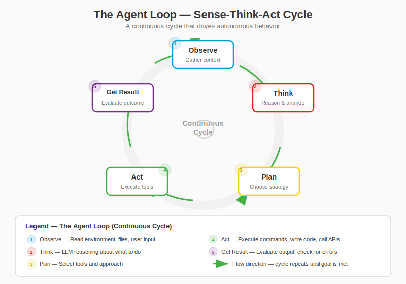

## Change Log

| Version | Date | Author | Changes |
|---------|------|--------|---------|
| 1.0.0 | 2026-03-18 | Paula Silva | Initial version — Super Mario Bros Edition |

# Level 5-4 -- NPCs that Came to Life: What Is an AI Agent

---

**Prepared for:** Sofia
**Version:** 1.0 (Mushroom Kingdom Edition)
**Author:** Paula Silva | Software Global Black Belt, Microsoft Americas
**Date:** March 2026
**Language:** Brazilian Portuguese (pt-BR)
**Collection:** Agentic DevOps -- Complete Software Development Guide

---

## TABLE OF CONTENTS

- [Introduction -- The NPC that Learned to Think](#introduction--the-npc-that-learned-to-think)
- [Section 1 -- What Is an AI Agent, Anyway?](#section-1--what-is-an-ai-agent-anyway)
  - [Fundamental Definition](#fundamental-definition)
  - [The 5 Components of an Agent](#the-5-components-of-an-agent)
  - [Table: Agent Components vs Mario Character Anatomy](#table-agent-components-vs-mario-character-anatomy)

<div align="center">

<br><em>The 5 components of an AI Agent</em>
</div>
- [Section 2 -- The Sense-Think-Act Cycle: How an Agent Works](#section-2--the-sense-think-act-cycle-how-an-agent-works)
  - [The Fundamental Loop](#the-fundamental-loop)
  - [Practical Example: The Agent Solving a Bug](#practical-example-the-agent-solving-a-bug)
  - [The Complete Loop in Detail](#the-complete-loop-in-detail)
- [Section 3 -- Chatbot vs Agent: The Big Difference](#section-3--chatbot-vs-agent-the-big-difference)
  - [The Regular NPC vs The NPC that Came to Life](#the-regular-npc-vs-the-npc-that-came-to-life)
  - [Comparison Table: Chatbot vs Agent vs Autonomous Agent](#comparison-table-chatbot-vs-agent-vs-autonomous-agent)
  - [The 3 Levels of Evolution](#the-3-levels-of-evolution)
- [Section 4 -- The 5 Organs of an Agent in Detail](#section-4--the-5-organs-of-an-agent-in-detail)
  - [1. The Brain (LLM)](#1-the-brain-llm)
  - [2. The Senses (Inputs and Context)](#2-the-senses-inputs-and-context)
  - [3. The Hands (Tools)](#3-the-hands-tools)
  - [4. Memory (Short and Long Term)](#4-memory-short-and-long-term)
  - [5. Goals](#5-goals)
  - [Complete Table: The 5 Organs](#complete-table-the-5-organs)
- [Section 5 -- The Agent Loop: Observe-Think-Plan-Act](#section-5--the-agent-loop-observe-think-plan-act)
  - [The Complete Cycle in 6 Steps](#the-complete-cycle-in-6-steps)
  - [Agent Loop Diagram](#agent-loop-diagram)

<div align="center">

<br><em>The Agent Loop: Observe → Think → Plan → Act</em>
</div>
  - [Real Example: GitHub Copilot as an Agent](#real-example-github-copilot-as-an-agent)
  - [Real Example: Claude as an Agent](#real-example-claude-as-an-agent)
- [Section 6 -- Why Agents Matter for DevOps](#section-6--why-agents-matter-for-devops)
  - [Before and After: The World Without and With Agents](#before-and-after-the-world-without-and-with-agents)
  - [The Future that Has Already Begun](#the-future-that-has-already-begun)
- [What We Learned -- Summary Table](#what-we-learned--summary-table)

---

## Introduction -- The NPC that Learned to Think

Sofia was running through a level in the Mushroom Kingdom when something strange happened. She passed by a Toad -- that classic NPC that always stands in front of a little house -- expecting to hear the same old line: *"Thank you Mario! But the princess is in another castle!"*

But this time, Toad did something different.

He looked at Sofia, noticed she was low on health, checked her inventory, remembered that the last time they met she had trouble with flying Koopas, and said: *"Sofia, you're low on energy. There's a Super Mushroom hidden behind that block over there. And be careful -- in the next section there are three flying Koopas. Last time they got you. Want me to go ahead and show you the safe route?"*

Sofia froze. That NPC... *thought*. He *remembered*. He *offered help*. He *planned a route*. He was no longer an NPC -- he was an **Agent**.

"Welcome to Level 5-4," said Toad, now with a different gleam in his eyes. "Here you'll understand what transformed me from a simple NPC with scripted lines into a character that thinks, plans, acts, and learns. The difference between a chatbot and an agent is the same difference between me standing still repeating the same line forever... and me truly coming to life."

---

## Section 1 -- What Is an AI Agent, Anyway?

### Fundamental Definition

An **AI Agent** is a system that can **perceive** its environment, **reason** about what it perceives, **plan** actions, **execute** those actions using tools, and **learn** from the results -- all autonomously or semi-autonomously, to achieve a **goal**.

In simple terms: an agent is an AI that doesn't just *answer questions*, but *does things*.

The fundamental formula of an agent:

```
AGENT = LLM + Tools + Memory + Goals
```

Where:
- **LLM** (Large Language Model) = the brain that reasons
- **Tools** = the hands that execute actions in the real world
- **Memory** = the ability to remember context and lessons learned
- **Goals** = the purpose that guides all decisions

> **MARIO ANALOGY:** Think of a classic Mario NPC. It stands still, says a scripted line, and repeats that line forever. It doesn't matter if you're at full health or almost dying. It doesn't matter if you've passed by 50 times already. It always says the same thing. Now imagine that NPC gained a **brain** (LLM), **eyes** (context sensors), **hands** (tools to interact with the world), **memory** (remembers previous conversations), and a **goal** (help you complete the level). It stopped being an NPC and became an AGENT -- a character that truly *lives* in the game.

### The 5 Components of an Agent

Every AI agent, whether simple or complex, has 5 fundamental components. Without any one of them, you have something less than a complete agent.

### Agent Loop Diagram

```
         ┌─────────────────────────────────────────┐
         │            GOAL DEFINED                  │
         │  "Fix the login button bug"              │
         └───────────────────┬─────────────────────┘
                             │
                             v
                   ┌──────────────────┐
            ┌─────>│  1. OBSERVE      │
            │      │  Read context,   │
            │      │  message, code   │
            │      └────────┬─────────┘
            │               │
            │               v
            │      ┌──────────────────┐
            │      │  2. THINK        │
            │      │  Interpret,      │
            │      │  reason          │
            │      └────────┬─────────┘
            │               │
            │               v
            │      ┌──────────────────┐
            │      │  3. PLAN         │
            │      │  Create sequence │
            │      │  of actions      │
            │      └────────┬─────────┘
            │               │
            │               v
            │      ┌──────────────────┐
            │      │  4. ACT          │
            │      │  Execute action  │
            │      │  with tool       │
            │      └────────┬─────────┘
            │               │
            │               v
            │      ┌──────────────────┐
            │      │  5. EVALUATE     │
            │      │  Result ok?      │
            │      └────────┬─────────┘
            │               │
            │          ┌────┴────┐
            │          NO      YES
            │          │        │
            │          v        v
            │   ┌────────┐  ┌──────────┐
            └───┤ ADJUST │  │ CONCLUDE │
                │  PLAN  │  │  REPORT  │
                └────────┘  └──────────┘
```

### Real Example: GitHub Copilot as an Agent

GitHub Copilot, when used in **Agent Mode**, works exactly with this loop:

```
You: "Add an email field to the registration form"

OBSERVE: Copilot reads the current form file, sees the existing structure
THINK:   "I need to add an email input field with validation"
PLAN:    1) Add field to form
         2) Add email validation
         3) Update TypeScript type
         4) Add test
ACT:     [edits FormCadastro.tsx -- adds email field]
EVALUATE:[runs TypeScript check -- finds type error]
ADJUST:  "I need to update the CadastroForm interface"
ACT:     [edits types.ts -- adds email field to interface]
EVALUATE:[runs TypeScript check -- no errors]
ACT:     [edits FormCadastro.test.tsx -- adds test for email]
EVALUATE:[runs Jest -- all tests pass]
CONCLUDE:"Done! Added the email field with validation,
          updated the types, and created the test."
```

Notice how the agent **adjusted the plan** when the TypeScript check gave an error. It didn't stop and say "there's an error" -- it understood the error, fixed it, and continued. That's agency.

### Real Example: Claude as an Agent

Claude, when used as an agent (for example in Claude Code), also operates with this loop:

```
You: "Analyze why the deploy failed and fix it"

OBSERVE: Claude reads the deploy logs, identifies the error
THINK:   "The deploy failed because the DATABASE_URL variable is not configured
          in the production environment"
PLAN:    1) Check configuration file
         2) Check GitHub secrets
         3) Add missing variable
         4) Re-run deploy
ACT:     [checks .env.example -- DATABASE_URL field exists]
EVALUATE:"The field is in .env.example but not in the production environment"
ACT:     [checks repo secrets with GitHub CLI]
EVALUATE:"Confirmed: DATABASE_URL is not in the secrets"
CONCLUDE:"The deploy failed because DATABASE_URL is not configured
          in the GitHub secrets. Here is the command to add it:
          gh secret set DATABASE_URL --body 'your-url-here'
          After adding it, re-run the deploy workflow."
```

---

## Section 6 -- Why Agents Matter for DevOps

### Before and After: The World Without and With Agents

| Task | Without Agent (Manual) | With Agent | Savings |
|---|---|---|---|
| **Fix bug** | Dev reads issue, searches code, understands context, writes fix, tests, creates PR | Agent receives issue, investigates, fixes, tests, creates PR | Hours → Minutes |
| **Code Review** | Reviewer reads each file, comments, waits for fixes, re-reviews | Agent automatically analyzes, comments, suggests fixes | Days → Hours |
| **Project setup** | Dev manually configures each tool, writes configs | Agent generates configs, installs dependencies, sets up CI/CD | Days → Minutes |
| **Deploy** | DevOps manually verifies each step, runs scripts | Agent orchestrates the entire pipeline, monitors, reports | Hours → Minutes |
| **Documentation** | Dev writes docs manually, often outdated | Agent generates and updates docs automatically based on code | Never done → Always up to date |

> **MARIO ANALOGY:** Before agents, it was like playing Mario on the hardest difficulty: no power-ups, no Yoshi, no save game. You did everything alone, from scratch, every time. With agents, it's like having a complete team of specialized characters, each with their power-ups, working together. Mario coordinates, Luigi handles the interface, Toad handles the data, Yoshi handles the infrastructure. The game didn't get easier -- it got **smarter**.

### The Future that Has Already Begun

AI agents are not science fiction. They are already in production:

| Agent | What It Does | Status |
|---|---|---|
| **GitHub Copilot Agent Mode** | Completes multi-step code tasks | Available in VS Code |
| **GitHub Coding Agent** | Receives issues and opens PRs autonomously | Available on GitHub |
| **Claude Code** | Terminal agent that edits code, runs commands | Available via CLI |
| **Copilot Workspace** | Plans and implements complete features | In preview |
| **Dependabot** | Updates dependencies automatically | Available on GitHub |

The DevOps world is transforming from "humans using tools" to "humans coordinating agents that use tools." And understanding how agents work is the first step to being the Mario who coordinates the team, not the NPC that repeats lines.

---

## What We Learned -- Summary Table

| Topic | Key Concept | Mario Analogy | Practical Application |
|---|---|---|---|
| **What is an Agent** | LLM + Tools + Memory + Goals | NPC that gained a brain, hands, memory, and mission | Agents do things, chatbots only talk |
| **Sense-Think-Act** | The fundamental cycle of every agent | Mario sensing, thinking, acting at every moment of the level | Every agent operates in a continuous loop |
| **Chatbot vs Agent** | Chatbot responds, Agent acts | Toad that repeats a line vs Toad that opens doors for you | Knowing the difference is essential for choosing the right tool |
| **5 Components** | Brain, Senses, Hands, Memory, Goals | The 5 attributes that transform an NPC into a living character | Each component can be configured and optimized |
| **Agent Loop** | Observe → Think → Plan → Act → Evaluate → Iterate | Mario constantly adapting strategy at each obstacle | Agents adjust plans when something goes wrong |
| **Real Examples** | Copilot, Claude, Coding Agent | Team of playable characters already in action in the Mushroom Kingdom | Agents are already in production today |

---

### POWER-UP UNLOCKED!

Sofia now understands what an AI Agent is -- not just as a concept, but as functional anatomy. She knows that an agent has a brain, senses, hands, memory, and goals. She knows the difference between an NPC that repeats lines and an NPC that came to life. And she knows that the future of software development is about coordinating these agents, not replacing humans.

---

<div align="center">

⬅️ [Previous: Level 5-3: GitHub Copilot](5-3_github-copilot.md) · 🗺️ [World Map](../INDEX.md) · ➡️ [Next: Level 5-5: Agent Types](5-5_agent-types.md)

</div>

She looked at the Toad that had explained everything to her and smiled. "So you're not an NPC anymore... you're an Agent."

Toad winked. "Exactly, Sofia. And in the next level, you'll meet all the TYPES of agents that exist in the Mushroom Kingdom. Each one with its unique role."

She stored this power-up in her inventory and headed to the next level of the Mushroom Kingdom...

*Press START to continue...*

---

## References

- [GitHub Copilot — Concepts and Agents](https://docs.github.com/en/copilot/concepts/agents)
- [Azure AI Services](https://learn.microsoft.com/en-us/azure/ai-services/)
- [GitHub Copilot Documentation](https://docs.github.com/en/copilot)
