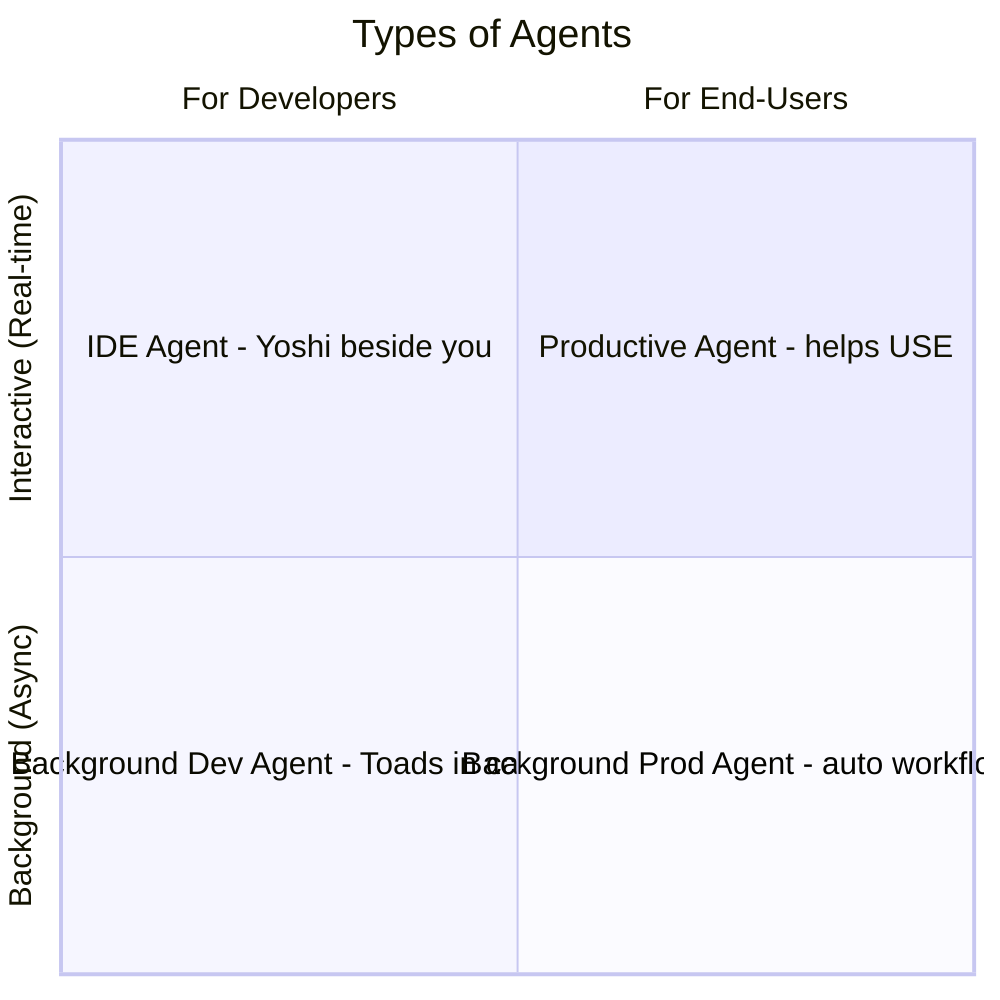

## Change Log

| Version | Date | Author | Changes |
|---------|------|--------|---------|
| 1.0.0 | 2026-03-18 | Paula Silva | Initial version — Super Mario Bros Edition |

# Level 5-5 -- Who's Who in the Mushroom Kingdom: Types of Agents

---

**Prepared for:** Sofia
**Version:** 1.0 (Mushroom Kingdom Edition)
**Author:** Paula Silva | Microsoft Latam Software GBB
**Date:** March 2026
**Language:** Brazilian Portuguese (pt-BR)
**Collection:** Agentic DevOps -- Complete Software Development Guide

---

## TABLE OF CONTENTS

- [Introduction -- The Character Guild of the Mushroom Kingdom](#introduction--the-character-guild-of-the-mushroom-kingdom)
- [Section 1 -- IDE Agents: Your Level Companion](#section-1--ide-agents-your-level-companion)
  - [What Are IDE Agents](#what-are-ide-agents)
  - [Real Examples of IDE Agents](#real-examples-of-ide-agents)
  - [The 3 Modes of the IDE Agent](#the-3-modes-of-the-ide-agent)
  - [When to Use IDE Agents](#when-to-use-ide-agents)
- [Section 2 -- Background Agents: The NPCs that Work Behind the Scenes](#section-2--background-agents-the-npcs-that-work-behind-the-scenes)
  - [What Are Background Agents](#what-are-background-agents)
  - [Real Examples of Background Agents](#real-examples-of-background-agents)
  - [How Background Agents Operate](#how-background-agents-operate)
  - [When to Use Background Agents](#when-to-use-background-agents)
- [Section 3 -- IDE vs Background: Complete Comparison Table](#section-3--ide-vs-background-complete-comparison-table)
- [Section 4 -- Development Agents: Those that Help BUILD the Game](#section-4--development-agents-those-that-help-build-the-game)
  - [Categories of Development Agents](#categories-of-development-agents)
  - [The Workflow with Development Agents](#the-workflow-with-development-agents)
- [Section 5 -- Productivity Agents: Those that Help PLAY the Game](#section-5--productivity-agents-those-that-help-play-the-game)
  - [Categories of Productivity Agents](#categories-of-productivity-agents)
  - [Real-World Examples](#real-world-examples)
- [Section 6 -- Development vs Productivity: Comparison Table](#section-6--development-vs-productivity-comparison-table)
- [Section 7 -- The Autonomy Spectrum](#section-7--the-autonomy-spectrum)
  - [The 4 Levels of Autonomy](#the-4-levels-of-autonomy)
  - [How to Choose the Right Level](#how-to-choose-the-right-level)
- [Section 8 -- When to Use Which Type of Agent](#section-8--when-to-use-which-type-of-agent)
  - [Quick Decision Guide](#quick-decision-guide)
  - [Combining Types of Agents](#combining-types-of-agents)
- [What We Learned -- Summary Table](#what-we-learned--summary-table)

---

## Introduction -- The Character Guild of the Mushroom Kingdom

Sofia entered a huge room, lit by torches on the walls. It was the **Character Guild** of the Mushroom Kingdom -- a place she had never seen before. In the center, a large mural showed dozens of characters organized into categories, each with a small sign explaining their role.

"Wow," Sofia murmured, looking at the wall. "I thought only Mario, Luigi, Toad, and Peach existed. But there are people here I've never seen!"

A Toad with glasses and a thick book appeared beside her. "Welcome to the Guild, Sofia! Here is the registry of ALL types of characters that exist in the Mushroom Kingdom. Look -- there are characters that walk alongside you during the entire level, like Yoshi. There are others that work in distant castles while you play, building bridges and preparing items for you. There are those that help BUILD new levels. And there are those that help people PLAY the levels that already exist."

Sofia approached the mural. "So it's not enough to know what an agent is... I need to know which TYPE of agent to use for each situation?"

"Exactly!" Toad adjusted his glasses. "A Yoshi is perfect to carry you through a difficult level. But you wouldn't call a Yoshi to build a castle -- for that you need a team of builder Toads. Each type of agent has its ideal moment. And today you'll learn ALL of them."

---

### Diagram: Types of Agents



---

## Section 1 -- IDE Agents: Your Level Companion

### What Are IDE Agents

An **IDE Agent** is an AI agent that runs **inside your code editor** (VS Code, JetBrains, Xcode, etc.). It's there, by your side, in real time, while you work. It sees what you see, understands what you're doing, and can help instantly.

The IDE Agent is the most common and most used type of agent in a developer's daily routine. It's your constant companion -- always present, always ready to help.

> **MARIO ANALOGY:** The IDE Agent is **Yoshi** walking alongside Mario. Yoshi doesn't go off on solo missions -- he's RIGHT THERE, WITH you, all the time. When you need it, he swallows an enemy. When you jump, he gives that extra flutter jump. When you're in danger, he absorbs the impact. Yoshi is the perfect companion because he's ALWAYS in your field of vision, reacting to your commands in real time.

Characteristics of an IDE Agent:

- **Location:** Runs inside the IDE (VS Code, JetBrains, etc.)
- **Interaction:** Real-time, while you're coding
- **Visibility:** Sees your open files, your terminal, your context
- **Response:** Immediate -- you ask, it does it right away
- **Control:** You control each action, it only acts when requested (or when it detects an opportunity)

### Real Examples of IDE Agents

| IDE Agent | Where It Runs | What It Does | Mario Analogy |
|---|---|---|---|
| **GitHub Copilot (Completions)** | VS Code, JetBrains, etc. | Suggests lines of code as you type | Yoshi that guesses what you want to do and gets ready |
| **GitHub Copilot Chat** | Side panel in IDE | Answers questions about code, explains, suggests | Yoshi you can talk to about the level |
| **GitHub Copilot Agent Mode** | Integrated in editor | Executes multi-step tasks: edits, runs, tests | Yoshi that completes entire sections of the level for you |
| **Copilot Edits** | Multi-file in editor | Edits multiple files simultaneously | Yoshi restructuring several blocks of the level at once |
| **Claude Code (CLI)** | Terminal | Complete agent via command line | Yoshi in command mode -- you speak, he executes |

### The 3 Modes of the IDE Agent

GitHub Copilot in VS Code, for example, operates in 3 different modes -- each with an increasing level of capability:

| Mode | How It Works | Level of Agency | Mario Analogy |
|---|---|---|---|
| **Completions** | Suggests code inline as you type | Low -- only suggests | Yoshi walking behind you, offering items |
| **Chat** | You ask questions, it responds with explanations and suggestions | Medium -- converses and suggests | Yoshi you consult: "What's behind that block?" |
| **Agent Mode** | You give a task, it plans, edits files, runs commands, iterates | High -- plans and executes | Yoshi you mount and say: "Handle that section for me!" |

```
Completions Mode:
  You type: function calculate
  Copilot suggests: Total(items: Item[]): number {
                    return items.reduce((sum, item) => sum + item.price, 0);
                  }

Chat Mode:
  You: "Explain what this useEffect does?"
  Copilot: "This useEffect monitors changes in the 'items' array
            and recalculates the total whenever the list changes..."

Agent Mode:
  You: "Add pagination to the product list"
  Copilot: [analyzes current component]
           [creates pagination state]
           [modifies API query]
           [adds navigation buttons]
           [runs tests]
           "Done! Added pagination with 10 items per page."
```

> **MARIO ANALOGY:** The 3 modes are like 3 levels of partnership with Yoshi. **Completions** = Yoshi walking behind, offering fruits he finds along the way. **Chat** = Yoshi beside you, answering questions about the terrain ahead. **Agent Mode** = you mounted on Yoshi, giving general directions while he runs, jumps, swallows enemies, and overcomes obstacles for you. Same mode, same partner, but very different levels of capability.

### When to Use IDE Agents

| Situation | Use IDE Agent? | Why |
|---|---|---|
| Writing new code | YES | Real-time suggestions greatly speed things up |
| Interactive debugging | YES | It sees your code and can investigate with you |
| File refactoring | YES | Agent Mode can restructure entire files |
| Learning new technology | YES | Chat explains code, concepts, patterns |
| Task that takes hours and you can do something else | NO | Use Background Agent |
| Automatic PR review | NO | Use Background Agent |
| Continuous monitoring | NO | Use Background Agent |

---

## Section 2 -- Background Agents: The NPCs that Work Behind the Scenes

### What Are Background Agents

A **Background Agent** is an agent that works **outside your editor**, in a remote environment, executing tasks while you do other things. You don't need to watch -- it works behind the scenes and notifies you when it's done.

The Background Agent is like those RPG characters you send on "quests" and they come back hours later with results. You don't follow each step -- you define the goal and let the agent work.

> **MARIO ANALOGY:** The Background Agent is like the **builder Toads** who work in distant castles while Mario plays in World 1. While you're jumping over Goombas in Level 1-2, there's a team of Toads building the bridge for World 3, another team preparing items in World 4, and another repairing the World 2 castle that you damaged in the boss fight. You don't see them working -- but when you get there, everything is ready. They send a message: *"World 3 bridge ready! You can cross whenever you want."*

Characteristics of a Background Agent:

- **Location:** Runs on remote servers (cloud), not on your computer
- **Interaction:** Asynchronous -- you start it and check back later
- **Visibility:** Works in an isolated environment (codespace/sandbox)
- **Response:** Takes minutes to hours, depending on the task
- **Control:** You define the goal, it executes autonomously

### Real Examples of Background Agents

| Background Agent | Where It Runs | What It Does | Mario Analogy |
|---|---|---|---|
| **GitHub Copilot Coding Agent** | GitHub Codespace | Receives an issue, creates branch, writes code, opens PR | Toad that receives the order "build this bridge" and delivers it ready |
| **Dependabot** | GitHub Actions | Checks for outdated dependencies and opens update PRs | Inspector Toad that checks if your items are up to date |
| **CodeQL / Code Scanning** | GitHub Actions | Analyzes code for vulnerabilities | Security Toad patrolling the castle |
| **Copilot Autofix** | GitHub Actions | Receives security alert and generates automatic fix | Toad that sees the hole in the wall and fixes it on his own |
| **Renovate Bot** | CI/CD Pipeline | Updates dependencies with automatic PRs | Toad that replaces old castle tiles with new ones |

### How Background Agents Operate

The workflow of a Background Agent follows a clear pattern:

```
1. TRIGGER
   ├── Someone assigns an issue to the agent
   ├── A scheduled event fires (cron)
   ├── A push to the repository activates the agent
   └── A security rule is violated

2. PLANNING
   ├── Agent reads the issue/context
   ├── Analyzes the repository
   ├── Creates an action plan
   └── Starts execution

3. EXECUTION
   ├── Creates branch
   ├── Edits files
   ├── Runs tests
   ├── Iterates if something fails
   └── Prepares result

4. DELIVERY
   ├── Opens Pull Request
   ├── Adds detailed description
   ├── Notifies the team
   └── Awaits human review
```

> **MARIO ANALOGY:** It's like sending Toads on missions. You don't follow each hammer blow the Toad makes on the bridge. You say: "Toad, I need a bridge between World 2 and World 3." The Toad goes, analyzes the terrain, calculates the materials, builds the bridge, tests if it holds weight, and sends you a message: *"Bridge ready! Tested with 10 Yoshis on top, it's solid. You can cross. Want to review first?"* And you decide whether to approve or request adjustments.

### When to Use Background Agents

| Situation | Use Background Agent? | Why |
|---|---|---|
| Well-defined issue with clear scope | YES | Agent can solve it on its own |
| Dependency updates | YES | Repetitive and predictable task |
| Security analysis | YES | Continuous automatic monitoring |
| Simple bug fixes | YES | Agent can investigate and fix |
| New architecture design | NO | Requires creativity and human decisions |
| Code that needs context only you have | NO | Agent doesn't have your implicit knowledge |
| Urgent task that needs results NOW | NO | Background agents take minutes/hours |

---

## Section 3 -- IDE vs Background: Complete Comparison Table

| Characteristic | IDE Agent | Background Agent | Hybrid |
|---|---|---|---|
| **Where it runs** | In your editor (local) | In the cloud (remote) | Both |
| **When it acts** | In real time, when you ask | Asynchronously, in the background | Depends on the task |
| **Do you need to be present?** | YES -- you interact actively | NO -- it works while you do something else | Partially |
| **Speed** | Instant (seconds) | Minutes to hours | Variable |
| **Context** | Sees your open files, cursor, terminal | Sees the entire repository | Sees everything |
| **Autonomy** | Low to medium -- you guide | High -- works on its own | Adjustable |
| **Result** | Changes in your editor | Pull Request on GitHub | Depends |
| **Review** | You see in real time | You review when you want | Mixed |
| **Best for** | Active coding, exploration, learning | Repetitive tasks, defined issues, maintenance | Complex projects |
| **Mario Analogy** | **Yoshi** walking with you | **Toads** working in distant castles | Yoshi that calls the Toads when needed |

> **MARIO ANALOGY:** Think of it this way -- when you're playing a difficult level, you want Yoshi BY YOUR SIDE (IDE Agent). When you finish a level and need someone to prepare the next one while you rest, you send the Toads (Background Agent). And when there's a task that needs both? You mount Yoshi and coordinate the Toads from above (Hybrid). The secret is knowing when to use each one.

---

## Section 4 -- Development Agents: Those that Help BUILD the Game

Now let's look from a different perspective. Instead of *where* the agent runs (IDE vs Background), let's see *for whom* and *for what purpose* it serves.

**Development Agents** are agents that help **developers** **build software**. They understand code, architecture, tests, deploys, infrastructure. They are tools for those who BUILD the game.

> **MARIO ANALOGY:** Development Agents are like the characters that help **BUILD the levels** of Mario. They don't play the level -- they create the blocks, position the coins, place the enemies, test the platforms, and ensure everything works before players arrive. They are the builders of the Mushroom Kingdom.

### Categories of Development Agents

| Category | What It Does | Examples | Mario Analogy |
|---|---|---|---|
| **Code Writer** | Writes new code from requirements | Copilot Agent Mode, Claude Code | Architect Toad who builds new castles |
| **Code Reviewer** | Reviews existing code, points out issues | Copilot Code Review, CodeRabbit | Inspector Toadette who checks if the castle is safe |
| **Bug Fixer** | Investigates and fixes bugs | Copilot Coding Agent on bug issues | Detective Luigi who hunts ghosts (bugs) |
| **Test Writer** | Creates automated tests | Copilot generating Jest tests | Peach testing every corner of the level before opening to the public |
| **DevOps / Deployer** | Manages infrastructure and deployments | CI/CD agents, IaC agents | Yoshi who sets up the track and ensures the path works |
| **Security Scanner** | Finds vulnerabilities and leaked secrets | CodeQL, Secret Scanning, Dependabot | Guard Toad who patrols the castle perimeter |
| **Documentation** | Generates and updates documentation | Copilot generating docs from code | Scribe Toad who records everything in the Kingdom's Book |

### The Workflow with Development Agents

See how development agents work together in a complete flow:

```
1. ISSUE CREATED: "Add notifications feature"
        │
        v
2. CODE WRITER analyzes the issue and writes the code
   ├── Creates React components for notification UI
   ├── Creates API endpoints on the backend
   └── Creates migration for notifications table in the database
        │
        v
3. TEST WRITER creates automated tests
   ├── Unit tests for components
   ├── Integration tests for API
   └── Database tests
        │
        v
4. CODE REVIEWER reviews all the code
   ├── Checks patterns and conventions
   ├── Points out performance issues
   └── Suggests improvements
        │
        v
5. SECURITY SCANNER checks security
   ├── Searches for vulnerabilities in code
   ├── Verifies dependencies
   └── Validates that no secrets are exposed
        │
        v
6. DEVOPS / DEPLOYER handles the deploy
   ├── Application build
   ├── Tests in staging
   └── Deploy to production
        │
        v
7. DOCUMENTATION updates the documentation
   ├── API docs updated
   ├── README updated
   └── Changelog generated
```

> **MARIO ANALOGY:** It's like the production line for a new Mario level. The **Architect** (Code Writer) designs the level. The **Test Team** (Test Writer) plays the level to see if it works. The **Inspector** (Code Reviewer) checks if it follows game standards. **Security** (Security Scanner) ensures there are no unfair traps. The **Infrastructure Team** (DevOps) publishes the level in the game. And the **Scribe** (Documentation) documents everything in the player's manual. All working together, each with their role.

---

## Section 5 -- Productivity Agents: Those that Help PLAY the Game

**Productivity Agents** are agents that help **end users** (not necessarily developers) accomplish daily tasks. They don't write code -- they use ready-made software to solve business problems.

> **MARIO ANALOGY:** Productivity Agents are like the characters that help **PLAYERS** play the game. They don't build levels -- they guide players, explain mechanics, solve gameplay issues, and ensure the experience is good. They're the ones on the player's side, not the builder's side.

### Categories of Productivity Agents

| Category | What It Does | Examples | Mario Analogy |
|---|---|---|---|
| **Customer Support** | Answers questions, resolves user issues | Support chatbots with agency | Welcome Toad who guides new players |
| **Data Analysis** | Interprets data, generates reports, finds insights | BI agents, Copilot in Excel/Power BI | Statistics Toad who shows your score and performance |
| **Document Generation** | Creates reports, proposals, emails, presentations | Copilot in Word, Copilot in PowerPoint | Scribe Toad who drafts royal letters for the kingdom |
| **Process Automation** | Automates repetitive business tasks | Power Automate, RPA agents | Worker Toads who repeat mechanical tasks |
| **Research and Summary** | Searches for information and summarizes long documents | Copilot in Edge, research agents | Librarian Toad who finds the right book and summarizes it |
| **Planning and Management** | Organizes tasks, schedules, projects | Copilot in Teams, project agents | Coordinator Toad who organizes the kingdom's calendar |

### Real-World Examples

| Productivity Agent | Where It Acts | Task It Solves | For Whom |
|---|---|---|---|
| **Copilot in Teams** | Microsoft Teams | Summarizes meetings, suggests next steps, answers questions | Any professional |
| **Copilot in Excel** | Microsoft Excel | Analyzes data, creates charts, writes formulas | Analysts, managers |
| **Copilot in Word** | Microsoft Word | Writes documents, summarizes text, formats | Writers, lawyers, managers |
| **Copilot in PowerPoint** | Microsoft PowerPoint | Creates presentations from descriptions | Presenters, salespeople |
| **Support Agent** | Websites, apps | Answers frequently asked questions, escalates to humans | Customers, users |
| **HR Agent** | Internal systems | Answers about benefits, time off, policies | Employees |

---

## Section 6 -- Development vs Productivity: Comparison Table

| Aspect | Development Agent | Productivity Agent |
|---|---|---|
| **For whom** | Developers, engineers | End users, business professionals |
| **What it does** | Writes code, tests, deploys, reviews | Analyzes data, generates docs, serves customers |
| **Language** | Code (TypeScript, Python, SQL...) | Natural language (Portuguese, English...) |
| **Environment** | IDE, terminal, CI/CD, GitHub | Office, browser, business apps |
| **Tools** | Git, compilers, test runners, APIs | Excel, Word, PowerPoint, CRM, ERP |
| **Output** | Code, PRs, deploys, tests | Documents, reports, answers, automations |
| **Risk** | Bug in production, security failure | Incorrect information, wrong decision |
| **Validation** | Code review, automated tests, CI/CD | Human review, fact-checking |
| **Mario Analogy** | Team that BUILDS the levels | Team that HELPS players in the levels |

> **MARIO ANALOGY:** Think of the Mushroom Kingdom as a company. **Development Agents** are the engineers and builders -- they build castles, create levels, assemble mechanisms. **Productivity Agents** are the castle staff -- receptionists who greet visitors, librarians who find books, chefs who prepare banquets, guards who patrol. All are important, but they do very different things. A builder doesn't need to know how to cook, and a chef doesn't need to know how to build walls. But together, they make the castle work.

---

## Section 7 -- The Autonomy Spectrum

### The 4 Levels of Autonomy

Not every agent has the same level of autonomy. There is a spectrum that ranges from total human control to total agent autonomy:

| Level | Name | Who Decides | Who Executes | Mario Analogy | Real Example |
|---|---|---|---|---|---|
| **1** | **Fully Manual** | Human | Human | You playing Mario alone, without any help | Writing code 100% by hand |
| **2** | **Assisted** | Human | Human + Agent suggests | Mario with a guide that points: "Look, there's a coin there!" | Copilot Completions suggesting lines |
| **3** | **Co-Pilot** | Human + Agent together | Agent with human supervision | You mounted on Yoshi -- you give direction, he executes | Copilot Agent Mode editing files under your supervision |
| **4** | **Autonomous** | Agent (with guardrails) | Agent | Yoshi completing a mission on his own | Coding Agent opening PRs from issues |

```
AUTONOMY SPECTRUM

Manual ◄─────────────────────────────────────────────────► Autonomous

  Level 1          Level 2          Level 3          Level 4
  MANUAL          ASSISTED         CO-PILOT         AUTONOMOUS
    │                │                │                │
    │  You do       │  You do       │  You guide    │  Agent does
    │  everything   │  agent        │  agent        │  it alone
    │  alone        │  suggests     │  executes     │  (with guardrails)
    │                │                │                │
    ▼                ▼                ▼                ▼
  Mario solo     Mario + Hint     Mario on Yoshi   Yoshi on mission

  [100% Human]  [80% Human]     [50/50]          [80% Agent]
```

### How to Choose the Right Level

| Factor | Prefer More Manual | Prefer More Autonomous |
|---|---|---|
| **Risk** | High risk (production, security, sensitive data) | Low risk (dev, staging, repetitive tasks) |
| **Complexity** | Task never done before, no clear pattern | Repetitive task with well-defined pattern |
| **Trust in agent** | First time using, new agent | Tested and reliable agent |
| **Urgency** | "I need to be sure it's correct" | "I need it done quickly" |
| **Reversibility** | Hard to undo (deploy, delete) | Easy to undo (PR that can be closed) |
| **Context needed** | Only you know what's needed | Everything is documented in the issue |

> **MARIO ANALOGY:** You would NOT send an autonomous Yoshi into a boss battle you've never seen before -- the risk is too high. You'd go along (Level 3 -- Co-Pilot). But sending an autonomous Yoshi to collect coins in a level you've already completed 10 times? No problem (Level 4 -- Autonomous). The level of autonomy depends on the RISK and your TRUST in the agent. Start by supervising and increase autonomy as you gain confidence.

---

## Section 8 -- When to Use Which Type of Agent

### Quick Decision Guide

| You need to... | Type of Agent | Level of Autonomy | Example |
|---|---|---|---|
| Write code now, in the editor | IDE Agent | Co-Pilot (3) | Copilot Agent Mode |
| Resolve an issue while doing something else | Background Agent | Autonomous (4) | Coding Agent |
| Code suggestions as you type | IDE Agent | Assisted (2) | Copilot Completions |
| Update dependencies automatically | Background Agent | Autonomous (4) | Dependabot |
| Review a PR automatically | Background Agent | Autonomous (4) | Copilot Code Review |
| Understand a complex code snippet | IDE Agent | Assisted (2) | Copilot Chat |
| Generate a data report | Productivity Agent | Co-Pilot (3) | Copilot in Excel |
| Summarize a meeting | Productivity Agent | Autonomous (4) | Copilot in Teams |
| Create a complete feature from scratch | IDE + Background | Co-Pilot + Autonomous | Agent Mode + Coding Agent |
| Monitor security continuously | Background Agent | Autonomous (4) | CodeQL, Secret Scanning |

### Combining Types of Agents

In practice, you rarely use just one type of agent. The real power comes from **combining** them:

```
SCENARIO: Implement notifications feature

1. BACKGROUND AGENT (Coding Agent)
   └── Receives the issue, creates a first version of the code, opens PR
       Meanwhile, you're in a meeting

2. IDE AGENT (Copilot Agent Mode)
   └── You open the PR, use Agent Mode to refine the code,
       adjust details, add edge cases

3. BACKGROUND AGENT (Code Review + CodeQL)
   └── Automatically reviews the PR, checks security

4. IDE AGENT (Copilot Chat)
   └── You chat with Chat to understand a section
       that the Background Agent generated

5. BACKGROUND AGENT (CI/CD)
   └── Runs tests, builds, deploys to staging

6. PRODUCTIVITY AGENT (Copilot in Teams)
   └── Summarizes the PR discussion in Teams for the team
```

> **MARIO ANALOGY:** It's like an advanced cooperative level. **Yoshi** (IDE Agent) is with you at every step. The **Toads** (Background Agents) are building and preparing what you'll need ahead. And the **Communication System** (Productivity Agent) ensures everyone knows what's happening. No single character wins the game alone -- but together, they form an unbeatable team.

---

## What We Learned -- Summary Table

| Topic | Key Concept | Mario Analogy | Practical Application |
|---|---|---|---|
| **IDE Agents** | Agents that run inside the editor, in real time | Yoshi walking alongside Mario | Copilot Completions, Chat, Agent Mode |
| **Background Agents** | Agents that work in the cloud, asynchronously | Toads building in distant castles | Coding Agent, Dependabot, CodeQL |
| **Development Agents** | Help BUILD software (code, tests, deploy) | Builder team of the Mushroom Kingdom | Code writers, reviewers, testers, DevOps |
| **Productivity Agents** | Help USERS accomplish business tasks | Castle staff (receptionists, librarians) | Copilot in Office, support chatbots |
| **Autonomy Spectrum** | Manual → Assisted → Co-Pilot → Autonomous | Mario alone → with guide → on Yoshi → Yoshi on mission | Choose the level based on risk and trust |
| **Combination** | The real power comes from using types together | Cooperative level with all characters | IDE + Background + Productivity working together |

---

### POWER-UP UNLOCKED!

Sofia now knows all the types of agents that exist in the Mushroom Kingdom. She knows the difference between a Yoshi that walks beside you (IDE Agent) and Toads that work in distant castles (Background Agent). She knows when to call builders (Development Agents) and when to call castle staff (Productivity Agents). And, most importantly, she knows that the secret isn't choosing ONE type -- it's orchestrating ALL of them together.

"Now I understand," Sofia said, looking at the Guild mural. "There's no 'best type of agent.' There's the right type for each situation."

The bespectacled Toad smiled. "Exactly, Sofia. And in the next level, you'll meet the most powerful of all -- the Yoshis that fly solo. The Autonomous Agents."

She stored this power-up in her inventory and headed to the next level of the Mushroom Kingdom...

*Press START to continue...*

---

## References

- [GitHub Copilot — Concepts and Agents](https://docs.github.com/en/copilot/concepts/agents)
- [Azure AI Services](https://learn.microsoft.com/en-us/azure/ai-services/)
- [GitHub Copilot Documentation](https://docs.github.com/en/copilot)

---

<div align="center">

⬅️ [Previous: Level 5-4: What Is an Agent](5-4_what-is-an-agent.md) · 🗺️ [World Map](../INDEX.md) · ➡️ [Next: Level 5-6: Autonomous Agents](5-6_autonomous-agents.md)

</div>
