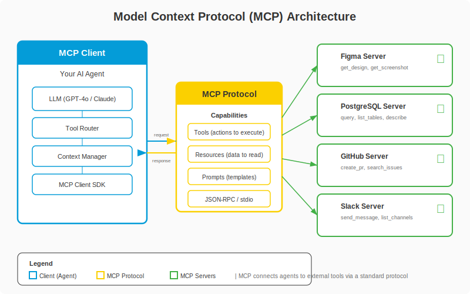

# Level 5-7 -- Universal Warp Zones: MCP in Depth

## Change Log

| Version | Date       | Author       | Description                        |
|---------|------------|--------------|------------------------------------|
| 1.0.0   | 2026-03-18 | Paula Silva  | Initial chapter creation           |

---

## Table of Contents

- [Introduction -- The World of Incompatible Pipes](#introduction--the-world-of-incompatible-pipes)
- [Section 1 -- What is MCP?](#section-1--what-is-mcp)
  - [1.1 Fundamental Definition](#11-fundamental-definition)
  - [1.2 The Problem MCP Solves](#12-the-problem-mcp-solves)
  - [1.3 The Mario Analogy: The Universal Warp Pipe Standard](#13-the-mario-analogy-the-universal-warp-pipe-standard)
- [Section 2 -- Before MCP: The Chaos of Incompatible Pipes](#section-2--before-mcp-the-chaos-of-incompatible-pipes)
  - [2.1 The Custom Integration Problem](#21-the-custom-integration-problem)
  - [2.2 The MxN Problem](#22-the-mxn-problem)
  - [2.3 Mario Analogy: Each World with Different Pipes](#23-mario-analogy-each-world-with-different-pipes)
- [Section 3 -- MCP Architecture](#section-3--mcp-architecture)
  - [3.1 The 4 Fundamental Components](#31-the-4-fundamental-components)
  - [3.2 How the Components Connect](#32-how-the-components-connect)
  - [3.3 Table: MCP Components vs Mushroom Kingdom](#33-table-mcp-components-vs-mushroom-kingdom)

<div align="center">

<br><em>MCP Architecture: Client, Protocol, and Servers</em>
</div>
- [Section 4 -- MCP Server: The NPC's Specialized Shop](#section-4--mcp-server-the-npcs-specialized-shop)
  - [4.1 What is an MCP Server](#41-what-is-an-mcp-server)
  - [4.2 Types of MCP Servers](#42-types-of-mcp-servers)
  - [4.3 Anatomy of an MCP Server](#43-anatomy-of-an-mcp-server)
  - [4.4 Examples of Real MCP Servers](#44-examples-of-real-mcp-servers)
  - [4.5 Mario Analogy: The Specialized Shops of Each World](#45-mario-analogy-the-specialized-shops-of-each-world)
- [Section 5 -- MCP Client: The Companion that Visits the Shops](#section-5--mcp-client-the-companion-that-visits-the-shops)
  - [5.1 What is an MCP Client](#51-what-is-an-mcp-client)
  - [5.2 Examples of MCP Clients](#52-examples-of-mcp-clients)
  - [5.3 How the Client Discovers What the Server Offers](#53-how-the-client-discovers-what-the-server-offers)
  - [5.4 Mario Analogy: Yoshi Visits the Shop](#54-mario-analogy-yoshi-visits-the-shop)
- [Section 6 -- Tools: The Items the Shop Sells](#section-6--tools-the-items-the-shop-sells)
  - [6.1 What are Tools in MCP](#61-what-are-tools-in-mcp)
  - [6.2 Anatomy of a Tool](#62-anatomy-of-a-tool)
  - [6.3 Examples of Tools by Server](#63-examples-of-tools-by-server)
  - [6.4 Mario Analogy: Specific Items from Each Shop](#64-mario-analogy-specific-items-from-each-shop)
- [Section 7 -- Resources: The Information the Shop Shares](#section-7--resources-the-information-the-shop-shares)
  - [7.1 What are Resources in MCP](#71-what-are-resources-in-mcp)
  - [7.2 Difference between Tools and Resources](#72-difference-between-tools-and-resources)
  - [7.3 Examples of Resources](#73-examples-of-resources)
  - [7.4 Mario Analogy: The Shop's Information Board](#74-mario-analogy-the-shops-information-board)
- [Section 8 -- Prompts in MCP: Ready-Made Recipes](#section-8--prompts-in-mcp-ready-made-recipes)
  - [8.1 What are Prompts in MCP](#81-what-are-prompts-in-mcp)
  - [8.2 Examples of MCP Prompts](#82-examples-of-mcp-prompts)
  - [8.3 Mario Analogy: Item Combinations from the Shop](#83-mario-analogy-item-combinations-from-the-shop)
- [Section 9 -- The Protocol in Detail: How MCP Works Under the Hood](#section-9--the-protocol-in-detail-how-mcp-works-under-the-hood)
  - [9.1 Transport: stdio vs HTTP/SSE](#91-transport-stdio-vs-httpsse)
  - [9.2 The Initial Handshake](#92-the-initial-handshake)
  - [9.3 The Communication Cycle](#93-the-communication-cycle)
  - [9.4 Mario Analogy: How the Pipe Works Inside](#94-mario-analogy-how-the-pipe-works-inside)
- [Section 10 -- Configuring MCP in Practice](#section-10--configuring-mcp-in-practice)
  - [10.1 The mcp.json File](#101-the-mcpjson-file)
  - [10.2 Configuration in VS Code](#102-configuration-in-vs-code)
  - [10.3 Complete Example: MCP with Azure Boards](#103-complete-example-mcp-with-azure-boards)
  - [10.4 Complete Example: MCP with PostgreSQL](#104-complete-example-mcp-with-postgresql)
- [Section 11 -- Security in MCP](#section-11--security-in-mcp)
  - [11.1 Security Principles](#111-security-principles)
  - [11.2 Protecting API Keys](#112-protecting-api-keys)
  - [11.3 Mario Analogy: The Secret Warp Zone Key](#113-mario-analogy-the-secret-warp-zone-key)
- [Section 12 -- The MCP Ecosystem: Available Servers](#section-12--the-mcp-ecosystem-available-servers)
  - [12.1 Official and Community Servers](#121-official-and-community-servers)
  - [12.2 Creating Your Own MCP Server](#122-creating-your-own-mcp-server)
- [Section 13 -- MCP is Fundamental for Agentic DevOps](#section-13--mcp-is-fundamental-for-agentic-devops)
  - [13.1 Without MCP vs With MCP](#131-without-mcp-vs-with-mcp)
  - [13.2 The Future of MCP](#132-the-future-of-mcp)
- [What We Learned -- Summary Table](#what-we-learned--summary-table)
- [References](#references)

---

## Introduction -- The World of Incompatible Pipes

Sofia was in the Mushroom Kingdom when she noticed something strange. She needed to travel between worlds -- go to the Design World to fetch colors, to the Data World to fetch information, and to the Tasks World to update her progress. But when she tried to use the Warp Pipes...

"This pipe only works with hexagonal tokens!" said the Toad from the Design World.

Sofia went to the Data World. "This pipe requires a round key and a special protocol!" said the Toad over there.

In the Tasks World: "Here we only accept square passes with three-factor authentication!"

Sofia was frustrated. "Every world has a different type of pipe! I need a hexagonal key, a round one, and a square one, and each works differently! This is insane!"

An engineer Toad appeared with a smile. "That's why we created **MCP -- Model Context Protocol**. It's a UNIVERSAL pipe standard. A SINGLE type of pipe that works for ALL worlds. You learn it once and travel anywhere."

"ONE standard for everything?" Sofia's eyes widened. "That changes everything!"

"It does. Before, each external tool was an isolated world with its own type of pipe. Now, with MCP, ALL worlds speak the same language."

---

## Section 1 -- What is MCP?

### 1.1 Fundamental Definition

**MCP (Model Context Protocol)** is an open protocol that standardizes how AI agents connect to external tools and data sources. It's like a USB for AI -- a universal connector that works with any tool.

Without MCP, the AI agent is trapped inside its bubble -- it only knows what's in the code and what it was trained on. With MCP, the agent can:

- Access your Azure Boards and read/update work items
- Query databases directly
- Call external APIs to fetch real data
- Read updated tool documentation
- Interact with services like Slack, email, calendar

### 1.2 The Problem MCP Solves

Before MCP, every integration between AI and an external tool was CUSTOM. If you wanted to connect Copilot to Azure Boards, you needed a specific integration. If you wanted to connect to PostgreSQL, another integration. To Slack, yet another. Each with its own protocol, its own authentication, its own API.

This created the **MxN problem**: M AI agents trying to connect to N tools = M x N custom integrations. Unsustainable.

MCP solves this with ONE universal standard: each tool implements ONE MCP server, each agent implements ONE MCP client, and ALL of them connect.

```
BEFORE MCP (M x N integrations):
  Copilot --custom--> Azure Boards
  Copilot --custom--> PostgreSQL
  Copilot --custom--> Slack
  Claude  --custom--> Azure Boards  (another integration!)
  Claude  --custom--> PostgreSQL    (another integration!)
  Claude  --custom--> Slack         (another integration!)
  Total: 6 custom integrations (and it grows exponentially)

AFTER MCP (M + N):
  Copilot --MCP--┐
  Claude  --MCP--┤--> MCP Server Azure Boards
                 ├--> MCP Server PostgreSQL
                 └--> MCP Server Slack
  Total: 2 clients + 3 servers = 5 (grows linearly)
```

### 1.3 The Mario Analogy: The Universal Warp Pipe Standard

> **MARIO ANALOGY:** Imagine that BEFORE MCP, each world in the Mushroom Kingdom had its own type of Warp Pipe. World 1 used round green pipes. World 2 used square blue pipes. World 3 used triangular red pipes. To travel between worlds, Mario had to learn a different system for each pipe, carry different keys, and use different protocols.
>
> Now imagine that someone created a UNIVERSAL STANDARD: all pipes are green, all use the same interface, and a SINGLE key opens all of them. Mario learns to use ONE pipe and can travel to ANY world. That's MCP.
>
> **Without MCP** = Mario stuck in World 1. Limited to what's right in front of him.
> **With MCP** = Mario travels between World 1, 2, 3, 4... without limits. Each trip brings resources and information from other worlds.

---

## Section 2 -- Before MCP: The Chaos of Incompatible Pipes

### 2.1 The Custom Integration Problem

Before MCP, connecting an AI agent to an external tool required:

1. **Studying the tool's API** (each one different)
2. **Writing specific integration code** (plugin, extension)
3. **Managing authentication** (each tool with its own method)
4. **Maintaining the integration** (APIs change, versions update)
5. **Repeating for EVERY agent/tool combination**

### 2.2 The MxN Problem

If you have 5 AI agents and 10 tools, you need 50 custom integrations. Each one needs to be developed, tested, and maintained. And when the API changes, all integrations for that tool break.

| Agents (M) | Tools (N) | Integrations Without MCP (M x N) | Integrations With MCP (M + N) |
|---|---|---|---|
| 2 | 3 | 6 | 5 |
| 5 | 10 | 50 | 15 |
| 10 | 20 | 200 | 30 |
| 20 | 50 | 1000 | 70 |

### 2.3 Mario Analogy: Each World with Different Pipes

> **MARIO ANALOGY:** Without MCP, imagine the chaos: Mario wants to go to the Design World. The pipe Toad says: "You need a hexagonal token, speak Koopa-language, and enter headfirst." Mario manages. Now he wants to go to the Data World. Another Toad: "It's different here. Round token, speak Goomba-language, and enter feet-first." Mario learns. Now the Tasks World: "Square token, Toad-language, and enter by jumping."
>
> Now imagine that LUIGI also wants to visit these worlds. He needs to learn EVERYTHING all over again -- each world, each pipe, each protocol. And Peach too. And Yoshi. And EVERY NEW CHARACTER.
>
> With MCP: ALL pipes are the same. Learn once, travel anywhere. Any character (agent) can use any pipe (MCP Server).

---

## Section 3 -- MCP Architecture

### 3.1 The 4 Fundamental Components

MCP has four main components:

1. **MCP Host:** The application that runs the AI agent (e.g., VS Code, GitHub.com)
2. **MCP Client:** The part of the host that connects to MCP servers
3. **MCP Server:** A service that exposes tools and data to agents
4. **Transport:** The "pipe" through which communication flows (stdio, HTTP/SSE)

### 3.2 How the Components Connect

```
┌─────────────────────────────────────────────────────────────┐
│                        MCP HOST                              │
│                    (e.g., VS Code)                            │
│                                                              │
│  ┌──────────────┐                                            │
│  │  AI Agent    │  (e.g., GitHub Copilot)                    │
│  │  (LLM)       │                                            │
│  └──────┬───────┘                                            │
│         │                                                    │
│  ┌──────▼───────┐                                            │
│  │  MCP Client  │  (manages connections with servers)        │
│  └──────┬───────┘                                            │
│         │                                                    │
└─────────┼────────────────────────────────────────────────────┘
          │ MCP Protocol (JSON-RPC)
          │
    ┌─────┼──────────────────┐
    │     │                  │
    ▼     ▼                  ▼
┌───────┐ ┌───────┐   ┌───────┐
│ MCP   │ │ MCP   │   │ MCP   │
│Server │ │Server │   │Server │
│ Azure │ │ Postgres│  │ Slack │
│Boards │ │       │   │       │
└───────┘ └───────┘   └───────┘
    │         │            │
    ▼         ▼            ▼
  Azure    PostgreSQL    Slack
  Boards    Database      API
```

### 3.3 Table: MCP Components vs Mushroom Kingdom

| MCP Component | Mario Analogy | What It Does |
|---|---|---|
| **MCP Host** | The **Main Castle** where Mario lives and sets out on adventures from | The application (VS Code) that hosts the agent |
| **MCP Client** | **Yoshi** who knows how to use all the Warp Pipes | The part that connects to servers -- the "traveler" |
| **MCP Server** | A **Specialized Shop** in each world | Service that exposes tools and data from a specific tool |
| **Tools** | **Items the shop sells** (swords, shields, potions) | Specific functions the server offers (create task, read board) |
| **Resources** | **Shop's information board** (catalog, prices, news) | Data the server shares (project list, status) |
| **Prompts** | **Combo recipes** (mushroom + fire flower = double power) | Prompt templates the server offers |
| **Transport** | The **Pipe** itself (what you travel through) | The communication protocol (stdio or HTTP/SSE) |

---

## Section 4 -- MCP Server: The NPC's Specialized Shop

### 4.1 What is an MCP Server

An **MCP Server** is a service that exposes tools and data from an external tool to AI agents. Each MCP Server is specialized in ONE tool or service:

- **MCP Server for Azure Boards:** Exposes tools for creating/reading/updating work items
- **MCP Server for PostgreSQL:** Exposes tools for running queries, exploring tables
- **MCP Server for Slack:** Exposes tools for sending/reading messages
- **MCP Server for Figma:** Exposes tools for reading designs, colors, typography

### 4.2 Types of MCP Servers

| Type | Description | Examples |
|---|---|---|
| **Official** | Created by the tool's maintainers | Azure Boards MCP, GitHub MCP |
| **Community** | Created by the open-source community | Postgres MCP, Slack MCP |
| **Custom** | Created by you for your own tools | MCP for your internal API |

### 4.3 Anatomy of an MCP Server

Every MCP Server exposes three types of capabilities:

```
MCP Server (e.g., Azure Boards)
│
├── Tools (Functions / Actions)
│   ├── create_work_item    → Creates a work item
│   ├── update_work_item    → Updates a work item
│   ├── list_work_items     → Lists work items with filters
│   └── get_work_item       → Fetches a work item by ID
│
├── Resources (Data / Context)
│   ├── projects            → List of available projects
│   ├── boards              → Configured boards
│   └── sprints             → Current and future sprints
│
└── Prompts (Templates)
    ├── create_bug_report   → Template for creating a bug report
    └── sprint_summary      → Template for sprint summary
```

### 4.4 Examples of Real MCP Servers

| MCP Server | Tool | Tools Offered | Resources Offered |
|---|---|---|---|
| **Azure Boards** | Azure DevOps | Create/read/update work items, queries | Projects, sprints, boards |
| **PostgreSQL** | Database | Execute queries, list tables, describe schema | Database schema, statistics |
| **GitHub** | GitHub | Create issues, PRs, search code | Repositories, branches, contributors |
| **Slack** | Slack | Send messages, read channels | Channel list, members |
| **Figma** | Figma | Read designs, extract colors/typography | Projects, frames, components |
| **Filesystem** | File system | Read/write/list files | Directory structure |
| **Brave Search** | Web search | Search the web | Search results |
| **Memory** | Persistent memory | Save/retrieve information | Knowledge base |

### 4.5 Mario Analogy: The Specialized Shops of Each World

> **MARIO ANALOGY:** Each MCP Server is like a **Specialized Shop** in each world of the Mushroom Kingdom:
>
> - **Design World Shop (Figma MCP):** Sells color maps, magic fonts, and castle layouts. Yoshi goes there, grabs the project's colors, and comes back.
> - **Underground World Shop (PostgreSQL MCP):** Sells data crystals, table maps, and query scrolls. Yoshi goes there, runs a query, and brings back the results.
> - **Tasks World Shop (Azure Boards MCP):** Sells mission scrolls, progress updates, and quest lists. Yoshi goes there, updates the mission status, and comes back.
>
> All shops follow the SAME pattern: you walk in, check the catalog (Resources), choose what you want (Tools), and leave with the item. The pipe that leads to each shop is the SAME type of pipe (MCP protocol).

---

## Section 5 -- MCP Client: The Companion that Visits the Shops

### 5.1 What is an MCP Client

The **MCP Client** is the part of the AI agent that connects to MCP Servers. It knows how to "enter the pipes" and visit the shops. In the context of VS Code with Copilot:

- **VS Code** is the Host
- **Copilot** is the AI agent
- The **MCP Client** integrated into VS Code manages connections with servers

### 5.2 Examples of MCP Clients

| MCP Client | Host | Agent |
|---|---|---|
| **VS Code MCP Client** | VS Code | GitHub Copilot |
| **Claude Desktop** | Claude Desktop | Claude |
| **Cursor** | Cursor IDE | Cursor AI |
| **Windsurf** | Windsurf IDE | Codeium |
| **Continue** | VS Code/JetBrains | Continue AI |

### 5.3 How the Client Discovers What the Server Offers

When the MCP Client connects to an MCP Server, a "handshake" happens where the server reports EVERYTHING it offers:

```
CLIENT: "Hey, server! What do you have for me?"

SERVER: "Hey! I'm the Azure Boards MCP Server.
  Tools I offer:
    - create_work_item(title, description, type)
    - update_work_item(id, fields)
    - list_work_items(query)
    - get_work_item(id)
  Resources I share:
    - projects: list of projects
    - sprints: current sprints
  Prompts I have:
    - create_bug_report: template for bugs"

CLIENT: "Perfect! I'll keep that in mind. When my agent needs something,
  I know exactly what to ask you for."
```

### 5.4 Mario Analogy: Yoshi Visits the Shop

> **MARIO ANALOGY:** The MCP Client is Yoshi -- the companion who knows how to use Warp Pipes. When Mario (the agent) says "I need the project colors from Figma," Yoshi (client) jumps into the green pipe (MCP), travels to the Design World Shop (Figma MCP Server), checks the catalog (handshake), grabs the colors (tool call), and returns to Mario with the result.
>
> Yoshi doesn't need to know HOW the Shop works internally. He just needs to know that the Shop exists and what it offers. The MCP standard ensures all shops work the same way from Yoshi's perspective.

---

## Section 6 -- Tools: The Items the Shop Sells

### 6.1 What are Tools in MCP

**Tools** are specific functions that an MCP Server makes available to AI agents. They are ACTIONS that the agent can execute -- things that DO something in the external world.

Examples:
- `create_work_item` -- CREATES a work item in Azure Boards
- `execute_query` -- EXECUTES a query in PostgreSQL
- `send_message` -- SENDS a message in Slack
- `get_design` -- FETCHES a design from Figma

### 6.2 Anatomy of a Tool

Each tool has a standardized definition:

```json
{
  "name": "create_work_item",
  "description": "Creates a new work item in Azure Boards",
  "inputSchema": {
    "type": "object",
    "properties": {
      "title": {
        "type": "string",
        "description": "Title of the work item"
      },
      "description": {
        "type": "string",
        "description": "Detailed description"
      },
      "type": {
        "type": "string",
        "enum": ["Bug", "Task", "User Story", "Feature"],
        "description": "Type of the work item"
      },
      "assignedTo": {
        "type": "string",
        "description": "Email of the assigned person"
      }
    },
    "required": ["title", "type"]
  }
}
```

The AI agent reads this definition and knows EXACTLY how to call the tool -- which parameters to send, which are required, and what each one does.

### 6.3 Examples of Tools by Server

| MCP Server | Tool | What It Does | Parameters |
|---|---|---|---|
| **Azure Boards** | `create_work_item` | Creates a work item | title, description, type |
| **Azure Boards** | `update_work_item` | Updates a work item | id, fields |
| **PostgreSQL** | `execute_query` | Executes a SQL query | query (string) |
| **PostgreSQL** | `list_tables` | Lists all tables | schema (optional) |
| **PostgreSQL** | `describe_table` | Describes columns of a table | table_name |
| **GitHub** | `create_issue` | Creates an issue | title, body, labels |
| **GitHub** | `create_pull_request` | Creates a PR | title, body, head, base |
| **Slack** | `send_message` | Sends a message | channel, text |
| **Slack** | `list_channels` | Lists channels | (none) |
| **Figma** | `get_file` | Fetches a Figma file | file_key |
| **Figma** | `get_styles` | Fetches styles (colors, fonts) | file_key |

### 6.4 Mario Analogy: Specific Items from Each Shop

> **MARIO ANALOGY:** Tools are like the specific items each shop sells:
>
> - **Weapons Shop (Azure Boards):** Sells "Create Sword" (create_work_item), "Upgrade Sword" (update_work_item), "View Arsenals" (list_work_items)
> - **Potions Shop (PostgreSQL):** Sells "Data Potion" (execute_query), "Ingredient Map" (list_tables), "Potion Recipe" (describe_table)
> - **Communication Shop (Slack):** Sells "Carrier Pigeon" (send_message), "City List" (list_channels)
>
> Each item has clear usage instructions (inputSchema): "To use the Data Potion, you need to provide the RECIPE (query)."

---

## Section 7 -- Resources: The Information the Shop Shares

### 7.1 What are Resources in MCP

**Resources** are data that the MCP Server shares with the AI agent as CONTEXT. Unlike Tools (which execute actions), Resources only INFORM. They are read-only.

### 7.2 Difference between Tools and Resources

| Aspect | Tools | Resources |
|---|---|---|
| **Nature** | Actions / Functions | Data / Context |
| **Effect** | CHANGES something in the external world | Only INFORMS |
| **Example** | `create_work_item` (creates something) | `projects` (lists existing projects) |
| **Mario Analogy** | BUYING an item from the shop | READING the shop's catalog |
| **Risk** | Higher (can create/modify things) | Lower (read-only) |

### 7.3 Examples of Resources

| MCP Server | Resource | What It Returns |
|---|---|---|
| **Azure Boards** | `projects` | List of projects with IDs and names |
| **Azure Boards** | `current_sprint` | Current sprint with dates and items |
| **PostgreSQL** | `schema` | Complete database schema (tables, columns, types) |
| **PostgreSQL** | `statistics` | Database statistics (size, slow queries) |
| **GitHub** | `repositories` | List of repos with metadata |
| **GitHub** | `pull_requests` | Open PRs with status |

### 7.4 Mario Analogy: The Shop's Information Board

> **MARIO ANALOGY:** Resources are like the **information board** at the entrance of each shop. Before buying something (using a Tool), Yoshi checks the board: "What projects exist? Which sprint are we in? What tables are in the database?" The board doesn't sell anything -- it INFORMS. With that information, Yoshi (and the agent) can make better decisions about which Tools to use.

---

## Section 8 -- Prompts in MCP: Ready-Made Recipes

### 8.1 What are Prompts in MCP

**Prompts** in MCP are pre-defined templates that the server offers as shortcuts for common tasks. Instead of the agent having to "figure out" how to use the tools, the server already provides "ready-made recipes."

### 8.2 Examples of MCP Prompts

```
Prompt: "create_bug_report"
Description: "Creates a complete bug report in Azure Boards"
Parameters: title, steps_to_reproduce, expected, actual
Template:
  1. Calls get_work_items to check if a similar bug already exists
  2. If it doesn't exist, calls create_work_item with type "Bug"
  3. Fills in the organization's standard fields
  4. Assigns to the dev responsible for the component

Prompt: "sprint_summary"
Description: "Generates a summary of the current sprint"
Template:
  1. Calls get_current_sprint for sprint information
  2. Calls list_work_items with sprint filter
  3. Calculates metrics: completed, in progress, pending
  4. Generates a formatted report
```

### 8.3 Mario Analogy: Item Combinations from the Shop

> **MARIO ANALOGY:** MCP Prompts are like **combo recipes** the shop offers. Instead of buying each ingredient separately and figuring out how to combine them (mushroom + fire flower + perfect timing), the shop offers a ready-made combo: "Supreme Attack Combo: take these 3 items in THIS order and use them THIS way." It's easier, faster, and less error-prone.

---

## Section 9 -- The Protocol in Detail: How MCP Works Under the Hood

### 9.1 Transport: stdio vs HTTP/SSE

MCP supports two types of transport:

| Transport | How It Works | When to Use |
|---|---|---|
| **stdio** | Client starts the server as a local process and communicates via stdin/stdout | MCP Server runs on your machine (most common in VS Code) |
| **HTTP/SSE** | Client connects to the server via HTTP with Server-Sent Events | MCP Server runs on a remote server |

### 9.2 The Initial Handshake

When client and server connect, a handshake occurs:

```
1. CLIENT sends: "initialize" with its capabilities
2. SERVER responds: protocol version + its capabilities
3. CLIENT sends: "initialized" (confirmation)
4. Connection established! Now they can exchange messages.
```

### 9.3 The Communication Cycle

```
AGENT: "I need to create a work item for bug #42"
   │
   ▼
CLIENT: [Knows that Azure Boards MCP has tool 'create_work_item']
   │
   ▼
CLIENT → SERVER: tools/call {
   "name": "create_work_item",
   "arguments": {
     "title": "Fix bug #42 - Login not working on Safari",
     "type": "Bug",
     "description": "The login button doesn't respond on Safari 17..."
   }
}
   │
   ▼
SERVER: [Calls the Azure Boards API, creates the work item]
   │
   ▼
SERVER → CLIENT: {
   "content": [{
     "type": "text",
     "text": "Work item #1234 created successfully in project TodoApp"
   }]
}
   │
   ▼
AGENT: "Work item created! ID #1234."
```

### 9.4 Mario Analogy: How the Pipe Works Inside

> **MARIO ANALOGY:** Let's see what happens INSIDE the Warp Pipe when Yoshi travels:
>
> 1. **Handshake:** Yoshi arrives at the pipe and shows his "traveler's pass" (initialize). The pipe checks it and shows the destination (server capabilities).
> 2. **Tool Call:** Yoshi says "I want to buy a Data Potion with this recipe" (tools/call with arguments).
> 3. **Execution:** The shop on the other side prepares the potion (server calls the external API).
> 4. **Response:** Yoshi receives the potion and returns through the pipe (response with result).
>
> All of this is standardized. It doesn't matter whether it's the pipe to the Data World or the Design World -- the process is the SAME.

---

## Section 10 -- Configuring MCP in Practice

### 10.1 The mcp.json File

In VS Code, the MCP configuration lives in the `.vscode/mcp.json` file of your project:

```json
{
  "servers": {
    "azure-boards": {
      "command": "npx",
      "args": ["-y", "@anthropic/mcp-server-azure-boards"],
      "env": {
        "AZURE_DEVOPS_ORG": "${input:azureOrg}",
        "AZURE_DEVOPS_PAT": "${input:azurePat}"
      }
    },
    "postgres": {
      "command": "npx",
      "args": ["-y", "@anthropic/mcp-server-postgres"],
      "env": {
        "DATABASE_URL": "${input:databaseUrl}"
      }
    },
    "github": {
      "command": "npx",
      "args": ["-y", "@anthropic/mcp-server-github"],
      "env": {
        "GITHUB_TOKEN": "${input:githubToken}"
      }
    }
  }
}
```

### 10.2 Configuration in VS Code

Steps to configure MCP in VS Code:

1. Create the `.vscode/` folder in the project root (if it doesn't exist)
2. Create the `mcp.json` file with the server configurations
3. Sensitive variables (tokens, passwords) go in `${input:name}` -- VS Code prompts when needed
4. Open the Copilot Chat in Agent Mode
5. Copilot now has access to the configured MCP Servers!

### 10.3 Complete Example: MCP with Azure Boards

Scenario: You're in VS Code with Copilot Agent Mode and ask:

```
"Create a PR to resolve Issue #42 from Azure Boards"
```

What happens:

1. Copilot detects it needs information from Azure Boards
2. MCP Client connects to the Azure Boards MCP Server
3. Copilot calls `get_work_item(42)` via MCP to read the issue details
4. Copilot understands what needs to be done
5. Copilot writes the code to resolve it
6. Copilot creates the PR on GitHub
7. Copilot calls `update_work_item(42, {status: "In Review"})` via MCP
8. Issue updated automatically!

### 10.4 Complete Example: MCP with PostgreSQL

Scenario: You ask Copilot:

```
"Analyze the users table and suggest indexes to improve performance"
```

What happens:

1. Copilot detects it needs database information
2. MCP Client connects to the PostgreSQL MCP Server
3. Copilot calls `describe_table("users")` -- sees the columns
4. Copilot calls `execute_query("EXPLAIN ANALYZE SELECT * FROM users WHERE email = 'test@test.com'")` -- analyzes queries
5. Copilot analyzes the result and suggests: "Add an index on `email` and another on `created_at`"
6. Copilot can even CREATE the migration if you authorize it

---

## Section 11 -- Security in MCP

### 11.1 Security Principles

| Principle | What It Means | How to Implement |
|---|---|---|
| **Least privilege** | MCP Server should only have the MINIMUM necessary permissions | Azure Boards token with read-only permission if you don't need to create |
| **Protected secrets** | Tokens and passwords NEVER in code | Use `${input:}` in mcp.json, NEVER hardcode |
| **Human review** | Actions that change state should require approval | Configure write MCP servers with confirmation |
| **Logging** | Every MCP call should be logged | Enable logging for auditing |
| **Limited scope** | Each server only accesses what it needs | Postgres MCP with access only to the project's database |

### 11.2 Protecting API Keys

```json
// WRONG -- key exposed in code!
{
  "env": {
    "GITHUB_TOKEN": "ghp_abc123def456..."
  }
}

// RIGHT -- VS Code asks for the key when needed
{
  "env": {
    "GITHUB_TOKEN": "${input:githubToken}"
  }
}

// EVEN BETTER -- uses system environment variable
{
  "env": {
    "GITHUB_TOKEN": "${env:GITHUB_TOKEN}"
  }
}
```

### 11.3 Mario Analogy: The Secret Warp Zone Key

> **MARIO ANALOGY:** The Warp Zone key (API Key) is NEVER left exposed on the castle floor. You keep it in a **secret pocket** (.env or ${input:}) and only show it when you need to enter the portal. If someone steals your key, they can enter ALL the worlds that key opens. That's why: one key per world, least privilege possible, and NEVER share with strangers.

---

## Section 12 -- The MCP Ecosystem: Available Servers

### 12.1 Official and Community Servers

| MCP Server | Type | What It Connects | Link |
|---|---|---|---|
| **Filesystem** | Official | Local file system | github.com/modelcontextprotocol/servers |
| **GitHub** | Official | GitHub (repos, issues, PRs) | github.com/modelcontextprotocol/servers |
| **PostgreSQL** | Official | PostgreSQL databases | github.com/modelcontextprotocol/servers |
| **Brave Search** | Official | Web search | github.com/modelcontextprotocol/servers |
| **Memory** | Official | Persistent memory | github.com/modelcontextprotocol/servers |
| **Puppeteer** | Official | Web browsing | github.com/modelcontextprotocol/servers |
| **Slack** | Community | Slack | github.com/modelcontextprotocol/servers |
| **Azure Boards** | Community | Azure DevOps | npm: @anthropic/mcp-server-azure-boards |
| **Figma** | Community | Figma | npm: @anthropic/mcp-server-figma |

### 12.2 Creating Your Own MCP Server

If you have an internal tool (proprietary API, custom database, legacy system), you can create your own MCP Server! The SDK is available in:

- **TypeScript:** `@modelcontextprotocol/sdk`
- **Python:** `mcp`
- **Kotlin:** `io.modelcontextprotocol:kotlin-sdk`

Basic TypeScript example:

```typescript
import { McpServer } from "@modelcontextprotocol/sdk/server/mcp.js";
import { StdioServerTransport } from "@modelcontextprotocol/sdk/server/stdio.js";

const server = new McpServer({
  name: "my-custom-server",
  version: "1.0.0"
});

// Register a tool
server.tool("find_customer", { id: "number" }, async ({ id }) => {
  const customer = await myAPI.findCustomer(id);
  return { content: [{ type: "text", text: JSON.stringify(customer) }] };
});

// Start the server
const transport = new StdioServerTransport();
await server.connect(transport);
```

---

## Section 13 -- MCP is Fundamental for Agentic DevOps

### 13.1 Without MCP vs With MCP

| Aspect | Without MCP | With MCP |
|---|---|---|
| **Agent's reach** | Only sees code and local files | Sees code + external tools + real data |
| **Creating work items** | Dev does it manually in Azure Boards | Agent creates automatically via MCP |
| **Querying database** | Dev opens pgAdmin and runs query | Agent queries via MCP and brings back results |
| **Updating status** | Dev updates Jira/Azure Boards manually | Agent updates automatically |
| **Context** | Limited to the codebase | Codebase + external world |
| **Mario Analogy** | Mario stuck in World 1 | Mario traveling between all worlds |

> **MCP is fundamental:** For Agentic DevOps to truly work, agents need MCP to connect with real-world tools. Without MCP, the agent is intelligent but ISOLATED. With MCP, it is intelligent AND CONNECTED.

### 13.2 The Future of MCP

MCP is a rapidly growing protocol. The trend:

- More official servers for more tools
- Better security and access control
- Support in more IDEs and platforms
- Marketplace of MCP Servers
- Security certification for servers

---

## What We Learned -- Summary Table

| Concept | What It Is | Mario Analogy | Why It Matters |
|---|---|---|---|
| **MCP** | Universal protocol for agents + tools | Universal Warp Pipe standard | One standard for ALL worlds |
| **MCP Server** | Service that exposes a tool's features | Specialized shop in each world | Where the items are |
| **MCP Client** | Part of the agent that connects to servers | Yoshi who knows how to use the pipes | The traveler who visits the shops |
| **Tools** | Functions/actions the server offers | Items the shop sells | What the agent can DO |
| **Resources** | Data the server shares | Shop's information board | What the agent can KNOW |
| **Prompts** | Pre-defined usage templates | Combo recipes | Shortcuts for common tasks |
| **MxN Problem** | Custom integrations explode | Each world with a different pipe | MCP solves it with M+N |
| **Security** | Protected tokens, least privilege | Secret key in your pocket | Never expose your keys |

---

## References

| Resource | Type | Link |
|---|---|---|
| MCP Official Specification | Specification | https://modelcontextprotocol.io |
| MCP Servers Repository | Repository | https://github.com/modelcontextprotocol/servers |
| Microsoft MCP for Beginners | Course | https://github.com/microsoft/mcp-for-beginners |
| VS Code MCP Documentation | Documentation | https://code.visualstudio.com/docs/copilot/chat/mcp-servers |
| MCP TypeScript SDK | SDK | https://github.com/modelcontextprotocol/typescript-sdk |
| MCP Python SDK | SDK | https://github.com/modelcontextprotocol/python-sdk |
| Anthropic MCP Blog Post | Blog | https://www.anthropic.com/news/model-context-protocol |

---

*Level 5-7 complete! You now understand MCP in depth -- the protocol that connects AI agents to the external world. With MCP, your companion goes from being an isolated genius to a traveler who fetches resources from ALL worlds. In the next level, we'll learn the Three Horizons strategy!*

---

<div align="center">

⬅️ [Previous: Level 5-6: Autonomous Agents](5-6_autonomous-agents.md) · 🗺️ [World Map](../INDEX.md) · ➡️ [Next: Level 5-8: Three Horizons](5-8_three-horizons.md)

</div>
