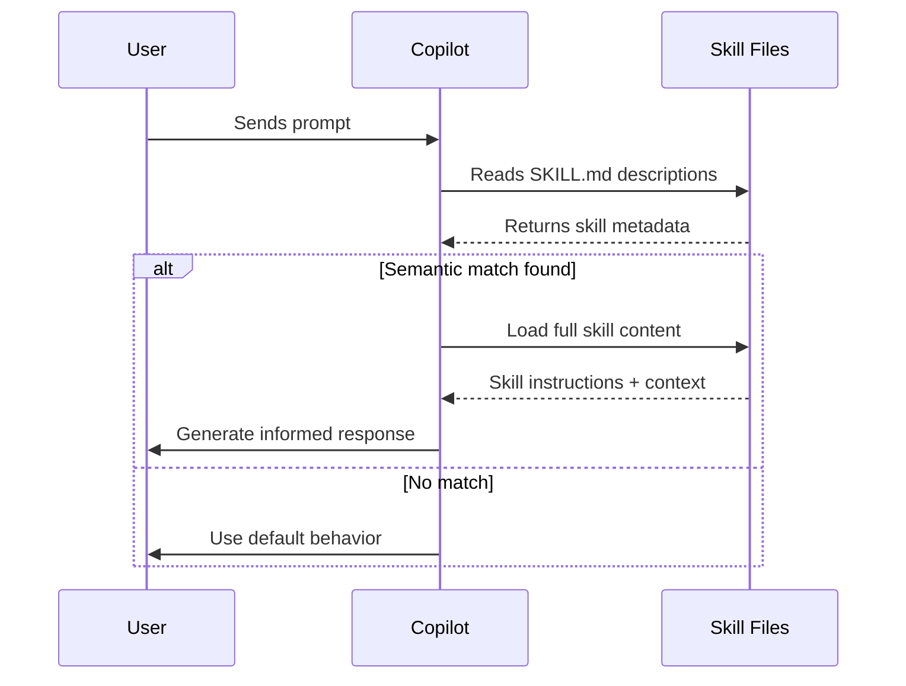

## Change Log

| Version | Date | Author | Changes |
|---------|------|--------|---------|
| 2.0.0 | 2026-03-18 | Paula Silva | Mario Bros Version — complete rewrite with Super Mario analogies |
| 1.0.0 | 2026-03-06 | Paula Silva | Original version with RPG analogies |

# Chapter 4B — Agent Skills & SKILL.md / The Power-Up Shop — How to Build the Powers Collection for Your Characters

---

**Prepared for:** Sofia
**Version:** 2.0 (Mushroom Kingdom Edition)
**Author:** Paula Silva | Microsoft Latam Software GBB
**Date:** March 2026
**Language:** English (EN)
**Collection:** Agentic DevOps

---

## TABLE OF CONTENTS

- [Prologue: Entering the Power-Up Shop](#prologue-entering-the-power-up-shop)
- [1. What are Agent Skills?](#1-what-are-agent-skills)
  - [1.1 The Mechanism: How Copilot Loads Skills](#11-the-mechanism-how-copilot-loads-skills)
  - [1.2 Skills are an Open Standard](#12-skills-are-an-open-standard)
  - [1.3 Skills Complement Agents](#13-skills-complement-agents)
  - [1.4 The Mario Analogy: Power-Up Screen](#14-the-mario-analogy-power-up-screen)
  - [1.5 Comparative Table: Agent vs Skill](#15-comparative-table-agent-vs-skill)
  - [1.6 Links and Documentation](#16-links-and-documentation)
- [2. Structure of a Skill](#2-structure-of-a-skill)
  - [2.1 Complete Anatomy of a Skill Folder](#21-complete-anatomy-of-a-skill-folder)
  - [2.2 Automatic vs On-Demand Loading](#22-automatic-vs-on-demand-loading)
  - [2.3 The Mario Analogy: Anatomy of a Power-Up](#23-the-mario-analogy-anatomy-of-a-power-up)
- [3. SKILL.md Format](#3-skillmd-format)
  - [3.1 Frontmatter: The Critical Metadata](#31-frontmatter-the-critical-metadata)
  - [3.2 The Description is the Semantic Trigger](#32-the-description-is-the-semantic-trigger)
  - [3.3 The Body: Free-form Markdown with Structure](#33-the-body-free-form-markdown-with-structure)
  - [3.4 Complete Example: Skill 'workflow-feature'](#34-complete-example-skill-workflow-feature)
  - [3.5 Complete Example: Skill 'conventional-commit'](#35-complete-example-skill-conventional-commit)
- [4. Built-in vs Project vs Personal Skills](#4-built-in-vs-project-vs-personal-skills)
  - [4.1 When to Use Each Type](#41-when-to-use-each-type)
- [5. Case Study: The 8 Skills of the TodoApp](#5-case-study-the-8-skills-of-the-todoapp)
  - [5.1 Table of the TodoApp's 8 Skills](#51-table-of-the-todoapps-8-skills)
  - [5.2 How These Skills Integrate](#52-how-these-skills-integrate)
- [6. Best Practices for Writing Skills](#6-best-practices-for-writing-skills)
  - [6.1 10 Principles for Excellent Skills](#61-10-principles-for-excellent-skills)
  - [6.2 Anti-Patterns: What NOT to Do](#62-anti-patterns-what-not-to-do)
  - [6.3 Slash Commands: Invoking Skills Explicitly](#63-slash-commands-invoking-skills-explicitly)

---

## Prologue: Entering the Power-Up Shop

Sofia ran through the level and stopped in front of an enormous building made of shining blocks. It was the Mushroom Kingdom's **Power-Up Shop** — the place where all characters came to get their powers. Above the door, a neon sign flashed: "POWER-UPS — Make your characters invincible!"

Upon entering, she saw infinite shelves full of **"?" Blocks** of all colors. Each Block contained a different Power-Up — they weren't simple mushrooms or flowers. They were **complete powers**, each holding a unique ability that her characters could learn and master.

The Shop's walls glowed with vibrant colors. In the golden Blocks, she saw records of legendary players: those who unlocked the **Perfect Bug Search Power-Up**, the **Auto Deploy Super Star**, the **Code Review Fire Flower**. Each "?" Block contained a clear description of when that power should be activated and, inside it, the complete knowledge of how to use it.

The Shop's guardian Toad approached Sofia with a smile. *"Welcome, Player! You didn't come here just to learn about Power-Ups that already exist. You came to learn how to CREATE new Power-Ups for your characters. How to build a unique, powerful, and balanced Power-Up Screen. How to transform a basic character into a legendary hero of the Mushroom Kingdom."*

Sofia began to realize the true magnitude of her journey. Mastering Agent Skills wasn't just memorizing commands. It was learning the secret language through which characters gain powers. It was understanding the delicate balance between a well-described Power-Up and a character who had no idea when to use it.

This chapter is your **personal Power-Up Shop**. Each section will reveal a new power, each table will uncover a secret. By the end, you'll be able to create characters so powerful they'll challenge even the greatest bosses of the Mushroom Kingdom.

---

## 1. What are Agent Skills?

Agent Skills (or simply "Skills") are portable and reusable knowledge components that teach your characters — your AI agents — how to perform specialized tasks. They aren't just documentation fragments: they are **living Power-Ups** that Copilot reads, understands, and automatically applies when it recognizes they are relevant to the current task.

Think of Skills as a **collection of Power-Ups inside "?" Blocks**. Each Power-Up has three essential characteristics: (1) A clear description of what it does (the power's effect), (2) The activation conditions (when the power is released), and (3) The power's body (the exact instructions for how to use it). When someone needs a specific Power-Up, they don't need to manually memorize: the AI senses the description's presence, recognizes it's relevant, and loads all the Skill's knowledge as context into the conversation.

### 1.1 The Mechanism: How Copilot Loads Skills

The flow is elegant and automatic:

1. You send a prompt to Copilot (in VS Code, CLI, or Coding Agent)
2. Copilot reads your SKILL.md file's description (frontmatter + first line of description)
3. If the description **semantically matches** what you asked, the Skill is marked as relevant
4. The Skill's entire content — scripts, examples, references — is loaded as context into the conversation
5. Copilot now has detailed information about how to perform that specific task
6. You receive a **much more precise and contextualized** response

> Think of it this way: you're running through the level and hit a "?" Block. If the Power-Up inside matches what you need, it's automatically activated. You don't need to memorize where each Block is — the game senses the situation and offers the right Power-Up!

### 1.2 Skills are an Open Standard

Skills **are not proprietary to Copilot**. It's an open standard that works with:

- GitHub Copilot in VS Code
- GitHub Copilot CLI (command line)
- GitHub Copilot Coding Agent
- Any tool that respects the folder structure with SKILL.md

This means your Power-Ups are **portable**. You can move them, share them, use them in different levels of the Mushroom Kingdom, and they'll always work the same way. It's a lasting investment.

### 1.3 Skills Complement Agents

In previous chapters, you learned about **Agents** (Custom Agents, Chapter 4A). It's important to understand the relationship between the two:

- **Agent (Character)** = It's the entity, the playable character, the "who". An Agent has a defined identity, a purpose, a unique perspective. It's Mario, Luigi, Toad, Yoshi.
- **Skill (Power-Up)** = It's the ability, the knowledge, the "how". A Skill represents ONE specific capability the character can execute. It's the Super Mushroom, the Fire Flower, the Super Star.

A character WITHOUT Power-Ups is like tiny Mario who dies with a single touch. A Power-Up WITHOUT a character is like a mushroom sliding alone through the level, waiting for someone to grab it. Together, they form a formidable force.

### 1.4 The Mario Analogy: Power-Up Screen

To deeply understand how Skills work, think about how Power-Ups work in Super Mario Bros:

**Mario Level 1 (Small Mario)** starts small with just "Basic Jump" — a simple leap that anyone can make.

At **Level 5 (Big Mario)**, he grabs the **Super Mushroom** — grows in size, gains resistance, and can now take a hit without dying.

At **Level 10 (Fire Mario)**, he gets the **Fire Flower** — a devastating ability that fires fireballs, destroying enemies from a distance.

At **Level 15 (Cape Mario)**, he learns to use the **Cape Feather** — a magic feather that allows flying over obstacles and gliding over entire levels.

Each Power-Up has: (a) A **clear description** (what it does), (b) **Activation conditions** (when to grab it), (c) An **exact effect** (the gameplay impact).

**Now apply this to Agent Skills:**

- Your character is like Mario starting his journey in World 1-1.
- Each Skill you create is like a Power-Up in the Power-Up Shop.
- The Skill's "description" (frontmatter) is exactly like the visual and color of the "?" Block — it tells the game what power is inside.
- The Skill's "body" (content) is like the Power-Up's effect — the detailed instructions of HOW the power works.
- When you write a clear description, you're telling Copilot: "This Power-Up activates when someone asks for [X]. When activated, it does [Y]."

**A character with many well-structured Power-Ups is like Mario with Mushroom + Fire Flower + Cape Feather + Star — practically invincible!**

### Diagram: Skill Activation Flow



### 1.5 Comparative Table: Agent vs Skill

| Dimension | Agent (Character) | Skill (Power-Up) |
|---|---|---|
| **Mario Analogy** | Playable character (Mario, Luigi, Toad...) | "?" Block Power-Up (Mushroom, Fire Flower, Star...) |
| **What Does It Define?** | Identity, Purpose, Perspective | A specific capability, a "how to" |
| **Main File** | .md or .json files (Custom Agents) | SKILL.md in a folder |
| **Activation** | You explicitly select the character | Automatic activation upon recognizing relevant description |
| **Can Have a Folder?** | Yes (it's a complete system) | Yes (Skill is a folder with SKILL.md + resources) |
| **Portability** | Linked to workspace/project | Completely portable, open standard |
| **Can Be Invoked Directly?** | Yes (as Agent or Custom Agent) | No — activated by description semantics |
| **Example** | DBA Assistant (Toad specialized in databases) | postgresql-review (Power-Up: review PostgreSQL queries) |

### 1.6 Links and Documentation

Source: About Agent Skills - GitHub Docs — https://docs.github.com/en/copilot/concepts/agents/about-agent-skills

---

## 2. Structure of a Skill

Every Skill follows a well-defined architecture. Understanding this structure is the first step to creating powerful and reusable Power-Ups.

### 2.1 Complete Anatomy of a Skill Folder

A Skill is a **folder** that contains various types of files. Here is the recommended structure:

```
my-awesome-skill/
├── SKILL.md                 <- REQUIRED: Frontmatter + description + instructions
├── scripts/
│   ├── deploy.sh           <- Executable scripts the Skill uses
│   ├── validate.js         <- Can be in any language
│   └── rollback.py
├── references/
│   ├── best-practices.md   <- Supporting documentation, guides
│   ├── troubleshooting.md  <- Solutions for common problems
│   └── architecture.md
├── examples/
│   ├── example-1.ts        <- Practical examples of how to use
│   ├── example-2.ts
│   └── README.md           <- Readme with explanations
└── README.md               <- Optional: skill overview
```

### 2.2 Automatic vs On-Demand Loading

It's crucial to understand what Copilot loads automatically vs on demand:

- **Loaded AUTOMATICALLY:** Only the SKILL.md file. Copilot reads the frontmatter and description to determine if the Skill is relevant.
- **Loaded ON DEMAND:** Scripts, references, examples. These are loaded ONLY if Copilot decides the Skill is relevant AND if you or the context mentions or references them.

**Practical implication:** Keep your SKILL.md concise and clear. Put complex details in references. Copilot will load references if needed, but won't overload them unnecessarily.

> Think of it this way: when Mario hits a "?" Block, first the Power-Up appears (the SKILL.md). If he grabs the Power-Up, then the full effect activates (scripts, references). The Block doesn't dump EVERYTHING at once — first it shows what's inside, then activates the complete effect.

### 2.3 The Mario Analogy: Anatomy of a Power-Up

Think of a Skill as a **complete Power-Up inside a "?" Block:**

- **SKILL.md (The Main Power-Up):** The item that comes out of the "?" Block. It's the Mushroom, the Flower, the Star. Contains the power's name, its effects, and the fundamental instructions for how to use it.

- **scripts/ (Complementary Items):** The extra items that come with the Power-Up. They're like the extra coins and hidden blocks that appear when you activate a secret area. Concrete components that the power needs to function.

- **references/ (Level Manuals):** Guides and level maps. If you don't know how a specific mechanic works, consult the manual. The character doesn't need all this information to use the Power-Up (they already know the basics), but it's good to have at hand.

- **examples/ (Replays and Gameplays):** Recordings of previous levels. "Here's an example of when the Fire Flower was used against Bowser. Here's another example against the Koopa Troopas." These replays help new players understand when and how to use each power.

- **README.md (Shop Catalog Entry):** A page in the Power-Up Shop catalog. Overview, history, variations.

---

## 3. SKILL.md Format

The SKILL.md file is the heart of each Skill. Its structure is simple but crucial: a **YAML frontmatter**, followed by a **free-form Markdown body**.

### 3.1 Frontmatter: The Critical Metadata

Every SKILL.md must start with a YAML block between three dashes (`---`):

```yaml
---
name: Power-Up Name (required)
description: |
  A clear and concise description (2-3 lines max).
  This description is the semantic TRIGGER.
  Copilot reads it and decides if the Skill is relevant.
---

## Skill Body in Free-form Markdown
Here begins the main content...
```

### 3.2 The Description is the Semantic Trigger

The frontmatter description is **the color and glow of the "?" Block**. It's what Copilot reads to determine if the Skill is relevant to your prompt. A vague or ambiguous description will lead to Power-Ups that are never activated when they should be — like an invisible "?" Block that nobody can find.

- Bad: "Description about technical things"
- Bad: "Deployment system"
- Good: "Deploy a Node.js application to Kubernetes using GitHub Actions with health validation"
- Good: "Review PostgreSQL queries for missing indexes, N+1 queries, and inefficient execution plans"

The description should be **specific enough** to avoid false activations (false positives), but **generic enough** to cover legitimate variations of the use case.

> Think of it this way: if the "?" Block's description just says "power", nobody knows what's inside. But if it says "Super Mushroom — makes you grow and take a hit", everyone knows exactly when to grab it!

### 3.3 The Body: Free-form Markdown with Structure

After the frontmatter, you can write anything in Markdown. The recommended structure is:

```markdown
## Overview — Briefly explain what the Skill does
## Prerequisites — What's needed before using it
## Steps — Step-by-step instructions, or phases in sequence
## File References — Relative links to scripts/references/examples
## Troubleshooting — Common problems and solutions
```

### 3.4 Complete Example: Skill 'workflow-feature' (Complete Workflow)

This is a real example, commented in detail, of a workflow Skill for implementing a new feature. Think of it as the **Super Mushroom** — the Power-Up that makes you grow and gives you full capacity to create something new:

```yaml
---
name: Workflow Feature Development
description: |
  Implement a new feature from scratch: plan design, write code,
  create tests, review code, deploy and monitor. Includes best
  practices for branching, conventional commits, and CI/CD.
---
```

```markdown
## Overview

This Skill guides you through the complete development cycle of a
new feature in a modern project. It covers:

- Feature planning and design
- Feature branch creation
- Implementation with tests
- Code review and improvements
- Staging and production deploy
- Post-deploy monitoring

## Prerequisites

- Git installed and configured
- Node.js 18+ and npm
- Repository access
- CI/CD pipeline access (GitHub Actions)
- Deploy credentials

## Workflow Levels

### Level 1: Planning

1. Open a detailed issue describing the feature
   - User story: "As a [role], I need [functionality]"
   - Acceptance criteria: List specific requirements
   - Technical tasks: Break into smaller subtasks

2. Approve the design with stakeholders
   - Create an ADR (Architecture Decision Record)
   - Document the main technical decisions
   - Identify external dependencies

3. Prepare the environment
   - Clone the repository locally
   - Install dependencies: `npm install`
   - Run existing tests: `npm test`

### Level 2: Implementation

1. Create a feature branch
   ```bash
   git checkout -b feat/my-feature
   ```

2. Implement the code
   - Follow the existing project pattern
   - Keep functions small and testable
   - Add comments for complex logic

3. Write tests (Jest)
   - Unit tests for functions
   - Integration tests for flows
   - Minimum 80% coverage

4. Commit with Conventional Commits
   ```
   feat(payments): add installment payment support

   - Implements 3 and 6 installments
   - Validates market interest rates
   - Integrates with Stripe API

   Closes #1234
   ```

### Level 3: Review

1. Push to remote
   ```bash
   git push origin feat/my-feature
   ```

2. Open a Pull Request
   - Use the PR template
   - Describe main changes
   - Link the related issue
   - Mention reviewers

3. Await approval
   - Resolve comments
   - Re-request review after changes
   - Merge only with approval

### Level 4: Verification

1. Verify CI/CD
   - All tests passing?
   - Test coverage OK?
   - Build without warnings?

2. Deploy to staging
   ```bash
   npm run deploy:staging
   ```

3. Test in staging
   - Test the main flows
   - Check error logs
   - Test in different browsers

### Level 5: Production Deploy

1. Merge to main (if everything's OK)
   - Squash or rebase before merge
   - Verify commit message

2. Automatic deploy is triggered
   - GitHub Actions runs tests
   - Production build
   - Deploy to production

3. Monitor
   - Check dashboards (Datadog, New Relic)
   - Monitor alerts
   - Check error logs

## File References

- Scripts: see `scripts/deploy.sh` for exact commands
- Practical example: `examples/feature-payments-setup.md`
- Common troubleshooting: `references/feature-dev-troubleshooting.md`

## Troubleshooting

**Q: Local tests pass but CI fails?**
A: Check Node versions. CI may use Node 18 while you're on 16.

**Q: Staging deploy worked but production fails?**
A: Environment variables may be different. Check .env.production.

**Q: How do I rollback after deploy?**
A: Run `npm run rollback`. See `scripts/rollback.sh` for details.
```

### 3.5 Complete Example: Skill 'conventional-commit' (Conventional Commits)

This is a smaller example, focused on a specific task: writing conventional commits. Think of it as a **Coin** — standard, universal, everyone knows it:

```yaml
---
name: Conventional Commits
description: |
  Write commits following the Conventional Commits standard:
  type(scope): subject. Includes breaking changes, closes issues,
  and keeps history clean and readable.
---
```

```markdown
## Overview

Conventional Commits is a standard that makes commit history
readable for machines and humans. It enables CHANGELOG automation,
semantic versioning, and history analysis.

## Format

```
<type>(<scope>): <subject>

<body>

<footer>
```

## Valid Types

- `feat`: New feature
- `fix`: Bug fix
- `docs`: Documentation only
- `style`: Formatting, whitespace (no code changes)
- `refactor`: Refactoring without new feature or fix
- `perf`: Performance improvement
- `test`: Adding or updating tests
- `chore`: Build updates, dependencies, etc

## Examples

Good:
```
feat(auth): add OAuth2 Google authentication

- Implements Google login
- Creates new /auth/google endpoint
- Saves tokens in session

Closes #456
```

Good:
```
fix(api): fix N+1 query in user listing

The query was making 1 query per user. Now uses
eager loading with includes().

Closes #789
```

Bad: `fix stuff`
Bad: `important code update`

## Breaking Changes

If the change breaks backward compatibility, add `!`:
```
feat(api)!: remove /v1/users endpoint (use /v2/users)
```

Or in the footer:
```
BREAKING CHANGE: /v1/users deprecated in favor of /v2/users
```

## Scope

The scope identifies which part of the project is affected:
- `auth`, `payments`, `database`, `api`, `ui`, etc.

Keep it consistent with your project.
```

---

## 4. Built-in vs Project vs Personal Skills

Skills can be categorized into three types, depending on where they live and who can access them. The Mario analogy: Power-Ups every character already has (every Mario starts knowing how to jump), Power-Ups from the current level (specific to that world), and secret Power-Ups (hidden in areas only you found).

| Type | What are they? | Location | Mario Analogy | Examples |
|---|---|---|---|---|
| **Built-in Skills** | Skills that come with Copilot, Microsoft, or GitHub. Standard knowledge every AI possesses. | GitHub Copilot server (cloud) | **Mario's basic jump**: every Mario is born knowing how to jump. No Power-Up needed. | - Writing Python code - Reviewing pull requests - Basic debugging |
| **Project Skills** | Skills specific to your project. Documentation, patterns, scripts your team maintains. | `.copilot/skills` or `docs/skills` folder in your repository | **Level Power-Ups**: Super Mushrooms and Fire Flowers in the "?" Blocks of that specific world. Every player in that level can grab them. | - jest-testing-for-our-project - workflow-deploy-terraform - coding-standards-typescript |
| **Personal Skills** | Skills you create for very specific, personal cases. Your customized knowledge. | Your local workspace, `~/.copilot/skills` or equivalent | **Secret area**: a hidden Warp Zone that only YOU discovered. Leads to Power-Ups nobody else knows about. | - my-custom-framework - my-company-specific-pattern - personal-automation-scripts |

### 4.1 When to Use Each Type

- Use **Built-in Skills** when the task is generic and any developer with Copilot should know how to do it. (Every Mario knows how to jump.)
- Use **Project Skills** when the task follows project-specific patterns. Everyone on the team needs this knowledge. (All players in this level need the same Super Mushroom.)
- Use **Personal Skills** when it's a very specific detail, a personal optimization, or an experiment you're trying. (Your personal secret area with custom Power-Ups.)

---

## 5. Case Study: The 8 Skills of the TodoApp

To illustrate the concepts, let's examine a real project that implements Skills: a complete TODO application (Node.js backend with Express + PostgreSQL, React frontend). This project has 8 well-structured Skills covering the complete development cycle.

Think of them as the **8 classic Power-Ups** you find in the Mushroom Kingdom:

### 5.1 Table of the TodoApp's 8 Skills

| # | Skill Name | Folder Path | Mario Power-Up | When Does It Activate? | Levels/Content |
|---|---|---|---|---|---|
| 1 | workflow-feature | `.copilot/skills/workflow-feature/` | Super Mushroom (makes you grow) | When you ask: "add a new feature" | Plan -> Implement -> Test -> Review -> Deploy |
| 2 | workflow-bugfix | `.copilot/skills/workflow-bugfix/` | Super Star (temporary invincibility) | When you ask: "fix this bug" or "there's a problem" | Diagnose -> Isolate -> Fix -> Test -> Verify |
| 3 | workflow-deploy | `.copilot/skills/workflow-deploy/` | Cape Feather (makes you fly) | When you ask: "deploy" or "publish this" | Build -> Stage -> Test -> Prod -> Monitor |
| 4 | workflow-codereview | `.copilot/skills/workflow-codereview/` | Fire Flower (fires fireballs) | When you ask: "review this code" or "analyze this PR" | Security -> Performance -> Style -> Tests -> Approve |
| 5 | conventional-commit | `.copilot/skills/conventional-commit/` | Coin (universal standard) | When you write a commit | Type -> Scope -> Subject -> Body -> Footer |
| 6 | jest-testing | `.copilot/skills/jest-testing/` | 1-UP Mushroom (extra life) | When you ask: "write tests" or "test this" | Unit Tests -> Integration -> Mocks -> Coverage |
| 7 | multi-stage-dockerfile | `.copilot/skills/multi-stage-dockerfile/` | Mini Mushroom (small and efficient) | When you ask: "create a Dockerfile" or "containerize this" | Builder Stage -> Prod Stage -> Optimization |
| 8 | postgresql-review | `.copilot/skills/postgresql-review/` | Ice Flower (freezes problems) | When you ask: "review my PostgreSQL query" | Indexes -> Query Plan -> N+1 -> Optimization |

### 5.2 How These Skills Integrate

These 8 Power-Ups form a **cohesive ecosystem in the Mushroom Kingdom**. When you work on the TodoApp:

1. You ask: "Add an email notification feature"
2. **workflow-feature** (Super Mushroom) is activated. It guides you through planning and implementation — you grow and get ready for the level.
3. You write code. **jest-testing** (1-UP Mushroom) is activated when you ask for tests — extra lives for the project.
4. You write PostgreSQL queries. **postgresql-review** (Ice Flower) evaluates if they're optimized — freezes performance problems.
5. You make commits. **conventional-commit** (Coin) ensures you follow the standard — standard coins everyone recognizes.
6. You create a Dockerfile. **multi-stage-dockerfile** (Mini Mushroom) helps with best practices — small and efficient container.
7. You open a PR. **workflow-codereview** (Fire Flower) offers a review checklist — attacks problems one by one.
8. Everything's ready. **workflow-deploy** (Cape Feather) orchestrates automatic deploy to production — flies to the production server.

Each Power-Up is independent (portable), but together they create a coherent and powerful workflow. This is the real strength of a good **Power-Up Shop**.

---

## 6. Best Practices for Writing Skills

### 6.1 10 Principles for Excellent Skills

1. **Clear and Specific Description:** Avoid ambiguities. The description is the semantic trigger. Be so clear that the AI understands it right away — like the color and shape of each Power-Up in Mario: you SEE it and already know what it does.

2. **Structured Documentation:** Use headings (##, ###), lists, tables. Structure facilitates reading and automatic comprehension — like level maps that clearly show where the "?" Blocks are.

3. **Practical Examples:** Don't just explain theoretically. Show real examples of when/how to use it. A gameplay replay is worth a thousand explanations.

4. **Reusable Scripts:** If the Skill contains automation (scripts, commands), put them in `scripts/` and reference them clearly — like items stored in inventory, ready to use.

5. **Complete References:** Links to official documentation, guides, blogs. Don't force Copilot to invent answers when good documentation exists — like a level manual that explains each mechanic.

6. **Troubleshooting Section:** Anticipate common problems. A "Problems and Solutions" section saves the player time — like a guide for "if you died at this part, try this".

7. **Versioning:** Keep Skills updated. If a tool's API changes, update the Skill. Version clearly — outdated Power-Ups can cause unexpected bugs.

8. **Modularity:** One Skill = One responsibility. Don't try to do everything in one Skill. Create small, focused Skills — each "?" Block contains ONE Power-Up, not ten.

9. **Testability:** If the Skill contains formulas, algorithms, or logic, include tests. Provability increases confidence — test the Power-Up before using it in the Boss Battle.

10. **Collaborative Maintenance:** If working in a team, document how to keep the Skill updated. Who's responsible? How to report problems? — like a Power-Up Shop maintenance team.

### 6.2 Anti-Patterns: What NOT to Do

- **Vague description:** "Skill about development". Too generic — like a "?" Block with no color, nobody knows what's inside.
- **No structure:** Wall of text without headings or lists — like a level without signage, impossible to navigate.
- **No examples:** Only theory, no practical example — like explaining a Power-Up without ever showing it in action.
- **Too large:** A single SKILL.md with 1000 lines. Break it into multiple Skills — no "?" Block contains the entire game.
- **No references:** Doesn't link to official documentation, forces improvisation — like playing without any manual.
- **Outdated:** References version 3 of a tool that's already at version 7 — like using the Super Mario Bros 1 map to play Super Mario World.
- **No tests:** Contains formulas/scripts but nobody knows if it actually works — like a Power-Up that might be bugged.
- **Ambiguous:** Could mean 3 different things, confuses Copilot — like a "?" Block that sometimes gives Mushroom, sometimes gives poison.

### 6.3 Slash Commands: Invoking Skills Explicitly

While Skills are normally activated automatically (you hit the "?" Block during the level), you can invoke a Skill explicitly using a **slash command**. In VS Code with Copilot Chat:

```
/skill conventional-commit
```

Or in some environments:

```
@skill:workflow-deploy
```

This forces Copilot to load that specific Skill, even if it wasn't automatically recognized. It's like going straight to the Power-Up Shop and asking: "Give me the Fire Flower!" — instead of waiting to find a "?" Block in the level. Useful when you know exactly which Power-Up you need, but haven't found the right Block.

---

## Power-Up Progression: The Player's Journey

Here's how the Power-Up evolution compares to Mario's evolution:

```
POWER-UP SCREEN — Player Progression
==========================================

Level 1  -> Small Mario (Basic Jump)
             = Companion without Skills
             Does the minimum. One touch and dies.

Level 5  -> Big Mario (Super Mushroom)
             = Companion with basic Skills (conventional-commit, jest-testing)
             More resistant, handles errors, has standards.

Level 10 -> Fire Mario (Fire Flower)
             = Companion with intermediate Skills (workflow-feature, codereview)
             Attacks problems from a distance, creates complete features.

Level 15 -> Cape Mario (Cape Feather)
             = Companion with advanced Skills (workflow-deploy, multi-stage-dockerfile)
             FLIES over obstacles, deploys to production, masters infrastructure.

BONUS    -> Star Mario (Super Star)
             = Companion with ALL 8 Skills + orchestration
             INVINCIBLE. Turbo mode. Nothing stops them.
```

---

**Previous:** 4A — Custom Agents | **Next:** 4C — Custom Instructions

---

### Power-Up Unlocked!

Sofia now masters Agent Skills and the Power-Up Shop.
She stored all Power-Ups in her inventory and headed to the next level in the Mushroom Kingdom...

**Quick mapping for this chapter:**

| Original Concept | Mario Version |
|---|---|
| Skills Library | Power-Up Shop |
| Skill / Ability | Power-Up / "?" Block |
| Skills Tree | Power-Up Screen |
| Agent / Companion | Character (Mario, Luigi, Toad...) |
| Spellbook / Spell | "?" Block / Power-Up |
| Warrior / Mage / Paladin | Mario / Luigi / Toad |
| Guild | Mushroom Kingdom |

---

## References

- [GitHub Copilot Documentation](https://docs.github.com/en/copilot)
- [Customizing Copilot](https://docs.github.com/en/copilot/customizing-copilot)
- [Copilot Agents Concepts](https://docs.github.com/en/copilot/concepts/agents)
- [Using Copilot Agent Mode](https://docs.github.com/en/copilot/using-github-copilot/using-copilot-agent-mode)
