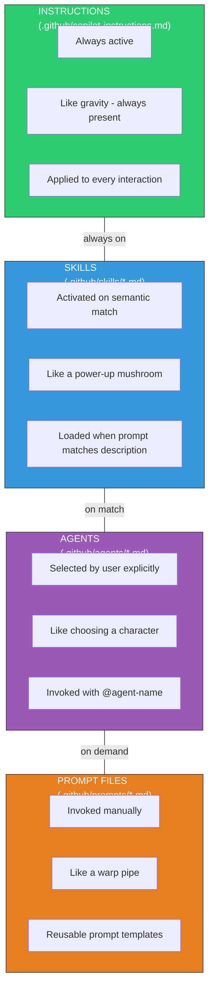

## Change Log

| Version | Date | Author | Changes |
|---------|------|--------|---------|
| 2.0.0 | 2026-03-18 | Paula Silva | Mario Bros Version — complete rewrite with Super Mario analogies |
| 1.0.0 | 2026-03-06 | Paula Silva | Original version with RPG analogies |

# Chapter 4C — Custom Instructions / The Game Rulebook — Game Rules that Copilot Always Follows

---

**Prepared for:** Sofia
**Version:** 2.0 (Mario Edition)
**Author:** Paula Silva | Microsoft Latam Software GBB
**Date:** March 2026
**Language:** English (EN)
**Collection:** Agentic DevOps

---

## TABLE OF CONTENTS

- [Introduction: The Game Rulebook](#introduction-the-game-rulebook)
- [Section 1: What Are Custom Instructions](#section-1-what-are-custom-instructions)
- [Section 2: The 3 Levels of Instructions](#section-2-the-3-levels-of-instructions)
  - [Level 1: Universal Rules (gravity)](#level-1-universal-rules-gravity)
  - [Level 2: Level Rules (water/sky/castle)](#level-2-level-rules)
  - [Level 2B: Sky Level Rules (Frontend)](#level-2b-sky-level-rules-frontend)
  - [Level 2C: Castle Rules (Database)](#level-2c-castle-rules-database)
- [Section 3: The applyTo Field in Detail](#section-3-the-applyto-field-in-detail)
- [Section 4: Priority Hierarchy](#section-4-priority-hierarchy)
- [Section 5: Comparative Table — Instructions vs Skills vs Agents vs Prompts](#section-5-comparative-table)
- [Section 6: Best Practices Checklist](#section-6-best-practices-checklist)
- [Bonus: Recommended File Structure](#bonus-recommended-file-structure)
- [Practical Example: Create Instructions for a Real Project](#practical-example-create-instructions-for-a-real-project)
- [Final Tips & Common Mistakes to Avoid](#final-tips--common-mistakes-to-avoid)

---

## Introduction: The Game Rulebook

Sofia opened the **Game Rulebook**. It was a thick book that sat next to every console — the Game Rules that every player automatically obeys. No matter which level you're on, no matter if you're Mario, Luigi, or Toad — these rules apply universally. You don't need to read the manual with every jump. They're part of the game itself — like **gravity** that always pulls Mario down, like **lava** that always kills, like **coins** that always heal.

Sofia realized that her Copilot (a mysterious game companion) also follows a set of rules like these. These special rules are called **Custom Instructions**. And today, she would learn how to create and master them so that Copilot would do exactly what she wanted — without having to repeat the same commands level after level.

---

## Section 1: What Are Custom Instructions

Custom Instructions are **rules that Copilot follows in EVERY INTERACTION without being reminded**. They form your game companion's default behavior — universal truths that apply to every project, code, document, or conversation.

> **CRUCIAL RULE:** Instructions are **PASSIVE** (always active everywhere, like gravity in Mario), while Skills are **ACTIVE** (power-ups you activate when needed, like grabbing a Super Mushroom).

Think of Instructions as the **GAME RULES** — every action that happens inside the Mushroom Kingdom follows these rules. Nobody needs to read the manual before each jump. The rule is embedded in the game engine itself. If the rule says "use TypeScript with strict mode", then all written code will be TypeScript with strict mode — automatically, in every file. Just as gravity doesn't need to be "activated" — it's simply there, all the time, in every level.

In contrast, Skills are like **POWER-UPS** that Sofia can grab when needed. "Got the Super Mushroom!" and Copilot enters special mode to create features. But when the power-up wears off, it returns to default behavior (the normal game rules keep applying).

**Instructions are the GRAVITY OF THE MUSHROOM KINGDOM** — always there, invisible, but determining everything that happens. You don't "activate" gravity. It simply exists.

---

## Section 2: The 3 Levels of Instructions

Just as in Super Mario there are different rule levels (rules that apply to the ENTIRE game, rules that only apply to specific levels, and your personal playstyle), Custom Instructions also work at three levels:

### Level 1: Universal Rules (gravity)

**Repository-Wide Instructions** — `.github/copilot-instructions.md`

This is the **GRAVITY** level — the universal rules that govern the entire Mushroom Kingdom. A single file that applies to THE ENTIRE REPOSITORY, in every file, in every interaction. Just as gravity works the same in World 1-1, World 4-3, and World 8-4, these instructions work everywhere in the project.

**Location:** `.github/copilot-instructions.md`

**Mario Analogy:** Gravity — the fundamental document that governs everything. You don't think about it, but it's always there.

```markdown
# File: .github/copilot-instructions.md
# This file contains universal rules for THE ENTIRE project

## Universal Rules for TodoApp (Game Gravity)

### 1. Programming Language
- ALWAYS use TypeScript with `strict: true` in tsconfig.json
- Explicitly declare types for all functions
- Prohibit `any` — use `unknown` and do type narrowing

### 2. React Framework
- Use ONLY React Hooks (functional components)
- Prohibit class components — they are forbidden magic
- Use `useState`, `useEffect`, `useContext` — they are the three pillars

### 3. Database
- ALWAYS use Prisma ORM
- Schema file: prisma/schema.prisma
- Never write raw SQL — Prisma does that for you

### 4. Styles
- Use TailwindCSS — no CSS-in-JS
- Configure in tailwind.config.ts
- Each class must be justified — no bloat

### 5. Code Versioning
- Commits follow Conventional Commits
- Prefixes: feat:, fix:, docs:, style:, refactor:, test:
- Example: "feat: add user authentication flow"

### 6. Code Patterns
- Pure functions when possible
- Error handling with try-catch and Result<T, E> types
- Logging with pino or winston

### 7. Folder Structure
src/
├── components/          # React components (only .tsx)
├── pages/               # Next.js Pages
├── utils/               # Utility functions
├── hooks/               # Custom React hooks
├── types/               # Global TypeScript types
├── api/                 # Route handlers (API Routes)
└── prisma/              # Database schema
```

This example shows a TodoApp repository with universal rules. Every team character, when starting to play, automatically follows these rules — just as Mario automatically falls when he jumps, without anyone needing to press an "activate gravity" button.

### Level 2: Level Rules

**Path-Specific Instructions** — `.github/instructions/backend.instructions.md`

This is the **UNDERWATER LEVEL RULES** level — regional rules that only apply to certain areas of the game. When Mario enters an underwater level, the rules change: he swims instead of running, jumps work differently, and enemies like Cheep Cheep appear. But gravity (universal rules) still applies!

**Location:** `.github/instructions/backend.instructions.md` (for `backend/**/*.ts`)

**Mario Analogy:** Underwater level rules — the "Backend" area has its own specialized rules, but gravity keeps working.

```markdown
# File: .github/instructions/backend.instructions.md
# applyTo: "backend/**/*.ts"
# Applies ONLY to TypeScript files in the backend/ folder

## Underwater Level Rules: Backend

### 1. API Structure
- Use Express.js or Fastify as framework
- Endpoints follow RESTful: GET /api/v1/users, POST /api/v1/users, etc.
- Version your API with /v1/, /v2/, etc.

### 2. Input Validation
- Use Zod for schema validation
- Always validate req.body, req.params, req.query
- Return 400 Bad Request with clear error message

### 3. Error Handling
- Create a custom AppError class
- Always return { success: boolean, data?, error? }
- Status codes: 200 (ok), 201 (created), 400 (client error), 500 (server error)

### 4. Authentication & Authorization
- JWT with RS256 (asymmetric)
- Token in header: Authorization: Bearer <token>
- Verification middleware on all protected routes

### 5. Logging
- Use winston with levels: error, warn, info, debug
- Log all critical operations (login, payment, deletion)
- Include requestId for distributed tracing

### 6. Database
- Prisma models in file prisma/schema.prisma
- Migrations before pushing: npx prisma migrate dev
- Never alter schema in production without planning

### 7. Tests
- Unit testing with Jest
- Minimum 80% coverage
- Use fixtures for test data
```

With the `applyTo` attribute, this instruction applies ONLY when you work with files in `backend/**/*.ts` — like swimming rules that only apply when Mario is underwater. Files in the frontend don't know these rules, just as sky level rules don't apply underwater.

### Level 2B: Sky Level Rules (Frontend)

```markdown
# File: .github/instructions/frontend.instructions.md
# applyTo: "frontend/**/*.tsx"
# Applies ONLY to React files in frontend/

## Sky Level Rules: Frontend

### 1. React Components
- Functional components ONLY
- One component per file
- PascalCase names: Button.tsx, UserCard.tsx

### 2. State Management
- useState for local state
- useContext for simple global state
- Zustand or Redux for complex state

### 3. Props
- Use TypeScript interfaces for props
- Always destructure props in the parameter
- Props are readonly

### 4. Custom Hooks
- File in src/hooks/useNome.ts
- Start with 'use'
- Documented with JSDoc comments

### 5. Forms
- Use react-hook-form + Zod
- Real-time validation
- Friendly error messages

### 6. Styles
- TailwindCSS in className=""
- Responsive mobile-first design
- No CSS modules unless absolutely necessary

### 7. Performance
- Lazy load large components with React.lazy
- Memoize callbacks with useCallback
- useSelector only if necessary
```

### Level 2C: Castle Rules (Database)

```markdown
# File: .github/instructions/database.instructions.md
# applyTo: "prisma/**/*"
# Applies ONLY to Prisma files

## Castle Rules: Database

### 1. Prisma Schema
- Model names in PascalCase (User, Product, Order)
- Fields in camelCase (firstName, createdAt)
- Use appropriate types: String, Int, DateTime, Boolean

### 2. Relationships
- Always implement relationships in both directions
- One-to-Many with @relation
- Many-to-Many with @relation and join model

### 3. Timestamps
- Always include createdAt DateTime @default(now())
- Always include updatedAt DateTime @updatedAt
- Use for auditing

### 4. Validations
- Unique field: @unique
- Required vs optional: String vs String?
- Default values with @default

### 5. Migrations
- Descriptive name: npx prisma migrate dev --name add_user_email
- Never delete columns without considering existing data
- Test migrations locally first

### 6. Indexes
- Index on frequently searched fields
- @@index([email]) for fast queries
- Composite indexes for complex queries
```

---

## Section 3: The applyTo Field in Detail

The `applyTo` field uses glob patterns to define EXACTLY which files an instruction applies to. Think of it as defining the **borders of each Mario level** — underwater level rules only apply inside the water, sky level rules only apply in the sky.

A glob pattern is a wildcard that matches file paths. Examples:

| Glob Pattern | What It Matches | Use Case |
|---|---|---|
| `backend/**/*.ts` | All .ts in backend/ and subfolders | Backend TypeScript files |
| `frontend/**/*.tsx` | All .tsx in frontend/ | React components |
| `**/*.test.ts` | Any .test.ts anywhere | Unit tests |
| `prisma/**/*` | Any file in prisma/ | Schema and Prisma migrations |
| `*.md` | Markdown in root only | Root documentation (README.md) |
| `.github/workflows/**` | CI/CD files | GitHub Actions workflows |
| `docker-compose*.yml` | docker-compose.yml and variants | Docker Compose file |
| `**/*.css` | CSS files anywhere | Global styles |
| `src/**` | Everything in src/ (including subfolders) | Main source code |
| `**/*.json` | JSON anywhere | Configurations (package.json, tsconfig.json) |

> **Tip:** A glob pattern can be very specific (a single file, like a specific block in the level) or broad (the entire map). Use it to apply instructions only where relevant — just as swimming rules only make sense underwater.

---

## Section 4: Priority Hierarchy

When multiple instructions apply to a file, which one does Copilot follow? The answer is a clear hierarchy, like rule levels in Mario:

**Personal Rules (your playstyle)** — MAXIMUM PRIORITY: Your personal instructions have the highest priority. These are files in `~/.copilot/instructions.md` (macOS/Linux) or equivalent on Windows. They ALWAYS win over anything else. It's like your personal playstyle — if you prefer speedrunning, that overrides everything.

**Level Rules (this project)** — MEDIUM PRIORITY: Instructions in the repository's `.github/` have the second priority. Everyone playing in this project follows them. It's like the specific rules of each level — everyone who plays that level follows the same rules.

**Universal Rules (gravity - your organization)** — BASE PRIORITY: The GitHub organization can define default instructions for all projects. They have the lowest priority and apply if no more specific ones exist. It's gravity — affects everything, but can be "adjusted" by more specific rules.

> **Mario Analogy:** Think of it this way: gravity (organization) pulls you down. The underwater level rules (repository) change how you move in water. And your personal playstyle (personal) determines how YOU specifically move within all of that. Your style always wins!

---

## Section 5: Comparative Table

### Diagram: Instructions vs Skills vs Agents vs Prompts



**Instructions vs Skills vs Agents vs Prompts**

| Dimension | Instructions | Skills | Agents | Prompts |
|---|---|---|---|---|
| **What is it?** | Game Rules that always apply (gravity, lava kills) | Power-Ups you activate when needed | Playable characters with unique abilities | Warp Pipes — shortcuts to specific areas |
| **File format** | .md (Markdown) | .md with metadata | .yaml + .js/.ts | Text in conversation |
| **Location** | .github/copilot-instructions.md | .github/copilot-skills/ | .github/copilot-workflows/ | Not saved (ephemeral) |
| **Activation** | Automatic (always active, like gravity) | Manual ("got the Mushroom!") | Automatic by event/schedule | Manual (enter the Warp Pipe) |
| **Scope** | Every file (or with applyTo per level) | During power-up execution | Specific context + date/time | One conversation |
| **Portability** | Shared with team | Shared with team | Can include executable scripts | Personal, not shared |
| **When to use** | Codebase-wide patterns | Specific repetitive tasks | CI/CD, continuous automation | Exploration, brainstorm |
| **Mario Analogy** | Gravity — always active, invisible | Super Mushroom — grab when needed | Mario, Luigi, Toad — each with powers | Warp Pipe — direct shortcut |

Use this table to decide when to create an Instruction vs Skill vs Agent. Each tool has its purpose in the game's arsenal:
- **Instructions** = Rules that are ALWAYS active, like gravity in Mario
- **Skills** = Power-Ups you activate when needed, like the Super Mushroom
- **Agents** = Characters with unique abilities, like Luigi or Toad
- **Prompts** = Warp Pipes that take you straight where you need to go

---

## Section 6: Best Practices Checklist

When creating or reviewing your Custom Instructions, use this checklist to ensure quality and effectiveness:

- [x] Instructions are clear and unambiguous — Copilot understands what to do
- [x] Use code examples — "like this NO" and "like this YES"
- [x] Glob patterns in applyTo are precise — don't affect unnecessary files
- [x] Hierarchy understood — you know which instruction will win in conflicts
- [x] Version the instructions — have change history in git
- [x] Instruct about the "why" — not just "what" — context helps
- [x] Update regularly — as the project evolves, instructions should too
- [x] Test the instructions — create a new file and see if Copilot follows them
- [x] Document exceptions — "normally X, but except when Y"
- [x] Keep it concise — don't create gigantic docs, be direct

> **Golden Tip:** Custom Instructions work best when combined with Skills (Power-Ups) and good Git workflow. Instructions define the Game Rules; Skills are the special Power-Ups; Git is the save point. Just like in Mario — gravity (Instructions) is always active, Power-Ups (Skills) you grab when needed, and checkpoints (Git) ensure you never lose progress!

---

## Bonus: Recommended File Structure

Here's the ideal structure for organizing your Custom Instructions — think of it as the **game map** that shows where each rule lives:

```
.github/
├── copilot-instructions.md           # Gravity — universal rules (whole repo)
├── instructions/
│   ├── backend.instructions.md       # Underwater rules (applyTo: "backend/**/*.ts")
│   ├── frontend.instructions.md      # Sky rules (applyTo: "frontend/**/*.tsx")
│   ├── database.instructions.md      # Castle rules (applyTo: "prisma/**/*")
│   ├── testing.instructions.md       # Training rules (applyTo: "**/*.test.ts")
│   └── docs.instructions.md         # Documentation rules (applyTo: "**/*.md")
├── copilot-skills/
│   ├── RefactorCode.md               # Refactoring Power-Up
│   ├── GenerateTests.md              # Testing Power-Up (1-UP Mushroom)
│   └── DocumentAPI.md                # Documentation Power-Up
├── workflows/
│   ├── ci.yaml
│   └── cd.yaml
└── CODEOWNERS                         # Defines who reviews which file
```

This layout makes it easy to find and modify instructions. Each file has a clear purpose — just like on the Mario map, where you know exactly which level is water, which is sky, and which is castle.

---

## Practical Example: Create Instructions for a Real Project

Let's create Custom Instructions for a real Next.js + Prisma project (an e-commerce app). Think of this as **setting up the rules for a new game** before starting to play.

### STEP 1: Create the `.github/copilot-instructions.md` file

This file is the **game's gravity** — the universal rules that apply to EVERYTHING, in every level, for every character.

```markdown
# Universal Instructions for TechStore E-commerce

## Project
- Name: TechStore
- Stack: Next.js 15, TypeScript, Prisma, TailwindCSS, Stripe
- Objective: Electronics sales platform

## 1. TypeScript Required
- All files must be .ts or .tsx
- tsconfig.json: strict: true
- Type any is PROHIBITED — use unknown and do type narrowing
- Interfaces for data structures

## 2. Next.js 15 Best Practices
- App Router (not Pages Router)
- Server Components by default
- Client Components with 'use client' when necessary
- API Routes in app/api/
- Middleware in middleware.ts

## 3. Prisma ORM
- Schema in prisma/schema.prisma
- Migrations with npx prisma migrate dev
- Use Prisma Client in server actions only
- Always validate user input

## 4. TailwindCSS
- Styles ONLY with TailwindCSS
- File tailwind.config.ts configured
- Responsive mobile-first design
- Custom color palette in tailwind.config.ts

## 5. Error Handling
- Use Error Boundaries for React
- Logging with pino or winston
- Standardized error responses

## 6. Security
- Never expose API keys on the client
- CORS headers configured
- JWT validation on endpoints

## 7. Commits
- feat: new feature
- fix: bug fix
- docs: documentation
- style: formatting
- refactor: refactoring
- test: tests
```

### STEP 2: Create `.github/instructions/backend.instructions.md`

Applies only to backend files — like the **underwater level rules** that only apply underwater. (`applyTo: "app/api/**"`)

```markdown
# Backend Instructions — TechStore

## API Design
- RESTful endpoints at /api/v1/
- GET /api/v1/products — list
- GET /api/v1/products/:id — detail
- POST /api/v1/products — create
- PUT /api/v1/products/:id — update
- DELETE /api/v1/products/:id — delete

## Validation
- Use Zod to validate req.body
- Return 400 Bad Request with detailed error if invalid
- Never trust client input

## Authentication
- JWT Bearer token in header
- Verification in middleware
- Roles: admin, seller, customer

## Examples

// GOOD
async function GET(request) {
  const schema = z.object({ id: z.string() })
  const { id } = schema.parse(request.nextUrl.searchParams)
  const product = await db.product.findUnique({ where: { id } })
  return Response.json(product)
}

// BAD
async function GET(request: any) {
  const id = request.nextUrl.searchParams.get('id')
  const product = await db.product.findUnique({ where: { id } })
  return Response.json(product)
}
```

### STEP 3: Create `.github/instructions/frontend.instructions.md`

Applies only to frontend — like the **sky level rules** that only apply when Mario is flying in the clouds. (`applyTo: "app/**/*.tsx"`, excludes: `"app/api/**"`)

```markdown
# Frontend Instructions — TechStore

## Components
- PascalCase filenames
- One component per file
- Props are readonly

## Example Component

'use client'
import { FC } from 'react'
import { Product } from '@/types'

interface ProductCardProps {
  product: Product
  onAddToCart: (productId: string) => void
}

const ProductCard: FC<ProductCardProps> = ({ product, onAddToCart }) => {
  return (
    <div className="border rounded-lg p-4">
      <h3 className="text-lg font-bold">{product.name}</h3>
      <p className="text-gray-600">${product.price}</p>
      <button
        onClick={() => onAddToCart(product.id)}
        className="bg-blue-500 text-white px-4 py-2 rounded"
      >
        Add to Cart
      </button>
    </div>
  )
}

export default ProductCard
```

With these three files, Copilot will know exactly how to behave in each part of the TechStore project — just as Mario automatically knows to swim in the underwater level, fly in the sky level, and be careful with lava in the castle. Without repeating instructions level after level.

---

## Final Tips & Common Mistakes to Avoid

Just as every Mario player has fallen in the same hole several times before learning, here are the most common mistakes with Custom Instructions:

- **Instructions too vague:** "use best practices" — be specific! It's like a game rule that says "play well" instead of "jump with the A button"
- **Instruction conflicts:** two files contradict each other — use hierarchy clearly (personal > level > universal)
- **applyTo too broad:** `applyTo: **` — almost never intentional. It's like applying underwater rules to the entire game — Mario would be swimming on dry land!
- **Not versioning them:** instructions change, use git to track (like save points)
- **Forgetting they're PASSIVE:** instructions don't "activate" like power-ups — they're gravity, not the Super Mushroom
- **Instructions don't serve for 'commands':** use Skills (Power-Ups) for that
- **Not communicating to the team:** document instructions in CONTRIBUTING.md — every player needs to know the rules!

---

**Previous:** 4B — Agent Skills | **Next:** 4D — Prompt Files

**Source:** GitHub Copilot Documentation — https://docs.github.com/en/copilot/customizing-copilot/adding-repository-custom-instructions-for-github-copilot

---

### Skill Unlocked!

Sofia now masters Custom Instructions and the Game Rulebook.
She stored this knowledge in her **Game Rulebook** and headed to the next level...

**Mario Analogy Summary for this chapter:**
- **Instructions** = Rules that are always active, like **gravity** in Mario
- **Skills** = **Power-Ups** you activate when needed
- **Universal Rules** = Gravity (affects the entire Mushroom Kingdom)
- **Level Rules** = Water / sky / castle rules (affect only that area)
- **Personal Rules** = Your playstyle (affects only you)
- **Game Rulebook** = The place where all rules are written

---

## References

- [GitHub Copilot Documentation](https://docs.github.com/en/copilot)
- [Customizing Copilot](https://docs.github.com/en/copilot/customizing-copilot)
- [Copilot Custom Instructions](https://docs.github.com/en/copilot/customizing-copilot/adding-custom-instructions-for-github-copilot)
