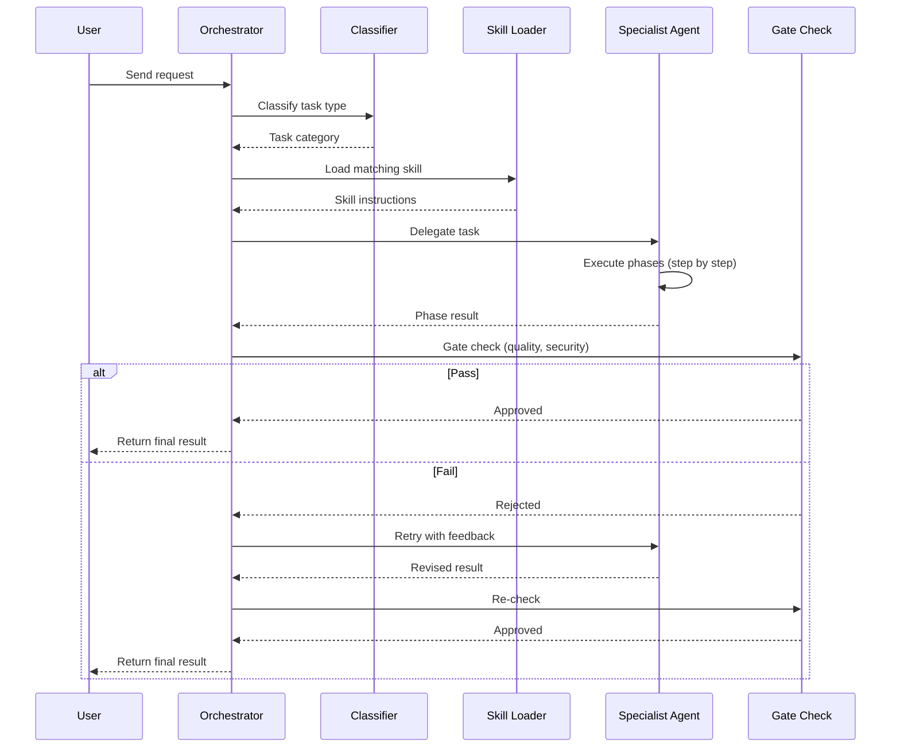

## Change Log

| Version | Date | Author | Changes |
|---------|------|--------|---------|
| 2.0.0 | 2026-03-18 | Paula Silva | Mario Bros version — complete rewrite with Super Mario analogies |
| 1.0.0 | 2026-03-06 | Paula Silva | Original version with RPG analogies |

# Chapter 4G — Multi-Agent Orchestration
## Coordinated Multiplayer — Playing as a Team

---

**Prepared for:** Sofia
**Version:** 2.0 — Mushroom Kingdom Edition
**Author:** Paula Silva | Microsoft Latam Software GBB
**Date:** March 2026
**Language:** English (translated from pt-BR)
**Collection:** Agentic DevOps — Super Mario Bros Edition

---

## TABLE OF CONTENTS

1. [Introduction — Multiplayer Mode](#introduction)
2. [What is Multi-Agent Orchestration](#what-is-it)
3. [Lean Agent + Rich Skill Pattern](#lean-agent)
4. [Complete Orchestration Flow](#complete-flow)
5. [Handoffs — Character Tag-Team](#handoffs)
6. [Boss Battle — Checklist Before Bowser](#boss-battle)
7. [The 4 Worlds (Main Workflows)](#4-worlds)
8. [The 6 Power-Up Layers (Context)](#6-layers)
9. [Conclusion — The Multiplayer Symphony](#conclusion)

---

## Introduction — Multiplayer Mode

Sofia activated **Multiplayer Mode**. On the character selection screen, she saw all her companions: Mario in the center (the leader), Luigi beside him (agile with jumps, frontend specialist), Toad with his mushroom (data guardian), Yoshi ready to fly (infrastructure and DevOps), Princess Peach floating (testing everything with precision), and Toadette with her judge's hammer (reviewing every line of code).

Each character had their place, their role, their specialty. But all converged toward a single purpose: **coordinating devastating attacks against the Final Boss — Bowser and his minions**.

This is the chapter where we learn **multi-agent orchestration**: the art of coordinating multiple intelligent characters, each specialized in their domain, working in perfect harmony to solve complex software engineering problems.

Just as Mario doesn't face Bowser alone in multiplayer mode, a modern DevOps project isn't executed by a single agent. It's a **coordinated team of specialists**, led by a main player — **Player 1 (Mario), the orchestrator agent**.

---

## 1. What is Multi-Agent Orchestration

### The Anatomy of a Successful Multiplayer

Consider Super Mario Bros multiplayer mode. The team isn't made up of four identical Marios. Each character has a critical role:

- **Mario (Player 1)** leads the team, coordinates who goes where, makes strategic decisions
- **Luigi** jumps higher, reaches platforms Mario can't — perfect for frontend challenges
- **Toad** is fast and knows every corner of the castle — perfect for fetching data
- **Peach** floats and checks every corner carefully — perfect for testing and quality

Nobody survives facing Bowser alone. Nobody performs all functions simultaneously. Each character does exactly what they were trained for, at the exact moment it's needed. **Player 1 (Mario) coordinates everything** — timing, who enters the level, who faces which enemy, which strategy to use depending on the World.

### Orchestration in Software Engineering

Multi-agent orchestration in DevOps follows exactly the same principle. Instead of a single agent trying to do everything (write code, review, test, deploy, monitor), we have:

- An **ORCHESTRATOR AGENT** (Player 1 / Mario) who receives the mission
- **SPECIALIST AGENTS** (Luigi, Toad, Yoshi, Peach, Toadette) who are experts in their specific domains
- **SKILLS** (Power-Ups) that contain workflows, patterns, and checklists

The orchestrator doesn't write code. It analyzes the task, identifies what type of problem it is, selects the right characters, delegates the work, validates results, and ensures everything passes the final Boss Battles. It's exactly like Player 1 in multiplayer — **strategic coordination, not technical execution**.

### The Cost of Isolation

**Without orchestration**, each character plays in complete isolation. Luigi builds frontend components without considering testing patterns. Yoshi tries to deploy without knowing if tests pass. Toadette reviews code without context about the change's intent. Result: inconsistency, bugs, lack of communication. It's like each character playing their own level without knowing what the others are doing.

**With orchestration**, there's synergy. Each character knows exactly when they enter, what they need to do, what their success checkpoints are, and who they pass control to. Quality goes up, time goes down, reliability increases. It's the **true coordinated multiplayer mode**!

### The Three Pillars of Orchestration

| Pillar | Description | Mario Analogy |
|---|---|---|
| **INTELLIGENT DELEGATION** | The orchestrator knows which agent to call for which task, and never tries to do everything alone | Player 1 knows Luigi jumps higher and sends him to the difficult platform |
| **SHARED CONTEXT** | All agents have access to the same context, history, and previous decisions | All players see the same map and know where each one is |
| **GATED VALIDATION** | Each handoff between agents validates that checkpoints were met before proceeding | Only moves to the next World when this World's Boss is defeated |

---

## 2. Lean Agent + Rich Skill Pattern

### The Lean Character

A lean agent is exactly the opposite of a character that tries to do everything. Its `.agent.md` file is small, focused, minimalist. It answers a simple question: **WHO AM I?**

**Examples of lean `.agent.md`:** The file contains only: character name, specialty (React Engineer, Database Admin, DevOps Lead), main responsibilities, which workflows it executes, what its success checkpoint is. **It does NOT contain:** complete tutorials, decision history, extensive code examples.

> It's like the **character card** on the Mario selection screen. You see: name, appearance, special ability. You don't need an entire book — just the essentials to choose the right character.

### The Rich Power-Up (Rich Skill)

While the character is lean, the **Power-Up is rich**. The `SKILL.md` file contains all the operational knowledge: step-by-step workflows, validation checklists, code patterns, real examples, common pitfalls and how to avoid them, detailed gate criteria, references to external documentation.

The skill is where the knowledge lives. It's shared across multiple characters. Multiple agents can use the same "Deploy" Power-Up (Cape Feather), for example, but each can have their own specific responsibilities.

> It's like the **Power-Up manual**. The Super Mushroom has a defined behavior (makes you grow, gives you an extra hit), and any character that grabs this mushroom gets those powers. The manual is rich in detail, but the character remains simple.

### The Knowledge Division

| Artifact | Size | Purpose | Mario Analogy | Example |
|---|---|---|---|---|
| `.agent.md` (Orchestrator) | ~100 lines | Defines who the agent is, main responsibilities | Player 1's card on the selection screen | Name: "Mario", Specialty: Coordination |
| `.agent.md` (Specialist) | ~100 lines | Defines specialty, which skill it executes, exit criteria | Character's card on the selection screen | Name: "Luigi", Executes: workflow-feature |
| `SKILL.md` (Shared) | ~500+ lines | Complete workflows, step by step, checklists, gates | Complete Power-Up manual | workflow-feature: Plan, Implement, Review, Verify |
| Context (6 Layers) | Variable | Configurations at different levels | Power-Up Slots that stack | ESLint config + rules + personal prefs |

---

### Diagram: Orchestration Flow



## 3. Complete Orchestration Flow

Orchestration follows a **7-step** flow. Each step has its checkpoints, its responsibilities, and well-defined success criteria. Let's walk through the complete journey of a task.

### Step 1: Receive the Mission

The orchestrator (Player 1 / Mario) receives the task. It could be a direct user prompt (*"Implement OAuth authentication"*), a GitHub issue, or a production error. The important thing is to capture: what's the goal, what's the context, are there constraints.

**Mario Analogy:** Player 1 sees the map screen. A new level appeared! What's the objective? Save Toad? Collect Star Coins? Defeat the Boss? First, understand the mission.

**Checkpoints:** The task must be clear enough to classify. Important information: technical context, time constraints, approval requirements.

### Step 2: Detect the Level Type

The orchestrator classifies: is it a new feature? A bugfix? A refactoring? A deploy? A code review? A performance investigation? The classification determines which **World** will be played.

**Mario Analogy:** Player 1 looks at the map and identifies the level type. "Is it a sky level? Let's call Peach who floats!" or "Is it an underwater level? Luigi swims better!"

**Checkpoints:** The classification must be clear. In ambiguous cases, ask the user for clarification.

### Step 3: Load the Relevant Power-Up

Once classified, the orchestrator loads the appropriate Power-Up (skill): `workflow-feature.md` (Super Mushroom), `workflow-bugfix.md` (Super Star), `workflow-deploy.md` (Cape Feather), `workflow-codereview.md` (Fire Flower). The Power-Up contains the complete step-by-step, checklist, validations, gate criteria.

**Mario Analogy:** Player 1 grabs the right Power-Up for the level. Fire level? Fire Flower! Timed level? Super Star! Sky level? Cape Feather!

**Checkpoints:** The Power-Up must be up to date and accessible. It must contain clear instructions for all types of specialists.

### Step 4: Pass Control (Tag-Team)

The orchestrator selects the correct character based on specialty. *"This is a React feature, I'll pass control to Luigi!"* or *"This is a database bugfix, Toad, your turn!"*

**Mario Analogy:** "Sky level with lots of jumps? Luigi, you jump higher — go! Level with lots of enemies? Yoshi, swallow them!"

**Checkpoints:** The character receives the Power-Up, the complete context (issue link, branch name, exit criteria), and knows exactly what to do. Zero ambiguity.

### Step 5: Execute the World's Levels

The specialist character executes the workflow phases. For a feature: Plan (1-1) -> Implement (1-2) -> Review (1-3) -> Verify (1-4). For a bugfix: Reproduce (2-1) -> Debug (2-2) -> Fix (2-3) -> Test (2-4). Each phase has its checkpoints and success criteria.

**Mario Analogy:** Each character executes their level. Luigi runs, jumps, collects coins, defeats enemies — all in the right order, respecting each phase's checkpoints.

**Checkpoints:** Each phase validates its criteria before moving to the next. The character doesn't advance until checkpoints are met.

### Step 6: Boss Battle (Final Gate)

Before returning the result, all final validations are executed. It's the Boss Battle! Four bosses in sequence that need to be defeated:

| Boss | What It Checks | If You Lose... |
|---|---|---|
| **Boss 1: Bowser Jr (TSC)** | Correct TypeScript types, zero errors | Go back to the level and fix the types |
| **Boss 2: Boom Boom (Jest)** | All tests passing | Go back and fix the tests |
| **Boss 3: Kamek (ESLint)** | Code quality, zero warnings | Go back and clean up the code |
| **Boss 4: Bowser (Zero Any)** | No `any` in TypeScript | Go back and define all types |

**Mario Analogy:** "Power-Ups equipped? Enough lives? Coins collected? EVERYONE READY? LET'S FACE BOWSER!"

**Checkpoints:** If any validation fails, go back to the previous step. Zero passes without defeating all bosses.

### Step 7: Victory! Return the Result

The result is delivered: PR ready for merge, code reviewed and approved, deployment executed, investigation completed. The result includes: what was done, what was learned, which checkpoints were met, next steps.

**Mario Analogy:** "Boss defeated! Star Coins collected. World completed. Next World unlocked!"

**Checkpoints:** The result is documented, traceable, reproducible.

---

## 4. Handoffs — Character Tag-Team

The quality of a multiplayer isn't determined by how strong each character is, but by how **smooth the control transitions** between them are. When Mario needs someone who jumps higher, Luigi enters. When Luigi finishes the difficult platform, Toad continues on the data section. When one character finishes, the next needs to know exactly where to start.

### 1. Exit Criteria — The Checkpoint Flag

Exit criteria define the **success condition** for a character to pass control to the next. It's not "when I think it's good enough," it's "when these verifiable conditions are true."

**Examples:**
- Feature implementation: *"Code written, unit tests passing, build without errors"*
- Code review: *"Comments addressed, linting passed, no BREAKING CHANGE without justification"*
- Deploy: *"Integration tests passing, health checks green, rollback plan documented"*

**Mario Analogy:** It's the **Checkpoint Flag** in the middle of the level. You only move to the next part when you reach the checkpoint. If you die before, you go back to the last checkpoint, not to the beginning!

### 2. Shared Data — What Gets Passed in the Tag-Team

When a character passes control to the next, they pass more than a "final file." They pass **complete context**: what decision was made, why, what trade-offs were considered, what the branch/PR/deployment is, what the relevant logs are.

**Shared data:**
- Issue/PR link with complete history
- Branch name and commit hashes
- Decision context: why this architecture, why this pattern
- Execution logs: which test failed, what the linter warning was
- Clear next steps

**Mario Analogy:** When Mario passes control to Luigi, Luigi sees: where Mario was on the map, how many coins he collected, which blocks he already hit, which enemies he already defeated. Complete context!

### 3. Retries — Continue from Checkpoint

Not always does a character complete their task on the first try. A test failed. A merge conflict appeared. A GitHub API rate limit froze everything. What to do?

**Retry Strategy:**
- **IMMEDIATE (3x):** If it's a transient error (timeout, rate limit), repeat automatically — like grabbing a 1-UP Mushroom and trying again!
- **WITH CONTEXT:** If it fails, pass the error and context so the next character understands what happened
- **HUMAN ESCALATION:** If it fails 3x on retry, call the human player

**Mario Analogy:** If Mario falls into a pit, he comes back from the checkpoint with one less life and tries again. If he loses all lives (3 retries), it's Game Over — time to call another player!

### 4. Escalation — Game Over, Call Another Player

Not every problem can be solved between characters. Some require human judgment, design decisions, or manual correction.

**When to escalate:**
- **SEVERE ERROR:** Compilation failure that requires major refactoring
- **AMBIGUITY:** Ambiguous task that needs user clarification
- **ARCHITECTURAL DECISION:** Multiple viable paths, needs human judgment
- **TIMEOUT:** Agent took more than N minutes, something is wrong

**Mario Analogy:** Game Over! Mario lost all lives and no character can pass the level. Time to call a more experienced human player who knows the secret path.

### Summary Table: Handoffs

| Aspect | Description | Mario Analogy | Example |
|---|---|---|---|
| **Exit Criteria** | Conditions that must be true | Checkpoint Flag in the middle of the level | Jest tests 100% + ESLint zero warnings |
| **Shared Data** | Information passed between characters | Mario shows the map to Luigi before switching | PR link + context + decision logs |
| **Retries** | When it fails, try again | 1-UP Mushroom — extra life to try again | 3x automatic retry, then escalation |
| **Escalation** | When a human needs to intervene | Game Over — call another player | Merge conflict that needs architectural decision |

---

## 5. Boss Battle — Checklist Before Bowser

Before any code goes to production, before any feature is merged, before any deploy happens, there's a **Boss Battle**. These are the 4 bosses that ensure nobody is entering Bowser's castle unprepared.

### Boss 1: Bowser Jr (TSC — TypeScript Compiler)

The first boss is Bowser's son — annoying but necessary to defeat.

**What It Checks:**
- Function types: parameters and return
- Property types: interfaces implemented correctly
- Generic types: T, K, V resolved
- Null/undefined safety: optional chaining vs non-null assertion

**Why It Matters:** Type errors discovered at runtime are the most expensive to fix. A function that expects `string` but receives `number` causes subtle bugs. TypeScript catches this at compilation.

**If It Fails:** Doesn't pass. Goes back to the specialist to fix. Zero exceptions. Bowser Jr blocks the path!

> It's like trying to enter the castle with the wrong equipment. Bowser Jr checks: "Do you have the right armor? The right power-ups? No? Go back and gear up properly!"

### Boss 2: Boom Boom (Jest — Unit Tests)

The brute that tests your strength. Boom Boom appears spinning his arms — you need to hit him 3 times (all tests passing).

**What It Checks:**
- Expected behavior: function returns what it promises
- Edge cases: null values, empty arrays, special strings
- Integration between units: dependency mocking, contract tests
- Performance: function isn't O(n^2) when it should be O(n)

**Why It Matters:** A bug discovered in staging costs 10x more than one discovered in tests. A bug in production costs 100x more. Tests are training before the real battle.

**If It Fails:** Doesn't pass. A failing test means: either the code is wrong, or the test is wrong. Either way, it needs fixing. Boom Boom won't let you through!

> It's like training against dummies before facing the real Boss. You wouldn't enter the Boss Battle without knowing if your skills work, right?

### Boss 3: Kamek (ESLint — Code Quality)

The Magikoopa wizard who casts verification spells. Kamek checks every detail of your code with magic.

**What It Checks:**
- Unused variables (dead code that might hide bugs)
- `console.log()` accidentally left in production
- Variables with the same name in different scopes (confusion)
- Dangerous comparisons (`==` vs `===`)
- Functions that modify parameters (non-obvious side effects)
- Unwaited Promises

**Why It Matters:** Most bugs that reach production aren't obvious logic errors — they're subtle JavaScript traps. ESLint catches 80% of them before the code runs.

**If It Fails:** Doesn't pass. Warnings count as failure. It's zero warnings or go back to fix. Kamek doesn't accept dirty code!

> It's like Kamek checking if you have any forbidden spells in your inventory. If he finds any, he blocks the passage until you clean everything up!

### Boss 4: Bowser (Zero `any` — The Final Boss)

Bowser himself. The Boss of Bosses. The final and definitive validation.

**What It Checks:**
- No explicit `any` in the code (type: any is banned)
- No implicit `any` (`noImplicitAny = true` in tsconfig)

**Why It Matters:** Every `any` you add is a broken contract with TypeScript. You're saying "I don't know what the type is, trust me." Trusting runtime is expensive. `any` is like paper armor against Bowser.

**If It Fails:** Doesn't pass. If you can put `any`, you understand the structure enough to put a correct type. Zero `any` or go back to fix. Bowser doesn't forgive!

> Bowser is the ultimate test. It doesn't matter if you defeated Bowser Jr, Boom Boom, and Kamek — if Bowser (Zero Any) catches you, everything starts over. No `any`, no excuses!

**You only move to the next World when ALL 4 Bosses are defeated.**

---

## 6. The 4 Worlds (Main Workflows)

Most tasks in a DevOps project fall into 4 categories — 4 Worlds on the Mushroom Kingdom map. Each World has its specific levels, its checkpoints, and its specialists.

### World 1: FEATURE — Create Something New (Super Mushroom)

```
Level 1-1: Plan      -> Look at the map, plan the route
Level 1-2: Implement -> Run through the level, collect coins, jump obstacles
Level 1-3: Review    -> Checkpoint — check if you got everything
Level 1-4: Verify    -> Boss Battle — Bowser Jr + Boom Boom + Kamek + Bowser
```

**Level 1-1: Plan (Planning)**
The specialist character reads the issue, understands the requirement, designs the architecture. What's the flow? How many files will be created? What patterns should be followed? What are the edge cases?

**Checkpoints:** Design document created, no ambiguity, architecture reviewed.
**Responsibility:** Feature specialist (Luigi for React, Toad for backend).
**Duration:** 30 min to 2 hours depending on complexity.

**Level 1-2: Implement (Implementation)**
Code written. Unit tests written (TDD: test before code, or immediately after). Each commit is atomic and has a clear message.

**Checkpoints:** Build passes, tests pass locally, no conflict with main.
**Responsibility:** Feature specialist.
**Duration:** 2 to 8 hours.

**Level 1-3: Review (Review)**
PR opened. Toadette (Code Reviewer) reads, comments, requests changes. Can be automated (ESLint, TSC) or human (logic, patterns, performance). There must be at least 1 approval before merge.

**Checkpoints:** Linting passes, tests pass in CI, no warnings, code review approved.
**Responsibility:** Toadette (Code Reviewer) or human.
**Duration:** 30 min to 4 hours.

**Level 1-4: Verify (Verification)**
Final Boss Battle: TSC (Bowser Jr), Jest (Boom Boom), ESLint (Kamek), Zero Any (Bowser). If everything passes, merge. If it fails, go back to Implement.

**Checkpoints:** Complete final gate met.
**Responsibility:** Orchestrator (Mario) coordinating automated checks.
**Duration:** 5-10 minutes.

### World 2: BUGFIX — Fix a Problem (Super Star)

```
Level 2-1: Reproduce -> Find where the enemy appears
Level 2-2: Debug     -> Investigate why the enemy is there
Level 2-3: Fix       -> Defeat the enemy
Level 2-4: Test      -> Verify it doesn't come back
```

**Level 2-1: Reproduce**
First, confirm the bug exists. Execute the exact steps that cause the problem. If you can't reproduce it, the bug doesn't exist (or was already fixed).

**Checkpoints:** Bug reproduced consistently, steps documented, exact error captured.
**Responsibility:** Detective Luigi (Debug Mode) or Peach (QA).
**Duration:** 15 min to 1 hour.

**Level 2-2: Debug (Investigation)**
Add logs, breakpoints, execution tracing. What's the root cause? Is it a logic error? A wrong type? An unhandled condition? A race condition?

**Checkpoints:** Root cause identified, hypothesis documented, fix plan ready.
**Responsibility:** Detective Luigi (Debug Mode).
**Duration:** 30 min to 4 hours.

**Level 2-3: Fix (Correction)**
Code fixed. Test added that fails without the fix and passes with the fix (so the bug doesn't come back).

**Checkpoints:** Code change is minimal, test fails without fix, test passes with fix, build passes.
**Responsibility:** Domain specialist for the bug.
**Duration:** 30 min to 2 hours.

**Level 2-4: Test (Testing)**
Run the test that reproduced the bug. It should pass now. Run the entire test suite. Nothing else should break.

**Checkpoints:** All tests pass, no regressions.
**Responsibility:** Peach (QA Engineer).
**Duration:** 10 min to 1 hour.

### World 3: DEPLOY — Launch to Production (Cape Feather)

```
Level 3-1: Build  -> Build the castle
Level 3-2: Test   -> Test if the doors open
Level 3-3: Lint   -> Check for traps
Level 3-4: Verify -> Open the doors to the public
```

**Level 3-1: Build (Construction)**
Compile code, bundle assets, create deploy artifacts (Docker image, compiled binaries, etc). No errors.

**Checkpoints:** Build successful, artifacts created, checksums verified.
**Responsibility:** Yoshi (DevOps Expert).
**Duration:** 5-30 minutes.

**Level 3-2: Test (Integration Tests)**
Run integration tests on the deploy artifact. Does it work with the real database? Are external APIs responding? Is the cache working?

**Checkpoints:** Integration tests pass, no timeouts, no intermittent failures.
**Responsibility:** Yoshi (DevOps) or Peach (QA).
**Duration:** 10-30 minutes.

**Level 3-3: Lint (Quality Check)**
SAST (Static Application Security Testing): check for known vulnerabilities, outdated dependencies, hardcoded secrets. DAST scan: basic security check.

**Checkpoints:** No critical or high vulnerabilities, dependencies updated, no secrets in code.
**Responsibility:** Yoshi (DevOps) or security specialist.
**Duration:** 10-20 minutes.

**Level 3-4: Verify (Final Verification)**
Deploy to staging first (blue-green deployment). Health checks. Smoke tests. If everything's green, deploy to production. Rollback plan ready.

**Checkpoints:** Staging green, rollback plan documented, no data changes without backup.
**Responsibility:** Yoshi (DevOps Expert).
**Duration:** 15-45 minutes.

### World 4: CODE REVIEW — Review Code (Fire Flower)

```
Level 4-1: Lint     -> Check style (coins aligned?)
Level 4-2: Security -> Check for hidden traps
Level 4-3: Review   -> Play the entire level as a test
Level 4-4: Approve  -> "CLEAR!" — level approved
```

**Level 4-1: Lint (Style)**
ESLint, Prettier, and other style tools. Does the code follow standards? Is there wrong spacing? Unorganized imports? This can be 100% automated.

**Checkpoints:** No linting errors.
**Responsibility:** Automated tools (GitHub Actions / Lakitu in the cloud).
**Duration:** 1-2 minutes.

**Level 4-2: Security (Security)**
Check: are there hardcoded secrets? SQL injection? XSS? Input validation? CSRF protection? Rate limiting on APIs?

**Checkpoints:** No vulnerabilities detected, security patterns followed.
**Responsibility:** Security reviewer (can be agent or human).
**Duration:** 10-30 minutes.

**Level 4-3: Review (Logic)**
Toadette reads the code. Are there obvious bugs? Is the logic clear? Are there comments explaining complex decisions? Is performance OK? Is there a better way?

**Checkpoints:** No obvious bugs, clear logic, no unanswered questions.
**Responsibility:** Toadette (Code Reviewer) or human.
**Duration:** 30 min to 2 hours.

**Level 4-4: Approve (Approval)**
Reviewer explicitly approves. "CLEAR!" — like when you complete a level in Mario and the flag goes up! PR can be merged.

**Checkpoints:** Human approval received.
**Responsibility:** Toadette (Code Reviewer).
**Duration:** 1 minute.

---

## 7. The 6 Power-Up Layers (Context)

Just like in Mario, where you can combine power-ups (Mushroom + Fire Flower + Star), in Agentic DevOps there are **6 context layers that stack** — like 6 Power-Up Slots you equip simultaneously:

| Layer | Power-Up Slot | Mario Analogy | Example |
|---|---|---|---|
| **1. Personal** | Slot 1: Your play style | Do you prefer running fast or exploring every corner? | Developer's personal preferences (tests before code, etc.) |
| **2. Organization** | Slot 2: Tournament rules | Rules that apply to ALL tournament players | Company policies (OAuth2.0, 2 approvals on PR) |
| **3. Repository** | Slot 3: This level's rules | Rules specific to this particular World | This project's patterns (directory structure, conventions) |
| **4. Path-Specific** | Slot 4: Area rules | Water rules, sky rules, castle rules — each area has its own | Rules for backend vs frontend vs infra |
| **5. Agent** | Slot 5: Character powers | Each character has unique abilities | Agent's specialty (React, DBA, DevOps) |
| **6. User Prompt** | Slot 6: Your command NOW | "Jump!", "Shoot!", "Run!" — what you command right now | What you asked Copilot |

### Detail of Each Layer

**Layer 1: Personal (~/.copilot/)**
Individual programmer preferences. What's your favorite IDE? Do you prefer tests before code or after?
**Who controls:** The individual
**Mario Analogy:** Player's personal preference. "I always play with Mario, never with Luigi."

**Layer 2: Organization (.github-private/)**
Organization-wide policies. What's the branch naming standard? What's the minimum Node.js version?
**Who controls:** Technical leadership / DevOps team
**Mario Analogy:** Tournament rules. "All players must use a standard controller, no turbo allowed."

**Layer 3: Repository (.github/)**
Standards specific to this repository. What's the directory structure? What's the commit convention?
**Who controls:** Repository maintainers
**Mario Analogy:** Rules of this specific World. "In this World, the Koopas are blue and slide on ice."

**Layer 4: Path-Specific (.github/instructions/)**
Instructions specific to a code path. Different behavior for frontend vs backend vs infra.
**Who controls:** Domain specialists
**Mario Analogy:** Area rules. "In the water level, Mario swims. In the sky level, Mario flies. In the castle, watch out for lava."

**Layer 5: Agent (.github/agents/)**
Agent-specific configuration. What's the specialty? Which skill does it execute?
**Who controls:** Agent owner
**Mario Analogy:** Character card on the selection screen. "Luigi: jumps higher. Toad: runs faster. Peach: floats."

**Layer 6: User Prompt (The Command Now)**
What the user asked right now. "Implement OAuth2", "Fix the bug", "Code review this PR".
**Who controls:** The user (you!)
**Mario Analogy:** The player's command at this exact moment. "Jump!", "Duck!", "Run right!"

### Stacking: Power-Ups ADD UP

All 6 layers **stack**. Mario doesn't lose gravity when he grabs Fire Flower. Similarly, a React Agent doesn't lose the repository rules when it receives a prompt.

**Practical example:**

You ask the orchestrator: *"Implement OAuth2 authentication on the frontend"*

The orchestrator searches:
1. **PERSONAL:** Your config — ah, this dev prefers tests before code
2. **ORGANIZATION:** OAuth policies — ah, everyone on OAuth2.0, RFC 6749
3. **REPOSITORY:** This project's structure — ah, frontend is in `/src/pages/`
4. **PATH:** Instructions for `/src/pages/` — ah, use context API, not Redux
5. **AGENT:** Luigi's config (React Engineer) — ah, this character knows React 18+, hooks
6. **PROMPT:** Your command now — "Implement OAuth2"

**Result:** The character executes with 6 stacked Power-Up layers. It's not just "implement OAuth2," it's "implement OAuth2 in React 18+ with context API, tests first, PR for code review, following OAuth2.0 standards." MAXIMUM POWER-UP!

> **Mario Analogy:** Your character isn't just a basic Mario. It's a Mario with Super Mushroom (grew), Fire Flower (shoots fireballs), Cape Feather (flies), AND Star (invincible). Each layer adds power. They all stack!

---

## Conclusion — The Multiplayer Symphony

Multi-agent orchestration isn't just a software engineering technique. It's a fundamental shift in how we think about development.

Instead of a **solo hero** facing all challenges, it's a **coordinated multiplayer team** where each character does exactly what they were trained for:

- **Mario (Player 1)** doesn't try to jump higher than Luigi — he coordinates
- **Luigi** doesn't try to guard data like Toad — he jumps where nobody else can reach
- **Toad** doesn't try to float like Peach — he protects the castle's data
- **Yoshi** doesn't try to review code like Toadette — he flies and builds infrastructure
- **Peach** doesn't try to lead like Mario — she tests every corner with patience
- **Toadette** doesn't try to debug like Detective Luigi — she judges quality with rigor

Each character **trusts the others**, executes their function, and communicates through defined checkpoints. And when everything is synchronized, the team is **unbeatable**. Bowser doesn't stand a chance.

Welcome to Coordinated Multiplayer Mode. Your games will never be the same again.

---

**POWER-UP UNLOCKED!**
Sofia now masters Multi-Agent Orchestration and Coordinated Multiplayer Mode.
She collected the Star Coin from this world and headed to the next...

**Source:** GitHub Copilot Documentation — https://docs.github.com/en/copilot/using-github-copilot/using-copilot-agent-mode

---

## References

- [GitHub Copilot Documentation](https://docs.github.com/en/copilot)
- [Using Copilot Agent Mode](https://docs.github.com/en/copilot/using-github-copilot/using-copilot-agent-mode)
- [Copilot Agents Concepts](https://docs.github.com/en/copilot/concepts/agents)
- [Customizing Copilot](https://docs.github.com/en/copilot/customizing-copilot)

---

<div align="center">

⬅️ [Previous: Level 6-6: MCP Practical](6-6-mcp-practical.md) · 🗺️ [World Map](../INDEX.md) · ➡️ [Next: Level 6-8: Token Optimization](6-8-token-optimization.md)

</div>
