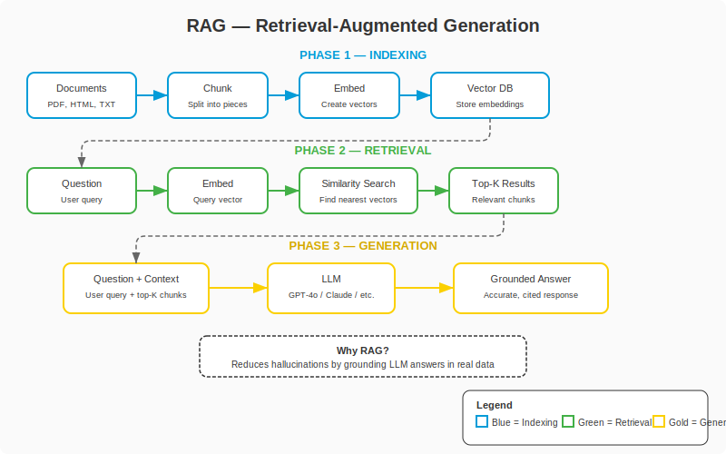

## Change Log

| Version | Date | Author | Changes |
|---------|------|--------|---------|
| 1.0.0 | 2026-03-18 | Paula Silva | Initial version — Super Mario Bros Edition |

# Level 7-2 — The Magic Library: RAG (Retrieval-Augmented Generation)

---

**Prepared for:** Sofia
**Version:** 2.0 (Mushroom Kingdom Edition)
**Author:** Paula Silva | Microsoft Latam Software GBB
**Date:** March 2026
**Language:** English (translated from pt-BR)
**Collection:** Agentic DevOps — World 7: Star World (AI Frameworks)

---

## TABLE OF CONTENTS

- [Prologue: The Mario Who Only Knew World 1](#prologue-the-mario-who-only-knew-world-1)
- [1. The Problem: LLMs Only Know What They Learned](#1-the-problem-llms-only-know-what-they-learned)
  - [1.1 The Training Limit](#11-the-training-limit)
  - [1.2 What Happens When the LLM Doesn't Know?](#12-what-happens-when-the-llm-doesnt-know)
  - [1.3 The Mario Analogy: Mario Stuck in World 1](#13-the-mario-analogy-mario-stuck-in-world-1)
- [2. The Solution: RAG — Retrieval-Augmented Generation](#2-the-solution-rag--retrieval-augmented-generation)
  - [2.1 What is RAG?](#21-what-is-rag)
  - [2.2 RAG in One Sentence](#22-rag-in-one-sentence)
  - [2.3 The Mario Analogy: The Magic Encyclopedia](#23-the-mario-analogy-the-magic-encyclopedia)

<div align="center">

<br><em>RAG Architecture: Indexing, Retrieval, and Generation</em>
</div>
- [3. How RAG Works: Step by Step](#3-how-rag-works-step-by-step)
  - [3.1 Phase 1: Indexing (Preparing the Library)](#31-phase-1-indexing-preparing-the-library)
  - [3.2 Phase 2: Retrieval (Finding the Right Book)](#32-phase-2-retrieval-finding-the-right-book)
  - [3.3 Phase 3: Generation (Giving the Informed Answer)](#33-phase-3-generation-giving-the-informed-answer)
  - [3.4 Complete ASCII Diagram](#34-complete-ascii-diagram)
- [4. Key Concepts Explained Simply](#4-key-concepts-explained-simply)
  - [4.1 Embeddings — Coordinates on the Map](#41-embeddings--coordinates-on-the-map)
  - [4.2 Vector Database — The Enchanted Shelf](#42-vector-database--the-enchanted-shelf)
  - [4.3 Chunks — Breaking the Book into Pages](#43-chunks--breaking-the-book-into-pages)
  - [4.4 Similarity Search — Finding the Nearest Star](#44-similarity-search--finding-the-nearest-star)
  - [4.5 Grounding — Answers Based on the Books](#45-grounding--answers-based-on-the-books)
  - [4.6 Complete Concepts Table](#46-complete-concepts-table)
- [5. The Complete Mario Analogy: The Magic Library](#5-the-complete-mario-analogy-the-magic-library)
  - [5.1 Normal Mario vs RAG Mario](#51-normal-mario-vs-rag-mario)
  - [5.2 The Story of the Magic Library](#52-the-story-of-the-magic-library)
  - [5.3 Table: Without RAG vs With RAG](#53-table-without-rag-vs-with-rag)
- [6. When to Use RAG](#6-when-to-use-rag)
  - [6.1 Ideal Scenarios for RAG](#61-ideal-scenarios-for-rag)
  - [6.2 When NOT to Use RAG](#62-when-not-to-use-rag)
  - [6.3 Decision Table](#63-decision-table)
- [7. RAG Architecture in Practice](#7-rag-architecture-in-practice)
  - [7.1 Components of a RAG Architecture](#71-components-of-a-rag-architecture)
  - [7.2 Complete Architecture Diagram](#72-complete-architecture-diagram)
  - [7.3 Common Technologies](#73-common-technologies)
- [8. Chunking Strategies: How to Break Your Documents](#8-chunking-strategies-how-to-break-your-documents)
  - [8.1 Types of Chunking](#81-types-of-chunking)
  - [8.2 Overlap: The Overlapping Technique](#82-overlap-the-overlapping-technique)
  - [8.3 The Mario Analogy: Cutting the Map into Pieces](#83-the-mario-analogy-cutting-the-map-into-pieces)
- [9. Common Problems and How to Solve Them](#9-common-problems-and-how-to-solve-them)
  - [9.1 The Model Doesn't Find the Right Information](#91-the-model-doesnt-find-the-right-information)
  - [9.2 The Model Hallucinates Even With RAG](#92-the-model-hallucinates-even-with-rag)
  - [9.3 Responses Are Slow](#93-responses-are-slow)
  - [9.4 Troubleshooting Table](#94-troubleshooting-table)
- [10. Advanced RAG: Techniques for the Next Level](#10-advanced-rag-techniques-for-the-next-level)
  - [10.1 Hybrid Search](#101-hybrid-search)
  - [10.2 Re-ranking](#102-re-ranking)
  - [10.3 Multi-Query RAG](#103-multi-query-rag)
  - [10.4 Agentic RAG](#104-agentic-rag)
- [11. Final Table: Without RAG vs With RAG](#11-final-table-without-rag-vs-with-rag)

---

## Prologue: The Mario Who Only Knew World 1

Sofia was exploring Star World when she came across a curious situation. There was a Mario sitting on a bench, looking frustrated. Next to him, a group of Toads was trying to get him to answer questions.

*"Mario, what's the secret to defeating Bowser in World 7?"* — asked a Toad.

Mario scratched his head. *"Hmm... in World 1, Bowser is vulnerable to fireballs and you can pass underneath him..."*

*"No, Mario! We're in World 7! It's different here!"*

Mario looked confused. *"I... I only know World 1. That's where I trained. If you ask me anything about World 1, I know it by heart. But the other worlds..."* He shrugged. *"I'd have to guess."*

Sofia understood immediately. That Mario was like an **LLM without access to external data** — he only knew what he learned during training. For anything outside his knowledge, he **made things up** (hallucinated) or admitted he didn't know.

Then, a mysterious Toadette appeared carrying a **glowing golden backpack**. Inside the backpack were dozens of **magic scrolls** — maps, guides, manuals for each World of the Mushroom Kingdom.

*"Mario,"* said Toadette, *"take this Magic Library with you. When someone asks you something you don't know, open the backpack, find the right scroll, read it, and THEN answer. That way, you'll never have to guess again."*

Mario took the backpack, opened a scroll about World 7, and smiled. *"Ah! So HERE Bowser is vulnerable to ice balls in the third round! Now I know!"*

That golden backpack is **RAG** — Retrieval-Augmented Generation. And this chapter is the complete story of how it works.

---

## 1. The Problem: LLMs Only Know What They Learned

### 1.1 The Training Limit

Every Large Language Model (LLM) — like GPT-4, Claude, Llama — was trained on a **massive collection of texts**: books, websites, articles, code, Wikipedia, and much more. That training happened up to a **cutoff date** (for example, "data up to October 2023"). After that date, the model knows nothing that happened.

**Practical implications:**

- The model **DOES NOT know** about events after the cutoff date
- The model **DOES NOT know** your company's internal documents
- The model **DOES NOT have access** to your database
- The model **DOES NOT know** which products you sell or your current prices
- The model **DOES NOT know** your internal policies, processes, or procedures

> Think of it this way: Mario was trained in World 1. He knows every Goomba, every "?" Block, every green pipe in World 1 by heart. But if you ask about World 5, he doesn't have that information — it was never part of his training.

### 1.2 What Happens When the LLM Doesn't Know?

When an LLM receives a question about something not in its training, it has two options:

**Option 1: Admit it doesn't know**
```
Question: "What is Mario Store's return policy?"
Answer: "Sorry, I don't have information about
         Mario Store's return policy."
```
This is honest, but useless.

**Option 2: Make up an answer (HALLUCINATION)**
```
Question: "What is Mario Store's return policy?"
Answer: "Mario Store accepts returns within 30 days
         with a receipt. Used items are not accepted."
```
This LOOKS correct, but the model **made it all up**. The actual policy could be completely different. This is dangerous because the answer is convincing — you would trust it.

**Hallucination** is the technical term for when the model generates information that appears factual but is **completely fabricated**. It's the biggest problem with LLMs in business applications.

### 1.3 The Mario Analogy: Mario Stuck in World 1

```
MARIO WITHOUT RAG (pure LLM)
==============================

Mario's Knowledge:
  World 1: ████████████████████ 100% (knows everything!)
  World 2: ░░░░░░░░░░░░░░░░░░░  0%  (never been there)
  World 3: ░░░░░░░░░░░░░░░░░░░  0%  (never been there)
  World 4: ░░░░░░░░░░░░░░░░░░░  0%  (never been there)
  World 5: ░░░░░░░░░░░░░░░░░░░  0%  (never been there)
  World 6: ░░░░░░░░░░░░░░░░░░░  0%  (never been there)
  World 7: ░░░░░░░░░░░░░░░░░░░  0%  (never been there)

Question: "How to defeat the World 5 boss?"

Mario WITHOUT RAG: "Hmmm... in World 1 you use fireballs...
               so... I guess in World 5 too? Maybe
               you need to jump on his head 3 times?"
               (HALLUCINATION — made up the answer!)

Mario WITH RAG: *opens the Magic Library*
               *finds the scroll "World 5 Guide"*
               *reads the "Boss Battle" section*
               "According to the World 5 Guide, the boss is
               vulnerable to ice balls in the second round,
               and you need to use the moving platform to
               reach him."
               (GROUNDED ANSWER — based on the document!)
```

---

## 2. The Solution: RAG — Retrieval-Augmented Generation

### 2.1 What is RAG?

**RAG (Retrieval-Augmented Generation)** is a technique that **combines information retrieval with text generation**. Instead of relying solely on what the model learned during training, RAG allows it to **consult external documents** before answering.

The name says it all:
- **Retrieval**: Search for relevant information in a document base
- **Augmented**: Use that information to enrich the context
- **Generation**: Generate an informed response based on the enriched context

### 2.2 RAG in One Sentence

> **RAG is giving the LLM access to a document library so it can consult before answering, instead of relying only on memory.**

Or in Mario language:

> **RAG is giving Mario a backpack with scrolls from all worlds, so he can consult before answering, instead of guessing.**

### 2.3 The Mario Analogy: The Magic Encyclopedia

| Concept | Without RAG | With RAG |
|---|---|---|
| **The Mario** | Only has what he learned in training | Carries a Magic Library in his backpack |
| **When receiving a question** | Tries to remember from training | Opens the backpack and looks for the right scroll |
| **If he doesn't know the answer** | Makes it up (hallucinates) or says "I don't know" | Consults the scroll and gives a grounded answer |
| **Answer quality** | Varies — can be good, bad, or fabricated | Consistently good — based on real documents |
| **Updating** | Needs to retrain the entire model (expensive, time-consuming) | Just add new scrolls to the backpack (quick, cheap) |

---

## 3. How RAG Works: Step by Step

RAG works in three distinct phases. Let's detail each one.

### 3.1 Phase 1: Indexing (Preparing the Library)

Indexing happens **before** any question is asked. It's the process of preparing your documents to be consulted quickly.

**Step by step:**

```
PHASE 1: INDEXING (happens ONCE, before use)
=============================================

1. COLLECT DOCUMENTS
   ┌──────────────────────────────────────────┐
   │  PDFs, Word, PowerPoint, web pages,      │
   │  emails, wikis, manuals, FAQs, code...   │
   └──────────────────────────────────────────┘
                      │
                      v
2. BREAK INTO CHUNKS (pieces)
   ┌──────────┐ ┌──────────┐ ┌──────────┐
   │ Chunk 1  │ │ Chunk 2  │ │ Chunk 3  │ ...
   │ "The     │ │ "Returns │ │ "Fragile │
   │ store's  │ │ within   │ │ items    │
   │ return   │ │ 30 days  │ │ must be  │
   │ policy   │ │ with     │ │ pack-    │
   │ follows."│ │ receipt."│ │ aged"    │
   └──────────┘ └──────────┘ └──────────┘
                      │
                      v
3. CONVERT TO EMBEDDINGS (numbers)
   Chunk 1 → [0.12, -0.45, 0.78, 0.23, ...]
   Chunk 2 → [0.15, -0.42, 0.81, 0.19, ...]
   Chunk 3 → [0.89, -0.11, 0.03, 0.67, ...]
                      │
                      v
4. STORE IN VECTOR DATABASE
   ┌─────────────────────────────────────┐
   │  VECTOR DATABASE                    │
   │                                      │
   │  ID: 1  Vector: [0.12, -0.45, ...]  │
   │  ID: 2  Vector: [0.15, -0.42, ...]  │
   │  ID: 3  Vector: [0.89, -0.11, ...]  │
   │  ...                                │
   └─────────────────────────────────────┘
```

> Mario analogy: Phase 1 is like **organizing the Magic Library**. You take all the scrolls from the Mushroom Kingdom (documents), cut them into individual pages (chunks), catalog each page with a magic code (embeddings), and place everything on an enchanted shelf that can find any page instantly (vector database).

### 3.2 Phase 2: Retrieval (Finding the Right Book)

Retrieval happens **when a question arrives**. The system needs to find the most relevant chunks for that question.

**Step by step:**

```
PHASE 2: RETRIEVAL (happens with EVERY question)
==================================================

1. RECEIVE THE QUESTION
   "What is the store's return policy?"
                      │
                      v
2. CONVERT QUESTION TO EMBEDDING
   "What is the policy..." → [0.14, -0.43, 0.79, 0.21, ...]
                      │
                      v
3. SEARCH FOR SIMILAR CHUNKS (similarity search)
   Question: [0.14, -0.43, 0.79, 0.21, ...]

   Compare with all chunks:
   Chunk 1: [0.12, -0.45, 0.78, 0.23, ...] → Similarity: 0.97 ← VERY SIMILAR!
   Chunk 2: [0.15, -0.42, 0.81, 0.19, ...] → Similarity: 0.95 ← SIMILAR!
   Chunk 3: [0.89, -0.11, 0.03, 0.67, ...] → Similarity: 0.12 ← DIFFERENT
                      │
                      v
4. RETURN TOP-K CHUNKS (the K most relevant)
   ┌──────────────────────────────────────┐
   │  Chunk 1 (similarity 0.97):         │
   │  "The store's return policy follows  │
   │   the Consumer Protection Code..."   │
   │                                      │
   │  Chunk 2 (similarity 0.95):         │
   │  "Returns within 30 days with        │
   │   receipt. Opened products are        │
   │   accepted if in perfect condition"   │
   └──────────────────────────────────────┘
```

> Mario analogy: Phase 2 is when Mario **opens the backpack and searches for the right scroll**. He doesn't read ALL the scrolls — that would take too long. Instead, the magic backpack **senses** which scroll is most relevant to the question and presents it automatically. It's as if the backpack has a magnet that attracts the scroll most similar to what you need.

### 3.3 Phase 3: Generation (Giving the Informed Answer)

Generation is the final step: combining the original question with the found chunks and sending everything to the LLM.

**Step by step:**

```
PHASE 3: GENERATION (combine question + context + LLM)
=======================================================

1. BUILD THE ENRICHED PROMPT
   ┌──────────────────────────────────────────────┐
   │  SYSTEM: Answer based ONLY on the documents   │
   │  provided. If the information is not in the    │
   │  documents, say "I didn't find that            │
   │  information in the available documents."      │
   │                                                │
   │  CONTEXT (found chunks):                       │
   │  "The store's return policy follows the         │
   │  Consumer Protection Code. Returns within 30    │
   │  days with receipt. Opened products are          │
   │  accepted if in perfect condition."              │
   │                                                │
   │  USER QUESTION:                                │
   │  "What is the store's return policy?"           │
   └──────────────────────────────────────────────┘
                      │
                      v
2. LLM GENERATES GROUNDED RESPONSE
   ┌──────────────────────────────────────────────┐
   │  "According to our documents, the store's      │
   │  return policy follows the Consumer Protection  │
   │  Code. You can return products within 30 days,  │
   │  as long as you present the receipt. Opened     │
   │  products are accepted if they are in perfect   │
   │  condition."                                    │
   └──────────────────────────────────────────────┘
```

> Mario analogy: Phase 3 is when Mario **reads the scroll and formulates the answer**. He's not making things up — he's reading the actual content of the scroll and explaining in his own words. If the scroll doesn't have the information, Mario honestly says: "I didn't find that in my scrolls." ZERO hallucination.

### 3.4 Complete ASCII Diagram

```
COMPLETE RAG ARCHITECTURE
===========================

                         ┌─────────────────────┐
                         │   YOUR DOCUMENTS     │
                         │  PDFs, Word, Web...  │
                         └──────────┬──────────┘
                                    │
                              [INDEXING]
                                    │
                    ┌───────────────┼───────────────┐
                    │               │               │
                    v               v               v
              ┌──────────┐   ┌──────────┐   ┌──────────┐
              │ Chunk 1  │   │ Chunk 2  │   │ Chunk 3  │ ...
              └────┬─────┘   └────┬─────┘   └────┬─────┘
                   │              │              │
              [EMBEDDING]    [EMBEDDING]    [EMBEDDING]
                   │              │              │
                   v              v              v
              ┌──────────────────────────────────────┐
              │        VECTOR DATABASE               │
              │  (Toadette's enchanted shelf)         │
              └──────────────────┬───────────────────┘
                                 │
                                 │ [SIMILARITY SEARCH]
                                 │
   ┌──────────────┐              │
   │  QUESTION    │──[EMBEDDING]─┘
   │  from user   │
   └──────┬───────┘
          │
          │         ┌─────────────────────┐
          │         │  TOP-K CHUNKS       │
          │         │  (most relevant)    │
          │         └──────────┬──────────┘
          │                    │
          v                    v
   ┌──────────────────────────────────────┐
   │              LLM                      │
   │  Question + Chunks = Response         │
   │  grounded in documents               │
   └──────────────────┬───────────────────┘
                      │
                      v
          ┌──────────────────────┐
          │  FINAL RESPONSE      │
          │  (grounded,          │
          │   no hallucination)  │
          └──────────────────────┘
```

---

## 4. Key Concepts Explained Simply

Let's unravel each technical RAG concept using clear and accessible analogies.

### 4.1 Embeddings — Coordinates on the Map

**What they are:** Embeddings are the conversion of text into **numbers** (vectors). Each word, phrase, or paragraph is transformed into a list of numbers that represent its **meaning**.

**Why they exist:** Computers don't understand text — they understand numbers. Embeddings are the "translation" of text into mathematical language.

**How they work:**

```
Text: "The cat sat on the mat"      →  [0.23, -0.45, 0.12, 0.89, ...]
Text: "The feline rested on the rug" → [0.25, -0.43, 0.14, 0.87, ...]
Text: "Brazil's economy grew"        → [0.78, 0.34, -0.56, 0.01, ...]
```

Notice that the first two sentences have **similar** vectors (similar meanings), while the third is very **different**.

> **Mario analogy**: Embeddings are like **coordinates on a Mushroom Kingdom map**. Each text is a point on the map. Texts with similar meanings are **close** on the map. "World 1-1" and "the first level of the game" are almost at the same point on the map, because they mean the same thing. Meanwhile, "chocolate cake recipe" is in a completely different region of the map.

```
EMBEDDING MAP (simplified in 2D)
==================================

         "return                 "return
          policy"                deadline"
              *    ←close→        *

                                    "business
                                     hours"
                                         *

  "cake
   recipe"
      *
                        "weather
                         forecast"
                            *
```

### 4.2 Vector Database — The Enchanted Shelf

**What it is:** A database specialized in storing and searching **vectors** (embeddings). Unlike a normal database that searches by exact words, a vector database searches by **meaning**.

**Normal database:**
```
SELECT * FROM docs WHERE title = "return policy"
→ Only finds if the title is EXACTLY "return policy"
```

**Vector database:**
```
SEARCH documents similar to "how to return a product?"
→ Finds "return policy", "exchange deadline",
  "refund process" — even without the exact words!
```

> **Mario analogy**: A normal database is like a shelf organized by **book title** — you need to know the exact title to find it. A vector database is an **enchanted shelf** that finds books by **subject** — you say "I need something about how to defeat ghosts" and the shelf magically presents all relevant books, even if none has "defeating ghosts" in the title.

**Examples of Vector Databases:**

| Vector Database | Mario Analogy | Characteristic |
|---|---|---|
| **Azure AI Search** | Official shelf of Princess's castle | Integrated with Azure, easy to use |
| **Pinecone** | Toadette's magic shelf — fast and precise | Cloud-native, very fast |
| **Weaviate** | Toad's shelf — organized and open-source | Open-source, versatile |
| **Chroma** | Mario's portable shelf — lightweight and local | Lightweight, ideal for prototypes |
| **Qdrant** | Yoshi's shelf — swallows everything and organizes | High performance, open-source |
| **pgvector** | Extension of the existing shelf (PostgreSQL) | Adds vectors to Postgres |

### 4.3 Chunks — Breaking the Book into Pages

**What they are:** Chunks are smaller pieces of a larger document. Instead of indexing a 100-page PDF as a single block, you divide it into smaller sections.

**Why divide:**
1. **LLMs have context limits** — 100 pages won't fit at once
2. **Precision** — if you're searching for "return policy," you don't need all 100 pages, just the relevant section
3. **Speed** — searching small chunks is faster

**Common sizes:**

| Chunk Size | When to Use | Advantage | Disadvantage |
|---|---|---|---|
| **256 tokens** (~200 words) | Specific, direct questions | High search precision | May lose context |
| **512 tokens** (~400 words) | General use, balanced | Good balance | Recommended default |
| **1024 tokens** (~800 words) | Answers needing more context | More context per chunk | Less precise search |
| **2048 tokens** (~1600 words) | Complex technical documents | Maximum context | May include irrelevant information |

> **Mario analogy**: Imagine you have the **Great Atlas of the Mushroom Kingdom** — a massive book with information about all worlds. If someone asks "How to defeat the Koopa in World 3?", you're not going to read the ENTIRE book. You go to the **World 3 chapter**, open to the **enemies section**, and read only the **page about Koopas**. Each "page" is a chunk. Smaller chunks = smaller pages = faster to find and read.

### 4.4 Similarity Search — Finding the Nearest Star

**What it is:** Similarity search is the process of finding chunks whose embeddings are **closest** to the question's embedding. The closer, the more relevant.

**How it works mathematically:** Uses distance metrics such as:
- **Cosine Similarity** (most common): Measures the angle between two vectors. The smaller the angle, the more similar.
- **Euclidean Distance**: Measures the direct distance between two points.
- **Dot Product**: Measures the projection of one vector onto another.

You don't need to understand the math! The important thing is the concept:

```
Question: "How to make a return?"
Question embedding: [0.14, -0.43, 0.79, ...]

Closest chunks (TOP-3):
  1. "Return policy..."              → distance: 0.03 (VERY close!)
  2. "Product exchange deadline"      → distance: 0.08 (close)
  3. "Refund process..."             → distance: 0.12 (reasonable)
  ...
  47. "Business hours"               → distance: 0.89 (FAR)
  48. "Cake recipe"                  → distance: 0.95 (VERY far)
```

> **Mario analogy**: Imagine you're on the Mushroom Kingdom map and need to find the **nearest star** to your position. You look around and see several stars in the sky. The brightest (closest) one is the most relevant. Similarity search is like having a **magic telescope** that automatically points to the nearest stars — the most relevant chunks for your question.

### 4.5 Grounding — Answers Based on the Books

**What it is:** Grounding is the principle that the LLM's response should be **based on the provided documents**, not on the model's "imagination."

**Without grounding:** The model may mix document information with information from its training (which may be wrong or outdated).

**With grounding:** The model is instructed to answer **only** based on the documents. If the information isn't in the documents, it should say "I didn't find that information."

**How to implement grounding in the prompt:**

```
SYSTEM PROMPT WITH GROUNDING:

"You are an assistant that answers questions based
EXCLUSIVELY on the documents provided below.

RULES:
1. Answer ONLY with information found in the documents
2. If the information is not in the documents, say:
   'I didn't find that information in the available documents'
3. NEVER make up information
4. Cite the document excerpt that supports your answer
5. If there is ambiguity, present all interpretations

DOCUMENTS:
[chunks retrieved by search]

USER QUESTION:
[question]"
```

> **Mario analogy**: Grounding is like telling Mario: **"Answer ONLY based on the scrolls in your backpack. If the scroll doesn't mention it, say you don't know. DON'T make things up. DON'T guess."** It's the rule that prevents Mario from hallucinating. Without grounding, Mario might mix scroll information with his "hunches" from World 1. With grounding, he is strictly faithful to the scrolls.

### 4.6 Complete Concepts Table

| # | Concept | Technical Definition | Mario Analogy | Practical Example |
|---|---|---|---|---|
| 1 | **Embedding** | Numerical representation of text | Coordinates on the Mushroom Kingdom map | "Cat" → [0.23, -0.45, ...] |
| 2 | **Vector Database** | Database that searches by meaning | Enchanted shelf that finds by subject | Azure AI Search, Pinecone, Chroma |
| 3 | **Chunk** | Smaller piece of a document | An individual page from the Great Atlas | 512 tokens (~400 words) |
| 4 | **Similarity Search** | Search for the closest chunks | Magic telescope that finds nearby stars | Cosine similarity between vectors |
| 5 | **Grounding** | Answers based on documents | Rule: "only answer based on the scrolls" | System prompt with restriction |
| 6 | **Indexing** | Prepare documents for search | Organizing the Magic Library | Chunking + embedding + storage |
| 7 | **Retrieval** | Find relevant chunks | Open the backpack and find the right scroll | Top-K similarity search |
| 8 | **Generation** | Produce response with context | Mario reads the scroll and explains | LLM + question + chunks |
| 9 | **Hallucination** | Model invents information | Mario guessing without consulting | "The policy is 30 days" (fabricated) |
| 10 | **Top-K** | How many chunks to return | How many scrolls to open | Top-3, Top-5, Top-10 |

---

## 5. The Complete Mario Analogy: The Magic Library

### 5.1 Normal Mario vs RAG Mario

```
NORMAL MARIO (LLM without RAG)
================================
  ┌─────────┐
  │  MARIO  │  Brain: only what he learned in training
  │  (LLM)  │  Backpack: EMPTY
  │         │  When he doesn't know: makes it up or says "I don't know"
  └─────────┘

RAG MARIO (LLM with RAG)
==========================
  ┌─────────┐  ┌──────────────────────┐
  │  MARIO  │  │  MAGIC LIBRARY       │
  │  (LLM)  │──│  (Vector Database)   │
  │         │  │                      │
  │         │  │  World 1 Scroll      │
  │         │  │  World 2 Scroll      │
  │         │  │  World 3 Scroll      │
  │         │  │  Enemy Manual        │
  │         │  │  Power-Up Guide      │
  │         │  │  Kingdom Map         │
  │         │  │  ...                 │
  └─────────┘  └──────────────────────┘
  Brain: training + library consultation
  Backpack: FULL of scrolls
  When he doesn't know: consults the library and answers based on it
```

### 5.2 The Story of the Magic Library

Let's tell the complete story of how RAG works, entirely in Mario language:

**Act 1: Preparing the Library (Indexing)**

Toadette, the librarian of the Mushroom Kingdom, receives a mission: organize ALL the knowledge of the kingdom in a Magic Library. She:

1. **Collects all the scrolls** from the kingdom — level maps, enemy manuals, power-up guides, battle records (= collect documents)

2. **Cuts each large scroll into smaller pages** — the "Great Manual of World 5" becomes 50 individual pages (= chunking)

3. **Marks each page with a magic seal** — a seal that glows when it finds something similar. The page about "fireballs" glows when someone searches for "how to attack with fire" (= embedding)

4. **Places everything on an enchanted shelf** — a magic shelf that makes relevant pages float to you when you need them (= vector database)

**Act 2: Mario Receives a Question (Retrieval)**

A desperate Toad runs to Mario: *"Mario! How do we defeat the Mega Blooper in World 4?!"*

Mario opens his golden backpack (connected to the Magic Library) and:

1. **Speaks the question aloud** — "How to defeat the Mega Blooper in World 4?" The backpack transforms the question into a magic seal (= convert question to embedding)

2. **The backpack glows and searches** — the question's seal "vibrates" at the same frequency as the relevant pages in the Library (= similarity search)

3. **Three scrolls float to Mario**:
   - Scroll 1: "Aquatic Enemies of World 4 — Mega Blooper section"
   - Scroll 2: "Aquatic Boss Weaknesses"
   - Scroll 3: "Strategies for Underwater Levels"
   (= top-K retrieval)

**Act 3: Mario Answers (Generation)**

Mario reads the three scrolls and answers the Toad:

*"According to the Enemy Manual, the Mega Blooper in World 4 is vulnerable to fireballs when it opens its tentacles. You need to wait for it to attack, dodge to the right, and launch 3 fireballs in sequence. According to the strategy guide, use the moving platform to position yourself above it."*

**The answer is precise, grounded, and citable!** Mario didn't make anything up — he read the scrolls and synthesized the information.

### 5.3 Table: Without RAG vs With RAG

| Aspect | Without RAG (Mario without backpack) | With RAG (Mario with Magic Library) |
|---|---|---|
| **Knowledge source** | Only training (World 1) | Training + external documents (all Worlds) |
| **Precision** | Variable — may be right or fabricated | High — based on real documents |
| **Hallucination** | Frequent in unknown domains | Rare — model is instructed to rely on docs |
| **Updating** | Needs retraining (expensive, weeks) | Add new docs to library (cheap, minutes) |
| **Cost** | Low (just the LLM) | Medium (LLM + vector database + embedding) |
| **Citability** | Cannot cite sources | Can cite exactly which document was used |
| **Transparency** | "How do you know this?" — "I... know" | "How do you know?" — "I read it in document X, page Y" |
| **Personalization** | Generic for everyone | Specific to your documents and domain |
| **Example** | "I think the policy is 30 days..." | "According to the policy doc, it's 30 days with receipt." |

---

## 6. When to Use RAG

### 6.1 Ideal Scenarios for RAG

RAG shines when you need the LLM to answer about **specific and up-to-date information** that wasn't in training:

| Scenario | Why RAG is Ideal | Example |
|---|---|---|
| **Internal documentation** | LLM doesn't know your docs | Chatbot answering about company policies |
| **Product manuals** | Specific and technical information | Technical support assistant |
| **Knowledge base** | FAQ with hundreds of questions | Automated help center |
| **Code documentation** | APIs, libraries, SDKs | Development assistant |
| **Regulatory data** | Laws, norms, regulations | Legal assistant |
| **Frequently changing data** | Prices, inventory, promotions | Sales assistant |
| **Academic research** | Scientific articles and papers | Research assistant |

### 6.2 When NOT to Use RAG

RAG **is not necessary** (and adds unnecessary complexity) in certain scenarios:

| Scenario | Why It DOESN'T Need RAG | Alternative |
|---|---|---|
| **General knowledge** | LLM already knows ("Capital of France?") | Use LLM directly |
| **Creative tasks** | There's no "right document" for creativity | Prompt engineering |
| **Casual conversations** | Simple chat chatbot | LLM with good system prompt |
| **Translation** | LLM is already great at translating | Use LLM directly |
| **Text summary** | The text is already in the prompt | Send text directly to LLM |
| **Generic code generation** | LLM already knows how to program | Use LLM with examples |

### 6.3 Decision Table

```
DO I NEED RAG? DECISION FLOW
==============================

Is the information the LLM needs in its training?
  │
  ├── YES → DON'T need RAG. Use the LLM directly.
  │         (Mario already knows World 1 — doesn't need a scroll)
  │
  └── NO → Does the information change frequently?
            │
            ├── YES → USE RAG! (Update docs in the library)
            │         (New levels being added to the kingdom — new scrolls)
            │
            └── NO → Is the output format very specific?
                      │
                      ├── YES → Consider FINE-TUNING
                      │         (Train Mario in a specific style)
                      │
                      └── NO → USE RAG! (Simpler than fine-tuning)
                                (It's easier to give Mario a scroll
                                 than to retrain him from scratch)
```

---

## 7. RAG Architecture in Practice

### 7.1 Components of a RAG Architecture

A complete RAG architecture has the following components:

| Component | Function | Mario Analogy | Example Technology |
|---|---|---|---|
| **Document Loader** | Read documents from various sources | Kingdom scroll collector | LangChain loaders, Azure Document Intelligence |
| **Text Splitter** | Break documents into chunks | Scroll cutter into pages | RecursiveCharacterTextSplitter |
| **Embedding Model** | Convert text to vectors | Magic seal that marks each page | text-embedding-ada-002, Cohere Embed |
| **Vector Store** | Store and search embeddings | Toadette's enchanted shelf | Azure AI Search, Pinecone, Chroma |
| **Retriever** | Search for relevant chunks | Mario's magic backpack | Similarity search, hybrid search |
| **LLM** | Generate response with context | Mario's brain that processes everything | GPT-4o, Claude, Llama |
| **Prompt Template** | Build the prompt with context | Instructions for Mario on how to use the scrolls | System prompt + context + question |

### 7.2 Complete Architecture Diagram

```
RAG ARCHITECTURE — COMPLETE VIEW
==================================

                    INDEXING PHASE (once)
   ┌────────────────────────────────────────────────────┐
   │                                                     │
   │  ┌──────────┐   ┌──────────┐   ┌───────────────┐  │
   │  │ Document │   │  Text    │   │   Embedding   │  │
   │  │ Loader   │──>│ Splitter │──>│   Model       │  │
   │  │          │   │          │   │               │  │
   │  │ (reads   │   │ (breaks  │   │ (converts to  │  │
   │  │  PDFs,   │   │  into    │   │  vectors)     │  │
   │  │  Word,   │   │  chunks) │   │               │  │
   │  │  HTML)   │   │          │   │               │  │
   │  └──────────┘   └──────────┘   └───────┬───────┘  │
   │                                         │          │
   │                                         v          │
   │                                ┌───────────────┐   │
   │                                │ Vector Store  │   │
   │                                │ (stores       │   │
   │                                │  embeddings)  │   │
   │                                └───────┬───────┘   │
   │                                        │           │
   └────────────────────────────────────────┼───────────┘
                                            │
                    QUERY PHASE (each question)
   ┌────────────────────────────────────────┼───────────┐
   │                                        │           │
   │  ┌──────────┐   ┌──────────┐           │           │
   │  │ User     │──>│ Embedding│───────────┘           │
   │  │ Question │   │ Model    │  [similarity           │
   │  └──────────┘   └──────────┘   search]              │
   │       │                              │             │
   │       │         ┌────────────────────┘             │
   │       │         │                                  │
   │       │         v                                  │
   │       │    ┌──────────┐                            │
   │       │    │ Top-K    │                            │
   │       │    │ Chunks   │                            │
   │       │    │ (most    │                            │
   │       │    │ relevant)│                            │
   │       │    └─────┬────┘                            │
   │       │          │                                 │
   │       v          v                                 │
   │  ┌──────────────────────┐                          │
   │  │   PROMPT TEMPLATE    │                          │
   │  │                      │                          │
   │  │ System: use the docs │                          │
   │  │ Context: [chunks]    │                          │
   │  │ Question: [user]     │                          │
   │  └──────────┬───────────┘                          │
   │             │                                      │
   │             v                                      │
   │  ┌──────────────────────┐                          │
   │  │       LLM            │                          │
   │  │  (generates grounded │                          │
   │  │   response)          │                          │
   │  └──────────┬───────────┘                          │
   │             │                                      │
   │             v                                      │
   │  ┌──────────────────────┐                          │
   │  │  FINAL RESPONSE      │                          │
   │  └──────────────────────┘                          │
   │                                                    │
   └────────────────────────────────────────────────────┘
```

### 7.3 Common Technologies

| Category | Technologies | Recommendation for Beginners |
|---|---|---|
| **Vector Database** | Azure AI Search, Pinecone, Chroma, Weaviate, Qdrant | **Chroma** (local, simple) or **Azure AI Search** (production) |
| **Embedding Model** | text-embedding-ada-002, text-embedding-3-small, Cohere Embed | **text-embedding-3-small** (cheap and good) |
| **LLM** | GPT-4o, GPT-4o-mini, Claude, Llama | **GPT-4o-mini** (cost-benefit) |
| **Framework** | LangChain, LlamaIndex, Semantic Kernel | **LangChain** (most popular, most documentation) |
| **Document Processing** | Azure Document Intelligence, Unstructured, PyPDF | **PyPDF** (simple) or **Azure Doc Intelligence** (advanced) |

---

## 8. Chunking Strategies: How to Break Your Documents

Chunking is one of the most important decisions in RAG. Bad chunks = bad searches = bad answers.

### 8.1 Types of Chunking

| Strategy | How It Works | Advantage | Disadvantage | Mario Analogy |
|---|---|---|---|---|
| **Fixed Size** | Cuts every N characters | Simple to implement | May cut in the middle of a sentence | Cutting the scroll with a ruler — straight but brutal |
| **Recursive** | Tries to cut at paragraphs, then sentences | Respects text structure | Slightly more complex | Cutting at the scroll's natural folds |
| **Semantic** | Groups by meaning (uses embeddings) | Very coherent chunks | Slower and more expensive | Grouping pages by subject magically |
| **By Header** | Cuts by document titles/sections | Preserves structure | Depends on doc having good formatting | Cutting by book chapters |
| **Sentence** | Each sentence is a chunk | Maximum granularity | Very small chunks, lose context | Each word on a separate sticky note |

**Recommendation**: Start with **Recursive** (size 512 tokens, overlap 50 tokens). It's the best balance for most cases.

### 8.2 Overlap: The Overlapping Technique

Overlap is when consecutive chunks **share a piece of text**. This avoids losing information that sits at the boundary between two chunks.

```
WITHOUT OVERLAP:
Chunk 1: "The return policy allows exchanges within"
Chunk 2: "up to 30 days. You must present the receipt."

The information "exchanges within up to 30 days" got split!
If you search "exchange deadline", you may not find it complete.

WITH OVERLAP (50 tokens):
Chunk 1: "The return policy allows exchanges within up to 30 days."
Chunk 2: "exchanges within up to 30 days. You must present the receipt."

Now the information "exchanges within up to 30 days" appears in BOTH chunks!
The search will find it no matter which chunk appears.
```

### 8.3 The Mario Analogy: Cutting the Map into Pieces

Imagine you have the complete map of World 5 and need to cut it into pieces to fit in the backpack:

```
WITHOUT OVERLAP (clean cut):
┌─────────┐┌─────────┐┌─────────┐
│ Piece 1  ││ Piece 2  ││ Piece 3  │
│          ││          ││          │
│  Level   ││  Level   ││  Level   │
│  start   ││  middle  ││  end     │
└─────────┘└─────────┘└─────────┘
Problem: the transition between start and middle is LOST!
The green pipe connecting the two pieces was cut in half!

WITH OVERLAP (overlapping cut):
┌───────────┐
│ Piece 1    │
│            │
│   Start +  │
│   PIPE     │
└────────┐   │
   ┌─────┴───┴──┐
   │ Piece 2     │
   │  PIPE +     │
   │   Middle +  │
   │   BRIDGE    │
   └────────┐    │
      ┌─────┴────┴─┐
      │ Piece 3     │
      │  BRIDGE +   │
      │   End       │
      └─────────────┘
Now the PIPE appears in piece 1 AND piece 2!
And the BRIDGE appears in piece 2 AND piece 3!
No transition was lost!
```

---

## 9. Common Problems and How to Solve Them

### 9.1 The Model Doesn't Find the Right Information

**Symptom:** You ask a question and the model says "not found" or returns irrelevant information.

**Possible causes:**
- Chunks too large (information "diluted")
- Chunks too small (context lost)
- Weak embedding model
- Question very different from the document vocabulary

**Solutions:**
- Adjust chunk size (try 512 tokens with 50 overlap)
- Use a better embedding model (text-embedding-3-large)
- Add synonyms and variations to documents
- Use hybrid search (keyword + semantic)

> Mario analogy: The magic backpack can't find the right scroll? Maybe the scrolls are poorly cut (bad chunks), or the magic seal (embedding) isn't precise, or the question was asked in a way the seal doesn't recognize. Redo the seals or rephrase the question!

### 9.2 The Model Hallucinates Even With RAG

**Symptom:** The model includes information that IS NOT in the provided documents.

**Possible causes:**
- System prompt not restrictive enough
- Temperature too high
- Returned chunks not relevant enough
- The model is "filling gaps" with training knowledge

**Solutions:**
- Strengthen the system prompt: "Answer ONLY based on the documents. NEVER add external information."
- Reduce temperature to 0.1-0.3
- Increase the similarity threshold (only return highly relevant chunks)
- Ask the model to cite sources: "Cite the exact excerpt from the document."

> Mario analogy: Mario is mixing what he read in the scroll with what he "thinks" he knows from World 1? Reinforce the rule: "Mario, only say what is WRITTEN in the scroll. If it's not written, say you don't know. ZERO guesses!"

### 9.3 Responses Are Slow

**Symptom:** The response takes too long to arrive.

**Possible causes:**
- Slow vector database
- Too many chunks being returned (top-K too high)
- Real-time embedding for each question
- Slow LLM with too much context

**Solutions:**
- Use a faster vector database (Pinecone, Qdrant)
- Reduce top-K (from 10 to 3-5)
- Cache embeddings for frequent questions
- Use a faster LLM (GPT-4o-mini instead of GPT-4)

### 9.4 Troubleshooting Table

| Problem | Probable Cause | Solution | Mario Analogy |
|---|---|---|---|
| Can't find info | Bad chunks or weak embedding | Adjust chunking, use better embedding | Poorly cut scrolls or weak seals |
| Irrelevant response | Top-K too high, junk in docs | Reduce top-K, clean documents | Too many bad scrolls in the backpack |
| Hallucination | Weak system prompt | Strengthen grounding in prompt | Mario mixing fact with guesswork |
| Slow response | Slow Vector DB or high top-K | Optimize DB, reduce top-K | Backpack too heavy, takes time to open |
| Incomplete response | Chunks too small | Increase chunk size | Pages too small, lack context |
| Repetitive response | Duplicate chunks or large overlap | Reduce overlap, deduplicate | Duplicate scrolls in the backpack |

---

## 10. Advanced RAG: Techniques for the Next Level

After mastering basic RAG, there are advanced techniques that significantly improve quality.

### 10.1 Hybrid Search

Combines **semantic search** (by meaning) with **keyword search** (by exact terms). The best of both worlds.

```
PURE SEMANTIC SEARCH:
  "How to reset credentials?" → finds "change access password"
  (good with synonyms, bad with exact technical terms)

PURE KEYWORD SEARCH:
  "NullPointerException error" → finds docs with "NullPointerException"
  (good with exact terms, bad with synonyms)

HYBRID SEARCH:
  Combines both! Gets the best results from each approach.
  → Finds BOTH synonyms AND exact terms
```

> Mario analogy: Semantic search is like looking in the backpack by "subject" — you ask for "boss combat" and find "boss battles." Keyword search is like looking by "exact title" — you ask for "Bowser" and find everything with "Bowser" in the name. Hybrid search uses BOTH methods and combines the results. Better precision!

### 10.2 Re-ranking

After the search returns the top-K chunks, a **re-ranker** analyzes each chunk in relation to the question and reorders by actual relevance.

```
SEARCH returns (initial order):
  1. "Company privacy policy..."                   (relevance: medium)
  2. "Return deadline is 30 days with receipt"      (relevance: high!)
  3. "Customer service hours..."                    (relevance: low)

RE-RANKER reorders:
  1. "Return deadline is 30 days with receipt"      ← moved up!
  2. "Company privacy policy..."                    ← moved down
  3. "Customer service hours..."                    ← stayed
```

> Mario analogy: It's as if, after opening the backpack and grabbing 5 scrolls, Toadette appeared and said: "Wait, let me reorder those scrolls for you. THIS one is the most relevant to your question, put it first." A second expert opinion.

### 10.3 Multi-Query RAG

Instead of searching with ONE query, generates multiple variations of the question and searches with ALL of them. Combines the results.

```
Original question: "How to return a product?"

Multi-Query generates variations:
  Query 1: "How to return a product?"
  Query 2: "What is the return process?"
  Query 3: "Exchange and refund policy"

Searches with ALL queries → More relevant chunks found!
```

> Mario analogy: Instead of shouting "Where's the scroll about Bowser?!" ONCE in the library, you shout IN THREE DIFFERENT WAYS: "Bowser!", "The final boss!", "The castle dragon!" — each shout activates different scrolls, and together they cover more information.

### 10.4 Agentic RAG

The most advanced form: an **AI agent** decides HOW to search, WHEN to search again, and IF it needs to refine the search. It's not a fixed pipeline — it's adaptive.

```
AGENTIC RAG:

1. Agent receives question
2. Agent decides: "I need to search for information"
3. Agent formulates the search query
4. Search returns chunks
5. Agent evaluates: "Do these chunks answer the question?"
   - YES → generates response
   - NO → reformulates the search and tries again
   - PARTIALLY → searches for complementary information
6. Agent generates final response
```

> Mario analogy: It's as if Mario, instead of just opening the backpack and grabbing the first scroll, were **intelligent enough** to evaluate the scroll and say: "Hmm, this doesn't fully answer it. Let me look for another complementary scroll." Mario becomes an **autonomous researcher**, not just a passive consultant.

---

## 11. Final Table: Without RAG vs With RAG

| # | Aspect | Without RAG | With RAG |
|---|---|---|---|
| 1 | **Data source** | Only model training | Training + your documents |
| 2 | **Domain-specific precision** | Low (fabricates) | High (based on docs) |
| 3 | **Hallucination** | Frequent | Rare (with good grounding) |
| 4 | **Data updates** | Retrain model (weeks, expensive) | Update documents (minutes, cheap) |
| 5 | **Citability** | Cannot cite sources | Cites documents and excerpts |
| 6 | **Initial cost** | Low (just LLM) | Medium (LLM + vector DB + embeddings) |
| 7 | **Complexity** | Simple (1 LLM call) | Medium (pipeline with multiple components) |
| 8 | **Personalization** | Generic | Specific to your domain |
| 9 | **Transparency** | Low ("how do you know?") | High ("based on document X") |
| 10 | **Latency** | Fast (1 call) | Slightly slower (search + LLM) |
| 11 | **Data security** | Data stays in the model | Your data stays in YOUR control |
| 12 | **Scalability** | Limited to the model | Scales with more documents |
| 13 | **Mario analogy** | Mario with only World 1 memory | Mario with complete Magic Library |

---

## RAG Progression: The Magic Librarian's Journey

```
RAG PROGRESSION — From Novice to Master
=========================================

Level 1 -> Librarian Apprentice
             = Basic RAG with Playground "On Your Data"
             Upload docs, questions and answers. Simple and functional.

Level 2 -> Junior Librarian
             = RAG with optimized chunking and embeddings
             Understands chunks, overlap, and chooses good embeddings.

Level 3 -> Senior Librarian
             = RAG with Prompt Flow + Evaluation
             Creates visual pipelines, evaluates quality, iterates.

Level 4 -> Master Librarian
             = RAG with hybrid search + re-ranking
             Hybrid search, reordering, multi-query.

MASTER  -> Toadette, the Legendary Librarian
             = Agentic RAG with autonomous decisions
             The system decides on its own how to search and when to refine.
```

---

**Previous:** Level 7-1 — Magikoopa's Forge (Azure AI Foundry) | **Next:** Level 7-3 — The Power-Up Chain (LangChain)

---

### Scroll Unlocked!

Sofia now understands the Magic Library — RAG.
She knows how to give unlimited knowledge to any AI model, how to organize documents on enchanted shelves, and how to prevent Mario from hallucinating.
The next level will lead her to discover how to **chain** AI operations into devastating combos — LangChain, the Power-Up Chain...

**Quick mapping for this chapter:**

| Original Concept | Mario Version |
|---|---|
| RAG | Mario's Magic Library |
| Embedding | Coordinates on the map / Magic seal |
| Vector Database | Toadette's enchanted shelf |
| Chunk | Individual page from a scroll |
| Similarity Search | Telescope that finds nearby stars |
| Grounding | Rule: "only answer based on the scrolls" |
| Hallucination | Mario guessing without consulting |
| Indexing | Organizing the Magic Library |
| Retrieval | Opening the backpack and finding the right scroll |
| Generation | Mario reads the scroll and explains |
| Re-ranking | Toadette reordering scrolls by relevance |
| Agentic RAG | Mario as autonomous researcher |

---

## References

- Azure OpenAI RAG Overview — https://learn.microsoft.com/en-us/azure/ai-services/openai/concepts/retrieval-augmented-generation

---

<div align="center">

⬅️ [Previous: Level 7-1: Azure AI Foundry](7-1-azure-ai-foundry.md) · 🗺️ [World Map](../INDEX.md) · ➡️ [Next: Level 7-3: LangChain](7-3-langchain.md)

</div>
