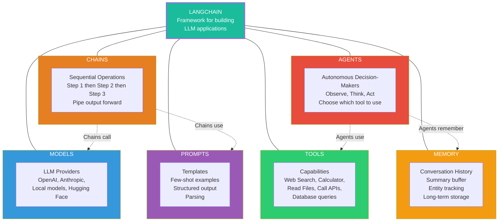

## Change Log

| Version | Date | Author | Changes |
|---------|------|--------|---------|
| 1.0.0 | 2026-03-18 | Paula Silva | Initial version — Super Mario Bros Edition |

# Level 7-3 — The Power-Up Chain: LangChain

---

**Prepared for:** Sofia
**Version:** 2.0 (Mushroom Kingdom Edition)
**Author:** Paula Silva | Microsoft Latam Software GBB
**Date:** March 2026
**Language:** English (translated from pt-BR)
**Collection:** Agentic DevOps — World 7: Star World (AI Frameworks)

---

## TABLE OF CONTENTS

- [Prologue: The Impossible Combo](#prologue-the-impossible-combo)
- [1. What is LangChain?](#1-what-is-langchain)
  - [1.1 The Problem LangChain Solves](#11-the-problem-langchain-solves)
  - [1.2 LangChain in One Sentence](#12-langchain-in-one-sentence)
  - [1.3 The Mario Analogy: Power-Up Combos](#13-the-mario-analogy-power-up-combos)
- [2. The Fundamental Components](#2-the-fundamental-components)
  - [2.1 Models — The Brain](#21-models--the-brain)
  - [2.2 Prompts — The Instructions](#22-prompts--the-instructions)
  - [2.3 Chains — The Operation Sequences](#23-chains--the-operation-sequences)
  - [2.4 Agents — The Decision Makers](#24-agents--the-decision-makers)
  - [2.5 Tools — The Inventory Items](#25-tools--the-inventory-items)
  - [2.6 Memory — Remembering Previous Levels](#26-memory--remembering-previous-levels)
  - [2.7 LCEL — The Combo Notation](#27-lcel--the-combo-notation)
  - [2.8 Complete Components Table](#28-complete-components-table)
- [3. Chains in Detail: The Art of the Combo](#3-chains-in-detail-the-art-of-the-combo)
  - [3.1 What is a Chain?](#31-what-is-a-chain)
  - [3.2 Types of Chains](#32-types-of-chains)
  - [3.3 Visual Chain Examples](#33-visual-chain-examples)
  - [3.4 Python Code: Your First Chain](#34-python-code-your-first-chain)
- [4. LCEL: The Language of Combos](#4-lcel-the-language-of-combos)
  - [4.1 What is LCEL?](#41-what-is-lcel)
  - [4.2 The Pipe Operator (|)](#42-the-pipe-operator-)
  - [4.3 LCEL Examples](#43-lcel-examples)
  - [4.4 The Mario Analogy: The Combo Notation](#44-the-mario-analogy-the-combo-notation)
- [5. Agents: Characters That Think for Themselves](#5-agents-characters-that-think-for-themselves)
  - [5.1 Chain vs Agent: What's the Difference?](#51-chain-vs-agent-whats-the-difference)
  - [5.2 How an Agent Works](#52-how-an-agent-works)
  - [5.3 The ReAct Cycle: Think, Act, Observe](#53-the-react-cycle-think-act-observe)
  - [5.4 Python Code: Creating an Agent](#54-python-code-creating-an-agent)
  - [5.5 The Mario Analogy: The Autonomous Character](#55-the-mario-analogy-the-autonomous-character)
- [6. Tools: The Item Inventory](#6-tools-the-item-inventory)
  - [6.1 What are Tools?](#61-what-are-tools)
  - [6.2 Available Tools](#62-available-tools)
  - [6.3 Creating Your Own Tools](#63-creating-your-own-tools)
  - [6.4 Python Code: Custom Tool](#64-python-code-custom-tool)
- [7. Memory: Remembering Previous Levels](#7-memory-remembering-previous-levels)
  - [7.1 The Problem: LLMs Don't Remember](#71-the-problem-llms-dont-remember)
  - [7.2 Types of Memory](#72-types-of-memory)
  - [7.3 Python Code: Adding Memory](#73-python-code-adding-memory)
  - [7.4 The Mario Analogy: The Adventure Diary](#74-the-mario-analogy-the-adventure-diary)
- [8. Complete Example: Mario Code Assistant](#8-complete-example-mario-code-assistant)
  - [8.1 What We'll Build](#81-what-well-build)
  - [8.2 Complete Code](#82-complete-code)
  - [8.3 Step-by-Step Explanation](#83-step-by-step-explanation)
- [9. When to Use LangChain vs Alternatives](#9-when-to-use-langchain-vs-alternatives)
  - [9.1 LangChain vs Direct API Call](#91-langchain-vs-direct-api-call)
  - [9.2 LangChain vs LangGraph](#92-langchain-vs-langgraph)
  - [9.3 LangChain vs Semantic Kernel](#93-langchain-vs-semantic-kernel)
  - [9.4 Decision Table](#94-decision-table)
- [10. Final Table: Component / Function / Analogy / Code](#10-final-table-component--function--analogy--code)

---

## Prologue: The Impossible Combo

Sofia was watching an epic battle. In the Star World arena, a legendary Mario was facing a horde of enemies — Goombas, Koopa Troopas, Hammer Bros, and even a Bowser Jr. Anyone would expect Mario to use his power-ups one at a time: first the Mushroom, then the Fire Flower, then the Star.

But this Mario was different. He didn't use power-ups in isolation. He **chained them into devastating combos**:

**Combo 1 — "Fire Fury":**
Mushroom (grows) → Fire Flower (gains fire power) → Sprint (runs toward the Goombas) → Triple Fireball (launches three fireballs in sequence) → RESULT: 5 Goombas defeated at once!

**Combo 2 — "Thunder Flight":**
Cape Feather (gains cape) → High Jump (jumps into the air) → Glide (glides over enemies) → Ground Pound (dives with force) → RESULT: all Koopa Troopas crushed!

**Combo 3 — "Falling Star":**
Star (invincibility) → Max Sprint → Collide with Enemies → Chain Kill → RESULT: everything destroyed in his path!

Sofia was fascinated. *"How does he do that?! How does he know which combo to use in each situation?"*

A Toad next to her smiled. *"He uses the **Power-Up Chain**. It's a system that allows you to build combos, chain power-ups, and even create characters that **decide on their own** which combo to use depending on the situation. Want to learn?"*

Sofia's eyes lit up. *"Yes!"*

The **Power-Up Chain** is **LangChain** — the most popular framework for building AI applications that chain operations into powerful combos. And this chapter is your combo manual.

---

## 1. What is LangChain?

### 1.1 The Problem LangChain Solves

Calling an LLM directly (like making a request to the GPT-4 API) is like using ONE SINGLE power-up at a time. It works for simple tasks, but for complex tasks you need **multiple chained operations**:

**Simple task (1 call):**
```
Question → LLM → Answer
"What is the capital of France?" → GPT-4 → "Paris"
```

**Complex task (multiple operations):**
```
1. Receive user question
2. Search for relevant documents (RAG)
3. Classify the question type
4. Choose the right model for the type
5. Generate response with context
6. Verify response safety
7. Format the response
8. Save to memory
9. Return to user
```

Doing all this manually, writing code for each step, would be **laborious, repetitive, and error-prone**. That's where LangChain comes in.

### 1.2 LangChain in One Sentence

> **LangChain is a Python (and JavaScript) framework that makes it easy to build applications that chain AI operations — models, prompts, searches, tools — into powerful and reusable pipelines.**

Or in Mario language:

> **LangChain is Mario's combo system — it allows chaining power-ups into devastating sequences that no single power-up could achieve alone.**

### 1.3 The Mario Analogy: Power-Up Combos

| LangChain Concept | Mario Analogy | What It Does |
|---|---|---|
| **LangChain (framework)** | Mario's Combo System | Allows building and executing power-up sequences |
| **Chain** | A specific combo | Mushroom → Fire Flower → Star = "Blazing Fury" combo |
| **Agent** | Character that chooses the combo | Mario looks at the enemies and decides: "I'll use the Thunder Flight combo!" |
| **Tool** | Item in the inventory | Fireball, cape, hammer — items the character can use |
| **Memory** | Adventure diary | "In World 3, the Boss was weak to ice — I'll remember that!" |
| **LCEL** | Combo notation | ↑↑↓↓←→←→BA = the written form to represent the combo |
| **Prompt** | Instruction for the character | "Use fireball against Goombas, ice against Boos" |
| **Model** | The character's brain | Which Mario to use: Mario (GPT-4), Luigi (Claude), Yoshi (Llama) |

---

### Diagram: LangChain Components



## 2. The Fundamental Components

LangChain is built around modular components that fit together like LEGO pieces. Let's get to know each one.

### 2.1 Models — The Brain

The **Model** component is the interface with the LLM — the "brain" that processes information and generates responses. LangChain supports multiple providers:

```python
# GPT-4o (OpenAI/Azure)
from langchain_openai import ChatOpenAI
model_gpt = ChatOpenAI(model="gpt-4o")

# Claude (Anthropic)
from langchain_anthropic import ChatAnthropic
model_claude = ChatAnthropic(model="claude-sonnet-4-20250514")

# Llama (via Ollama, local)
from langchain_ollama import ChatOllama
model_llama = ChatOllama(model="llama3")
```

> Mario analogy: The Model is which **character** you choose on the selection screen. Mario (GPT-4o) is the most versatile. Luigi (Claude) is good at long levels. Yoshi (Llama) is customizable and free. Each has different strengths, but all know how to play.

### 2.2 Prompts — The Instructions

The **Prompt** component is the instruction template you send to the model. LangChain offers reusable templates:

```python
from langchain_core.prompts import ChatPromptTemplate

# Simple template
prompt = ChatPromptTemplate.from_messages([
    ("system", "You are an assistant that explains programming "
               "using Super Mario Bros analogies. "
               "Respond in English."),
    ("human", "{question}")
])

# Use the template
message = prompt.invoke({"question": "What is a variable?"})
```

**Types of Prompt Templates:**

| Type | When to Use | Example |
|---|---|---|
| **ChatPromptTemplate** | Conversations with system/user/assistant | Chatbots, assistants |
| **PromptTemplate** | Simple text with variables | Content generation, summaries |
| **FewShotPromptTemplate** | Include examples in the prompt | Classification, specific formatting |
| **MessagesPlaceholder** | Insert message history | Conversations with memory |

> Mario analogy: Prompts are like the **written instructions** you give your character before a level: "Use fireball against red enemies, ice ball against blue enemies, and jump on the others." The clearer the instructions, the better the character plays.

### 2.3 Chains — The Operation Sequences

**Chains** are the heart of LangChain — sequences of connected operations where one's output feeds the next's input.

```
SIMPLE CHAIN:
Prompt → Model → Output

MEDIUM CHAIN:
Prompt → Model → Parser → Formatter → Output

COMPLEX CHAIN:
Input → Classifier → Branch A: RAG Chain
                   → Branch B: Direct Chain
                   → Branch C: Tool Chain
                   → Merger → Output
```

**Code for a simple chain:**

```python
from langchain_openai import ChatOpenAI
from langchain_core.prompts import ChatPromptTemplate
from langchain_core.output_parsers import StrOutputParser

# Components
prompt = ChatPromptTemplate.from_messages([
    ("system", "Explain the concept using Mario analogies."),
    ("human", "{concept}")
])
model = ChatOpenAI(model="gpt-4o-mini")
parser = StrOutputParser()

# Build the chain (using LCEL)
chain = prompt | model | parser

# Execute
result = chain.invoke({"concept": "recursion"})
print(result)
```

> Mario analogy: A chain is a **combo**. You define the sequence of moves (power-ups), and when you activate the combo, all moves execute in order. The combo `prompt | model | parser` is like `Mushroom | Fire Flower | Fire Ball` — a flow that transforms a simple input into something powerful.

### 2.4 Agents — The Decision Makers

While Chains follow a **fixed** sequence (always do A, then B, then C), **Agents** are **autonomous** — they decide in real time what action to take based on the situation.

```
CHAIN (fixed sequence):
  Always: A → B → C → D
  Regardless of the situation, always follows the same order.

AGENT (autonomous decision):
  Observes the situation and decides:
  "Hmm, this enemy is fire-type... I'll use ice!"
  → Uses Tool: Ice Ball
  "OK, now there's a chasm... I need to fly!"
  → Uses Tool: Cape Feather
  "Found a chest... I'll open it!"
  → Uses Tool: Open Chest
  "Mission complete!"
  → Returns result
```

> Mario analogy: A chain is like a **pre-defined route** — Mario runs through the level always on the same path. An agent is like an **experienced player** who observes the level, analyzes the enemies, and decides on the spot which power-up to use. The agent THINKS before acting.

### 2.5 Tools — The Inventory Items

**Tools** are external functions that the Agent can use. They're like items in Mario's inventory — each one does something different.

**Common Tools in LangChain:**

| Tool | What It Does | Mario Analogy |
|---|---|---|
| **search** (Tavily, Google) | Searches the web | Binoculars — sees beyond the current level |
| **wikipedia** | Queries Wikipedia | Mushroom Kingdom encyclopedia |
| **python_repl** | Executes Python code | Toad's engineering workbench |
| **calculator** | Performs math calculations | Magic abacus |
| **sql_database** | Queries a database | Key to Toad's castle (data) |
| **file_management** | Reads and writes files | Inventory backpack |
| **requests** | Makes HTTP calls to APIs | Warp Zone portal to other worlds |

### 2.6 Memory — Remembering Previous Levels

**Memory** allows the LLM to "remember" previous conversations. Without memory, each message is treated as if it were the first — the model doesn't know what you said 2 minutes ago.

```
WITHOUT MEMORY:
  You: "My name is Sofia"
  Bot: "Nice to meet you, Sofia!"
  You: "What's my name?"
  Bot: "Sorry, I don't know your name." ← forgot!

WITH MEMORY:
  You: "My name is Sofia"
  Bot: "Nice to meet you, Sofia!"
  You: "What's my name?"
  Bot: "Your name is Sofia!" ← remembered!
```

> Mario analogy: Without memory, Mario starts EACH level remembering nothing — as if it were the first time. With memory, Mario has an **adventure diary** where he notes everything: "World 3 had ice enemies," "The World 5 Boss is weak to fire," "Sofia prefers short explanations." In later levels, he consults the diary and plays better.

### 2.7 LCEL — The Combo Notation

**LCEL (LangChain Expression Language)** is the syntax for writing chains concisely and elegantly. It uses the **pipe** operator (`|`) to connect components.

```python
# LCEL: the combo notation
chain = prompt | model | parser

# Equivalent to:
# 1. Execute prompt (generates the message)
# 2. Send to model (generates the response)
# 3. Pass through parser (formats the output)
```

> Mario analogy: LCEL is like the **combo notation** in fighting games. In fighting games, combos are written as `↑↑↓↓←→←→BA`. In LangChain, combos are written as `prompt | model | parser`. It's a compact and elegant way to describe a sequence of actions.

### 2.8 Complete Components Table

| # | Component | What It Does | Mario Analogy | Code Example |
|---|---|---|---|---|
| 1 | **Model** | Interface with the LLM | Character on the selection screen (Mario, Luigi, Yoshi) | `ChatOpenAI(model="gpt-4o")` |
| 2 | **Prompt** | Instruction template | Instructions for the character before the level | `ChatPromptTemplate.from_messages([...])` |
| 3 | **Chain** | Sequence of operations | Power-up combo (Mushroom → Fire → Star) | `prompt \| model \| parser` |
| 4 | **Agent** | Autonomous decision maker | Player who decides which combo to use | `create_react_agent(model, tools)` |
| 5 | **Tool** | External callable function | Item in inventory (fireball, cape, hammer) | `@tool def search(...)` |
| 6 | **Memory** | Memory of previous conversations | Mario's adventure diary | `ConversationBufferMemory()` |
| 7 | **LCEL** | Syntax for building chains | Combo notation (↑↑↓↓←→←→BA) | `prompt \| model \| parser` |
| 8 | **Output Parser** | Formats LLM output | Scoreboard showing the formatted result | `StrOutputParser()` |
| 9 | **Retriever** | Searches for relevant documents | RAG Mario's magic backpack | `vectorstore.as_retriever()` |
| 10 | **Callback** | Monitors execution | Replay camera showing each action | `StdOutCallbackHandler()` |

---

## 3. Chains in Detail: The Art of the Combo

### 3.1 What is a Chain?

A Chain is a **sequence of operations** where each operation's output is the next one's input. It's the central concept of LangChain — the "Chain" in the name!

```
COMBO ANALOGY:

INPUT (level situation)
  │
  v
OPERATION 1 (first power-up)
  │
  v
OPERATION 2 (second power-up)
  │
  v
OPERATION 3 (third power-up)
  │
  v
OUTPUT (devastating result)
```

### 3.2 Types of Chains

| Chain Type | Flow | Mario Analogy | When to Use |
|---|---|---|---|
| **Sequential** | A → B → C (linear) | Straight-line combo | Simple sequential tasks |
| **Parallel** | A + B + C (simultaneous) | Three players attacking at the same time | Independent tasks |
| **Branching** | If X: go to A. If Y: go to B | Choosing a path at the level's fork | Conditional logic |
| **Map-Reduce** | Split into parts, process, combine | Divide the level among players, then pool coins | Processing many documents |
| **Router** | Classify and direct | Toad directing: "Technical question? Go to Luigi!" | Multiple specialists |

### 3.3 Visual Chain Examples

**Sequential Chain (Linear Combo):**
```
"What is Python?" → [Prompt Template] → [GPT-4o] → [Parser] → "Python is like..."
                     (instructions)      (brain)     (format)   (response)
```

**Chain with RAG (Library Combo):**
```
"How to install the SDK?" → [Embedding] → [Vector Search] → [Prompt + Context] → [GPT-4o] → Response
                             (seal)        (search the       (combine question     (generate
                                           library)           + documents)          response)
```

**Chain with Branching (Fork Combo):**
```
"User question" → [Classifier] → Is it technical?
                                  │
                         ┌────────┴────────┐
                         │                 │
                         v                 v
                   [Technical Chain] [General Chain]
                   (search docs +    (respond
                    GPT-4)           directly GPT-4o-mini)
                         │                 │
                         └────────┬────────┘
                                  v
                           [Final Response]
```

### 3.4 Python Code: Your First Chain

Let's build a complete chain step by step:

```python
# ============================================
# FIRST CHAIN: Mario Explainer
# Receives a programming concept and explains
# it using Super Mario Bros analogies
# ============================================

# Step 1: Install dependencies
# pip install langchain langchain-openai

# Step 2: Import components
from langchain_openai import ChatOpenAI
from langchain_core.prompts import ChatPromptTemplate
from langchain_core.output_parsers import StrOutputParser

# Step 3: Create the Model (choose the character)
# Mario = GPT-4o (versatile and powerful)
model = ChatOpenAI(
    model="gpt-4o-mini",       # which model to use
    temperature=0.7,            # creativity (0=serious, 1=creative)
    api_key="your-key-here"    # access key
)

# Step 4: Create the Prompt (instructions for the character)
prompt = ChatPromptTemplate.from_messages([
    ("system",
     "You are Professor Mario, a master at teaching "
     "programming using Super Mario Bros analogies. "
     "Rules: "
     "1. ALWAYS use analogies with Mario elements "
     "2. Explain in a simple and fun way "
     "3. Give a practical Python example "
     "4. Respond in English "
     "5. Limit the response to 200 words"),
    ("human", "Explain the concept: {concept}")
])

# Step 5: Create the Parser (output formatter)
parser = StrOutputParser()

# Step 6: BUILD THE CHAIN (the combo!)
# LCEL: prompt | model | parser
explainer_chain = prompt | model | parser
#                  │        │        │
#                  │        │        └── Step 3: format output
#                  │        └── Step 2: generate response
#                  └── Step 1: build instructions

# Step 7: EXECUTE THE CHAIN (activate the combo!)
result = explainer_chain.invoke({"concept": "Python list"})
print(result)

# Expected output (something like):
# "A list in Python is like the row of coins that Mario
#  collects in a level! Each coin has a position in the row
#  (index), and you can add new coins or remove
#  ones you already grabbed.
#
#  Example:
#  coins = ['gold', 'silver', 'star']  # create the row
#  coins.append('mushroom')            # add at the end
#  print(coins[0])                     # get the first: 'gold'
#  coins.pop()                         # remove the last"
```

**Code explanation as combo:**

```
COMBO "MARIO EXPLAINER":
=========================

Power-Up 1: PROMPT (instructions)
  → Transforms {concept} into a formatted message
  → Output: message with system + user

Power-Up 2: MODEL (brain)
  → Receives the message and generates a response
  → Output: LLM response object

Power-Up 3: PARSER (formatter)
  → Extracts the plain text from the response
  → Output: string with the explanation

RESULT: Concept explanation using Mario analogies!
```

---

## 4. LCEL: The Language of Combos

### 4.1 What is LCEL?

LCEL (LangChain Expression Language) is LangChain's **modern syntax** for composing chains. It uses the `|` (pipe) operator to connect components intuitively and powerfully.

**LCEL advantages:**
- **Readability**: `prompt | model | parser` is clear and concise
- **Streaming**: Native support for response streaming
- **Async**: Support for asynchronous operations
- **Batch**: Process multiple inputs at once
- **Fallback**: Define alternatives if something fails
- **Retry**: Automatically retry on errors

### 4.2 The Pipe Operator (|)

The `|` operator connects two components: the left component's output becomes the right component's input.

```python
# Each | is a connection between power-ups

chain = prompt | model | parser
#       │         │       │
#       │         │       └── 3. Receives model response, extracts text
#       │         └── 2. Receives formatted prompt, generates response
#       └── 1. Receives variables, builds the prompt
```

### 4.3 LCEL Examples

**Simple chain:**
```python
chain = prompt | model | parser
```

**Chain with RAG:**
```python
chain = (
    {"context": retriever, "question": RunnablePassthrough()}
    | prompt
    | model
    | parser
)
```

**Chain with fallback (plan B):**
```python
# If GPT-4o fails, use GPT-4o-mini as backup
main_model = ChatOpenAI(model="gpt-4o")
backup_model = ChatOpenAI(model="gpt-4o-mini")

chain = prompt | main_model.with_fallbacks([backup_model]) | parser
```

**Chain with multiple outputs (parallel):**
```python
from langchain_core.runnables import RunnableParallel

chain = RunnableParallel(
    summary=summary_prompt | model | parser,
    translation=translation_prompt | model | parser,
    sentiment=sentiment_prompt | model | parser,
)
# Executes THREE chains in parallel and returns a dictionary
# {"summary": "...", "translation": "...", "sentiment": "..."}
```

### 4.4 The Mario Analogy: The Combo Notation

```
COMBO NOTATION — COMPARISON
==============================

FIGHTING GAME:
  Hadouken = ↓↘→ + Punch
  Shoryuken = →↓↘ + Punch
  Super Combo = ↓↘→↓↘→ + Strong Punch

LANGCHAIN (LCEL):
  Explain = prompt | model | parser
  RAG      = retriever | prompt | model | parser
  Complex = classifier | router | [chain_a, chain_b] | merger

MARIO (Power-Ups):
  Fire Fury    = Mushroom | Fire Flower | Sprint | Triple Fireball
  Thunder Flight = Cape | Jump | Glide | Ground Pound
  Falling Star  = Star | Sprint Max | Chain Kill
```

**The moral**: LCEL is a **concise language for expressing combos**. Just as a fighting game player memorizes combo notation (↓↘→), a LangChain developer memorizes LCEL notation (`prompt | model | parser`). Both are compact ways of representing complex sequences.

---

## 5. Agents: Characters That Think for Themselves

### 5.1 Chain vs Agent: What's the Difference?

This is one of the most important distinctions in LangChain:

| Aspect | Chain | Agent |
|---|---|---|
| **Flow** | Fixed and predefined | Dynamic and adaptive |
| **Decision** | Doesn't decide — follows the sequence | Decides in real time which action to take |
| **Tools** | Uses tools in fixed order | Chooses which tool to use and when |
| **Complexity** | Simpler, more predictable | More complex, more flexible |
| **Debugging** | Easy — follow the sequence | More difficult — decisions are dynamic |
| **Mario analogy** | Pre-defined route (speedrun) | Adaptive player (explorer) |
| **When to use** | Tasks with clear, fixed steps | Tasks requiring decision and adaptation |

```
CHAIN (Speedrun):
  Always follows the same path:
  Start → Jump block → Grab coin → Dodge Goomba → End
  Fast, efficient, predictable.

AGENT (Explorer):
  Observes and decides:
  "Hmm, there's a Goomba ahead... I'll use fireball."
  "OK, now there's a chasm... I need the cape."
  "Found a secret area! I'll explore."
  "Back. Now I'll head to the level's end."
  Flexible, adaptive, intelligent.
```

### 5.2 How an Agent Works

An Agent works in a **decision cycle** that repeats until the task is complete:

```
AGENT CYCLE
============

     ┌──────────────────────────────────────┐
     │                                      │
     v                                      │
┌─────────┐    ┌──────────┐    ┌─────────┐ │
│  THINK  │───>│   ACT    │───>│ OBSERVE │─┘
│         │    │          │    │         │
│"What    │    │ Execute  │    │"What    │
│ should  │    │ chosen   │    │ happened│
│ I do?"  │    │ action   │    │ ?"      │
└─────────┘    └──────────┘    └─────────┘

Repeats until:
  - The task is complete
  - Or the iteration limit is reached
```

### 5.3 The ReAct Cycle: Think, Act, Observe

The most used pattern in Agents is **ReAct** (Reasoning + Acting). The Agent alternates between reasoning and acting:

```
ReAct CYCLE EXAMPLE:
=====================

Question: "What's the weather in Sao Paulo today and how much is 25C in Fahrenheit?"

ITERATION 1:
  THOUGHT: "I need to know the weather in SP. I'll use the search tool."
  ACTION: search("weather Sao Paulo today")
  OBSERVATION: "Sao Paulo: 25C, partly cloudy"

ITERATION 2:
  THOUGHT: "Now I need to convert 25C to Fahrenheit. I'll calculate."
  ACTION: calculator("25 * 9/5 + 32")
  OBSERVATION: "77"

ITERATION 3:
  THOUGHT: "I have all the information. I'll build the final answer."
  FINAL ANSWER: "In Sao Paulo today it's 25C (77F), partly cloudy."
```

### 5.4 Python Code: Creating an Agent

```python
# ============================================
# AGENT: Autonomous Mario
# An agent that decides on its own which tools
# to use to answer programming questions
# ============================================

from langchain_openai import ChatOpenAI
from langchain.agents import create_react_agent, AgentExecutor
from langchain_core.tools import tool
from langchain import hub

# Step 1: Define the Tools (inventory items)
@tool
def search_documentation(query: str) -> str:
    """Searches technical documentation. Use when you need
    information about libraries, APIs, or frameworks."""
    # Simulation — in production, would do a real search
    docs = {
        "python list": "Lists in Python are ordered and mutable collections.",
        "python dict": "Dictionaries are collections of key-value pairs.",
        "python func": "Functions are reusable blocks of code."
    }
    for key, value in docs.items():
        if key in query.lower():
            return value
    return "Documentation not found for: " + query

@tool
def execute_code(code: str) -> str:
    """Executes Python code and returns the result.
    Use when you need to demonstrate a practical example."""
    try:
        # CAUTION: in production, use a secure sandbox!
        result = eval(code)
        return f"Result: {result}"
    except Exception as e:
        return f"Error: {str(e)}"

@tool
def explain_with_mario(concept: str) -> str:
    """Creates a Super Mario Bros analogy to explain
    a concept. Use whenever possible to make the
    explanation more fun."""
    analogies = {
        "list": "A list is like the row of coins in a Mario level!",
        "function": "A function is like a Power-Up — you define it once and use it many times!",
        "loop": "A loop is like running in a circular level until you find the exit!",
        "variable": "A variable is like a ? Block — it stores something inside!",
    }
    for key, value in analogies.items():
        if key in concept.lower():
            return value
    return f"Hmm, let me think of a Mario analogy for '{concept}'..."

# Step 2: Create the Model (the character's brain)
model = ChatOpenAI(model="gpt-4o-mini", temperature=0.3)

# Step 3: Define available Tools
tools = [search_documentation, execute_code, explain_with_mario]

# Step 4: Create the Agent (autonomous character)
prompt = hub.pull("hwchase17/react")  # standard ReAct prompt
agent = create_react_agent(model, tools, prompt)

# Step 5: Create the Executor (game engine)
executor = AgentExecutor(
    agent=agent,
    tools=tools,
    verbose=True,      # shows the agent's reasoning
    max_iterations=5   # maximum iterations
)

# Step 6: Execute!
result = executor.invoke({
    "input": "Explain what a list in Python is "
             "with a Mario analogy and show an example"
})

print(result["output"])

# The Agent will:
# 1. THINK: "I need to search documentation about lists"
# 2. ACT: search_documentation("python list")
# 3. OBSERVE: "Lists in Python are ordered collections..."
# 4. THINK: "Now I need the Mario analogy"
# 5. ACT: explain_with_mario("list")
# 6. OBSERVE: "A list is like the row of coins..."
# 7. THINK: "I need a practical example"
# 8. ACT: execute_code("[1, 2, 3] + [4, 5]")
# 9. OBSERVE: "Result: [1, 2, 3, 4, 5]"
# 10. FINAL ANSWER: Combination of everything!
```

### 5.5 The Mario Analogy: The Autonomous Character

```
AGENT MARIO IN ACTION
======================

Situation: Mario enters a room with 3 different enemies

INVENTORY (Tools):
  [Fireball]    - effective against Goombas
  [Ice Ball]    - effective against Piranha Plants
  [Hammer]      - effective against Koopa Troopas
  [Library]     - consult enemy manual

CYCLE 1:
  THINK: "I see a Goomba. Which item to use? I'll check the manual."
  ACT: Library("Goomba weakness")
  OBSERVE: "Goombas are weak to fire"

CYCLE 2:
  THINK: "Goomba is weak to fire. I'll use fireball!"
  ACT: Fireball → Goomba
  OBSERVE: "Goomba defeated!"

CYCLE 3:
  THINK: "Next: Piranha Plant. It's a plant, ice should work."
  ACT: Ice Ball → Piranha Plant
  OBSERVE: "Piranha Plant frozen and defeated!"

CYCLE 4:
  THINK: "Last one: Koopa Troopa. I'll use the hammer."
  ACT: Hammer → Koopa Troopa
  OBSERVE: "Koopa Troopa defeated!"

CYCLE 5:
  THINK: "All enemies defeated. Mission complete!"
  FINAL ANSWER: "Room cleared! Goombas with fire, Piranhas with
                  ice, Koopas with hammer."
```

**The moral**: the Agent doesn't follow a fixed script. It **observes**, **reasons**, **acts**, and **adapts** its strategy based on what it finds. Each Tool is an inventory item it can use when it deems necessary. This makes the Agent incredibly flexible — but also more complex to debug.

---

## 6. Tools: The Item Inventory

### 6.1 What are Tools?

Tools are **functions that the Agent can call** to interact with the external world. Without Tools, the Agent can only "think" (use the LLM). With Tools, it can search the web, execute code, query databases, send emails, and much more.

### 6.2 Available Tools

The LangChain ecosystem offers dozens of ready-made Tools:

| Category | Available Tools | Mario Analogy |
|---|---|---|
| **Search** | Tavily, Google Search, Bing, DuckDuckGo | Binoculars / Telescope |
| **Knowledge** | Wikipedia, Arxiv, PubMed | Mushroom Kingdom library |
| **Code** | Python REPL, Shell | Toad's engineering workbench |
| **Math** | Calculator, Wolfram Alpha | Magic abacus |
| **Data** | SQL Database, CSV, JSON | Key to the data castle |
| **Files** | File Management, Directory | Inventory backpack |
| **Web** | Requests, Web Scraping | Warp Zone portal |
| **Communication** | Gmail, Slack | Kingdom carrier pigeon |

### 6.3 Creating Your Own Tools

You can create custom Tools for any functionality:

```python
from langchain_core.tools import tool

@tool
def check_price(product: str) -> str:
    """Checks the price of a product in the store.
    Use when the user asks about prices."""
    prices = {
        "mushroom": "$10.00",
        "fire flower": "$25.00",
        "star": "$50.00",
        "1-up": "$100.00"
    }
    product_lower = product.lower()
    if product_lower in prices:
        return f"The price of {product} is {prices[product_lower]}"
    return f"Product '{product}' not found in the catalog."
```

**Rules for good Tools:**
1. **Clear name**: The agent uses the name to decide when to use it
2. **Precise description**: The docstring is CRITICAL — the agent reads it to decide
3. **Typed parameters**: Helps the agent format the input
4. **Useful return**: Return information the agent can use
5. **Error handling**: Return clear error messages

### 6.4 Python Code: Custom Tool

```python
from langchain_core.tools import tool
from typing import Optional

@tool
def analyze_mario_level(
    world: int,
    level: int,
    difficulty: Optional[str] = "normal"
) -> str:
    """Analyzes a specific Super Mario Bros level and returns
    information about enemies, power-ups, and secrets.
    Use when someone asks about a specific Mario level.

    Args:
        world: World number (1-8)
        level: Level number (1-4)
        difficulty: Difficulty level (easy, normal, hard)
    """
    levels = {
        (1, 1): {
            "enemies": ["Goomba", "Koopa Troopa"],
            "powerups": ["Super Mushroom", "Fire Flower"],
            "secrets": ["Warp Zone in the green pipe after the third block"],
            "difficulty": "easy"
        },
        (7, 1): {
            "enemies": ["Magikoopa", "Dry Bones", "Thwomp"],
            "powerups": ["Star", "Ice Flower"],
            "secrets": ["Secret area behind the second torch"],
            "difficulty": "hard"
        }
    }

    level_data = levels.get((world, level))
    if not level_data:
        return f"Level {world}-{level} not found in the database."

    return (
        f"Level {world}-{level} ({level_data['difficulty']}):\n"
        f"Enemies: {', '.join(level_data['enemies'])}\n"
        f"Power-ups: {', '.join(level_data['powerups'])}\n"
        f"Secrets: {', '.join(level_data['secrets'])}"
    )
```

---

## 7. Memory: Remembering Previous Levels

### 7.1 The Problem: LLMs Don't Remember

LLMs are **stateless** — each call is independent. The model has no memory between calls. This means that, without Memory:

```
CONVERSATION WITHOUT MEMORY:

[Call 1]
  User: "I'm learning Python. Can you help me?"
  Bot:  "Sure! Python is great for beginners..."

[Call 2]
  User: "And about what we discussed, any more tips?"
  Bot:  "Sorry, I don't know what you're talking about.
        What would you like tips about?"
        ← DOESN'T REMEMBER the previous conversation!
```

Memory solves this by storing the history and sending it along with each new message.

### 7.2 Types of Memory

| Type | How It Works | Mario Analogy | When to Use |
|---|---|---|---|
| **ConversationBufferMemory** | Stores the ENTIRE conversation | Complete diary — every adventure recorded | Short conversations (< 20 messages) |
| **ConversationBufferWindowMemory** | Stores the last N messages | Diary with limited space — only the last pages | Medium conversations, cost control |
| **ConversationSummaryMemory** | Summarizes the conversation periodically | Diary with summaries — "in the last 3 worlds, I learned that..." | Long conversations |
| **ConversationSummaryBufferMemory** | Combines recent buffer + old summary | Diary with detailed last pages + summary of older ones | Best of both worlds |
| **VectorStoreMemory** | Searches relevant memories by similarity | Memory library — finds the most relevant one | Very long conversations, multi-session |

### 7.3 Python Code: Adding Memory

```python
from langchain_openai import ChatOpenAI
from langchain_core.prompts import ChatPromptTemplate, MessagesPlaceholder
from langchain_core.chat_history import InMemoryChatMessageHistory
from langchain_core.runnables.history import RunnableWithMessageHistory

# Step 1: Create the model and prompt
model = ChatOpenAI(model="gpt-4o-mini")

prompt = ChatPromptTemplate.from_messages([
    ("system",
     "You are Professor Mario, an educational assistant "
     "that uses Super Mario Bros analogies. "
     "Remember the conversation context."),
    MessagesPlaceholder(variable_name="history"),  # ← HERE: history
    ("human", "{input}")
])

chain = prompt | model

# Step 2: Create history storage
store = {}

def get_session_history(session_id: str):
    if session_id not in store:
        store[session_id] = InMemoryChatMessageHistory()
    return store[session_id]

# Step 3: Wrap the chain with memory
chain_with_memory = RunnableWithMessageHistory(
    chain,
    get_session_history,
    input_messages_key="input",
    history_messages_key="history",
)

# Step 4: Chat! (with memory)
config = {"configurable": {"session_id": "sofia-123"}}

# Message 1
r1 = chain_with_memory.invoke(
    {"input": "Hi! My name is Sofia and I'm learning Python"},
    config=config
)
print(r1.content)
# "Hello, Sofia! Welcome to the Mushroom Kingdom of programming!..."

# Message 2 — The bot REMEMBERS who Sofia is!
r2 = chain_with_memory.invoke(
    {"input": "What is a function?"},
    config=config
)
print(r2.content)
# "Sofia, a function is like a Mario Power-Up!
#  You define it once and can use it whenever you want..."

# Message 3 — The bot REMEMBERS the full context!
r3 = chain_with_memory.invoke(
    {"input": "Can you give me an example based on what we discussed?"},
    config=config
)
print(r3.content)
# "Sure, Sofia! Since you're learning Python,
#  let's create a Power-Up function..."
#  ← REMEMBERS the name, topic, and context!
```

### 7.4 The Mario Analogy: The Adventure Diary

```
MARIO'S ADVENTURE DIARY (Memory)
==================================

Page 1 (World 1):
  "Learned that Goombas die with a jump.
   Sofia asked me to explain variables."

Page 2 (World 2):
  "Aquatic level — enemies move differently.
   Sofia asked about lists. Used the coins analogy."

Page 3 (World 3):
  "Aerial level — need to use cape to fly.
   Sofia wants to learn functions. I'll use the Power-Up analogy."

Page 4 (World 4): [CURRENT PAGE]
  "Sofia asked me for a practical example.
   I'll combine everything we discussed:
   - Variable (World 1)
   - List (World 2)
   - Function (World 3)
   Into a unified example!"

DIARY TYPES:

Buffer Memory     = All pages kept (complete diary)
Window Memory     = Only the last 3 pages (limited diary)
Summary Memory    = Summary of each world (condensed diary)
Vector Memory     = Searches the most relevant page (magic diary)
```

---

## 8. Complete Example: Mario Code Assistant

### 8.1 What We'll Build

A complete assistant that:
1. Receives questions about programming
2. Searches documentation (RAG)
3. Explains with Mario analogies
4. Shows code examples
5. Remembers conversation context (Memory)

### 8.2 Complete Code

```python
# ============================================
# MARIO CODE ASSISTANT — COMPLETE
# Combines: Model + Prompt + Chain + RAG + Memory
# ============================================

from langchain_openai import ChatOpenAI, OpenAIEmbeddings
from langchain_core.prompts import ChatPromptTemplate, MessagesPlaceholder
from langchain_core.output_parsers import StrOutputParser
from langchain_core.runnables import RunnablePassthrough, RunnableParallel
from langchain_community.vectorstores import Chroma
from langchain_core.documents import Document

# ── STEP 1: Prepare the Knowledge Base (mini-RAG) ──

# Documents about Python (in production, these would be your real docs)
documents = [
    Document(
        page_content="Variables in Python are like boxes that store values. "
                     "You create them with name = value. Example: points = 100",
        metadata={"topic": "variables"}
    ),
    Document(
        page_content="Lists in Python are ordered collections. Create with brackets: "
                     "coins = [1, 5, 10]. Access by index: coins[0] returns 1.",
        metadata={"topic": "lists"}
    ),
    Document(
        page_content="Functions are reusable blocks of code. Define with def: "
                     "def jump(): print('Mario jumped!'). Call with jump().",
        metadata={"topic": "functions"}
    ),
    Document(
        page_content="For loops repeat actions. Example: for coin in coins: "
                     "print(coin). Iterates through each item in the list.",
        metadata={"topic": "loops"}
    ),
    Document(
        page_content="Dictionaries store key-value pairs. Example: "
                     "mario = {'lives': 3, 'coins': 50, 'power': 'fire'}. "
                     "Access with mario['lives'] which returns 3.",
        metadata={"topic": "dictionaries"}
    ),
    Document(
        page_content="Classes in Python define objects with attributes and methods. "
                     "class Character: def __init__(self, name): self.name = name. "
                     "Create instances: mario = Character('Mario').",
        metadata={"topic": "classes"}
    ),
]

# Create local vector store with Chroma
embeddings = OpenAIEmbeddings(model="text-embedding-3-small")
vectorstore = Chroma.from_documents(documents, embeddings)
retriever = vectorstore.as_retriever(search_kwargs={"k": 2})

# ── STEP 2: Create the Master Prompt ──

prompt = ChatPromptTemplate.from_messages([
    ("system",
     "You are Professor Mario, the best programming teacher "
     "in the Mushroom Kingdom!\n\n"
     "SACRED RULES:\n"
     "1. ALWAYS use Super Mario Bros analogies\n"
     "2. Explain in a simple, fun, and educational way\n"
     "3. Include a practical Python example\n"
     "4. Respond in English\n"
     "5. If you have documentation context, use it as a basis\n"
     "6. Limit responses to 300 words\n\n"
     "RELEVANT DOCUMENTATION:\n{context}\n\n"
     "Use the documentation above to ground your response."),
    MessagesPlaceholder(variable_name="history", optional=True),
    ("human", "{question}")
])

# ── STEP 3: Build the RAG Chain ──

model = ChatOpenAI(model="gpt-4o-mini", temperature=0.7)
parser = StrOutputParser()

def format_docs(docs):
    return "\n\n".join(doc.page_content for doc in docs)

mario_chain = (
    RunnableParallel(
        context=retriever | format_docs,
        question=RunnablePassthrough(),
        history=lambda x: []  # simplified
    )
    | prompt
    | model
    | parser
)

# ── STEP 4: Execute! ──

# Question 1
print("=" * 50)
print("QUESTION 1: What are variables?")
print("=" * 50)
response1 = mario_chain.invoke("What are variables in Python?")
print(response1)

# Question 2
print("\n" + "=" * 50)
print("QUESTION 2: How to use lists?")
print("=" * 50)
response2 = mario_chain.invoke("How do I use lists in Python?")
print(response2)

# Question 3
print("\n" + "=" * 50)
print("QUESTION 3: What are classes?")
print("=" * 50)
response3 = mario_chain.invoke("Explain classes in Python")
print(response3)
```

### 8.3 Step-by-Step Explanation

```
MARIO ASSISTANT FLOW
=====================

1. QUESTION ENTERS
   "What are variables in Python?"
          │
          v
2. SEARCH THE LIBRARY (RAG - Retriever)
   → Finds: "Variables in Python are like boxes..."
   → Finds: "Dictionaries store key-value pairs..."
          │
          v
3. BUILD THE PROMPT (Template)
   System: "You are Professor Mario..."
   Context: [found documents]
   Question: "What are variables?"
          │
          v
4. GENERATE RESPONSE (Model - GPT-4o-mini)
   "Variables are like the '?' Blocks in Mario!
    Each block stores something inside — could be a
    number, a text, or even a list of coins..."
          │
          v
5. FORMAT (Parser)
   Clean, formatted string
          │
          v
6. RETURN TO USER
   Educational response with Mario analogy + Python code!
```

---

## 9. When to Use LangChain vs Alternatives

### 9.1 LangChain vs Direct API Call

| Aspect | Direct Call (requests/SDK) | LangChain |
|---|---|---|
| **Complexity** | Minimal | Medium |
| **Flexibility** | Total (you control everything) | High (but follows framework patterns) |
| **Productivity** | Low (lots of manual code) | High (ready-made abstractions) |
| **Learning curve** | Low | Medium |
| **Ideal for** | Simple tasks, 1-2 calls | Complex pipelines, RAG, agents |
| **Mario analogy** | Playing with basic controls (D-pad + 2 buttons) | Playing with pro controller (analog sticks + triggers + combos) |

**Rule**: If your task is "send prompt, receive response" — use a direct call. If you need RAG, agents, memory, complex chains — use LangChain.

### 9.2 LangChain vs LangGraph

LangGraph is a project from the **same team** as LangChain, but with a different philosophy:

| Aspect | LangChain | LangGraph |
|---|---|---|
| **Structure** | Chains (linear sequences) | Graphs (nodes and edges) |
| **Flow** | Linear or with simple branches | Cycles, loops, complex flows |
| **Agents** | Basic agents with ReAct | Advanced agents with persistent state |
| **State** | Simple (input/output) | Rich (shared global state) |
| **Complexity** | Medium | High |
| **Ideal for** | RAG, chatbots, simple pipelines | Multi-agent, complex workflows, orchestration |
| **Mario analogy** | Linear combo (A → B → C) | Complete level map (goes, returns, forks, cycles) |

```
LANGCHAIN (Linear chain):
  A → B → C → D → Result

LANGGRAPH (Graph with cycles):
  A → B → C
       ↑   │
       │   v
       └── D (if D fails, returns to B and tries again)
```

**Rule**: Use LangChain for linear pipelines and RAG. Use LangGraph for complex workflows with cycles, multi-agents, and sophisticated decisions.

### 9.3 LangChain vs Semantic Kernel

Semantic Kernel is **Microsoft's** AI framework (LangChain alternative):

| Aspect | LangChain | Semantic Kernel |
|---|---|---|
| **Creator** | LangChain Inc. | Microsoft |
| **Languages** | Python, JavaScript | Python, C#, Java |
| **Ecosystem** | Enormous, huge community | Growing, native Azure integration |
| **Azure integration** | Good (via langchain-azure) | Excellent (native) |
| **Documentation** | Extensive but sometimes confusing | Clear and well organized |
| **Community** | Very large | Large, growing |
| **Ideal for** | Python projects, RAG, prototyping | Azure/.NET projects, enterprise |
| **Mario analogy** | Nintendo controller (universal) | Xbox controller (optimized for the ecosystem) |

### 9.4 Decision Table

```
WHICH FRAMEWORK TO USE? DECISION FLOW
=======================================

Is your task simple (1-2 LLM calls)?
  │
  ├── YES → Use DIRECT API CALL
  │         (don't need a framework)
  │
  └── NO → Need RAG, chains, or agents?
            │
            ├── YES → Linear pipelines or RAG?
            │         │
            │         ├── YES → Use LANGCHAIN
            │         │         (chains, RAG, basic agents)
            │         │
            │         └── NO → Complex workflows with cycles?
            │                   │
            │                   ├── YES → Use LANGGRAPH
            │                   │         (graphs, multi-agent)
            │                   │
            │                   └── NO → Azure/.NET ecosystem?
            │                             │
            │                             ├── YES → Use SEMANTIC KERNEL
            │                             │
            │                             └── NO → Use LANGCHAIN
            │
            └── NO → Use DIRECT CALL
```

---

## 10. Final Table: Component / Function / Analogy / Code

| # | Component | What It Does | Mario Analogy | Code Example |
|---|---|---|---|---|
| 1 | **Model** | Interface with LLM | Character on the selection screen | `ChatOpenAI(model="gpt-4o")` |
| 2 | **Prompt** | Instruction template | Instructions before the level | `ChatPromptTemplate.from_messages([...])` |
| 3 | **Chain** | Sequence of operations | Power-up combo | `prompt \| model \| parser` |
| 4 | **Agent** | Autonomous decision maker | Player who chooses the combo | `create_react_agent(model, tools)` |
| 5 | **Tool** | External function | Item in inventory | `@tool def search(...): ...` |
| 6 | **Memory** | Conversation history | Adventure diary | `ConversationBufferMemory()` |
| 7 | **LCEL** | Composition syntax | Combo notation (↑↑↓↓←→) | `a \| b \| c` |
| 8 | **Retriever** | Searches documents (RAG) | Magic backpack | `vectorstore.as_retriever()` |
| 9 | **Output Parser** | Formats output | Formatted scoreboard | `StrOutputParser()` |
| 10 | **Callback** | Monitors execution | Replay camera | `StdOutCallbackHandler()` |
| 11 | **Embedding** | Text to vectors | Toadette's magic seal | `OpenAIEmbeddings()` |
| 12 | **Vector Store** | Vector database | Enchanted shelf | `Chroma.from_documents(...)` |
| 13 | **Document Loader** | Reads documents | Scroll collector | `PyPDFLoader("doc.pdf")` |
| 14 | **Text Splitter** | Breaks documents | Scroll cutter | `RecursiveCharacterTextSplitter(...)` |

---

## LangChain Progression: The Combo Master's Journey

```
LANGCHAIN PROGRESSION — From Novice to Master
===============================================

Level 1 -> Combo Apprentice
             = Simple chain: prompt | model | parser
             A single linear sequence. Functional and direct.

Level 2 -> Fighter
             = Chains with RAG: retriever | prompt | model | parser
             Consults documents before responding. Grounded answers.

Level 3 -> Warrior
             = Agents with Tools
             The character decides on its own which tool to use.
             Flexible and adaptive.

Level 4 -> Combo Master
             = Complex chains with Memory + RAG + Agents
             Complete system: remembers conversations, consults docs,
             uses tools, decides autonomously.

MASTER  -> Legendary Mario
             = LangGraph + Multi-Agent + Orchestration
             Multiple characters working together,
             each with their own inventory and specialty.
             The ultimate system.
```

---

**Previous:** Level 7-2 — The Magic Library (RAG) | **Next:** Level 7-4 (coming soon)

---

### Combo Unlocked!

Sofia now masters the Power-Up Chain — LangChain.
She learned to build devastating combos, create autonomous characters, equip tool inventories, and give memory to her companions.
Star World revealed its most powerful secrets, and Sofia now possesses the knowledge to build sophisticated AI applications using the most popular framework on the market.

**Quick mapping for this chapter:**

| Original Concept | Mario Version |
|---|---|
| LangChain | Mario's Combo System |
| Chain | Power-up combo (Mushroom → Fire → Star) |
| Agent | Autonomous player who decides which combo to use |
| Tool | Item in inventory (fireball, cape, hammer) |
| Memory | Adventure diary — remembers previous levels |
| LCEL | Combo notation (↑↑↓↓←→←→BA) |
| Model | Character on the selection screen (Mario, Luigi, Yoshi) |
| Prompt | Written instructions for the character |
| Retriever | RAG Mario's magic backpack |
| Output Parser | Scoreboard showing formatted result |
| LangGraph | Complete level map (with cycles and forks) |
| Semantic Kernel | Xbox controller (optimized for Microsoft ecosystem) |

---

## References

- LangChain Python Documentation — https://python.langchain.com/docs/get_started/introduction
- LangChain JavaScript Documentation — https://js.langchain.com/
