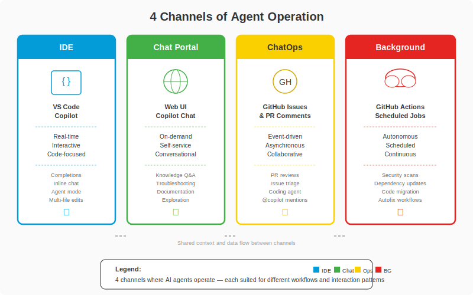

## Change Log

| Version | Date | Author | Changes |
|---------|------|--------|---------|
| 1.0.0 | 2026-03-18 | Paula Silva | Initial version — Super Mario Bros Edition |

# Level 7-5 — The 4 Worlds of Agents: Communication and Operation Channels
## Where Agents Live, Work, and Communicate

---

**Prepared for:** Sofia
**Version:** 2.0 — Mushroom Kingdom Edition
**Author:** Paula Silva | Microsoft Latam Software GBB
**Date:** March 2026
**Language:** English
**Collection:** Agentic DevOps — Super Mario Bros Edition

---

## TABLE OF CONTENTS

1. [Introduction — The 4 Worlds Where Agents Live](#introduction)
2. [Channel 1 — IDE (Yoshi by Your Side)](#channel-1-ide)
3. [Channel 2 — Chat Portal / IDP (The Central Plaza with NPCs)](#channel-2-portal)
4. [Channel 3 — ChatOps / GitHub (The Parakoopa Mail System)](#channel-3-chatops)
5. [Channel 4 — Background / MCP via Actions (Night Workers)](#channel-4-background)
6. [Complete Comparative Table — The 4 Channels](#comparative-table)
7. [How the 4 Channels Connect](#how-they-connect)
8. [Real Flow: A Task Passing Through All 4 Channels](#real-flow)
9. [Conclusion — The Complete Mushroom Kingdom](#conclusion)

---

## Introduction — The 4 Worlds Where Agents Live

<div align="center">

<br><em>The 4 channels of agent operation</em>
</div>

Sofia had a question that wouldn't leave her head:

> *"I know WHAT AI agents are. I know HOW to build them. But WHERE do they live? Where do they work? How do I talk to them?"*

This question is more important than it seems. An agent that lives inside VS Code behaves completely differently from one that runs in the background on a server. An agent that responds to comments in PRs has totally different characteristics from one accessible via a web portal.

There are **4 Channels** where AI agents operate — 4 distinct worlds, each with its own rules, characteristics, and inhabitants. Understanding these channels is **fundamental** to knowing where to place each agent and how to interact with them.

Let's map them to the Mushroom Kingdom:

```
┌──────────────────────────────────────────────────────────────┐
│              THE 4 AGENT OPERATION CHANNELS                    │
│                                                               │
│  ┌─────────────┐  ┌─────────────┐                            │
│  │  CHANNEL 1  │  │  CHANNEL 2  │                            │
│  │  IDE        │  │  PORTAL     │                            │
│  │             │  │             │                            │
│  │  Yoshi by   │  │  Central    │                            │
│  │  your side  │  │  Plaza      │                            │
│  │  REAL TIME  │  │  ON-DEMAND  │                            │
│  └─────────────┘  └─────────────┘                            │
│                                                               │
│  ┌─────────────┐  ┌─────────────┐                            │
│  │  CHANNEL 3  │  │  CHANNEL 4  │                            │
│  │  CHATOPS    │  │  BACKGROUND │                            │
│  │             │  │             │                            │
│  │  Parakoopa  │  │  Distant    │                            │
│  │  Mail       │  │  Castles    │                            │
│  │  ASYNC      │  │  AUTONOMOUS │                            │
│  └─────────────┘  └─────────────┘                            │
│                                                               │
└──────────────────────────────────────────────────────────────┘
```

Each channel is a different world with different rules. Let's explore each one in depth.

---

## Channel 1 — IDE (Yoshi by Your Side)

### What It Is

Channel 1 is the agent that lives **INSIDE your code editor** — VS Code, JetBrains (IntelliJ, PyCharm, WebStorm), or any IDE that supports AI extensions. This agent is **always present**, seeing what you see, understanding the context of your open file, and responding in real time.

### Mario Analogy: Yoshi Walking by Your Side

In Super Mario World, when Mario rides Yoshi, he gains a companion that's **always there**. Yoshi isn't in a distant castle. Yoshi doesn't arrive by mail. Yoshi is **by your side, every step**, ready to act:

- Mario jumps? Yoshi jumps along.
- Mario finds an enemy? Yoshi can swallow it.
- Mario needs to reach something high? Yoshi extends his tongue.
- Mario needs to fly? Yoshi flaps his wings.

**The IDE agent is the Yoshi.** It's by your side, seeing your code, understanding your context, and ready to help at any moment.

```
┌──────────────────────────────────────────────────────┐
│                    VS CODE (IDE)                      │
│                                                       │
│  ┌─────────────────────────────────────────────┐     │
│  │  file: auth.service.ts                      │     │
│  │                                              │     │
│  │  export class AuthService {                  │     │
│  │    async login(email: string, pass|          │     │
│  │                          ▲                   │     │
│  │                          │                   │     │
│  │              YOSHI COMPLETES:                │     │
│  │              "password: string): Promise<     │     │
│  │               AuthResult>"                   │     │
│  │                                              │     │
│  └─────────────────────────────────────────────┘     │
│                                                       │
│  ┌─────────────────────────────────────────────┐     │
│  │  COPILOT CHAT (Yoshi speaking)              │     │
│  │                                              │     │
│  │  You: "Explain this function"                │     │
│  │  Yoshi: "This function authenticates the..." │     │
│  └─────────────────────────────────────────────┘     │
└──────────────────────────────────────────────────────┘
```

### Examples of Channel 1 Agents

**GitHub Copilot — The Original Yoshi**

The most popular IDE agent. It offers several forms of interaction:

| Mode | What It Does | Yoshi Analogy |
|---|---|---|
| **Completions** | Suggests code while you type | Yoshi guesses where Mario wants to go and prepares the path |
| **Chat** | Converses in natural language about the code | Mario asks Yoshi "what's behind that block?" |
| **Inline Chat** | Edits selected code via text instruction | Mario points at an enemy and Yoshi attacks exactly there |
| **Agent Mode** | Executes complex tasks (creates files, runs tests) | Yoshi builds an entire bridge while Mario waits |

**Custom Agents (.agent.md)**

You can create personalized agents that live in the IDE:

```
.github/agents/
├── react-engineer.agent.md     → Luigi, frontend specialist
├── dba.agent.md                → Toad, database specialist
├── devops-expert.agent.md      → Yoshi, infrastructure specialist
└── qa-engineer.agent.md        → Peach, testing specialist
```

Each `.agent.md` file defines a character with specific powers that Copilot can assume within VS Code.

**Skills (SKILL.md)**

Abilities that the IDE agent can execute — workflows defined step by step:

```
.github/skills/
├── workflow-feature/SKILL.md   → How to create a new feature
├── workflow-bugfix/SKILL.md    → How to fix a bug
└── workflow-deploy/SKILL.md    → How to deploy
```

### Channel 1 Characteristics

| Characteristic | Description | Analogy |
|---|---|---|
| **Real Time** | Responds instantly, while you type | Yoshi reacts at the same moment as Mario |
| **Interactive** | You talk, it responds, you adjust | Constant dialogue between Mario and Yoshi |
| **Context-Aware** | Sees your open files, knows the project, understands the code | Yoshi sees everything Mario sees — same field of vision |
| **Local** | Runs on your computer (with API calls) | Yoshi is physically next to Mario |
| **Personal** | Each developer has their own instance | Each player has their own Yoshi |

### Channel 1 Operations

| Operation | Description | Example |
|---|---|---|
| **Code Completion** | Suggests the next line of code | `if (user.isAdmin)` → suggests `{ return adminDashboard(); }` |
| **Chat** | Answers questions about the code | "What does this function do?" → explains in plain language |
| **Inline Suggestions** | Suggests improvements to selected code | Select function → "This function can be simplified..." |
| **Agent Mode Tasks** | Executes complete tasks with multiple steps | "Create a login component with tests" → creates 5 files |
| **Debug Assistance** | Helps find and fix bugs | "Why does this test fail?" → analyzes and suggests fix |
| **Refactoring** | Restructures code while maintaining behavior | "Extract this logic into a custom hook" → refactors |

### When to Use Channel 1

- You're **writing code** and need immediate help
- You want to **understand** a code snippet you don't know
- You need to **refactor** something quickly
- You want to **create** something new with step-by-step guidance
- You're **debugging** and need a second pair of eyes

---

## Channel 2 — Chat Portal / IDP (The Central Plaza with NPCs)

### What It Is

Channel 2 is the agent accessible via **web portal** — a browser interface where developers (and non-developers) can interact with AI agents. It can be an Internal Developer Portal (IDP) like Backstage, a company's custom portal, or interfaces like GitHub.com and Azure DevOps.

### Mario Analogy: The Central Plaza with NPC Stalls

In many Mario games (especially Mario RPG and Paper Mario), there's a **Central Plaza** in town. In this plaza, there are various NPC (non-playable character) stalls offering services:

- **Information Stall:** NPC that answers any question about the kingdom
- **Map Stall:** NPC that shows where everything is
- **Equipment Stall:** NPC that provides items and tools
- **Quest Stall:** NPC that distributes tasks and quests

You **walk to the stall**, ask your question or make your request, and the NPC responds. It's **self-service** — you go when you need to, choose which stall to visit, and interact at your own pace.

```
┌──────────────────────────────────────────────────────────┐
│                    CENTRAL PLAZA (PORTAL)                   │
│                                                           │
│   ┌──────────┐  ┌──────────┐  ┌──────────┐              │
│   │  STALL   │  │  STALL   │  │  STALL   │              │
│   │   OF     │  │   OF     │  │   OF     │              │
│   │ CATALOG  │  │TEMPLATES │  │   DOCS   │              │
│   │          │  │          │  │          │              │
│   │ "What    │  │ "Create  │  │ "How do  │              │
│   │ services │  │ a new    │  │ I config │              │
│   │ exist?"  │  │ service" │  │ OAuth?"  │              │
│   └──────────┘  └──────────┘  └──────────┘              │
│                                                           │
│   ┌──────────┐  ┌──────────┐                             │
│   │  STALL   │  │  STALL   │                             │
│   │   OF     │  │   OF     │                             │
│   │ STATUS   │  │ONBOARDING│                             │
│   │          │  │          │                             │
│   │ "What's  │  │ "I'm new │                             │
│   │ the      │  │  here.   │                             │
│   │ deploy   │  │ Help me" │                             │
│   │ status?" │  │          │                             │
│   └──────────┘  └──────────┘                             │
│                                                           │
│   Sofia walks to the stall she needs and asks...          │
└──────────────────────────────────────────────────────────┘
```

### Examples of Channel 2 Agents

**Developer Portal (IDP) with AI Assistant**

A centralized web portal where the team finds everything:
- Service catalog (which microservices exist, who maintains them)
- Templates for creating new projects
- Centralized documentation
- Deploy and pipeline status
- An **integrated AI assistant** that answers questions

**Copilot on GitHub.com**

GitHub Copilot accessible via browser on github.com:
- Chat in the repository
- Code explanation through the browser
- Suggestions in Pull Requests
- Intelligent search in issues and discussions

**Custom Company Portals**

Many companies create internal portals with AI agents:
- HR portal with chatbot for benefits questions
- IT portal with agent for troubleshooting
- Engineering portal with agent for standards and best practices

### Channel 2 Characteristics

| Characteristic | Description | Analogy |
|---|---|---|
| **On-Demand** | You access when you need, not always visible | You go to the Plaza when you want, you don't live there |
| **Request/Response** | You ask, get an answer, done | Talk to the NPC, get the info, continue on your way |
| **Broad Context** | Accesses information from the entire organization | NPC knows the ENTIRE kingdom, not just your level |
| **Team-Wide** | Everyone on the team accesses the same portal | All players go to the same Plaza |
| **Self-Service** | No need to ask someone or wait for another team | No invitation needed — the Plaza is public |
| **Integrated with Catalogs** | Connected to service catalogs, APIs, docs | Stalls connected to the complete kingdom map |

### Channel 2 Operations

| Operation | Description | Example |
|---|---|---|
| **Onboarding** | Help new team members | "I'm new to the team. How do I set up the environment?" |
| **Doc Lookup** | Search documentation | "What's the company's authentication standard?" |
| **Template Generation** | Create new projects from templates | "Create a new Node.js microservice with PostgreSQL" |
| **Status Check** | Check deploy, pipeline, service status | "What's the deploy status of the payments service?" |
| **Catalog Search** | Search services, APIs, libraries | "Which services use PostgreSQL?" |
| **Knowledge Base** | Answer technical questions | "How does the circuit breaker work in our gateway?" |

### When to Use Channel 2

- You need information that **goes beyond your code** (organization, team, infrastructure)
- You're doing **onboarding** on a new team or project
- You want to **create something new** using standardized templates
- You need to know **who's responsible** for a certain service
- You want a **panoramic view** of the system state

---

## Channel 3 — ChatOps / GitHub (The Parakoopa Mail System)

### What It Is

Channel 3 consists of agents that operate **within GitHub** (or GitLab, Azure DevOps) — responding to events like Pull Request creation, issue comments, code reviews, and other repository interactions. The agent isn't in your IDE and isn't in a portal. It's **in the Git workflow**, reacting to events.

### Mario Analogy: The Parakoopa Mail System

In the Mushroom Kingdom, **Parakoopas** (Koopas with wings) function as a **mail system**. They carry letters (messages) between castles and worlds:

1. You **write a letter** (create an issue or open a PR)
2. The **Parakoopa picks up the letter** (webhook detects the event)
3. The **Parakoopa delivers to the right castle** (agent receives the message)
4. The **castle processes** (agent analyzes and responds)
5. The **Parakoopa brings the reply** (comment appears on the PR/issue)

You don't need to go to the castle. You don't need to be online. You write the letter, and the mail system handles the rest. When the reply arrives, it'll be there waiting for you.

```
┌──────────────────────────────────────────────────────────┐
│                PARAKOOPA MAIL SYSTEM                       │
│                      (CHATOPS)                            │
│                                                           │
│  Developer                       Agent                    │
│  ┌──────────┐                     ┌──────────┐           │
│  │          │  ── Creates PR ───► │          │           │
│  │  Sofia   │                     │  Copilot │           │
│  │          │  ◄── Review ─────── │  Review  │           │
│  │          │                     │  Bot     │           │
│  │          │  ── Comments ─────► │          │           │
│  │          │                     │          │           │
│  │          │  ◄── Responds ───── │          │           │
│  └──────────┘                     └──────────┘           │
│                                                           │
│  Everything happens ON GITHUB, ASYNCHRONOUSLY             │
│  Sofia doesn't need to be online when the agent responds  │
└──────────────────────────────────────────────────────────┘
```

### Examples of Channel 3 Agents

**Copilot Code Review**

When you open a Pull Request, Copilot can:
- Analyze the code automatically
- Leave comments with improvement suggestions
- Identify potential bugs
- Suggest missing tests
- Point out pattern violations

**Issue Triage Bots**

When an issue is created, an agent can:
- Automatically classify (bug, feature, question)
- Add correct labels
- Assign to the responsible team
- Request missing information
- Suggest related or duplicate issues

**PR Comment Bots**

Agents that react to comments:
- `@copilot explain` → Explains what the PR does
- `@copilot suggest tests` → Suggests tests for the changed code
- `@copilot fix` → Tries to fix issues pointed out in the review
- `@copilot docs` → Generates documentation for the changes

**Dependabot and Security Bots**

Agents that monitor dependencies:
- Detect vulnerabilities in packages
- Automatically open PRs with updates
- Notify about breaking changes

### Channel 3 Characteristics

| Characteristic | Description | Analogy |
|---|---|---|
| **Asynchronous** | You act now, response arrives later | Send letter, response arrives tomorrow |
| **Event-Driven** | Agent reacts to events (PR opened, issue created) | Parakoopa flies when it detects a new letter |
| **Collaborative** | Multiple people see and interact | Letters stay on the bulletin board — everyone reads |
| **Auditable** | Everything is recorded in GitHub history | Correspondence archive — nothing is lost |
| **Contextual** | Agent sees the diff, the issue, the history | Parakoopa carries the complete context along with the letter |
| **Non-Blocking** | You continue working while waiting for a response | You don't wait for the Parakoopa to return |

### Channel 3 Operations

| Operation | Trigger (Event) | What the Agent Does |
|---|---|---|
| **PR Review** | PR opened or updated | Analyzes diff, comments suggestions, points out bugs |
| **Issue Triage** | Issue created | Classifies, labels, assigns, requests more info |
| **Auto-Response** | Comment with @mention | Answers questions, executes commands |
| **Code Suggestions** | Review requested | Suggests inline improvements in the diff |
| **Security Scan** | New code pushed | Checks vulnerabilities, dependencies |
| **Changelog** | PR merged | Generates changelog entry automatically |
| **Release Notes** | Tag/release created | Compiles release notes from PRs |

### When to Use Channel 3

- You want **automated code review** on every PR
- You want **automatic triage** of issues
- You need **asynchronous feedback** on code
- You want **auditability** (everything recorded in Git)
- You work with **distributed teams** across different time zones

---

## Channel 4 — Background / MCP via Actions (Night Workers)

### What It Is

Channel 4 consists of agents that run **in the background**, in the cloud, without direct human interaction. They are triggered by **events** (code push, PR merge, schedule) or by **scheduling** (every day at 3 AM, every Monday). They execute tasks autonomously and report results when finished.

### Mario Analogy: NPCs Working in Distant Castles

In the Mushroom Kingdom, while Mario sleeps, there are **NPCs working in distant castles**:

- **Miner Toads** extracting coins in the mines during the night
- **Builder Toads** building bridges and roads
- **Alchemist Toads** preparing potions and power-ups
- **Guardian Toads** patrolling the kingdom's borders

Mario **doesn't need to be present**. He doesn't need to give orders in real time. He sleeps, and when he wakes up:

> *"Good morning, Mario! While you slept: we built 3 bridges, mined 500 coins, and discovered a new secret route!"*

That's EXACTLY how background agents work.

```
┌──────────────────────────────────────────────────────────┐
│            DISTANT CASTLES (BACKGROUND)                    │
│                                                           │
│  ┌──────────┐  ┌──────────┐  ┌──────────┐               │
│  │ CASTLE   │  │ CASTLE   │  │ CASTLE   │               │
│  │    1     │  │    2     │  │    3     │               │
│  │          │  │          │  │          │               │
│  │ Coding   │  │ Security │  │ Deploy   │               │
│  │ Agent    │  │ Scanner  │  │ Pipeline │               │
│  │          │  │          │  │          │               │
│  │ Writes   │  │ Checks   │  │ Publishes│               │
│  │ code     │  │ vulns    │  │ version  │               │
│  │ alone    │  │ daily    │  │ auto     │               │
│  └──────────┘  └──────────┘  └──────────┘               │
│                                                           │
│     zzz...   Sofia sleeps while they work          zzz... │
│                                                           │
│  Next morning:                                            │
│  "3 tasks completed, 0 vulnerabilities, deploy OK!"       │
└──────────────────────────────────────────────────────────┘
```

### Examples of Channel 4 Agents

**GitHub Copilot Coding Agent**

The most impressive Channel 4 agent. When activated:
1. Receives a GitHub issue
2. Creates a branch automatically
3. Writes code to solve the issue
4. Runs tests
5. Opens a Pull Request
6. Waits for human review

**All of this without any human interaction.** Sofia assigns the issue, goes to sleep, and wakes up with a PR ready for review.

```
┌──────────────────────────────────────────────────────────┐
│            GITHUB COPILOT CODING AGENT                    │
│                                                           │
│  Issue #42: "Add email validation to signup"              │
│       │                                                   │
│       ▼ (Sofia assigns to Copilot and goes to sleep)      │
│                                                           │
│  ┌──────────┐                                            │
│  │ CODING   │  1. Reads the issue                        │
│  │ AGENT    │  2. Creates branch feature/email-validation│
│  │          │  3. Writes validation code                  │
│  │  (runs   │  4. Writes unit tests                      │
│  │   in     │  5. Runs npm test — all pass               │
│  │  cloud)  │  6. Opens PR #43 with detailed description │
│  └──────────┘                                            │
│       │                                                   │
│       ▼ (Next morning)                                    │
│                                                           │
│  Sofia: "Wow, PR ready! I just need to review and approve."│
└──────────────────────────────────────────────────────────┘
```

**Scheduled Security Scans**

Agents that run periodically checking vulnerabilities:
- Daily dependency scan (Dependabot, Snyk)
- Weekly static code analysis (CodeQL)
- Monthly compliance check
- Permission and access auditing

**Automated Deploy**

Pipeline that detects merge to main branch and deploys:
- Automatic build
- Integration tests
- Deploy to staging
- Smoke tests
- Deploy to production (if everything green)
- Slack notification

**MCP-Connected Agents in GitHub Actions**

Agents in Actions that use MCP (Model Context Protocol) to access external tools:
- Agent that reads Datadog metrics and generates reports
- Agent that queries Jira and updates issues
- Agent that checks Kubernetes status and scales resources
- Agent that analyzes logs and creates alerts

### Channel 4 Characteristics

| Characteristic | Description | Analogy |
|---|---|---|
| **Autonomous** | Runs without human interaction | NPCs work alone in the castles |
| **Scheduled or Event-Triggered** | Activated by time or event | "Every day at 3 AM" or "when someone merges" |
| **No Direct Interaction** | No dialogue — agent executes and reports | You don't chat with the miners — they work and report |
| **Scalable** | Can run multiple instances in parallel | Dozens of Toads working at the same time |
| **Reportable** | Generates reports, PRs, notifications | "Morning report: 500 coins mined, 0 problems" |
| **Resource-Costly** | Consumes cloud resources (compute, tokens) | Maintaining distant castles has a cost |

### Channel 4 Operations

| Operation | Trigger | What the Agent Does |
|---|---|---|
| **Coding Agent** | Issue assigned to agent | Writes code, creates PR |
| **Security Scan** | Schedule (daily) | Checks vulnerabilities, generates report |
| **Auto Deploy** | Merge to main | Automatic build, test, deploy |
| **Batch Processing** | Schedule (weekly) | Processes data, generates reports |
| **Dependency Update** | New version detected | Opens PR with update |
| **Performance Report** | Schedule (monthly) | Analyzes metrics, generates insights |
| **Infrastructure Scaling** | CPU/memory threshold | Scales resources automatically |
| **Log Analysis** | Anomalous error volume | Analyzes logs, creates alert, suggests fix |

### When to Use Channel 4

- Tasks that **don't need human interaction** during execution
- Processes that should run at **specific times** (off business hours)
- **Long-running** tasks that would block the developer if synchronous
- Operations that benefit from **parallelism** (running across many repos at once)
- Automations that should happen **always** (not depend on someone remembering to execute)

---

## Complete Comparative Table — The 4 Channels

This is the most important table in this chapter. Print it, stick it on the wall, always refer to it:

| Aspect | Channel 1: IDE | Channel 2: Chat Portal | Channel 3: ChatOps | Channel 4: Background |
|---|---|---|---|---|
| **Where** | VS Code, JetBrains | Web Portal (Backstage, GitHub.com) | GitHub PRs/Issues | Cloud (GitHub Actions, Azure) |
| **When** | Real time, while you type | On-demand, when you access | Event-driven (PR, issue, comment) | Scheduled or event-triggered |
| **Interaction** | Interactive, constant dialogue | Request/Response (question → answer) | Asynchronous (act now, respond later) | None (autonomous) |
| **Who Initiates** | Developer (typing, asking) | Developer (accessing portal) | Event (PR opened, issue created) | Schedule or event (merge, cron) |
| **Latency** | Milliseconds to seconds | Seconds to minutes | Minutes to hours | Minutes to hours |
| **Context** | Open file, local project | Entire organization, catalogs | PR diff, issue history | Complete repository, external data |
| **Visibility** | Only the developer sees | Entire team on the portal | Everyone on the PR/issue | Logs and reports |
| **Persistence** | Current session (can save) | History on the portal | Permanent on GitHub | Logs and artifacts |
| **Main Example** | Copilot Chat in VS Code | Backstage with AI Assistant | Copilot PR Review | Copilot Coding Agent |
| **Complexity** | Low | Medium | Medium | High |
| **Cost** | Copilot license | Portal infra + AI | Actions infra + AI | Cloud compute + AI tokens |
| **Mario Analogy** | Yoshi by your side | Central Plaza with NPCs | Parakoopa Mail | Distant castles working at night |
| **Key Phrase** | *"Help me NOW"* | *"I need information"* | *"Review this for me"* | *"Do this while I sleep"* |

### Visual Summary

```
┌────────────────────────────────────────────────────────────────┐
│                                                                 │
│  CHANNEL 1: IDE         "Yoshi, help me with this line!"        │
│  ► REAL TIME            ► You + Agent, side by side             │
│                                                                 │
│  CHANNEL 2: PORTAL      "Hello NPC, where is service X?"        │
│  ► ON-DEMAND            ► You go there when you need            │
│                                                                 │
│  CHANNEL 3: CHATOPS     "Parakoopa, deliver this review for me" │
│  ► ASYNC                ► Send and keep working                  │
│                                                                 │
│  CHANNEL 4: BACKGROUND  "Toads, solve this while I sleep"       │
│  ► AUTONOMOUS           ► You're not even present                │
│                                                                 │
└────────────────────────────────────────────────────────────────┘
```

---

## How the 4 Channels Connect

The 4 channels are not isolated islands. They form an **integrated ecosystem** where a task can flow from one channel to another. Here's how they connect:

### Connection 1: IDE → ChatOps

You're in Channel 1 (IDE) writing code. You finish the feature and open a PR. Automatically, Channel 3 (ChatOps) kicks in: the Copilot Review Bot analyzes your PR and leaves comments.

```
Channel 1 (IDE)                  Channel 3 (ChatOps)
┌──────────┐  ── git push ──►  ┌──────────┐
│ Write    │  ── open PR ───►  │ Review   │
│ code     │                    │ Bot      │
│ with     │  ◄── comments ──  │ analyzes │
│ Copilot  │                    │ the PR   │
└──────────┘                    └──────────┘
```

### Connection 2: ChatOps → Background

The review bot (Channel 3) approves the PR. The merge happens and triggers the deploy pipeline (Channel 4), which runs in the background.

```
Channel 3 (ChatOps)             Channel 4 (Background)
┌──────────┐  ── PR merged ──► ┌──────────┐
│ Review   │                    │ Deploy   │
│ approved │                    │ Pipeline │
│ PR merge │                    │ runs     │
└──────────┘                    └──────────┘
```

### Connection 3: Background → Portal

The deploy (Channel 4) finishes and updates the status on the portal (Channel 2). Anyone on the team can access the portal and see the status.

```
Channel 4 (Background)          Channel 2 (Portal)
┌──────────┐  ── status ──────► ┌──────────┐
│ Deploy   │  ── metrics ────►  │ Dashboard│
│ completed│                    │ updated  │
└──────────┘                    └──────────┘
```

### Connection 4: Portal → IDE

A new team member accesses the portal (Channel 2), finds a template, and uses it to create a new project in the IDE (Channel 1).

```
Channel 2 (Portal)              Channel 1 (IDE)
┌──────────┐  ── template ───► ┌──────────┐
│ Choose   │  ── scaffold ──►  │ Project  │
│ template │                    │ created  │
│ on portal│                    │ in VS    │
└──────────┘                    └──────────┘
```

### The Complete Cycle

```
┌────────────────────────────────────────────────────────────┐
│                    4 CHANNEL CYCLE                           │
│                                                             │
│   ┌──────────┐        ┌──────────┐                         │
│   │ CHANNEL 1│──push──►│ CHANNEL 3│                         │
│   │ IDE      │◄─fix───│ ChatOps  │                         │
│   │          │        │          │                         │
│   └────▲─────┘        └────┬─────┘                         │
│        │                   │ merge                          │
│   template                 │                               │
│        │                   ▼                                │
│   ┌────┴─────┐        ┌──────────┐                         │
│   │ CHANNEL 2│◄─status─│ CHANNEL 4│                         │
│   │ Portal   │        │Background│                         │
│   └──────────┘        └──────────┘                         │
│                                                             │
│   The 4 channels form a CONTINUOUS development CYCLE        │
└────────────────────────────────────────────────────────────┘
```

---

## Real Flow: A Task Passing Through All 4 Channels

Let's follow a real task passing through all 4 channels. Sofia received the task: **"Add email validation to the signup form."**

### Step 1 — Channel 2 (Portal): Discovery

Sofia accesses the developer portal and asks the AI assistant:

> **Sofia:** "Where is the signup form in our project?"
>
> **Portal AI:** "The signup form is in `frontend/src/pages/Signup.tsx`. The authentication service is in `backend/src/services/auth.service.ts`. The responsible team is Team Alpha."

Sofia now knows where to go. The portal provided the broad organizational context.

### Step 2 — Channel 1 (IDE): Development

Sofia opens VS Code, navigates to the file, and starts coding with Copilot:

> **Sofia:** *types* `function validateEmail(`
>
> **Copilot (Yoshi):** *suggests* `email: string): boolean { const regex = /^[^\s@]+@[^\s@]+\.[^\s@]+$/; return regex.test(email); }`
>
> **Sofia:** "Copilot, create tests for this function"
>
> **Copilot (Yoshi):** *creates* `validateEmail.test.ts` with 8 test cases

Sofia finishes development with Yoshi's help. Code written, tests passing.

### Step 3 — Channel 3 (ChatOps): Review

Sofia pushes and opens a PR. Channel 3 kicks in automatically:

> **Copilot Review Bot:** "I analyzed PR #47. Found 2 suggestions:
> 1. The regex doesn't validate domains with single-character TLDs. Consider using a library like `validator.js`.
> 2. Missing tests for emails with unicode characters.
> Approved with suggestions."

> **Colleague (Carlos):** "I agree with suggestion 1. Let's use `validator.js`."

Sofia goes back to Channel 1 (IDE), makes the corrections, and updates the PR.

### Step 4 — Channel 4 (Background): Deploy

The PR is approved and merged. Channel 4 kicks in:

1. **GitHub Actions** detects the merge to main
2. **CI Pipeline** runs: build, tests, lint — all green
3. **Auto deploy to staging**
4. **Smoke tests** pass
5. **Auto deploy to production**
6. **Notification** on Slack: "Deploy v1.23.0 completed successfully"

Sofia didn't even need to press a button. Everything happened in the background.

### Step 5 — Channel 2 (Portal): Verification

Sofia accesses the portal and checks:

> **Dashboard:** Deploy v1.23.0 — Status: OK — Health: 100% — Errors: 0

The cycle is complete. One task, 4 channels, each doing its part.

```
┌────────────────────────────────────────────────────────────┐
│              REAL FLOW: EMAIL VALIDATION                     │
│                                                             │
│  Portal ──► "Signup.tsx in frontend, team Alpha"            │
│    │                                                        │
│    ▼                                                        │
│  IDE ──► Writes code + tests with Copilot                   │
│    │                                                        │
│    ▼                                                        │
│  ChatOps ──► Automatic review + human review                │
│    │                                                        │
│    ▼                                                        │
│  Background ──► CI/CD, deploy, notification                 │
│    │                                                        │
│    ▼                                                        │
│  Portal ──► Check status: all green!                        │
│                                                             │
│  TOTAL TIME: 4 hours (2h being development)                 │
└────────────────────────────────────────────────────────────┘
```

---

## Conclusion — The Complete Mushroom Kingdom

Sofia now understands that AI agents don't live in just one place. They're **spread across the entire Mushroom Kingdom**, each in its ideal world:

| Channel | Mario World | Summary Phrase |
|---|---|---|
| **Channel 1: IDE** | Yoshi by Mario's side | *"I'm here, whenever you need"* |
| **Channel 2: Portal** | Central Plaza with NPCs | *"Come to me when you want information"* |
| **Channel 3: ChatOps** | Parakoopa Mail System | *"Send your letter, I'll handle the rest"* |
| **Channel 4: Background** | Distant castles with worker NPCs | *"You can sleep, I work at night"* |

Real power appears when the 4 channels work **together**. No single channel is enough. But the 4 connected create an ecosystem where:

- You **discover** information on the portal (Channel 2)
- You **develop** with assistance in the IDE (Channel 1)
- You **collaborate** via PRs and issues (Channel 3)
- You **automate** everything in the background (Channel 4)

It's the **complete Mushroom Kingdom** — all worlds connected, all characters working in harmony, all channels flowing naturally from one to another.

---

| Previous: Level 7-4 — Microsoft Agentic Framework | Next: Level 7-6 — IDP and Backstage |
|---|---|

---

**Skill Unlocked!**
Sofia now knows the 4 Operation Channels of AI Agents.
She knows where each agent lives, how to talk to them, and how the channels connect!

**POWER-UP UNLOCKED: You now understand the 4 worlds where AI agents operate — IDE, Portal, ChatOps and Background!**

**Sources:**
- GitHub Copilot — https://docs.github.com/en/copilot
- GitHub Copilot Coding Agent — https://docs.github.com/en/copilot/using-github-copilot/using-copilot-coding-agent
- Backstage by Spotify — https://backstage.io/docs
- GitHub Actions — https://docs.github.com/en/actions

---

## References

- GitHub Copilot — https://docs.github.com/en/copilot
- Backstage by Spotify — https://backstage.io

---

<div align="center">

⬅️ [Previous: Level 7-4: Microsoft Agentic Framework](7-4-microsoft-agentic-framework.md) · 🗺️ [World Map](../INDEX.md) · ➡️ [Next: Level 7-6: IDP Backstage](7-6-idp-backstage.md)

</div>
