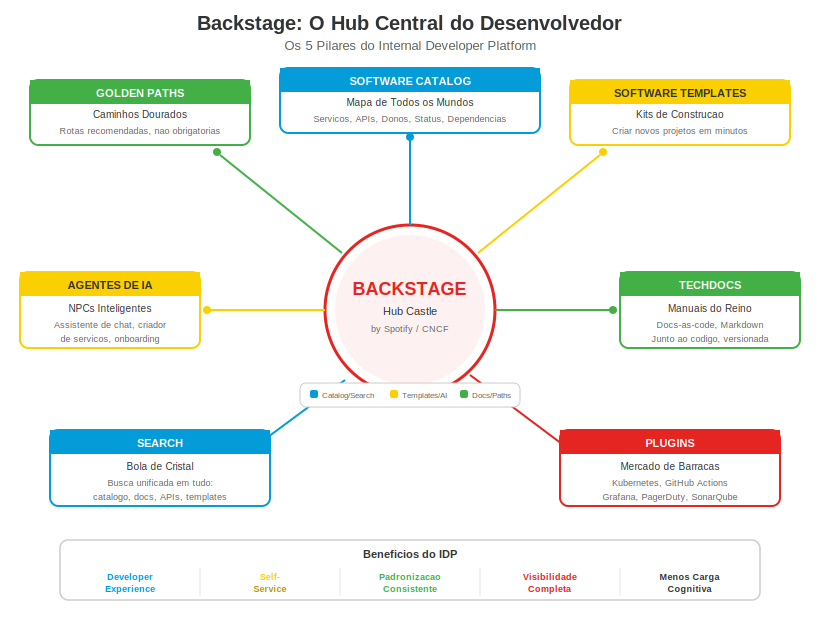

## Change Log

| Version | Date | Author | Changes |
|---------|------|--------|---------|
| 1.0.0 | 2026-03-18 | Paula Silva | Initial version — Super Mario Bros Edition |

# Level 7-6 — The Central Plaza: IDP and Backstage
## The Hub That Connects Everything in the Mushroom Kingdom

---

**Prepared for:** Sofia
**Version:** 2.0 — Mushroom Kingdom Edition
**Author:** Paula Silva | Software Global Black Belt, Microsoft Americas
**Date:** March 2026
**Language:** English
**Collection:** Agentic DevOps — Super Mario Bros Edition

---

## TABLE OF CONTENTS

1. [Introduction — The Central Castle](#introduction)
2. [What Is an IDP (Internal Developer Platform)](#what-is-idp)
3. [Why IDPs Matter — The Pain Without Them](#why-they-matter)
4. [Backstage by Spotify — The Most Popular IDP](#backstage)
5. [The 5 Pillars of Backstage](#5-pillars)
6. [How AI Agents Fit into the IDP](#agents-in-idp)
7. [Golden Paths — The Optimal Route Through the Kingdom](#golden-paths)
8. [Table: Traditional Development vs IDP](#comparative-table)
9. [Building Your IDP — First Steps](#first-steps)
10. [Conclusion — The Castle That Unites All Worlds](#conclusion)

---

## Introduction — The Central Castle

Sofia had been playing for a long time. She knew World 1 (Features), World 2 (Bugfix), World 3 (Deploy), World 4 (Code Review). She knew the characters, the power-ups, the warp pipes. But she had a growing problem:

> *"I know there's an authentication service... but where is the repository? Who maintains it? What's the API? Where's the documentation? Which deploy pipeline does it use? Which database does it connect to?"*

To answer these questions, Sofia needed to:
1. Open GitHub and search for repositories
2. Open Slack and ask someone
3. Open the wiki and search for documentation (which might be outdated)
4. Open Azure and look for resources
5. Open Jira and see who's responsible

**5 different tools to answer 1 question.** And Sofia needed to do this multiple times a day.

Now imagine if there was a **single place** — a central castle — where Sofia could find EVERYTHING:

```
┌──────────────────────────────────────────────────────────┐
│              CENTRAL CASTLE (IDP)                          │
│                                                           │
│  ┌────┐ ┌────┐ ┌────┐ ┌────┐ ┌────┐ ┌────┐             │
│  │ 🚪 │ │ 🚪 │ │ 🚪 │ │ 🚪 │ │ 🚪 │ │ 🚪 │             │
│  │    │ │    │ │    │ │    │ │    │ │    │             │
│  │Cat-│ │Tem-│ │Doc-│ │Sta-│ │API-│ │On- │             │
│  │alo-│ │pla-│ │umen│ │tus │ │ s  │ │boar│             │
│  │g   │ │tes │ │ ts │ │    │ │    │ │ding│             │
│  └────┘ └────┘ └────┘ └────┘ └────┘ └────┘             │
│                                                           │
│  Sofia enters the castle and has DOORS to all worlds      │
│  No need to run through the entire kingdom searching      │
└──────────────────────────────────────────────────────────┘
```

Welcome to the concept of **IDP — Internal Developer Platform**.

---

## 1. What Is an IDP (Internal Developer Platform)

### Definition

An **Internal Developer Platform (IDP)** is a **self-service** platform that gives developers everything they need in **a single place**:

- Catalog of all services and their owners
- Templates for creating new projects
- Centralized documentation
- Pipeline and deploy status
- Available APIs and how to use them
- Tools and integrations

### Mario Analogy: The Hub Castle from Super Mario 64

Remember **Super Mario 64**? The game started in a **central castle** — Princess Peach's Castle. Inside the castle, there were **doors** leading to different worlds:

- Door 1 → Bob-omb Battlefield (World 1)
- Door 2 → Whomp's Fortress (World 2)
- Door 3 → Jolly Roger Bay (World 3)
- Secret door → Access to the basement (hidden worlds)

You didn't need to traverse the entire kingdom to reach each world. You went to the **central castle**, found the right door, and entered. Simple, fast, organized.

**An IDP is the Hub Castle of your development ecosystem.** A central castle with doors to all worlds:

| Castle Door | What's Behind | IDP Equivalent |
|---|---|---|
| Catalog Door | Map of all worlds and their guardians | Software Catalog — list of all services |
| Templates Door | Level construction kits | Software Templates — create new projects |
| Library Door | Manuals and kingdom guides | TechDocs — centralized documentation |
| Market Door | Merchant stalls | Plugins — feature marketplace |
| Search Door | Crystal ball that finds anything | Search — universal search |

### Without IDP vs With IDP

**Without IDP — Mario lost in the Mushroom Kingdom:**

```
Mario needs to find World 5.
1. Runs north... it's not here.
2. Asks a Toad... "I don't know, ask the other Toad."
3. Runs south... finds a pipe, but goes to the wrong place.
4. Goes back, asks another Toad... "I think it's in that direction."
5. Finally finds it... but lost 2 hours.
```

**With IDP — Mario in the Hub Castle:**

```
Mario enters the central castle.
1. Looks at the map on the wall: "World 5 = second floor door."
2. Climbs the stairs.
3. Goes through the door.
4. Arrived. 30 seconds.
```

The difference is **brutal**. And it's exactly what happens when a development team has (or doesn't have) an IDP.

---

## 2. Why IDPs Matter — The Pain Without Them

### The Problem: Cognitive Load

**Cognitive load** is the amount of information you need to keep in your head to do your job. Without an IDP, a developer's cognitive load is enormous:

| Task | Without IDP | With IDP |
|---|---|---|
| "Where is service X?" | Search GitHub, Slack, wiki, ask around | Open catalog, search, found |
| "Who maintains service Y?" | Ask on Slack, wait for response | See in catalog — owner listed |
| "How do I create a new microservice?" | Copy an existing one, adapt, hope you don't forget anything | Choose template, fill form, done |
| "What's the deploy status?" | Open GitHub Actions, find the repo, find the workflow | See on dashboard — real-time status |
| "Where's the API documentation?" | Wiki? README? Swagger? Confluence? Notion? | TechDocs — everything in one place |
| "I'm joining the team — where do I start?" | Ask 5 people, collect links | Onboarding page on the portal |

**Mario Analogy:** Without an IDP it's like playing Mario without the map. You don't know how many worlds exist, you don't know what each contains, you don't know which ones you've completed. With an IDP, you have the complete map — clear, organized, always updated.

### The Benefits of an IDP

**1. Developer Experience (DevEx)**

Happy developers are productive developers. An IDP reduces friction:
- Less time searching for things → more time creating things
- Fewer repetitive questions on Slack → more autonomy
- Less "how do I do this?" → more "already done, next!"

**2. Self-Service**

Developers don't need to ask permission or wait for another team:
- Want to create a new service? Use the template.
- Want to know the deploy status? Check the dashboard.
- Want to find documentation? Search the portal.

**3. Golden Paths**

The IDP defines **recommended paths** — the "right" way to do things:
- *"To create a microservice, use THIS template"*
- *"To deploy, follow THIS pipeline"*
- *"To connect to the database, use THIS library"*

You can leave the golden path if you want (freedom), but the recommended path is always visible and accessible (guidance).

**4. Standardization**

When everyone uses the same templates and follows the same paths:
- Services look similar → easy to maintain
- Onboarding is fast → new member understands quickly
- Security is consistent → same standards everywhere

**5. Visibility**

Technical leadership has complete visibility:
- How many services exist?
- Which ones are up to date?
- Which ones have vulnerabilities?
- Which teams have more services?

---

## 3. Backstage by Spotify — The Most Popular IDP

<div align="center">

<br/><em>Backstage hub architecture</em>
</div>

### The History

In 2020, **Spotify** open-sourced their internal IDP: **Backstage**. They had more than 2000 microservices and needed a way to organize everything. The solution was to build a centralized portal where any developer could find any service, create new projects, and access documentation — all in a single place.

Backstage became the **most popular IDP framework in the world**, maintained by the Cloud Native Computing Foundation (CNCF) and used by hundreds of companies like Spotify, Netflix, American Airlines, HP, and many others.

### Mario Analogy: The Most Famous Castle in the Mushroom Kingdom

If the IDP concept is a Hub Castle, Backstage is the **most famous and most used castle** in the entire Mushroom Kingdom. Originally built by Spotify (one of the most advanced kingdoms), Backstage was opened so that **any kingdom** could build its own central castle using the same architectural blueprint.

```
┌──────────────────────────────────────────────────────────┐
│                    BACKSTAGE                               │
│          The Open-Source Central Castle                     │
│                                                           │
│  ┌──────────────────────────────────────────────────┐    │
│  │                MAIN HALL                           │    │
│  │                                                   │    │
│  │  ┌────────┐  ┌────────┐  ┌────────┐             │    │
│  │  │SOFTWARE│  │SOFTWARE│  │  TECH  │             │    │
│  │  │CATALOG │  │TEMPLAT.│  │  DOCS  │             │    │
│  │  │        │  │        │  │        │             │    │
│  │  │ World  │  │ Build  │  │Kingdom │             │    │
│  │  │ Map    │  │ Kits   │  │Manuals │             │    │
│  │  └────────┘  └────────┘  └────────┘             │    │
│  │                                                   │    │
│  │  ┌────────┐  ┌────────┐                          │    │
│  │  │PLUGINS │  │ SEARCH │                          │    │
│  │  │        │  │        │                          │    │
│  │  │Stall   │  │Crystal │                          │    │
│  │  │Market  │  │ Ball   │                          │    │
│  │  └────────┘  └────────┘                          │    │
│  │                                                   │    │
│  └──────────────────────────────────────────────────┘    │
│                                                           │
│  Built by Spotify. Open-source. CNCF.                     │
│  Used by hundreds of companies worldwide.                  │
└──────────────────────────────────────────────────────────┘
```

---

## 4. The 5 Pillars of Backstage

Backstage is built on **5 fundamental pillars**. Each pillar solves a specific problem and has its own analogy in the Mushroom Kingdom.

### Pillar 1: Software Catalog — The Map of All Worlds

**What it is:** A centralized directory of **all** software components in the organization: services, APIs, libraries, websites, pipelines, databases. Each component has metadata: name, description, owner, repository, status, dependencies.

**Mario Analogy:** The **Map Room** in the castle. A huge room with a giant map on the wall showing:
- All worlds that exist (services)
- Who is the guardian of each world (responsible team)
- Which worlds connect to each other (dependencies)
- Which worlds are in good shape and which need repairs (health status)

```
┌──────────────────────────────────────────────────────────┐
│                 SOFTWARE CATALOG                           │
│              (Castle Map Room)                             │
│                                                           │
│  ┌──────────────────────────────────────────────────┐    │
│  │  SERVICE           OWNER        STATUS  TYPE      │    │
│  │  ─────────────────────────────────────────────── │    │
│  │  auth-service      Team Alpha   OK      Backend  │    │
│  │  user-api          Team Alpha   OK      API      │    │
│  │  payment-service   Team Beta    WARN    Backend  │    │
│  │  frontend-app      Team Gamma   OK      Website  │    │
│  │  notification-svc  Team Beta    OK      Backend  │    │
│  │  shared-lib        Team Alpha   OK      Library  │    │
│  │  deploy-pipeline   Team DevOps  OK      Pipeline │    │
│  │  postgres-main     Team DBA     OK      Database │    │
│  └──────────────────────────────────────────────────┘    │
│                                                           │
│  Each service has: repo, docs, API, pipeline, owner       │
│  Clicking any one opens EVERYTHING about it               │
└──────────────────────────────────────────────────────────┘
```

**How it works in practice:**

Each repository has a `catalog-info.yaml` file at the root:

```yaml
# catalog-info.yaml
# The "sign" at the world entrance that says who lives here

apiVersion: backstage.io/v1alpha1
kind: Component
metadata:
  name: auth-service
  description: OAuth2 authentication service
  annotations:
    github.com/project-slug: my-org/auth-service
spec:
  type: service
  lifecycle: production
  owner: team-alpha
  system: authentication
  dependsOn:
    - component:postgres-main
    - component:shared-lib
  providesApis:
    - auth-api
```

This file tells Backstage: *"This repository contains the auth-service, which is maintained by team-alpha, is in production, depends on postgres-main and shared-lib, and provides the auth-api."*

Backstage reads these files from all repositories and builds the complete catalog automatically.

**Why it's powerful:**
- *"Who maintains the payments service?"* → Team Beta
- *"Which services depend on PostgreSQL?"* → auth-service, payment-service, user-api
- *"Which services are in warning?"* → payment-service (needs attention)

### Pillar 2: Software Templates — Level Construction Kits

**What it is:** Pre-built templates for creating new projects. Instead of copying an existing repository and adapting it (a fragile, error-prone process), you choose a template, fill in some information, and Backstage creates everything automatically: repository, CI/CD pipeline, database, monitoring, initial documentation.

**Mario Analogy:** **Level construction kits** in Mario Maker. Instead of building each block from scratch, you choose:

| Template | What It Creates | Mario Analogy |
|---|---|---|
| **Node.js Microservice** | Repo + CI/CD + Docker + Monitoring | "Ground Level" Kit — terrain, platforms, basic enemies |
| **REST API with Express** | Repo + Swagger + Tests + Deploy | "Underwater Level" Kit — water, fish, currents |
| **React Frontend** | Repo + Vite + Tests + Storybook | "Sky Level" Kit — clouds, floating platforms |
| **Shared Library** | Repo + NPM publish + Tests + Docs | "Castle Level" Kit — walls, lava, Bowser Jr |
| **Serverless Function** | Repo + Azure Function + Trigger + Monitoring | "Secret Level" Kit — short, intense, special reward |

**How it works in practice:**

Sofia wants to create a new microservice. Instead of:
1. Creating a repository manually
2. Copying boilerplate from another project
3. Configuring CI/CD from scratch
4. Creating a Dockerfile
5. Setting up monitoring
6. Writing initial documentation
7. (Probably forgetting something)

She simply:
1. Opens Backstage
2. Clicks "Create"
3. Chooses the "Node.js Microservice" template
4. Fills in: name, description, team
5. Clicks "Create"
6. **DONE.** Everything created automatically.

```
┌──────────────────────────────────────────────────────────┐
│                SOFTWARE TEMPLATES                          │
│              (Construction Kits)                           │
│                                                           │
│  STEP 1: Choose the template                              │
│  ┌──────────┐  ┌──────────┐  ┌──────────┐               │
│  │Node.js   │  │React App │  │Serverless│               │
│  │Microserv.│  │Frontend  │  │Function  │               │
│  │          │  │          │  │          │               │
│  │  [OK]    │  │  [ ]     │  │  [ ]     │               │
│  └──────────┘  └──────────┘  └──────────┘               │
│                                                           │
│  STEP 2: Fill in the information                          │
│  Name: [my-new-service             ]                      │
│  Description: [Notification service  ]                    │
│  Team: [Team Alpha ▼]                                     │
│  Database: [PostgreSQL ▼]                                 │
│                                                           │
│  STEP 3:  [>>> CREATE <<<]                                │
│                                                           │
│  Result: Repo created, CI/CD configured, docs ready       │
│  Time: 30 seconds (instead of 2 hours)                    │
└──────────────────────────────────────────────────────────┘
```

### Pillar 3: TechDocs — The Kingdom Manuals

**What it is:** Documentation that lives **alongside the code** (docs-as-code) and is rendered automatically in Backstage. You write documentation in Markdown in your repository, and Backstage generates a beautiful, navigable site automatically.

**Mario Analogy:** **Instruction manuals posted on the castle walls.** Instead of searching for manuals in different drawers (Wiki, Confluence, Notion, Google Docs, README...), all manuals are on the castle walls — each one in the room corresponding to its service.

**Advantages of docs-as-code:**
- Documentation updated alongside code (same PR)
- Versioned (complete history of changes)
- Reviewed (code review includes documentation)
- Close (no need to leave the workflow to update docs)

```
auth-service repository:
├── src/
│   └── auth.service.ts
├── tests/
│   └── auth.test.ts
├── docs/                    ← Documentation lives HERE
│   ├── index.md             ← Main page
│   ├── architecture.md      ← Service architecture
│   ├── api-reference.md     ← API reference
│   └── troubleshooting.md   ← Common issues
├── mkdocs.yml               ← TechDocs configuration
└── catalog-info.yaml
```

When Sofia accesses auth-service in Backstage, the documentation appears as a tab — beautiful, formatted, always up to date.

### Pillar 4: Plugins — The Stall Market

**What it is:** Backstage has a **plugin ecosystem** that adds functionality to the portal. Each plugin is like a new stall in the Central Plaza — it brings a capability that didn't exist before.

**Mario Analogy:** The **market in the Central Plaza** with merchant stalls. Each stall sells something different, and you set up the plaza according to your kingdom's needs:

| Plugin | What It Adds | Mario Stall |
|---|---|---|
| **Kubernetes** | Pod status, logs, metrics | Cloud Master Stall — shows everything running in the sky |
| **GitHub Actions** | Pipeline status, CI/CD logs | Lakitu Stall — checks from above |
| **PagerDuty** | Alerts and incidents | Alarm Stall — when something goes wrong, the bell rings |
| **Grafana** | Monitoring dashboards | Observatory Stall — charts and metrics |
| **SonarQube** | Code quality | Inspector Stall — quality grade for your castle |
| **Azure DevOps** | Pipelines and boards | Planner Stall — tasks and deploys |
| **Cost Insights** | Infrastructure costs | Treasurer Stall — how much each world costs |
| **API Docs** | API documentation (Swagger) | Cartographer Stall — maps of all routes |

**The ecosystem has hundreds of plugins.** And you can create your own.

### Pillar 5: Search — The Crystal Ball

**What it is:** Unified search that looks through **everything** — catalog, documentation, APIs, templates, plugins. A search bar that finds anything in the entire kingdom.

**Mario Analogy:** A **crystal ball** in the center of the castle. You ask any question and it shows the answer:

- *"Where is the payments service?"* → Catalog: payment-service, Team Beta
- *"How to configure OAuth?"* → TechDocs: auth-service authentication guide
- *"Template for serverless function?"* → Templates: Azure Function Template
- *"Who maintains PostgreSQL?"* → Catalog: Team DBA

```
┌──────────────────────────────────────────────────────────┐
│                      SEARCH                                │
│                 (Crystal Ball)                             │
│                                                           │
│  ┌──────────────────────────────────────────────────┐    │
│  │  Search: [oauth authentication                 ] │    │
│  └──────────────────────────────────────────────────┘    │
│                                                           │
│  Results:                                                 │
│                                                           │
│  CATALOG                                                  │
│  ► auth-service — OAuth2 authentication service           │
│    Team Alpha | Backend | Production                       │
│                                                           │
│  TECHDOCS                                                 │
│  ► OAuth2 Authentication Guide                            │
│    How to configure OAuth in our ecosystem                 │
│                                                           │
│  API                                                      │
│  ► auth-api — POST /auth/login, POST /auth/refresh        │
│    Swagger available                                       │
│                                                           │
│  TEMPLATE                                                 │
│  ► Microservice with Auth — Template with pre-config OAuth │
│                                                           │
└──────────────────────────────────────────────────────────┘
```

---

## 5. How AI Agents Fit into the IDP

This is where things get **really powerful**. The IDP alone is already incredible. But when you add **AI agents** to the IDP, the castle comes alive.

### Agent 1: AI Assistant on the Portal (Channel 2)

A chatbot integrated into Backstage that answers questions in natural language:

> **Sofia:** "Which Team Alpha services use PostgreSQL and are in production?"
>
> **Agent:** "Team Alpha has 3 services in production with PostgreSQL:
> 1. auth-service — authentication
> 2. user-api — user management
> 3. notification-service — notifications
> All use PostgreSQL 15 via shared pool."

Without the agent, Sofia would have to navigate the catalog, filter by team, filter by database, filter by status. With the agent, **one question, one answer**.

### Agent 2: Intelligent Service Creator

An agent that helps create new services, going beyond a simple template:

> **Sofia:** "I need to create a transactional email sending service."
>
> **Agent:** "Based on the organization's standards, I recommend:
> - Template: Node.js Microservice with queue
> - Database: Not needed (stateless service)
> - Queue: Azure Service Bus (team standard)
> - Monitoring: Standard with Application Insights
> - Estimate: 10 minutes to create the structure
> Want me to create it now?"

### Agent 3: Owner and Expert Finder

> **Sofia:** "The payments service is returning 500 errors in production. Who do I call?"
>
> **Agent:** "The payment-service is maintained by Team Beta.
> - Current on-call: Carlos Silva (carlos@company.com)
> - Last deploy: yesterday at 3 PM (PR #234 by Ana Lima)
> - Pipeline status: green
> - Recent logs: show timeout on gateway connection
> Should I open an incident on PagerDuty for Team Beta?"

### Agent 4: Onboarding Assistant

> **New Member:** "I'm new to the team. Where do I start?"
>
> **Agent:** "Welcome to Team Alpha! Here's your onboarding roadmap:
>
> Week 1:
> - [ ] Set up local environment (guide: link)
> - [ ] Clone the 3 main repos (auth, user-api, frontend)
> - [ ] Run docker-compose and verify everything starts
> - [ ] Read the general architecture (TechDocs: link)
>
> Week 2:
> - [ ] Pick a "good first issue" from auth-service
> - [ ] Follow the standard workflow (branch, PR, review)
> - [ ] Do pair programming with your mentor (Maria Santos)
>
> Want me to send this roadmap by email?"

### Agent 5: Catalog Health Monitor

An agent that runs in the background (Channel 4) checking catalog health:

> **Agent Weekly Report:**
>
> "Software Catalog Analysis — Week 12/2026:
> - 47 cataloged services (3 new this week)
> - 2 services without updated documentation (payment-service, legacy-api)
> - 1 service without defined owner (old-notification-svc)
> - 5 services with outdated dependencies
> - Recommendation: Assign owner to old-notification-svc or deprecate"

```
┌──────────────────────────────────────────────────────────┐
│           AI AGENTS IN BACKSTAGE                           │
│                                                           │
│  ┌──────────┐  ┌──────────┐  ┌──────────┐               │
│  │  CHAT    │  │ SERVICE  │  │  OWNER   │               │
│  │ASSISTANT │  │ CREATOR  │  │  FINDER  │               │
│  │          │  │          │  │          │               │
│  │"Where is │  │"Create a │  │"Who      │               │
│  │ X?"      │  │ new svc" │  │ maintains?"│              │
│  └──────────┘  └──────────┘  └──────────┘               │
│                                                           │
│  ┌──────────┐  ┌──────────┐                              │
│  │ONBOARDING│  │  HEALTH  │                              │
│  │          │  │ MONITOR  │                              │
│  │"I'm new  │  │          │                              │
│  │ here"    │  │"Weekly   │                              │
│  │          │  │ report"  │                              │
│  └──────────┘  └──────────┘                              │
│                                                           │
│  Intelligent NPCs working INSIDE the castle               │
└──────────────────────────────────────────────────────────┘
```

---

## 6. Golden Paths — The Optimal Route Through the Kingdom

### What Are Golden Paths

**Golden Paths** are the **recommended paths** for performing common tasks. They're not mandatory — you can leave the golden path if you want. But the golden path is what has been tested, validated, documented, and works for the majority of cases.

### Mario Analogy: The Speedrun Path

In every Mario level, there's an **optimal path** — the path that speedrunners use. It's not the only path. You can explore, take alternate routes, find secrets. But if you want to **reach the end quickly, safely and efficiently**, the speedrun path is the best:

```
┌──────────────────────────────────────────────────────────┐
│                  GOLDEN PATH                               │
│            (Mario Speedrun Path)                           │
│                                                           │
│  START ──► Template ──► Repo ──► CI/CD ──► Deploy ──► END │
│    │         standard   auto.   auto.     auto.       │
│    │         config.    config. config.                │
│    │                                                     │
│    │  Alternative: do everything manually                 │
│    └──► Create repo ──► Config CI ──► Config CD ──►      │
│         manual         manual        manual              │
│         (1 hour)       (2 hours)     (3 hours)           │
│                                                           │
│  GOLDEN PATH: 30 minutes                                  │
│  MANUAL PATH: 6+ hours                                    │
└──────────────────────────────────────────────────────────┘
```

### Golden Path Examples

| Task | Golden Path | Alternative (without IDP) |
|---|---|---|
| Create microservice | Backstage Template → 5 clicks | Copy repo, adapt, configure CI/CD, create docs... |
| Deploy | Merge to main → auto-deploy | SSH into server, manual build, copy files... |
| Add monitoring | Grafana plugin in Backstage | Install agent, configure dashboard, create alerts... |
| Onboarding | Automatic roadmap on portal | Ask 5 people, collect links, figure it out alone... |
| Document API | TechDocs + auto Swagger | Write on wiki, hope someone keeps it updated... |

### Golden Paths Are Not Prisons

A crucial point: **Golden Paths are suggestions, not obligations.** Developers always have the freedom to leave the path if needed. The idea is:

1. **80% of cases** follow the Golden Path — fast, standardized, safe
2. **20% of cases** need a custom path — and that's fine
3. The Golden Path is **visible and accessible** — no one needs to search for it

**Mario Analogy:** The speedrun path is marked on the map, but you're not forced to follow it. Want to explore? Want to grab hidden Star Coins? Want to test an alternate route? Go for it. But when you want the safe and fast path, it's there.

---

## 7. Table: Traditional Development vs IDP

| Aspect | Traditional Development | With IDP (Backstage) |
|---|---|---|
| **Find service** | Search GitHub, ask on Slack | Search catalog, 5 seconds |
| **Know the owner** | Ask someone, wait for answer | Listed in catalog, immediately visible |
| **Create new project** | Copy repo, adapt, 2-6 hours | Template, 5 clicks, 5 minutes |
| **Documentation** | Separate wiki, frequently outdated | TechDocs alongside code, always updated |
| **Deploy status** | Open CI/CD, find pipeline, check | Dashboard on portal, instant view |
| **Onboarding** | "Ask so-and-so", 1-2 weeks | Automatic roadmap, 2-3 days |
| **Standardization** | Each team does it their own way | Standardized Golden Paths |
| **Visibility** | No one knows how many services exist | Complete and updated catalog |
| **Dependencies** | "I think this service depends on that one..." | Visual dependency graph |
| **Available APIs** | "Where's the Swagger?" | API docs on portal |
| **Incidents** | "Who do I call?" | On-call and escalation in catalog |
| **Cost** | "How much does running everything cost?" | Cost insights per service |
| **Mario Analogy** | Running through kingdom without a map | Hub Castle with doors to everything |

---

## 8. Building Your IDP — First Steps

If you want to start building an IDP with Backstage, here's the recommended path (Golden Path for the IDP!):

### Step 1: Install Backstage

```bash
# Prerequisites: Node.js 18+, yarn, git
# Analogy: Building the castle foundations

npx @backstage/create-app@latest
# Answer the questions: app name, etc.

cd my-backstage-app
yarn dev
# Open http://localhost:3000 — your castle is standing!
```

### Step 2: Catalog Your Services

Add `catalog-info.yaml` to each repository:

```yaml
# catalog-info.yaml — The sign at the world entrance
apiVersion: backstage.io/v1alpha1
kind: Component
metadata:
  name: my-service
  description: Description of what it does
spec:
  type: service
  lifecycle: production
  owner: my-team
```

### Step 3: Create Your First Template

```yaml
# template.yaml — Level construction kit
apiVersion: scaffolder.backstage.io/v1beta3
kind: Template
metadata:
  name: node-microservice
  title: Node.js Microservice
  description: Standard template for creating microservices
spec:
  owner: team-platform
  type: service
  parameters:
    - title: Basic Information
      properties:
        name:
          title: Service Name
          type: string
        description:
          title: Description
          type: string
        owner:
          title: Responsible Team
          type: string
  steps:
    - id: create-repo
      name: Create Repository
      action: publish:github
      input:
        repoUrl: github.com?owner=my-org&repo=${{ parameters.name }}
```

### Step 4: Add TechDocs

```yaml
# mkdocs.yml — Castle manual configuration
site_name: Auth Service
nav:
  - Home: index.md
  - Architecture: architecture.md
  - API Reference: api-reference.md
  - Troubleshooting: troubleshooting.md
plugins:
  - techdocs-core
```

### Step 5: Install Plugins

Choose the plugins that make sense for your ecosystem:
- Kubernetes plugin (if you use K8s)
- GitHub Actions plugin (if you use GH Actions)
- PagerDuty plugin (if you use PagerDuty)
- Grafana plugin (if you use Grafana)

### Maturity Roadmap

| Phase | What to Do | Result | Time |
|---|---|---|---|
| **1. Foundation** | Install Backstage, catalog 5 services | Basic portal running | 1 week |
| **2. Catalog** | Catalog all services, define owners | Complete ecosystem view | 2-4 weeks |
| **3. Templates** | Create 2-3 templates for common projects | New projects in minutes | 2-3 weeks |
| **4. Docs** | Migrate documentation to TechDocs | Docs alongside code | 4-6 weeks |
| **5. Plugins** | Add monitoring and CI/CD plugins | Complete portal | 4-8 weeks |
| **6. AI** | Integrate AI assistant into portal | Intelligent portal | 2-4 weeks |
| **7. Golden Paths** | Define and document recommended paths | Complete standardization | Ongoing |

---

## Conclusion — The Castle That Unites All Worlds

Sofia now understands that an IDP is not just another tool. It's the **center of gravity** of the entire development ecosystem. It's the central castle of Super Mario 64 — the hub that connects all worlds, organizes all resources, gives visibility to all players.

**Backstage** is the most popular architectural blueprint for building this castle. With its 5 pillars — Catalog, Templates, TechDocs, Plugins and Search — it provides everything a team needs to transform microservice chaos into an organized, self-service ecosystem.

And when you add **AI agents** to the castle, it comes alive. Intelligent NPCs that answer questions, create services, find owners, help with onboarding, and monitor the health of the entire kingdom.

Remember:

| Concept | Analogy | Result |
|---|---|---|
| **IDP** | Hub Castle from Mario 64 | Everything in one place |
| **Software Catalog** | Map Room | Know what exists and who maintains it |
| **Templates** | Construction kits | Create quickly and standardized |
| **TechDocs** | Manuals on the walls | Living and updated documentation |
| **Plugins** | Market stalls | Extensible functionality |
| **Search** | Crystal ball | Find anything |
| **Golden Paths** | Speedrun path | Safe and efficient path |
| **Agents in IDP** | Intelligent NPCs in the castle | Castle that responds and acts |

The Mushroom Kingdom is more organized than ever. And Sofia now knows how to build the central castle.

---

| Previous: Level 7-5 — The 4 Channels | Next: Level 7-BOSS — Building Your First Agent |
|---|---|

---

**Skill Unlocked!**
Sofia now understands IDPs, Backstage and Golden Paths.
She knows how to build the central castle that connects all worlds!

**POWER-UP UNLOCKED: You now know what an IDP is, how Backstage works, and how AI agents transform the developer portal!**

**Sources:**
- Backstage by Spotify — https://backstage.io
- Backstage Documentation — https://backstage.io/docs
- CNCF Backstage — https://www.cncf.io/projects/backstage/
- Internal Developer Platforms — https://internaldeveloperplatform.org/

---

## References

- Backstage by Spotify — https://backstage.io
- Backstage Documentation — https://backstage.io/docs/overview/what-is-backstage
- Internal Developer Platform — https://internaldeveloperplatform.org

---

<div align="center">

⬅️ [Previous: Level 7-5: Four Channels](7-5-four-channels.md) · 🗺️ [World Map](../INDEX.md) · ➡️ [Next: Level 7-BOSS: Practical Project](7-boss-practical-project.md)

</div>
