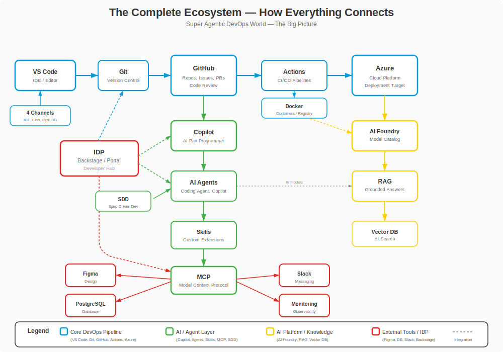

# Level 8-1 -- The Complete Map: How Everything Connects

---

## Change Log

| Version | Date       | Author       | Description                          |
|---------|------------|--------------|--------------------------------------|
| 1.0.0   | 2026-03-18 | Paula Silva  | Initial creation with Mario analogies |

---

## Table of Contents

- [Prologue: The Map That Reveals All Secrets](#prologue-the-map-that-reveals-all-secrets)
- [1. The Complete Map of the Mushroom Kingdom](#1-the-complete-map-of-the-mushroom-kingdom)
  - [1.1 Overview: The 8 Worlds](#11-overview-the-8-worlds)
  - [1.2 The ASCII Art Map](#12-the-ascii-art-map)
  - [1.3 Map Legend](#13-map-legend)

<div align="center">

<br><em>The complete ecosystem: how everything connects</em>
</div>
- [2. The Connections Between Worlds](#2-the-connections-between-worlds)
  - [2.1 The Main Flow: From START to FINAL](#21-the-main-flow-from-start-to-final)
  - [2.2 The Secret Warp Pipes: Non-Obvious Connections](#22-the-secret-warp-pipes-non-obvious-connections)
  - [2.3 Dependency Diagram](#23-dependency-diagram)
  - [2.4 Table: Each Tool and Its Connections](#24-table-each-tool-and-its-connections)
- [3. The Complete Developer Flow](#3-the-complete-developer-flow)
  - [3.1 From "I Pressed START" to "I Command an Army of Agents"](#31-from-i-pressed-start-to-i-command-an-army-of-agents)
  - [3.2 The 12 Steps of the Journey](#32-the-12-steps-of-the-journey)
  - [3.3 The Complete Pipeline in ASCII Art](#33-the-complete-pipeline-in-ascii-art)
- [4. Sofia's Day: A Complete Real-World Scenario](#4-sofias-day-a-complete-real-world-scenario)
  - [4.1 7:30 -- Arriving at the Office (World 1)](#41-730--arriving-at-the-office-world-1)
  - [4.2 8:00 -- Planning the Sprint (World 2)](#42-800--planning-the-sprint-world-2)
  - [4.3 9:00 -- Developing with Copilot (World 5 and 6)](#43-900--developing-with-copilot-world-5-and-6)
  - [4.4 11:00 -- Tests and Quality (World 3)](#44-1100--tests-and-quality-world-3)
  - [4.5 1:00 PM -- Code Review and Security (World 4 and 5)](#45-100-pm--code-review-and-security-world-4-and-5)
  - [4.6 2:30 PM -- Deploy and Monitoring (World 4)](#46-230-pm--deploy-and-monitoring-world-4)
  - [4.7 3:30 PM -- Building a RAG Agent (World 7)](#47-330-pm--building-a-rag-agent-world-7)
  - [4.8 5:00 PM -- Review on the Internal Portal (World 7)](#48-500-pm--review-on-the-internal-portal-world-7)
  - [4.9 5:30 PM -- End of Day: Retrospective (World 8)](#49-530-pm--end-of-day-retrospective-world-8)
  - [4.10 Summary Table: The Complete Day](#410-summary-table-the-complete-day)
- [5. The 5 Layers of the Ecosystem](#5-the-5-layers-of-the-ecosystem)
  - [5.1 Layer 1: Foundation (Worlds 1-2)](#51-layer-1-foundation-worlds-1-2)
  - [5.2 Layer 2: Tools (World 3)](#52-layer-2-tools-world-3)
  - [5.3 Layer 3: Practices (World 4)](#53-layer-3-practices-world-4)
  - [5.4 Layer 4: Intelligence (Worlds 5-6)](#54-layer-4-intelligence-worlds-5-6)
  - [5.5 Layer 5: Ecosystem (World 7)](#55-layer-5-ecosystem-world-7)
  - [5.6 Layer Diagram](#56-layer-diagram)
- [6. The Warp Zones Revealed: All Secret Passages](#6-the-warp-zones-revealed-all-secret-passages)
  - [6.1 Warp Zone 1: From Code to Cloud](#61-warp-zone-1-from-code-to-cloud)
  - [6.2 Warp Zone 2: From Human to Agent](#62-warp-zone-2-from-human-to-agent)
  - [6.3 Warp Zone 3: From Data to Decision](#63-warp-zone-3-from-data-to-decision)
  - [6.4 Complete Warp Zones Map](#64-complete-warp-zones-map)
- [7. Integration Patterns: Mushroom Kingdom Recipes](#7-integration-patterns-mushroom-kingdom-recipes)
  - [7.1 "Inner Loop" Pattern (Local Development)](#71-inner-loop-pattern-local-development)
  - [7.2 "Outer Loop" Pattern (CI/CD and Deploy)](#72-outer-loop-pattern-cicd-and-deploy)
  - [7.3 "AI Loop" Pattern (Agents and Automation)](#73-ai-loop-pattern-agents-and-automation)
  - [7.4 The 3 Connected Loops](#74-the-3-connected-loops)
- [8. Final Table: The Hero's Complete Inventory](#8-final-table-the-heros-complete-inventory)
- [References](#references)

---

## Prologue: The Map That Reveals All Secrets

Sofia stopped. Took a deep breath. Looked back.

Behind her, a trail that stretched across 7 entire worlds. The Green Plains where she learned to take her first steps. The Underground Caverns where she discovered what existed beneath everything. The Sky World where she soared high among tools and languages. The Water World where she dove deep into advanced architecture. The two Bowser's Castles where she mastered AI, Agents, and the Copilot ecosystem. The Star World where she forged magical weapons with AI frameworks.

Now, before her, rose the **Final Castle** -- World 8. The door was enormous, made from all the materials she had found: green bricks from the Plains, crystals from the Caverns, platforms from the Sky World, corals from the Water World, lava from Bowser's Castle, and stars from the Star World.

On the wall beside the door, a map was glowing. It was not a map of a single level -- it was the **Complete Map of the Mushroom Kingdom**. Every World, every level, every connection, every Warp Pipe, every secret passage. All visible. All revealed.

*"You walked each path individually,"* said the familiar voice. *"Now, for the first time, you will see how ALL the paths connect. This is the map that few players get to see -- because few complete all the worlds."*

Sofia smiled. It was time to see the complete picture.

---

## 1. The Complete Map of the Mushroom Kingdom

### 1.1 Overview: The 8 Worlds

Before seeing the detailed map, let's recall what each World represents:

| World | Name | Theme | What You Learned |
|-------|------|-------|------------------|
| 1 | Green Plains | Fundamentals | VS Code, Git, GitHub, Actions, Azure |
| 2 | Underground Caverns | Infrastructure | Environments, APIs, Security, DNS, DevOps, Observability |
| 3 | Sky World | Tools | Terminal, Docker, Tests, Databases, Languages, Frameworks |
| 4 | Water World | Architecture | Auth, Cloud Models, Microservices, Deploy, Git Workflows, Cache |
| 5 | Bowser's Castle Pt1 | AI and Agents | Copilot, Agents, Agent Types, Autonomy, MCP, Security |
| 6 | Bowser's Castle Pt2 | Copilot Ecosystem | Custom Agents, Skills, Instructions, Prompts, Hooks, MCP, Orchestration, Tokens |
| 7 | Star World | AI Frameworks | AI Foundry, RAG, LangChain, Agentic Frameworks, Channels, IDP |
| 8 | Final Castle | Complete Vision | How everything connects, review, next steps, glossary |

### 1.2 The ASCII Art Map

```
================================================================================================
                    COMPLETE MAP OF THE MUSHROOM KINGDOM
                    Agentic DevOps -- All Worlds
================================================================================================

                                  [WORLD 8]
                              FINAL CASTLE
                           +------------------+
                           | 8-1 Complete Map |
                           | 8-2 Boss Rush    |
                           | 8-3 Next Steps   |
                           | 8-F Glossary     |
                           +--------+---------+
                                    |
                     +--------------+--------------+
                     |                             |
              [WORLD 7]                     [WORLD 6]
            STAR WORLD                   BOWSER'S CASTLE 2
         +--------------+             +------------------+
         | AI Foundry   |             | Custom Agents    |
         | RAG          |<---MCP----->| Skills           |
         | LangChain    |             | Instructions     |
         | Agentic Fw   |             | Prompts          |
         | 4 Channels   |             | Hooks            |
         | IDP/Backstage|<---IDP----->| MCP              |
         +---------+----+             | Orchestration    |
                   |                  | Token Optim.     |
                   |                  +--------+---------+
                   |                           |
                   +-------------+-------------+
                                 |
                          [WORLD 5]
                       BOWSER'S CASTLE 1
                    +-------------------+
                    | DevOps Evolution  |
                    | AI Maturity       |
                    | GitHub Copilot    |
                    | What Is an Agent  |
                    | Agent Types       |
                    | Autonomous Agents |
                    | MCP Detailed      |
                    | 3 Horizons        |
                    | GHAS Security     |
                    +---------+---------+
                              |
              +---------------+---------------+
              |                               |
       [WORLD 3]                       [WORLD 4]
     SKY WORLD                      WATER WORLD
  +----------------+             +------------------+
  | Terminal       |             | Auth/JWT/OAuth   |
  | Docker         |<--Deploy-->| Cloud Models     |
  | Tests          |             | Microservices    |
  | Open Source    |             | Advanced Deploy  |
  | Databases      |<---SQL---->| Git Workflows    |
  | Best Practices |             | Cache/Perf       |
  | Internet       |             | Messaging        |
  | Languages      |             | JSON/Data        |
  | Frameworks     |             |                  |
  | Packages       |             |                  |
  +--------+-------+             +--------+---------+
           |                              |
           +----------+---+---+-----------+
                       |   |   |
                    [WORLD 2]
                 UNDERGROUND CAVERNS
              +---------------------+
              | Environments        |
              | APIs                |
              | Security            |
              | DNS/Domains         |
              | Methodologies       |
              | DevOps/IaC          |
              | Observability       |
              +----------+----------+
                         |
                    [WORLD 1]
                  GREEN PLAINS
              +---------------------+
              | VS Code             |
              | Git                 |
              | GitHub              |
              | GitHub Actions      |
              | Azure               |
              | Azure AI            |
              | Complete Flow       |
              +----------+----------+
                         |
                      [START]
                    "Press START"
                  Sofia starts here

================================================================================================
```

### 1.3 Map Legend

```
LEGEND:
  |       = Direct path (prerequisite)
  <--->   = Bidirectional connection (they complement each other)
  --XXX-- = Named Warp Pipe (themed shortcut)
  [    ]  = World (main grouping)
  +----+  = Castle/Area (World content)
```

---

## 2. The Connections Between Worlds

### 2.1 The Main Flow: From START to FINAL

The main journey follows a logical progression:

```
START --> VS Code --> Git --> GitHub --> Actions --> Azure
  |         |          |        |          |          |
  |    (W1: Control) (W1: Save) (W1: MP) (W1: Auto) (W1: Cloud)
  |
  +--> Environments --> APIs --> Security --> DNS --> DevOps
  |       |              |          |          |        |
  |  (W2: Infra)    (W2: Comm) (W2: Prot) (W2: Map) (W2: Ops)
  |
  +--> Terminal --> Docker --> Tests --> DB --> Languages
  |       |           |          |        |        |
  |  (W3: CMD)   (W3: Pack) (W3: QA)  (W3: Data) (W3: Code)
  |
  +--> Auth --> Cloud --> Microservices --> Deploy --> Cache
  |       |       |            |              |         |
  |  (W4: ID) (W4: IaaS) (W4: Arch)    (W4: Ship) (W4: Speed)
  |
  +--> Copilot --> Agents --> Types --> Autonomy --> GHAS
  |       |           |         |          |           |
  |  (W5: AI)   (W5: NPCs) (W5: Class) (W5: Auto) (W5: Shield)
  |
  +--> Agents --> Skills --> Instructions --> MCP --> Orchestration
  |       |          |            |            |          |
  |  (W6: Create) (W6: Power) (W6: Rules) (W6: Warp) (W6: Multi)
  |
  +--> AI Foundry --> RAG --> LangChain --> Frameworks --> IDP
  |       |            |          |              |           |
  |  (W7: Forge)  (W7: Lib) (W7: Chain) (W7: Tools)  (W7: Hub)
  |
  +--> COMPLETE MAP --> BOSS RUSH --> NEXT STEPS --> GLOSSARY
          |                  |               |                 |
     (W8: Vision)      (W8: Review)    (W8: Future)     (W8: Reference)
          |
        FINAL
   "Thank you Mario!"
```

### 2.2 The Secret Warp Pipes: Non-Obvious Connections

Beyond the main path, there are connections that cross worlds -- like the secret Warp Pipes in Mario:

```
SECRET WARP PIPES (Cross-World Connections):

W1 (Git) --------Warp-------> W4 (Git Workflows)
   "Basic save system leads to advanced branching strategies"

W1 (Actions) ----Warp-------> W3 (Docker + Tests)
   "CI/CD depends on containers and automated tests"

W2 (APIs) ------Warp-------> W4 (Auth/JWT)
   "APIs need authentication -- one can't live without the other"

W2 (Security) --Warp-------> W5 (GHAS)
   "Basic security evolves into AI-powered security"

W3 (Docker) -----Warp-------> W4 (Deploy)
   "Containers are the foundation of modern deployment"

W5 (Copilot) ----Warp-------> W6 (Entire Ecosystem)
   "Understanding Copilot is a prerequisite for customizing it"

W5 (MCP) --------Warp-------> W7 (IDP/Backstage)
   "MCP is the protocol; IDP is the hub that uses that protocol"

W6 (Agents) -----Warp-------> W7 (Agentic Frameworks)
   "Manual Custom Agents lead to automation frameworks"

W6 (Tokens) -----Warp-------> W7 (AI Foundry)
   "Optimizing tokens requires understanding how models work"

W7 (RAG) --------Warp-------> W6 (MCP)
   "RAG fetches data; MCP connects data sources"
```

### 2.3 Dependency Diagram

```
                    DEPENDENCY DIAGRAM
         (What you NEED to know before each World)

World 1: No prerequisites (START here!)
    |
World 2: Requires World 1 (VS Code, Git, GitHub)
    |
World 3: Requires Worlds 1-2 (Fundamentals + Infrastructure)
    |
World 4: Requires Worlds 1-3 (everything prior)
    |
World 5: Requires Worlds 1-4 (complete foundation)
    |
World 6: Requires World 5 (understanding Copilot/Agents)
    |
World 7: Requires Worlds 5-6 (AI + Copilot ecosystem)
    |
World 8: Requires Worlds 1-7 (EVERYTHING -- this is the final review)
```

### 2.4 Table: Each Tool and Its Connections

| Tool | World | Connects With | Connection Type |
|------|-------|---------------|-----------------|
| VS Code | W1 | Copilot (W5), Extensions (W3), Git (W1) | Central environment |
| Git | W1 | GitHub (W1), Git Workflows (W4), Hooks (W6) | Version control |
| GitHub | W1 | Actions (W1), Copilot (W5), Issues/PRs (W2) | Central platform |
| GitHub Actions | W1 | Docker (W3), Tests (W3), Deploy (W4), Azure (W1) | CI/CD automation |
| Azure | W1 | AI Foundry (W7), Deploy (W4), DNS (W2) | Cloud |
| APIs | W2 | Auth (W4), Messaging (W4), MCP (W6) | Communication |
| Docker | W3 | Deploy (W4), Actions (W1), Microservices (W4) | Packaging |
| Tests | W3 | CI/CD (W1), QA Agent (W6), TDD (W4) | Quality |
| Auth/JWT | W4 | APIs (W2), Security (W2), GHAS (W5) | Identity |
| Deploy | W4 | Docker (W3), Actions (W1), Azure (W1) | Delivery |
| GitHub Copilot | W5 | VS Code (W1), Agents (W6), AI Foundry (W7) | AI assistant |
| Custom Agents | W6 | Copilot (W5), Skills (W6), Orchestration (W6) | AI characters |
| MCP | W6 | APIs (W2), IDP (W7), Warp Zones (W5) | Connection protocol |
| AI Foundry | W7 | Copilot (W5), RAG (W7), Azure (W1) | AI platform |
| RAG | W7 | MCP (W6), AI Foundry (W7), Databases (W3) | Knowledge |
| IDP/Backstage | W7 | MCP (W6), APIs (W2), Observability (W2) | Central hub |

---

## 3. The Complete Developer Flow

### 3.1 From "I Pressed START" to "I Command an Army of Agents"

The modern developer's journey follows an evolution that mirrors the 8 Worlds:

```
DEVELOPER EVOLUTION:

Level 1: "I know how to open VS Code"
         (Knows how to use the controller)

Level 2: "I know how to commit and push"
         (Knows how to save and play online)

Level 3: "I know how to create a PR and use Actions"
         (Knows how to play multiplayer with automation)

Level 4: "I know how to use Docker, tests, and CI/CD"
         (Masters advanced tools)

Level 5: "I know how to design systems and deploy"
         (Architects complex worlds)

Level 6: "I know how to use Copilot effectively"
         (Has an AI companion)

Level 7: "I know how to create and orchestrate agents"
         (Commands an army of intelligent NPCs)

Level 8: "I know how to build with AI Foundry and RAG"
         (Forges their own magical weapons)

Level FINAL: "I know how EVERYTHING connects"
             (Sees the complete map -- this chapter)
```

### 3.2 The 12 Steps of the Journey

The complete flow of an Agentic DevOps developer, from start to finish:

| Step | Action | Tool | World |
|------|--------|------|-------|
| 1 | Opens the editor | VS Code | W1 |
| 2 | Clones the repository | Git | W1 |
| 3 | Creates a branch | Git + GitHub | W1 |
| 4 | Asks Copilot for help | GitHub Copilot | W5 |
| 5 | Delegates to specialized agents | Custom Agents | W6 |
| 6 | Agents use skills and instructions | Skills + Instructions | W6 |
| 7 | Connects external tools via MCP | MCP | W6 |
| 8 | Runs tests and linting automatically | Hooks + Actions | W6 + W1 |
| 9 | Creates PR with agent review | Agent Mode + GHAS | W5 + W6 |
| 10 | Automated deploy | Actions + Azure | W1 + W4 |
| 11 | RAG agent monitors and responds | AI Foundry + RAG | W7 |
| 12 | IDP centralizes everything in a portal | IDP/Backstage | W7 |

### 3.3 The Complete Pipeline in ASCII Art

```
THE COMPLETE AGENTIC DEVOPS PIPELINE:

  DEVELOPER (Sofia)
        |
        v
  +============+     +============+     +============+
  |  VS CODE   |---->|    GIT     |---->|   GITHUB   |
  | (Controller)|    | (Save)    |     | (Server)   |
  | + Copilot  |     | + Hooks   |     | + Issues   |
  | + Agents   |     | (W6)      |     | + PRs      |
  | (W1+W5+W6) |     |  (W1)     |     |  (W1)      |
  +============+     +============+     +=====+======+
                                              |
                     +------------------------+
                     |
                     v
  +============+     +============+     +============+
  |  ACTIONS   |---->|  DOCKER    |---->|   TESTS    |
  | (Lakitu)   |     | (Boxes)   |     | (Training) |
  | CI/CD auto |     | Container |     | Jest/Lint  |
  |  (W1)      |     |  (W3)     |     |  (W3)      |
  +============+     +============+     +=====+======+
                                              |
                     +------------------------+
                     |
                     v
  +============+     +============+     +============+
  |   DEPLOY   |---->|   AZURE    |---->|   GHAS     |
  | Blue/Green |     | (Cloud)   |     | (Shield)   |
  | Canary     |     | App Svc   |     | Scanning   |
  |  (W4)      |     |  (W1)     |     |  (W5)      |
  +============+     +============+     +=====+======+
                                              |
                     +------------------------+
                     |
                     v
  +============+     +============+     +============+
  | AI FOUNDRY |---->|    RAG     |---->|    IDP     |
  | (Forge)    |     | (Library) |     | (Plaza)    |
  | AI Models  |     | Query     |     | Portal Hub |
  |  (W7)      |     |  (W7)     |     |  (W7)      |
  +============+     +============+     +============+
        |                                     |
        v                                     v
  +============+                    +==================+
  | MCP/AGENTS |                    | OBSERVABILITY    |
  | Orchestr.  |                    | Logs, Metrics    |
  |  (W6)      |                    |  (W2)            |
  +============+                    +==================+
```

---

## 4. Sofia's Day: A Complete Real-World Scenario

This is the most important scenario in the chapter: a full day in Sofia's life, using ALL tools from the 8 Worlds. Each hour of the day maps to one or more Worlds.

### 4.1 7:30 -- Arriving at the Office (World 1)

Sofia opens her laptop and launches **VS Code** (World 1 -- the game console). The integrated terminal shows her repository is up to date. She runs `git pull` to sync with the `main` branch.

```bash
# World 1: Git + VS Code
cd ~/projects/todo-app
git checkout main
git pull origin main
git checkout -b feature/product-catalog
```

**GitHub** (World 1 -- multiplayer server) shows 3 issues assigned to her in the current Sprint. She opens the **GitHub Projects** board to visualize the backlog.

**Tools used**: VS Code, Git, GitHub, GitHub Projects

### 4.2 8:00 -- Planning the Sprint (World 2)

Before coding, Sofia checks the **environments** (World 2). The staging environment is running version 2.3.1. Production is on 2.3.0. She looks at the **observability dashboard** (World 2 -- Grafana) and sees the products API is responding in 200ms (healthy).

She consults the **API documentation** (World 2 -- APIs) to understand the contract of the endpoint she is going to implement.

```
GET /api/products      -> List products (existing)
POST /api/products     -> Create product (NEW -- issue #42)
PUT /api/products/:id  -> Update product (NEW -- issue #43)
```

**Tools used**: Environments, APIs, Observability, Methodologies (Scrum board)

### 4.3 9:00 -- Developing with Copilot (World 5 and 6)

Now the development begins. Sofia opens **Copilot Chat** (World 5) and selects the **Luigi** agent (React Frontend Engineer -- World 6):

```
Sofia (via Copilot Agent Mode):
  "@luigi I need to create the product registration form
   with fields name, price, category, and image_url. Follow the
   pattern of the TodoForm that already exists.
   Use the ProductService I'll create on the backend."
```

The Luigi agent (World 6 -- Custom Agent) automatically activates the **workflow-feature** skill (World 6 -- Skill), which follows the flow: Plan -> Implement -> Review -> Verify.

While Luigi works on the frontend, Sofia switches to the backend and uses **inline completions** (World 5 -- the cheapest token mode, learned in World 6 Level 6-8):

```typescript
// Copilot completes based on the existing pattern
// Sofia saves tokens using completions instead of chat
class ProductService {
  async create(data: CreateProductInput): Promise<Product> {
    // Copilot suggests: validation + persistence + return
    // Tab to accept -- ~300 tokens (vs 2000 in chat)
  }
}
```

She also uses **MCP** (World 6) to connect Copilot to the staging database and validate that the schema is correct:

```
Sofia: "@workspace Check via MCP/PostgreSQL if the products
        table exists in the staging database and what columns it has."
Copilot (via MCP): "Products table found with columns:
                    id, name, price, category, image_url, created_at"
```

**Tools used**: GitHub Copilot, Custom Agents, Skills, Instructions, MCP, Token Optimization

### 4.4 11:00 -- Tests and Quality (World 3)

With the code ready, Sofia runs the **tests** (World 3). The **Peach** agent (QA Engineer -- World 6) has already created unit tests using the **jest-testing** skill:

```bash
# World 3: Tests
npm test -- --coverage
# 42 tests passing, coverage 87%

# World 3: Docker
docker-compose up -d
# Spins up PostgreSQL + Redis + App locally

# World 3: Linting
npm run lint
# 0 errors, 0 warnings
```

The **Hooks** (World 6 -- "?" Blocks) trigger automatically:
- **pre-commit**: ESLint + Prettier format the code
- **commit-msg**: Validates that the message follows Conventional Commits

```bash
git add .
git commit -m "feat(products): add CRUD endpoints and form"
# [Hook: pre-commit] Running ESLint... PASS
# [Hook: commit-msg] Validating format... PASS
# Commit created successfully
```

**Tools used**: Tests (Jest), Docker, Linting (ESLint), Hooks (Husky)

### 4.5 1:00 PM -- Code Review and Security (World 4 and 5)

Sofia creates a **Pull Request** on GitHub (World 1). Automatically:

1. **GitHub Actions** (World 1) triggers the CI pipeline:
   - Build with Docker (World 3)
   - Automated tests (World 3)
   - Linting and type-checking (World 3)

2. **GHAS** (World 5 -- Star Shield) scans the code:
   - Code Scanning: 0 vulnerabilities
   - Secret Scanning: 0 exposed secrets
   - Dependabot: 1 outdated dependency (non-critical)

3. The **Toadette** agent (Code Reviewer -- World 6) does an automatic review and leaves comments:

```
Toadette (Code Reviewer Agent):
  "src/services/product.ts:42 -- Consider adding
   rate limiting to the POST endpoint to prevent abuse.
   See the pattern in src/middleware/rateLimiter.ts"

  "src/components/ProductForm.tsx:18 -- The price field
   accepts negative values. Add validation min: 0"
```

Sofia makes the adjustments, her colleague **Pedro** approves the PR, and the merge happens.

**Tools used**: Pull Requests, GitHub Actions, GHAS (Code Scanning, Secret Scanning, Dependabot), Custom Agent (Code Reviewer), Auth/JWT (protected API)

### 4.6 2:30 PM -- Deploy and Monitoring (World 4)

The merge to `main` triggers the **automated deploy** (World 4):

```
DEPLOY PIPELINE:
  main merge
    |
    v
  [Build Docker Image]     -- World 3
    |
    v
  [Push to ACR]            -- World 1 (Azure)
    |
    v
  [Deploy to Staging]      -- World 4 (Blue-Green)
    |
    v
  [Smoke Tests]            -- World 3
    |
    v
  [Deploy to Production]   -- World 4 (Canary 10%)
    |
    v
  [Monitor Metrics]        -- World 2 (Observability)
    |
    v
  [Full Rollout 100%]      -- World 4
```

The deploy uses a **Canary strategy** (World 4 -- Advanced Deploy): first 10% of the traffic goes to the new version. Metrics are monitored for 15 minutes. If everything is healthy, 100% of the traffic is redirected.

**Tools used**: Deploy (Canary), Docker, Azure, Observability, GitHub Actions

### 4.7 3:30 PM -- Building a RAG Agent (World 7)

With the feature in production, Sofia dedicates the late afternoon to a special project: an **internal chatbot** that answers questions about the product documentation.

She uses **Azure AI Foundry** (World 7 -- Magikoopa's Forge) to:

1. Select the **GPT-4o** model as the base
2. Configure **RAG** (World 7 -- Magical Library) with the product documentation
3. Use **LangChain** (World 7 -- Power-Up Chain) to orchestrate the flow:

```
User question
    |
    v
[Embedding]  --> Converts question into a vector
    |
    v
[Azure AI Search]  --> Searches for relevant documents
    |
    v
[GPT-4o + Context]  --> Generates response based on docs
    |
    v
Grounded response
```

**Semantic Kernel** (World 7 -- Universal Engine) connects everything using plugins.

**Tools used**: AI Foundry, RAG, LangChain, Semantic Kernel, Azure AI Search

### 4.8 5:00 PM -- Review on the Internal Portal (World 7)

Sofia accesses the **IDP** (World 7 -- Central Plaza/Backstage) to register the new service in the internal catalog:

```
+--------------------------------------------------+
|  BACKSTAGE -- Developer Portal                   |
|                                                  |
|  Registered Services:                            |
|  [x] todo-api          v2.3.1  (healthy)        |
|  [x] product-api       v1.0.0  (new!)           |
|  [x] product-chatbot   v0.1.0  (beta)           |
|                                                  |
|  Pipelines:                                      |
|  [v] product-api CI    -- PASSED                 |
|  [v] product-api CD    -- DEPLOYED               |
|                                                  |
|  Docs: Auto-generated via OpenAPI                |
|  Runbooks: Linked                                |
|  Owner: Sofia                                    |
+--------------------------------------------------+
```

The IDP connects all information in a single place -- like the Central Plaza in Mario 64 from which you access all the paintings (worlds).

**Tools used**: IDP/Backstage, Observability, Documentation

### 4.9 5:30 PM -- End of Day: Retrospective (World 8)

Sofia looks back and realizes that, in a single day, she used tools from **ALL 8 Worlds**:

```
DAY RETROSPECTIVE:

07:30  VS Code + Git + GitHub          = World 1
08:00  Environments + APIs + Observ.   = World 2
09:00  Copilot + Agents + MCP + Tokens = World 5 + 6
11:00  Tests + Docker + Hooks          = World 3 + 6
13:00  PR + Actions + GHAS + Review    = World 1 + 4 + 5 + 6
14:30  Deploy Canary + Monitor         = World 4 + 2
15:30  AI Foundry + RAG + LangChain    = World 7
17:00  IDP/Backstage                   = World 7
17:30  Complete vision                 = World 8 (this moment)
```

No tool works alone. They all depend on each other. VS Code is useless without Git. Git is useless without GitHub. GitHub is useless without Actions. And no AI agent works without infrastructure, security, tests, and deploy behind it.

**The final lesson**: Agentic DevOps is not about ONE tool. It is about how ALL tools form an integrated ecosystem.

### 4.10 Summary Table: The Complete Day

| Time | Activity | Worlds Used | Tools |
|------|----------|-------------|-------|
| 07:30 | Setup and sync | W1 | VS Code, Git, GitHub |
| 08:00 | Planning | W2 | Environments, APIs, Observability |
| 09:00 | Development | W5, W6 | Copilot, Agents, Skills, MCP |
| 11:00 | Tests and quality | W3, W6 | Jest, Docker, ESLint, Hooks |
| 13:00 | Review and security | W1, W4, W5, W6 | PR, Actions, GHAS, Agent Review |
| 14:30 | Deploy | W1, W2, W3, W4 | Canary, Docker, Azure, Observ. |
| 15:30 | AI project | W7 | AI Foundry, RAG, LangChain |
| 17:00 | Internal portal | W7 | IDP/Backstage |
| 17:30 | Retrospective | W8 | Complete vision |

---

## 5. The 5 Layers of the Ecosystem

### 5.1 Layer 1: Foundation (Worlds 1-2)

The base upon which everything is built. Without these fundamentals, nothing else works:

- **VS Code**: The editor where you live
- **Git**: The save system
- **GitHub**: The multiplayer platform
- **Azure**: The cloud where everything runs
- **Environments**: Dev, staging, production
- **APIs**: How systems talk to each other
- **Security**: Basic protection

### 5.2 Layer 2: Tools (World 3)

The tools you use day to day to build software:

- **Terminal**: Raw power via command line
- **Docker**: Universal packaging
- **Tests**: Guaranteed quality
- **Databases**: Persistence
- **Languages and Frameworks**: Your weapons

### 5.3 Layer 3: Practices (World 4)

Advanced patterns and strategies:

- **Authentication**: Identity and security
- **Architecture**: Microservices, monoliths
- **Advanced deploy**: Blue-green, canary
- **Cache and performance**: Speed

### 5.4 Layer 4: Intelligence (Worlds 5-6)

The AI layer that supercharges everything:

- **GitHub Copilot**: Personal assistant
- **Custom Agents**: Specialized characters
- **Skills and Instructions**: Powers and rules
- **MCP**: Connection to external tools
- **Orchestration**: Multiple coordinated agents
- **Token Optimization**: Cost efficiency

### 5.5 Layer 5: Ecosystem (World 7)

The most advanced level -- building with AI:

- **AI Foundry**: Model platform
- **RAG**: Contextual knowledge
- **Agentic Frameworks**: AutoGen, Semantic Kernel
- **IDP/Backstage**: Central hub for everything

### 5.6 Layer Diagram

```
+============================================================+
|  LAYER 5: ECOSYSTEM (World 7)                              |
|  AI Foundry | RAG | LangChain | Frameworks | IDP           |
+============================================================+
|  LAYER 4: INTELLIGENCE (Worlds 5-6)                        |
|  Copilot | Agents | Skills | MCP | Orchestration | Tokens  |
+============================================================+
|  LAYER 3: PRACTICES (World 4)                              |
|  Auth | Microservices | Deploy | Cache | Git Workflows     |
+============================================================+
|  LAYER 2: TOOLS (World 3)                                  |
|  Terminal | Docker | Tests | DBs | Languages | Frameworks  |
+============================================================+
|  LAYER 1: FOUNDATION (Worlds 1-2)                          |
|  VS Code | Git | GitHub | Actions | Azure | APIs | Sec.   |
+============================================================+

  ^  Each layer DEPENDS on the layers below it.
  |  You cannot skip layers (just like in Mario,
  |  you don't jump from World 1 to World 7).
```

---

## 6. The Warp Zones Revealed: All Secret Passages

### 6.1 Warp Zone 1: From Code to Cloud

```
LOCAL CODE -----> REPOSITORY -----> CI/CD -----> CLOUD
  (VS Code)       (GitHub)         (Actions)     (Azure)

  "You write"    "You save"    "Robot verifies" "World sees"
```

This is the most fundamental passage: how code goes from your computer to the users.

### 6.2 Warp Zone 2: From Human to Agent

```
HUMAN -----> COPILOT -----> AGENT -----> AUTONOMOUS AGENT
(types)     (suggests)     (executes)   (decides on its own)

"You ask"   "AI helps"    "AI does"    "AI decides and does"
```

The progression of automation: from you doing everything to autonomous agents operating with guardrails.

### 6.3 Warp Zone 3: From Data to Decision

```
RAW DATA -----> EMBEDDING -----> SEARCH -----> LLM -----> RESPONSE
(documents)     (vectors)        (RAG)        (reason)    (decision)

"Information"  "Representation"  "Find"       "Think"     "Act"
```

The RAG flow: how to turn raw data into intelligent responses.

### 6.4 Complete Warp Zones Map

```
+------------------------------------------------------------------+
|                  WARP ZONES MAP                                   |
|                                                                  |
|  [Code] --pipe1--> [Repo] --pipe2--> [CI/CD] --pipe3--> [Cloud] |
|     |                   |                  |                  |   |
|     |--pipe4--> [Copilot] --pipe5--> [Agents]                |   |
|                    |                    |                     |   |
|                    |--pipe6--> [MCP] --pipe7--> [Tools]      |   |
|                                 |                            |   |
|                                 |--pipe8--> [RAG] --pipe9--> |   |
|                                              |               |   |
|                                    [AI Foundry] --pipe10-->  |   |
|                                              |               |   |
|                                         [IDP/Hub] <-----------   |
|                                                                  |
+------------------------------------------------------------------+

LEGEND:
  pipe1  = git push
  pipe2  = webhook trigger
  pipe3  = deploy pipeline
  pipe4  = inline completion / chat
  pipe5  = agent delegation
  pipe6  = tool connection
  pipe7  = external API call
  pipe8  = document indexing
  pipe9  = context injection
  pipe10 = model serving
```

---

## 7. Integration Patterns: Mushroom Kingdom Recipes

### 7.1 "Inner Loop" Pattern (Local Development)

The loop that happens on the developer's computer, dozens of times per day:

```
INNER LOOP (Local):
  Write code
      |
      v
  Copilot suggests (completion/chat)
      |
      v
  Test locally
      |
      v
  Commit (hooks trigger)
      |
      v
  Push to branch
      |
      +----> Back to "Write code"

  Average time: 15-60 minutes per cycle
  Tools: VS Code, Git, Copilot, Docker, Jest, Hooks
  Worlds: 1, 3, 5, 6
```

### 7.2 "Outer Loop" Pattern (CI/CD and Deploy)

The loop that happens on the server, after the push:

```
OUTER LOOP (Server):
  Push/PR created
      |
      v
  CI: Build + Test + Lint + Scan
      |
      v
  Code Review (human + agent)
      |
      v
  Merge to main
      |
      v
  CD: Deploy to staging
      |
      v
  Smoke tests
      |
      v
  Deploy to production (canary)
      |
      v
  Monitoring
      |
      +----> Back to "Push/PR created" (next feature)

  Average time: 30 min - 2 hours
  Tools: GitHub Actions, Docker, GHAS, Azure, Observability
  Worlds: 1, 2, 3, 4, 5
```

### 7.3 "AI Loop" Pattern (Agents and Automation)

The artificial intelligence loop that permeates the other two:

```
AI LOOP (Cross-cutting):
  Context collected (workspace, files, history)
      |
      v
  Agent analyzes and plans
      |
      v
  Agent executes (creates/edits code, runs commands)
      |
      v
  Automatic verification (tests, lint)
      |
      v
  Human approves or adjusts
      |
      +----> Back to "Context collected"

  Average time: Continuous
  Tools: Copilot, Agents, Skills, MCP, AI Foundry
  Worlds: 5, 6, 7
```

### 7.4 The 3 Connected Loops

```
+------------------------------------------------------------------+
|                    THE 3 CONNECTED LOOPS                          |
|                                                                  |
|  +-------- INNER LOOP (Local) --------+                          |
|  |  Code -> Copilot -> Test -> Commit |                          |
|  +------------------+-----------------+                          |
|                     |                                            |
|                     v                                            |
|  +-------- OUTER LOOP (Server) ------+                           |
|  |  CI -> Review -> Merge -> Deploy  |                           |
|  +------------------+-----------------+                          |
|                     |                                            |
|                     v                                            |
|  +-------- AI LOOP (Cross-cutting) --+                           |
|  |  Agents permeate both loops       |                           |
|  |  Collect context, execute, learn  |                           |
|  +------------------------------------+                          |
|                                                                  |
|  Result: Continuous, intelligent, and automated development      |
+------------------------------------------------------------------+
```

---

## 8. Final Table: The Hero's Complete Inventory

After completing all 8 Worlds, this is Sofia's complete inventory:

| # | Tool/Concept | World | Mario Analogy | Status |
|---|--------------|-------|---------------|--------|
| 1 | VS Code | W1 | Game console | Equipped |
| 2 | Git | W1 | Save system | Equipped |
| 3 | GitHub | W1 | Multiplayer server | Equipped |
| 4 | GitHub Actions | W1 | Lakitu in the cloud | Equipped |
| 5 | Azure | W1 | The open world | Equipped |
| 6 | Environments (Dev/Staging/Prod) | W2 | Parallel worlds | Equipped |
| 7 | APIs | W2 | Messengers between kingdoms | Equipped |
| 8 | Security | W2 | Protection spells | Equipped |
| 9 | DNS | W2 | World map | Equipped |
| 10 | DevOps/IaC | W2 | Alliance between classes | Equipped |
| 11 | Observability | W2 | Character senses | Equipped |
| 12 | Terminal | W3 | Command console | Equipped |
| 13 | Docker | W3 | The art of packaging | Equipped |
| 14 | Tests | W3 | Training before battle | Equipped |
| 15 | Databases | W3 | Castle of data | Equipped |
| 16 | Languages | W3 | RPG classes | Equipped |
| 17 | Frameworks | W3 | Weapons and armor | Equipped |
| 18 | Auth/JWT/OAuth | W4 | Advanced protection | Equipped |
| 19 | Microservices | W4 | Fortress map | Equipped |
| 20 | Advanced deploy | W4 | Launch strategies | Equipped |
| 21 | Git Workflows | W4 | Work flows | Equipped |
| 22 | Cache | W4 | Super Star Mode | Equipped |
| 23 | GitHub Copilot | W5 | Ultimate companion | Equipped |
| 24 | Agent Concepts | W5 | NPCs that came to life | Equipped |
| 25 | Agent Types | W5 | Who is who | Equipped |
| 26 | Autonomous Agents | W5 | Yoshis that fly on their own | Equipped |
| 27 | GHAS | W5 | Star Shield | Equipped |
| 28 | Custom Agents | W6 | Character select screen | Equipped |
| 29 | Skills | W6 | Power-Ups | Equipped |
| 30 | Instructions | W6 | Game rules | Equipped |
| 31 | Prompts | W6 | Warp Pipes | Equipped |
| 32 | Hooks | W6 | "?" Blocks | Equipped |
| 33 | MCP | W6 | Warp Zones | Equipped |
| 34 | Orchestration | W6 | Coordinated multiplayer | Equipped |
| 35 | Token Optimization | W6 | Wise coins | Equipped |
| 36 | AI Foundry | W7 | Magikoopa's Forge | Equipped |
| 37 | RAG | W7 | Magical Library | Equipped |
| 38 | LangChain | W7 | Power-Up Chain | Equipped |
| 39 | Agentic Frameworks | W7 | Heroes' Framework | Equipped |
| 40 | IDP/Backstage | W7 | Central Plaza | Equipped |

**Total: 40 tools and concepts mastered. Inventory complete. Hero ready.**

---

## References

- [GitHub Documentation](https://docs.github.com) -- Official GitHub documentation
- [Azure Documentation](https://learn.microsoft.com/azure) -- Azure documentation
- [GitHub Copilot](https://docs.github.com/en/copilot) -- Copilot documentation
- [VS Code Documentation](https://code.visualstudio.com/docs) -- VS Code documentation
- [GitHub Actions](https://docs.github.com/en/actions) -- GitHub Actions documentation
- [Azure AI Foundry](https://learn.microsoft.com/azure/ai-studio) -- Azure AI Foundry docs
- [Model Context Protocol](https://modelcontextprotocol.io/) -- MCP specification
- [Backstage.io](https://backstage.io/) -- Internal Developer Portal
- [LangChain Documentation](https://docs.langchain.com/) -- LangChain docs
- [Semantic Kernel](https://learn.microsoft.com/semantic-kernel) -- Semantic Kernel docs
- [GitHub Advanced Security](https://docs.github.com/en/get-started/learning-about-github/about-github-advanced-security) -- GHAS docs

---

*"The map is complete. Every Warp Pipe, every secret passage, every connection -- all revealed. You are no longer a player who follows the path. You are a player who SEES the entire map. And whoever sees the entire map never gets lost again."*

*Level 8-1 complete. The Mushroom Kingdom map is now yours.*

*Next: Level 8-2 -- Boss Rush. It's time to face all the bosses again.*

---

<div align="center">

⬅️ [Previous: Level 7-BOSS: Practical Project](../world-7-star-world/7-boss-practical-project.md) · 🗺️ [World Map](../INDEX.md) · ➡️ [Next: Level 8-2: Boss Rush](8-2-boss-rush.md)

</div>
