# Fase 1-1 — Apertando START: VS Code, o Console do Jogo

---

## Change Log

| Versao | Data       | Autor        | Descricao                     |
|--------|------------|--------------|-------------------------------|
| 1.0.0  | 2026-03-18 | Paula Silva  | Criacao inicial (Edicao Mario)|

---

## Sumario

- [Prologo — Apertando START](#prologo--apertando-start)
- [1. O que e Codigo?](#1-o-que-e-codigo)
  - [1.1 A Linguagem do Mushroom Kingdom](#11-a-linguagem-do-mushroom-kingdom)
  - [1.2 Codigo e como as Instrucoes de Fase](#12-codigo-e-como-as-instrucoes-de-fase)
  - [1.3 Do Texto ao Programa: Como a Magia Funciona](#13-do-texto-ao-programa-como-a-magia-funciona)
- [2. O que e o VS Code?](#2-o-que-e-o-vs-code)
  - [2.1 O Console do Jogo](#21-o-console-do-jogo)
  - [2.2 Por que o VS Code?](#22-por-que-o-vs-code)
  - [2.3 Tabela: Partes do VS Code vs Partes do Console](#23-tabela-partes-do-vs-code-vs-partes-do-console)
- [3. Instalando o VS Code — Ligando o Console](#3-instalando-o-vs-code--ligando-o-console)
  - [3.1 Passo a Passo: Windows](#31-passo-a-passo-windows)
  - [3.2 Passo a Passo: macOS](#32-passo-a-passo-macos)
  - [3.3 Passo a Passo: Linux](#33-passo-a-passo-linux)
  - [3.4 Verificando a Instalacao](#34-verificando-a-instalacao)
- [4. Conhecendo a Tela — O Menu Principal](#4-conhecendo-a-tela--o-menu-principal)
  - [4.1 Barra Lateral (Sidebar) — O Menu de Navegacao](#41-barra-lateral-sidebar--o-menu-de-navegacao)
  - [4.2 Editor Central — A Tela de Jogo](#42-editor-central--a-tela-de-jogo)
  - [4.3 Barra de Status — O HUD do Jogo](#43-barra-de-status--o-hud-do-jogo)
  - [4.4 Command Palette — O Menu de Cheats](#44-command-palette--o-menu-de-cheats)
  - [4.5 Mapa Visual: Anatomia do VS Code](#45-mapa-visual-anatomia-do-vs-code)
- [5. Extensoes — Os Acessorios do Controle](#5-extensoes--os-acessorios-do-controle)
  - [5.1 O que sao Extensoes?](#51-o-que-sao-extensoes)
  - [5.2 Extensoes Essenciais para Iniciantes](#52-extensoes-essenciais-para-iniciantes)
  - [5.3 Como Instalar Extensoes](#53-como-instalar-extensoes)
  - [5.4 GitHub Copilot — Seu Primeiro Companion](#54-github-copilot--seu-primeiro-companion)
- [6. O Terminal Integrado — O Debug Menu](#6-o-terminal-integrado--o-debug-menu)
  - [6.1 O que e o Terminal?](#61-o-que-e-o-terminal)
  - [6.2 Abrindo o Terminal](#62-abrindo-o-terminal)
  - [6.3 Comandos Basicos — Seus Primeiros Cheats](#63-comandos-basicos--seus-primeiros-cheats)
  - [6.4 Tabela: Comandos do Terminal vs Acoes no Jogo](#64-tabela-comandos-do-terminal-vs-acoes-no-jogo)
- [7. Seu Primeiro Arquivo — Fase 1-1 Completa](#7-seu-primeiro-arquivo--fase-1-1-completa)
  - [7.1 Criando uma Pasta (Seu Primeiro Mundo)](#71-criando-uma-pasta-seu-primeiro-mundo)
  - [7.2 Criando um Arquivo (Sua Primeira Fase)](#72-criando-um-arquivo-sua-primeira-fase)
  - [7.3 Escrevendo Codigo (Construindo a Fase)](#73-escrevendo-codigo-construindo-a-fase)
  - [7.4 Salvando (Save Game Manual)](#74-salvando-save-game-manual)
  - [7.5 Executando (Apertando Play)](#75-executando-apertando-play)
- [8. Atalhos de Teclado — Combos Secretos](#8-atalhos-de-teclado--combos-secretos)
  - [8.1 Os 10 Atalhos que Todo Jogador Precisa](#81-os-10-atalhos-que-todo-jogador-precisa)
  - [8.2 Tabela de Combos](#82-tabela-de-combos)
- [9. Configuracoes Basicas — Ajustando o Console](#9-configuracoes-basicas--ajustando-o-console)
  - [9.1 Tema de Cores (Skin do Console)](#91-tema-de-cores-skin-do-console)
  - [9.2 Tamanho da Fonte](#92-tamanho-da-fonte)
  - [9.3 Auto Save — Save Automatico](#93-auto-save--save-automatico)
- [Resumo — O que Aprendemos na Fase 1-1](#resumo--o-que-aprendemos-na-fase-1-1)
- [Referencias](#referencias)

---

## Prologo — Apertando START

Sofia olhou para a tela. Um cursor piscava pacientemente, esperando. Era como aquele momento no Super Mario Bros quando a tela de titulo aparece e o jogo espera voce apertar START. Nada acontece ate voce dar o primeiro passo.

No mundo do desenvolvimento de software, esse botao START tem um nome: **Visual Studio Code** — ou simplesmente **VS Code**. Assim como voce precisa de um console (Nintendo, PlayStation, Xbox) para jogar Mario, voce precisa de um lugar para escrever, ver e executar codigo. O VS Code e esse lugar.

"Mas eu nunca escrevi codigo na vida," pensou Sofia.

Perfeito. Ninguem nasce sabendo pular em cima de Goombas. No World 1-1 do Mario original, o jogo ensina voce a jogar *jogando* — o primeiro Goomba vem andando na sua direcao e voce instintivamente descobre que precisa pular. Sem manual. Sem tutorial. O design da fase ensina.

Esta fase funciona do mesmo jeito. Ao final dela, voce tera:

- Instalado o VS Code (ligado o console)
- Explorado a interface (entendido os botoes do controle)
- Instalado extensoes (conectado acessorios ao controle)
- Usado o terminal (acessado o menu de debug)
- Criado e executado seu primeiro arquivo de codigo (completado sua primeira fase)

Aperte START. Vamos comecar.

---

## 1. O que e Codigo?

### 1.1 A Linguagem do Mushroom Kingdom

Antes de falar sobre o VS Code, precisamos responder a pergunta mais basica de todas: **o que e codigo?**

Codigo e um conjunto de **instrucoes escritas** que dizem ao computador o que fazer. Assim como uma partitura diz a um musico quais notas tocar, o codigo diz ao computador quais acoes executar.

> **ANALOGIA MARIO:** Imagine que voce pudesse escrever instrucoes para o Mario em vez de controla-lo com o joystick. Em vez de apertar botoes, voce escreveria:
>
> ```
> mario.andar(direita, 5)
> mario.pular()
> mario.pegarMoeda()
> mario.entrarCano()
> ```
>
> Isso e codigo. Sao instrucoes que descrevem acoes. O computador le essas instrucoes e as executa, uma por uma, assim como o Mario executaria cada comando.

### 1.2 Codigo e como as Instrucoes de Fase

No Mario, cada fase foi construida por alguem. Alguem decidiu: "aqui vai um bloco, ali vai um Goomba, la vai uma moeda." Essa pessoa escreveu *instrucoes* que o jogo interpreta para construir a fase.

Quando voce escreve codigo, voce esta fazendo a mesma coisa — construindo algo que outras pessoas vao usar. Pode ser:

- Um **site** (como uma fase que os jogadores visitam)
- Um **aplicativo** (como um jogo completo)
- Uma **automacao** (como um Lakitu que faz coisas automaticamente)
- Uma **API** (como um cano que conecta dois mundos)

### 1.3 Do Texto ao Programa: Como a Magia Funciona

Codigo e escrito em **texto puro**. Nao e um desenho, nao e um diagrama — sao palavras e simbolos que seguem regras especificas (a **sintaxe** da linguagem de programacao).

O processo funciona assim:

```
Voce escreve codigo (texto) → Computador le o texto → Computador executa as instrucoes → Resultado aparece na tela
```

> **ANALOGIA MARIO:** E como escrever um roteiro para uma peca de teatro. Voce escreve as falas e acoes no papel (codigo). Os atores leem o roteiro (computador interpreta). Os atores executam as acoes no palco (o programa roda). A plateia ve o resultado (o usuario interage com o programa).

Existem muitas linguagens de programacao — Python, JavaScript, TypeScript, C#, Java, Go e centenas de outras. Cada uma tem sua propria sintaxe, como idiomas diferentes. Mas todas fazem a mesma coisa: dao instrucoes ao computador.

Para esta jornada, usaremos principalmente **JavaScript/TypeScript** e **Python** — mas nao se preocupe com isso agora. Primeiro, vamos ligar o console.

---

## 2. O que e o VS Code?

### 2.1 O Console do Jogo

**Visual Studio Code (VS Code)** e um **editor de codigo** gratuito, criado pela Microsoft, usado por milhoes de desenvolvedores no mundo inteiro. Ele e o editor mais popular do planeta — e por boas razoes.

> **ANALOGIA MARIO:** O VS Code e o seu **console de videogame**. Assim como voce precisa de um Nintendo Switch para jogar Mario, voce precisa do VS Code para "jogar" desenvolvimento de software. O console nao e o jogo em si — e a **plataforma** onde os jogos rodam. Da mesma forma, o VS Code nao e o codigo em si — e o lugar onde voce **escreve, edita, testa e executa** codigo.

Sem um console, voce nao joga. Sem o VS Code (ou outro editor), voce nao desenvolve.

### 2.2 Por que o VS Code?

Existem outros editores de codigo (Vim, Sublime Text, Atom, JetBrains). Entao por que o VS Code?

| Motivo | Explicacao | Analogia Mario |
|--------|-----------|----------------|
| **Gratuito** | Custa zero reais | Como um console que vem de graca |
| **Leve** | Nao exige um computador potente | Roda ate no console portatil |
| **Extensivel** | Milhares de extensoes disponiveis | Aceita centenas de acessorios e cartuchos |
| **Multiplataforma** | Funciona em Windows, Mac e Linux | Joga em qualquer TV |
| **Terminal integrado** | Linha de comando dentro do editor | Menu de debug embutido no console |
| **Git integrado** | Controle de versao nativo | Sistema de save game ja vem instalado |
| **GitHub Copilot** | IA integrada nativamente | Companion inteligente incluso |
| **Comunidade** | Milhoes de usuarios, tutoriais infinitos | A maior comunidade de jogadores do mundo |

### 2.3 Tabela: Partes do VS Code vs Partes do Console

| Parte do VS Code | O que Faz | Analogia Mario |
|-------------------|-----------|----------------|
| **Editor** | Onde voce escreve codigo | A **tela do jogo** — onde a acao acontece |
| **Explorer (Sidebar)** | Mostra seus arquivos e pastas | O **menu de fases** — lista todas as fases disponiveis |
| **Terminal** | Executa comandos do sistema | O **menu de debug/cheats** — comandos poderosos |
| **Source Control** | Gerencia Git (saves) | O **sistema de save game** — controla seus saves |
| **Extensions** | Instala plugins adicionais | A **loja de acessorios** — melhora seu controle |
| **Command Palette** | Busca e executa qualquer comando | O **menu secreto** — acessa TUDO com um atalho |
| **Status Bar** | Mostra informacoes do estado atual | O **HUD** (Heads-Up Display) — vida, moedas, tempo |
| **Activity Bar** | Icones na lateral esquerda | Os **botoes do controle** — cada um abre uma funcao |
| **Minimap** | Visao reduzida do codigo | O **mapa da fase** — visao panoramica |
| **Breadcrumbs** | Caminho do arquivo atual | A **localizacao no mapa** — "World 1 > Fase 3 > Sala 2" |

---

## 3. Instalando o VS Code — Ligando o Console

Hora de ligar o console. A instalacao e simples e leva menos de 5 minutos.

### 3.1 Passo a Passo: Windows

1. Abra seu navegador (Chrome, Edge, Firefox)
2. Va para **https://code.visualstudio.com**
3. Clique no botao azul grande **"Download for Windows"**
4. Execute o arquivo `.exe` baixado
5. Na instalacao, marque **todas** as opcoes:
   - "Add to PATH" (importante!)
   - "Register Code as an editor for supported file types"
   - "Add 'Open with Code' action to Windows Explorer"
6. Clique "Install" e aguarde
7. Clique "Finish"

> **Dica de Jogador:** Marcar "Add to PATH" e como registrar seu console na rede Wi-Fi — permite que outros programas o encontrem automaticamente.

### 3.2 Passo a Passo: macOS

1. Abra seu navegador
2. Va para **https://code.visualstudio.com**
3. Clique em **"Download for Mac"**
4. Abra o arquivo `.zip` baixado
5. Arraste o **Visual Studio Code.app** para a pasta **Applications**
6. Abra o VS Code a partir do Launchpad ou Applications
7. Para usar no terminal: abra a Command Palette (`Cmd+Shift+P`), digite `shell command`, e selecione **"Install 'code' command in PATH"**

### 3.3 Passo a Passo: Linux

```bash
# Ubuntu/Debian
sudo apt update
sudo apt install code

# Ou via Snap
sudo snap install code --classic

# Fedora/RHEL
sudo rpm --import https://packages.microsoft.com/keys/microsoft.asc
sudo dnf install code
```

### 3.4 Verificando a Instalacao

Abra um terminal (Prompt de Comando no Windows, Terminal no Mac/Linux) e digite:

```bash
code --version
```

Se aparecer um numero de versao (algo como `1.96.0`), parabens — seu console esta ligado.

> **ANALOGIA MARIO:** Isso e como ligar o console e ver a tela de titulo. Se a tela de titulo apareceu, voce esta pronto para jogar.

---

## 4. Conhecendo a Tela — O Menu Principal

Quando voce abre o VS Code pela primeira vez, pode parecer intimidador. Muitas areas, muitos icones. Mas como qualquer tela de menu de jogo, uma vez que voce entende o layout, tudo faz sentido.

### 4.1 Barra Lateral (Sidebar) — O Menu de Navegacao

A barra lateral esquerda e o **menu de navegacao** do seu jogo. Ela tem varios icones:

| Icone | Nome | Funcao | Analogia Mario |
|-------|------|--------|----------------|
| Arquivos | **Explorer** | Mostra a arvore de arquivos do projeto | Menu de selecao de fases |
| Lupa | **Search** | Busca texto em todos os arquivos | Procurar um item especifico no inventario |
| Ramificacao | **Source Control** | Gerencia Git (commits, branches) | Menu de save games |
| Bug | **Run & Debug** | Executa e depura codigo | Modo debug — jogar em camera lenta |
| Blocos | **Extensions** | Instala e gerencia extensoes | Loja de acessorios do console |

### 4.2 Editor Central — A Tela de Jogo

O grande espaco central e onde voce escreve codigo. E a **tela de jogo** propriamente dita — onde a acao acontece.

Caracteristicas importantes:

- **Abas** no topo: cada arquivo aberto e uma aba, como ter varias fases abertas ao mesmo tempo
- **Numeros de linha** na esquerda: mostram em que linha voce esta (como coordenadas no mapa)
- **Syntax highlighting**: o codigo aparece colorido, com cada tipo de elemento em uma cor diferente (palavras-chave em roxo, strings em verde, numeros em laranja). Isso e como o mapa do jogo usando cores para diferenciar terra, agua e lava
- **IntelliSense**: autocompletar inteligente que sugere codigo enquanto voce digita (como o jogo sugerindo qual poder usar)

### 4.3 Barra de Status — O HUD do Jogo

Na parte inferior da tela, a barra de status mostra informacoes importantes:

| Informacao | O que Mostra | Analogia Mario |
|-----------|-------------|----------------|
| Linha e Coluna | Posicao do cursor (Ln 42, Col 15) | Coordenadas do Mario no mapa |
| Linguagem | Linguagem do arquivo (JavaScript, Python) | Qual mundo voce esta jogando |
| Encoding | Formato do texto (UTF-8) | Formato do cartucho (NTSC, PAL) |
| Git Branch | Branch atual (main, develop) | Qual save slot esta ativo |
| Erros/Warnings | Problemas no codigo | Inimigos detectados no radar |

### 4.4 Command Palette — O Menu de Cheats

O **Command Palette** e o recurso mais poderoso do VS Code. Ele permite acessar QUALQUER funcao do editor digitando o nome.

Para abrir:
- **Windows/Linux:** `Ctrl+Shift+P`
- **macOS:** `Cmd+Shift+P`

> **ANALOGIA MARIO:** O Command Palette e o **menu de cheats** do jogo. Sabe aqueles codigos secretos que desbloqueiam poderes? No VS Code, voce abre o Command Palette e digita o que quer fazer — e o editor faz. Quer mudar o tema? Digite "theme". Quer formatar o codigo? Digite "format". Quer instalar uma extensao? Digite "install extension". E o atalho para TUDO.

Exemplos do que voce pode fazer:

```
> Preferences: Color Theme        → Mudar a skin do console
> Terminal: Create New Terminal    → Abrir o menu de debug
> File: New File                   → Criar uma nova fase
> Git: Clone Repository            → Baixar um jogo
> Extensions: Install Extensions   → Ir a loja de acessorios
```

### 4.5 Mapa Visual: Anatomia do VS Code

```
+------------------------------------------------------------------+
|  [Menu Bar]  File  Edit  View  ...              ← Barra de Menu  |
+------+-----------------------------------------------------------+
|      |  [Tab1.js]  [Tab2.py]  [Tab3.md]        ← Abas (Fases)   |
|  A   |                                                            |
|  c   |   1 | function saudarHeroi(nome) {      ← Numeros de     |
|  t   |   2 |   console.log("Ola, " + nome);       linha          |
|  i   |   3 |   console.log("Bem-vindo ao");                      |
|  v   |   4 |   console.log("Mushroom Kingdom!");                 |
|  i   |   5 | }                                   ← Editor        |
|  t   |   6 |                                       Central       |
|  y   |   7 | saudarHeroi("Sofia");                (Tela de Jogo) |
|      |   8 |                                                      |
|  B   |                                                   [Mini]   |
|  a   |                                                   [map ]   |
|  r   |                                                   [    ]   |
+------+-----------------------------------------------------------+
|  [main] ✓ 0 Errors  0 Warnings    Ln 7, Col 1   JavaScript      |
|  ↑ Branch    ↑ Vida do codigo     ↑ Posicao     ↑ Mundo          |
+------------------------------------------------------------------+
|  TERMINAL                                        ← Debug Menu    |
|  $ node app.js                                                    |
|  Ola, Sofia                                                       |
|  Bem-vindo ao                                                     |
|  Mushroom Kingdom!                                                |
+------------------------------------------------------------------+
```

---

## 5. Extensoes — Os Acessorios do Controle

### 5.1 O que sao Extensoes?

Extensoes sao **plugins** que adicionam funcionalidades ao VS Code. O editor base ja e poderoso, mas com extensoes ele se torna *imparavel*.

> **ANALOGIA MARIO:** Extensoes sao como **acessorios para o controle** do videogame. O controle padrao funciona bem, mas se voce adicionar um grip ergonomico, um headset, um adaptador de teclado — a experiencia melhora drasticamente. O console e o mesmo, mas os acessorios expandem o que voce pode fazer com ele.

### 5.2 Extensoes Essenciais para Iniciantes

| Extensao | O que Faz | Analogia Mario | Prioridade |
|----------|-----------|----------------|------------|
| **Portuguese (Brazil) Language Pack** | Traduz a interface para portugues | Mudar o idioma do menu do jogo | Alta |
| **GitHub Copilot** | IA que sugere codigo em tempo real | **Companion** que sussurra dicas durante a fase | Alta |
| **GitHub Copilot Chat** | Chat com IA dentro do editor | Conversar com o companion e pedir ajuda | Alta |
| **Python** | Suporte completo para Python | Cartucho que habilita jogos de Python | Media |
| **ESLint** | Detecta erros em JavaScript/TypeScript | Detector de armadilhas invisiveis na fase | Media |
| **Prettier** | Formata codigo automaticamente | Auto-organizador de inventario | Media |
| **GitLens** | Mostra historico detalhado do Git | Replay de save games — ve quem fez o que | Media |
| **Material Icon Theme** | Icones bonitos para tipos de arquivo | Skins para os icones do menu | Baixa |
| **Error Lens** | Mostra erros diretamente na linha | Inimigos ficam destacados em vermelho na fase | Media |

### 5.3 Como Instalar Extensoes

**Metodo 1 — Pela interface:**
1. Clique no icone de blocos na Activity Bar (ou `Ctrl+Shift+X`)
2. Digite o nome da extensao na barra de busca
3. Clique em **Install**

**Metodo 2 — Pelo Command Palette:**
1. Abra o Command Palette (`Ctrl+Shift+P`)
2. Digite `Extensions: Install Extensions`
3. Busque e instale

**Metodo 3 — Pelo terminal:**
```bash
code --install-extension ms-python.python
code --install-extension GitHub.copilot
code --install-extension GitHub.copilot-chat
```

### Diagrama: Ecossistema do VS Code

```mermaid
graph TD
    VSC["🔧 VS CODE<br/>Mario's Workshop"]

    VSC --> EXT["🧩 Extensions<br/>Power-Up Marketplace"]
    VSC --> TERM["💻 Integrated Terminal<br/>Command Warp Pipe"]
    VSC --> GIT["🔀 Git Integration<br/>Save Game System"]
    VSC --> COP["🤖 GitHub Copilot<br/>Yoshi AI Companion"]
    VSC --> SET["⚙️ Settings & Config<br/>Controller Setup"]
    VSC --> DBG["🐛 Debugger<br/>Bug Squashing Mode"]

    EXT --> EXT1["Python / JS / C#"]
    EXT --> EXT2["Docker Extension"]
    EXT --> EXT3["Azure Extensions"]
    EXT --> EXT4["Prettier / ESLint"]

    COP --> COP1["Code Completion"]
    COP --> COP2["Copilot Chat"]
    COP --> COP3["Copilot Edits"]

    GIT --> GIT1["Diff Viewer"]
    GIT --> GIT2["Branch Manager"]
    GIT --> GIT3["Commit History"]

    DBG --> DBG1["Breakpoints"]
    DBG --> DBG2["Watch Variables"]
    DBG --> DBG3["Call Stack"]

    style VSC fill:#007ACC,stroke:#005A9E,color:#fff
    style EXT fill:#68217A,stroke:#4B0E5E,color:#fff
    style TERM fill:#1E1E1E,stroke:#333,color:#0f0
    style GIT fill:#F05032,stroke:#C03022,color:#fff
    style COP fill:#000,stroke:#333,color:#fff
    style SET fill:#6C6C6C,stroke:#444,color:#fff
    style DBG fill:#CC6633,stroke:#994422,color:#fff
```



### 5.4 GitHub Copilot — Seu Primeiro Companion

O **GitHub Copilot** merece destaque especial. Ele e uma extensao de IA que funciona como um **companion inteligente** que anda ao seu lado durante toda a jornada.

> **ANALOGIA MARIO:** O Copilot e como ter um **Yoshi** que anda com voce em todas as fases. Ele observa o que voce esta fazendo, antecipa seus proximos movimentos, e sugere acoes. Se voce comeca a pular numa direcao, o Yoshi ja sugere o melhor caminho. Se voce comeca a escrever uma funcao, o Copilot ja sugere como completa-la.

O que o Copilot faz:
- **Autocomplete** — sugere linhas inteiras de codigo enquanto voce digita
- **Chat** — responde perguntas sobre codigo diretamente no editor
- **Explain** — explica trechos de codigo que voce nao entende
- **Fix** — sugere correcoes para erros

Para usa-lo, voce precisa de uma conta GitHub (veremos na Fase 1-3) e a extensao instalada.

---

## 6. O Terminal Integrado — O Debug Menu

### 6.1 O que e o Terminal?

O **terminal** (tambem chamado de *linha de comando*, *console*, *shell*, ou *prompt*) e uma interface baseada em texto para interagir diretamente com o computador. Em vez de clicar em botoes e menus, voce **digita comandos**.

> **ANALOGIA MARIO:** O terminal e o **menu de debug/cheats** do jogo. Enquanto a interface grafica (editor, sidebar, menus) e o jogo "normal" que todo mundo ve, o terminal e o menu oculto onde jogadores avancados executam comandos poderosos. E como acessar um modo especial onde voce pode teletransportar para qualquer fase, listar todos os itens, ou executar acoes que a interface grafica nao oferece.

### 6.2 Abrindo o Terminal

Dentro do VS Code:
- **Atalho:** `` Ctrl+` `` (acento grave) no Windows/Linux, ou `` Cmd+` `` no macOS
- **Menu:** Terminal > New Terminal
- **Command Palette:** `Terminal: Create New Terminal`

O terminal aparece na parte inferior do VS Code, dividindo a tela com o editor.

### 6.3 Comandos Basicos — Seus Primeiros Cheats

Aqui estao os comandos mais basicos que voce usara desde o primeiro dia:

**Navegacao:**
```bash
pwd                     # Mostra onde voce esta (Print Working Directory)
ls                      # Lista arquivos na pasta atual (macOS/Linux)
dir                     # Lista arquivos na pasta atual (Windows)
cd nome-da-pasta        # Entra numa pasta
cd ..                   # Volta uma pasta
```

**Manipulacao de arquivos:**
```bash
mkdir meu-projeto       # Cria uma pasta
touch arquivo.js        # Cria um arquivo vazio (macOS/Linux)
cat arquivo.js          # Mostra o conteudo de um arquivo (macOS/Linux)
rm arquivo.js           # Remove um arquivo (cuidado!)
```

**Executando codigo:**
```bash
node arquivo.js         # Executa JavaScript com Node.js
python arquivo.py       # Executa Python
```

### 6.4 Tabela: Comandos do Terminal vs Acoes no Jogo

| Comando | O que Faz | Analogia Mario |
|---------|-----------|----------------|
| `pwd` | Mostra o diretorio atual | Ver em qual mundo/fase voce esta |
| `ls` / `dir` | Lista conteudo da pasta | Abrir o mapa e ver os itens da fase |
| `cd pasta` | Entra numa pasta | Entrar num cano verde |
| `cd ..` | Volta uma pasta | Sair do cano e voltar |
| `mkdir nome` | Cria uma pasta | Construir um novo mundo |
| `touch arquivo` | Cria um arquivo vazio | Criar uma fase vazia |
| `rm arquivo` | Remove um arquivo | Destruir uma fase (irreversivel!) |
| `node arquivo.js` | Executa JavaScript | Apertar PLAY na fase |
| `clear` | Limpa a tela do terminal | Resetar a tela |
| `code .` | Abre o VS Code na pasta atual | Ligar o console neste mundo |

> **AVISO IMPORTANTE:** O comando `rm` (remover) e como a **lava no Mario** — se voce cair nela, nao tem volta. Deletar um arquivo pelo terminal e permanente. Nao tem "lixeira". Muito cuidado.

---

## 7. Seu Primeiro Arquivo — Fase 1-1 Completa

Agora vamos criar seu primeiro programa. Esta e a parte pratica — o momento em que voce realmente joga a fase.

### 7.1 Criando uma Pasta (Seu Primeiro Mundo)

Abra o terminal do VS Code e digite:

```bash
mkdir mushroom-kingdom
cd mushroom-kingdom
code .
```

Isso cria uma pasta chamada `mushroom-kingdom`, entra nela, e abre o VS Code nessa pasta. Uma nova janela do VS Code vai aparecer.

> **ANALOGIA MARIO:** Voce acabou de criar o **World 1** e entrou nele. A pasta vazia e o mundo esperando para ser preenchido com fases.

### 7.2 Criando um Arquivo (Sua Primeira Fase)

No VS Code:
1. Clique no icone de **New File** no Explorer (ou `Ctrl+N`)
2. Salve o arquivo como `fase1-1.js` (`Ctrl+S`)

Ou pelo terminal:
```bash
touch fase1-1.js
```

### 7.3 Escrevendo Codigo (Construindo a Fase)

No arquivo `fase1-1.js`, escreva o seguinte:

```javascript
// Fase 1-1: Meu primeiro programa
// Autor: Sofia
// Data: Hoje!

// Saudacao ao jogador
console.log("=================================");
console.log("   BEM-VINDA AO MUSHROOM KINGDOM  ");
console.log("=================================");
console.log("");

// Informacoes do heroi
let nomeHeroi = "Sofia";
let mundo = 1;
let fase = 1;
let moedas = 0;
let vidas = 3;

console.log("Heroi: " + nomeHeroi);
console.log("Localizacao: World " + mundo + "-" + fase);
console.log("Moedas: " + moedas);
console.log("Vidas: " + vidas);
console.log("");

// Coletando moedas
moedas = moedas + 10;
console.log(nomeHeroi + " coletou 10 moedas!");
console.log("Total de moedas: " + moedas);
console.log("");

// Mensagem final
console.log("Fase 1-1 completa!");
console.log("Pressione START para continuar...");
```

Nao se preocupe se nao entender tudo ainda. Vamos explicar cada parte:

| Linha | O que Faz | Analogia Mario |
|-------|-----------|----------------|
| `//` | Comentario — o computador ignora | Placa informativa na fase (so para o jogador ler) |
| `console.log()` | Mostra texto na tela | Mensagem que aparece no HUD |
| `let nomeHeroi = "Sofia"` | Cria uma variavel com um valor | Guardar um item no inventario |
| `moedas = moedas + 10` | Muda o valor da variavel | Coletar moedas e atualizar o placar |
| `+` (em strings) | Junta textos | Combinar itens para formar uma mensagem |

### 7.4 Salvando (Save Game Manual)

Salve o arquivo:
- **Windows/Linux:** `Ctrl+S`
- **macOS:** `Cmd+S`

Voce vera que o ponto branco na aba do arquivo desaparece — isso significa que o arquivo esta salvo.

> **ANALOGIA MARIO:** `Ctrl+S` e o **save game manual**. Sempre salve antes de testar. Na Fase 1-2 (Git), voce aprendera um sistema de save muito mais poderoso — como ter um memory card com historico completo de todos os saves.

### 7.5 Executando (Apertando Play)

Abra o terminal (`` Ctrl+` ``) e execute:

```bash
node fase1-1.js
```

Voce devera ver:

```
=================================
   BEM-VINDA AO MUSHROOM KINGDOM
=================================

Heroi: Sofia
Localizacao: World 1-1
Moedas: 0
Vidas: 3

Sofia coletou 10 moedas!
Total de moedas: 10

Fase 1-1 completa!
Pressione START para continuar...
```

**Parabens!** Voce acabou de executar seu primeiro programa. Isso e equivalente a completar o World 1-1 do Mario — a primeira fase, simples, mas que prova que voce sabe apertar os botoes certos.

> **Nota:** Se o comando `node` nao funcionar, voce precisa instalar o **Node.js**. Va para https://nodejs.org e baixe a versao LTS. O Node.js e como um **emulador** — ele permite que seu computador "rode" programas JavaScript.

---

## 8. Atalhos de Teclado — Combos Secretos

Jogadores profissionais de Mario usam combos complexos. Desenvolvedores profissionais usam atalhos de teclado. O efeito e o mesmo: voce faz mais, em menos tempo.

### 8.1 Os 10 Atalhos que Todo Jogador Precisa

Estes sao os atalhos que voce usara **todo dia**. Decore-os como decora os botoes do controle.

### 8.2 Tabela de Combos

| # | Combo (Windows/Linux) | Combo (macOS) | O que Faz | Analogia Mario |
|---|----------------------|--------------|-----------|----------------|
| 1 | `Ctrl+S` | `Cmd+S` | Salvar arquivo | Save game |
| 2 | `Ctrl+Shift+P` | `Cmd+Shift+P` | Abrir Command Palette | Menu de cheats |
| 3 | `` Ctrl+` `` | `` Cmd+` `` | Abrir/fechar terminal | Abrir/fechar debug menu |
| 4 | `Ctrl+P` | `Cmd+P` | Buscar arquivo por nome | Teletransportar para uma fase |
| 5 | `Ctrl+Shift+F` | `Cmd+Shift+F` | Buscar texto em todos os arquivos | Procurar item em todo o mundo |
| 6 | `Ctrl+D` | `Cmd+D` | Selecionar a proxima ocorrencia | Selecionar proximo inimigo igual |
| 7 | `Alt+Up/Down` | `Option+Up/Down` | Mover linha para cima/baixo | Reposicionar bloco na fase |
| 8 | `Ctrl+/` | `Cmd+/` | Comentar/descomentar linha | Desativar/ativar uma armadilha |
| 9 | `Ctrl+Z` | `Cmd+Z` | Desfazer | Voltar no tempo (undo) |
| 10 | `Ctrl+Shift+K` | `Cmd+Shift+K` | Deletar linha inteira | Destruir um bloco inteiro |

> **Dica de Jogador Veterano:** Voce nao precisa decorar todos agora. Comece com `Ctrl+S` (salvar), `Ctrl+Shift+P` (Command Palette) e `` Ctrl+` `` (terminal). Os outros virao naturalmente com a pratica — assim como voce nao decora todos os combos do Mario antes de jogar, voce os aprende jogando.

---

## 9. Configuracoes Basicas — Ajustando o Console

Assim como voce ajusta brilho, volume e sensibilidade do controle antes de jogar, voce pode ajustar o VS Code para ficar mais confortavel.

### 9.1 Tema de Cores (Skin do Console)

O VS Code vem com um tema escuro por padrao, mas voce pode mudar:

1. Abra o Command Palette (`Ctrl+Shift+P`)
2. Digite `Color Theme`
3. Selecione `Preferences: Color Theme`
4. Navegue pelas opcoes com as setas e pressione Enter

Temas populares:
- **Dark+ (Default Dark)** — Escuro padrao (a maioria dos devs usa temas escuros)
- **Light+ (Default Light)** — Claro padrao
- **One Dark Pro** — Tema escuro popular (extensao)
- **Dracula** — Tema escuro com cores vibrantes (extensao)

### 9.2 Tamanho da Fonte

Para aumentar ou diminuir a fonte:
- **Aumentar:** `Ctrl++` (Windows/Linux) ou `Cmd++` (macOS)
- **Diminuir:** `Ctrl+-` ou `Cmd+-`
- **Resetar:** `Ctrl+0` ou `Cmd+0`

Ou abra Settings (`Ctrl+,`) e busque `Font Size`.

### 9.3 Auto Save — Save Automatico

Por padrao, o VS Code **nao salva automaticamente**. Para ativar o auto save:

1. Abra Settings (`Ctrl+,`)
2. Busque `Auto Save`
3. Mude de `off` para `afterDelay` (salva apos 1 segundo sem digitar)

> **ANALOGIA MARIO:** Auto Save e como ativar o **checkpoint automatico**. Sem ele, se voce fechar o jogo sem salvar, perde o progresso. Com ele, o jogo salva sozinho a cada poucos segundos.

---

## Resumo — O que Aprendemos na Fase 1-1

| Conceito | O que E | Analogia Mario |
|----------|---------|----------------|
| **Codigo** | Instrucoes escritas para o computador | Roteiro que constroi as fases |
| **VS Code** | Editor onde voce escreve codigo | O console de videogame |
| **Interface** | Layout com sidebar, editor, terminal, status bar | A tela do jogo com HUD, mapa e menus |
| **Extensoes** | Plugins que adicionam funcionalidades | Acessorios do controle |
| **Terminal** | Linha de comando dentro do VS Code | Menu de debug/cheats |
| **Command Palette** | Atalho para qualquer comando | Menu secreto de cheats |
| **Copilot** | IA que sugere codigo | Companion inteligente (Yoshi) |
| **Primeiro programa** | Arquivo `.js` executado com `node` | Sua primeira fase completa |
| **Atalhos** | Combinacoes de teclas para acoes rapidas | Combos secretos do controle |
| **Auto Save** | Salvamento automatico | Checkpoint automatico |

**Checkpoint alcancado!** Voce completou a Fase 1-1. O console esta ligado, os acessorios estao conectados, e voce executou sua primeira fase. Na proxima fase (1-2), voce aprendera algo fundamental: como **salvar seu progresso de verdade** usando Git — o sistema de save game mais poderoso que existe.

```
+-------------------------------------------+
|                                           |
|    FASE 1-1 COMPLETA!                     |
|                                           |
|    ★ VS Code instalado                    |
|    ★ Interface explorada                  |
|    ★ Extensoes instaladas                 |
|    ★ Terminal dominado                    |
|    ★ Primeiro programa executado          |
|                                           |
|    → Proxima fase: 1-2 Save Game (Git)    |
|                                           |
+-------------------------------------------+
```

---

## Referencias

- [Visual Studio Code — Site Oficial](https://code.visualstudio.com)
- [VS Code Docs — Getting Started](https://code.visualstudio.com/docs)
- [VS Code Keyboard Shortcuts Reference](https://code.visualstudio.com/docs/getstarted/keybindings)
- [Node.js — Site Oficial](https://nodejs.org)
- [GitHub Copilot — Documentacao](https://docs.github.com/en/copilot)
- [VS Code Extensions Marketplace](https://marketplace.visualstudio.com/vscode)
- [VS Code Tips and Tricks](https://code.visualstudio.com/docs/getstarted/tips-and-tricks)

---

*"It's-a me, Developer!" — Sofia, ao completar sua primeira fase.*
