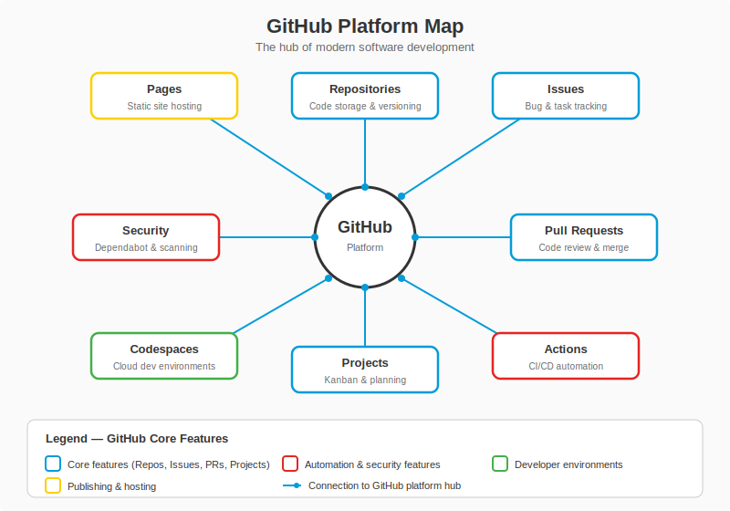

# Fase 1-3 — Servidor Multiplayer: GitHub (Repos, Issues, PRs, Projects)

---

## Change Log

| Versao | Data       | Autor        | Descricao                     |
|--------|------------|--------------|-------------------------------|
| 1.0.0  | 2026-03-18 | Paula Silva  | Criacao inicial (Edicao Mario)|

---

## Sumario

- [Prologo — De Jogador Solo a Multiplayer](#prologo--de-jogador-solo-a-multiplayer)
- [1. O que e o GitHub?](#1-o-que-e-o-github)
  - [1.1 Git vs GitHub — Memory Card vs Servidor Online](#11-git-vs-github--memory-card-vs-servidor-online)
  - [1.2 Por que o GitHub?](#12-por-que-o-github)
  - [1.3 Tabela: GitHub vs Servidor Multiplayer do Mario](#13-tabela-github-vs-servidor-multiplayer-do-mario)
- [2. Criando sua Conta — Entrando no Servidor](#2-criando-sua-conta--entrando-no-servidor)
  - [2.1 Passo a Passo](#21-passo-a-passo)
  - [2.2 Seu Perfil — A Ficha do Jogador](#22-seu-perfil--a-ficha-do-jogador)
- [3. Repositorios no GitHub — Mundos Compartilhados](#3-repositorios-no-github--mundos-compartilhados)
  - [3.1 Criando seu Primeiro Repositorio no GitHub](#31-criando-seu-primeiro-repositorio-no-github)
  - [3.2 README.md — A Tela de Titulo do Jogo](#32-readmemd--a-tela-de-titulo-do-jogo)
  - [3.3 Publico vs Privado](#33-publico-vs-privado)
- [4. Push e Pull — Upload e Download de Saves](#4-push-e-pull--upload-e-download-de-saves)
  - [4.1 Conectando Local ao Remoto](#41-conectando-local-ao-remoto)
  - [4.2 git push — Subindo Saves para o Servidor](#42-git-push--subindo-saves-para-o-servidor)
  - [4.3 git pull — Baixando Saves do Servidor](#43-git-pull--baixando-saves-do-servidor)
  - [4.4 Diagrama: Fluxo Local-Remoto](#44-diagrama-fluxo-local-remoto)
- [5. Clone e Fork — Copiando Jogos](#5-clone-e-fork--copiando-jogos)
  - [5.1 git clone — Baixar uma Copia do Jogo](#51-git-clone--baixar-uma-copia-do-jogo)
  - [5.2 Fork — Criar sua Propria Versao](#52-fork--criar-sua-propria-versao)
  - [5.3 Tabela: Clone vs Fork](#53-tabela-clone-vs-fork)
- [6. Issues — O Quadro de Missoes](#6-issues--o-quadro-de-missoes)
  - [6.1 O que sao Issues?](#61-o-que-sao-issues)
  - [6.2 Criando uma Issue](#62-criando-uma-issue)
  - [6.3 Labels — Tags de Tipo de Missao](#63-labels--tags-de-tipo-de-missao)
  - [6.4 Templates de Issue](#64-templates-de-issue)
- [7. Pull Requests — Pedido de Aceite](#7-pull-requests--pedido-de-aceite)
  - [7.1 O que e um Pull Request?](#71-o-que-e-um-pull-request)
  - [7.2 O Fluxo Completo de um PR](#72-o-fluxo-completo-de-um-pr)
  - [7.3 Code Review — Inspecao do Time](#73-code-review--inspecao-do-time)
  - [7.4 Diagrama: Ciclo de Vida de um PR](#74-diagrama-ciclo-de-vida-de-um-pr)
- [8. Projects — O Mapa da Campanha](#8-projects--o-mapa-da-campanha)
  - [8.1 O que sao GitHub Projects?](#81-o-que-sao-github-projects)
  - [8.2 Colunas Tipicas](#82-colunas-tipicas)
  - [8.3 Automatizacoes](#83-automatizacoes)
- [9. Branches no GitHub — Universos Paralelos Online](#9-branches-no-github--universos-paralelos-online)
  - [9.1 Branch Protection Rules](#91-branch-protection-rules)
  - [9.2 O Fluxo de Trabalho Multiplayer](#92-o-fluxo-de-trabalho-multiplayer)
- [10. Codespaces — A Arcade na Nuvem](#10-codespaces--a-arcade-na-nuvem)
  - [10.1 O que e Codespaces?](#101-o-que-e-codespaces)
  - [10.2 Quando Usar](#102-quando-usar)
- [11. Funcoes Extras do GitHub](#11-funcoes-extras-do-github)
  - [11.1 GitHub Pages — Publicar seu Jogo](#111-github-pages--publicar-seu-jogo)
  - [11.2 GitHub Discussions](#112-github-discussions)
  - [11.3 GitHub Releases](#113-github-releases)
- [Resumo — O que Aprendemos na Fase 1-3](#resumo--o-que-aprendemos-na-fase-1-3)
- [Referencias](#referencias)

---

## Prologo — De Jogador Solo a Multiplayer

<div align="center">

<br><em>Mapa da plataforma GitHub e seus recursos</em>
</div>

Ate agora, Sofia estava jogando sozinha. Ela tinha seu console (VS Code), seu memory card (Git), e construia fases no conforto da sua sala. Mas lhe faltava algo: **outros jogadores**.

No Mario solo, voce faz tudo sozinha. Mas no Mario multiplayer, algo magico acontece — um jogador cria uma fase, outro testa, outro sugere melhorias, e juntos constroem algo muito maior do que qualquer um faria sozinho. O problema e: como conectar todos esses jogadores? Como compartilhar os saves? Como garantir que um jogador nao sobrescreva o trabalho do outro?

A resposta e simples: voce precisa de um **servidor multiplayer**. E o servidor multiplayer do desenvolvimento de software chama-se **GitHub**.

"Ate agora voce jogou offline," disse a voz. "Agora e hora de conectar ao servidor. No GitHub, milhoes de jogadores ao redor do mundo compartilham seus jogos, colaboram em projetos, e constroem coisas incriveis juntos. E voce vai fazer parte disso."

---

## 1. O que e o GitHub?

### 1.1 Git vs GitHub — Memory Card vs Servidor Online

Uma confusao comum: **Git** e **GitHub** sao coisas diferentes.

| | Git | GitHub |
|--|-----|--------|
| **O que e** | Ferramenta de controle de versao | Plataforma web de hospedagem de repos |
| **Onde roda** | No SEU computador (local) | Na NUVEM (servidores remotos) |
| **Funcao** | Rastrear alteracoes, fazer commits, branches | Hospedar repos online, colaborar, PR, Issues |
| **Analogia Mario** | O **memory card** (salva localmente) | O **servidor multiplayer online** (conecta jogadores) |
| **Precisa de internet?** | Nao | Sim |
| **Quem criou** | Linus Torvalds (2005) | Tom Preston-Werner, Chris Wanstrath (2008) |
| **Alternativas** | Mercurial, SVN | GitLab, Bitbucket, Azure DevOps |

> **ANALOGIA MARIO:** Git e o **memory card** — funciona offline, salva no seu console. GitHub e o **servidor online** — quando voce conecta ao Wi-Fi, seus saves vao para a nuvem e outros jogadores podem acessar. Voce pode jogar offline com Git o dia inteiro, mas quando quer compartilhar ou colaborar, sobe para o GitHub.

### 1.2 Por que o GitHub?

- **100+ milhoes de desenvolvedores** usam GitHub
- E onde vive a maior parte do **codigo open-source do mundo**
- Integrado nativamente com **VS Code**, **Git**, **GitHub Copilot**, **GitHub Actions**
- Gratuito para uso pessoal e projetos open-source
- Pertence a **Microsoft** desde 2018


### 1.3 Tabela: GitHub vs Servidor Multiplayer do Mario

| Funcao GitHub | O que Faz | Analogia Mario |
|--------------|-----------|----------------|
| **Repository** | Hospeda o codigo do projeto | O **mundo do jogo** online — todas as fases hospedadas no servidor |
| **Push** | Envia commits locais para o servidor | **Upload do save** — manda seu progresso para a nuvem |
| **Pull** | Baixa commits do servidor para o local | **Download de updates** — traz o progresso mais recente |
| **Clone** | Copia um repositorio inteiro para seu computador | **Baixar o jogo** — copia completa para jogar offline |
| **Fork** | Cria uma copia independente de um repo no seu perfil | **Criar sua versao do jogo** — baseada no original, mas sua |
| **Pull Request** | Pede para suas alteracoes serem aceitas no projeto principal | **"Ei time, aceitem minhas mudancas!"** — proposta formal |
| **Issues** | Registra bugs, tarefas, ideias | **Quadro de missoes (Quest Board)** — lista de quests |
| **Projects** | Organiza Issues em boards visuais | **Mapa da campanha** — mostra progresso geral |
| **Codespaces** | Ambiente de desenvolvimento na nuvem | **Arcade na nuvem** — joga de qualquer computador |
| **Profile** | Seu perfil publico com contribuicoes | **Ficha do jogador** — stats, conquistas, historico |

---

## 2. Criando sua Conta — Entrando no Servidor

### 2.1 Passo a Passo

1. Acesse **https://github.com**
2. Clique em **"Sign up"**
3. Insira seu **email**
4. Crie um **username** (seu nome de jogador — escolha bem, vai te acompanhar na carreira)
5. Crie uma **senha forte**
6. Verifique seu email
7. Pronto — voce esta no servidor!

> **Dica de Veterano:** Seu username do GitHub e como seu **gamertag**. Escolha algo profissional e memoravel. Recrutadores e empresas vao ve-lo. "sofia-dev" e melhor que "xXx_DarkCoder_xXx".

### 2.2 Seu Perfil — A Ficha do Jogador

Seu perfil no GitHub mostra:
- **Foto** (avatar do personagem)
- **Bio** (descricao do jogador)
- **Repositorios** (jogos criados)
- **Contribution Graph** (o famoso "tapete verde" — mostra sua atividade diaria)
- **Followers/Following** (amigos no servidor)

O Contribution Graph e especialmente motivador — cada quadradinho verde representa um dia em que voce fez commits. Quanto mais verde, mais ativo. Muitos desenvolvedores tratam como uma sequencia de "dias jogados consecutivos" — manter o streak.

---

## 3. Repositorios no GitHub — Mundos Compartilhados

### 3.1 Criando seu Primeiro Repositorio no GitHub

**Pelo site:**
1. Clique no `+` no canto superior direito
2. Selecione **"New repository"**
3. Preencha:
   - **Repository name:** `mushroom-kingdom`
   - **Description:** "Meu primeiro projeto — Aprendendo desenvolvimento de software"
   - **Visibility:** Public (para outros jogadores verem)
   - Marque **"Add a README file"**
4. Clique **"Create repository"**

**Pelo terminal (com GitHub CLI):**
```bash
gh repo create mushroom-kingdom --public --description "Meu primeiro projeto"
```

### 3.2 README.md — A Tela de Titulo do Jogo

O arquivo `README.md` e a **primeira coisa** que qualquer pessoa ve ao visitar seu repositorio. E a **tela de titulo** do seu jogo.

Um bom README contem:
- **Nome do projeto** (titulo do jogo)
- **Descricao** (sobre o que e o jogo)
- **Como instalar/rodar** (como ligar o console e jogar)
- **Como contribuir** (como outros jogadores podem ajudar)
- **Licenca** (regras de uso)

Exemplo basico em Markdown:

```markdown
# Mushroom Kingdom

Meu primeiro projeto de desenvolvimento de software!

## Como rodar

1. Clone o repositorio: `git clone https://github.com/sofia/mushroom-kingdom.git`
2. Entre na pasta: `cd mushroom-kingdom`
3. Execute: `node fase1-1.js`

## Tecnologias

- JavaScript
- Node.js
```

### 3.3 Publico vs Privado

| Tipo | Quem pode ver | Analogia Mario |
|------|--------------|----------------|
| **Public** | Qualquer pessoa na internet | Jogo **open-world** — qualquer jogador pode entrar e explorar |
| **Private** | So voce e quem voce convidar | Jogo **privado** — so jogadores convidados entram |

---

## 4. Push e Pull — Upload e Download de Saves

### 4.1 Conectando Local ao Remoto

Para conectar seu repositorio local (computador) ao repositorio remoto (GitHub):

```bash
# Se voce ja tem um repo local e criou um no GitHub
git remote add origin https://github.com/seu-usuario/mushroom-kingdom.git
git branch -M main
git push -u origin main
```

Ou, se preferir clonar o repositorio do GitHub primeiro:
```bash
git clone https://github.com/seu-usuario/mushroom-kingdom.git
cd mushroom-kingdom
```

### 4.2 git push — Subindo Saves para o Servidor

```bash
git push origin main
```

Isso envia todos os seus commits locais para o GitHub.

> **ANALOGIA MARIO:** `git push` e como **fazer upload do seu save para a nuvem**. Seus saves locais (memory card) sao copiados para o servidor. Agora, mesmo se seu console explodir, seus saves estao seguros na nuvem. Alem disso, outros jogadores podem baixar seus saves.

### 4.3 git pull — Baixando Saves do Servidor

```bash
git pull origin main
```

Isso baixa os commits mais recentes do GitHub para seu computador.

> **ANALOGIA MARIO:** `git pull` e como **baixar a atualizacao mais recente do jogo**. Se outro jogador fez alteracoes e subiu para o servidor, voce precisa baixar essas alteracoes para ter a versao mais atualizada.

### 4.4 Diagrama: Fluxo Local-Remoto

```
+---------------------------+                    +---------------------------+
|     SEU COMPUTADOR        |                    |     GITHUB (Servidor)     |
|                           |                    |                           |
|  Working → Staging → Repo |  --- git push -->  |  Repositorio Remoto       |
|  Directory   Area   (.git)|                    |  (origin/main)            |
|                           |  <-- git pull ---  |                           |
|  "Seu console + memory    |                    |  "Servidor multiplayer    |
|   card pessoal"           |                    |   na nuvem"               |
+---------------------------+                    +---------------------------+
                                                          |
                                                    git clone
                                                          |
                                                          v
                                                 +---------------------------+
                                                 |  COMPUTADOR DE OUTRO      |
                                                 |  JOGADOR                  |
                                                 |                           |
                                                 |  "Outro console que       |
                                                 |   baixou o mesmo jogo"    |
                                                 +---------------------------+
```

---

## 5. Clone e Fork — Copiando Jogos

### 5.1 git clone — Baixar uma Copia do Jogo

`git clone` copia um repositorio inteiro do GitHub para seu computador, incluindo todo o historico de commits.

```bash
git clone https://github.com/usuario/projeto.git
```

> **ANALOGIA MARIO:** `git clone` e como **baixar o jogo inteiro** do servidor para jogar no seu console. Voce recebe todas as fases, todos os saves, tudo. E agora pode jogar offline.

### 5.2 Fork — Criar sua Propria Versao

Um **fork** e diferente de um clone. Quando voce faz fork de um repositorio no GitHub, uma **copia independente** e criada no seu perfil. Voce pode modificar tudo que quiser sem afetar o original.

Para fazer fork:
1. Va ate o repositorio no GitHub
2. Clique no botao **"Fork"** no canto superior direito
3. Selecione seu perfil como destino

> **ANALOGIA MARIO:** Fork e como **criar sua propria versao do jogo**. Voce pega o "Super Mario Bros" original e cria o "Super Sofia Bros" — baseado no original, mas agora e SEU. Voce pode mudar fases, adicionar personagens, mudar regras. O jogo original nao e afetado.

### 5.3 Tabela: Clone vs Fork

| | Clone | Fork |
|--|-------|------|
| **Onde fica** | No seu computador | No seu perfil GitHub |
| **Vinculo com original** | Aponta para o repo original | Copia independente |
| **Permissao para push** | So se voce tiver acesso | Sempre (e seu!) |
| **Quando usar** | Trabalhar num repo que voce tem acesso | Contribuir para projetos de terceiros |
| **Analogia** | Baixar o jogo para jogar | Criar sua versao do jogo |

---

## 6. Issues — O Quadro de Missoes

### 6.1 O que sao Issues?

**Issues** sao como um **quadro de missoes (Quest Board)** do jogo. Cada Issue e uma missao — pode ser:
- Um **bug** a corrigir (inimigo a derrotar)
- Uma **feature** a criar (nova fase a construir)
- Uma **melhoria** a fazer (upgrade de equipamento)
- Uma **pergunta** do time (pedido de ajuda na taverna)

> **ANALOGIA MARIO:** Issues sao o **quadro de missoes na praca da vila**. Qualquer jogador pode olhar o quadro e ver: "Missao 1: Consertar ponte quebrada no World 2. Missao 2: Construir nova fase secreta. Missao 3: Bug — Goomba atravessando parede." Jogadores escolhem missoes e vao trabalhar nelas.

### 6.2 Criando uma Issue

No repositorio no GitHub:
1. Clique na aba **"Issues"**
2. Clique **"New issue"**
3. Preencha:
   - **Title:** Titulo curto e claro
   - **Description:** Detalhes da missao
   - **Labels:** Categorias (bug, enhancement, etc.)
   - **Assignees:** Quem vai trabalhar nisso
4. Clique **"Submit new issue"**

Exemplo:
```
Title: Bug — Contagem de moedas nao atualiza apos coletar
Description:
Quando o jogador coleta uma moeda, o placar nao atualiza.

Passos para reproduzir:
1. Executar `node fase1-1.js`
2. Coletar uma moeda
3. Observar que o placar mostra 0

Esperado: Placar deveria mostrar 1
```

### 6.3 Labels — Tags de Tipo de Missao

| Label | Cor | Significado | Analogia Mario |
|-------|-----|-----------|----------------|
| `bug` | Vermelho | Algo esta quebrado | Inimigo a derrotar |
| `enhancement` | Azul | Nova funcionalidade | Nova fase a construir |
| `documentation` | Amarelo | Documentacao | Atualizar o manual |
| `good first issue` | Verde | Boa para iniciantes | Missao facil para novos jogadores |
| `help wanted` | Verde | Precisa de ajuda | Pedido de reforcos |
| `priority: high` | Vermelho | Urgente | Boss battle urgente |

### 6.4 Templates de Issue

Voce pode criar templates para padronizar as Issues. E como ter **formularios pre-prontos** no quadro de missoes:

- Template de **Bug Report**: campos para passos de reproducao, resultado esperado, resultado atual
- Template de **Feature Request**: descricao, motivacao, alternativas consideradas

---

## 7. Pull Requests — Pedido de Aceite

### 7.1 O que e um Pull Request?

Um **Pull Request (PR)** e uma proposta formal para incluir suas alteracoes no codigo principal. E o mecanismo central de colaboracao no GitHub.

> **ANALOGIA MARIO:** Imagine que voce construiu uma nova fase secreta para o jogo. Voce nao pode simplesmente inserir no jogo principal — precisa mostrar para o time: "Olha, construi essa fase. Podem testar? Podem revisar? Se estiver tudo certo, incluam no jogo." Esse processo e um Pull Request. Voce esta dizendo: **"Ei time, aceitem minhas mudancas!"**

### 7.2 O Fluxo Completo de um PR

```
1. Criar branch local       → git switch -c feature-moedas
2. Fazer alteracoes          → (editar codigo)
3. Commit                    → git commit -m "feat: adicionar moedas"
4. Push da branch            → git push origin feature-moedas
5. Criar PR no GitHub        → (pelo site ou CLI)
6. Revisao pelo time         → (code review)
7. Aprovacao e merge         → (botao Merge no GitHub)
8. Branch deletada           → (limpeza)
```

**Criando um PR pelo terminal:**
```bash
gh pr create --title "feat: adicionar sistema de moedas" --body "Adicionei contagem de moedas na fase 1-1"
```

**Criando pelo site:**
1. Va ao repositorio no GitHub
2. Clique em **"Pull requests"**
3. Clique **"New pull request"**
4. Selecione a branch de origem e destino
5. Preencha titulo e descricao
6. Clique **"Create pull request"**

### 7.3 Code Review — Inspecao do Time

Antes de um PR ser aceito, outros membros do time **revisam** o codigo:
- **Comentarios** em linhas especificas: "Essa variavel deveria ter outro nome"
- **Aprovacao** (Approve): "Tudo certo, pode mergear"
- **Pedido de mudancas** (Request changes): "Faltou tratar esse caso"

> **ANALOGIA MARIO:** Code Review e como quando **Toadette inspeciona a fase** antes de liberar para os jogadores. Ela testa cada salto, verifica cada bloco, checa se nao tem bugs. So quando ela aprova, a fase entra no jogo oficial.

### 7.4 Diagrama: Ciclo de Vida de um PR

```
  Branch criada          Codigo escrito         PR aberto
       |                      |                     |
       v                      v                     v
  [feature-moedas] → [commits feitos] → [PR no GitHub]
                                              |
                                        Code Review
                                         /        \
                                  Aprovado      Mudancas pedidas
                                     |               |
                                  [Merge]       [Dev corrige]
                                     |               |
                              Branch deletada    Novo commit
                                                     |
                                              [PR atualizado]
                                                     |
                                              [Review de novo]
```

---

## 8. Projects — O Mapa da Campanha

### 8.1 O que sao GitHub Projects?

**GitHub Projects** e uma ferramenta de gerenciamento de projeto integrada ao GitHub. Funciona como um **quadro Kanban** — colunas com cartoes que voce move conforme o trabalho avanca.

> **ANALOGIA MARIO:** Projects e o **mapa da campanha** do jogo. Voce ve todas as fases (Issues) organizadas em colunas: "Nao iniciadas", "Em progresso", "Completas". O mapa mostra o panorama geral — quais fases faltam, quais estao sendo jogadas, quais ja foram zeradas.

### 8.2 Colunas Tipicas

| Coluna | Significado | Analogia Mario |
|--------|-----------|----------------|
| **Backlog** | Tarefas identificadas mas nao priorizadas | Fases descobertas mas nao exploradas |
| **To Do** | Proximas tarefas a trabalhar | Proximas fases na fila |
| **In Progress** | Tarefas sendo executadas agora | Fase em andamento — alguem jogando |
| **In Review** | Tarefas prontas aguardando revisao (PR) | Fase construida, Toadette inspecionando |
| **Done** | Tarefas concluidas | Fase completa — bandeira fincada |

### 8.3 Automatizacoes

GitHub Projects pode mover cartoes automaticamente:
- Issue criada → vai para "Backlog"
- PR aberto vinculado a Issue → move para "In Review"
- PR merged → move para "Done"

> **ANALOGIA MARIO:** E como se o mapa da campanha se atualizasse sozinho. Quando voce entra numa fase, ela muda de cor. Quando voce completa, a bandeira aparece. Sem precisar atualizar manualmente.

---

## 9. Branches no GitHub — Universos Paralelos Online

### 9.1 Branch Protection Rules

No GitHub, voce pode proteger a branch `main` com regras:

| Regra | O que Faz | Analogia Mario |
|-------|-----------|----------------|
| **Require PR** | Ninguem faz push direto na main | Nenhuma fase entra no jogo sem inspecao |
| **Require Review** | Pelo menos 1 pessoa precisa aprovar | Toadette precisa aprovar antes |
| **Require Status Checks** | Testes automaticos precisam passar | Lakitu precisa validar do alto |
| **No Force Push** | Nao pode sobrescrever historico | Nao pode apagar saves antigos |

### 9.2 O Fluxo de Trabalho Multiplayer

O fluxo tipico de trabalho em equipe:

```
1. Pegar uma Issue (missao) do quadro
2. Criar uma branch para essa Issue
3. Trabalhar na branch (fazer commits)
4. Abrir um PR quando terminar
5. Time revisa o PR
6. Merge na main quando aprovado
7. Deletar a branch
8. Repetir
```

> **ANALOGIA MARIO:** Cada jogador pega uma missao do quadro, entra no seu universo paralelo (branch), completa a missao, mostra para o time (PR), e quando todos aprovam, o resultado e incorporado ao jogo principal (merge na main). Ninguem mexe no jogo principal diretamente — tudo passa pela inspecao.

---

## 10. Codespaces — A Arcade na Nuvem

### 10.1 O que e Codespaces?

**GitHub Codespaces** e um ambiente de desenvolvimento completo **na nuvem**. Com um clique, voce tem um VS Code rodando no navegador, com todo o codigo do repositorio pronto para editar.

> **ANALOGIA MARIO:** Codespaces e como uma **arcade na nuvem**. Voce nao precisa ter o console em casa — basta ir ate a arcade (abrir o navegador), sentar na cadeira, e jogar. O jogo ja esta la, configurado, pronto. Funciona de qualquer computador, de qualquer lugar. Perfeito quando voce esta no computador do trabalho, numa biblioteca, ou no celular de um amigo.

### 10.2 Quando Usar

| Situacao | Use Codespaces? |
|---------|----------------|
| Voce nao pode instalar nada no computador | Sim |
| Voce quer contribuir rapidamente para um projeto open-source | Sim |
| Voce esta em um computador diferente do habitual | Sim |
| Voce quer testar algo rapidamente sem setup | Sim |
| Voce tem seu computador configurado e internet instavel | Nao — use local |

Para abrir um Codespace:
1. Va ao repositorio no GitHub
2. Clique no botao verde **"Code"**
3. Selecione a aba **"Codespaces"**
4. Clique **"Create codespace on main"**

Em segundos, um VS Code completo abre no seu navegador.

---

## 11. Funcoes Extras do GitHub

### 11.1 GitHub Pages — Publicar seu Jogo

**GitHub Pages** permite transformar um repositorio em um **site acessivel pela internet** — gratuitamente.

> **ANALOGIA MARIO:** E como publicar seu jogo para que qualquer pessoa no mundo possa jogar. Sem precisar de um servidor proprio. O GitHub hospeda para voce.

### 11.2 GitHub Discussions

**Discussions** e um forum dentro do repositorio. Diferente de Issues (missoes), Discussions sao para conversas abertas, perguntas, ideias.

> **ANALOGIA MARIO:** Se Issues sao o quadro de missoes, Discussions e a **taverna** — o lugar onde jogadores conversam, trocam dicas, e discutem estrategias.

### 11.3 GitHub Releases

**Releases** sao versoes oficiais do projeto, com download e notas de atualizacao.

> **ANALOGIA MARIO:** Releases sao como as **versoes do jogo** — "Super Mario Bros v1.0", "Super Mario Bros v1.1 (patch de bugs)", "Super Mario Bros v2.0 (novos mundos)". Cada release marca um marco importante.

---

## Resumo — O que Aprendemos na Fase 1-3

| Conceito | O que E | Analogia Mario |
|----------|---------|----------------|
| **GitHub** | Plataforma de hospedagem de repositorios | Servidor multiplayer online |
| **Push** | Enviar commits para o servidor | Upload de save para a nuvem |
| **Pull** | Baixar commits do servidor | Download de atualizacoes |
| **Clone** | Copiar repositorio para o computador | Baixar o jogo completo |
| **Fork** | Criar copia independente no seu perfil | Criar sua versao do jogo |
| **Issues** | Registrar tarefas, bugs, ideias | Quadro de missoes (Quest Board) |
| **Pull Request** | Proposta de alteracoes para revisao | "Ei time, aceitem minhas mudancas!" |
| **Projects** | Quadro Kanban para gerenciar trabalho | Mapa da campanha |
| **Codespaces** | VS Code na nuvem | Arcade na nuvem |
| **Branch Protection** | Regras de protecao da branch main | Regras de inspecao obrigatoria |
| **README** | Descricao do projeto | Tela de titulo do jogo |

```
+-------------------------------------------+
|                                           |
|    FASE 1-3 COMPLETA!                     |
|                                           |
|    ★ Conta GitHub criada                  |
|    ★ Repositorio online criado            |
|    ★ Push e Pull dominados                |
|    ★ Issues e PRs entendidos              |
|    ★ Projects explorado                   |
|    ★ Codespaces experimentado             |
|                                           |
|    → Proxima fase: 1-4 GitHub Actions     |
|      (Os Lakitus Trabalhadores)           |
|                                           |
+-------------------------------------------+
```

---

## Referencias

- [GitHub — Site Oficial](https://github.com)
- [GitHub Docs — Getting Started](https://docs.github.com/en/get-started)
- [GitHub Docs — Issues](https://docs.github.com/en/issues)
- [GitHub Docs — Pull Requests](https://docs.github.com/en/pull-requests)
- [GitHub Docs — Projects](https://docs.github.com/en/issues/planning-and-tracking-with-projects)
- [GitHub Docs — Codespaces](https://docs.github.com/en/codespaces)
- [GitHub CLI (gh)](https://cli.github.com)
- [GitHub Pages](https://pages.github.com)
- [GitHub Skills — Cursos Interativos](https://skills.github.com)

---

*"Agora eu nao sou mais jogadora solo. Eu faco parte de um time." — Sofia, entrando no servidor multiplayer.*

---

<div align="center">

⬅️ [Anterior: Fase 1-2: Git](1-2-git.md) · 🗺️ [Mapa dos Mundos](../INDEX.md) · ➡️ [Proximo: Fase 1-4: GitHub Actions](1-4-github-actions.md)

</div>
