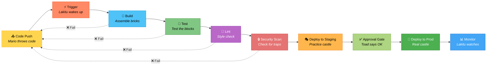

# Fase 1-4 — Os Lakitus Trabalhadores: GitHub Actions e CI/CD

---

## Change Log

| Versao | Data       | Autor        | Descricao                     |
|--------|------------|--------------|-------------------------------|
| 1.0.0  | 2026-03-18 | Paula Silva  | Criacao inicial (Edicao Mario)|

---

## Sumario

- [Prologo — O Lakitu que Trabalha para Voce](#prologo--o-lakitu-que-trabalha-para-voce)
- [1. O Problema: Tarefas Repetitivas](#1-o-problema-tarefas-repetitivas)
  - [1.1 O Ciclo Manual Cansativo](#11-o-ciclo-manual-cansativo)
  - [1.2 O que Poderia Ser Automatizado?](#12-o-que-poderia-ser-automatizado)
- [2. O que e CI/CD?](#2-o-que-e-cicd)
  - [2.1 CI — Integracao Continua](#21-ci--integracao-continua)
  - [2.2 CD — Entrega/Deploy Continuo](#22-cd--entregadeploy-continuo)
  - [2.3 Tabela: CI/CD vs Lakitu](#23-tabela-cicd-vs-lakitu)
  - [2.4 Diagrama: O Pipeline CI/CD](#24-diagrama-o-pipeline-cicd)
- [3. O que e GitHub Actions?](#3-o-que-e-github-actions)
  - [3.1 A Plataforma de Automacao do GitHub](#31-a-plataforma-de-automacao-do-github)
  - [3.2 Vocabulario Essencial](#32-vocabulario-essencial)
  - [3.3 Tabela: Vocabulario de Actions vs Mario](#33-tabela-vocabulario-de-actions-vs-mario)
- [4. YAML — O Pergaminho de Instrucoes do Lakitu](#4-yaml--o-pergaminho-de-instrucoes-do-lakitu)
  - [4.1 O que e YAML?](#41-o-que-e-yaml)
  - [4.2 Regras Basicas do YAML](#42-regras-basicas-do-yaml)
  - [4.3 Exemplo Comentado](#43-exemplo-comentado)
- [5. Seu Primeiro Workflow — Acordando o Lakitu](#5-seu-primeiro-workflow--acordando-o-lakitu)
  - [5.1 Estrutura de Diretorios](#51-estrutura-de-diretorios)
  - [5.2 Workflow "Hello Mushroom Kingdom"](#52-workflow-hello-mushroom-kingdom)
  - [5.3 Explicacao Linha por Linha](#53-explicacao-linha-por-linha)
  - [5.4 Executando o Workflow](#54-executando-o-workflow)
- [6. Triggers — Quando o Lakitu Acorda](#6-triggers--quando-o-lakitu-acorda)
  - [6.1 Tipos de Triggers](#61-tipos-de-triggers)
  - [6.2 Tabela de Triggers Comuns](#62-tabela-de-triggers-comuns)
  - [6.3 Exemplos Praticos](#63-exemplos-praticos)
- [7. Jobs e Steps — As Tarefas do Lakitu](#7-jobs-e-steps--as-tarefas-do-lakitu)
  - [7.1 Jobs — Blocos de Trabalho](#71-jobs--blocos-de-trabalho)
  - [7.2 Steps — Passos Individuais](#72-steps--passos-individuais)
  - [7.3 Runners — Onde o Lakitu Trabalha](#73-runners--onde-o-lakitu-trabalha)
  - [7.4 Diagrama: Workflow > Jobs > Steps](#74-diagrama-workflow--jobs--steps)
- [8. Actions do Marketplace — Power-Ups para o Lakitu](#8-actions-do-marketplace--power-ups-para-o-lakitu)
  - [8.1 O que sao Actions Reutilizaveis?](#81-o-que-sao-actions-reutilizaveis)
  - [8.2 Actions Essenciais](#82-actions-essenciais)
- [9. Exemplos Praticos de Workflows](#9-exemplos-praticos-de-workflows)
  - [9.1 Workflow de CI Basico (Testar a cada Push)](#91-workflow-de-ci-basico-testar-a-cada-push)
  - [9.2 Workflow de Lint (Verificar Qualidade)](#92-workflow-de-lint-verificar-qualidade)
  - [9.3 Workflow com Deploy (CD)](#93-workflow-com-deploy-cd)
- [10. Vendo os Resultados — O Relatorio do Lakitu](#10-vendo-os-resultados--o-relatorio-do-lakitu)
  - [10.1 A Aba Actions no GitHub](#101-a-aba-actions-no-github)
  - [10.2 Status dos Workflows](#102-status-dos-workflows)
  - [10.3 Badges — Selos de Qualidade](#103-badges--selos-de-qualidade)
- [11. Secrets — Chaves Secretas do Lakitu](#11-secrets--chaves-secretas-do-lakitu)
- [Resumo — O que Aprendemos na Fase 1-4](#resumo--o-que-aprendemos-na-fase-1-4)
- [Referencias](#referencias)

---

## Prologo — O Lakitu que Trabalha para Voce

Voce conhece o Lakitu? Aquele personagem do Mario que fica flutuando numa nuvem, olhando tudo la de cima? No jogo original, Lakitu e um inimigo — fica jogando Spinies (aqueles bichos espinhosos) na sua cabeca.

Mas imagine se o Lakitu trabalhasse PARA voce em vez de CONTRA voce. Imagine se toda vez que voce terminasse uma fase, o Lakitu automaticamente verificasse se voce pegou todas as moedas, testasse se os blocos estao no lugar certo, e so liberasse a proxima fase se tudo estivesse perfeito.

Isso e **GitHub Actions**. E isso e **CI/CD**.

Na Fase 1-4, voce vai domesticar o Lakitu. Em vez de jogar Spinies na sua cabeca, ele vai trabalhar para voce — automatizando todas aquelas tarefas repetitivas que ninguem gosta de fazer manualmente. Testar codigo? Lakitu faz. Verificar qualidade? Lakitu faz. Publicar o projeto? Lakitu faz.

"O melhor funcionario e aquele que trabalha 24 horas por dia, nunca reclama, nunca esquece, e faz tudo exatamente como foi instruido," disse a voz. "Esse funcionario e o Lakitu."

---

## 1. O Problema: Tarefas Repetitivas

### 1.1 O Ciclo Manual Cansativo

Sem automacao, o ciclo de desenvolvimento e assim:

```
1. Escrever codigo
2. Salvar
3. Testar manualmente ("funcionou aqui...")
4. Fazer commit
5. Push para o GitHub
6. Pedir para alguem revisar
7. Alguem testa manualmente de novo
8. Merge
9. Fazer deploy manualmente (copiar arquivos para o servidor)
10. Verificar se o deploy funcionou
11. Rezar para nao ter quebrado nada
```

Os passos 3, 7, 9, 10 e 11 sao **manuais, repetitivos, e propensos a erro**. Humanos esquecem. Humanos pulam etapas. Humanos ficam cansados.

### 1.2 O que Poderia Ser Automatizado?

| Tarefa Manual | Problema | Solucao Automatizada |
|--------------|---------|---------------------|
| Rodar testes | Esquecemos de rodar | CI roda toda vez automaticamente |
| Verificar formatacao | Estilo inconsistente | Lint automatico a cada push |
| Build do projeto | Funciona na minha maquina, nao na sua | Build em ambiente padronizado |
| Deploy | Processo longo e manual | Deploy automatico quando testes passam |
| Notificar o time | Esquecemos de avisar | Notificacao automatica |

> **ANALOGIA MARIO:** Imagine se toda vez que Mario completasse uma fase, ele precisasse MANUALMENTE verificar: "Peguei todas as moedas? Os blocos estao no lugar? Nao tem inimigos escondidos? O caminho esta livre?" Seria exaustivo. Em vez disso, o Lakitu faz tudo isso automaticamente la de cima — e so libera a proxima fase quando tudo esta certo.

---

## 2. O que e CI/CD?

### 2.1 CI — Integracao Continua

**CI (Continuous Integration)** e a pratica de **integrar** (juntar) o codigo de todos os membros do time **frequentemente** (a cada push ou PR), com **verificacao automatica** (testes, lint, build).

Em termos simples: toda vez que alguem faz push, um Lakitu automaticamente:
1. Pega o codigo mais recente
2. Roda os testes
3. Verifica a qualidade
4. Reporta se esta tudo OK ou nao

> **ANALOGIA MARIO:** CI e o **Lakitu inspetor** que paira sobre cada fase. Toda vez que um jogador termina de construir algo, o Lakitu automaticamente desce da nuvem e inspeciona: "Os blocos estao alinhados? Os canos funcionam? Os inimigos estao nos lugares certos? Tudo verificado — fase aprovada!" Ou: "Encontrei um bloco fora do lugar na linha 42. Fase REPROVADA. Volte e corrija."

### 2.2 CD — Entrega/Deploy Continuo

**CD (Continuous Delivery/Deployment)** e a pratica de **entregar** ou **publicar** o software automaticamente apos os testes passarem.

- **Continuous Delivery** = o software esta PRONTO para publicar a qualquer momento (um botao)
- **Continuous Deployment** = o software e publicado AUTOMATICAMENTE quando os testes passam

> **ANALOGIA MARIO:** CD e o **Lakitu transportador**. Depois que o Lakitu inspetor aprova a fase, o Lakitu transportador automaticamente pega a fase e a coloca no jogo para os jogadores acessarem. Sem intervencao manual. A fase sai do "modo construcao" e vai direto para "modo jogavel."

### 2.3 Tabela: CI/CD vs Lakitu

| Conceito | O que Faz | Analogia Mario |
|----------|-----------|----------------|
| **CI** | Testa codigo automaticamente a cada push | Lakitu inspetor — verifica tudo la de cima |
| **CD** | Publica automaticamente quando testes passam | Lakitu transportador — leva a fase ate os jogadores |
| **Pipeline** | A sequencia completa CI + CD | O caminho que o Lakitu percorre: inspecionar → aprovar → transportar |
| **Build** | Compilar/preparar o codigo | Construir a fase a partir do projeto |
| **Test** | Rodar testes automaticos | Testar se a fase funciona corretamente |
| **Deploy** | Publicar em producao | Liberar a fase para os jogadores reais |

### Diagrama: Pipeline CI/CD



### 2.4 Diagrama: O Pipeline CI/CD

```
  Desenvolvedor         Lakitu CI              Lakitu CD
  faz Push              (Inspecao)             (Transporte)
       |                     |                      |
       v                     v                      v
  [git push] --------→ [Build] --------→ [Staging] --------→ [Producao]
                           |                                       |
                        [Test]                              [Usuarios
                           |                                 reais!]
                        [Lint]
                           |
                      Passou? ----→ NAO → Rejeitar (feedback ao dev)
                           |
                          SIM
                           |
                    [Aprovar para CD]
```

---

## 3. O que e GitHub Actions?

### 3.1 A Plataforma de Automacao do GitHub

**GitHub Actions** e a ferramenta de automacao integrada ao GitHub. Com ela, voce pode configurar **workflows** (fluxos de trabalho automatizados) que sao executados em resposta a **eventos** no seu repositorio.

Em essencia: voce escreve um arquivo que diz ao Lakitu exatamente o que fazer e quando. O Lakitu segue as instrucoes fielmente.

### 3.2 Vocabulario Essencial

Antes de comecar, vamos definir os termos:

| Termo | Definicao | Analogia Mario |
|-------|----------|----------------|
| **Workflow** | Processo automatizado completo (arquivo YAML) | O **pergaminho de instrucoes** do Lakitu |
| **Event/Trigger** | O que dispara o workflow | O **alarme** que acorda o Lakitu |
| **Job** | Um bloco de trabalho dentro do workflow | Uma **missao** que o Lakitu precisa completar |
| **Step** | Um passo individual dentro de um job | Uma **acao unica** dentro da missao |
| **Runner** | A maquina onde o job executa | A **nuvem** onde o Lakitu trabalha |
| **Action** | Componente reutilizavel (plugin) | **Power-up** que da habilidades extras ao Lakitu |
| **Artifact** | Arquivo gerado pelo workflow | **Item** que o Lakitu coletou durante a missao |
| **Secret** | Variavel sensivel (senha, token) | **Chave secreta** guardada no bolso do Lakitu |

### 3.3 Tabela: Vocabulario de Actions vs Mario

| GitHub Actions | Descricao Tecnica | Equivalente Mario |
|---------------|-------------------|-------------------|
| **Workflow file (.yml)** | Arquivo YAML com instrucoes | Pergaminho do Lakitu com instrucoes passo-a-passo |
| **on: push** | Trigger: quando alguem faz push | Lakitu acorda quando um jogador termina a fase |
| **on: pull_request** | Trigger: quando um PR e aberto | Lakitu acorda quando alguem propoe mudancas |
| **on: schedule** | Trigger: agendamento (cron) | Lakitu tem um despertador — acorda todo dia as 6h |
| **jobs:** | Lista de blocos de trabalho | Lista de missoes do Lakitu |
| **runs-on: ubuntu-latest** | SO da maquina virtual | Tipo de nuvem do Lakitu (Ubuntu, Windows, macOS) |
| **steps:** | Passos dentro do job | Checklist da missao |
| **uses: actions/checkout** | Usar uma action pre-pronta | Lakitu equipa um power-up reutilizavel |
| **run:** | Executar um comando shell | Lakitu executa uma acao diretamente |

---

## 4. YAML — O Pergaminho de Instrucoes do Lakitu

### 4.1 O que e YAML?

**YAML** (YAML Ain't Markup Language) e um formato de arquivo para dados estruturados. E como uma **lista organizada** que humanos conseguem ler facilmente.

> **ANALOGIA MARIO:** YAML e o formato do **pergaminho de instrucoes** do Lakitu. Em vez de instrucoes confusas e embaralhadas, o YAML organiza tudo em niveis claros, com espacos que indicam hierarquia. E como se o pergaminho dissesse:
> ```
> Missao: Inspecionar Fase 1-1
>   Passos:
>     - Verificar blocos
>     - Contar moedas
>     - Testar canos
> ```

### 4.2 Regras Basicas do YAML

```yaml
# Isso e um comentario

# Chave e valor simples
nome: "Sofia"
idade: 15
nivel: iniciante

# Listas (comecam com -)
ferramentas:
  - VS Code
  - Git
  - Node.js

# Objetos aninhados (indentacao com 2 espacos!)
jogador:
  nome: "Mario"
  vidas: 3
  inventario:
    - Super Mushroom
    - Fire Flower
```

**Regras de ouro:**
1. **Use espacos, NUNCA tabs** (2 espacos por nivel)
2. **Indentacao importa** — define a hierarquia
3. **Strings com caracteres especiais** devem estar entre aspas
4. **Listas** comecam com `-`

### 4.3 Exemplo Comentado

```yaml
# Nome do workflow (aparece na aba Actions do GitHub)
name: CI - Lakitu Inspeciona

# Quando o Lakitu acorda (trigger)
on:
  push:
    branches: [main]

# O que o Lakitu faz (jobs)
jobs:
  inspecionar:                    # Nome do job
    runs-on: ubuntu-latest        # Tipo de nuvem
    steps:                        # Passos da missao
      - name: Baixar codigo       # Descricao do passo
        uses: actions/checkout@v4 # Usar action pre-pronta

      - name: Rodar testes        # Descricao do passo
        run: npm test             # Comando a executar
```

---

## 5. Seu Primeiro Workflow — Acordando o Lakitu

### 5.1 Estrutura de Diretorios

Workflows vivem numa pasta especifica:

```
mushroom-kingdom/
├── .github/
│   └── workflows/
│       └── hello.yml          ← Seu primeiro workflow!
├── fase1-1.js
└── README.md
```

### 5.2 Workflow "Hello Mushroom Kingdom"

Crie o arquivo `.github/workflows/hello.yml`:

```yaml
name: Hello Mushroom Kingdom

on:
  push:
    branches: [main]
  workflow_dispatch:

jobs:
  saudacao:
    runs-on: ubuntu-latest
    steps:
      - name: Saudar o heroi
        run: echo "Bem-vinda ao Mushroom Kingdom, Sofia!"

      - name: Mostrar informacoes
        run: |
          echo "==================================="
          echo "  LAKITU REPORT"
          echo "==================================="
          echo "Data: $(date)"
          echo "Runner: $(uname -a)"
          echo "Evento: ${{ github.event_name }}"
          echo "Branch: ${{ github.ref_name }}"
          echo "Autor: ${{ github.actor }}"
          echo "==================================="

      - name: Fase completa
        run: echo "Lakitu concluiu a inspecao com sucesso!"
```

### 5.3 Explicacao Linha por Linha

| Linha | Significado | Analogia |
|-------|-----------|----------|
| `name: Hello Mushroom Kingdom` | Nome do workflow | Titulo da missao do Lakitu |
| `on: push: branches: [main]` | Dispara quando push na main | Lakitu acorda quando alguem faz push na main |
| `workflow_dispatch:` | Permite disparar manualmente | Botao para acordar o Lakitu na marra |
| `jobs:` | Inicio da lista de jobs | Inicio da lista de missoes |
| `saudacao:` | Nome do job | Nome da missao |
| `runs-on: ubuntu-latest` | Roda em maquina Ubuntu | Tipo de nuvem do Lakitu |
| `steps:` | Passos do job | Checklist da missao |
| `- name: ...` | Descricao do passo | Descricao da acao |
| `run: echo ...` | Executa comando shell | Lakitu executa a acao |
| `${{ github.actor }}` | Variavel de contexto | Informacao que o Lakitu consulta no ar |

### 5.4 Executando o Workflow

1. Faca commit do arquivo:
```bash
git add .github/workflows/hello.yml
git commit -m "ci: adicionar primeiro workflow do Lakitu"
git push origin main
```

2. Va ao seu repositorio no GitHub
3. Clique na aba **"Actions"**
4. Voce vera o workflow rodando (ou ja concluido)
5. Clique nele para ver os detalhes (logs do Lakitu)

> **ANALOGIA MARIO:** Voce acabou de escrever o primeiro pergaminho de instrucoes e entregou ao Lakitu. Ele acordou, leu o pergaminho, executou cada passo, e reportou: "Missao completa!" Agora, toda vez que voce fizer push na main, o Lakitu vai acordar e repetir o processo.

---

## 6. Triggers — Quando o Lakitu Acorda

### 6.1 Tipos de Triggers

O Lakitu precisa saber QUANDO acordar. Os triggers definem isso.

### 6.2 Tabela de Triggers Comuns

| Trigger | Quando Dispara | Analogia Mario |
|---------|---------------|----------------|
| `push` | Quando alguem faz push | Jogador terminou de construir algo |
| `pull_request` | Quando um PR e aberto/atualizado | Jogador pede para o time aceitar mudancas |
| `schedule` | Em horarios agendados (cron) | Despertador do Lakitu — acorda todo dia as 6h |
| `workflow_dispatch` | Manualmente (botao no GitHub) | Acordar o Lakitu na marra apertando um botao |
| `release` | Quando uma release e criada | Nova versao do jogo lancada |
| `issues` | Quando uma issue e criada/editada | Nova missao no quadro |
| `workflow_run` | Quando outro workflow termina | Um Lakitu acorda outro Lakitu |

### 6.3 Exemplos Praticos

```yaml
# Disparar em push e PR
on:
  push:
    branches: [main, develop]
  pull_request:
    branches: [main]

# Disparar por agendamento (todo dia as 8h UTC)
on:
  schedule:
    - cron: '0 8 * * *'

# Disparar manualmente com parametros
on:
  workflow_dispatch:
    inputs:
      environment:
        description: 'Ambiente para deploy'
        required: true
        default: 'staging'
```

---

## 7. Jobs e Steps — As Tarefas do Lakitu

### 7.1 Jobs — Blocos de Trabalho

Um workflow pode ter **multiplos jobs**. Por padrao, jobs rodam **em paralelo** (ao mesmo tempo). Se voce quer que rodem em sequencia, use `needs:`.

```yaml
jobs:
  build:
    runs-on: ubuntu-latest
    steps:
      - run: echo "Construindo..."

  test:
    needs: build              # So roda DEPOIS do build
    runs-on: ubuntu-latest
    steps:
      - run: echo "Testando..."

  deploy:
    needs: test               # So roda DEPOIS do test
    runs-on: ubuntu-latest
    steps:
      - run: echo "Publicando..."
```

> **ANALOGIA MARIO:** Cada job e uma **missao separada** do Lakitu. Multiplos Lakitus podem trabalhar em missoes diferentes ao mesmo tempo (paralelo). Mas se uma missao depende de outra (`needs`), o Lakitu espera o companheiro terminar antes de comecar a sua.

### 7.2 Steps — Passos Individuais

Dentro de cada job, os steps sao executados **em sequencia**. Cada step pode:
- **Executar um comando** (`run:`)
- **Usar uma action pre-pronta** (`uses:`)

```yaml
steps:
  # Step usando action pre-pronta
  - name: Baixar codigo
    uses: actions/checkout@v4

  # Step usando action com parametros
  - name: Configurar Node.js
    uses: actions/setup-node@v4
    with:
      node-version: '20'

  # Step executando comando
  - name: Instalar dependencias
    run: npm install

  # Step executando multiplos comandos
  - name: Rodar testes e lint
    run: |
      npm test
      npm run lint
```

### 7.3 Runners — Onde o Lakitu Trabalha

| Runner | Sistema Operacional | Quando Usar |
|--------|-------------------|------------|
| `ubuntu-latest` | Linux Ubuntu | Maioria dos projetos (mais rapido e barato) |
| `windows-latest` | Windows Server | Projetos que precisam de Windows |
| `macos-latest` | macOS | Projetos iOS/macOS |

### 7.4 Diagrama: Workflow > Jobs > Steps

```
WORKFLOW (hello.yml)
│
├── JOB 1: build
│   ├── Step 1: actions/checkout
│   ├── Step 2: actions/setup-node
│   └── Step 3: npm run build
│
├── JOB 2: test (needs: build)
│   ├── Step 1: actions/checkout
│   ├── Step 2: npm install
│   └── Step 3: npm test
│
└── JOB 3: deploy (needs: test)
    ├── Step 1: actions/checkout
    └── Step 2: deploy to Azure

    Lakitu 1        Lakitu 2        Lakitu 3
   (build)    ──→   (test)    ──→   (deploy)
   [nuvem 1]        [nuvem 2]       [nuvem 3]
```

---

## 8. Actions do Marketplace — Power-Ups para o Lakitu

### 8.1 O que sao Actions Reutilizaveis?

O **GitHub Marketplace** tem milhares de **actions** pre-prontas que voce pode usar nos seus workflows. Em vez de escrever tudo do zero, voce equipa o Lakitu com power-ups criados pela comunidade.

> **ANALOGIA MARIO:** Actions do Marketplace sao **power-ups prontos** para o Lakitu. Em vez de ensinar o Lakitu a fazer tudo do zero, voce equipa ele: "Lakitu, equipe o power-up 'checkout' para baixar o codigo. Agora equipe o 'setup-node' para configurar o Node.js." O Lakitu ja sabe usar esses power-ups — voce so precisa entregar.

### 8.2 Actions Essenciais

| Action | O que Faz | Quando Usar |
|--------|-----------|------------|
| `actions/checkout@v4` | Baixa o codigo do repositorio | Quase SEMPRE (primeiro step) |
| `actions/setup-node@v4` | Configura Node.js | Projetos JavaScript/TypeScript |
| `actions/setup-python@v5` | Configura Python | Projetos Python |
| `actions/cache@v4` | Cacheia dependencias (mais rapido) | Economizar tempo de instalacao |
| `actions/upload-artifact@v4` | Salva arquivos gerados pelo workflow | Guardar builds, relatorios |
| `azure/webapps-deploy@v3` | Deploy no Azure App Service | Publicar no Azure |
| `github/codeql-action@v3` | Analise de seguranca do codigo | Encontrar vulnerabilidades |

---

## 9. Exemplos Praticos de Workflows

### 9.1 Workflow de CI Basico (Testar a cada Push)

```yaml
name: CI - Testes Automaticos

on:
  push:
    branches: [main]
  pull_request:
    branches: [main]

jobs:
  test:
    runs-on: ubuntu-latest
    steps:
      - name: Baixar codigo
        uses: actions/checkout@v4

      - name: Configurar Node.js
        uses: actions/setup-node@v4
        with:
          node-version: '20'

      - name: Instalar dependencias
        run: npm ci

      - name: Rodar testes
        run: npm test

      - name: Verificar build
        run: npm run build
```

> **ANALOGIA MARIO:** Este workflow e o **Lakitu inspetor basico**. Toda vez que alguem faz push ou abre PR, o Lakitu acorda, baixa o codigo, prepara o ambiente, roda os testes, e verifica se o build funciona. Se qualquer passo falhar, o Lakitu reporta: "Falha! Fase reprovada."

### 9.2 Workflow de Lint (Verificar Qualidade)

```yaml
name: Lint - Inspecao de Qualidade

on:
  pull_request:
    branches: [main]

jobs:
  lint:
    runs-on: ubuntu-latest
    steps:
      - uses: actions/checkout@v4

      - uses: actions/setup-node@v4
        with:
          node-version: '20'

      - run: npm ci

      - name: Verificar formatacao
        run: npm run lint

      - name: Verificar tipos TypeScript
        run: npm run type-check
```

### 9.3 Workflow com Deploy (CD)

```yaml
name: CD - Deploy para Azure

on:
  push:
    branches: [main]

jobs:
  build-and-test:
    runs-on: ubuntu-latest
    steps:
      - uses: actions/checkout@v4
      - uses: actions/setup-node@v4
        with:
          node-version: '20'
      - run: npm ci
      - run: npm test
      - run: npm run build

  deploy:
    needs: build-and-test
    runs-on: ubuntu-latest
    steps:
      - uses: actions/checkout@v4
      - name: Deploy para Azure App Service
        uses: azure/webapps-deploy@v3
        with:
          app-name: 'mushroom-kingdom-app'
          publish-profile: ${{ secrets.AZURE_WEBAPP_PUBLISH_PROFILE }}
          package: './build'
```

> **ANALOGIA MARIO:** Este workflow tem DOIS Lakitus trabalhando em sequencia. O **Lakitu 1** (build-and-test) constroi e testa a fase. Se tudo passar, o **Lakitu 2** (deploy) pega a fase aprovada e coloca no servidor para os jogadores acessarem. Tudo automatico.

---

## 10. Vendo os Resultados — O Relatorio do Lakitu

### 10.1 A Aba Actions no GitHub

No seu repositorio, a aba **Actions** mostra:
- Todos os workflows configurados
- Historico de execucoes
- Status de cada execucao
- Logs detalhados de cada step

### 10.2 Status dos Workflows

| Status | Icone | Significado | Analogia Mario |
|--------|-------|-----------|----------------|
| **Queued** | Circulo cinza | Na fila, aguardando runner | Lakitu na fila, esperando nuvem disponivel |
| **In Progress** | Circulo amarelo | Executando | Lakitu trabalhando na missao |
| **Success** | Check verde | Todos os steps passaram | Missao completa! Fase aprovada |
| **Failure** | X vermelho | Algum step falhou | Falha! Lakitu encontrou problema |
| **Cancelled** | Circulo cinza | Cancelado manualmente | Missao cancelada pelo jogador |

### 10.3 Badges — Selos de Qualidade

Voce pode adicionar **badges** no README do seu projeto para mostrar o status do CI:

```markdown

```

> **ANALOGIA MARIO:** Badges sao como **selos de qualidade** na capa do jogo. "Testado e aprovado pelo Lakitu" — mostra para qualquer visitante que o projeto tem qualidade garantida.

---

## 11. Secrets — Chaves Secretas do Lakitu

Algumas informacoes sao sensveis — senhas, tokens de API, chaves de deploy. Voce NUNCA coloca isso no codigo. Em vez disso, use **GitHub Secrets**.

```yaml
# No workflow, acesse secrets assim:
- name: Deploy
  run: deploy --token ${{ secrets.DEPLOY_TOKEN }}
```

Para configurar secrets:
1. Repositorio → Settings → Secrets and variables → Actions
2. Clique "New repository secret"
3. Adicione nome e valor

> **ANALOGIA MARIO:** Secrets sao as **chaves secretas** que o Lakitu guarda num bolso especial. Ninguem pode ver o conteudo — nem outros jogadores, nem o proprio codigo. O Lakitu so tira a chave do bolso no momento exato em que precisa usar.

---

## Resumo — O que Aprendemos na Fase 1-4

| Conceito | O que E | Analogia Mario |
|----------|---------|----------------|
| **CI/CD** | Integracao e deploy continuos | Lakitu inspecionando e transportando fases |
| **GitHub Actions** | Plataforma de automacao do GitHub | Sistema de Lakitus trabalhadores |
| **Workflow** | Arquivo YAML com instrucoes | Pergaminho de instrucoes do Lakitu |
| **Trigger** | Evento que dispara o workflow | Alarme que acorda o Lakitu |
| **Job** | Bloco de trabalho | Missao do Lakitu |
| **Step** | Passo individual | Acao dentro da missao |
| **Runner** | Maquina que executa o job | Nuvem do Lakitu |
| **Action** | Componente reutilizavel do Marketplace | Power-up para o Lakitu |
| **Secret** | Variavel sensivel armazenada com seguranca | Chave secreta no bolso do Lakitu |
| **Badge** | Selo de status no README | Selo de qualidade na capa do jogo |

```
+-------------------------------------------+
|                                           |
|    FASE 1-4 COMPLETA!                     |
|                                           |
|    ★ CI/CD compreendido                   |
|    ★ YAML dominado                        |
|    ★ Primeiro workflow criado             |
|    ★ Triggers configurados               |
|    ★ Jobs e Steps organizados            |
|    ★ Lakitu trabalhando para voce         |
|                                           |
|    → Proxima fase: 1-5 Azure              |
|      (O Mundo Aberto)                     |
|                                           |
+-------------------------------------------+
```

---

## Referencias

- [GitHub Actions — Documentacao Oficial](https://docs.github.com/en/actions)
- [GitHub Actions — Quickstart](https://docs.github.com/en/actions/quickstart)
- [GitHub Actions Marketplace](https://github.com/marketplace?type=actions)
- [YAML Specification](https://yaml.org/spec/)
- [GitHub Actions — Workflow Syntax](https://docs.github.com/en/actions/using-workflows/workflow-syntax-for-github-actions)
- [GitHub Actions — Contexts and Expressions](https://docs.github.com/en/actions/learn-github-actions/contexts)
- [GitHub Actions — Encrypted Secrets](https://docs.github.com/en/actions/security-guides/encrypted-secrets)

---

*"Agora tenho um exercito de Lakitus trabalhando para mim. Eles nunca dormem, nunca esquecem, e nunca reclamam." — Sofia, assistindo seus workflows passarem.*

---

<div align="center">

⬅️ [Anterior: Fase 1-3: GitHub](1-3-github.md) · 🗺️ [Mapa dos Mundos](../INDEX.md) · ➡️ [Proximo: Fase 1-5: Azure](1-5-azure.md)

</div>
