# Fase 1-5 — O Mundo Aberto: Azure

---

## Change Log

| Versao | Data       | Autor        | Descricao                     |
|--------|------------|--------------|-------------------------------|
| 1.0.0  | 2026-03-18 | Paula Silva  | Criacao inicial (Edicao Mario)|

---

## Sumario

- [Prologo — Alem do Console](#prologo--alem-do-console)
- [1. O que e Cloud Computing?](#1-o-que-e-cloud-computing)
  - [1.1 O Problema: Seu Console Tem Limites](#11-o-problema-seu-console-tem-limites)
  - [1.2 A Solucao: Computadores de Outra Pessoa](#12-a-solucao-computadores-de-outra-pessoa)
  - [1.3 Os 3 Modelos de Nuvem (IaaS, PaaS, SaaS)](#13-os-3-modelos-de-nuvem-iaas-paas-saas)
  - [1.4 Tabela: Modelos de Nuvem vs Niveis de Jogo](#14-tabela-modelos-de-nuvem-vs-niveis-de-jogo)
- [2. O que e o Azure?](#2-o-que-e-o-azure)
  - [2.1 O Mundo Aberto da Microsoft](#21-o-mundo-aberto-da-microsoft)
  - [2.2 Azure vs Outros Provedores](#22-azure-vs-outros-provedores)
  - [2.3 Regioes — Os Reinos do Mapa](#23-regioes--os-reinos-do-mapa)
- [3. Criando sua Conta Azure — Entrando no Mundo Aberto](#3-criando-sua-conta-azure--entrando-no-mundo-aberto)
  - [3.1 Azure Free Account](#31-azure-free-account)
  - [3.2 O Portal Azure — O Mapa do Mundo](#32-o-portal-azure--o-mapa-do-mundo)
  - [3.3 Azure CLI — Controle pelo Terminal](#33-azure-cli--controle-pelo-terminal)
- [4. Resource Groups — Os Reinos Organizados](#4-resource-groups--os-reinos-organizados)
  - [4.1 O que e um Resource Group?](#41-o-que-e-um-resource-group)
  - [4.2 Criando um Resource Group](#42-criando-um-resource-group)
- [5. Os Servicos Essenciais — Edificacoes do Reino](#5-os-servicos-essenciais--edificacoes-do-reino)
  - [5.1 Azure App Service — O Castelo Pronto](#51-azure-app-service--o-castelo-pronto)
  - [5.2 Azure Kubernetes Service (AKS) — A Frota de Yoshis](#52-azure-kubernetes-service-aks--a-frota-de-yoshis)
  - [5.3 Azure Storage — O Cofre de Tesouros](#53-azure-storage--o-cofre-de-tesouros)
  - [5.4 Azure SQL / Cosmos DB — A Biblioteca Real](#54-azure-sql--cosmos-db--a-biblioteca-real)
  - [5.5 Microsoft Entra ID — O Cartao de Identidade Real](#55-microsoft-entra-id--o-cartao-de-identidade-real)
  - [5.6 Azure Monitor — As Torres de Vigia](#56-azure-monitor--as-torres-de-vigia)
  - [5.7 Azure Functions — Os Toads Freelancers](#57-azure-functions--os-toads-freelancers)
  - [5.8 Azure Container Apps — Os Yoshis Gerenciados](#58-azure-container-apps--os-yoshis-gerenciados)
  - [5.9 Tabela Completa: Servicos Azure vs Edificacoes Mario](#59-tabela-completa-servicos-azure-vs-edificacoes-mario)
- [6. Subscriptions e Custos — As Moedas do Reino](#6-subscriptions-e-custos--as-moedas-do-reino)
  - [6.1 Como Funciona a Cobranca](#61-como-funciona-a-cobranca)
  - [6.2 Dicas para Nao Gastar Demais](#62-dicas-para-nao-gastar-demais)
  - [6.3 Azure Pricing Calculator](#63-azure-pricing-calculator)
- [7. Seu Primeiro Deploy no Azure — Publicando o Jogo](#7-seu-primeiro-deploy-no-azure--publicando-o-jogo)
  - [7.1 Deploy de um Site Estatico](#71-deploy-de-um-site-estatico)
  - [7.2 Deploy via GitHub Actions](#72-deploy-via-github-actions)
- [8. Seguranca Basica — Protegendo o Reino](#8-seguranca-basica--protegendo-o-reino)
  - [8.1 Principio do Menor Privilegio](#81-principio-do-menor-privilegio)
  - [8.2 Managed Identity — O Selo Real Automatico](#82-managed-identity--o-selo-real-automatico)
  - [8.3 Azure Key Vault — O Cofre de Chaves](#83-azure-key-vault--o-cofre-de-chaves)
- [Resumo — O que Aprendemos na Fase 1-5](#resumo--o-que-aprendemos-na-fase-1-5)
- [Referencias](#referencias)

---

## Prologo — Alem do Console

Ate agora, Sofia fez tudo no seu computador pessoal. Escreveu codigo no VS Code (console), salvou com Git (memory card), compartilhou no GitHub (servidor multiplayer), e automatizou com Actions (Lakitus). Mas tinha um problema: o programa rodava apenas no computador dela.

"Se eu quiser que outras pessoas usem meu programa — nao desenvolvedores, mas pessoas normais, jogadores de verdade — como eu faco?"

A resposta era simples e assustadora ao mesmo tempo: voce precisa de um lugar na **nuvem** onde seu programa rode 24 horas por dia, 7 dias por semana, acessivel por qualquer pessoa no mundo.

Sofia olhou pela janela e viu, la no horizonte, um mundo inteiro flutuando nas nuvens. Castelos, torres, estradas, mercados — uma civilizacao completa pairando no ceu. Naquele mundo, seu programa nao ficaria preso ao seu computador. Ele viveria la em cima, acessivel de qualquer lugar do planeta.

"Aquele e o **Azure**," disse a voz. "O mundo aberto da Microsoft na nuvem. Tem mais de 200 servicos diferentes — desde castelos prontos para hospedar seu programa ate fortalezas de seguranca, bibliotecas de dados, torres de monitoramento e fabricas de inteligencia artificial. Hoje voce vai dar seus primeiros passos nesse mundo."

---

## 1. O que e Cloud Computing?

### 1.1 O Problema: Seu Console Tem Limites

Seu computador (console) e bom para desenvolver, mas tem limitacoes:

| Limitacao | Problema |
|-----------|---------|
| **Disponibilidade** | Se voce desliga o computador, o programa para |
| **Capacidade** | Seu computador tem recursos limitados (memoria, processador) |
| **Acessibilidade** | Pessoas em outros paises nao conseguem acessar seu computador |
| **Confiabilidade** | Se seu HD falhar, voce perde tudo |
| **Escalabilidade** | Se 1 milhao de pessoas acessarem ao mesmo tempo, seu PC trava |

### 1.2 A Solucao: Computadores de Outra Pessoa

**Cloud Computing** (computacao em nuvem) e usar computadores de outra empresa — gigantes, poderosos, distribuidos pelo mundo — para rodar seus programas. Em vez de comprar servidores, voce **aluga** capacidade computacional.

> **ANALOGIA MARIO:** Imagine que voce construiu uma fase incrivel no seu console caseiro. So voce pode jogar, porque a fase esta na sua TV. Agora imagine publicar essa fase num **servidor mundial** — qualquer jogador no planeta pode acessar e jogar, 24h por dia. A fase roda em computadores gigantes em data centers, nao no seu console. Seu console pode desligar — a fase continua la. E se 1 milhao de jogadores quiserem jogar ao mesmo tempo? O servidor escala automaticamente para dar conta. ISSO e cloud computing.

### 1.3 Os 3 Modelos de Nuvem (IaaS, PaaS, SaaS)

| Modelo | O que Voce Gerencia | O que o Provedor Gerencia | Analogia Mario |
|--------|-------------------|-------------------------|----------------|
| **IaaS** (Infrastructure as a Service) | Sistema operacional, runtime, app, dados | Hardware, rede, virtualizacao | Voce recebe um **terreno vazio** — constroi o castelo do zero |
| **PaaS** (Platform as a Service) | App e dados | Tudo o mais | Voce recebe um **castelo pronto** — so precisa decorar |
| **SaaS** (Software as a Service) | Nada (so usa) | Tudo | Voce recebe o **jogo pronto** — so joga |

### 1.4 Tabela: Modelos de Nuvem vs Niveis de Jogo

| Modelo | Exemplo Azure | Exemplo Real | Quem Usa | Analogia |
|--------|-------------|-------------|---------|----------|
| **IaaS** | Azure Virtual Machines | Servidor Linux na nuvem | Admins de sistema | Terreno vazio — construa tudo |
| **PaaS** | Azure App Service | Hosting de web app | Desenvolvedores | Castelo pronto — decore e habite |
| **SaaS** | Microsoft 365, GitHub | Gmail, Slack | Usuarios finais | Jogo pronto — so jogue |

---

## 2. O que e o Azure?

### 2.1 O Mundo Aberto da Microsoft

**Microsoft Azure** e a plataforma de nuvem da Microsoft. E uma das tres maiores plataformas de nuvem do mundo (junto com AWS da Amazon e GCP do Google).

Azure oferece mais de **200 servicos** organizados em categorias:
- **Computacao** (rodar programas)
- **Armazenamento** (guardar dados)
- **Banco de Dados** (dados estruturados)
- **Rede** (conectar tudo)
- **IA e Machine Learning** (inteligencia artificial)
- **Seguranca** (proteger tudo)
- **DevOps** (automatizar tudo)
- **IoT** (Internet das Coisas)
- E muito mais...

> **ANALOGIA MARIO:** Azure e o **mundo aberto** do jogo — tipo um mapa gigante com dezenas de reinos diferentes. Cada reino oferece algo especifico: o Reino dos Castelos (App Service) hospeda seu programa, o Reino dos Tesouros (Storage) guarda seus dados, o Reino da Guarda (Entra ID) protege tudo com identidade. Voce nao precisa visitar todos os reinos agora — comece pelos que precisa e explore o resto com o tempo.

### 2.2 Azure vs Outros Provedores

| Aspecto | Azure | AWS | GCP |
|---------|-------|-----|-----|
| **Empresa** | Microsoft | Amazon | Google |
| **Forca** | Integracao com Microsoft (Office, GitHub, VS Code) | Maior mercado, mais servicos | IA e Big Data |
| **Neste guia** | Foco principal | Mencionado para comparacao | Mencionado para comparacao |

Para esta jornada, usamos Azure porque ele se integra perfeitamente com **VS Code**, **GitHub**, **GitHub Actions** e **GitHub Copilot** — tudo que ja aprendemos.

### 2.3 Regioes — Os Reinos do Mapa

Azure tem **data centers** em mais de **60 regioes** ao redor do mundo. Quando voce cria um recurso (servico), escolhe em qual regiao ele vai existir.

| Regiao | Localizacao | Quando Usar |
|--------|-----------|------------|
| `brazilsouth` | Sao Paulo | Usuarios no Brasil |
| `eastus` | Virginia, EUA | Usuarios nos EUA |
| `westeurope` | Paises Baixos | Usuarios na Europa |

> **ANALOGIA MARIO:** Regioes sao os **reinos** do mapa. Se seus jogadores estao no Brasil, voce hospeda a fase no reino `brazilsouth` (Sao Paulo) para que a latencia (tempo de resposta) seja baixa. Se os jogadores estao nos EUA, usa `eastus`. Quanto mais perto o reino dos jogadores, mais rapido o jogo.

---

## 3. Criando sua Conta Azure — Entrando no Mundo Aberto

### 3.1 Azure Free Account

A Microsoft oferece uma **conta gratuita** com:
- **$200 de credito** nos primeiros 30 dias
- **Servicos gratuitos** por 12 meses (VMs, Storage, DB)
- **Servicos sempre gratuitos** (Functions, App Service com limites, etc.)

Para criar:
1. Acesse **https://azure.microsoft.com/free**
2. Clique em **"Start free"**
3. Entre com sua conta Microsoft (ou crie uma)
4. Preencha seus dados (cartao de credito necessario para verificacao, mas NAO sera cobrado)
5. Pronto — voce tem acesso ao Azure!

### 3.2 O Portal Azure — O Mapa do Mundo

O **Azure Portal** (https://portal.azure.com) e a interface web para gerenciar todos os seus recursos. E como o **mapa do mundo** — de la voce acessa qualquer reino, cria recursos, monitora servicos.

Elementos do portal:
| Elemento | Funcao | Analogia Mario |
|---------|--------|----------------|
| **Dashboard** | Visao geral personalizavel | Tela inicial do mapa com atalhos |
| **Resource Groups** | Organizacao de recursos | Reinos (agrupam edificacoes) |
| **All Services** | Lista completa de servicos | Catalogo de todos os reinos |
| **Cloud Shell** | Terminal no navegador | Terminal embutido no mapa |
| **Cost Management** | Monitoramento de gastos | Contador de moedas |

### 3.3 Azure CLI — Controle pelo Terminal

A **Azure CLI** permite gerenciar o Azure pelo terminal — perfeito para automacao e para quem prefere comandos.

Instalacao:
```bash
# macOS
brew install azure-cli

# Windows (PowerShell)
winget install Microsoft.AzureCLI

# Linux (Ubuntu)
curl -sL https://aka.ms/InstallAzureCLIDeb | sudo bash
```

Login:
```bash
az login
```

Exemplos:
```bash
# Listar suas subscriptions
az account list --output table

# Listar resource groups
az group list --output table

# Criar um resource group
az group create --name meu-reino --location brazilsouth
```

---

## 4. Resource Groups — Os Reinos Organizados

### 4.1 O que e um Resource Group?

Um **Resource Group** e um container logico que agrupa recursos relacionados. E como uma pasta que organiza tudo de um projeto.

> **ANALOGIA MARIO:** Um Resource Group e um **reino** no mapa. Dentro do "Reino do Mushroom Kingdom" voce tem: o Castelo (App Service), o Cofre de Tesouros (Storage), a Biblioteca (Database), as Torres de Vigia (Monitor). Tudo de um projeto fica junto, no mesmo reino. Se voce quiser destruir tudo de uma vez, deleta o reino inteiro.

### 4.2 Criando um Resource Group

**Pelo Portal:**
1. Azure Portal → "Resource groups" → "Create"
2. Escolha a subscription, nome e regiao
3. Clique "Review + Create" → "Create"

**Pelo CLI:**
```bash
az group create \
  --name rg-mushroom-kingdom \
  --location brazilsouth
```

---

## 5. Os Servicos Essenciais — Edificacoes do Reino

### 5.1 Azure App Service — O Castelo Pronto

**App Service** e um servico PaaS para hospedar **aplicacoes web**, APIs e backends. Voce sobe o codigo, e o Azure cuida de tudo: servidor, sistema operacional, escalabilidade, certificado SSL.

| Caracteristica | Descricao |
|---------------|----------|
| **Linguagens** | Node.js, Python, .NET, Java, PHP, Ruby |
| **Deploy** | Via GitHub Actions, Git, CLI, VS Code |
| **Escala** | Automatica (pode escalar para mais instancias) |
| **SSL** | Certificado HTTPS gratuito |
| **Custo** | Tem tier gratuito (F1) para testes |

> **ANALOGIA MARIO:** App Service e um **castelo pronto**. Voce nao precisa construir as paredes, o telhado, a fundacao — tudo ja esta la. Voce so precisa decorar o interior (colocar seu codigo). O castelo ja tem portas (HTTPS), guardas (firewall), e cresce automaticamente se muitos visitantes chegarem.

```bash
# Criar um App Service (pelo CLI)
az webapp up \
  --name mushroom-kingdom-app \
  --resource-group rg-mushroom-kingdom \
  --runtime "NODE:20-lts" \
  --sku F1
```

### 5.2 Azure Kubernetes Service (AKS) — A Frota de Yoshis

**AKS** e o servico de **Kubernetes gerenciado** do Azure. Kubernetes orquestra **containers** — programas empacotados que rodam de forma isolada.

> **ANALOGIA MARIO:** AKS e uma **frota de Yoshis**. Cada Yoshi carrega um container (programa) nas costas. Se um Yoshi cair, outro Yoshi assume automaticamente. Se muitos jogadores aparecerem, mais Yoshis sao convocados. O Kubernetes e o **general** que coordena a frota — decide quantos Yoshis sao necessarios, quem carrega o que, e substitui os que caem.

### 5.3 Azure Storage — O Cofre de Tesouros

**Azure Storage** guarda dados nao-estruturados: arquivos, imagens, videos, backups.

| Tipo | O que Guarda | Analogia |
|------|-------------|----------|
| **Blob Storage** | Arquivos grandes (imagens, videos) | Bau de tesouros variados |
| **File Storage** | Compartilhamento de arquivos | Armario compartilhado entre personagens |
| **Queue Storage** | Filas de mensagens | Correio entre castelos |
| **Table Storage** | Dados tabulares simples | Quadro de recados |

> **ANALOGIA MARIO:** Storage e o **cofre de tesouros** do reino. Tudo que voce precisa guardar vai para la: moedas (dados), estrelas (arquivos importantes), mapas (backups). O cofre e virtualmente infinito — quanto mais voce guarda, mais ele cresce. E esta protegido por multiplas fechaduras (criptografia).

### 5.4 Azure SQL / Cosmos DB — A Biblioteca Real

| Servico | Tipo | Quando Usar | Analogia |
|---------|------|------------|----------|
| **Azure SQL** | Banco relacional (SQL) | Dados estruturados, tabelas | Biblioteca com estantes organizadas por assunto |
| **Cosmos DB** | Banco NoSQL (multi-modelo) | Dados flexiveis, distribuidos globalmente | Biblioteca magica que se adapta ao formato do livro |
| **Azure Database for PostgreSQL** | PostgreSQL gerenciado | Projetos que usam PostgreSQL | Ala da biblioteca dedicada a PostgreSQL |

> **ANALOGIA MARIO:** O banco de dados e a **Biblioteca Real** — onde o conhecimento do reino esta organizado. Azure SQL e a biblioteca com estantes rigidas (cada livro tem um lugar exato). Cosmos DB e a biblioteca magica que aceita qualquer formato de livro e se replica em bibliotecas de varios reinos ao mesmo tempo.

### 5.5 Microsoft Entra ID — O Cartao de Identidade Real

**Microsoft Entra ID** (antigo Azure Active Directory) e o servico de **identidade e acesso**. Controla quem pode entrar no reino e o que pode fazer.

| Funcao | O que Faz | Analogia |
|--------|-----------|----------|
| **Autenticacao** | Verifica quem voce e | Guardas na porta checam seu ID |
| **Autorizacao** | Define o que voce pode fazer | Voce pode entrar na biblioteca mas nao no cofre |
| **SSO** | Login unico para varios servicos | Um cartao que abre todas as portas |
| **MFA** | Autenticacao multifator | Dois niveis de verificacao (cartao + senha) |

> **ANALOGIA MARIO:** Entra ID e o **cartao de identidade real**. Todo personagem que entra no reino precisa mostrar o cartao. O cartao diz: "Este e Mario. Ele pode acessar o castelo, a biblioteca e o mercado, mas NAO pode acessar o cofre do tesouro. E precisa de verificacao dupla para entrar na sala do trono."

### 5.6 Azure Monitor — As Torres de Vigia

**Azure Monitor** coleta e analisa dados de desempenho e saude dos seus recursos.

| Componente | O que Faz | Analogia |
|-----------|-----------|----------|
| **Metrics** | Numeros em tempo real (CPU, memoria) | Nivel de vida e energia dos personagens |
| **Logs** | Registros detalhados de eventos | Diario de bordo do reino |
| **Alerts** | Notificacoes quando algo da errado | Alarme quando inimigos se aproximam |
| **Application Insights** | Monitoramento de apps | Camera de seguranca dentro do castelo |

> **ANALOGIA MARIO:** Azure Monitor sao as **torres de vigia** do reino. De la, vigias observam tudo: "O castelo esta recebendo muitos visitantes — precisa de mais guardas." "A biblioteca esta lenta — algo esta errado." "Alerta: tentativa de invasao detectada!" As torres nunca dormem.

### 5.7 Azure Functions — Os Toads Freelancers

**Azure Functions** e um servico **serverless** — voce escreve uma funcao, e ela so roda quando alguem a chama. Voce paga apenas pelo tempo que ela executa.

> **ANALOGIA MARIO:** Functions sao como **Toads freelancers**. Voce nao precisa manter um Toad empregado em tempo integral. Quando precisa de algo, chama o Toad, ele faz o trabalho, e vai embora. Voce so paga pelo tempo que ele trabalhou. Perfeito para tarefas esporadicas.

### 5.8 Azure Container Apps — Os Yoshis Gerenciados

**Azure Container Apps** e como AKS, mas mais simples. Voce sobe containers sem se preocupar com a complexidade do Kubernetes.

> **ANALOGIA MARIO:** Container Apps e ter Yoshis que se gerenciam sozinhos. Voce diz "preciso de 3 Yoshis carregando esses containers" e pronto — eles se organizam. Sem precisar ser o general (como no AKS).

### Diagrama: Mapa de Servicos do Azure

```mermaid
graph TD
    AZ["☁️ AZURE<br/>The Cloud Kingdom"]

    AZ --> COMP["⚙️ Compute"]
    AZ --> STOR["📦 Storage"]
    AZ --> DB["🗄️ Database"]
    AZ --> IDEN["🔐 Identity"]
    AZ --> AI["🤖 AI Services"]
    AZ --> DEVOPS["🔧 DevOps"]

    COMP --> C1["App Service<br/><i>Web App Hosting</i>"]
    COMP --> C2["AKS<br/><i>Kubernetes Cluster</i>"]
    COMP --> C3["Functions<br/><i>Serverless Power-Ups</i>"]
    COMP --> C4["Container Apps<br/><i>Managed Containers</i>"]

    STOR --> S1["Blob Storage<br/><i>Item Chest</i>"]
    STOR --> S2["Queue Storage<br/><i>Message Pipeline</i>"]
    STOR --> S3["Table Storage<br/><i>Simple Data Grid</i>"]

    DB --> D1["Azure SQL<br/><i>Relational Vault</i>"]
    DB --> D2["Cosmos DB<br/><i>Multi-Model Galaxy DB</i>"]

    IDEN --> I1["Entra ID<br/><i>Castle Gatekeeper</i>"]
    IDEN --> I2["Key Vault<br/><i>Secret Star Storage</i>"]

    AI --> A1["Azure OpenAI<br/><i>AI Brain</i>"]
    AI --> A2["AI Foundry<br/><i>Agent Workshop</i>"]

    DEVOPS --> DV1["Azure DevOps<br/><i>Pipeline HQ</i>"]
    DEVOPS --> DV2["GitHub Integration<br/><i>Adventure Hub Link</i>"]

    style AZ fill:#0078D4,stroke:#005A9E,color:#fff
    style COMP fill:#F25022,stroke:#C4401C,color:#fff
    style STOR fill:#7FBA00,stroke:#5F8C00,color:#fff
    style DB fill:#00A4EF,stroke:#0082BE,color:#fff
    style IDEN fill:#FFB900,stroke:#CC9400,color:#000
    style AI fill:#737373,stroke:#505050,color:#fff
    style DEVOPS fill:#0078D4,stroke:#005A9E,color:#fff
```



### 5.9 Tabela Completa: Servicos Azure vs Edificacoes Mario

| Servico Azure | Categoria | Analogia Mario | Quando Usar |
|--------------|----------|----------------|------------|
| **App Service** | Computacao | Castelo pronto para habitar | Hospedar web apps e APIs |
| **AKS** | Containers | Frota de Yoshis com general | Apps complexas com containers |
| **Container Apps** | Containers | Yoshis autogerenciados | Containers sem complexidade |
| **Functions** | Serverless | Toads freelancers | Tarefas esporadicas, eventos |
| **Virtual Machines** | Computacao | Terreno vazio + materiais | Controle total do servidor |
| **Storage** | Armazenamento | Cofre de tesouros | Arquivos, imagens, backups |
| **Azure SQL** | Banco de dados | Biblioteca com estantes fixas | Dados estruturados (SQL) |
| **Cosmos DB** | Banco de dados | Biblioteca magica adaptavel | Dados globais, flexiveis |
| **Entra ID** | Identidade | Cartao de identidade real | Autenticacao e autorizacao |
| **Monitor** | Observabilidade | Torres de vigia | Monitorar saude e performance |
| **Key Vault** | Seguranca | Cofre de chaves secretas | Guardar senhas e certificados |
| **API Management** | Rede | Ponte entre reinos com pedagio | Gerenciar APIs |
| **CDN** | Rede | Portais de teletransporte | Conteudo mais rapido, mais perto |

---

## 6. Subscriptions e Custos — As Moedas do Reino

### 6.1 Como Funciona a Cobranca

Azure cobra por **uso**. A maioria dos servicos tem um modelo **pay-as-you-go** — voce paga pelo que usa, nada mais.

| Conceito | Analogia Mario |
|---------|----------------|
| **Subscription** | Sua carteira de moedas — de onde sai o pagamento |
| **Resource Group** | Reino — agrupa edificacoes de um projeto |
| **Resource** | Edificacao individual (castelo, torre, cofre) |
| **SKU/Tier** | Tamanho da edificacao (pequena, media, grande) |

### 6.2 Dicas para Nao Gastar Demais

1. **Use o tier gratuito** (F1/Free) sempre que possivel para testes
2. **Delete recursos que nao usa** — um castelo vazio ainda custa moedas
3. **Use Azure Cost Management** para monitorar gastos
4. **Configure alertas de gasto** — receba aviso quando ultrapassar um valor
5. **Delete Resource Groups inteiros** quando terminar experimentos

> **ANALOGIA MARIO:** No Azure, cada edificacao custa moedas por hora. Um castelo grande custa mais que um castelo pequeno. Se voce construir 10 castelos e esquecer de demolir os que nao usa, suas moedas vao sumindo. **Sempre limpe atras de voce.**

### 6.3 Azure Pricing Calculator

Use o **Azure Pricing Calculator** (https://azure.microsoft.com/pricing/calculator/) para estimar custos antes de criar recursos.

---

## 7. Seu Primeiro Deploy no Azure — Publicando o Jogo

### 7.1 Deploy de um Site Estatico

A forma mais simples de publicar algo no Azure:

```bash
# 1. Criar um Resource Group
az group create --name rg-meu-site --location brazilsouth

# 2. Criar um Storage Account com site estatico
az storage account create \
  --name meusitemario \
  --resource-group rg-meu-site \
  --location brazilsouth \
  --sku Standard_LRS

# 3. Habilitar site estatico
az storage blob service-properties update \
  --account-name meusitemario \
  --static-website \
  --index-document index.html

# 4. Subir arquivos
az storage blob upload-batch \
  --account-name meusitemario \
  --source ./meu-site \
  --destination '$web'
```

### 7.2 Deploy via GitHub Actions

Conectando o que aprendemos na Fase 1-4 (Actions) com Azure:

```yaml
name: Deploy to Azure

on:
  push:
    branches: [main]

jobs:
  deploy:
    runs-on: ubuntu-latest
    steps:
      - uses: actions/checkout@v4

      - name: Login no Azure
        uses: azure/login@v2
        with:
          creds: ${{ secrets.AZURE_CREDENTIALS }}

      - name: Deploy para App Service
        uses: azure/webapps-deploy@v3
        with:
          app-name: 'mushroom-kingdom-app'
          package: '.'
```

> **ANALOGIA MARIO:** Voce acabou de conectar os Lakitus (GitHub Actions) ao mundo aberto (Azure). Agora, toda vez que voce faz push, o Lakitu pega seu codigo, leva ate o Azure, e publica automaticamente. Do seu console ate o mundo aberto — tudo automatico.

---

## 8. Seguranca Basica — Protegendo o Reino

### 8.1 Principio do Menor Privilegio

Cada pessoa (e cada servico) deve ter acesso **apenas** ao que precisa. Nada mais.

> **ANALOGIA MARIO:** O cozinheiro do castelo precisa acessar a cozinha, mas nao precisa da chave do cofre. O guarda precisa da chave do portao, mas nao da chave da biblioteca. Cada pessoa recebe APENAS as chaves necessarias para seu trabalho.

### 8.2 Managed Identity — O Selo Real Automatico

**Managed Identity** permite que servicos Azure se autentiquem entre si sem senhas.

> **ANALOGIA MARIO:** Em vez de cada Toad carregar uma chave (senha) para entrar em outros castelos, o proprio reino reconhece automaticamente: "Esse Toad trabalha aqui — pode entrar." Sem chaves para perder ou roubar.

### 8.3 Azure Key Vault — O Cofre de Chaves

**Key Vault** guarda senhas, certificados e chaves criptograficas com seguranca maxima.

```bash
# Criar um Key Vault
az keyvault create \
  --name meu-cofre-secreto \
  --resource-group rg-mushroom-kingdom \
  --location brazilsouth

# Guardar um segredo
az keyvault secret set \
  --vault-name meu-cofre-secreto \
  --name "DatabasePassword" \
  --value "minha-senha-super-secreta"
```

> **ANALOGIA MARIO:** Key Vault e o **cofre mais seguro** do reino. As chaves mais importantes — a chave do tesouro, a senha do rei, o codigo de emergencia — ficam la dentro. Ninguem acessa diretamente. Quando um servico precisa de uma chave, o cofre entrega com seguranca e registra quem pegou.

---

## Resumo — O que Aprendemos na Fase 1-5

| Conceito | O que E | Analogia Mario |
|----------|---------|----------------|
| **Cloud Computing** | Usar computadores remotos via internet | Publicar suas fases num servidor mundial |
| **Azure** | Plataforma de nuvem da Microsoft | O mundo aberto com dezenas de reinos |
| **Resource Group** | Container logico de recursos | Reino que agrupa edificacoes |
| **App Service** | Hosting de web apps (PaaS) | Castelo pronto para habitar |
| **AKS** | Kubernetes gerenciado | Frota de Yoshis com general |
| **Storage** | Armazenamento de arquivos | Cofre de tesouros |
| **Azure SQL** | Banco de dados relacional | Biblioteca com estantes fixas |
| **Entra ID** | Identidade e acesso | Cartao de identidade real |
| **Monitor** | Observabilidade e alertas | Torres de vigia |
| **Functions** | Computacao serverless | Toads freelancers |
| **Key Vault** | Cofre de segredos | Cofre das chaves mais importantes |

```
+-------------------------------------------+
|                                           |
|    FASE 1-5 COMPLETA!                     |
|                                           |
|    ★ Cloud computing compreendido         |
|    ★ Azure explorado                      |
|    ★ Servicos essenciais mapeados         |
|    ★ Primeiro deploy realizado            |
|    ★ Seguranca basica entendida           |
|                                           |
|    → Proxima fase: 1-6 Azure AI           |
|      (A Magia do Jogo)                    |
|                                           |
+-------------------------------------------+
```

---

## Referencias

- [Microsoft Azure — Site Oficial](https://azure.microsoft.com)
- [Azure Documentation](https://learn.microsoft.com/azure)
- [Azure Free Account](https://azure.microsoft.com/free)
- [Azure App Service Documentation](https://learn.microsoft.com/azure/app-service)
- [Azure CLI Documentation](https://learn.microsoft.com/cli/azure)
- [Azure Pricing Calculator](https://azure.microsoft.com/pricing/calculator)
- [Microsoft Entra ID](https://learn.microsoft.com/entra/identity)
- [Azure Monitor](https://learn.microsoft.com/azure/azure-monitor)
- [Azure Key Vault](https://learn.microsoft.com/azure/key-vault)
- [Microsoft Learn — Azure Fundamentals](https://learn.microsoft.com/training/paths/azure-fundamentals)

---

*"Meu codigo nao mora mais no meu computador. Ele mora nas nuvens — acessivel por qualquer jogador, em qualquer lugar do mundo." — Sofia, admirando seu primeiro deploy.*
