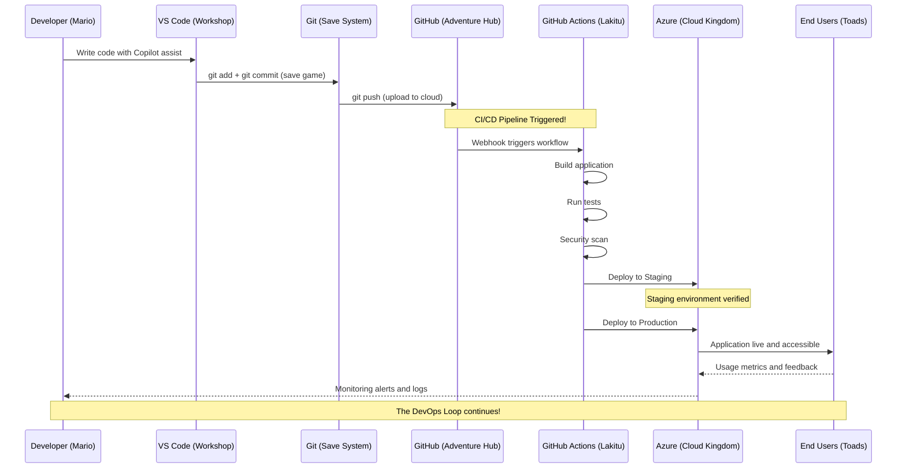

# Fase 1-7 — O Fluxo Completo: Como Tudo Se Conecta (World 1)

---

## Change Log

| Versao | Data       | Autor        | Descricao                     |
|--------|------------|--------------|-------------------------------|
| 1.0.0  | 2026-03-18 | Paula Silva  | Criacao inicial (Edicao Mario)|

---

## Sumario

- [Prologo — O Mapa Completo do World 1](#prologo--o-mapa-completo-do-world-1)
- [1. Visao Geral: Do Codigo ao Usuario Final](#1-visao-geral-do-codigo-ao-usuario-final)
  - [1.1 O Fluxo em Uma Frase](#11-o-fluxo-em-uma-frase)
  - [1.2 As 6 Estacoes da Jornada](#12-as-6-estacoes-da-jornada)
  - [1.3 Diagrama: O Mapa Completo do World 1](#13-diagrama-o-mapa-completo-do-world-1)
- [2. Estacao 1: VS Code — Onde Tudo Comeca](#2-estacao-1-vs-code--onde-tudo-comeca)
  - [2.1 Recapitulacao da Fase 1-1](#21-recapitulacao-da-fase-1-1)
  - [2.2 Conexoes com Outras Estacoes](#22-conexoes-com-outras-estacoes)
- [3. Estacao 2: Git — Salvando o Progresso](#3-estacao-2-git--salvando-o-progresso)
  - [3.1 Recapitulacao da Fase 1-2](#31-recapitulacao-da-fase-1-2)
  - [3.2 Conexoes com Outras Estacoes](#32-conexoes-com-outras-estacoes)
- [4. Estacao 3: GitHub — Compartilhando e Colaborando](#4-estacao-3-github--compartilhando-e-colaborando)
  - [4.1 Recapitulacao da Fase 1-3](#41-recapitulacao-da-fase-1-3)
  - [4.2 Conexoes com Outras Estacoes](#42-conexoes-com-outras-estacoes)
- [5. Estacao 4: GitHub Actions — Automacao](#5-estacao-4-github-actions--automacao)
  - [5.1 Recapitulacao da Fase 1-4](#51-recapitulacao-da-fase-1-4)
  - [5.2 Conexoes com Outras Estacoes](#52-conexoes-com-outras-estacoes)
- [6. Estacao 5: Azure — O Mundo de Producao](#6-estacao-5-azure--o-mundo-de-producao)
  - [6.1 Recapitulacao da Fase 1-5](#61-recapitulacao-da-fase-1-5)
  - [6.2 Conexoes com Outras Estacoes](#62-conexoes-com-outras-estacoes)
- [7. Estacao 6: Azure AI — A Camada de Inteligencia](#7-estacao-6-azure-ai--a-camada-de-inteligencia)
  - [7.1 Recapitulacao da Fase 1-6](#71-recapitulacao-da-fase-1-6)
  - [7.2 Conexoes com Outras Estacoes](#72-conexoes-com-outras-estacoes)
- [8. O Fluxo Completo em Acao — Um Dia na Vida de Sofia](#8-o-fluxo-completo-em-acao--um-dia-na-vida-de-sofia)
  - [8.1 O Cenario](#81-o-cenario)
  - [8.2 Passo a Passo Detalhado](#82-passo-a-passo-detalhado)
  - [8.3 Diagrama Temporal](#83-diagrama-temporal)
- [9. O Mapa ASCII do World 1](#9-o-mapa-ascii-do-world-1)
  - [9.1 Como os Canos Conectam as Fases](#91-como-os-canos-conectam-as-fases)
  - [9.2 Mapa Completo das Conexoes](#92-mapa-completo-das-conexoes)
- [10. Perguntas Frequentes — "E se...?"](#10-perguntas-frequentes--e-se)
- [11. Checklist do World 1 — Voce Esta Pronto?](#11-checklist-do-world-1--voce-esta-pronto)
- [Resumo — O que Aprendemos na Fase 1-7](#resumo--o-que-aprendemos-na-fase-1-7)
- [Referencias](#referencias)

---

## Prologo — O Mapa Completo do World 1

Sofia parou no topo de uma colina verde e olhou para tras. Atras dela, seis fases completas. Pela primeira vez, ela podia ver o World 1 inteiro — da Fase 1-1 ate aqui. E pela primeira vez, ela entendeu como tudo se conectava.

"Cada fase parecia isolada quando eu estava jogando," refletiu Sofia. "VS Code era uma coisa. Git era outra. GitHub outra. Mas agora, olhando de cima, eu vejo: sao tudo **canos** que se conectam. O que eu faco no VS Code vai para o Git, que vai para o GitHub, que acorda os Lakitus, que publicam no Azure. E o Copilot esta comigo em todas as fases."

Era como aquele momento no Mario onde voce descobre que os canos verdes nao sao apenas decoracao — eles formam uma **rede subterranea** que conecta todo o mundo. Cada cano leva a algum lugar. Cada fase alimenta a proxima.

"Esta fase e especial," disse a voz. "Voce nao vai aprender nada novo. Vai entender como TUDO que ja aprendeu se encaixa. E como ver o mapa do mundo pela primeira vez — sem nevoeiro."

---

## 1. Visao Geral: Do Codigo ao Usuario Final

### 1.1 O Fluxo em Uma Frase

> **Voce escreve codigo no VS Code** → **salva com Git** → **compartilha no GitHub** → **Lakitus (Actions) testam e constroem** → **publica no Azure** → **usuario acessa pela internet** — e o **Copilot (IA)** te ajuda em todas as etapas.

### 1.2 As 6 Estacoes da Jornada

| # | Estacao | Ferramenta | Funcao | Analogia Mario |
|---|---------|-----------|--------|----------------|
| 1 | **Escrever** | VS Code | Criar o codigo | Jogar a fase — construir com blocos |
| 2 | **Salvar** | Git | Registrar progresso | Salvar no memory card |
| 3 | **Compartilhar** | GitHub | Colaborar com o time | Subir save para o servidor multiplayer |
| 4 | **Automatizar** | GitHub Actions | Testar e construir automaticamente | Lakitus inspecionando e construindo |
| 5 | **Publicar** | Azure | Hospedar para o mundo | Publicar a fase para todos jogarem |
| 6 | **Inteligenciar** | Azure AI + Copilot | Adicionar magia | Sistema de magia do jogo |

### Diagrama: Fluxo Completo de Ponta a Ponta



### 1.3 Diagrama: O Mapa Completo do World 1

```
╔══════════════════════════════════════════════════════════════════════════╗
║                        WORLD 1 — PLANICIE VERDE                        ║
║                        O Mapa Completo do Fluxo                        ║
╠══════════════════════════════════════════════════════════════════════════╣
║                                                                        ║
║   [1-1 VS Code]                                                        ║
║   O Console      ═══════╗                                              ║
║   do Jogo                ║ Ctrl+S                                      ║
║                          ▼                                              ║
║                   [1-2 Git]                                             ║
║                   O Memory    ═══════╗                                  ║
║                   Card               ║ git push                        ║
║                                      ▼                                  ║
║                               [1-3 GitHub]                              ║
║                               O Servidor   ═══════╗                    ║
║                               Multiplayer         ║ on: push           ║
║                                                    ▼                    ║
║                                             [1-4 Actions]              ║
║                                             Os Lakitus  ═══════╗       ║
║                                             Trabalhadores      ║ deploy║
║                                                                ▼       ║
║                                                         [1-5 Azure]    ║
║                                                         O Mundo        ║
║                                                         Aberto         ║
║                                                                        ║
║   [1-6 Azure AI / Copilot] ◄═══════════════════════════════════════╗   ║
║   A Magia do Jogo — presente em TODAS as estacoes                  ║   ║
║                                                                        ║
║   [1-7 VOCE ESTA AQUI] — Vendo tudo de cima                          ║
║                                                                        ║
╚══════════════════════════════════════════════════════════════════════════╝
```

---

## 2. Estacao 1: VS Code — Onde Tudo Comeca

### 2.1 Recapitulacao da Fase 1-1

| Aprendizado | Resumo |
|------------|--------|
| O que e codigo | Instrucoes escritas para o computador |
| VS Code | O editor (console) onde voce escreve codigo |
| Interface | Sidebar, editor, terminal, status bar |
| Extensoes | Plugins que adicionam funcionalidades (acessorios) |
| Terminal | Linha de comando dentro do VS Code |
| Primeiro arquivo | `fase1-1.js` — seu primeiro programa |

### 2.2 Conexoes com Outras Estacoes

```
VS Code ──── Git integrado (Source Control panel)
   │
   ├──── GitHub (push/pull direto do editor)
   │
   ├──── Terminal (rodar git, node, az, gh)
   │
   ├──── Copilot (extensao integrada)
   │
   └──── Azure (extensao Azure Tools)
```

> **ANALOGIA MARIO:** O VS Code e o **hub central** — como a sala principal do castelo de onde voce acessa todas as salas. Nao e apenas um editor — e a base de operacoes de onde tudo parte e para onde tudo volta.

---

## 3. Estacao 2: Git — Salvando o Progresso

### 3.1 Recapitulacao da Fase 1-2

| Aprendizado | Resumo |
|------------|--------|
| Git | Sistema de controle de versao (memory card) |
| Repositorio | Pasta rastreada pelo Git (cartucho) |
| Commit | Snapshot permanente (save game) |
| Staging | Area de preparacao (tela de confirmacao) |
| Branch | Linha paralela de desenvolvimento (universo paralelo) |
| git log | Historico de commits (lista de saves) |

### 3.2 Conexoes com Outras Estacoes

```
Git (local) ──── VS Code (Source Control panel)
     │
     ├──── GitHub (git push / git pull)
     │
     └──── GitHub Actions (trigger on push/PR)
```

> **Ponto-chave:** Git e a **ponte** entre o que voce faz localmente (VS Code) e o que vai para o servidor (GitHub). Sem Git, seu codigo morre no seu computador.

---

## 4. Estacao 3: GitHub — Compartilhando e Colaborando

### 4.1 Recapitulacao da Fase 1-3

| Aprendizado | Resumo |
|------------|--------|
| GitHub | Plataforma de hospedagem e colaboracao (servidor multiplayer) |
| Push/Pull | Enviar e receber commits (upload/download de saves) |
| Clone/Fork | Copiar repositorios (baixar/criar versao do jogo) |
| Issues | Registro de tarefas e bugs (quadro de missoes) |
| Pull Requests | Proposta de alteracoes para revisao (pedido de aceite) |
| Projects | Gerenciamento visual de tarefas (mapa da campanha) |
| Codespaces | VS Code na nuvem (arcade na nuvem) |

### 4.2 Conexoes com Outras Estacoes

```
GitHub ──── Git (repositorio remoto)
   │
   ├──── GitHub Actions (disparado por eventos no repo)
   │
   ├──── Azure (deploy automatico via Actions)
   │
   ├──── Copilot (companion direto no GitHub)
   │
   ├──── Issues → Projects (gestao de trabalho)
   │
   └──── PRs → Code Review → Merge (colaboracao)
```

> **Ponto-chave:** GitHub e o **centro nervoso** da colaboracao. Tudo converge aqui — codigo, tarefas, automacao, revisao. Se o VS Code e o hub local, o GitHub e o hub global.

---

## 5. Estacao 4: GitHub Actions — Automacao

### 5.1 Recapitulacao da Fase 1-4

| Aprendizado | Resumo |
|------------|--------|
| CI/CD | Integracao e deploy continuos (Lakitu inspetor e transportador) |
| Workflow | Arquivo YAML com instrucoes (pergaminho do Lakitu) |
| Trigger | Evento que dispara o workflow (alarme do Lakitu) |
| Job/Step | Bloco de trabalho / passo individual (missao / acao) |
| Actions Marketplace | Componentes reutilizaveis (power-ups do Lakitu) |
| Secrets | Variaveis sensiveis (chaves secretas do Lakitu) |

### 5.2 Conexoes com Outras Estacoes

```
GitHub Actions ──── GitHub (disparado por eventos)
       │
       ├──── Azure (deploy automatico)
       │
       ├──── Testes (CI — rodar testes automaticamente)
       │
       └──── Notificacoes (alertar o time)
```

> **Ponto-chave:** Actions e a **cola automatica** entre GitHub e Azure. Sem Actions, voce teria que fazer deploy manualmente toda vez. Com Actions, o Lakitu faz tudo por voce.

---

## 6. Estacao 5: Azure — O Mundo de Producao

### 6.1 Recapitulacao da Fase 1-5

| Aprendizado | Resumo |
|------------|--------|
| Cloud | Computadores remotos via internet (servidor mundial) |
| Azure | Plataforma de nuvem da Microsoft (mundo aberto) |
| App Service | Hosting de web apps (castelo pronto) |
| Storage | Armazenamento de arquivos (cofre de tesouros) |
| Entra ID | Identidade e acesso (cartao de identidade real) |
| Monitor | Observabilidade e alertas (torres de vigia) |

### 6.2 Conexoes com Outras Estacoes

```
Azure ──── GitHub Actions (deploy automatico)
  │
  ├──── Azure AI Services (feiticos na app)
  │
  ├──── Azure Monitor (observar saude)
  │
  ├──── Entra ID (proteger acesso)
  │
  └──── Usuarios finais (acessam pela internet)
```

> **Ponto-chave:** Azure e onde o codigo **ganha vida para o mundo real**. Tudo antes e preparacao — aqui e a hora da verdade. Usuarios reais acessam seu programa aqui.

---

## 7. Estacao 6: Azure AI — A Camada de Inteligencia

### 7.1 Recapitulacao da Fase 1-6

| Aprendizado | Resumo |
|------------|--------|
| IA | Computadores fazendo tarefas inteligentes (magia) |
| Azure OpenAI | Modelos GPT no Azure (livro de feiticos) |
| AI Foundry | Plataforma para criar solucoes de IA (Forja de Magikoopa) |
| Copilot | IA para devs no VS Code (companion magico) |
| Prompts | Instrucoes para a IA (pedidos ao mago) |
| Tokens | Unidades de processamento/custo (moedas para magia) |

### 7.2 Conexoes com Outras Estacoes

```
Azure AI / Copilot ──── VS Code (Copilot como extensao)
        │
        ├──── GitHub (Copilot no chat, PRs, Issues)
        │
        ├──── Azure (AI Services integrados nas apps)
        │
        ├──── AI Foundry (criar solucoes customizadas)
        │
        └──── Todas as estacoes (IA permeia tudo)
```

> **Ponto-chave:** A IA nao e uma estacao isolada — ela **permeia todas as outras**. Copilot te ajuda a escrever codigo (VS Code), a entender diffs (Git), a criar PRs (GitHub), a escrever workflows (Actions) e a configurar recursos (Azure). E a magia que torna tudo mais rapido.

---

## 8. O Fluxo Completo em Acao — Um Dia na Vida de Sofia

### 8.1 O Cenario

Sofia precisa adicionar uma nova funcionalidade ao seu projeto: um **sistema de pontuacao** para o Mushroom Kingdom.

### 8.2 Passo a Passo Detalhado

| Passo | O que Sofia Faz | Ferramenta | Analogia Mario |
|-------|----------------|-----------|----------------|
| 1 | Abre o VS Code e vê a Issue #12 no GitHub: "Adicionar sistema de pontuacao" | VS Code + GitHub | Olha o quadro de missoes e pega uma quest |
| 2 | Cria uma branch: `git switch -c feature/pontuacao` | Git | Entra num universo paralelo |
| 3 | Pede ao Copilot: "Crie uma classe Pontuacao com metodos para adicionar e subtrair pontos" | Copilot (IA) | Pede ajuda ao companion magico |
| 4 | Revisa e ajusta o codigo gerado pelo Copilot | VS Code | Inspeciona o que o companion fez |
| 5 | Testa localmente: `node pontuacao.test.js` | VS Code (terminal) | Testa a fase antes de publicar |
| 6 | Faz commit: `git commit -m "feat: adicionar sistema de pontuacao"` | Git | Salva no memory card |
| 7 | Push: `git push origin feature/pontuacao` | Git → GitHub | Sobe o save para o servidor |
| 8 | Cria PR no GitHub vinculado a Issue #12 | GitHub | Pede ao time para aceitar as mudancas |
| 9 | GitHub Actions roda automaticamente: testes, lint, build | Actions | Lakitu inspeciona tudo do alto |
| 10 | Colega revisa o PR e aprova | GitHub (PR) | Toadette inspeciona e aprova a fase |
| 11 | Merge na main | GitHub | Universo paralelo e unido ao principal |
| 12 | Actions dispara deploy automatico para Azure | Actions → Azure | Lakitu transporta a fase ao mundo |
| 13 | Nova funcionalidade esta no ar! Usuarios podem acessar | Azure | Jogadores do mundo inteiro jogam a fase |
| 14 | Azure Monitor mostra metricas de uso | Azure Monitor | Torres de vigia reportam status |

### 8.3 Diagrama Temporal

```
MANHA                 TARDE                    NOITE
  |                     |                        |
  v                     v                        v
[Issue #12] → [Branch] → [Codigo+Copilot] → [Commit] → [Push]
                                                           |
                                                           v
                                                  [PR] → [Actions CI]
                                                           |
                                                           v
                                                    [Code Review]
                                                           |
                                                           v
                                                     [Aprovado!]
                                                           |
                                                           v
                                                    [Merge → main]
                                                           |
                                                           v
                                                   [Actions CD → Azure]
                                                           |
                                                           v
                                                   [NO AR! Usuarios
                                                    acessam a feature]
```

---

## 9. O Mapa ASCII do World 1

### 9.1 Como os Canos Conectam as Fases

No Mario, canos verdes conectam areas que parecem distantes. No desenvolvimento de software, ferramentas se conectam por **protocolos, APIs e integrações**:

| Conexao | "Cano" Tecnico | O que Transporta |
|---------|---------------|-----------------|
| VS Code → Git | Extensao integrada + terminal | Arquivos e mudancas |
| Git → GitHub | Protocolo HTTPS/SSH (push/pull) | Commits e branches |
| GitHub → Actions | Webhooks (eventos automaticos) | Triggers de workflow |
| Actions → Azure | Azure CLI + credenciais (secrets) | Codigo compilado (deploy) |
| Copilot → Tudo | API OpenAI integrada ao editor | Sugestoes de codigo e chat |

### 9.2 Mapa Completo das Conexoes

```
╔══════════════════════════════════════════════════════════════════════╗
║                                                                      ║
║          ┌──────────────────────────────────────────────┐            ║
║          │            GITHUB COPILOT (IA)               │            ║
║          │     Companion presente em todas as fases      │            ║
║          └──────┬───────────┬──────────┬────────────────┘            ║
║                 │           │          │                              ║
║                 ▼           ▼          ▼                              ║
║           ┌──────────┐ ┌──────────┐ ┌──────────┐                    ║
║           │ VS CODE  │ │  GITHUB  │ │  AZURE   │                    ║
║           │ (Console)│ │ (Server) │ │ (Mundo)  │                    ║
║           └────┬─────┘ └────┬─────┘ └────┬─────┘                    ║
║                │            │            │                            ║
║           ┌────┴─────┐     │       ┌────┴─────┐                     ║
║           │   GIT    │     │       │  AZURE   │                     ║
║           │ (Memory  ├─────┘       │  MONITOR │                     ║
║           │  Card)   │             │ (Torres) │                     ║
║           └──────────┘             └──────────┘                     ║
║                                                                      ║
║     ┌────────────────────────────────────────────┐                  ║
║     │            GITHUB ACTIONS (Lakitus)         │                  ║
║     │  Conecta GitHub ao Azure automaticamente    │                  ║
║     └────────────────────────────────────────────┘                  ║
║                                                                      ║
║  ┌─────────────────────────────────────────────────────────┐        ║
║  │                    AZURE AI FOUNDRY                      │        ║
║  │     Quando a app precisa de IA propria (feiticos custom) │        ║
║  └─────────────────────────────────────────────────────────┘        ║
║                                                                      ║
╚══════════════════════════════════════════════════════════════════════╝

  FLUXO: Voce → VS Code → Git → GitHub → Actions → Azure → Usuarios
```

---

## 10. Perguntas Frequentes — "E se...?"

| Pergunta | Resposta | Fase |
|---------|---------|------|
| "E se eu nao usar Git?" | Voce nao tem historico, nao pode voltar atras, nao pode colaborar. | 1-2 |
| "E se eu nao usar GitHub?" | Seu codigo fica so no seu computador. Sem backup na nuvem, sem colaboracao. | 1-3 |
| "E se eu nao usar Actions?" | Voce faz tudo manualmente — testes, build, deploy. Funciona, mas e lento e propenso a erros. | 1-4 |
| "E se eu nao usar Azure?" | Seu programa roda so localmente. Ninguem mais pode acessar. | 1-5 |
| "E se eu nao usar IA?" | Voce programa "no braco" — mais lento, mas totalmente possivel. IA acelera, nao substitui. | 1-6 |
| "Posso pular direto para Azure?" | Pode, mas sem Git/GitHub voce nao tem organizacao nem automacao. A base e importante. | Todas |
| "Preciso pagar algo?" | VS Code (gratis), Git (gratis), GitHub (gratis para uso pessoal), Azure (tem tier gratuito), Copilot (gratis para estudantes). | Todas |
| "Posso usar outros editores que nao VS Code?" | Sim (Vim, JetBrains, etc.), mas VS Code tem a melhor integracao com todo o ecossistema Microsoft+GitHub. | 1-1 |

---

## 11. Checklist do World 1 — Voce Esta Pronto?

Antes de seguir para o World 2, verifique se voce domina os fundamentos:

| # | Item | Fase | Status |
|---|------|------|--------|
| 1 | Sei o que e codigo e para que serve | 1-1 | [ ] |
| 2 | Tenho o VS Code instalado e configurado | 1-1 | [ ] |
| 3 | Sei usar o terminal basico (cd, ls, mkdir) | 1-1 | [ ] |
| 4 | Tenho extensoes essenciais instaladas | 1-1 | [ ] |
| 5 | Entendo o que e Git e por que usar | 1-2 | [ ] |
| 6 | Sei fazer git init, add, commit, log | 1-2 | [ ] |
| 7 | Entendo branches (criar, trocar, merge) | 1-2 | [ ] |
| 8 | Tenho conta no GitHub | 1-3 | [ ] |
| 9 | Sei fazer push e pull | 1-3 | [ ] |
| 10 | Sei criar Issues e PRs | 1-3 | [ ] |
| 11 | Entendo o que e CI/CD | 1-4 | [ ] |
| 12 | Sei ler e escrever um workflow YAML basico | 1-4 | [ ] |
| 13 | Entendo o que e cloud computing | 1-5 | [ ] |
| 14 | Conheço os servicos essenciais do Azure | 1-5 | [ ] |
| 15 | Entendo o que e IA e como usar Copilot | 1-6 | [ ] |
| 16 | Sei escrever prompts basicos | 1-6 | [ ] |
| 17 | Entendo como tudo se conecta | 1-7 | [ ] |

> **Se voce marcou pelo menos 14 de 17, esta pronto para o World 2.** Se marcou menos, volte e revise as fases que ficaram com lacuna. Nao pule — os mundos seguintes dependem desta base.

---

## Resumo — O que Aprendemos na Fase 1-7

| Conceito | Resumo |
|----------|--------|
| **Fluxo completo** | VS Code → Git → GitHub → Actions → Azure (→ Usuarios) |
| **IA como camada transversal** | Copilot e Azure AI permeiam todas as etapas |
| **Cada ferramenta tem um papel** | Nenhuma substitui a outra — todas se complementam |
| **Automacao e a cola** | GitHub Actions conecta desenvolvimento (GitHub) a producao (Azure) |
| **A base importa** | Sem Git, sem GitHub, sem terminal — os mundos avancados nao funcionam |

```
+═══════════════════════════════════════════+
║                                           ║
║     ★★★ WORLD 1 COMPLETO! ★★★           ║
║                                           ║
║    Todas as 7 fases concluidas!           ║
║                                           ║
║    Fase 1-1: VS Code (Console)     ★      ║
║    Fase 1-2: Git (Memory Card)     ★      ║
║    Fase 1-3: GitHub (Multiplayer)  ★      ║
║    Fase 1-4: Actions (Lakitus)     ★      ║
║    Fase 1-5: Azure (Mundo Aberto)  ★      ║
║    Fase 1-6: AI (Magia)           ★      ║
║    Fase 1-7: Conexoes (Mapa)      ★      ║
║                                           ║
║    → Proximo: Fase 1-BOSS                 ║
║      Boss Battle contra Bowser Jr!        ║
║                                           ║
║    "Thank you Mario!                      ║
║     The princess is in another castle!"   ║
║    (Mas agora voce sabe chegar la.)       ║
║                                           ║
+═══════════════════════════════════════════+
```

---

## Referencias

- [Visual Studio Code](https://code.visualstudio.com)
- [Git](https://git-scm.com)
- [GitHub](https://github.com)
- [GitHub Actions](https://docs.github.com/en/actions)
- [Microsoft Azure](https://azure.microsoft.com)
- [Azure AI Services](https://learn.microsoft.com/azure/ai-services)
- [GitHub Copilot](https://docs.github.com/en/copilot)
- [Azure AI Foundry](https://ai.azure.com)
- [Microsoft Learn — Azure Fundamentals](https://learn.microsoft.com/training/paths/azure-fundamentals)
- [GitHub Skills](https://skills.github.com)

---

*"Agora eu vejo o mapa inteiro. Cada cano conecta a algo. Cada ferramenta tem seu papel. E eu sei usar todas." — Sofia, no topo da colina do World 1.*

---

<div align="center">

⬅️ [Anterior: Fase 1-6: Azure AI](1-6-azure-ai.md) · 🗺️ [Mapa dos Mundos](../INDEX.md) · ➡️ [Proximo: Fase 1-BOSS: Exercicios](1-boss-exercises.md)

</div>
