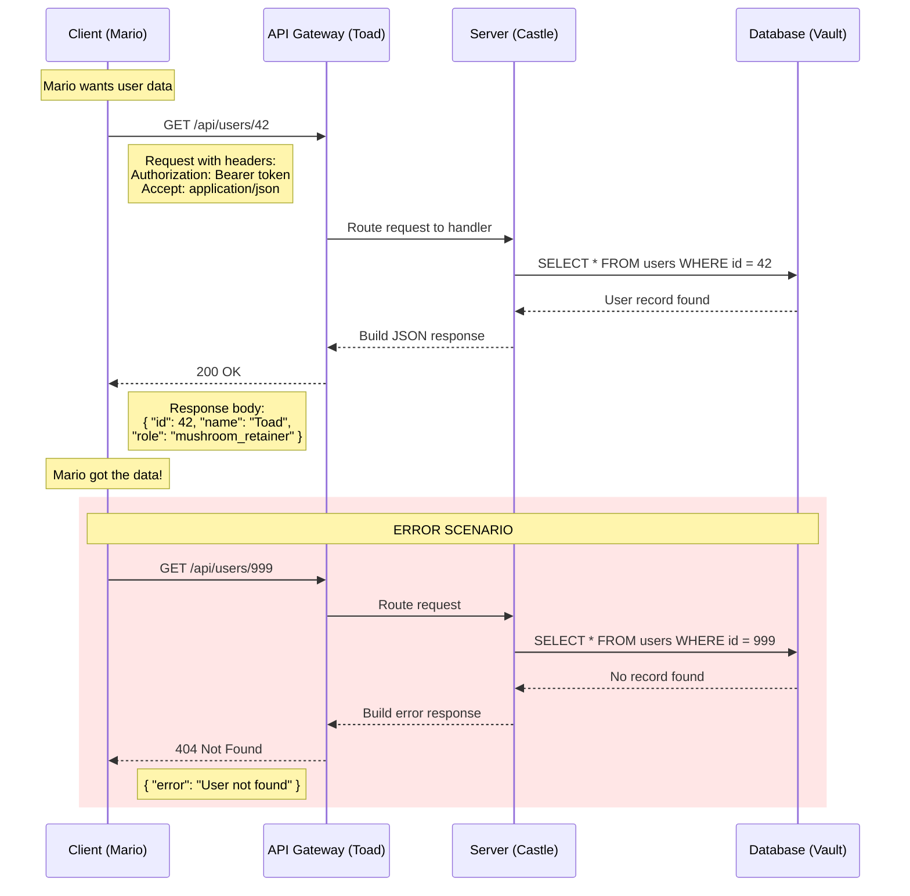

# Fase 2-2 -- O Mensageiro entre Reinos: APIs

---

## Change Log

| Versao | Data       | Autor                                  | Descricao          |
|--------|------------|----------------------------------------|--------------------|
| 1.0.0  | 2026-03-18 | Paula Silva - Microsoft Latam Software GBB | Criacao inicial    |

---

## Sumario

- [Prologo: O Toad Mensageiro](#prologo-o-toad-mensageiro)
- [1. Frontend, Backend e Full Stack: Os Reinos do Mushroom Kingdom](#1-frontend-backend-e-full-stack-os-reinos-do-mushroom-kingdom)
  - [1.1 O Frontend: O Que o Jogador Ve](#11-o-frontend-o-que-o-jogador-ve)
  - [1.2 O Backend: O Que Acontece nos Bastidores](#12-o-backend-o-que-acontece-nos-bastidores)
  - [1.3 O Full Stack: O Aventureiro Completo](#13-o-full-stack-o-aventureiro-completo)
  - [1.4 Tabela: Frontend vs Backend vs Full Stack](#14-tabela-frontend-vs-backend-vs-full-stack)
- [2. O Que e uma API?](#2-o-que-e-uma-api)
  - [2.1 Definicao Fundamental](#21-definicao-fundamental)
  - [2.2 Por Que APIs Existem?](#22-por-que-apis-existem)
  - [2.3 APIs no Dia a Dia](#23-apis-no-dia-a-dia)
- [3. REST: O Protocolo do Mensageiro](#3-rest-o-protocolo-do-mensageiro)
  - [3.1 O Que e REST?](#31-o-que-e-rest)
  - [3.2 Os 6 Principios REST](#32-os-6-principios-rest)
  - [3.3 URLs como Enderecos do Mushroom Kingdom](#33-urls-como-enderecos-do-mushroom-kingdom)
- [4. Os Metodos HTTP: As Missoes do Toad](#4-os-metodos-http-as-missoes-do-toad)
  - [4.1 GET -- Buscar Informacao](#41-get----buscar-informacao)
  - [4.2 POST -- Entregar um Pacote](#42-post----entregar-um-pacote)
  - [4.3 PUT -- Substituir Algo](#43-put----substituir-algo)
  - [4.4 PATCH -- Consertar Algo](#44-patch----consertar-algo)
  - [4.5 DELETE -- Destruir Algo](#45-delete----destruir-algo)
  - [4.6 Tabela Completa: Metodos HTTP](#46-tabela-completa-metodos-http)
- [5. Status Codes: As Respostas do Mensageiro](#5-status-codes-as-respostas-do-mensageiro)
  - [5.1 Familia 2xx -- Missao Cumprida](#51-familia-2xx----missao-cumprida)
  - [5.2 Familia 3xx -- Redirecionamento](#52-familia-3xx----redirecionamento)
  - [5.3 Familia 4xx -- Erro do Solicitante](#53-familia-4xx----erro-do-solicitante)
  - [5.4 Familia 5xx -- Erro do Castelo](#54-familia-5xx----erro-do-castelo)
  - [5.5 Tabela: Os Status Codes Mais Importantes](#55-tabela-os-status-codes-mais-importantes)
- [6. JSON: A Lingua Franca do Mushroom Kingdom](#6-json-a-lingua-franca-do-mushroom-kingdom)
  - [6.1 O Que e JSON?](#61-o-que-e-json)
  - [6.2 Estrutura Basica](#62-estrutura-basica)
  - [6.3 JSON na Pratica: Requisicao e Resposta](#63-json-na-pratica-requisicao-e-resposta)
- [7. Construindo uma API na Pratica](#7-construindo-uma-api-na-pratica)
  - [7.1 Exemplo Completo: API de Tarefas (TodoApp)](#71-exemplo-completo-api-de-tarefas-todoapp)
  - [7.2 Testando com curl e Postman](#72-testando-com-curl-e-postman)
- [8. APIs na Nuvem: Azure API Management](#8-apis-na-nuvem-azure-api-management)
- [9. Boas Praticas de API](#9-boas-praticas-de-api)
- [10. Tabela Final de Resumo](#10-tabela-final-de-resumo)
- [Referencias](#referencias)

---

## Prologo: O Toad Mensageiro

Sofia estava construindo sua aplicacao TodoApp. O frontend (a tela que o usuario ve) estava bonito, com botoes coloridos e animacoes suaves. O backend (o servidor que guarda os dados) estava funcionando, com o banco de dados cheio de tarefas de teste. Mas havia um problema: os dois nao se conversavam.

*"Meu frontend sabe que o usuario clicou em 'Adicionar Tarefa',"* reclamou Sofia. *"Mas como ele avisa o backend para salvar essa tarefa no banco de dados?"*

Nesse momento, um Toad vestido de carteiro apareceu correndo pela tela.

*"Eu sou o Toad Mensageiro!"* disse ele, ajustando sua bolsa de cartas. *"Meu trabalho e levar mensagens entre o Castelo do Frontend e o Castelo do Backend. Voce me da uma carta (requisicao), eu levo ate o castelo certo, eles me dao uma resposta, e eu trago de volta. Simples, rapido, confiavel."*

*"Isso,"* explicou Yoshi ao fundo, *"e uma **API**. E o Toad Mensageiro e o melhor de todos."*

---

## 1. Frontend, Backend e Full Stack: Os Reinos do Mushroom Kingdom

Antes de falar de APIs, precisamos entender os dois grandes reinos que elas conectam.

### 1.1 O Frontend: O Que o Jogador Ve

O **Frontend** e tudo que o usuario ve e interage diretamente. E a parte visual da aplicacao.

**No Mario:** O Frontend e a **tela do jogo** -- o cenario, as nuvens, os blocos, o Mario se movendo, a contagem de moedas, o placar de vidas. Tudo que voce VE.

**Na pratica:**
- HTML = a estrutura da pagina (os blocos, o chao, o cenario)
- CSS = a aparencia (cores, fontes, animacoes)
- JavaScript = a interatividade (quando voce clica, algo acontece)
- React/Vue/Angular = frameworks que organizam tudo

```
O que o usuario ve:
+----------------------------------+
|  [Logo]    [Menu]    [Login]     |
|                                  |
|  Minhas Tarefas:                 |
|  [x] Estudar APIs               |
|  [ ] Criar primeiro endpoint    |
|  [ ] Testar com Postman         |
|                                  |
|  [+ Adicionar Tarefa]           |
+----------------------------------+
```

### 1.2 O Backend: O Que Acontece nos Bastidores

O **Backend** e tudo que acontece por tras das cortinas. O usuario nunca ve o backend diretamente.

**No Mario:** O Backend e o **motor do jogo** -- o codigo que calcula se Mario caiu no buraco, se bateu no inimigo, quantas moedas tem, se o tempo acabou. Voce nao ve esse codigo, mas ele esta la fazendo tudo funcionar.

**Na pratica:**
- Servidor que processa requisicoes
- Banco de dados que armazena informacoes
- Logica de negocio (regras da aplicacao)
- Autenticacao e seguranca
- Node.js, Python, Java, C#, Go = linguagens comuns de backend

```
O que acontece por tras:
+----------------------------------+
|  SERVIDOR                        |
|  - Recebe requisicao             |
|  - Valida dados                  |
|  - Consulta banco de dados       |
|  - Aplica regras de negocio      |
|  - Retorna resposta              |
+----------------------------------+
         |
+----------------------------------+
|  BANCO DE DADOS                  |
|  - Armazena tarefas              |
|  - Armazena usuarios             |
|  - Mantem historico              |
+----------------------------------+
```

### 1.3 O Full Stack: O Aventureiro Completo

Um desenvolvedor **Full Stack** trabalha tanto no Frontend quanto no Backend. E como o Mario que sabe fazer tudo: pular (frontend), lutar (backend), nadar (banco de dados), e voar (deploy).

> **ANALOGIA MARIO:** Se o Frontend e o Luigi (especialista em pulos e visual) e o Backend e o Toad (guardiao dos dados e tesouros), o Full Stack e o **Mario** -- ele sabe um pouco de tudo. Nao e necessariamente o melhor em cada area especifica, mas consegue lidar com qualquer situacao.

### 1.4 Tabela: Frontend vs Backend vs Full Stack

| Aspecto | Frontend | Backend | Full Stack |
|---------|----------|---------|------------|
| **Analogia Mario** | Luigi -- visual e agilidade | Toad -- dados e tesouros | Mario -- faz tudo |
| **O que faz** | Interface visual | Logica e dados | Ambos |
| **Linguagens** | HTML, CSS, JS, React | Node.js, Python, Java | Todos |
| **Onde roda** | Navegador do usuario | Servidor na nuvem | Ambos |
| **Ve o usuario?** | Sim, diretamente | Nao, invisivel | Parcialmente |
| **Foco** | Experiencia do usuario | Performance e seguranca | Conexao entre ambos |

---

## 2. O Que e uma API?

### 2.1 Definicao Fundamental

**API** significa **Application Programming Interface** -- ou **Interface de Programacao de Aplicacoes**. E um conjunto de regras que define como duas partes de software conversam entre si.

Em termos simples: uma API e o **contrato** que diz:
- **Que perguntas** voce pode fazer
- **Como** deve formular a pergunta
- **Que respostas** vai receber

> **ANALOGIA MARIO:** Uma API e como o **Toad Mensageiro** entre castelos. O Frontend (Castelo 1) quer informacao que esta no Backend (Castelo 2). Ele nao pode ir la sozinho -- precisa mandar o Toad. O Toad sabe: que tipo de mensagem aceitar, para qual castelo levar, como formatar a resposta, e quanto tempo demora. O Toad E a API.

### 2.2 Por Que APIs Existem?

Sem APIs, cada parte do sistema teria que saber TUDO sobre as outras partes. Seria como se todo personagem do Mario precisasse saber como o motor de fisica funciona internamente.

**Com API (organizado):**
```
Frontend: "Toad, me traga a lista de tarefas"
Toad (API): vai ao backend, busca dados, traz resposta formatada
Frontend: recebe e exibe na tela
```

**Sem API (caos):**
```
Frontend: precisa saber SQL, conexao de banco, IP do servidor,
          porta do banco, schema das tabelas, queries...
          TUDO que o backend sabe
```

APIs criam **separacao de responsabilidades**. Cada parte faz o que sabe fazer melhor.

### 2.3 APIs no Dia a Dia

Voce usa APIs o tempo todo sem perceber:

| Acao | API Envolvida | O que Acontece |
|------|---------------|----------------|
| Abrir Instagram | API do Instagram | Busca posts, likes, stories do servidor |
| Pedir Uber | API do Uber | Envia localizacao, encontra motorista, calcula preco |
| Consultar clima | API de Weather | Envia cidade, recebe temperatura e previsao |
| Pagar com Pix | API do banco | Envia valor e chave, processa transferencia |
| Login com Google | API do Google OAuth | Verifica identidade sem criar conta nova |

---

### Diagrama: Fluxo de Requisicao/Resposta de API



---

## 3. REST: O Protocolo do Mensageiro

### 3.1 O Que e REST?

**REST** (Representational State Transfer) e o estilo mais comum de construir APIs web. E como um protocolo -- um conjunto de regras que o Toad Mensageiro segue.

> **ANALOGIA MARIO:** REST e como o **codigo de conduta do Toad Mensageiro**. Ele define: use o sistema de enderecos do Mushroom Kingdom (URLs). Cada mensagem deve ser auto-explicativa (sem precisar de contexto anterior). Use os verbos padrao (GET, POST, PUT, DELETE). E sempre responda com um codigo de status.

### 3.2 Os 6 Principios REST

| Principio | Explicacao | Analogia Mario |
|-----------|-----------|----------------|
| **Client-Server** | Frontend e Backend sao separados | Castelo 1 e Castelo 2 sao independentes |
| **Stateless** | Cada requisicao e independente | Toad nao lembra da mensagem anterior |
| **Cacheable** | Respostas podem ser armazenadas | Toad anota a resposta para nao ir 2x |
| **Uniform Interface** | URLs e verbos padronizados | Todos os castelos usam o mesmo sistema de enderecos |
| **Layered System** | Pode ter intermediarios | Toad pode passar por outros Toads no caminho |
| **Code on Demand** | Servidor pode enviar codigo | O castelo pode enviar um power-up junto com a resposta |

### 3.3 URLs como Enderecos do Mushroom Kingdom

Cada recurso (coisa) na API tem um endereco unico chamado **URL** (ou **endpoint**):

```
https://api.mushroom-kingdom.com/v1/tarefas
|_____|  |________________________| |_| |______|
  |              |                  |      |
protocolo    dominio            versao  recurso

Exemplos:
GET    /tarefas          = Lista todas as tarefas
GET    /tarefas/42       = Busca a tarefa com ID 42
POST   /tarefas          = Cria uma nova tarefa
PUT    /tarefas/42       = Atualiza a tarefa 42 completamente
PATCH  /tarefas/42       = Atualiza parcialmente a tarefa 42
DELETE /tarefas/42       = Remove a tarefa 42
```

> **ANALOGIA MARIO:** URLs sao **enderecos de castelos** no Mushroom Kingdom. `/tarefas` e como dizer "vou ao Castelo das Tarefas". `/tarefas/42` e "vou ao Quarto 42 do Castelo das Tarefas". O metodo HTTP diz o que voce quer fazer la: GET = visitar e olhar, POST = entregar algo, DELETE = destruir algo.

---

## 4. Os Metodos HTTP: As Missoes do Toad

### 4.1 GET -- Buscar Informacao

**GET** e a missao mais simples: "va ate la e me traga informacao". Nao muda nada no servidor, apenas busca dados.

```http
GET /tarefas HTTP/1.1
Host: api.todoapp.com

Resposta:
HTTP/1.1 200 OK
Content-Type: application/json

[
  { "id": 1, "titulo": "Estudar APIs", "concluida": false },
  { "id": 2, "titulo": "Criar endpoint", "concluida": true }
]
```

> **ANALOGIA MARIO:** GET e o Toad dizendo: *"Fui ao Castelo do Backend, pedi a lista de tarefas, e trouxe de volta para voce. Nao mexi em nada, so olhei e copiei."*

### 4.2 POST -- Entregar um Pacote

**POST** e quando voce quer **criar algo novo** no servidor. Voce envia dados junto com a requisicao.

```http
POST /tarefas HTTP/1.1
Host: api.todoapp.com
Content-Type: application/json

{
  "titulo": "Aprender sobre status codes",
  "concluida": false
}

Resposta:
HTTP/1.1 201 Created
Content-Type: application/json

{
  "id": 3,
  "titulo": "Aprender sobre status codes",
  "concluida": false,
  "criadaEm": "2026-03-18T10:00:00Z"
}
```

> **ANALOGIA MARIO:** POST e o Toad dizendo: *"Estou levando este pacote (dados) para o Castelo do Backend. Eles vao abrir, registrar, e me dar um recibo (resposta com ID)."*

### 4.3 PUT -- Substituir Algo

**PUT** substitui um recurso inteiro. Voce envia o objeto completo, e o servidor troca tudo.

```http
PUT /tarefas/3 HTTP/1.1
Host: api.todoapp.com
Content-Type: application/json

{
  "titulo": "Aprender sobre status codes HTTP",
  "concluida": true
}

Resposta:
HTTP/1.1 200 OK
```

> **ANALOGIA MARIO:** PUT e o Toad dizendo: *"O dono da tarefa 3 quer trocar TUDO. Pega esse objeto novo e substitui o antigo completamente."*

### 4.4 PATCH -- Consertar Algo

**PATCH** atualiza apenas uma parte do recurso. E mais cirurgico que PUT.

```http
PATCH /tarefas/3 HTTP/1.1
Host: api.todoapp.com
Content-Type: application/json

{
  "concluida": true
}

Resposta:
HTTP/1.1 200 OK
```

> **ANALOGIA MARIO:** PATCH e o Toad dizendo: *"So precisa mudar UMA coisa na tarefa 3: marcar como concluida. O resto fica como esta."*

### 4.5 DELETE -- Destruir Algo

**DELETE** remove um recurso do servidor.

```http
DELETE /tarefas/3 HTTP/1.1
Host: api.todoapp.com

Resposta:
HTTP/1.1 204 No Content
```

> **ANALOGIA MARIO:** DELETE e o Toad dizendo: *"O dono mandou destruir a tarefa 3. Puf! Sumiu. Nao existe mais."*

### 4.6 Tabela Completa: Metodos HTTP

| Metodo | Acao | Analogia Mario | Exemplo | Seguro? | Idempotente? |
|--------|------|----------------|---------|---------|--------------|
| **GET** | Buscar | "Traga-me informacao" | Listar tarefas | Sim | Sim |
| **POST** | Criar | "Entregue este pacote" | Criar tarefa nova | Nao | Nao |
| **PUT** | Substituir | "Troque tudo por isso" | Atualizar tarefa inteira | Nao | Sim |
| **PATCH** | Atualizar parcial | "Conserte so essa parte" | Marcar como concluida | Nao | Nao |
| **DELETE** | Remover | "Destrua isso" | Remover tarefa | Nao | Sim |

**Seguro** = nao altera dados no servidor (GET e seguro -- so olha).
**Idempotente** = fazer 1x ou 100x da o mesmo resultado (DELETE 100x = item continua apagado).

---

## 5. Status Codes: As Respostas do Mensageiro

Quando o Toad volta de uma missao, ele traz um **codigo de status** que resume o resultado. Esse codigo e um numero de 3 digitos.

### 5.1 Familia 2xx -- Missao Cumprida

Codigos que comecam com **2** significam **SUCESSO**.

| Codigo | Nome | Significado | Analogia Mario |
|--------|------|-------------|----------------|
| **200** | OK | Tudo deu certo | Toad voltou com a encomenda. Missao cumprida! |
| **201** | Created | Algo novo foi criado | Toad entregou o pacote e o castelo criou algo novo |
| **204** | No Content | Feito, mas sem nada para retornar | Toad destruiu o item. Nao tem nada para trazer de volta |

### 5.2 Familia 3xx -- Redirecionamento

Codigos que comecam com **3** significam **MUDOU DE ENDERECO**.

| Codigo | Nome | Significado | Analogia Mario |
|--------|------|-------------|----------------|
| **301** | Moved Permanently | O castelo mudou de endereco para sempre | "A princesa nao esta mais neste castelo. Ela mudou para o castelo da Rua B" |
| **302** | Found (Temporary) | Temporariamente em outro lugar | "A princesa esta visitando outro castelo. Volta amanha" |
| **304** | Not Modified | Nada mudou desde a ultima vez | "Toad, voce ja trouxe essa informacao antes. Usa a copia que voce tem" |

### 5.3 Familia 4xx -- Erro do Solicitante

Codigos que comecam com **4** significam **VOCE ERROU** (o cliente mandou algo errado).

| Codigo | Nome | Significado | Analogia Mario |
|--------|------|-------------|----------------|
| **400** | Bad Request | Requisicao malformada | Toad trouxe uma carta ilegivel. O castelo nao entendeu |
| **401** | Unauthorized | Sem credenciais | Toad chegou ao castelo mas nao tem a chave. "Quem e voce?" |
| **403** | Forbidden | Credenciais insuficientes | Toad tem a chave, mas nao tem permissao para entrar nessa sala |
| **404** | Not Found | Recurso nao existe | **Castelo nao encontrado!** O endereco nao leva a lugar nenhum |
| **405** | Method Not Allowed | Metodo errado | "Voce nao pode DESTRUIR este castelo! So pode VISITAR!" |
| **409** | Conflict | Conflito de dados | "Ja existe uma tarefa com esse nome!" |
| **422** | Unprocessable Entity | Dados invalidos | "A carta do Toad faz sentido, mas os dados estao errados" |
| **429** | Too Many Requests | Muitas requisicoes | "Toad, voce ja veio aqui 100 vezes hoje! Descanse!" |

### 5.4 Familia 5xx -- Erro do Castelo

Codigos que comecam com **5** significam **O SERVIDOR ERROU** (o castelo tem problemas).

| Codigo | Nome | Significado | Analogia Mario |
|--------|------|-------------|----------------|
| **500** | Internal Server Error | Erro generico no servidor | **O castelo esta pegando fogo!** Algo deu muito errado la dentro |
| **502** | Bad Gateway | Intermediario recebeu resposta invalida | O Toad intermediario recebeu uma resposta estranha do castelo |
| **503** | Service Unavailable | Servidor sobrecarregado ou em manutencao | "O castelo esta fechado para reformas. Tente amanha" |
| **504** | Gateway Timeout | Tempo esgotado | O Toad esperou e esperou... mas o castelo nunca respondeu |

### 5.5 Tabela: Os Status Codes Mais Importantes

```
2xx = VERDE   = Tudo certo!
3xx = AMARELO = Mudou de lugar
4xx = LARANJA = Voce errou
5xx = VERMELHO = O servidor errou

Os 7 que voce VAI usar todo dia:
200 = OK (missao cumprida)
201 = Created (novo item criado)
400 = Bad Request (carta ilegivel)
401 = Unauthorized (sem chave)
404 = Not Found (castelo nao existe)
422 = Unprocessable (dados invalidos)
500 = Internal Error (castelo pegando fogo)
```

---

## 6. JSON: A Lingua Franca do Mushroom Kingdom

### 6.1 O Que e JSON?

**JSON** (JavaScript Object Notation) e o formato mais usado para trocar dados entre Frontend e Backend. E a lingua que o Toad Mensageiro fala.

### 6.2 Estrutura Basica

```json
{
  "nome": "Sofia",
  "nivel": 2,
  "vidas": 3,
  "powerUps": ["mushroom", "fireFlower"],
  "posicao": {
    "mundo": "Cavernas Subterraneas",
    "fase": "2-2"
  },
  "ativa": true
}
```

**Tipos de dados em JSON:**
- **String**: `"texto entre aspas"`
- **Number**: `42`, `3.14`
- **Boolean**: `true` ou `false`
- **Array**: `["lista", "de", "itens"]`
- **Object**: `{ "chave": "valor" }`
- **Null**: `null` (vazio/nada)

### 6.3 JSON na Pratica: Requisicao e Resposta

```
REQUISICAO (Frontend -> Backend):
POST /tarefas
{
  "titulo": "Aprender JSON",
  "prioridade": "alta"
}

RESPOSTA (Backend -> Frontend):
201 Created
{
  "id": 42,
  "titulo": "Aprender JSON",
  "prioridade": "alta",
  "concluida": false,
  "criadaEm": "2026-03-18T10:30:00Z",
  "criadaPor": "sofia"
}
```

> **ANALOGIA MARIO:** JSON e o **idioma oficial** do Mushroom Kingdom. Quando o Toad leva uma carta, ela esta escrita em JSON. Quando o castelo responde, a resposta tambem esta em JSON. Todos os reinos entendem JSON -- e como o idioma universal que permite Toads de diferentes castelos se comunicarem.

---

## 7. Construindo uma API na Pratica

### 7.1 Exemplo Completo: API de Tarefas (TodoApp)

Aqui esta uma API simples usando Node.js com Express:

```javascript
const express = require('express');
const app = express();
app.use(express.json());

// "Banco de dados" simplificado (em memoria)
let tarefas = [
  { id: 1, titulo: "Estudar APIs", concluida: false },
  { id: 2, titulo: "Criar backend", concluida: false }
];
let proximoId = 3;

// GET /tarefas -- Listar todas as tarefas
// Toad: "Me traga a lista completa de tarefas"
app.get('/tarefas', (req, res) => {
  res.status(200).json(tarefas);
});

// GET /tarefas/:id -- Buscar uma tarefa especifica
// Toad: "Me traga a tarefa numero X"
app.get('/tarefas/:id', (req, res) => {
  const tarefa = tarefas.find(t => t.id === parseInt(req.params.id));
  if (!tarefa) {
    return res.status(404).json({ erro: "Tarefa nao encontrada" });
    // 404 = Castelo nao encontrado!
  }
  res.status(200).json(tarefa);
});

// POST /tarefas -- Criar nova tarefa
// Toad: "Entregue este pacote ao castelo"
app.post('/tarefas', (req, res) => {
  const { titulo } = req.body;
  if (!titulo) {
    return res.status(400).json({ erro: "Titulo e obrigatorio" });
    // 400 = Carta ilegivel!
  }
  const novaTarefa = {
    id: proximoId++,
    titulo,
    concluida: false
  };
  tarefas.push(novaTarefa);
  res.status(201).json(novaTarefa);
  // 201 = Pacote entregue e registrado!
});

// PUT /tarefas/:id -- Atualizar tarefa completamente
// Toad: "Substitua tudo na tarefa X"
app.put('/tarefas/:id', (req, res) => {
  const index = tarefas.findIndex(t => t.id === parseInt(req.params.id));
  if (index === -1) {
    return res.status(404).json({ erro: "Tarefa nao encontrada" });
  }
  tarefas[index] = { id: parseInt(req.params.id), ...req.body };
  res.status(200).json(tarefas[index]);
});

// DELETE /tarefas/:id -- Remover tarefa
// Toad: "Destrua a tarefa X"
app.delete('/tarefas/:id', (req, res) => {
  const index = tarefas.findIndex(t => t.id === parseInt(req.params.id));
  if (index === -1) {
    return res.status(404).json({ erro: "Tarefa nao encontrada" });
  }
  tarefas.splice(index, 1);
  res.status(204).send();
  // 204 = Destruido. Nada para retornar.
});

// Iniciar o servidor
app.listen(3000, () => {
  console.log('Castelo do Backend escutando na porta 3000!');
});
```

### 7.2 Testando com curl e Postman

**Testando com curl (terminal):**

```bash
# GET -- Listar tarefas
curl http://localhost:3000/tarefas

# POST -- Criar tarefa
curl -X POST http://localhost:3000/tarefas \
  -H "Content-Type: application/json" \
  -d '{"titulo": "Aprender curl"}'

# PUT -- Atualizar tarefa
curl -X PUT http://localhost:3000/tarefas/1 \
  -H "Content-Type: application/json" \
  -d '{"titulo": "APIs dominadas!", "concluida": true}'

# DELETE -- Remover tarefa
curl -X DELETE http://localhost:3000/tarefas/2
```

**Postman** e uma ferramenta visual para testar APIs. Em vez de digitar comandos no terminal, voce preenche formularios bonitos e ve as respostas formatadas. E como ter um mapa visual do Mushroom Kingdom em vez de andar no escuro.

---

## 8. APIs na Nuvem: Azure API Management

Quando sua API vai para producao, voce precisa de mais controle. O **Azure API Management (APIM)** e como um castelo fortificado ao redor da sua API:

| Recurso APIM | O que Faz | Analogia Mario |
|-------------|-----------|----------------|
| **Gateway** | Ponto de entrada unico | Portao principal do castelo |
| **Rate Limiting** | Limita requisicoes por minuto | "So 100 Toads por hora!" |
| **Authentication** | Verifica identidade | Guarda na porta pedindo senha |
| **Caching** | Armazena respostas frequentes | Toad anota resposta para nao ir 2x |
| **Analytics** | Metricas de uso | Conta quantos Toads passaram |
| **Versioning** | Multiplas versoes da API | Castelo v1 e Castelo v2 coexistem |

---

## 9. Boas Praticas de API

| Pratica | Exemplo Bom | Exemplo Ruim | Por Que |
|---------|-------------|-------------|---------|
| URLs como substantivos | `/tarefas` | `/getTarefas` | O verbo ja esta no metodo HTTP |
| Plural para colecoes | `/tarefas` | `/tarefa` | Consistencia |
| Versionamento | `/v1/tarefas` | `/tarefas` | Permite evolucao sem quebrar |
| Status codes corretos | `201` para criacao | `200` para tudo | Comunicacao clara |
| Paginacao | `/tarefas?page=1&limit=20` | Retornar 10.000 itens | Performance |
| Tratamento de erros | `{"erro": "Titulo obrigatorio"}` | `500 Internal Error` | Mensagens uteis |
| HTTPS sempre | `https://api.com` | `http://api.com` | Seguranca |

---

## 10. Tabela Final de Resumo

| Conceito | Explicacao Tecnica | Analogia Mario |
|----------|-------------------|----------------|
| **API** | Interface que conecta sistemas | Toad Mensageiro entre castelos |
| **REST** | Estilo de arquitetura para APIs web | Codigo de conduta do Toad |
| **GET** | Buscar informacao | "Traga-me informacao" |
| **POST** | Criar recurso novo | "Entregue este pacote" |
| **PUT** | Substituir recurso | "Troque tudo por isso" |
| **PATCH** | Atualizar parcialmente | "Conserte so essa parte" |
| **DELETE** | Remover recurso | "Destrua isso" |
| **200 OK** | Sucesso | Missao cumprida |
| **404 Not Found** | Recurso nao existe | Castelo nao encontrado |
| **500 Internal Error** | Erro no servidor | Castelo pegando fogo |
| **JSON** | Formato de dados | Idioma oficial do Mushroom Kingdom |
| **Frontend** | Interface visual | Luigi -- visual e agilidade |
| **Backend** | Logica e dados | Toad -- guardiao dos tesouros |
| **Full Stack** | Frontend + Backend | Mario -- faz tudo |
| **Endpoint** | URL de um recurso | Endereco de um castelo |

---

## Referencias

1. MDN Web Docs -- HTTP Methods: https://developer.mozilla.org/pt-BR/docs/Web/HTTP/Methods
2. MDN Web Docs -- HTTP Status Codes: https://developer.mozilla.org/pt-BR/docs/Web/HTTP/Status
3. REST API Tutorial: https://restfulapi.net/
4. Microsoft Learn -- Azure API Management: https://learn.microsoft.com/azure/api-management/
5. Express.js Documentation: https://expressjs.com/
6. JSON.org: https://www.json.org/json-pt.html
7. Postman Learning Center: https://learning.postman.com/

---

*"No Mushroom Kingdom, nenhum castelo funciona sozinho. Todos dependem do Toad Mensageiro (API) para se comunicar. Aprenda a falar a lingua do Toad, e voce podera conectar qualquer castelo a qualquer outro."*

---

<div align="center">

⬅️ [Anterior: Fase 2-1: Ambientes](2-1-ambientes.md) · 🗺️ [Mapa dos Mundos](../INDEX.md) · ➡️ [Proximo: Fase 2-3: Seguranca](2-3-seguranca.md)

</div>
