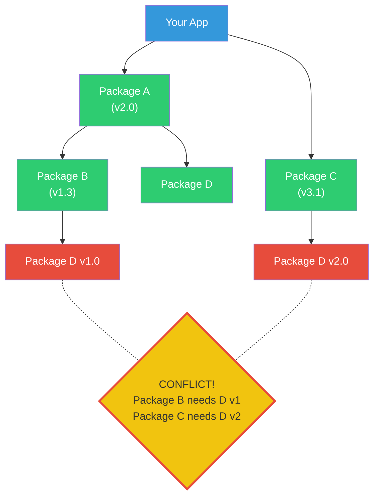

# Fase 3-11 -- O Inventario: Pacotes e Dependencias

---

## Change Log

| Versao | Data       | Autor                                  | Descricao          |
|--------|------------|----------------------------------------|--------------------|
| 1.0.0  | 2026-03-18 | Paula Silva - Microsoft Latam Software GBB | Criacao inicial    |

---

## Sumario

- [Prologo: A Mochila Cheia Demais](#prologo-a-mochila-cheia-demais)
- [1. O Que Sao Pacotes e Dependencias?](#1-o-que-sao-pacotes-e-dependencias)
  - [1.1 Pacotes: Itens da Loja](#11-pacotes-itens-da-loja)
  - [1.2 Dependencias: Itens que Precisam de Outros Itens](#12-dependencias-itens-que-precisam-de-outros-itens)
  - [1.3 Por Que Nao Fazer Tudo do Zero?](#13-por-que-nao-fazer-tudo-do-zero)
- [2. Gerenciadores de Pacotes: As Lojas de Itens](#2-gerenciadores-de-pacotes-as-lojas-de-itens)
  - [2.1 npm e Yarn (JavaScript/TypeScript)](#21-npm-e-yarn-javascripttypescript)
  - [2.2 pip (Python)](#22-pip-python)
  - [2.3 NuGet (C# / .NET)](#23-nuget-c--net)
  - [2.4 Outros Gerenciadores](#24-outros-gerenciadores)
  - [2.5 Tabela Comparativa](#25-tabela-comparativa)
- [3. package.json: O Inventario Oficial](#3-packagejson-o-inventario-oficial)
  - [3.1 Anatomia do package.json](#31-anatomia-do-packagejson)
  - [3.2 dependencies vs devDependencies](#32-dependencies-vs-devdependencies)
  - [3.3 Scripts: Atalhos Magicos](#33-scripts-atalhos-magicos)
  - [3.4 Criando um package.json do Zero](#34-criando-um-packagejson-do-zero)
- [4. requirements.txt e pyproject.toml: O Inventario Python](#4-requirementstxt-e-pyprojecttoml-o-inventario-python)
  - [4.1 requirements.txt Basico](#41-requirementstxt-basico)
  - [4.2 Ambientes Virtuais: Mochilas Separadas](#42-ambientes-virtuais-mochilas-separadas)
  - [4.3 pyproject.toml: O Inventario Moderno](#43-pyprojecttoml-o-inventario-moderno)
- [5. Lock Files: Congelando as Versoes Exatas](#5-lock-files-congelando-as-versoes-exatas)
  - [5.1 O Problema que Lock Files Resolvem](#51-o-problema-que-lock-files-resolvem)
  - [5.2 package-lock.json Explicado](#52-package-lockjson-explicado)
  - [5.3 Regras de Ouro para Lock Files](#53-regras-de-ouro-para-lock-files)
- [6. Versionamento de Dependencias: Os Ranges](#6-versionamento-de-dependencias-os-ranges)
  - [6.1 Til (~) e Caret (^)](#61-til--e-caret-)
  - [6.2 Outros Ranges](#62-outros-ranges)
  - [6.3 Qual Usar?](#63-qual-usar)
- [7. Dependency Hell: Quando os Itens Conflitam](#7-dependency-hell-quando-os-itens-conflitam)
  - [7.1 O Que E Dependency Hell](#71-o-que-e-dependency-hell)
  - [7.2 Tipos de Conflito](#72-tipos-de-conflito)
  - [7.3 Como Resolver Conflitos](#73-como-resolver-conflitos)
  - [7.4 Como Prevenir Dependency Hell](#74-como-prevenir-dependency-hell)
- [8. Seguranca de Dependencias: Itens Envenenados](#8-seguranca-de-dependencias-itens-envenenados)
  - [8.1 O Risco de Dependencias](#81-o-risco-de-dependencias)
  - [8.2 Auditorias de Seguranca](#82-auditorias-de-seguranca)
  - [8.3 Dependabot e Renovate](#83-dependabot-e-renovate)
- [9. Monorepos e Workspaces: Inventario Compartilhado](#9-monorepos-e-workspaces-inventario-compartilhado)
  - [9.1 O Que E um Monorepo](#91-o-que-e-um-monorepo)
  - [9.2 Ferramentas de Monorepo](#92-ferramentas-de-monorepo)
- [10. Boas Praticas: Regras do Inventario](#10-boas-praticas-regras-do-inventario)
- [11. Tabela Final de Resumo](#11-tabela-final-de-resumo)
- [Referencias](#referencias)

---

## Prologo: A Mochila Cheia Demais

Sofia comecou a construir seu TodoApp. Precisava de um servidor HTTP -- encontrou o Express. Precisava validar dados -- encontrou o Zod. Precisava conectar ao banco -- encontrou o Prisma. Precisava formatar datas -- encontrou o date-fns. Precisava de autenticacao -- encontrou o jsonwebtoken.

Em poucas horas, seu projeto tinha 47 dependencias diretas e... 1.247 dependencias indiretas. A pasta `node_modules` pesava 300 MB.

Sofia olhou assustada para o terminal. *"Como 47 itens viraram 1.247?!"*

Toad -- o guardiao dos tesouros e dados -- apareceu carregando uma mochila gigante que mal cabia nas costas.

*"Sofia, bem-vinda ao mundo das DEPENDENCIAS. Cada item que voce pega na loja vem com outros itens dentro -- que por sua vez vem com MAIS itens dentro. E como uma matrioska infinita. Voce pediu 47 coisas, mas cada coisa precisava de outras 25 para funcionar."*

Toad derrubou a mochila no chao. Items cairam para todos os lados.

*"O segredo nao e evitar dependencias -- e GERENCIA-LAS. Bem-vinda a Fase 3-11: o sistema de inventario."*

---

## 1. O Que Sao Pacotes e Dependencias?

### 1.1 Pacotes: Itens da Loja

Um **pacote** (package) e um pedaco de codigo que alguem escreveu e publicou para que outros possam usar. Em vez de reinventar a roda, voce instala o pacote e usa.

> **ANALOGIA MARIO:** Pacotes sao **itens da loja do Toad**. Em vez de fabricar seu proprio Mushroom (codigo de autenticacao), voce vai ate a Loja do Toad (npm, pip) e compra um Mushroom pronto (pacote jsonwebtoken). Alguem ja fez o trabalho duro. Voce so instala e usa.

**Exemplos de pacotes populares:**

| Pacote | Linguagem | O que faz | Downloads/mes |
|--------|-----------|----------|---------------|
| **express** | JavaScript | Servidor HTTP | ~30 milhoes |
| **react** | JavaScript | Interface de usuario | ~25 milhoes |
| **lodash** | JavaScript | Utilitarios gerais | ~50 milhoes |
| **requests** | Python | Requisicoes HTTP | ~30 milhoes |
| **pandas** | Python | Manipulacao de dados | ~20 milhoes |
| **Newtonsoft.Json** | C# | Serializar/deserializar JSON | ~15 milhoes |

### 1.2 Dependencias: Itens que Precisam de Outros Itens

Uma **dependencia** e um pacote que SEU projeto precisa para funcionar. E suas dependencias tambem podem ter dependencias (dependencias transitivas):

```
Seu Projeto
├── express (voce instalou)
│   ├── accepts (express precisa)
│   ├── body-parser (express precisa)
│   │   ├── bytes (body-parser precisa)
│   │   ├── content-type (body-parser precisa)
│   │   ├── depd (body-parser precisa)
│   │   └── ... (mais 5 dependencias)
│   ├── cookie (express precisa)
│   └── ... (mais 25 dependencias)
├── prisma (voce instalou)
│   └── ... (mais 15 dependencias)
└── zod (voce instalou -- ZERO dependencias! Raro e admiravel)
```

> **ANALOGIA MARIO:** E como o sistema de itens do RPG. A **Fire Flower** (Express) precisa de um **Mushroom** (body-parser) para funcionar. O Mushroom precisa de **Moedas** (bytes, content-type). As Moedas precisam de... e assim por diante. Voce pediu UMA Fire Flower, mas ela trouxe toda uma cadeia de itens junto.

### 1.3 Por Que Nao Fazer Tudo do Zero?

| Fazer do zero | Usar pacote | Veredito |
|--------------|-------------|---------|
| Escrever servidor HTTP: ~2000 linhas | `npm install express`: 5 segundos | Pacote |
| Escrever parser JSON: ~500 linhas | Ja vem no Node.js | Nao reinvente |
| Escrever funcao de soma: 3 linhas | Instalar lodash so para `_.sum()` | Faca voce mesmo |
| Escrever JWT auth: ~800 linhas (e perigoso!) | `npm install jsonwebtoken` | PACOTE (seguranca!) |

**Regra pratica:** Se e simples (< 20 linhas) e nao envolve seguranca, faca voce mesmo. Se e complexo ou envolve seguranca/criptografia, use um pacote de confianca.

### Diagrama: Arvore de Dependencias de Pacotes



---

## 2. Gerenciadores de Pacotes: As Lojas de Itens

### 2.1 npm e Yarn (JavaScript/TypeScript)

**npm** (Node Package Manager) e o gerenciador padrao do Node.js. **Yarn** e uma alternativa criada pelo Facebook com funcionalidades extras.

```bash
# npm -- Comandos essenciais

# Inicializar projeto (cria package.json)
npm init -y

# Instalar dependencia
npm install express          # Dependencia de producao
npm install -D jest          # Dependencia de DESENVOLVIMENTO (devDep)
npm install -g nodemon       # Instalar GLOBALMENTE (na maquina)

# Instalar todas as dependencias do package.json
npm install                  # ou simplesmente: npm i

# Remover dependencia
npm uninstall express

# Atualizar dependencias
npm update                   # Atualiza dentro dos ranges permitidos
npm outdated                 # Mostra o que esta desatualizado

# Rodar scripts definidos no package.json
npm run dev
npm test
npm run build

# Verificar vulnerabilidades
npm audit
npm audit fix
```

> **ANALOGIA MARIO:** npm e a **Loja do Toad** -- a maior loja de itens do Mushroom Kingdom, com mais de 2 milhoes de itens (pacotes) disponiveis. `npm install` e entrar na loja e dizer "quero aquele item". `npm audit` e o inspetor verificando se algum item esta estragado ou envenenado.

**pnpm** e outra alternativa, mais eficiente em espaco em disco (usa hard links para nao duplicar pacotes):

```bash
# pnpm -- mesma interface, armazenamento mais eficiente
pnpm install express
pnpm add -D jest
```

### 2.2 pip (Python)

```bash
# pip -- Gerenciador de pacotes Python

# Instalar pacote
pip install requests
pip install django==5.0       # Versao especifica
pip install "fastapi>=0.100"  # Versao minima

# Instalar a partir de um arquivo
pip install -r requirements.txt

# Listar pacotes instalados
pip list
pip freeze                    # Formato para requirements.txt

# Atualizar pacote
pip install --upgrade requests

# Desinstalar
pip uninstall requests

# Verificar vulnerabilidades
pip audit                     # (precisa instalar pip-audit)
```

### 2.3 NuGet (C# / .NET)

```bash
# NuGet -- via .NET CLI

# Instalar pacote
dotnet add package Newtonsoft.Json
dotnet add package Microsoft.EntityFrameworkCore --version 8.0.0

# Listar pacotes
dotnet list package

# Atualizar
dotnet add package Newtonsoft.Json --version 13.0.3

# Restaurar (instalar todas as dependencias)
dotnet restore
```

### 2.4 Outros Gerenciadores

| Gerenciador | Linguagem | Arquivo de Config | Registro |
|------------|-----------|-------------------|----------|
| **cargo** | Rust | Cargo.toml | crates.io |
| **go mod** | Go | go.mod | proxy.golang.org |
| **composer** | PHP | composer.json | packagist.org |
| **gem** | Ruby | Gemfile | rubygems.org |
| **Maven/Gradle** | Java | pom.xml / build.gradle | Maven Central |

### 2.5 Tabela Comparativa

| Aspecto | npm | pip | NuGet | cargo |
|---------|-----|-----|-------|-------|
| **Linguagem** | JS/TS | Python | C# | Rust |
| **Registro** | npmjs.com | pypi.org | nuget.org | crates.io |
| **Arquivo config** | package.json | requirements.txt / pyproject.toml | .csproj | Cargo.toml |
| **Lock file** | package-lock.json | Nao tem (use pip-tools) | packages.lock.json | Cargo.lock |
| **Pasta de instalacao** | node_modules/ | site-packages/ | ~/.nuget/ | target/ |
| **N. de pacotes** | ~2.5 milhoes | ~500 mil | ~400 mil | ~150 mil |
| **Analogia Mario** | Loja do Toad (enorme) | Loja do Mago | Forja Real | Loja da Fortaleza |

---

## 3. package.json: O Inventario Oficial

### 3.1 Anatomia do package.json

O `package.json` e o arquivo central de qualquer projeto Node.js/JavaScript:

```json
{
  "name": "todoapp",
  "version": "1.0.0",
  "description": "Aplicacao de tarefas do Mushroom Kingdom",
  "main": "src/index.js",
  "type": "module",

  "scripts": {
    "dev": "nodemon src/index.js",
    "start": "node src/index.js",
    "build": "tsc",
    "test": "jest",
    "lint": "eslint src/",
    "format": "prettier --write src/"
  },

  "dependencies": {
    "express": "^4.18.2",
    "prisma": "^5.10.0",
    "zod": "^3.22.0",
    "jsonwebtoken": "^9.0.0"
  },

  "devDependencies": {
    "jest": "^29.7.0",
    "typescript": "^5.3.0",
    "eslint": "^8.56.0",
    "prettier": "^3.2.0",
    "nodemon": "^3.0.0",
    "@types/express": "^4.17.21"
  },

  "engines": {
    "node": ">=18.0.0"
  },

  "license": "MIT",
  "author": "Sofia <sofia@mushroom.kingdom>"
}
```

> **ANALOGIA MARIO:** O `package.json` e a **lista oficial do inventario**. Cada campo diz algo:
> - `name` = Nome do aventureiro
> - `version` = Level atual (SemVer!)
> - `scripts` = Atalhos de comando (magia rapida)
> - `dependencies` = Itens essenciais para a aventura
> - `devDependencies` = Itens so para treino (nao vao para producao)
> - `engines` = "Requer console Nintendo versao 18+"

### 3.2 dependencies vs devDependencies

| Tipo | Quando usar | Vai para producao? | Exemplo |
|------|------------|-------------------|---------|
| **dependencies** | Codigo PRECISA para rodar | SIM | express, react, prisma |
| **devDependencies** | So precisa para DESENVOLVER | NAO | jest, eslint, typescript |
| **peerDependencies** | Plugin que espera que voce ja tenha | Depende | @types/react (espera que react ja esteja) |

> **ANALOGIA MARIO:** `dependencies` sao itens que Mario PRECISA na batalha real (Fire Flower, Mushroom). `devDependencies` sao itens de treino que ficam no campo de pratica (bonecos de teste, mapas de estudo). Voce nao leva bonecos de treino para a batalha final!

```bash
# Instalar como dependencia de producao
npm install express

# Instalar como dependencia de DESENVOLVIMENTO
npm install -D jest

# Instalar SOMENTE dependencias de producao (deploy)
npm install --production
# ou
npm ci --production
```

### 3.3 Scripts: Atalhos Magicos

Scripts no package.json sao atalhos para comandos frequentes:

```json
{
  "scripts": {
    "dev": "nodemon src/index.js",
    "start": "node src/index.js",
    "build": "tsc && npm run lint",
    "test": "jest --coverage",
    "test:watch": "jest --watch",
    "lint": "eslint src/",
    "lint:fix": "eslint src/ --fix",
    "format": "prettier --write src/",
    "db:migrate": "prisma migrate dev",
    "db:seed": "prisma db seed",
    "docker:up": "docker-compose up -d",
    "docker:down": "docker-compose down"
  }
}
```

```bash
# Rodar scripts
npm run dev          # Inicia em modo desenvolvimento
npm test             # Roda testes (atalho: npm t)
npm run build        # Compila o projeto
npm run lint:fix     # Corrige problemas de lint automaticamente
```

> **ANALOGIA MARIO:** Scripts sao **atalhos de magia** -- em vez de digitar o feitico inteiro toda vez ("nodemon src/index.js"), voce grita "DEV!" e a magia acontece. Todo aventureiro competente tem seus atalhos memorizados.

### 3.4 Criando um package.json do Zero

```bash
# Opcao 1: Interativo (responde perguntas)
npm init

# Opcao 2: Padrao automatico (sem perguntas)
npm init -y

# Opcao 3: Para projetos TypeScript modernos
npm init -y && npm install -D typescript @types/node ts-node
npx tsc --init
```

---

## 4. requirements.txt e pyproject.toml: O Inventario Python

### 4.1 requirements.txt Basico

```bash
# requirements.txt -- formato simples
fastapi==0.109.0
uvicorn==0.27.0
sqlalchemy>=2.0,<3.0
pydantic>=2.0
python-dotenv~=1.0.0
requests>=2.31.0
```

```bash
# Instalar tudo
pip install -r requirements.txt

# Gerar a partir do ambiente atual
pip freeze > requirements.txt
```

### 4.2 Ambientes Virtuais: Mochilas Separadas

Em Python, **ambientes virtuais** isolam as dependencias de cada projeto:

```bash
# Criar ambiente virtual
python -m venv venv

# Ativar (Mac/Linux)
source venv/bin/activate

# Ativar (Windows)
venv\Scripts\activate

# Agora pip instala NESTE ambiente, nao globalmente
pip install fastapi

# Desativar
deactivate
```

> **ANALOGIA MARIO:** Ambientes virtuais sao como **mochilas separadas para cada missao**. Na missao do Castelo de Bowser, voce leva Fire Flower e Star. Na missao subaquatica, leva Frog Suit e Penguin Suit. Se colocar tudo numa mochila so, fica pesado e confuso.

### 4.3 pyproject.toml: O Inventario Moderno

O formato moderno para projetos Python:

```toml
[project]
name = "todoapp"
version = "1.0.0"
description = "TodoApp do Mushroom Kingdom"
requires-python = ">=3.11"
dependencies = [
    "fastapi>=0.109.0",
    "uvicorn>=0.27.0",
    "sqlalchemy>=2.0",
]

[project.optional-dependencies]
dev = [
    "pytest>=8.0",
    "black>=24.0",
    "mypy>=1.8",
]
```

---

## 5. Lock Files: Congelando as Versoes Exatas

### 5.1 O Problema que Lock Files Resolvem

Imagine este cenario sem lock file:

```
SEGUNDA-FEIRA:
Sofia roda "npm install"
express instalado: 4.18.2
Tudo funciona!

TERCA-FEIRA:
Express lanca versao 4.18.3 (com um bug!)
Colega roda "npm install"
express instalado: 4.18.3
TUDO QUEBRA!

"Mas na minha maquina funciona!" -- frase mais odiada do desenvolvimento
```

> **ANALOGIA MARIO:** Sem lock file, e como se a Loja do Toad mudasse os itens toda hora. Voce comprou um Mushroom na segunda -- era vermelho, te faz crescer. Na terca, seu amigo comprou "o mesmo" Mushroom -- mas agora e roxo e te envenena. Lock file congela: "este Mushroom e EXATAMENTE versao 4.18.2, com EXATAMENTE estas propriedades."

### 5.2 package-lock.json Explicado

O `package-lock.json` registra a **versao EXATA** de CADA dependencia (direta e transitiva):

```json
{
  "name": "todoapp",
  "lockfileVersion": 3,
  "packages": {
    "node_modules/express": {
      "version": "4.18.2",           // EXATAMENTE esta versao
      "resolved": "https://registry.npmjs.org/express/-/express-4.18.2.tgz",
      "integrity": "sha512-abc123...",  // Hash para verificar integridade
      "dependencies": {
        "accepts": "~1.3.8",
        "body-parser": "1.20.1",
        "cookie": "0.5.0"
      }
    },
    "node_modules/body-parser": {
      "version": "1.20.1",
      "resolved": "https://registry.npmjs.org/body-parser/-/body-parser-1.20.1.tgz",
      "integrity": "sha512-def456..."
    }
  }
}
```

**`npm ci` vs `npm install`:**

| Comando | O que faz | Quando usar |
|---------|----------|-------------|
| `npm install` | Le package.json, resolve versoes, atualiza lock file | Desenvolvimento (adicionar pacotes) |
| `npm ci` | Le package-lock.json, instala versoes EXATAS | CI/CD e producao (reproduzir ambiente) |

```bash
# Em desenvolvimento: npm install (flexivel)
npm install

# Em CI/CD e deploy: npm ci (exato, reproduzivel)
npm ci
```

### 5.3 Regras de Ouro para Lock Files

1. **SEMPRE** commite o lock file no repositorio
2. **NUNCA** edite o lock file manualmente
3. Use `npm ci` em pipelines de CI/CD
4. Se o lock file gera conflito de merge, delete e rode `npm install`
5. Revise atualizacoes de lock file em PRs -- mudancas inesperadas podem indicar problema

---

## 6. Versionamento de Dependencias: Os Ranges

### 6.1 Til (~) e Caret (^)

Quando voce declara uma dependencia no package.json, usa **ranges** para indicar que versoes sao aceitas:

| Notacao | Significado | Exemplo | Aceita |
|---------|------------|---------|--------|
| `^4.18.2` | Aceita MINOR e PATCH | `^4.18.2` | 4.18.2, 4.18.3, 4.19.0, 4.99.9 (NAO 5.0.0) |
| `~4.18.2` | Aceita so PATCH | `~4.18.2` | 4.18.2, 4.18.3, 4.18.99 (NAO 4.19.0) |
| `4.18.2` | EXATAMENTE esta | `4.18.2` | So 4.18.2 |

> **ANALOGIA MARIO:**
> - `^4.18.2` (caret) = "Aceito qualquer Mushroom da familia 4, desde que nao mude drasticamente" -- aceita melhorias e correcoes, mas nao versoes incompativeis.
> - `~4.18.2` (til) = "Aceito so correcoes de bug deste Mushroom especifico" -- mais conservador.
> - `4.18.2` (fixo) = "Quero EXATAMENTE este Mushroom, nao mude nada" -- maximo controle.

### 6.2 Outros Ranges

```json
{
  "dependencies": {
    "express": "^4.18.2",       // >= 4.18.2 e < 5.0.0
    "lodash": "~4.17.21",       // >= 4.17.21 e < 4.18.0
    "react": "18.2.0",          // Exatamente 18.2.0
    "zod": ">=3.0.0",           // Qualquer coisa >= 3.0.0
    "prisma": ">=5.0.0 <6.0.0", // Range explicito
    "typescript": "*",          // Qualquer versao (PERIGO!)
    "jest": "latest"            // Ultima versao (PERIGO EM PRODUCAO!)
  }
}
```

### 6.3 Qual Usar?

| Cenario | Recomendacao | Por que |
|---------|-------------|---------|
| Aplicacao (projeto final) | `^` (caret) | Recebe patches e features menores |
| Biblioteca (publicada no npm) | `^` (caret) | Flexibilidade para quem consome |
| Ambiente critico (producao) | Versao exata | Maxima previsibilidade |
| Dependencia com historico de breaking changes | `~` (til) | Mais conservador |
| **NUNCA em producao** | `*` ou `latest` | Imprevisivel! |

---

## 7. Dependency Hell: Quando os Itens Conflitam

### 7.1 O Que E Dependency Hell

**Dependency Hell** e quando suas dependencias entram em conflito entre si -- uma precisa da versao X, outra precisa da versao Y, e X e Y sao incompativeis.

> **ANALOGIA MARIO:** Dependency Hell e quando seus **itens conflitam entre si**. A Fire Flower exige Mushroom versao 2.0. Mas o Cape exige Mushroom versao 1.5. E Mushroom 2.0 e 1.5 nao podem coexistir na mochila. Resultado: voce nao consegue equipar Fire Flower E Cape ao mesmo tempo. Sua mochila esta em conflito. Dependency Hell.

### 7.2 Tipos de Conflito

**1. Conflito de versao direto:**

```
Seu projeto
├── pacote-A requer lodash@^4.0.0
└── pacote-B requer lodash@^3.0.0   // CONFLITO! 4.x e 3.x sao incompativeis
```

**2. Diamond dependency (dependencia diamante):**

```
        Seu Projeto
       /           \
   pacote-A      pacote-B
       \           /
        pacote-C
  (A quer C@2.0, B quer C@1.0)
```

**3. Peer dependency nao satisfeita:**

```bash
# Erro classico:
npm WARN peerDependencies react@18.0.0 required by some-library@1.0.0
# Voce tem react@17.0.0, mas a biblioteca quer react@18
```

### 7.3 Como Resolver Conflitos

```bash
# 1. Ver a arvore de dependencias
npm ls
npm ls lodash    # Ver quem depende de lodash

# 2. Forcar resolucao (package.json)
{
  "overrides": {
    "lodash": "^4.17.21"
  }
}

# 3. Limpar e reinstalar
rm -rf node_modules package-lock.json
npm install

# 4. Usar npm dedupe (desduplicar)
npm dedupe
```

### 7.4 Como Prevenir Dependency Hell

| Pratica | Como | Por que |
|---------|------|---------|
| **Menos dependencias** | Avalie se realmente precisa | Menos itens = menos conflitos |
| **Dependencias populares** | Prefira pacotes com muitos downloads | Mais testados, mais compativeis |
| **Atualize regularmente** | `npm outdated` toda semana | Atualizacoes pequenas e frequentes < atualizar tudo de uma vez |
| **Use Dependabot** | Configure no GitHub | Atualiza automaticamente |
| **Teste apos atualizar** | CI/CD rodando testes | Pega conflitos cedo |
| **Lock file sempre** | Commite package-lock.json | Versoes reproduziveis |

---

## 8. Seguranca de Dependencias: Itens Envenenados

### 8.1 O Risco de Dependencias

Quando voce instala um pacote, voce confia no codigo de outra pessoa. Isso traz riscos:

| Risco | Exemplo Real | Consequencia |
|-------|-------------|-------------|
| **Malware** | event-stream (2018) -- pacote popular injetado com malware | Roubava Bitcoin |
| **Typosquatting** | `lodahs` em vez de `lodash` -- pacote falso | Malware ao instalar com typo |
| **Supply chain attack** | ua-parser-js (2021) -- pacote hackeado | Minerador de crypto instalado em milhoes de projetos |
| **Vulnerabilidade conhecida** | log4j (2021) -- falha critica em biblioteca Java | Milhoes de sistemas vulneraveis |

> **ANALOGIA MARIO:** Itens envenenados sao como **Mushrooms falsos** -- parecem identicos ao Mushroom real, mas quando Mario come, ele ENCOLHE em vez de crescer. A Loja do Toad (npm) tenta verificar itens, mas com 2 milhoes de itens no estoque, coisas escapam. Cabe ao aventureiro verificar antes de consumir.

### 8.2 Auditorias de Seguranca

```bash
# npm: verificar vulnerabilidades conhecidas
npm audit

# Corrigir automaticamente (quando possivel)
npm audit fix

# Corrigir com breaking changes (cuidado!)
npm audit fix --force

# pip (Python): precisa de pip-audit
pip install pip-audit
pip-audit

# Ferramenta avancada: Snyk
npx snyk test
```

### 8.3 Dependabot e Renovate

**Dependabot** (GitHub nativo) e **Renovate** (open source) automatizam atualizacoes de dependencias:

```yaml
# .github/dependabot.yml
version: 2
updates:
  - package-ecosystem: "npm"
    directory: "/"
    schedule:
      interval: "weekly"
    open-pull-requests-limit: 10
    reviewers:
      - "sofia"
```

> **ANALOGIA MARIO:** Dependabot e o **Toad Inspetor** que passa na sua mochila toda semana e diz: "Ei, seu Mushroom versao 4.18.2 tem uma falha de seguranca. Ja existe a versao 4.18.3 que corrige. Quer trocar?" E abre um PR automatico para voce aprovar.

---

## 9. Monorepos e Workspaces: Inventario Compartilhado

### 9.1 O Que E um Monorepo

Um **monorepo** e um unico repositorio contendo multiplos projetos que compartilham dependencias:

```
todoapp-monorepo/
├── package.json          # Raiz: dependencias compartilhadas
├── packages/
│   ├── frontend/         # Projeto React
│   │   └── package.json
│   ├── backend/          # Projeto Express
│   │   └── package.json
│   └── shared/           # Codigo compartilhado
│       └── package.json
```

### 9.2 Ferramentas de Monorepo

| Ferramenta | Linguagem | Abordagem |
|-----------|-----------|-----------|
| **npm workspaces** | JS/TS | Nativo no npm 7+ |
| **Yarn workspaces** | JS/TS | Nativo no Yarn |
| **pnpm workspaces** | JS/TS | Eficiente em disco |
| **Turborepo** | JS/TS | Build cache e paralelismo |
| **Nx** | Multi-linguagem | Enterprise, plugins |
| **Lerna** | JS/TS | Classico (agora mantido pela Nx) |

---

## 10. Boas Praticas: Regras do Inventario

1. **Minimalismo**: Instale SOMENTE o necessario. Cada dependencia e um risco e um peso.
2. **Avalie antes de instalar**: Verifique downloads, ultima atualizacao, issues abertas, licenca.
3. **Separe dev de prod**: Use `devDependencies` para ferramentas de desenvolvimento.
4. **Lock file no repo**: SEMPRE commite package-lock.json / yarn.lock.
5. **Atualize frequentemente**: Atualizacoes pequenas e frequentes sao mais seguras que uma atualizacao gigante.
6. **Audite regularmente**: `npm audit` pelo menos semanalmente.
7. **Use Dependabot**: Automatize atualizacoes de seguranca.
8. **Nao use `*` ou `latest`**: Fixe ranges com `^` ou `~`.
9. **Verifique licencas**: Alguns pacotes tem licencas restritivas (GPL pode "contaminar" seu projeto).
10. **Documente decisoes**: Quando escolher um pacote, anote POR QUE no PR/commit.

> **ANALOGIA MARIO:** Um aventureiro sabio nao enche a mochila com tudo que ve na loja. Ele pega so o essencial, verifica se cada item esta em bom estado, anota o que levou e por que, e inspeciona a mochila regularmente para trocar itens velhos por versoes melhores.

---

## 11. Tabela Final de Resumo

| Conceito | O que E | Em Mario | Comando/Arquivo |
|----------|---------|----------|----------------|
| **Pacote** | Codigo reutilizavel publicado | Item da Loja do Toad | `npm install x` |
| **Dependencia** | Pacote que seu projeto precisa | Item essencial na mochila | `dependencies` |
| **devDependency** | Pacote so para desenvolvimento | Item de treino | `devDependencies` |
| **Gerenciador** | Ferramenta que instala pacotes | A propria Loja do Toad | npm, pip, NuGet |
| **Registro** | Repositorio central de pacotes | Armazem central da Loja | npmjs.com, pypi.org |
| **package.json** | Lista de dependencias do projeto | Inventario oficial | `npm init` |
| **Lock file** | Versoes exatas congeladas | Inventario congelado no tempo | package-lock.json |
| **SemVer range** | Quais versoes sao aceitas | "Aceito Mushrooms 4.x" | `^4.18.2`, `~4.18.2` |
| **Dependency hell** | Conflito entre dependencias | Itens conflitantes na mochila | `npm ls`, `overrides` |
| **Auditoria** | Verificar vulnerabilidades | Inspecionar itens envenenados | `npm audit` |
| **Dependabot** | Atualizacao automatica | Toad Inspetor semanal | `.github/dependabot.yml` |

---

## Referencias

- [npm -- Documentacao Oficial](https://docs.npmjs.com/)
- [pip -- Documentacao Oficial](https://pip.pypa.io/en/stable/)
- [NuGet -- Documentacao Oficial](https://learn.microsoft.com/pt-br/nuget/)
- [npm -- package.json](https://docs.npmjs.com/cli/configuring-npm/package-json)
- [npm -- package-lock.json](https://docs.npmjs.com/cli/configuring-npm/package-lock-json)
- [Semantic Versioning -- Node.js Ranges](https://github.com/npm/node-semver)
- [Dependabot -- Configuracao](https://docs.github.com/pt/code-security/dependabot)
- [Snyk -- Seguranca de Dependencias](https://snyk.io/)
- [pnpm -- Gerenciador Eficiente](https://pnpm.io/)
- [Turborepo -- Monorepo Build System](https://turbo.build/repo)
- [Python Packaging User Guide](https://packaging.python.org/)

---

*Fim da Fase 3-11. Sofia agora domina seu inventario de pacotes. Na proxima fase, ela enfrenta o Boss do World 3: exercicios praticos que combinam tudo o que aprendeu neste mundo.*
