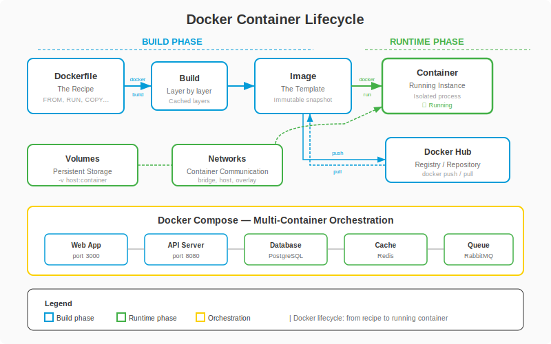

# Fase 3-3 -- A Arte de Empacotar: Docker e Containers

---

## Change Log

| Versao | Data       | Autor                                      | Descricao                     |
|--------|------------|--------------------------------------------|-------------------------------|
| 1.0.0  | 2026-03-18 | Paula Silva - Software Global Black Belt, Microsoft Americas | Criacao inicial (Edicao Mario)|

---

## Sumario

- [Prologo: "Na Minha Maquina Funciona"](#prologo-na-minha-maquina-funciona)
- [1. O Problema que Docker Resolve](#1-o-problema-que-docker-resolve)
  - [1.1 O Inferno das Dependencias](#11-o-inferno-das-dependencias)
  - [1.2 A Solucao: Empacotar Tudo Junto](#12-a-solucao-empacotar-tudo-junto)
- [2. Conceitos Fundamentais](#2-conceitos-fundamentais)
  - [2.1 Imagem: A Receita](#21-imagem-a-receita)
  - [2.2 Container: O Prato Pronto](#22-container-o-prato-pronto)
  - [2.3 Dockerfile: A Ficha de Receita](#23-dockerfile-a-ficha-de-receita)
  - [2.4 Docker Hub: O Servidor de Troca de Receitas](#24-docker-hub-o-servidor-de-troca-de-receitas)
  - [2.5 Tabela de Conceitos](#25-tabela-de-conceitos)
- [3. Dockerfile: Escrevendo Sua Primeira Receita](#3-dockerfile-escrevendo-sua-primeira-receita)
  - [3.1 Anatomia de um Dockerfile](#31-anatomia-de-um-dockerfile)
  - [3.2 Instrucoes Essenciais](#32-instrucoes-essenciais)
  - [3.3 Primeiro Dockerfile: Node.js App](#33-primeiro-dockerfile-nodejs-app)
  - [3.4 .dockerignore: O que NAO vai na Marmita](#34-dockerignore-o-que-nao-vai-na-marmita)
- [4. Comandos Docker Essenciais](#4-comandos-docker-essenciais)
  - [4.1 Construir Imagem (docker build)](#41-construir-imagem-docker-build)
  - [4.2 Rodar Container (docker run)](#42-rodar-container-docker-run)
  - [4.3 Gerenciar Containers](#43-gerenciar-containers)
  - [4.4 Gerenciar Imagens](#44-gerenciar-imagens)
  - [4.5 Tabela de Comandos](#45-tabela-de-comandos)
- [5. Volumes: Dados Persistentes](#5-volumes-dados-persistentes)
  - [5.1 O Problema: Containers Sao Efemeros](#51-o-problema-containers-sao-efemeros)
  - [5.2 Volumes: O Cofre Permanente](#52-volumes-o-cofre-permanente)
  - [5.3 Bind Mounts: Espelho do Mundo Real](#53-bind-mounts-espelho-do-mundo-real)
- [6. Networking: Containers Conversando](#6-networking-containers-conversando)
  - [6.1 Portas: Portas do Castelo](#61-portas-portas-do-castelo)
  - [6.2 Redes Docker: Reinos Conectados](#62-redes-docker-reinos-conectados)
- [7. Docker Compose: O Planejador de Refeicoes](#7-docker-compose-o-planejador-de-refeicoes)
  - [7.1 O Problema: Multiplos Containers](#71-o-problema-multiplos-containers)
  - [7.2 docker-compose.yml: O Cardapio Completo](#72-docker-composeyml-o-cardapio-completo)
  - [7.3 Exemplo Completo: TodoApp com Frontend + Backend + Banco](#73-exemplo-completo-todoapp-com-frontend--backend--banco)
  - [7.4 Comandos do Docker Compose](#74-comandos-do-docker-compose)
- [8. Multi-Stage Builds: Cozinha Grande, Prato Pequeno](#8-multi-stage-builds-cozinha-grande-prato-pequeno)
  - [8.1 O Problema do Tamanho](#81-o-problema-do-tamanho)
  - [8.2 A Solucao Multi-Stage](#82-a-solucao-multi-stage)
  - [8.3 Exemplo Pratico: React App Otimizado](#83-exemplo-pratico-react-app-otimizado)
  - [8.4 Comparacao de Tamanho](#84-comparacao-de-tamanho)
- [9. Boas Praticas Docker](#9-boas-praticas-docker)
  - [9.1 Os 10 Mandamentos do Dockerfile](#91-os-10-mandamentos-do-dockerfile)
  - [9.2 Seguranca em Containers](#92-seguranca-em-containers)
  - [9.3 Otimizacao de Cache de Layers](#93-otimizacao-de-cache-de-layers)
- [10. Docker no Fluxo de Desenvolvimento](#10-docker-no-fluxo-de-desenvolvimento)
  - [10.1 Desenvolvimento Local com Docker](#101-desenvolvimento-local-com-docker)
  - [10.2 Docker no CI/CD](#102-docker-no-cicd)
  - [10.3 Docker em Producao](#103-docker-em-producao)
- [11. Troubleshooting: Quando o Container Nao Sobe](#11-troubleshooting-quando-o-container-nao-sobe)
- [Resumo -- O que Aprendemos na Fase 3-3](#resumo----o-que-aprendemos-na-fase-3-3)
- [Referencias](#referencias)

---

## Prologo: "Na Minha Maquina Funciona"

<div align="center">

<br><em>Arquitetura Docker: do Dockerfile ao Container</em>
</div>

Sofia estava orgulhosa. Depois de semanas de trabalho, seu TodoApp estava perfeito. Rodava lindo no seu computador. Frontend responsivo, backend rapido, banco de dados integrado. Tudo funcionando.

Entao ela mandou o codigo para Luigi testar.

*"Sofia, nao funciona."*

*"Impossivel! Na minha maquina funciona perfeitamente!"*

*"Pois na minha nao. Meu Node.js e versao 16, o seu e 18. Meu PostgreSQL e 14, o seu e 15. E eu nao tenho a variavel de ambiente DATABASE_URL configurada."*

Yoshi apareceu voando entre os dois.

*"Esse e o problema mais classico do desenvolvimento de software,"* disse Yoshi. *"O codigo funciona na sua maquina, mas nao na dos outros. Sabe por que? Porque voce mandou so o codigo. E como mandar uma receita de bolo mas nao mandar o forno, os ingredientes, e as medidas exatas."*

Yoshi tirou uma lunchbox (marmita) magica do bolso.

*"Isso aqui e Docker. Em vez de mandar so a receita, voce empacota TUDO: o forno, os ingredientes, as medidas, a temperatura, e ate o timer. Quem receber a lunchbox so precisa abrir e aquecer. Funciona IGUAL em qualquer cozinha do mundo."*

Sofia olhou para a lunchbox com olhos brilhando. *"Voce esta me dizendo que eu posso empacotar minha aplicacao inteira -- com Node.js, PostgreSQL, variaveis de ambiente, tudo -- numa caixinha que roda em qualquer computador?"*

*"Exatamente. Bem-vinda a Fase 3-3."*

---

## 1. O Problema que Docker Resolve

### 1.1 O Inferno das Dependencias

Uma aplicacao moderna depende de muitas coisas:

```
Sua Aplicacao
├── Node.js v20.x (versao especifica!)
├── npm v10.x
├── PostgreSQL v16
├── Redis v7.2
├── Variavel DATABASE_URL
├── Variavel REDIS_URL
├── Variavel API_KEY
├── Certificados SSL
├── Pacotes do sistema operacional (libssl, libpq, etc.)
└── Configuracoes especificas do OS
```

Se QUALQUER uma dessas dependencias estiver diferente em outra maquina, sua aplicacao pode:
- Nao instalar
- Instalar mas nao rodar
- Rodar mas com bugs
- Rodar mas com performance diferente

> **ANALOGIA MARIO:** Imagine que cada fase do Mario precisasse de um console diferente. Fase 1-1 roda no SNES. Fase 1-2 precisa do Nintendo 64. Fase 1-3 so funciona no GameCube. Impossivel, certo? E exatamente assim que aplicacoes se comportam sem Docker -- cada uma precisa de um "console" (ambiente) especifico.

### 1.2 A Solucao: Empacotar Tudo Junto

Docker resolve isso criando **pacotes completos** (containers) que incluem:

- Sua aplicacao
- Todas as dependencias
- O sistema operacional minimo necessario
- Todas as configuracoes

```
SEM Docker:
[Seu Codigo] → "instale Node 20, PostgreSQL 16, configure PATH..."
                → 50 passos manuais, cada maquina diferente

COM Docker:
[Seu Codigo + Dockerfile] → docker build → docker run
                           → 2 comandos, funciona IGUAL em qualquer maquina
```

---

## 2. Conceitos Fundamentais

### 2.1 Imagem: A Receita

Uma **imagem Docker** e como uma **receita**. Ela descreve exatamente:
- Quais ingredientes (dependencias) usar
- Qual a ordem dos passos
- Qual o resultado final esperado

Uma receita nao e comida -- e a instrucao para fazer comida. Da mesma forma, uma imagem nao e um programa rodando -- e a instrucao para criar um programa rodando.

```
Imagem Docker = Receita
├── Base: Ubuntu 22.04 (tipo de forno)
├── Instalar Node.js 20 (ingrediente 1)
├── Copiar codigo (ingrediente 2)
├── Instalar dependencias (misturar)
├── Compilar (assar)
└── Definir comando de inicio (servir)
```

**Caracteristicas de imagens:**
- **Imutaveis**: Uma vez criada, nunca muda
- **Em camadas**: Cada instrucao cria uma camada (layer)
- **Reutilizaveis**: A mesma imagem roda em qualquer maquina com Docker
- **Versionaveis**: Podem ter tags (v1.0, v2.0, latest)

### 2.2 Container: O Prato Pronto

Um **container** e uma **instancia rodando** de uma imagem. Se a imagem e a receita, o container e o prato pronto servido na mesa.

```
1 Receita (Imagem) → Pode fazer multiplos pratos (Containers)

Imagem: node-app:v1.0
├── Container 1: rodando na porta 3000
├── Container 2: rodando na porta 3001
└── Container 3: rodando na porta 3002
```

**Caracteristicas de containers:**
- **Efemeros**: Podem ser criados e destruidos facilmente
- **Isolados**: Cada container roda separado dos outros
- **Leves**: Compartilham o kernel do host (diferente de VMs)
- **Reproduziveis**: Mesmo container roda igual em qualquer lugar

> **ANALOGIA MARIO:** A **imagem** e a receita de um bolo de aniversario do Mushroom Kingdom. Voce pode fazer 10 bolos (containers) com a mesma receita, e todos serao identicos. Se um bolo cair no chao (container crashar), voce faz outro identico em segundos usando a mesma receita. A receita nunca e afetada pelo que acontece com os bolos.

### 2.3 Dockerfile: A Ficha de Receita

O **Dockerfile** e o arquivo de texto onde voce escreve a receita (instrucoes para criar a imagem).

```dockerfile
# Dockerfile = Ficha de Receita
# Cada linha e um passo da receita

FROM node:20-alpine       # Passo 1: Comece com o forno Node.js
WORKDIR /app              # Passo 2: Vá para a bancada de trabalho
COPY package*.json ./     # Passo 3: Pegue a lista de ingredientes
RUN npm install           # Passo 4: Compre todos os ingredientes
COPY . .                  # Passo 5: Coloque tudo na bancada
RUN npm run build         # Passo 6: Misture e asse
EXPOSE 3000               # Passo 7: Abra a janela de servir
CMD ["npm", "start"]      # Passo 8: Sirva!
```

### 2.4 Docker Hub: O Servidor de Troca de Receitas

O **Docker Hub** e como um **servidor online de troca de receitas**. Desenvolvedores do mundo inteiro compartilham suas imagens la.

```bash
# Baixar imagem oficial do Node.js do Docker Hub
$ docker pull node:20-alpine

# Baixar imagem oficial do PostgreSQL
$ docker pull postgres:16

# Subir sua propria imagem para o Docker Hub
$ docker push meuusuario/meu-app:v1.0
```

**Imagens oficiais populares no Docker Hub:**

| Imagem | O que e | Downloads |
|--------|---------|-----------|
| `node` | Node.js runtime | 1B+ |
| `postgres` | PostgreSQL banco de dados | 1B+ |
| `nginx` | Servidor web | 1B+ |
| `redis` | Cache em memoria | 1B+ |
| `python` | Python runtime | 1B+ |
| `alpine` | Linux minimalista (5MB!) | 1B+ |

### 2.5 Tabela de Conceitos

| Conceito Docker | Analogia Mario | Analogia Culinaria | Descricao |
|----------------|---------------|-------------------|-----------|
| **Imagem** | Receita de fase | Receita do bolo | Template imutavel |
| **Container** | Fase rodando | Bolo pronto | Instancia ativa da imagem |
| **Dockerfile** | Ficha de construcao de fase | Ficha de receita escrita | Instrucoes para criar imagem |
| **Docker Hub** | Loja de fases da comunidade | Livro de receitas online | Repositorio de imagens |
| **Volume** | Save file que persiste | Geladeira (guarda comida) | Dados persistentes |
| **Network** | Canos entre fases | Corredor entre cozinhas | Comunicacao entre containers |
| **docker-compose** | Planejador de mundo | Cardapio completo | Orquestra multiplos containers |
| **Layer** | Camada da fase | Etapa da receita | Cada instrucao = uma camada |


---

## 3. Dockerfile: Escrevendo Sua Primeira Receita

### 3.1 Anatomia de um Dockerfile

Todo Dockerfile segue um padrao:

```dockerfile
# 1. IMAGEM BASE (qual forno usar)
FROM <imagem-base>:<tag>

# 2. CONFIGURACAO (preparar a cozinha)
WORKDIR /app
ENV NODE_ENV=production

# 3. DEPENDENCIAS (comprar ingredientes)
COPY package*.json ./
RUN npm install

# 4. CODIGO (colocar na bancada)
COPY . .

# 5. COMPILACAO (assar)
RUN npm run build

# 6. EXPOSICAO (abrir janela)
EXPOSE 3000

# 7. EXECUCAO (servir)
CMD ["npm", "start"]
```

### 3.2 Instrucoes Essenciais

| Instrucao | O que faz | Analogia Culinaria | Exemplo |
|-----------|----------|-------------------|---------|
| `FROM` | Define imagem base | Escolher tipo de forno | `FROM node:20-alpine` |
| `WORKDIR` | Define diretorio de trabalho | Ir para a bancada | `WORKDIR /app` |
| `COPY` | Copia arquivos para imagem | Colocar ingrediente na bancada | `COPY . .` |
| `RUN` | Executa comando durante build | Executar passo da receita | `RUN npm install` |
| `ENV` | Define variavel de ambiente | Ajustar temperatura | `ENV PORT=3000` |
| `EXPOSE` | Documenta porta | Abrir janela de servir | `EXPOSE 3000` |
| `CMD` | Comando ao iniciar container | Servir o prato | `CMD ["npm", "start"]` |
| `ENTRYPOINT` | Comando fixo de inicializacao | O garcom oficial | `ENTRYPOINT ["node"]` |
| `ARG` | Variavel so no build | Anotacao temporaria | `ARG VERSION=1.0` |
| `HEALTHCHECK` | Verificacao de saude | Provar o prato | `HEALTHCHECK CMD curl localhost:3000` |

### 3.3 Primeiro Dockerfile: Node.js App

```dockerfile
# ====================================
# Dockerfile para um TodoApp Node.js
# ====================================

# Passo 1: Usar Node.js 20 com Alpine Linux (imagem leve)
FROM node:20-alpine

# Passo 2: Criar e entrar no diretorio de trabalho
WORKDIR /app

# Passo 3: Copiar APENAS os arquivos de dependencias primeiro
# (Isso otimiza o cache -- se package.json nao mudou, pula npm install)
COPY package.json package-lock.json ./

# Passo 4: Instalar dependencias
RUN npm ci --only=production

# Passo 5: Copiar o resto do codigo
COPY . .

# Passo 6: Compilar TypeScript
RUN npm run build

# Passo 7: Documentar a porta
EXPOSE 3000

# Passo 8: Comando para iniciar a aplicacao
CMD ["node", "dist/index.js"]
```

> **ANALOGIA MARIO:** Cada passo do Dockerfile e como construir uma camada de uma fase. `FROM` e o chao (base). `COPY package.json` sao os primeiros blocos. `RUN npm install` e posicionar os power-ups. `COPY . .` e adicionar os inimigos e moedas. `CMD` e posicionar o Mario no inicio. Quando alguem roda `docker run`, a fase comeca!

### 3.4 .dockerignore: O que NAO vai na Marmita

O `.dockerignore` funciona como o `.gitignore` -- diz ao Docker o que NAO copiar para a imagem:

```
# .dockerignore
node_modules          # Sera instalado dentro do container
npm-debug.log
.git                  # Historico Git nao precisa ir
.env                  # NUNCA envie segredos para a imagem!
.env.local
dist                  # Sera compilado dentro do container
coverage              # Relatorios de teste
*.md                  # Documentacao nao roda
.vscode               # Configuracoes do editor
.DS_Store             # Lixo do macOS
```

**Por que isso importa:** Sem `.dockerignore`, o Docker copia TUDO -- incluindo `node_modules` (centenas de MB), `.git` (historico inteiro), e arquivos inuteis. Sua imagem fica gigante e lenta.

---

## 4. Comandos Docker Essenciais

### 4.1 Construir Imagem (docker build)

```bash
# Construir imagem a partir do Dockerfile na pasta atual
$ docker build -t meu-app:v1.0 .

# Explicando:
# docker build    = "construa uma imagem"
# -t meu-app:v1.0 = "de o nome 'meu-app' com tag 'v1.0'"
# .               = "use o Dockerfile desta pasta"

# Construir com nome diferente
$ docker build -t minha-empresa/todo-app:latest .

# Construir sem cache (recompila tudo do zero)
$ docker build --no-cache -t meu-app:v1.0 .
```

> **ANALOGIA MARIO:** `docker build` e como **compilar uma fase** no editor de fases. Voce escreveu as instrucoes (Dockerfile), agora o Docker monta tudo em uma imagem pronta para jogar.

### 4.2 Rodar Container (docker run)

```bash
# Rodar um container simples
$ docker run meu-app:v1.0

# Rodar com porta mapeada (-p host:container)
$ docker run -p 3000:3000 meu-app:v1.0
# A porta 3000 do seu computador aponta para a porta 3000 do container

# Rodar em background (-d = detached)
$ docker run -d -p 3000:3000 meu-app:v1.0

# Rodar com variavel de ambiente
$ docker run -e DATABASE_URL="postgresql://..." meu-app:v1.0

# Rodar com volume (dados persistentes)
$ docker run -v meus-dados:/app/data meu-app:v1.0

# Rodar com nome personalizado
$ docker run --name meu-todo -d -p 3000:3000 meu-app:v1.0

# Rodar e entrar no terminal do container
$ docker run -it meu-app:v1.0 /bin/sh
```

### 4.3 Gerenciar Containers

```bash
# Ver containers rodando
$ docker ps

# Ver TODOS os containers (incluindo parados)
$ docker ps -a

# Parar um container
$ docker stop meu-todo

# Iniciar um container parado
$ docker start meu-todo

# Reiniciar
$ docker restart meu-todo

# Ver logs do container
$ docker logs meu-todo

# Ver logs em tempo real
$ docker logs -f meu-todo

# Entrar no terminal de um container rodando
$ docker exec -it meu-todo /bin/sh

# Remover container parado
$ docker rm meu-todo

# Remover container forcadamente (mesmo rodando)
$ docker rm -f meu-todo
```

### 4.4 Gerenciar Imagens

```bash
# Listar imagens locais
$ docker images

# Baixar imagem do Docker Hub
$ docker pull node:20-alpine

# Remover imagem
$ docker rmi meu-app:v1.0

# Limpar tudo que nao esta sendo usado
$ docker system prune -a
# CUIDADO: Remove TUDO que nao esta em uso!
```

### 4.5 Tabela de Comandos

| Comando | O que faz | Analogia Mario |
|---------|----------|----------------|
| `docker build` | Cria imagem | Compilar a fase |
| `docker run` | Cria e roda container | Apertar START na fase |
| `docker ps` | Lista containers ativos | Ver fases em andamento |
| `docker stop` | Para container | Pausar o jogo |
| `docker start` | Reinicia container parado | Despausar |
| `docker rm` | Remove container | Deletar save file |
| `docker logs` | Ver logs | Ver replay da fase |
| `docker exec` | Entrar no container | Entrar na fase rodando |
| `docker images` | Lista imagens | Ver receitas disponiveis |
| `docker pull` | Baixa imagem | Baixar fase da loja |
| `docker push` | Sobe imagem | Compartilhar fase |

---

## 5. Volumes: Dados Persistentes

### 5.1 O Problema: Containers Sao Efemeros

Containers sao **descartaveis**. Quando voce remove um container, TODOS os dados dentro dele sao perdidos. E como uma fase de Mario que reseta quando voce morre -- tudo que voce fez some.

```bash
# Container com banco de dados
$ docker run -d postgres:16

# Voce cria tabelas, insere dados...
# Depois remove o container:
$ docker rm -f <id>

# TODOS os dados sumiram! 💀
```

### 5.2 Volumes: O Cofre Permanente

**Volumes** sao armazenamento persistente. Os dados sobrevivem mesmo que o container seja destruido.

```bash
# Criar volume
$ docker volume create dados-postgres

# Usar volume no container
$ docker run -d \
  -v dados-postgres:/var/lib/postgresql/data \
  -e POSTGRES_PASSWORD=minhasenha \
  postgres:16

# Agora, mesmo que o container seja removido,
# os dados permanecem no volume!
```

> **ANALOGIA MARIO:** Um volume e como um **cofre de save** que existe fora da fase. A fase (container) pode ser destruida e recriada, mas seu save (dados) esta seguro no cofre. E como o memory card do PlayStation -- o jogo pode crashar, mas seu progresso esta salvo no cartao.

### 5.3 Bind Mounts: Espelho do Mundo Real

Bind mounts mapeiam uma pasta do seu computador para dentro do container. Perfeito para desenvolvimento!

```bash
# Mapear pasta local para o container
$ docker run -d \
  -v $(pwd)/src:/app/src \
  -p 3000:3000 \
  meu-app:dev

# Agora, editar arquivos no seu computador
# automaticamente atualiza dentro do container!
```

**Quando usar o que:**

| Tipo | Quando Usar | Exemplo |
|------|------------|---------|
| **Volume** | Dados que devem persistir | Banco de dados, uploads |
| **Bind Mount** | Desenvolvimento local | Codigo fonte, configs |
| **tmpfs** | Dados temporarios sensiveis | Segredos em memoria |

---

## 6. Networking: Containers Conversando

### 6.1 Portas: Portas do Castelo

Containers sao isolados -- como castelos com portas trancadas. Para acessar um servico dentro do container, voce precisa **mapear portas**.

```bash
# -p <porta-host>:<porta-container>
$ docker run -p 3000:3000 meu-frontend
$ docker run -p 8080:3001 meu-backend
$ docker run -p 5432:5432 meu-banco

# Agora no seu navegador:
# localhost:3000 → Frontend
# localhost:8080 → Backend
# localhost:5432 → Banco de dados
```

> **ANALOGIA MARIO:** Portas sao como as **portas do castelo**. O castelo (container) tem portas internas (porta 3000 dentro). Voce precisa ligar uma porta externa (porta 3000 do seu computador) a uma porta interna para conseguir entrar. `-p 8080:3000` significa: "a porta 8080 do lado de fora leva a porta 3000 do lado de dentro."

### 6.2 Redes Docker: Reinos Conectados

Containers na mesma rede Docker podem se comunicar pelo **nome**.

```bash
# Criar rede
$ docker network create minha-rede

# Rodar containers na mesma rede
$ docker run -d --name banco --network minha-rede postgres:16
$ docker run -d --name api --network minha-rede -e DATABASE_URL="postgresql://banco:5432/db" meu-backend

# O backend pode acessar o banco pelo nome "banco"!
```

---

## 7. Docker Compose: O Planejador de Refeicoes

### 7.1 O Problema: Multiplos Containers

Uma aplicacao real tem multiplos servicos:

```bash
# Sem Docker Compose, voce precisa rodar TUDO manualmente:
$ docker network create todo-net
$ docker run -d --name db --network todo-net -v db-data:/var/lib/postgresql/data -e POSTGRES_PASSWORD=senha postgres:16
$ docker run -d --name redis --network todo-net redis:7
$ docker run -d --name api --network todo-net -p 3001:3001 -e DATABASE_URL=... todo-backend
$ docker run -d --name web --network todo-net -p 3000:3000 todo-frontend

# 4 comandos longos. E se precisar parar tudo? Mais 4 comandos.
# E se precisar recriar? Mais 4 comandos. Insustentavel.
```

### 7.2 docker-compose.yml: O Cardapio Completo

Docker Compose permite definir **todos os servicos** em um unico arquivo:

```yaml
# docker-compose.yml
# O cardapio completo do TodoApp

version: '3.8'

services:
  # Prato 1: Banco de Dados
  db:
    image: postgres:16-alpine
    environment:
      POSTGRES_USER: sofia
      POSTGRES_PASSWORD: senha_secreta
      POSTGRES_DB: todoapp
    volumes:
      - db-data:/var/lib/postgresql/data
    ports:
      - "5432:5432"
    healthcheck:
      test: ["CMD-SHELL", "pg_isready -U sofia"]
      interval: 5s
      timeout: 5s
      retries: 5

  # Prato 2: Cache
  redis:
    image: redis:7-alpine
    ports:
      - "6379:6379"

  # Prato 3: Backend API
  api:
    build: ./backend
    ports:
      - "3001:3001"
    environment:
      DATABASE_URL: postgresql://sofia:senha_secreta@db:5432/todoapp
      REDIS_URL: redis://redis:6379
      NODE_ENV: development
    depends_on:
      db:
        condition: service_healthy
      redis:
        condition: service_started
    volumes:
      - ./backend/src:/app/src  # Hot reload em dev

  # Prato 4: Frontend
  web:
    build: ./frontend
    ports:
      - "3000:3000"
    environment:
      NEXT_PUBLIC_API_URL: http://localhost:3001
    depends_on:
      - api
    volumes:
      - ./frontend/src:/app/src  # Hot reload em dev

volumes:
  db-data:  # Volume persistente para o banco
```

> **ANALOGIA MARIO:** `docker-compose.yml` e como o **planejador de mundo** do Mario. Em vez de construir cada fase manualmente (cada container), voce define o mundo inteiro num unico arquivo: quais fases existem, como se conectam, quais itens cada fase precisa. Um unico comando (`docker-compose up`) e o mundo inteiro ganha vida.

### 7.3 Exemplo Completo: TodoApp com Frontend + Backend + Banco

**Estrutura de pastas:**

```
todo-app/
├── docker-compose.yml          # Cardapio completo
├── frontend/
│   ├── Dockerfile              # Receita do frontend
│   ├── package.json
│   └── src/
├── backend/
│   ├── Dockerfile              # Receita do backend
│   ├── package.json
│   └── src/
└── prisma/
    └── schema.prisma           # Estrutura do banco
```

**Dockerfile do Backend:**

```dockerfile
FROM node:20-alpine
WORKDIR /app
COPY package*.json ./
RUN npm ci
COPY . .
RUN npx prisma generate
RUN npm run build
EXPOSE 3001
CMD ["node", "dist/index.js"]
```

**Dockerfile do Frontend:**

```dockerfile
FROM node:20-alpine
WORKDIR /app
COPY package*.json ./
RUN npm ci
COPY . .
EXPOSE 3000
CMD ["npm", "run", "dev"]
```

### 7.4 Comandos do Docker Compose

```bash
# Subir todos os servicos
$ docker-compose up

# Subir em background
$ docker-compose up -d

# Subir reconstruindo imagens
$ docker-compose up --build

# Derrubar tudo
$ docker-compose down

# Derrubar e remover volumes (CUIDADO: apaga dados!)
$ docker-compose down -v

# Ver logs de todos os servicos
$ docker-compose logs

# Ver logs de um servico especifico
$ docker-compose logs api

# Ver status dos servicos
$ docker-compose ps

# Executar comando em um servico
$ docker-compose exec api npx prisma migrate dev
```

| Comando Compose | O que faz | Analogia Mario |
|----------------|----------|----------------|
| `up` | Sobe todos os servicos | Ligar todos os mundos |
| `up -d` | Sobe em background | Mundos rodando sem tela |
| `up --build` | Reconstroi e sobe | Recompilar e religar |
| `down` | Derruba tudo | Desligar o console |
| `down -v` | Derruba + apaga dados | Factory reset |
| `logs` | Ver logs | Ver replay de tudo |
| `ps` | Ver status | Ver mapa do mundo |
| `exec` | Rodar comando em servico | Entrar numa fase |

---

## 8. Multi-Stage Builds: Cozinha Grande, Prato Pequeno

### 8.1 O Problema do Tamanho

Um Dockerfile simples inclui TUDO na imagem final: compiladores, ferramentas de build, arquivos de desenvolvimento. E como enviar a cozinha inteira junto com o prato.

```dockerfile
# Dockerfile RUIM (imagem gigante)
FROM node:20          # 1.1 GB de base!
WORKDIR /app
COPY . .
RUN npm install       # Inclui devDependencies
RUN npm run build
CMD ["node", "dist/index.js"]

# Resultado: imagem de 1.5+ GB 😱
```

### 8.2 A Solucao Multi-Stage

Multi-stage build usa **dois estagios**: um para cozinhar (build) e outro para servir (producao).

```dockerfile
# ===== ESTAGIO 1: COZINHA GRANDE (build) =====
FROM node:20 AS builder
WORKDIR /app
COPY package*.json ./
RUN npm ci
COPY . .
RUN npm run build

# ===== ESTAGIO 2: PRATO PEQUENO (producao) =====
FROM node:20-alpine AS production
WORKDIR /app
COPY --from=builder /app/dist ./dist
COPY --from=builder /app/node_modules ./node_modules
COPY --from=builder /app/package.json ./
EXPOSE 3000
CMD ["node", "dist/index.js"]

# Resultado: imagem de ~150 MB! 🎉
```

> **ANALOGIA MARIO:** Multi-stage build e como **cozinhar num restaurante grande** (estagio 1) e depois **servir num prato elegante e pequeno** (estagio 2). Na cozinha, voce precisa de panelas enormes, facas, liquidificadores, forno industrial -- tudo. Mas o cliente recebe so o prato final, bonito e compacto. Voce nao manda a cozinha junto com a comida.

### 8.3 Exemplo Pratico: React App Otimizado

```dockerfile
# ===== ESTAGIO 1: Build do React =====
FROM node:20 AS build
WORKDIR /app
COPY package*.json ./
RUN npm ci
COPY . .
RUN npm run build

# ===== ESTAGIO 2: Servir com Nginx =====
FROM nginx:alpine AS production
COPY --from=build /app/dist /usr/share/nginx/html
COPY nginx.conf /etc/nginx/nginx.conf
EXPOSE 80
CMD ["nginx", "-g", "daemon off;"]

# Resultado:
# Estagio 1 (descartado): 1.2 GB
# Estagio 2 (final):      25 MB! 🚀
```

### 8.4 Comparacao de Tamanho

| Abordagem | Tamanho da Imagem | Tempo de Deploy | Seguranca |
|-----------|-------------------|-----------------|-----------|
| Sem multi-stage (node:20) | ~1.5 GB | Lento | Baixa (ferramentas expostas) |
| Multi-stage (node:20-alpine) | ~150 MB | Rapido | Media |
| Multi-stage (nginx:alpine) | ~25 MB | Muito rapido | Alta |
| Distroless | ~15 MB | Instantaneo | Muito alta |

---

## 9. Boas Praticas Docker

### 9.1 Os 10 Mandamentos do Dockerfile

1. **Use imagens Alpine** quando possivel (menores, mais seguras)
2. **Copie package.json ANTES do codigo** (otimiza cache)
3. **Use .dockerignore** (exclua node_modules, .git, .env)
4. **Use multi-stage builds** (imagens menores em producao)
5. **Nao rode como root** (use `USER node`)
6. **Use `npm ci` em vez de `npm install`** (instalacao deterministica)
7. **Defina HEALTHCHECK** (o Docker sabe se a app esta viva)
8. **Use versoes especificas** de imagens (node:20.11, nao node:latest)
9. **Minimize camadas** (combine RUNs quando possivel)
10. **Nao coloque segredos no Dockerfile** (use variaveis de ambiente ou secrets)

### 9.2 Seguranca em Containers

```dockerfile
# BOA PRATICA: Nao rodar como root
FROM node:20-alpine

# Criar usuario sem privilegios
RUN addgroup -g 1001 -S nodejs
RUN adduser -S nextjs -u 1001

WORKDIR /app
COPY --from=builder --chown=nextjs:nodejs /app .

# Trocar para usuario sem privilegios
USER nextjs

EXPOSE 3000
CMD ["node", "dist/index.js"]
```

> **ANALOGIA MARIO:** Rodar container como root e como jogar com **Star Power permanente** -- parece bom, mas se um hacker assumir o controle, ele tambem tem Star Power. Rodar como usuario comum e como jogar normal -- se o hacker entrar, ele e Small Mario e nao consegue causar tanto estrago.

### 9.3 Otimizacao de Cache de Layers

```dockerfile
# RUIM: qualquer mudanca no codigo invalida o cache do npm install
COPY . .
RUN npm install

# BOM: package.json muda raramente, npm install fica em cache
COPY package*.json ./
RUN npm ci
COPY . .
```

O Docker faz cache de cada camada (layer). Se uma camada nao mudou, ela e reutilizada. Copiando `package.json` separadamente, o `npm ci` so re-executa quando as dependencias mudam -- nao quando voce muda o codigo.

---

## 10. Docker no Fluxo de Desenvolvimento

### 10.1 Desenvolvimento Local com Docker

```bash
# Subir ambiente de dev completo
$ docker-compose up

# O que acontece:
# 1. PostgreSQL sobe na porta 5432
# 2. Redis sobe na porta 6379
# 3. Backend sobe na porta 3001 (com hot reload)
# 4. Frontend sobe na porta 3000 (com hot reload)
# 5. Tudo conectado automaticamente

# Agora voce edita o codigo no VS Code
# e as mudancas aparecem INSTANTANEAMENTE no navegador!
```

### 10.2 Docker no CI/CD

```yaml
# .github/workflows/ci.yml
name: CI Pipeline

on: [push]

jobs:
  test:
    runs-on: ubuntu-latest
    services:
      postgres:
        image: postgres:16
        env:
          POSTGRES_PASSWORD: teste
        ports:
          - 5432:5432
    steps:
      - uses: actions/checkout@v4
      - name: Build e Testar
        run: |
          docker build -t meu-app:test .
          docker run meu-app:test npm test

  deploy:
    needs: test
    runs-on: ubuntu-latest
    steps:
      - name: Build e Push
        run: |
          docker build -t meuregistry/meu-app:${{ github.sha }} .
          docker push meuregistry/meu-app:${{ github.sha }}
```

### 10.3 Docker em Producao

Em producao, containers rodam em **orquestradores** como Kubernetes ou Azure Container Apps:

```
Desenvolvimento (seu computador)
    → docker-compose up

CI/CD (GitHub Actions)
    → docker build → docker push

Producao (Azure/AWS/GCP)
    → Kubernetes / Container Apps
    → Escala automatica
    → Health checks
    → Load balancing
```

---

## 11. Troubleshooting: Quando o Container Nao Sobe

| Problema | Causa Provavel | Solucao |
|----------|---------------|---------|
| "port already in use" | Algo ja usa a porta | `docker ps` e pare o container anterior, ou mude a porta |
| "ENOENT: no such file" | Arquivo nao copiado | Verifique COPY no Dockerfile e .dockerignore |
| "npm ERR! code ELIFECYCLE" | Erro no build | `docker build --no-cache` para rebuild limpo |
| Container sobe e morre | App crashou | `docker logs <id>` para ver o erro |
| "connection refused" ao banco | DB nao esta pronto | Use `depends_on` com healthcheck |
| Imagem muito grande | Sem multi-stage | Implemente multi-stage build |
| Mudancas nao aparecem | Cache de layers | `docker-compose up --build` |

**Comando de debug universal:**

```bash
# Ver o que aconteceu nos ultimos momentos do container
$ docker logs --tail 50 <container-id>

# Entrar no container para investigar
$ docker exec -it <container-id> /bin/sh
```

---

## Resumo -- O que Aprendemos na Fase 3-3

| Conceito | Analogia Mario/Culinaria | Comando Principal |
|---------|-------------------------|-------------------|
| Docker | Lunchbox magica | `docker` |
| Imagem | Receita | `docker build` |
| Container | Prato pronto | `docker run` |
| Dockerfile | Ficha de receita | Arquivo de texto |
| Docker Hub | Livro de receitas online | `docker pull/push` |
| Volume | Cofre de save | `-v dados:/path` |
| Porta | Porta do castelo | `-p 3000:3000` |
| Docker Compose | Planejador de mundo | `docker-compose up` |
| Multi-stage | Cozinha grande, prato pequeno | `FROM ... AS builder` |
| .dockerignore | Lista do que nao empacotar | Arquivo de texto |

**A grande licao:** Docker elimina "na minha maquina funciona" para sempre. Voce empacota tudo -- codigo, dependencias, sistema operacional, configuracoes -- numa caixinha que roda identica em qualquer lugar. Do seu computador ao servidor na nuvem, o resultado e SEMPRE o mesmo. E o poder definitivo de reprodutibilidade.

---

## Referencias

- [Docker Documentation Oficial](https://docs.docker.com/)
- [Docker Hub -- Repositorio de Imagens](https://hub.docker.com/)
- [Dockerfile Reference](https://docs.docker.com/engine/reference/builder/)
- [Docker Compose Reference](https://docs.docker.com/compose/compose-file/)
- [Docker Best Practices -- Official Guide](https://docs.docker.com/develop/develop-images/dockerfile_best-practices/)
- [Multi-Stage Builds -- Docker Docs](https://docs.docker.com/build/building/multi-stage/)
- [Node.js Docker Best Practices](https://github.com/nodejs/docker-node/blob/main/docs/BestPractices.md)
- [Docker Security -- OWASP](https://cheatsheetseries.owasp.org/cheatsheets/Docker_Security_Cheat_Sheet.html)
- [Azure Container Apps -- Microsoft Learn](https://learn.microsoft.com/pt-br/azure/container-apps/)
- [Play with Docker -- Laboratorio Online Gratuito](https://labs.play-with-docker.com/)

---

*Fase 3-3 completa! Voce dominou Docker -- a arte de empacotar aplicacoes para que funcionem em qualquer lugar. Na proxima fase, vamos treinar antes da batalha: Testes de Software, a arte de garantir que tudo funciona ANTES de lancar.*

---

<div align="center">

⬅️ [Anterior: Fase 3-2: Terminal](3-2-terminal.md) · 🗺️ [Mapa dos Mundos](../INDEX.md) · ➡️ [Proximo: Fase 3-4: Testes](3-4-testes.md)

</div>
