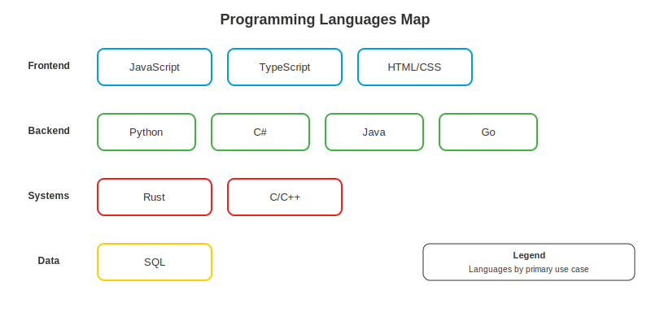

# Fase 3-9 -- As Classes do RPG: Linguagens de Programacao

---

## Change Log

| Versao | Data       | Autor                                  | Descricao          |
|--------|------------|----------------------------------------|--------------------|
| 1.0.0  | 2026-03-18 | Paula Silva - Software Global Black Belt, Microsoft Americas | Criacao inicial    |

---

## Sumario

- [Prologo: A Tela de Selecao de Classe](#prologo-a-tela-de-selecao-de-classe)
- [1. Por Que Existem Tantas Linguagens?](#1-por-que-existem-tantas-linguagens)
  - [1.1 A Necessidade de Diversidade](#11-a-necessidade-de-diversidade)
  - [1.2 Compiladas vs Interpretadas](#12-compiladas-vs-interpretadas)
  - [1.3 Tipagem: Forte vs Fraca, Estatica vs Dinamica](#13-tipagem-forte-vs-fraca-estatica-vs-dinamica)
- [2. Python -- O Mago (Versatil e Poderoso)](#2-python----o-mago-versatil-e-poderoso)
  - [2.1 Ficha do Personagem](#21-ficha-do-personagem)
  - [2.2 Quando Usar Python](#22-quando-usar-python)
  - [2.3 Exemplo de Codigo](#23-exemplo-de-codigo)
  - [2.4 Ecossistema e Ferramentas](#24-ecossistema-e-ferramentas)
- [3. JavaScript -- O Ladino (Rapido e Onipresente)](#3-javascript----o-ladino-rapido-e-onipresente)
  - [3.1 Ficha do Personagem](#31-ficha-do-personagem)
  - [3.2 Quando Usar JavaScript](#32-quando-usar-javascript)
  - [3.3 As Armadilhas do Ladino](#33-as-armadilhas-do-ladino)
  - [3.4 Exemplo de Codigo](#34-exemplo-de-codigo)
- [4. TypeScript -- O Ladino com Armadura](#4-typescript----o-ladino-com-armadura)
  - [4.1 Ficha do Personagem](#41-ficha-do-personagem)
  - [4.2 Por Que TypeScript Existe](#42-por-que-typescript-existe)
  - [4.3 Exemplo Comparativo: JS vs TS](#43-exemplo-comparativo-js-vs-ts)
  - [4.4 Quando Usar TypeScript](#44-quando-usar-typescript)
- [5. C# -- O Cavaleiro (Campeao da Microsoft)](#5-c----o-cavaleiro-campeao-da-microsoft)
  - [5.1 Ficha do Personagem](#51-ficha-do-personagem)
  - [5.2 O Ecossistema .NET](#52-o-ecossistema-net)
  - [5.3 Exemplo de Codigo](#53-exemplo-de-codigo)
  - [5.4 Quando Usar C#](#54-quando-usar-c)
- [6. Java -- O Tanque (Velho, Confiavel, Pesado)](#6-java----o-tanque-velho-confiavel-pesado)
  - [6.1 Ficha do Personagem](#61-ficha-do-personagem)
  - [6.2 Write Once, Run Anywhere](#62-write-once-run-anywhere)
  - [6.3 Quando Usar Java](#63-quando-usar-java)
- [7. Go -- O Speed Runner](#7-go----o-speed-runner)
  - [7.1 Ficha do Personagem](#71-ficha-do-personagem)
  - [7.2 A Filosofia do Go](#72-a-filosofia-do-go)
  - [7.3 Quando Usar Go](#73-quando-usar-go)
- [8. Rust -- A Fortaleza Indestrutivel](#8-rust----a-fortaleza-indestrutivel)
  - [8.1 Ficha do Personagem](#81-ficha-do-personagem)
  - [8.2 O Borrow Checker: O Guarda Impiedoso](#82-o-borrow-checker-o-guarda-impiedoso)
  - [8.3 Quando Usar Rust](#83-quando-usar-rust)
- [9. C e C++ -- Os Ancioes Lendarios](#9-c-e-c----os-ancioes-lendarios)
  - [9.1 Ficha do Personagem](#91-ficha-do-personagem)
  - [9.2 Quando Usar C/C++](#92-quando-usar-cc)
- [10. HTML e CSS -- Os Artesaos Visuais](#10-html-e-css----os-artesaos-visuais)
  - [10.1 Ficha do Personagem](#101-ficha-do-personagem)
  - [10.2 HTML: A Estrutura do Castelo](#102-html-a-estrutura-do-castelo)
  - [10.3 CSS: A Decoracao do Castelo](#103-css-a-decoracao-do-castelo)
- [11. SQL -- O Bibliotecario do Castelo](#11-sql----o-bibliotecario-do-castelo)
  - [11.1 Ficha do Personagem](#111-ficha-do-personagem)
  - [11.2 Comandos Essenciais](#112-comandos-essenciais)
  - [11.3 Quando Usar SQL](#113-quando-usar-sql)
- [12. Tabela Comparativa: Todas as Classes](#12-tabela-comparativa-todas-as-classes)
- [13. Como Escolher Sua Classe](#13-como-escolher-sua-classe)
  - [13.1 Guia de Decisao por Objetivo](#131-guia-de-decisao-por-objetivo)
  - [13.2 O Conselho dos Sabios](#132-o-conselho-dos-sabios)
- [14. Poliglotismo: O Guerreiro Multiclasse](#14-poliglotismo-o-guerreiro-multiclasse)
- [Referencias](#referencias)

---

## Prologo: A Tela de Selecao de Classe

Sofia chegou a uma sala enorme no Mushroom Kingdom. Nas paredes, dezenas de armas e armaduras brilhavam -- cada uma com poderes unicos. No centro, um holograma girava mostrando fichas de personagem.

Toadette apareceu com um livro grosso debaixo do braco.

*"Sofia, ate agora voce aprendeu as ferramentas do oficio -- terminal, Git, editores. Mas ainda nao escolheu sua CLASSE. Em todo RPG, voce precisa escolher: voce sera Maga? Ladina? Cavaleira? Tanque? Cada classe tem forcas, fraquezas e especializacoes diferentes."*

Sofia olhou confusa. *"Mas eu tenho que escolher so uma?"*

Toadette sorriu. *"No mundo real, os melhores aventureiros sao MULTICLASSE -- dominam uma classe principal e conhecem varias outras. Mas primeiro, voce precisa entender cada uma. Bem-vinda a Fase 3-9: a Tela de Selecao de Classe."*

---

## 1. Por Que Existem Tantas Linguagens?

<div align="center">

<br/><em>Mapa de linguagens</em>
</div>

### 1.1 A Necessidade de Diversidade

Existem centenas de linguagens de programacao porque **problemas diferentes exigem ferramentas diferentes**. Voce nao usa um martelo para apertar um parafuso, e nao usa uma chave de fenda para pregar um prego.

> **ANALOGIA MARIO:** Cada fase do Mario exige uma abordagem diferente. Fases aquaticas precisam de natacao. Fases aereas precisam de voo. Fases de gelo precisam de equilibrio. Uma unica habilidade nao resolve tudo. Da mesma forma, uma unica linguagem nao e ideal para tudo.

### 1.2 Compiladas vs Interpretadas

| Tipo | Como funciona | Velocidade | Deteccao de erros | Exemplos |
|------|--------------|------------|-------------------|----------|
| **Compilada** | Codigo inteiro traduzido ANTES de rodar | Rapida | Antes de executar | C, C++, Rust, Go |
| **Interpretada** | Codigo traduzido LINHA A LINHA enquanto roda | Mais lenta | Durante execucao | Python, Ruby, PHP |
| **JIT (Just-In-Time)** | Mistura: interpreta primeiro, compila as partes quentes | Media-rapida | Misto | JavaScript, Java, C# |

> **ANALOGIA MARIO:** Linguagens compiladas sao como **construir a fase inteira antes de jogar** -- demora para construir, mas a fase roda perfeitamente. Linguagens interpretadas sao como **construir a fase enquanto Mario corre** -- mais flexivel, mas pode ter surpresas no caminho. JIT e como ter um **construtor rapido correndo na frente** de Mario, construindo a fase poucos metros a frente.

### 1.3 Tipagem: Forte vs Fraca, Estatica vs Dinamica

| Tipo | Significado | Exemplo | Linguagens |
|------|------------|---------|------------|
| **Estatica** | Tipos definidos antes de rodar | `int x = 5;` -- x e SEMPRE inteiro | TypeScript, C#, Java, Go, Rust |
| **Dinamica** | Tipos definidos enquanto roda | `x = 5` depois `x = "texto"` -- x muda | Python, JavaScript, Ruby, PHP |
| **Forte** | Nao mistura tipos sem permissao | `"5" + 3` = ERRO | Python, Rust, Java |
| **Fraca** | Mistura tipos "magicamente" | `"5" + 3` = `"53"` (!) | JavaScript, PHP |

> **ANALOGIA MARIO:** Tipagem estatica e como **declarar no inicio da fase que arma voce vai usar** -- se disse "espada", nao pode usar arco no meio da fase. Tipagem dinamica e como poder **trocar de arma a qualquer momento**. Tipagem forte e como um **guarda que verifica se voce esta usando a arma certa**. Tipagem fraca e como um guarda que diz "ah, ta perto o suficiente" e deixa passar.


---

## 2. Python -- O Mago (Versatil e Poderoso)

### 2.1 Ficha do Personagem


> **ANALOGIA MARIO:** Python e o **Mago** -- versatil, poderoso, capaz de fazer quase tudo. Domina feiticos de IA, automacao, web, dados. Nao e o mais rapido em combate corpo a corpo (performance), mas seus feiticos alcancam tudo. Ideal para quem esta comecando porque os feiticos sao faceis de aprender.

### 2.2 Quando Usar Python

| Cenario | Forca | Exemplo |
|---------|-------|---------|
| **IA / Machine Learning** | Dominante | TensorFlow, PyTorch, Scikit-learn |
| **Ciencia de Dados** | Dominante | Pandas, NumPy, Matplotlib |
| **Automacao / Scripts** | Excelente | Automatizar tarefas repetitivas |
| **Backend Web** | Bom | Django, Flask, FastAPI |
| **DevOps** | Bom | Ansible, scripts de infra |
| **Games** | Educacional | Pygame (nao para producao AAA) |
| **Mobile** | Fraco | Nao e a melhor escolha |
| **Frontend** | Nao | Python nao roda no navegador |

### 2.3 Exemplo de Codigo

```python
# Python e famoso por ser legivel -- quase ingles
def saudacao(nome: str) -> str:
    """Retorna uma saudacao personalizada."""
    return f"Bem-vinda ao Mushroom Kingdom, {nome}!"

# Lista de power-ups
power_ups = ["Mushroom", "Fire Flower", "Star", "Cape"]

# Filtrar power-ups que comecam com "S"
especiais = [p for p in power_ups if p.startswith("S")]
print(especiais)  # ["Star"]

# Classes
class Personagem:
    def __init__(self, nome: str, poder: int):
        self.nome = nome
        self.poder = poder

    def atacar(self) -> str:
        return f"{self.nome} ataca com poder {self.poder}!"

mario = Personagem("Mario", 10)
print(mario.atacar())  # "Mario ataca com poder 10!"
```

### 2.4 Ecossistema e Ferramentas

| Ferramenta | Para que serve |
|------------|---------------|
| **pip** | Gerenciador de pacotes |
| **venv / conda** | Ambientes virtuais |
| **Django** | Framework web completo (full-stack) |
| **FastAPI** | API moderna e rapida |
| **Flask** | Micro-framework web |
| **pytest** | Framework de testes |
| **black** | Formatador de codigo |
| **mypy** | Verificador de tipos |
| **Jupyter** | Notebooks interativos (data science) |

---

## 3. JavaScript -- O Ladino (Rapido e Onipresente)

### 3.1 Ficha do Personagem


> **ANALOGIA MARIO:** JavaScript e o **Ladino** -- rapido, esta em TODOS os lugares (navegador, servidor, mobile, desktop), e incrivelmente versatil. Mas tem armadilhas escondidas (coercao de tipos, `this` confuso, `undefined` vs `null`). Um Ladino experiente e devastador; um Ladino novato cai nas proprias armadilhas.

### 3.2 Quando Usar JavaScript

| Cenario | Forca | Exemplo |
|---------|-------|---------|
| **Frontend Web** | Dominante absoluto | React, Vue, Angular |
| **Backend** | Excelente | Node.js, Express, Fastify |
| **Full-stack** | Excelente | Next.js, Nuxt.js |
| **Mobile** | Bom | React Native, Ionic |
| **Desktop** | Bom | Electron (VS Code e Electron!) |
| **Serverless** | Excelente | AWS Lambda, Azure Functions |
| **IA/ML** | Crescente | TensorFlow.js |
| **IoT** | Possivel | Johnny-Five |

**Fato marcante:** JavaScript e a **unica linguagem** que roda nativamente em todos os navegadores do mundo. E por isso e inescapavel para desenvolvimento web.

### 3.3 As Armadilhas do Ladino

JavaScript tem comportamentos infames que surpreendem iniciantes:

```javascript
// Coercao de tipos: JavaScript "adivinha" o que voce quis
"5" + 3        // "53" (concatenou strings!)
"5" - 3        // 2   (fez matematica!)
"5" * "3"      // 15  (fez matematica!)
true + true    // 2   (true = 1, entao 1 + 1 = 2)
[] + []        // ""  (dois arrays vazios = string vazia?!)
[] + {}        // "[object Object]"
{} + []        // 0   (?????)

// Comparacao solta vs estrita
0 == ""        // true  (PERIGO! Use ===)
0 === ""       // false (correto!)
null == undefined  // true
null === undefined // false

// typeof bizarro
typeof null     // "object" (bug historico, nunca corrigido)
typeof NaN      // "number" (Not-a-Number e... um numero?)
typeof []       // "object" (array e objeto?)
```

> **ANALOGIA MARIO:** Essas armadilhas sao como **blocos invisiveis** no caminho do Mario. Voce esta correndo normalmente e de repente bate num bloco que nao via. Ladinos experientes conhecem todos os blocos invisiveis e desviam; novatos batem de cara.

### 3.4 Exemplo de Codigo

```javascript
// JavaScript moderno (ES6+)
const saudacao = (nome) => `Bem-vinda ao Mushroom Kingdom, ${nome}!`;

// Desestruturacao
const personagem = { nome: "Mario", poder: 10, vidas: 3 };
const { nome, poder } = personagem;

// Async/Await (operacoes assincronas)
async function buscarTarefas() {
  try {
    const response = await fetch("/api/tarefas");
    const tarefas = await response.json();
    return tarefas;
  } catch (erro) {
    console.error("Erro ao buscar tarefas:", erro);
    throw erro;
  }
}

// Array methods (muito usados!)
const powerUps = ["Mushroom", "Fire Flower", "Star", "Cape"];
const grandes = powerUps.filter(p => p.length > 5);
const nomes = powerUps.map(p => p.toUpperCase());
const total = powerUps.reduce((acc, p) => acc + p.length, 0);
```

---

## 4. TypeScript -- O Ladino com Armadura

### 4.1 Ficha do Personagem


> **ANALOGIA MARIO:** TypeScript e o **Ladino com armadura** -- tem toda a agilidade e versatilidade do JavaScript (Ladino), mas com uma armadura de tipos que protege contra as armadilhas. Anda um pouco mais devagar (precisa compilar), mas chega vivo ao final da fase com muito mais frequencia. E como Mario pegando uma armadura: fica mais pesado, mas protegido.

### 4.2 Por Que TypeScript Existe

TypeScript foi criado pela Microsoft para resolver os problemas do JavaScript em projetos grandes:

| Problema do JavaScript | Solucao do TypeScript |
|----------------------|---------------------|
| Erros de tipo so aparecem em producao | Erros de tipo aparecem no editor |
| Sem autocomplete confiavel | Autocomplete perfeito |
| Dificil refatorar projetos grandes | Refatoracao segura |
| Documentacao desatualizada | Tipos sao documentacao viva |
| Bugs sutis de coercao | Compilador barra antes de rodar |

### 4.3 Exemplo Comparativo: JS vs TS

```javascript
// JavaScript -- sem protecao
function calcularDano(atacante, defensor) {
  return atacante.poder - defensor.defesa;
  // E se atacante.poder nao existir? undefined - numero = NaN
  // E se defensor for null? TypeError em producao!
}
```

```typescript
// TypeScript -- com armadura de tipos
interface Personagem {
  nome: string;
  poder: number;
  defesa: number;
  vidas: number;
}

function calcularDano(atacante: Personagem, defensor: Personagem): number {
  return atacante.poder - defensor.defesa;
  // Se passar algo sem "poder" ou "defesa", o compilador BARRA
  // Antes de rodar. Antes de ir para producao. Antes de causar bug.
}

// O editor mostra erro IMEDIATAMENTE se voce tentar:
calcularDano("Mario", 42); // ERRO: string nao e Personagem!
```

### 4.4 Quando Usar TypeScript

**Resposta curta: sempre que usaria JavaScript em projeto serio.**

| Cenario | Recomendacao |
|---------|-------------|
| Projeto pessoal simples | JavaScript esta ok |
| Projeto de time | TypeScript fortemente recomendado |
| Projeto de empresa | TypeScript obrigatorio |
| Biblioteca open source | TypeScript recomendado |
| Prototipo rapido (hackathon) | JavaScript pode ser mais rapido |
| Qualquer coisa com mais de 1000 linhas | TypeScript |

---

## 5. C# -- O Cavaleiro (Campeao da Microsoft)

### 5.1 Ficha do Personagem


> **ANALOGIA MARIO:** C# e o **Cavaleiro** -- o campeao da Microsoft. Armadura completa (tipagem forte), espada poderosa (performance), treinamento formal (orientacao a objetos). Excelente para construir castelos (aplicacoes enterprise), servir ao reino (Azure/cloud), e proteger territorios (seguranca). Nao e tao rapido quanto o Ladino, mas e mais resistente.

### 5.2 O Ecossistema .NET

C# vive dentro do ecossistema **.NET**, que inclui:

| Componente | Para que serve | Em Mario |
|-----------|---------------|----------|
| **.NET Runtime** | Motor que executa C# | O console que roda o jogo |
| **ASP.NET Core** | Framework web | Kit de construcao de castelos |
| **Entity Framework** | ORM para banco de dados | Tradutor Toad <-> Banco |
| **MAUI** | Apps multiplataforma | Jogar em qualquer console |
| **Blazor** | Frontend com C# (em vez de JS!) | Cavaleiro fazendo trabalho de Ladino |
| **Azure SDK** | Integracao com Azure | Acesso ao reino da nuvem |
| **Unity** | Engine de jogos | Construir o proprio Mario! |

### 5.3 Exemplo de Codigo

```csharp
// C# -- Orientado a objetos, tipado, elegante
public class Personagem
{
    public string Nome { get; set; }
    public int Poder { get; set; }
    public int Vidas { get; set; }

    public Personagem(string nome, int poder, int vidas)
    {
        Nome = nome;
        Poder = poder;
        Vidas = vidas;
    }

    public string Atacar() => $"{Nome} ataca com poder {Poder}!";
}

// Uso
var mario = new Personagem("Mario", 10, 3);
Console.WriteLine(mario.Atacar()); // "Mario ataca com poder 10!"

// LINQ (consultas elegantes em colecoes)
var powerUps = new List<string> { "Mushroom", "Fire Flower", "Star", "Cape" };
var grandes = powerUps.Where(p => p.Length > 5).ToList();

// Async/Await (C# teve ANTES do JavaScript!)
public async Task<List<Tarefa>> BuscarTarefasAsync()
{
    var response = await _httpClient.GetAsync("/api/tarefas");
    return await response.Content.ReadFromJsonAsync<List<Tarefa>>();
}
```

### 5.4 Quando Usar C#

| Cenario | Forca | Detalhes |
|---------|-------|---------|
| **Enterprise backend** | Dominante | APIs, microservicos, sistemas corporativos |
| **Azure Cloud** | Dominante | Integracoes nativas, SDKs de primeira classe |
| **Jogos (Unity)** | Dominante | A maioria dos jogos indie usa Unity + C# |
| **Desktop Windows** | Excelente | WPF, WinForms, MAUI |
| **Mobile cross-platform** | Bom | MAUI, Xamarin |
| **Web frontend** | Crescente | Blazor (WebAssembly) |
| **IA/ML** | Bom | ML.NET, Semantic Kernel |

---

## 6. Java -- O Tanque (Velho, Confiavel, Pesado)

### 6.1 Ficha do Personagem


> **ANALOGIA MARIO:** Java e o **Tanque** -- lento para arrancar (verbose, muita configuracao), mas quando comeca a andar, e IMPARAVEL. Roda em qualquer terreno (JVM = qualquer sistema operacional). Usado em grandes batalhas (sistemas bancarios, telecomunicacoes, governo). Nao e elegante, mas e indestrutivel em combate prolongado.

### 6.2 Write Once, Run Anywhere

O lema do Java e "escreva uma vez, rode em qualquer lugar" gracas a JVM (Java Virtual Machine):

```
Codigo Java (.java)
     |
     v
Compilador javac
     |
     v
Bytecode (.class)  <-- Codigo intermediario
     |
     v
JVM (Java Virtual Machine)  <-- Existe para Windows, Mac, Linux
     |
     v
Resultado
```

### 6.3 Quando Usar Java

| Cenario | Forca |
|---------|-------|
| **Android** | Historicamente dominante (agora Kotlin divide) |
| **Enterprise backend** | Bancos, telecomunicacoes, governo |
| **Big Data** | Hadoop, Spark, Kafka -- tudo e Java |
| **Microservicos** | Spring Boot e extremamente popular |
| **Sistemas legados** | Milhoes de sistemas em Java no mundo |

---

## 7. Go -- O Speed Runner

### 7.1 Ficha do Personagem


> **ANALOGIA MARIO:** Go e o **Speed Runner** -- feito para velocidade e eficiencia. Compila em segundos, binario unico sem dependencias, leve e rapido. Ideal para fases onde cada milissegundo conta (microservicos, CLIs, infraestrutura). Nao tem feiticos elaborados (sem generics ate recentemente, sem heranca), mas o que faz, faz RAPIDO.

### 7.2 A Filosofia do Go

Go foi criado pelo Google para resolver problemas de scale:

- **Simplicidade radical**: poucas keywords, poucas formas de fazer as coisas
- **Compilacao rapida**: segundos, nao minutos
- **Concorrencia nativa**: goroutines e channels
- **Binario unico**: sem dependencias externas para deploy
- **Opinativo**: `gofmt` formata codigo automaticamente -- sem debates de estilo

```go
package main

import "fmt"

// Funcao simples
func saudacao(nome string) string {
    return fmt.Sprintf("Bem-vinda ao Mushroom Kingdom, %s!", nome)
}

// Goroutine (concorrencia leve)
func main() {
    go func() {
        fmt.Println("Executando em paralelo!")
    }()

    fmt.Println(saudacao("Sofia"))
}
```

### 7.3 Quando Usar Go

| Cenario | Forca |
|---------|-------|
| **CLIs e ferramentas** | Docker, Kubernetes, Terraform -- todos escritos em Go |
| **Microservicos** | Binario leve, deploy simples |
| **APIs de alta performance** | Milhares de requests por segundo |
| **DevOps/Infraestrutura** | A linguagem dominante de cloud-native |
| **Proxy/Load Balancer** | Concorrencia nativa |

---

## 8. Rust -- A Fortaleza Indestrutivel

### 8.1 Ficha do Personagem


> **ANALOGIA MARIO:** Rust e a **Fortaleza Indestrutivel**. Performance maxima (nível C/C++) COM seguranca de memoria garantida pelo compilador. E como construir um castelo que e simultaneamente rapido de percorrer E impossivel de invadir. O custo? Aprender a construir e MUITO mais dificil. O Borrow Checker (guarda impiedoso) rejeita seu codigo se nao for perfeito. Mas uma vez construido, o castelo e inexpugnavel.

### 8.2 O Borrow Checker: O Guarda Impiedoso

O "borrow checker" e o sistema que torna Rust tao seguro:

```rust
fn main() {
    let s1 = String::from("Mario");  // s1 e dono da string
    let s2 = s1;                     // propriedade TRANSFERIDA para s2

    // println!("{}", s1);  // ERRO! s1 nao e mais dono!
    println!("{}", s2);     // OK! s2 e o dono agora

    // Emprestimo (borrow)
    let s3 = String::from("Luigi");
    let len = calcular_tamanho(&s3);  // Empresta s3, nao transfere
    println!("{} tem {} letras", s3, len); // s3 ainda e valido!
}

fn calcular_tamanho(s: &String) -> usize {
    s.len()
}
```

> **ANALOGIA MARIO:** Em Rust, cada item (valor) tem exatamente UM dono. Se Mario passa o Mushroom para Luigi, Mario nao tem mais o Mushroom. Se Mario EMPRESTA o Mushroom (referencia), Luigi pode OLHAR mas nao pode MODIFICAR (a menos que seja emprestimo mutavel). Essas regras sao rigidas, mas garantem que nenhum item desapareca misteriosamente ou seja duplicado.

### 8.3 Quando Usar Rust

| Cenario | Forca |
|---------|-------|
| **Sistemas operacionais** | Linux kernel aceita Rust! |
| **Navegadores** | Firefox usa Rust |
| **WebAssembly** | Compilacao para web com performance nativa |
| **Embedded/IoT** | Sem garbage collector, controle total |
| **Ferramentas de CLI** | ripgrep, exa, bat -- ferramentas rapidas |
| **Blockchain** | Solana e escrito em Rust |

---

## 9. C e C++ -- Os Ancioes Lendarios

### 9.1 Ficha do Personagem


> **ANALOGIA MARIO:** C e C++ sao os **Ancioes Lendarios** -- os fundadores do reino. Todos os outros personagens foram construidos sobre seu legado. Linux, Windows, macOS, Python, JavaScript, Java -- todos escritos em C ou C++ por baixo dos panos. Poder absoluto, mas com grande poder vem grande responsabilidade (e bugs de memoria). Sao como o mapa original do primeiro Mario -- todo jogo moderno foi construido sobre aquela base.

### 9.2 Quando Usar C/C++

| Cenario | Linguagem |
|---------|-----------|
| **Sistemas operacionais** | C (Linux, Windows) |
| **Drivers e firmware** | C |
| **Jogos AAA** | C++ (Unreal Engine) |
| **Compiladores** | C/C++ |
| **Banco de dados** | C/C++ (PostgreSQL e escrito em C!) |
| **Embarcados** | C |
| **Performance critica** | C++ |

---

## 10. HTML e CSS -- Os Artesaos Visuais

### 10.1 Ficha do Personagem


> **ANALOGIA MARIO:** HTML e CSS sao os **Artesaos Visuais** do reino. HTML e o arquiteto que define a ESTRUTURA do castelo (paredes, portas, janelas). CSS e o decorador que define a APARENCIA (cores, tamanhos, posicoes). Sem eles, nao existe interface visual. Eles nao lutam (nao sao linguagens de programacao), mas sem eles, nao haveria castelos para proteger.

### 10.2 HTML: A Estrutura do Castelo

```html
<!DOCTYPE html>
<html lang="pt-BR">
<head>
    <meta charset="UTF-8">
    <title>TodoApp - Mushroom Kingdom</title>
</head>
<body>
    <header>
        <h1>Minhas Tarefas</h1>
        <nav>
            <a href="#pendentes">Pendentes</a>
            <a href="#feitas">Feitas</a>
        </nav>
    </header>

    <main>
        <section id="pendentes">
            <h2>Tarefas Pendentes</h2>
            <ul>
                <li>Salvar a Princesa Peach</li>
                <li>Coletar 100 moedas</li>
                <li>Derrotar Bowser</li>
            </ul>
        </section>
    </main>

    <footer>
        <p>Mushroom Kingdom - 2026</p>
    </footer>
</body>
</html>
```

### 10.3 CSS: A Decoracao do Castelo

```css
/* CSS define COMO as coisas parecem */
body {
    font-family: 'Press Start 2P', cursive; /* Fonte estilo pixel art */
    background-color: #5c94fc;              /* Azul ceu do Mario */
    color: #fff;
}

header {
    background-color: #e52521;  /* Vermelho Mario */
    padding: 20px;
    text-align: center;
}

.tarefa-pendente {
    background-color: #fbd000;  /* Amarelo moeda */
    border-radius: 8px;
    padding: 16px;
    margin: 8px 0;
}

.tarefa-feita {
    background-color: #43b047;  /* Verde 1-UP */
    text-decoration: line-through;
}

/* Responsivo: funciona em celular tambem! */
@media (max-width: 768px) {
    header { padding: 10px; }
    .tarefa-pendente { margin: 4px 0; }
}
```

---

## 11. SQL -- O Bibliotecario do Castelo

### 11.1 Ficha do Personagem


> **ANALOGIA MARIO:** SQL e o **Bibliotecario do Castelo** -- nao luta, nao constroi, mas SABE ONDE TUDO ESTA. Quer encontrar todas as moedas coletadas no World 3? SQL encontra. Quer saber quantas vidas Mario perdeu na fase 2-4? SQL responde. Todo castelo (aplicacao) que guarda tesouros (dados) precisa de um Bibliotecario.

### 11.2 Comandos Essenciais

```sql
-- Criar tabela (estante na biblioteca)
CREATE TABLE tarefas (
    id SERIAL PRIMARY KEY,
    titulo VARCHAR(200) NOT NULL,
    feita BOOLEAN DEFAULT false,
    criada_em TIMESTAMP DEFAULT NOW()
);

-- Inserir dados (adicionar livro a estante)
INSERT INTO tarefas (titulo) VALUES ('Salvar a Princesa');
INSERT INTO tarefas (titulo) VALUES ('Coletar 100 moedas');

-- Buscar dados (procurar livro)
SELECT * FROM tarefas;                          -- Tudo
SELECT * FROM tarefas WHERE feita = false;      -- So pendentes
SELECT COUNT(*) FROM tarefas;                   -- Quantas existem

-- Atualizar dados (corrigir informacao no livro)
UPDATE tarefas SET feita = true WHERE id = 1;

-- Deletar dados (remover livro)
DELETE FROM tarefas WHERE id = 2;

-- Consultas avancadas
SELECT titulo, criada_em
FROM tarefas
WHERE feita = false
ORDER BY criada_em DESC
LIMIT 10;
```

### 11.3 Quando Usar SQL

| Banco de Dados | Tipo | Linguagem SQL | Quando Usar |
|---------------|------|---------------|-------------|
| **PostgreSQL** | Relacional | SQL padrao + extensoes | A maioria dos projetos |
| **MySQL** | Relacional | SQL padrao | Web, WordPress, projetos simples |
| **SQLite** | Relacional (arquivo) | SQL padrao | Apps mobile, prototipagem |
| **SQL Server** | Relacional | T-SQL | Ecossistema Microsoft |
| **MongoDB** | NoSQL (documento) | Nao usa SQL (usa queries proprias) | Dados flexiveis, JSON nativo |

---

## 12. Tabela Comparativa: Todas as Classes

| Linguagem | Classe RPG | Melhor Para | Dificuldade | Salario (tendencia) |
|-----------|-----------|-------------|-------------|-------------------|
| **Python** | Mago | IA, dados, automacao | Facil | Alto (IA e tendencia) |
| **JavaScript** | Ladino | Web full-stack | Media | Alto (demanda massiva) |
| **TypeScript** | Ladino Blindado | Web profissional | Media | Alto |
| **C#** | Cavaleiro | Enterprise, Azure, Unity | Media | Alto |
| **Java** | Tanque | Enterprise, Android | Media-Alta | Alto |
| **Go** | Speed Runner | DevOps, microservicos | Media | Muito Alto |
| **Rust** | Fortaleza | Sistemas, performance | Muito Alta | Muito Alto |
| **C/C++** | Anciao | Sistemas, games AAA | Muito Alta | Alto |
| **HTML/CSS** | Artesao | Interface visual | Facil | Medio (sozinho) |
| **SQL** | Bibliotecario | Banco de dados | Facil-Media | Alto |

---

## 13. Como Escolher Sua Classe

### 13.1 Guia de Decisao por Objetivo

| Seu Objetivo | Primeira Linguagem | Segunda Linguagem | Por que |
|-------------|-------------------|-------------------|---------|
| **Web full-stack** | JavaScript/TypeScript | Python ou C# | JS domina o frontend, e bom no backend |
| **IA e Data Science** | Python | SQL | Python e dominante em IA, SQL para dados |
| **Jogos** | C# (Unity) | C++ (Unreal) | Engines dominantes usam essas |
| **Mobile** | JavaScript (React Native) | Swift/Kotlin (nativo) | Cross-platform vs nativo |
| **DevOps/Cloud** | Python | Go | Scripts + ferramentas cloud-native |
| **Enterprise/Microsoft** | C# | TypeScript | Ecossistema .NET + frontend |
| **Sistemas/Performance** | Rust | C | Seguranca de memoria + legado |
| **Apenas comecar** | Python | JavaScript | Mais faceis, mais recursos de aprendizado |

### 13.2 O Conselho dos Sabios

Toadette reuniu os sabios da guilda para dar conselhos a Sofia:

- **"Nao existe linguagem perfeita."** Cada uma faz trade-offs. Aceite isso.
- **"Aprenda conceitos, nao sintaxe."** Quem entende logica de programacao muda de linguagem facilmente.
- **"Comece com uma, expanda para duas."** Nao tente aprender 5 ao mesmo tempo.
- **"Siga o mercado, mas tambem a paixao."** Se IA te empolga, va de Python. Se web te fascina, va de JavaScript.
- **"A melhor linguagem e a que resolve SEU problema."** Nao se deixe levar por guerras de linguagem.

---

## 14. Poliglotismo: O Guerreiro Multiclasse

Os melhores desenvolvedores sao **poliglotas** -- falam varias "linguas". Nao dominam todas igualmente, mas conhecem o suficiente para escolher a certa para cada situacao.

**Modelo T de habilidades:**

```
Largura (conhecimento amplo)
|
|  Python   JS/TS   C#   SQL   Go   HTML/CSS   Rust
|  -------- ------- ---- ----- ---- ---------- -----
|     |        |      |    |     |      |         |
|     |        |      |    |     |      |         |
|     |        |      |    |     |      |         |
|     v        |      |    |     |      |         |
|  (profundo)  |      |    |     |      |         |
|              v      |    |     |      |         |
|           (profundo)|    |     |      |         |
|                     v    |     |      |         |
|                          |     |      |         |
Profundidade (especializacao)
```

> **ANALOGIA MARIO:** O jogador expert nao domina so uma classe -- ele sabe quando usar o Mago (Python) para resolver puzzles de dados, quando trocar para o Ladino (JS) para fases de agilidade web, e quando invocar o Cavaleiro (C#) para a batalha enterprise. O segredo e ter UMA OU DUAS classes favoritas e CONHECER as outras o suficiente para saber quando chama-las.

---

## Referencias

- [Python -- Site Oficial](https://www.python.org/)
- [JavaScript -- MDN Web Docs](https://developer.mozilla.org/pt-BR/docs/Web/JavaScript)
- [TypeScript -- Site Oficial](https://www.typescriptlang.org/)
- [C# -- Documentacao Microsoft](https://learn.microsoft.com/pt-br/dotnet/csharp/)
- [Java -- Oracle](https://www.oracle.com/java/)
- [Go -- Site Oficial](https://go.dev/)
- [Rust -- Site Oficial](https://www.rust-lang.org/)
- [MDN Web Docs -- HTML](https://developer.mozilla.org/pt-BR/docs/Web/HTML)
- [MDN Web Docs -- CSS](https://developer.mozilla.org/pt-BR/docs/Web/CSS)
- [PostgreSQL -- Tutorial SQL](https://www.postgresql.org/docs/current/tutorial.html)
- [Stack Overflow Developer Survey 2025](https://survey.stackoverflow.co/2025/)
- [TIOBE Index -- Ranking de Linguagens](https://www.tiobe.com/tiobe-index/)
- [GitHub Octoverse -- Linguagens Mais Usadas](https://octoverse.github.com/)

---

*Fim da Fase 3-9. Sofia agora conhece as classes disponiveis. Na proxima fase, ela aprende sobre as armas e armaduras que cada classe pode usar: Frameworks e Bibliotecas.*

---

<div align="center">

⬅️ [Anterior: Fase 3-8: Internet](3-8-internet.md) · 🗺️ [Mapa dos Mundos](../INDEX.md) · ➡️ [Proximo: Fase 3-10: Frameworks](3-10-frameworks.md)

</div>
