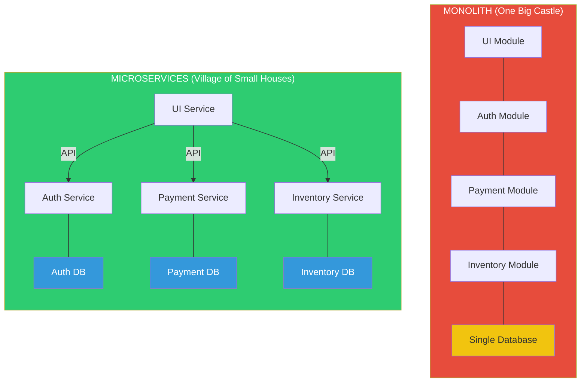

# Fase 4-3 -- O Mapa da Fortaleza: Arquitetura de Software

---

## Change Log

| Versao | Data       | Autor                                  | Descricao          |
|--------|------------|----------------------------------------|--------------------|
| 1.0.0  | 2026-03-18 | Paula Silva - Microsoft Latam Software GBB | Criacao inicial    |

---

## Sumario

- [Prologo: A Planta do Castelo](#prologo-a-planta-do-castelo)
- [1. O Que E Arquitetura de Software?](#1-o-que-e-arquitetura-de-software)
  - [1.1 Por Que Arquitetura Importa](#11-por-que-arquitetura-importa)
  - [1.2 Decisoes Arquiteturais](#12-decisoes-arquiteturais)
- [2. Monolito: O Castelo Unico](#2-monolito-o-castelo-unico)
  - [2.1 O Que E um Monolito](#21-o-que-e-um-monolito)
  - [2.2 Estrutura de um Monolito](#22-estrutura-de-um-monolito)
  - [2.3 Vantagens e Desvantagens](#23-vantagens-e-desvantagens)
  - [2.4 Quando o Monolito E a Escolha Certa](#24-quando-o-monolito-e-a-escolha-certa)
- [3. Microservicos: A Vila de Casas Especializadas](#3-microservicos-a-vila-de-casas-especializadas)
  - [3.1 O Que Sao Microservicos](#31-o-que-sao-microservicos)
  - [3.2 Anatomia de uma Arquitetura de Microservicos](#32-anatomia-de-uma-arquitetura-de-microservicos)
  - [3.3 Comunicacao Entre Servicos](#33-comunicacao-entre-servicos)
  - [3.4 Vantagens e Desvantagens](#34-vantagens-e-desvantagens)
  - [3.5 Quando Usar Microservicos](#35-quando-usar-microservicos)
- [4. Serverless Architecture](#4-serverless-architecture)
  - [4.1 Funcoes como Blocos de Construcao](#41-funcoes-como-blocos-de-construcao)
  - [4.2 Padroes Serverless Comuns](#42-padroes-serverless-comuns)
  - [4.3 Quando Usar Serverless](#43-quando-usar-serverless)
- [5. Event-Driven Architecture: Sinos Mensageiros](#5-event-driven-architecture-sinos-mensageiros)
  - [5.1 O Que E Arquitetura Orientada a Eventos](#51-o-que-e-arquitetura-orientada-a-eventos)
  - [5.2 Componentes Principais](#52-componentes-principais)
  - [5.3 Exemplo Pratico: TodoApp Event-Driven](#53-exemplo-pratico-todoapp-event-driven)
  - [5.4 Event Sourcing e CQRS](#54-event-sourcing-e-cqrs)
- [6. MVC: As Tres Salas do Castelo](#6-mvc-as-tres-salas-do-castelo)
  - [6.1 O Que E MVC](#61-o-que-e-mvc)
  - [6.2 Como MVC Funciona](#62-como-mvc-funciona)
  - [6.3 MVC no Express.js](#63-mvc-no-expressjs)
- [7. Clean Architecture: O Castelo com Muralhas Concentricas](#7-clean-architecture-o-castelo-com-muralhas-concentricas)
  - [7.1 O Principio da Dependencia](#71-o-principio-da-dependencia)
  - [7.2 As 4 Camadas](#72-as-4-camadas)
  - [7.3 Exemplo Pratico](#73-exemplo-pratico)
- [8. Padroes Arquiteturais Complementares](#8-padroes-arquiteturais-complementares)
  - [8.1 API Gateway](#81-api-gateway)
  - [8.2 BFF: Backend for Frontend](#82-bff-backend-for-frontend)
  - [8.3 Strangler Fig: Migrando do Monolito](#83-strangler-fig-migrando-do-monolito)
- [9. Comparacao: Qual Arquitetura Escolher?](#9-comparacao-qual-arquitetura-escolher)
  - [9.1 Tabela Comparativa](#91-tabela-comparativa)
  - [9.2 Arvore de Decisao](#92-arvore-de-decisao)
- [10. Tabela Final de Resumo](#10-tabela-final-de-resumo)
- [Referencias](#referencias)

---

## Prologo: A Planta do Castelo

Sofia estava planejando expandir o TodoApp. Ia adicionar notificacoes, sistema de equipes, relatorios e integracao com calendario. Mas a cada nova funcionalidade, o codigo ficava mais confuso, mais lento e mais dificil de manter.

Toadette — a Code Reviewer — parou Sofia no meio de um commit.

*"Sofia, voce esta construindo um castelo sem planta. Cada quarto que voce adiciona esta ligado a todos os outros. Se voce mudar o banheiro, a cozinha para de funcionar."*

Sofia suspirou. *"Mas funciona..."*

*"Por enquanto,"* disse Toadette. *"Imagine que no Super Mario, todas as fases fossem um unico mapa gigante, sem divisoes. Se a Nintendo precisasse corrigir um bug na fase 1-1, TODAS as outras fases seriam afetadas. Por isso existem mundos, fases e castelos separados."*

*"Isso e **arquitetura de software** — decidir como organizar as partes do seu sistema ANTES de construir. E como ter a planta do castelo antes de colocar o primeiro tijolo."*

---

## 1. O Que E Arquitetura de Software?

### 1.1 Por Que Arquitetura Importa

**Arquitetura de software** e a estrutura fundamental de um sistema — como seus componentes sao organizados, como se comunicam e quais restricoes governam seu design.

> **Analogia Mario**: Arquitetura e a **planta do Mushroom Kingdom**. Define quantos castelos existem, como estao conectados, qual e a funcao de cada um e como as estradas (comunicacao) ligam tudo. Sem uma boa planta, o reino vira um labirinto caótico.

**Uma boa arquitetura permite:**

- Adicionar novas funcionalidades sem quebrar as existentes
- Escalar partes do sistema independentemente
- Diferentes equipes trabalharem em paralelo
- Trocar tecnologias sem reescrever tudo
- Entender o sistema rapidamente

**Uma ma arquitetura causa:**

- Mudancas simples levam dias (tudo esta acoplado)
- Bugs em cascata (mexer em A quebra B, C e D)
- Impossivel escalar (tudo ou nada)
- Novos desenvolvedores demoram meses para entender
- Reescrever e mais facil que consertar

### 1.2 Decisoes Arquiteturais

As decisoes mais importantes de arquitetura sao as mais dificeis de reverter:

| Decisao | Pergunta | Analogia Mario |
|---------|----------|----------------|
| **Estilo** | Monolito ou microservicos? | Um castelo gigante ou vila de casas? |
| **Comunicacao** | Sincrono ou assincrono? | Grito direto ou sino mensageiro? |
| **Dados** | Um banco ou varios? | Um cofre central ou cofres por sala? |
| **Deploy** | Junto ou separado? | Todas as fases em um cartridge ou fases individuais? |
| **Escala** | Vertical ou horizontal? | Castelo maior ou mais castelos? |

---

## 2. Monolito: O Castelo Unico

### 2.1 O Que E um Monolito

Um **monolito** e uma aplicacao onde todo o codigo esta em um unico projeto, compilado e deployado como uma unica unidade.

> **Analogia Mario**: O monolito e um **castelo unico gigante** onde tudo acontece — a cozinha, os quartos, a sala do trono, o cofre, a masmorra — tudo dentro da mesma estrutura. Se voce quiser reformar a cozinha, precisa fechar o castelo inteiro.

```
┌──────────────────────────────────────────────┐
│              CASTELO MONOLITO                 │
│                                               │
│  ┌─────────┐  ┌──────────┐  ┌────────────┐  │
│  │ Frontend │  │ Backend  │  │  Database   │  │
│  │  (View)  │  │ (Logic)  │  │  (Storage)  │  │
│  └────┬─────┘  └────┬─────┘  └─────┬──────┘  │
│       │              │              │          │
│       └──────────────┼──────────────┘          │
│                      │                         │
│              UM UNICO DEPLOY                   │
└──────────────────────────────────────────────┘
```

### 2.2 Estrutura de um Monolito

```
todoapp/                          # Um unico projeto
├── src/
│   ├── controllers/              # Logica de requisicao
│   │   ├── todoController.js
│   │   ├── userController.js
│   │   └── teamController.js
│   ├── models/                   # Modelos de dados
│   │   ├── Todo.js
│   │   ├── User.js
│   │   └── Team.js
│   ├── services/                 # Logica de negocio
│   │   ├── todoService.js
│   │   ├── userService.js
│   │   ├── emailService.js
│   │   └── reportService.js
│   ├── routes/                   # Rotas da API
│   │   ├── todoRoutes.js
│   │   ├── userRoutes.js
│   │   └── teamRoutes.js
│   ├── middleware/                # Auth, logging, etc.
│   └── app.js                    # Ponto de entrada
├── public/                       # Frontend
├── prisma/                       # Schema do banco
├── package.json                  # UM package.json
└── Dockerfile                    # UM Dockerfile
```

### 2.3 Vantagens e Desvantagens

**Vantagens:**

| Vantagem | Por Que | Mario |
|----------|---------|-------|
| **Simples de desenvolver** | Um projeto, um repo, um deploy | Um castelo, uma planta |
| **Simples de testar** | Tudo junto, facil de testar end-to-end | Testar todas as salas de uma vez |
| **Simples de debugar** | Um unico processo, stack trace completo | Bug esta em ALGUM lugar deste castelo |
| **Performance interna** | Chamadas em memoria (sem rede) | Andar entre salas (sem sair do castelo) |
| **Transacoes simples** | Um banco, transacoes ACID nativas | Um cofre, uma chave |

**Desvantagens:**

| Desvantagem | Por Que | Mario |
|-------------|---------|-------|
| **Escala tudo ou nada** | Nao da para escalar so a parte mais usada | Para aumentar a cozinha, precisa ampliar o castelo inteiro |
| **Deploy arriscado** | Qualquer mudanca redeploya TUDO | Reforma na cozinha fecha o castelo inteiro |
| **Acoplamento** | Modulos tendem a se misturar com o tempo | Encanamento da cozinha passa pelo quarto |
| **Tech stack unica** | Tudo na mesma linguagem/framework | Todos os quartos com a mesma decoracao |
| **Equipe bloqueada** | Todos mexem no mesmo codigo | Todos os pedreiros na mesma sala |

### 2.4 Quando o Monolito E a Escolha Certa

**Use monolito quando:**

- Esta comecando um projeto novo (MVP, startup)
- Equipe pequena (1-5 devs)
- Dominio simples e bem entendido
- Precisa entregar rapido
- Nao sabe ainda como o sistema vai crescer

> **Regra de Ouro do Martin Fowler**: *"Almost all the successful microservice stories have started with a monolith that got too big and was broken up."* — Comece monolito, migre quando necessario.

---

## 3. Microservicos: A Vila de Casas Especializadas

### 3.1 O Que Sao Microservicos

**Microservicos** e um estilo arquitetural onde a aplicacao e composta por **servicos pequenos, independentes e especializados**, cada um com seu proprio banco de dados e deploy.

> **Analogia Mario**: Em vez de um castelo gigante, temos uma **vila** com varias casas especializadas. A padaria (servico de autenticacao), a ferraria (servico de tarefas), o correio (servico de notificacoes), o banco (servico de pagamentos). Cada casa funciona independentemente. Se a padaria fechar para reforma, a ferraria continua operando.

```
┌─────────────┐    ┌─────────────┐    ┌─────────────┐
│  Auth House  │    │  Todo House  │    │  Email House │
│  ┌────────┐  │    │  ┌────────┐  │    │  ┌────────┐  │
│  │  API   │  │    │  │  API   │  │    │  │  API   │  │
│  │ Logic  │  │    │  │ Logic  │  │    │  │ Logic  │  │
│  │   DB   │  │    │  │   DB   │  │    │  │   DB   │  │
│  └────────┘  │    │  └────────┘  │    │  └────────┘  │
└──────┬───────┘    └──────┬───────┘    └──────┬───────┘
       │                   │                   │
       └───────────────────┼───────────────────┘
                           │
                    ┌──────┴───────┐
                    │  API Gateway  │
                    └──────────────┘
```

### 3.2 Anatomia de uma Arquitetura de Microservicos

```
todoapp-microservices/
├── services/
│   ├── auth-service/              # Servico de autenticacao
│   │   ├── src/
│   │   ├── prisma/schema.prisma   # SEU banco de dados
│   │   ├── Dockerfile             # SEU container
│   │   ├── package.json           # SUAS dependencias
│   │   └── tests/
│   │
│   ├── todo-service/              # Servico de tarefas
│   │   ├── src/
│   │   ├── prisma/schema.prisma   # SEU banco de dados
│   │   ├── Dockerfile
│   │   ├── package.json
│   │   └── tests/
│   │
│   ├── notification-service/      # Servico de notificacoes
│   │   ├── src/
│   │   ├── Dockerfile
│   │   ├── package.json
│   │   └── tests/
│   │
│   └── report-service/            # Servico de relatorios
│       ├── src/
│       ├── Dockerfile
│       ├── package.json
│       └── tests/
│
├── api-gateway/                   # Porta de entrada unica
│   ├── src/
│   └── Dockerfile
│
├── docker-compose.yml             # Orquestracao local
└── k8s/                           # Kubernetes para producao
    ├── auth-deployment.yml
    ├── todo-deployment.yml
    └── notification-deployment.yml
```

### 3.3 Comunicacao Entre Servicos

| Tipo | Como Funciona | Quando Usar | Mario |
|------|---------------|-------------|-------|
| **HTTP/REST** | Servico A chama API do Servico B | Precisa de resposta imediata | Mario grita para Luigi na casa ao lado |
| **gRPC** | RPC binario, mais rapido que REST | Comunicacao interna de alta performance | Walkie-talkie entre casas |
| **Message Queue** | Servico A coloca mensagem na fila | Nao precisa de resposta imediata | Mario deixa carta na caixa do correio |
| **Event Bus** | Servico A publica evento, B e C escutam | Multiplos servicos precisam reagir | Sino na praca — todos ouvem |

```javascript
// Comunicacao sincrona: Auth Service chamando Todo Service
// auth-service/src/services/todoClient.js
const axios = require('axios');

async function getUserTodos(userId, token) {
  const response = await axios.get(
    `http://todo-service:3002/api/todos?userId=${userId}`,
    { headers: { Authorization: `Bearer ${token}` } }
  );
  return response.data;
}

// Comunicacao assincrona: Todo Service publicando evento
// todo-service/src/events/publisher.js
const amqp = require('amqplib');

async function publishTodoCreated(todo) {
  const connection = await amqp.connect('amqp://rabbitmq:5672');
  const channel = await connection.createChannel();

  await channel.assertExchange('todo-events', 'topic');
  channel.publish(
    'todo-events',
    'todo.created',
    Buffer.from(JSON.stringify(todo))
  );
}
```

### 3.4 Vantagens e Desvantagens

**Vantagens:**

| Vantagem | Mario |
|----------|-------|
| **Deploy independente** | Reformar a padaria sem fechar a ferraria |
| **Escala independente** | Construir mais padarias se tiver muita demanda |
| **Equipes autonomas** | Cada casa tem seu mestre de obras |
| **Tecnologia variada** | Padaria em Python, ferraria em Node.js |
| **Resiliencia** | Padaria cai, vila continua funcionando |

**Desvantagens:**

| Desvantagem | Mario |
|-------------|-------|
| **Complexidade operacional** | Gerenciar 20 casas e mais complexo que 1 castelo |
| **Comunicacao em rede** | Mensagens entre casas podem se perder |
| **Transacoes distribuidas** | Transferir ouro entre cofres de casas diferentes |
| **Debugging dificil** | Bug pode estar em qualquer casa |
| **Overhead de infra** | Cada casa precisa de canos, eletrica, telhado |

### 3.5 Quando Usar Microservicos

**Use microservicos quando:**

- Sistema grande e complexo com dominios bem definidos
- Equipes grandes (multiplos times de 5-8 devs)
- Partes do sistema precisam escalar independentemente
- Diferentes partes evoluem em ritmos diferentes
- Voce tem maturidade DevOps (CI/CD, monitoramento, containers)

**NAO use microservicos quando:**

- Equipe pequena (a complexidade vai engolir voce)
- Projeto novo sem dominio claro
- Nao tem infraestrutura de CI/CD madura
- O monolito funciona bem

### Diagrama: Microservicos vs Monolito



---

## 4. Serverless Architecture

### 4.1 Funcoes como Blocos de Construcao

Na arquitetura serverless, voce nao pensa em servicos, mas em **funcoes individuais** que respondem a eventos.

> **Analogia Mario**: Em vez de casas permanentes, imagine **blocos "?" magicos** espalhados pelo Mushroom Kingdom. Cada bloco so aparece quando alguem precisa dele, faz sua funcao e desaparece. Nao tem castelo, nao tem casa — so blocos de acao instantanea.

```
Evento: "Tarefa criada"
   │
   ├──→ [Funcao: Salvar no banco]     → executa → desaparece
   ├──→ [Funcao: Enviar notificacao]  → executa → desaparece
   └──→ [Funcao: Atualizar relatorio] → executa → desaparece
```

### 4.2 Padroes Serverless Comuns

**API Functions:**

```javascript
// Azure Function: GET /api/todos
module.exports = async function (context, req) {
  const userId = req.headers['x-user-id'];
  const todos = await db.todos.findMany({ where: { userId } });
  context.res = { status: 200, body: todos };
};
```

**Event Processing:**

```javascript
// Azure Function: Processar imagem quando upload acontece
module.exports = async function (context, myBlob) {
  context.log(`Processando imagem: ${context.bindingData.name}`);
  const thumbnail = await generateThumbnail(myBlob);
  context.bindings.outputBlob = thumbnail;
};
```

**Scheduled Tasks:**

```javascript
// Azure Function: Limpeza diaria as 3h da manha
// CRON: 0 0 3 * * *
module.exports = async function (context, timer) {
  const deletedCount = await db.todos.deleteMany({
    where: { completed: true, updatedAt: { lt: thirtyDaysAgo } }
  });
  context.log(`Limpeza: ${deletedCount} tarefas removidas`);
};
```

### 4.3 Quando Usar Serverless

| Cenario | Serverless? | Por Que |
|---------|:-----------:|---------|
| API com trafego imprevisivel | Sim | Escala de 0 a infinito automaticamente |
| Processamento de eventos | Sim | Ideal para event-driven |
| Tarefas agendadas (cron) | Sim | Executa so quando necessario |
| Aplicacao com trafego constante | Talvez nao | Pode ser mais caro que PaaS |
| Processamento longo (+10 min) | Nao | Limite de tempo de execucao |
| WebSocket/conexoes persistentes | Nao | Funcoes sao efemeras |

---

## 5. Event-Driven Architecture: Sinos Mensageiros

### 5.1 O Que E Arquitetura Orientada a Eventos

Na **arquitetura orientada a eventos**, os componentes se comunicam atraves de **eventos** — algo aconteceu e outros componentes reagem a isso.

> **Analogia Mario**: Imagine que no Mushroom Kingdom existem **sinos mensageiros** em cada torre. Quando algo importante acontece (Mario salvou Toad!), um sino toca. Todas as torres que estao "ouvindo" esse tipo de sino reagem automaticamente — a cozinha prepara uma festa, o tesouro libera moedas, o correio envia notificacoes. Ninguem precisa dizer explicitamente a cada torre o que fazer.

### 5.2 Componentes Principais

| Componente | Funcao | Analogia Mario |
|------------|--------|----------------|
| **Event Producer** | Gera o evento | Mario que toca o sino |
| **Event Broker** | Distribui o evento | A rede de sinos entre torres |
| **Event Consumer** | Reage ao evento | Torres que ouvem e agem |
| **Event** | A mensagem | O som do sino (com informacao) |

```
Producer          Broker               Consumers
┌────────┐    ┌────────────┐    ┌──────────────────┐
│  Todo   │──→ │            │──→ │ Notification Svc │
│ Service │    │   Event    │    └──────────────────┘
└────────┘    │   Bus      │    ┌──────────────────┐
              │ (RabbitMQ) │──→ │  Analytics Svc   │
┌────────┐    │            │    └──────────────────┘
│  User  │──→ │            │    ┌──────────────────┐
│ Service │    │            │──→ │   Audit Svc      │
└────────┘    └────────────┘    └──────────────────┘
```

### 5.3 Exemplo Pratico: TodoApp Event-Driven

```javascript
// Definicao de eventos
const EVENTS = {
  TODO_CREATED: 'todo.created',
  TODO_COMPLETED: 'todo.completed',
  TODO_DELETED: 'todo.deleted',
  USER_REGISTERED: 'user.registered',
  USER_LOGGED_IN: 'user.logged_in'
};

// Producer: Todo Service publica evento
async function createTodo(req, res) {
  const todo = await db.todos.create({ data: req.body });

  // Publicar evento — nao sabe (nem precisa saber) quem vai consumir
  await eventBus.publish(EVENTS.TODO_CREATED, {
    todoId: todo.id,
    userId: todo.userId,
    title: todo.title,
    priority: todo.priority,
    timestamp: new Date().toISOString()
  });

  res.status(201).json(todo);
}

// Consumer 1: Notification Service ouve e envia email
eventBus.subscribe(EVENTS.TODO_CREATED, async (event) => {
  const user = await getUser(event.userId);
  await sendEmail(user.email, `Nova tarefa: ${event.title}`);
});

// Consumer 2: Analytics Service ouve e registra metrica
eventBus.subscribe(EVENTS.TODO_CREATED, async (event) => {
  await analytics.track('todo_created', {
    userId: event.userId,
    priority: event.priority
  });
});

// Consumer 3: Audit Service ouve e registra log
eventBus.subscribe(EVENTS.TODO_CREATED, async (event) => {
  await auditLog.write({
    action: 'CREATE_TODO',
    actor: event.userId,
    target: event.todoId,
    timestamp: event.timestamp
  });
});
```

### 5.4 Event Sourcing e CQRS

**Event Sourcing**: em vez de guardar o estado atual, guardar todos os eventos que levaram a esse estado.

> **Analogia Mario**: Em vez de guardar so "Mario tem 5 moedas", guardar TODO o historico: "Mario pegou moeda 1, pegou moeda 2, perdeu moeda 3, pegou moeda 4, pegou moeda 5, pegou moeda 6". Se precisar recalcular, e so reproduzir os eventos.

**CQRS (Command Query Responsibility Segregation)**: separar as operacoes de escrita (commands) das de leitura (queries).

> **Analogia Mario**: No castelo, a porta de ENTRADA (escrita) e diferente da porta de SAIDA (leitura). Os guardas da entrada verificam se voce pode entrar. Os guardas da saida verificam se voce pode ver informacoes.

---

## 6. MVC: As Tres Salas do Castelo

### 6.1 O Que E MVC

**MVC (Model-View-Controller)** e um padrao arquitetural que separa a aplicacao em tres componentes:

> **Analogia Mario**:
> - **Model (Cofre)** = onde os dados e a logica de negocio vivem. O cofre do castelo — guarda tesouros, sabe as regras de ouro.
> - **View (Sala do Trono)** = o que o usuario ve. A sala do trono — bonita, decorada, onde os visitantes sao recebidos.
> - **Controller (Sala de Guerra)** = quem coordena tudo. A sala de guerra — recebe pedidos, decide o que fazer, delega para quem sabe.

```
Visitante → [View: Sala do Trono]
                    ↕
           [Controller: Sala de Guerra]
                    ↕
            [Model: Cofre/Vault]
```

### 6.2 Como MVC Funciona

```
1. Visitante (usuario) bate na porta do castelo (requisicao HTTP)
2. Guarda (Router) encaminha para a Sala de Guerra (Controller)
3. Sala de Guerra analisa o pedido e vai ao Cofre (Model) buscar dados
4. Cofre retorna os dados para a Sala de Guerra
5. Sala de Guerra envia dados para a Sala do Trono (View) formatar
6. Sala do Trono entrega a resposta bonita ao Visitante
```

### 6.3 MVC no Express.js

```javascript
// MODEL — models/Todo.js (O Cofre)
class TodoModel {
  static async findAll(userId) {
    return await prisma.todo.findMany({
      where: { userId },
      orderBy: { createdAt: 'desc' }
    });
  }

  static async create(data) {
    return await prisma.todo.create({ data });
  }

  static async update(id, data) {
    return await prisma.todo.update({ where: { id }, data });
  }

  static async delete(id) {
    return await prisma.todo.delete({ where: { id } });
  }
}

// CONTROLLER — controllers/todoController.js (Sala de Guerra)
class TodoController {
  static async index(req, res) {
    try {
      const todos = await TodoModel.findAll(req.user.id);
      res.json({ success: true, data: todos });
    } catch (error) {
      res.status(500).json({ success: false, error: error.message });
    }
  }

  static async create(req, res) {
    try {
      const todo = await TodoModel.create({
        ...req.body,
        userId: req.user.id
      });
      res.status(201).json({ success: true, data: todo });
    } catch (error) {
      res.status(400).json({ success: false, error: error.message });
    }
  }

  static async update(req, res) {
    try {
      const todo = await TodoModel.update(req.params.id, req.body);
      res.json({ success: true, data: todo });
    } catch (error) {
      res.status(400).json({ success: false, error: error.message });
    }
  }

  static async delete(req, res) {
    try {
      await TodoModel.delete(req.params.id);
      res.status(204).send();
    } catch (error) {
      res.status(400).json({ success: false, error: error.message });
    }
  }
}

// VIEW — No caso de API REST, o "View" e o formato JSON
// Em apps com template engine, seria o HTML renderizado

// ROUTES — routes/todoRoutes.js (O Guarda/Router)
const router = express.Router();
router.get('/todos', verifyToken, TodoController.index);
router.post('/todos', verifyToken, TodoController.create);
router.put('/todos/:id', verifyToken, TodoController.update);
router.delete('/todos/:id', verifyToken, TodoController.delete);
```

---

## 7. Clean Architecture: O Castelo com Muralhas Concentricas

### 7.1 O Principio da Dependencia

A **Clean Architecture** (Robert C. Martin) organiza o codigo em camadas concentricas onde as dependencias sempre apontam **para dentro**.

> **Analogia Mario**: Imagine o castelo de Peach com **muralhas concentricas**:
> - **Centro** (Sala do Trono) = regras de negocio puras — nao dependem de NADA externo
> - **Segunda muralha** = casos de uso — orquestram as regras
> - **Terceira muralha** = adaptadores — traduzem entre o mundo externo e interno
> - **Muralha externa** = frameworks, banco de dados, UI — coisas que podem mudar
>
> A regra e: quem esta dentro NAO conhece quem esta fora. A Sala do Trono nao sabe se o castelo e de pedra ou madeira.

### 7.2 As 4 Camadas

```
┌────────────────────────────────────────────────┐
│  Frameworks & Drivers (Muralha Externa)         │
│  Express, Prisma, React, PostgreSQL             │
│  ┌──────────────────────────────────────────┐   │
│  │  Interface Adapters (Terceira Muralha)   │   │
│  │  Controllers, Presenters, Gateways       │   │
│  │  ┌──────────────────────────────────┐    │   │
│  │  │  Use Cases (Segunda Muralha)     │    │   │
│  │  │  CreateTodo, DeleteTodo          │    │   │
│  │  │  ┌──────────────────────────┐    │    │   │
│  │  │  │  Entities (Centro)       │    │    │   │
│  │  │  │  Todo, User, Team        │    │    │   │
│  │  │  │  Regras de negocio puras │    │    │   │
│  │  │  └──────────────────────────┘    │    │   │
│  │  └──────────────────────────────────┘    │   │
│  └──────────────────────────────────────────┘   │
└────────────────────────────────────────────────┘
```

### 7.3 Exemplo Pratico

```
src/
├── domain/                    # Centro — Entities
│   ├── entities/
│   │   ├── Todo.js            # Entidade pura (sem dependencias)
│   │   └── User.js
│   └── errors/
│       └── DomainError.js
│
├── usecases/                  # Segunda camada — Use Cases
│   ├── CreateTodo.js
│   ├── CompleteTodo.js
│   ├── DeleteTodo.js
│   └── interfaces/            # Portas (interfaces)
│       ├── ITodoRepository.js
│       └── INotificationService.js
│
├── adapters/                  # Terceira camada — Adapters
│   ├── controllers/
│   │   └── TodoController.js
│   ├── repositories/
│   │   └── PrismaTodoRepository.js  # Implementa ITodoRepository
│   └── services/
│       └── EmailNotificationService.js
│
└── frameworks/                # Camada externa — Frameworks
    ├── express/
    │   ├── app.js
    │   └── routes.js
    ├── prisma/
    │   └── schema.prisma
    └── config/
        └── env.js
```

```javascript
// domain/entities/Todo.js — ZERO dependencias externas
class Todo {
  constructor({ id, title, userId, completed = false, priority = 'medium' }) {
    if (!title || title.trim().length < 3) {
      throw new Error('Titulo deve ter pelo menos 3 caracteres');
    }
    if (!['low', 'medium', 'high'].includes(priority)) {
      throw new Error('Prioridade invalida');
    }
    this.id = id;
    this.title = title.trim();
    this.userId = userId;
    this.completed = completed;
    this.priority = priority;
  }

  complete() {
    this.completed = true;
  }

  isHighPriority() {
    return this.priority === 'high';
  }
}

// usecases/CreateTodo.js — Depende APENAS de interfaces
class CreateTodo {
  constructor(todoRepository, notificationService) {
    this.todoRepository = todoRepository;      // interface, nao implementacao
    this.notificationService = notificationService;
  }

  async execute({ title, userId, priority }) {
    const todo = new Todo({ title, userId, priority });
    const saved = await this.todoRepository.save(todo);

    if (todo.isHighPriority()) {
      await this.notificationService.notify(userId, `Tarefa urgente criada: ${title}`);
    }

    return saved;
  }
}
```

---

## 8. Padroes Arquiteturais Complementares

### 8.1 API Gateway

Um **API Gateway** e o ponto de entrada unico para todos os microservicos.

> **Analogia Mario**: O API Gateway e o **portao principal** do Mushroom Kingdom. Todos os visitantes passam por ele. O porteiro (gateway) decide para qual castelo encaminhar cada visitante.

```
                        Cliente
                          │
                    ┌─────┴─────┐
                    │  API      │    Ponto de entrada unico
                    │  Gateway  │    Auth, rate limit, routing
                    └─────┬─────┘
              ┌───────────┼───────────┐
              ▼           ▼           ▼
        ┌──────────┐ ┌──────────┐ ┌──────────┐
        │ Auth Svc │ │ Todo Svc │ │ Email Svc│
        └──────────┘ └──────────┘ └──────────┘
```

### 8.2 BFF: Backend for Frontend

**BFF (Backend for Frontend)** e criar backends especificos para cada tipo de frontend.

> **Analogia Mario**: Cada tipo de visitante (Web, Mobile, TV) tem seu proprio guia especializado que traduz tudo para a linguagem do visitante.

```
Web App  ──→  BFF Web  ──→  Microservicos
Mobile   ──→  BFF Mobile ──→  Microservicos
TV App   ──→  BFF TV ──→  Microservicos
```

### 8.3 Strangler Fig: Migrando do Monolito

O padrao **Strangler Fig** permite migrar gradualmente de monolito para microservicos, sem reescrever tudo de uma vez.

> **Analogia Mario**: Imagine construir casas novas ao redor do castelo velho. A cada casa nova que fica pronta, voce fecha um quarto do castelo velho. Eventualmente, o castelo velho e demolido e so as casas novas ficam.

```
Fase 1: [Monolito: Auth + Todo + Email + Report]

Fase 2: [Monolito: Auth + Todo + Report]  +  [Email Service]

Fase 3: [Monolito: Auth + Report]  +  [Todo Service]  +  [Email Service]

Fase 4: [Auth Service]  +  [Todo Service]  +  [Email Service]  +  [Report Service]
```

---

## 9. Comparacao: Qual Arquitetura Escolher?

### 9.1 Tabela Comparativa

| Criterio | Monolito | Microservicos | Serverless | Event-Driven |
|----------|:--------:|:-------------:|:----------:|:------------:|
| **Complexidade inicial** | Baixa | Alta | Media | Alta |
| **Escalabilidade** | Limitada | Excelente | Excelente | Excelente |
| **Deploy** | Simples | Complexo | Simples | Complexo |
| **Performance** | Boa | Variavel | Variavel | Boa |
| **Equipe necessaria** | Pequena | Grande | Media | Media-Grande |
| **Custo inicial** | Baixo | Alto | Muito baixo | Medio |
| **Manutencao** | Cresce com tempo | Distribuida | Baixa | Media |

### 9.2 Arvore de Decisao

```
Equipe tem menos de 5 pessoas?
  ├── SIM → Comece com Monolito
  │         └── Cresceu? → Strangler Fig para Microservicos
  │
  └── NAO → O sistema tem dominios bem definidos?
            ├── SIM → Microservicos
            │         └── Partes event-driven? → Hibrido com Event-Driven
            │
            └── NAO → O trafego e imprevisivel?
                      ├── SIM → Serverless
                      └── NAO → Monolito modular (bem organizado)
```

---

## 10. Tabela Final de Resumo

| Conceito | O Que E | Analogia Mario |
|----------|---------|----------------|
| **Arquitetura** | Planta do sistema | Planta do castelo/reino |
| **Monolito** | Tudo em um lugar | Um castelo gigante |
| **Microservicos** | Servicos independentes | Vila de casas especializadas |
| **Serverless** | Funcoes sob demanda | Blocos "?" magicos |
| **Event-Driven** | Comunicacao por eventos | Sinos mensageiros entre torres |
| **MVC** | Model-View-Controller | Cofre + Sala do Trono + Sala de Guerra |
| **Clean Architecture** | Camadas concentricas | Muralhas concentricas do castelo |
| **API Gateway** | Ponto de entrada unico | Portao principal do reino |
| **BFF** | Backend por frontend | Guia especializado por visitante |
| **Strangler Fig** | Migracao gradual | Construir casas ao redor do castelo velho |
| **Event Sourcing** | Guardar todos os eventos | Historico completo de moedas |
| **CQRS** | Separar leitura de escrita | Porta de entrada e saida separadas |

---

## Referencias

- [Microsoft — Microservices Architecture](https://learn.microsoft.com/en-us/azure/architecture/microservices/)
- [Microsoft — Cloud Design Patterns](https://learn.microsoft.com/en-us/azure/architecture/patterns/)
- [Martin Fowler — Microservices](https://martinfowler.com/articles/microservices.html)
- [Martin Fowler — MonolithFirst](https://martinfowler.com/bliki/MonolithFirst.html)
- [Martin Fowler — Strangler Fig Application](https://martinfowler.com/bliki/StranglerFigApplication.html)
- [Robert C. Martin — Clean Architecture](https://blog.cleancoder.com/uncle-bob/2012/08/13/the-clean-architecture.html)
- [Azure Architecture Center](https://learn.microsoft.com/en-us/azure/architecture/)
- [Azure Functions — Documentacao](https://learn.microsoft.com/pt-br/azure/azure-functions/)
- [Event-Driven Architecture — Microsoft](https://learn.microsoft.com/en-us/azure/architecture/guide/architecture-styles/event-driven)

---

*Fase 4-3 completa! Voce aprendeu os principais estilos de arquitetura de software. Na proxima fase, vamos explorar estrategias de deploy avancado — como lancar novas versoes sem derrubar o castelo. Prepare-se para o Nivel 4-4!*

---

<div align="center">

⬅️ [Anterior: Fase 4-2: Cloud Models](4-2-cloud_models.md) · 🗺️ [Mapa dos Mundos](../INDEX.md) · ➡️ [Proximo: Fase 4-4: Deploy Avancado](4-4-deploy_avancado.md)

</div>
