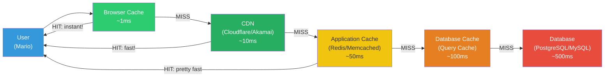

# Fase 4-7 -- Super Star Mode: Cache e Performance

---

## Change Log

| Versao | Data       | Autor                                  | Descricao          |
|--------|------------|----------------------------------------|--------------------|
| 1.0.0  | 2026-03-18 | Paula Silva - Microsoft Latam Software GBB | Criacao inicial    |

---

## Sumario

- [Prologo: Por Que Esta Tao Lento?](#prologo-por-que-esta-tao-lento)
- [1. O Que E Performance?](#1-o-que-e-performance)
  - [1.1 Metricas Fundamentais](#11-metricas-fundamentais)
  - [1.2 Por Que Performance Importa](#12-por-que-performance-importa)
  - [1.3 A Regra dos 3 Segundos](#13-a-regra-dos-3-segundos)
- [2. Cache: Power-Ups no Bolso](#2-cache-power-ups-no-bolso)
  - [2.1 O Que E Cache](#21-o-que-e-cache)
  - [2.2 Como Cache Funciona](#22-como-cache-funciona)
  - [2.3 Cache Hit vs Cache Miss](#23-cache-hit-vs-cache-miss)
  - [2.4 Niveis de Cache](#24-niveis-de-cache)
- [3. Redis: O Bolso Magico](#3-redis-o-bolso-magico)
  - [3.1 O Que E Redis](#31-o-que-e-redis)
  - [3.2 Estruturas de Dados do Redis](#32-estruturas-de-dados-do-redis)
  - [3.3 Redis na Pratica: TodoApp](#33-redis-na-pratica-todoapp)
  - [3.4 Padroes Comuns com Redis](#34-padroes-comuns-com-redis)
  - [3.5 Redis no Azure](#35-redis-no-azure)
- [4. CDN: Lojas de Itens em Cada Mundo](#4-cdn-lojas-de-itens-em-cada-mundo)
  - [4.1 O Que E CDN](#41-o-que-e-cdn)
  - [4.2 Como CDN Funciona](#42-como-cdn-funciona)
  - [4.3 Configurando CDN no Azure](#43-configurando-cdn-no-azure)
  - [4.4 O Que Colocar no CDN](#44-o-que-colocar-no-cdn)
- [5. Estrategias de Cache](#5-estrategias-de-cache)
  - [5.1 Cache-Aside (Lazy Loading)](#51-cache-aside-lazy-loading)
  - [5.2 Write-Through](#52-write-through)
  - [5.3 Write-Behind (Write-Back)](#53-write-behind-write-back)
  - [5.4 TTL: Tempo de Vida do Cache](#54-ttl-tempo-de-vida-do-cache)
  - [5.5 Cache Invalidation](#55-cache-invalidation)
- [6. Performance no Backend](#6-performance-no-backend)
  - [6.1 Otimizacao de Queries (N+1 Problem)](#61-otimizacao-de-queries-n1-problem)
  - [6.2 Indices no Banco de Dados](#62-indices-no-banco-de-dados)
  - [6.3 Connection Pooling](#63-connection-pooling)
  - [6.4 Compressao de Resposta](#64-compressao-de-resposta)
- [7. Performance no Frontend](#7-performance-no-frontend)
  - [7.1 Lazy Loading: Construir Quando Necessario](#71-lazy-loading-construir-quando-necessario)
  - [7.2 Code Splitting](#72-code-splitting)
  - [7.3 Otimizacao de Imagens](#73-otimizacao-de-imagens)
  - [7.4 Debounce e Throttle](#74-debounce-e-throttle)
- [8. Monitoramento de Performance](#8-monitoramento-de-performance)
  - [8.1 Core Web Vitals](#81-core-web-vitals)
  - [8.2 APM: Application Performance Monitoring](#82-apm-application-performance-monitoring)
  - [8.3 Ferramentas de Profiling](#83-ferramentas-de-profiling)
- [9. Checklist de Performance](#9-checklist-de-performance)
- [10. Tabela Final de Resumo](#10-tabela-final-de-resumo)
- [Referencias](#referencias)

---

## Prologo: Por Que Esta Tao Lento?

O TodoApp de Sofia estava funcionando perfeitamente com 10 usuarios. Mas quando cresceu para 1.000, os problemas comecaram. Paginas demoravam 5 segundos para carregar. A API respondia em 3 segundos. Usuarios estavam abandonando a aplicacao.

Yoshi analisou o sistema e fez um diagnostico.

*"Sofia, imagine que toda vez que Mario precisa de um cogumelo, ele volta para o INICIO da fase para buscar na loja. Vai ate la, compra, volta para onde estava. Cada cogumelo leva 30 segundos de ida e volta."*

*"Isso e ridiculo,"* disse Sofia. *"Por que ele nao guarda cogumelos no bolso?"*

*"EXATAMENTE!"* Yoshi comemorou. *"Isso e **cache**. Em vez de buscar dados no banco a cada requisicao (ir ate a loja), voce guarda os dados mais usados na memoria (bolso). Acesso ao bolso: 1 milissegundo. Acesso a loja: 100 milissegundos. 100 vezes mais rapido."*

*"E quando Mario esta com a Super Star, TUDO fica rapido — ele corre mais, e invencivel, atravessa inimigos. Esse e o **Star Mode** da performance: cache + CDN + otimizacao = velocidade maxima."*

---

## 1. O Que E Performance?

### 1.1 Metricas Fundamentais

| Metrica | O Que Mede | Bom | Ruim | Mario |
|---------|-----------|-----|------|-------|
| **Latencia** | Tempo entre requisicao e resposta | < 200ms | > 1s | Tempo do pulo do Mario |
| **Throughput** | Requisicoes por segundo | > 1000 rps | < 100 rps | Moedas coletadas por minuto |
| **TTFB** | Time to First Byte | < 200ms | > 600ms | Tempo ate o primeiro item aparecer |
| **FCP** | First Contentful Paint | < 1.8s | > 3s | Tempo ate a fase comecar a aparecer |
| **TTI** | Time to Interactive | < 3.8s | > 7.3s | Tempo ate poder jogar |
| **P95** | 95% das requisicoes estao abaixo de... | < 500ms | > 2s | 95% dos pulos sao rapidos |

### 1.2 Por Que Performance Importa

| Estatistica | Fonte |
|-------------|-------|
| 53% dos usuarios abandonam se demora mais de 3s | Google |
| Cada 100ms de latencia extra = -1% de vendas | Amazon |
| 1 segundo mais lento = -7% de conversoes | Akamai |
| Performance e fator de ranking no Google | Google Search |

### 1.3 A Regra dos 3 Segundos

```
0 - 100ms:   Instantaneo — usuario nao percebe delay
100 - 300ms: Rapido — usuario percebe leve delay
300 - 1000ms: Aceitavel — usuario percebe, mas tolera
1 - 3s:      Lento — usuario fica impaciente
3 - 5s:      Muito lento — muitos desistem
> 5s:        Inaceitavel — maioria desiste
```

---

## 2. Cache: Power-Ups no Bolso

### 2.1 O Que E Cache

**Cache** e uma camada de armazenamento temporario de alta velocidade que guarda dados frequentemente acessados para que requisicoes futuras sejam atendidas mais rapidamente.

> **Analogia Mario**: Cache e manter os **power-ups mais usados no bolso** em vez de voltar a loja toda vez. Se Mario usa cogumelos com frequencia, faz sentido ter alguns no bolso. Se precisar de um item raro que nunca usa, ai sim vai ate a loja.

### 2.2 Como Cache Funciona

```
SEM CACHE:
  Usuario → API → Banco de Dados (100ms) → API → Usuario
  Total: ~150ms

COM CACHE:
  Usuario → API → Cache (1ms) → API → Usuario
  Total: ~5ms  (30x mais rapido!)

  Se nao estiver no cache:
  Usuario → API → Cache (miss) → Banco (100ms) → Salva no cache → Usuario
  Total: ~155ms (primeira vez), depois 5ms
```

### 2.3 Cache Hit vs Cache Miss

| Situacao | O Que Acontece | Mario |
|----------|---------------|-------|
| **Cache Hit** | Dado encontrado no cache | Cogumelo no bolso — usa imediatamente |
| **Cache Miss** | Dado NAO esta no cache | Bolso vazio — precisa ir ate a loja |
| **Cache Hit Rate** | Porcentagem de hits | % de vezes que o item ja estava no bolso |

```
Meta: Cache Hit Rate > 90%

Se 100 requisicoes chegam:
  90 encontram no cache (hit) → 90 * 5ms = 450ms total
  10 vao ao banco (miss)      → 10 * 150ms = 1500ms total
  Total: 1950ms para 100 requisicoes

Sem cache:
  100 * 150ms = 15000ms (15 segundos!)

Com cache:
  1950ms (2 segundos!) → 7.7x mais rapido
```

### 2.4 Niveis de Cache

```
Nivel 1: Browser Cache (no computador do usuario)
  └── CSS, JS, imagens — o navegador guarda localmente
      Mais rapido: 0ms (ja esta no computador!)

Nivel 2: CDN Cache (nos servidores proximos ao usuario)
  └── Assets estaticos — copias em servidores pelo mundo
      Rapido: 10-50ms

Nivel 3: Application Cache (Redis/Memcached)
  └── Resultados de queries, sessoes, dados computados
      Rapido: 1-5ms

Nivel 4: Database Cache (buffer pool)
  └── Queries recentes ficam na memoria do banco
      Moderado: 10-50ms

Nivel 5: Database (disco)
  └── Dados persistentes no disco
      Lento: 50-200ms
```

### Diagrama: Camadas de Cache



> **Analogia Mario**: Niveis de cache sao como niveis de acesso aos itens:
> - **No bolso** (browser) = instantaneo
> - **Na loja mais proxima** (CDN) = rapido
> - **No deposito central** (Redis) = bem rapido
> - **No cofre do castelo** (database cache) = razoavel
> - **Na mina subterranea** (disco) = demorado

---

## 3. Redis: O Bolso Magico

### 3.1 O Que E Redis

**Redis (Remote Dictionary Server)** e um banco de dados **in-memory** (na memoria RAM) que funciona como cache, message broker e banco de dados.

> **Analogia Mario**: Redis e o **bolso magico** do Mario — um item pouch que cabe em qualquer lugar, tem acesso instantaneo a qualquer item, e pode guardar diferentes tipos de coisas: moedas (strings), listas de itens (lists), inventario (hashes).

**Por que Redis e tao rapido?**

| Armazenamento | Velocidade | Analogia |
|---------------|-----------|----------|
| **Disco (HDD)** | ~10ms | Ir ao porão buscar algo |
| **Disco (SSD)** | ~0.1ms | Ir ao armario do corredor |
| **Memoria (RAM)** | ~0.001ms | Esta no seu bolso |
| **Redis** | ~0.1-1ms (via rede) | Bolso magico conectado pela rede |

### 3.2 Estruturas de Dados do Redis

```bash
# STRING — valor simples
SET user:mario:name "Mario"
GET user:mario:name  # "Mario"

# Com expiracao (TTL)
SET session:abc123 "mario-001" EX 3600  # expira em 1 hora

# HASH — objeto (como um mini-bau)
HSET user:mario name "Mario" coins 42 lives 3
HGET user:mario name     # "Mario"
HGETALL user:mario       # name "Mario" coins "42" lives "3"

# LIST — lista ordenada
LPUSH notifications:mario "Nova tarefa criada"
LPUSH notifications:mario "Tarefa completada"
LRANGE notifications:mario 0 -1  # Todas as notificacoes

# SET — conjunto sem duplicados
SADD online-users "mario" "luigi" "toad"
SISMEMBER online-users "mario"  # 1 (true)
SMEMBERS online-users           # "mario" "luigi" "toad"

# SORTED SET — conjunto ordenado por score
ZADD leaderboard 100 "mario" 85 "luigi" 72 "toad"
ZRANGE leaderboard 0 -1 WITHSCORES  # Ranking
ZREVRANGE leaderboard 0 2           # Top 3
```

### 3.3 Redis na Pratica: TodoApp

```javascript
const Redis = require('ioredis');
const redis = new Redis({
  host: process.env.REDIS_HOST || 'localhost',
  port: 6379,
  password: process.env.REDIS_PASSWORD
});

// Cache de lista de tarefas
async function getTodos(userId) {
  const cacheKey = `todos:${userId}`;

  // 1. Tentar buscar no cache
  const cached = await redis.get(cacheKey);
  if (cached) {
    console.log('Cache HIT! Retornando do Redis');
    return JSON.parse(cached);
  }

  // 2. Cache miss — buscar no banco
  console.log('Cache MISS! Buscando no banco...');
  const todos = await db.todos.findMany({
    where: { userId },
    orderBy: { createdAt: 'desc' }
  });

  // 3. Salvar no cache (expira em 5 minutos)
  await redis.set(cacheKey, JSON.stringify(todos), 'EX', 300);

  return todos;
}

// Invalidar cache quando dados mudam
async function createTodo(userId, data) {
  const todo = await db.todos.create({ data: { ...data, userId } });

  // Invalidar cache do usuario (dados mudaram!)
  await redis.del(`todos:${userId}`);

  return todo;
}

async function updateTodo(todoId, userId, data) {
  const todo = await db.todos.update({ where: { id: todoId }, data });

  // Invalidar cache
  await redis.del(`todos:${userId}`);

  return todo;
}
```

### 3.4 Padroes Comuns com Redis

```javascript
// RATE LIMITING: Limitar requisicoes por usuario
async function rateLimiter(userId, limit = 100, windowSeconds = 60) {
  const key = `ratelimit:${userId}`;
  const current = await redis.incr(key);

  if (current === 1) {
    await redis.expire(key, windowSeconds);
  }

  if (current > limit) {
    throw new Error('Rate limit excedido. Tente novamente em breve.');
  }

  return { remaining: limit - current, total: limit };
}

// SESSION STORE: Guardar sessoes no Redis
async function createSession(userId) {
  const sessionId = generateUUID();
  const sessionData = {
    userId,
    createdAt: Date.now(),
    lastActivity: Date.now()
  };

  await redis.set(
    `session:${sessionId}`,
    JSON.stringify(sessionData),
    'EX', 86400 // 24 horas
  );

  return sessionId;
}

// LEADERBOARD: Ranking em tempo real
async function updateLeaderboard(userId, score) {
  await redis.zadd('leaderboard', score, userId);
}

async function getTopPlayers(count = 10) {
  return await redis.zrevrange('leaderboard', 0, count - 1, 'WITHSCORES');
}

// CACHE DE COMPUTACAO PESADA
async function getMonthlyReport(userId, month) {
  const key = `report:${userId}:${month}`;
  const cached = await redis.get(key);
  if (cached) return JSON.parse(cached);

  // Computacao pesada (query complexa, agregacoes)
  const report = await computeMonthlyReport(userId, month);

  // Cache por 1 hora (relatorio nao muda com frequencia)
  await redis.set(key, JSON.stringify(report), 'EX', 3600);

  return report;
}
```

### 3.5 Redis no Azure

```bash
# Criar Azure Cache for Redis
az redis create \
  --name todoapp-cache \
  --resource-group mushroom-kingdom \
  --location eastus \
  --sku Basic \
  --vm-size C0

# Obter connection string
az redis list-keys \
  --name todoapp-cache \
  --resource-group mushroom-kingdom
```

---

## 4. CDN: Lojas de Itens em Cada Mundo

### 4.1 O Que E CDN

**CDN (Content Delivery Network)** e uma rede de servidores distribuidos pelo mundo que armazena copias do seu conteudo estatico proximo aos usuarios.

> **Analogia Mario**: Imagine que o Mushroom Kingdom tem uma unica loja de itens no World 1. Todos os jogadores de todos os mundos precisam ir ate la para comprar itens. Fila enorme, demora muito. CDN e como colocar **lojas de itens em CADA mundo**. O jogador no World 7 compra do World 7, nao precisa ir ate o World 1.

### 4.2 Como CDN Funciona

```
SEM CDN:
  Usuario (Brasil) ──── 200ms ────→ Servidor (EUA) ──→ Resposta
  Usuario (Japao) ──── 300ms ────→ Servidor (EUA) ──→ Resposta
  Usuario (Europa) ──── 150ms ───→ Servidor (EUA) ──→ Resposta

COM CDN:
  Usuario (Brasil) ──── 20ms ────→ CDN (Sao Paulo) ──→ Resposta
  Usuario (Japao) ──── 10ms ────→ CDN (Toquio) ──→ Resposta
  Usuario (Europa) ──── 15ms ───→ CDN (Frankfurt) ──→ Resposta
```

```
                     ┌─── CDN Sao Paulo ←── Usuario Brasil
                     │
Origin Server ────→ CDN Hub ──── CDN Frankfurt ←── Usuario Europa
  (EUA)              │
                     └─── CDN Toquio ←──── Usuario Japao
```

### 4.3 Configurando CDN no Azure

```bash
# Azure CDN
az cdn profile create \
  --name todoapp-cdn \
  --resource-group mushroom-kingdom \
  --sku Standard_Microsoft

az cdn endpoint create \
  --name todoapp-assets \
  --profile-name todoapp-cdn \
  --resource-group mushroom-kingdom \
  --origin todoapp-mario.azurewebsites.net \
  --origin-host-header todoapp-mario.azurewebsites.net
```

```javascript
// No frontend: usar URLs do CDN para assets
const CDN_URL = 'https://todoapp-assets.azureedge.net';

// Em vez de:


// Usar:

<link rel="stylesheet" href={`${CDN_URL}/css/app.css`} />
<script src={`${CDN_URL}/js/bundle.js`}></script>
```

### 4.4 O Que Colocar no CDN

| Conteudo | CDN? | Por Que |
|----------|:----:|---------|
| Imagens (PNG, JPG, SVG) | Sim | Arquivos grandes, nao mudam |
| CSS e JavaScript | Sim | Arquivos estaticos compilados |
| Fontes (WOFF2) | Sim | Nao mudam, usados em toda pagina |
| Videos | Sim | Arquivos enormes |
| API responses | Depende | So se forem dados publicos e pouco mutaveis |
| HTML dinamico | Geralmente nao | Conteudo muda por usuario |
| Dados do usuario | Nao | Privado e dinamico |

---

## 5. Estrategias de Cache

### 5.1 Cache-Aside (Lazy Loading)

A estrategia mais comum: busca no cache primeiro; se nao tiver, busca na fonte e salva no cache.

> **Analogia Mario**: Mario verifica o bolso. Tem cogumelo? Usa do bolso. Nao tem? Vai na loja, compra, e guarda um extra no bolso para proxima vez.

```javascript
async function getUser(userId) {
  // 1. Verificar cache
  const cached = await cache.get(`user:${userId}`);
  if (cached) return cached;

  // 2. Buscar na fonte
  const user = await db.users.findById(userId);

  // 3. Salvar no cache
  await cache.set(`user:${userId}`, user, { ttl: 300 });

  return user;
}
```

### 5.2 Write-Through

Toda escrita vai para o cache E para o banco ao mesmo tempo.

> **Analogia Mario**: Quando Mario ganha um item, ele coloca no bolso E registra no inventario do castelo simultaneamente.

```javascript
async function updateUser(userId, data) {
  // 1. Atualizar no banco
  const user = await db.users.update(userId, data);

  // 2. Atualizar no cache imediatamente
  await cache.set(`user:${userId}`, user, { ttl: 300 });

  return user;
}
```

### 5.3 Write-Behind (Write-Back)

Escrita vai primeiro para o cache e depois (de forma assincrona) para o banco.

> **Analogia Mario**: Mario coloca o item no bolso imediatamente e pede ao Toad para registrar no inventario quando tiver tempo.

```javascript
async function incrementViewCount(todoId) {
  // Atualiza APENAS no cache (instantaneo)
  await redis.incr(`views:${todoId}`);

  // Um job separado sincroniza com o banco periodicamente
  // (a cada 5 minutos, por exemplo)
}

// Job de sincronizacao
async function syncViewCounts() {
  const keys = await redis.keys('views:*');
  for (const key of keys) {
    const todoId = key.split(':')[1];
    const count = await redis.get(key);
    await db.todos.update(todoId, { viewCount: parseInt(count) });
  }
}
```

### 5.4 TTL: Tempo de Vida do Cache

**TTL (Time to Live)** define por quanto tempo um dado fica no cache.

| Dado | TTL Sugerido | Por Que |
|------|-------------|---------|
| Sessao do usuario | 24h | Nao muda com frequencia |
| Lista de tarefas | 5 min | Muda frequentemente |
| Perfil do usuario | 1h | Muda raramente |
| Configuracoes globais | 24h | Quase nunca muda |
| Resultado de busca | 1 min | Pode ficar desatualizado |
| Dados publicos (homepage) | 5 min | Aceitavel leve desatualizacao |

### 5.5 Cache Invalidation

> *"There are only two hard things in Computer Science: cache invalidation and naming things."* — Phil Karlton

**Estrategias de invalidacao:**

```javascript
// 1. TTL-based: Expira automaticamente apos tempo definido
await redis.set('key', 'value', 'EX', 300); // 5 minutos

// 2. Event-based: Invalida quando dados mudam
async function updateTodo(todoId, userId, data) {
  await db.todos.update(todoId, data);
  await redis.del(`todos:${userId}`);     // Invalida lista
  await redis.del(`todo:${todoId}`);      // Invalida item
}

// 3. Pattern-based: Invalida tudo que combina com um padrao
async function invalidateUserCache(userId) {
  const keys = await redis.keys(`*:${userId}:*`);
  if (keys.length > 0) {
    await redis.del(...keys);
  }
}

// 4. Version-based: Mudar a versao do cache
async function getTodosV2(userId) {
  const version = await redis.get(`todos:version:${userId}`) || '1';
  const key = `todos:${userId}:v${version}`;
  // ... cache logic ...
}

async function invalidateTodosCache(userId) {
  await redis.incr(`todos:version:${userId}`); // Nova versao = cache miss
}
```

---

## 6. Performance no Backend

### 6.1 Otimizacao de Queries (N+1 Problem)

O **problema N+1** e o vilao mais comum de performance em APIs.

> **Analogia Mario**: Imagine que Mario precisa das moedas de 100 fases. O N+1 e como Mario ir ate CADA fase individualmente (100 viagens). A solucao e pedir todas de uma vez (1 viagem).

```javascript
// PROBLEMA N+1 ❌
// 1 query para buscar usuarios + N queries para buscar tarefas de cada um
const users = await db.users.findMany(); // 1 query
for (const user of users) {
  user.todos = await db.todos.findMany({ where: { userId: user.id } });
  // +N queries (se tem 100 usuarios = 100 queries!)
}
// Total: 101 queries 💀

// SOLUCAO: Eager Loading / Include ✅
const users = await db.users.findMany({
  include: { todos: true }  // Busca tudo em 1-2 queries
});
// Total: 2 queries 🎉

// SOLUCAO ALTERNATIVA: Batch Loading
const users = await db.users.findMany();
const userIds = users.map(u => u.id);
const allTodos = await db.todos.findMany({
  where: { userId: { in: userIds } }
});
// Total: 2 queries 🎉
```

### 6.2 Indices no Banco de Dados

**Indices** sao como o indice de um livro — em vez de ler todas as paginas, voce vai direto a pagina certa.

```sql
-- SEM indice: banco le TODAS as linhas (full table scan)
-- Com 1 milhao de tarefas = 1 milhao de comparacoes
SELECT * FROM todos WHERE user_id = 'mario-001';

-- COM indice: banco pula direto para as linhas corretas
-- Com 1 milhao de tarefas = ~20 comparacoes (B-tree)
CREATE INDEX idx_todos_user_id ON todos(user_id);

-- Indice composto para queries com multiplas condicoes
CREATE INDEX idx_todos_user_completed ON todos(user_id, completed);
-- Otimiza: SELECT * FROM todos WHERE user_id = 'mario-001' AND completed = false;

-- Verificar se indices estao sendo usados
EXPLAIN ANALYZE SELECT * FROM todos WHERE user_id = 'mario-001';
```

### 6.3 Connection Pooling

Em vez de criar uma nova conexao ao banco para cada requisicao (caro), reutilizar conexoes de um **pool**.

> **Analogia Mario**: Sem pool = cavar um novo tunel para o castelo a cada visita. Com pool = manter 10 tuneis abertos e reutilizar.

```javascript
// Prisma ja faz connection pooling automaticamente
// Mas pode ser configurado:
const prisma = new PrismaClient({
  datasources: {
    db: {
      url: `${DATABASE_URL}?connection_limit=10&pool_timeout=20`
    }
  }
});
```

### 6.4 Compressao de Resposta

```javascript
const compression = require('compression');

// Comprimir todas as respostas HTTP
app.use(compression({
  level: 6,          // Nivel de compressao (1-9)
  threshold: 1024,   // So comprimir se > 1KB
  filter: (req, res) => {
    // Comprimir JSON e texto
    return compression.filter(req, res);
  }
}));

// Resultado: resposta de 100KB → 15KB (85% menor, mais rapido)
```

---

## 7. Performance no Frontend

### 7.1 Lazy Loading: Construir Quando Necessario

**Lazy Loading** e carregar recursos apenas quando sao necessarios.

> **Analogia Mario**: Lazy loading e como construir os quartos do castelo **so quando alguem entra**. Em vez de construir 100 quartos de uma vez (lento), voce constroi cada quarto no momento que alguem abre a porta. Se ninguem visitar o quarto 47, ele nunca e construido (economia de recursos).

```jsx
// Lazy Loading de componentes React
import { lazy, Suspense } from 'react';

// NAO carrega imediatamente — so quando necessario
const AdminPanel = lazy(() => import('./AdminPanel'));
const Reports = lazy(() => import('./Reports'));
const Settings = lazy(() => import('./Settings'));

function App() {
  return (
    <Suspense fallback={<Loading />}>
      <Routes>
        <Route path="/" element={<TodoList />} />           {/* Carrega imediato */}
        <Route path="/admin" element={<AdminPanel />} />     {/* Carrega sob demanda */}
        <Route path="/reports" element={<Reports />} />      {/* Carrega sob demanda */}
        <Route path="/settings" element={<Settings />} />    {/* Carrega sob demanda */}
      </Routes>
    </Suspense>
  );
}
```

```html
<!-- Lazy Loading de imagens -->
     <!-- Carrega imediato (above the fold) -->
  <!-- Carrega quando visivel -->
  <!-- Carrega quando visivel -->
```

### 7.2 Code Splitting

Dividir o JavaScript em varios arquivos menores que sao carregados sob demanda.

```javascript
// Antes: um unico bundle.js de 2MB (tudo de uma vez)
// Depois: main.js (200KB) + admin.js (300KB) + reports.js (500KB)

// Webpack faz isso automaticamente com dynamic imports
const AdminModule = () => import(/* webpackChunkName: "admin" */ './admin');
```

### 7.3 Otimizacao de Imagens

| Formato | Quando Usar | Tamanho vs JPG |
|---------|-------------|----------------|
| **WebP** | Maioria das imagens | 25-35% menor |
| **AVIF** | Browsers modernos | 50% menor |
| **SVG** | Icones e logos | Vetorial (escalaveis) |
| **JPG** | Fotos (fallback) | Referencia |
| **PNG** | Transparencia necessaria | Maior |

```html
<!-- Servir formato otimo para cada browser -->
<picture>
  <source srcset="image.avif" type="image/avif" />
  <source srcset="image.webp" type="image/webp" />
  
</picture>
```

### 7.4 Debounce e Throttle

```javascript
// DEBOUNCE: Esperar o usuario PARAR de digitar antes de buscar
// Analogia: So entregar a carta quando Mario parar de escrever
function debounce(func, delay) {
  let timer;
  return (...args) => {
    clearTimeout(timer);
    timer = setTimeout(() => func(...args), delay);
  };
}

const searchTodos = debounce(async (query) => {
  const results = await api.get(`/todos/search?q=${query}`);
  setSearchResults(results);
}, 300); // Espera 300ms apos ultima tecla

// THROTTLE: Executar no maximo 1 vez a cada X ms
// Analogia: Mario so pode pular 1 vez por segundo
function throttle(func, limit) {
  let lastRun = 0;
  return (...args) => {
    const now = Date.now();
    if (now - lastRun >= limit) {
      lastRun = now;
      func(...args);
    }
  };
}

const handleScroll = throttle(() => {
  // Verificar se precisa carregar mais items (infinite scroll)
  if (isNearBottom()) loadMoreTodos();
}, 200); // Maximo 1 vez a cada 200ms
```

---

## 8. Monitoramento de Performance

### 8.1 Core Web Vitals

| Metrica | O Que Mede | Bom | Mario |
|---------|-----------|-----|-------|
| **LCP** (Largest Contentful Paint) | Maior elemento visivel carregou | < 2.5s | Tempo ate o cenario principal aparecer |
| **FID** (First Input Delay) | Tempo de resposta ao primeiro clique | < 100ms | Tempo de reacao ao apertar o botao |
| **CLS** (Cumulative Layout Shift) | Quanto a pagina "pula" | < 0.1 | O cenario fica parado ou fica se mexendo? |

### 8.2 APM: Application Performance Monitoring

```javascript
// Azure Application Insights
const appInsights = require('applicationinsights');
appInsights.setup(process.env.APPINSIGHTS_CONNECTION_STRING)
  .setAutoCollectRequests(true)
  .setAutoCollectPerformance(true)
  .setAutoCollectExceptions(true)
  .setAutoCollectDependencies(true)
  .start();

// Custom metric
const client = appInsights.defaultClient;

// Medir tempo de operacao
async function getTodos(userId) {
  const start = Date.now();
  const todos = await db.todos.findMany({ where: { userId } });
  const duration = Date.now() - start;

  client.trackMetric({ name: 'getTodos_duration', value: duration });
  client.trackEvent({ name: 'getTodos', properties: { userId, count: todos.length } });

  return todos;
}
```

### 8.3 Ferramentas de Profiling

| Ferramenta | O Que Faz | Quando Usar |
|------------|-----------|-------------|
| **Chrome DevTools** | Performance do frontend | Investigar lentidao no browser |
| **Lighthouse** | Auditoria completa de web performance | Antes de cada deploy |
| **Azure Application Insights** | APM completo | Monitoramento em producao |
| **Redis CLI INFO** | Metricas do Redis | Verificar hit rate do cache |
| **pg_stat_statements** | Queries lentas no PostgreSQL | Otimizar banco |
| **Artillery** | Load testing | Testar sob carga |

---

## 9. Checklist de Performance

```markdown
## Checklist do Star Mode ⭐

### Backend
- [ ] Redis para dados frequentemente acessados
- [ ] Indices no banco para queries comuns
- [ ] Connection pooling configurado
- [ ] N+1 queries eliminadas (use include/eager loading)
- [ ] Compressao gzip/brotli habilitada
- [ ] Paginacao em todas as listas

### Frontend
- [ ] CDN para assets estaticos
- [ ] Lazy loading de componentes e imagens
- [ ] Code splitting configurado
- [ ] Imagens otimizadas (WebP/AVIF)
- [ ] Debounce em buscas e inputs
- [ ] Bundle size monitorado

### Infraestrutura
- [ ] CDN configurado e funcionando
- [ ] Redis/cache em producao
- [ ] Monitoring/APM ativo
- [ ] Health checks configurados
- [ ] Auto-scaling habilitado

### Metricas
- [ ] LCP < 2.5s
- [ ] FID < 100ms
- [ ] CLS < 0.1
- [ ] Cache hit rate > 90%
- [ ] P95 latencia API < 500ms
```

---

## 10. Tabela Final de Resumo

| Conceito | O Que E | Analogia Mario |
|----------|---------|----------------|
| **Cache** | Armazenamento temporario rapido | Power-ups no bolso |
| **Redis** | Banco in-memory ultra-rapido | Bolso magico do Mario |
| **CDN** | Rede de servidores distribuidos | Lojas de itens em cada mundo |
| **Cache Hit** | Dado encontrado no cache | Item no bolso — usa imediato |
| **Cache Miss** | Dado NAO no cache | Bolso vazio — vai na loja |
| **TTL** | Tempo de vida do cache | Validade do item |
| **Cache Invalidation** | Limpar cache desatualizado | Jogar fora itens vencidos |
| **Lazy Loading** | Carregar sob demanda | Construir quarto quando alguem entra |
| **N+1 Problem** | Queries excessivas ao banco | Ir a loja 100 vezes em vez de 1 |
| **Indice** | Atalho para busca no banco | Indice do livro |
| **Debounce** | Esperar parar antes de agir | Esperar Mario parar de escrever |
| **Code Splitting** | Dividir JS em partes menores | Carregar so a fase atual |

---

## Referencias

- [Redis — Documentacao Oficial](https://redis.io/docs/)
- [Azure Cache for Redis](https://learn.microsoft.com/en-us/azure/azure-cache-for-redis/)
- [Azure CDN — Documentacao](https://learn.microsoft.com/en-us/azure/cdn/)
- [Web.dev — Core Web Vitals](https://web.dev/vitals/)
- [MDN — Lazy Loading](https://developer.mozilla.org/en-US/docs/Web/Performance/Lazy_loading)
- [React — Code Splitting](https://react.dev/reference/react/lazy)
- [Azure Application Insights](https://learn.microsoft.com/en-us/azure/azure-monitor/app/app-insights-overview)
- [Prisma — Query Optimization](https://www.prisma.io/docs/guides/performance-and-optimization)
- [Google — Speed is Key](https://web.dev/why-speed-matters/)
- [Caching Strategies — AWS](https://aws.amazon.com/caching/best-practices/)

---

*Fase 4-7 completa! Voce aprendeu a ativar o Star Mode da performance com cache, Redis, CDN e otimizacoes. Na proxima fase, vamos explorar mensageria e filas — o correio do Mushroom Kingdom. Prepare-se para o Nivel 4-8!*
