# Fase 5-1 -- Das Espadas aos Robos: A Evolucao do DevOps

## Change Log

| Versao | Data       | Autor        | Descricao                          |
|--------|------------|--------------|------------------------------------|
| 1.0.0  | 2026-03-18 | Paula Silva  | Criacao inicial do capitulo        |

---

## Sumario

- [Introducao -- A Sala dos Trofeus](#introducao--a-sala-dos-trofeus)
- [Secao 1 -- A Linha do Tempo: Tres Eras de Combate](#secao-1--a-linha-do-tempo-tres-eras-de-combate)
  - [1.1 Visao Geral das Eras](#11-visao-geral-das-eras)
  - [1.2 Tabela Comparativa: As Tres Eras](#12-tabela-comparativa-as-tres-eras)
- [Secao 2 -- 1a Era: DevOps Tradicional (Combate Manual)](#secao-2--1a-era-devops-tradicional-combate-manual)
  - [2.1 O que e DevOps Tradicional](#21-o-que-e-devops-tradicional)
  - [2.2 A Analogia Mario: Lutando com Espadas](#22-a-analogia-mario-lutando-com-espadas)
  - [2.3 Ferramentas da 1a Era](#23-ferramentas-da-1a-era)
  - [2.4 Limitacoes do Combate Manual](#24-limitacoes-do-combate-manual)
  - [2.5 O que DevOps Tradicional Conquistou](#25-o-que-devops-tradicional-conquistou)
- [Secao 3 -- 2a Era: DevSecOps (Espadas + Escudos)](#secao-3--2a-era-devsecops-espadas--escudos)
  - [3.1 O que e DevSecOps](#31-o-que-e-devsecops)
  - [3.2 A Analogia Mario: Adicionando Escudos ao Arsenal](#32-a-analogia-mario-adicionando-escudos-ao-arsenal)
  - [3.3 Shift Left: Seguranca Desde o Inicio](#33-shift-left-seguranca-desde-o-inicio)
  - [3.4 Ferramentas da 2a Era](#34-ferramentas-da-2a-era)
  - [3.5 O que DevSecOps Conquistou](#35-o-que-devsecops-conquistou)
- [Secao 4 -- 3a Era: Agentic DevOps (Companions Autonomos)](#secao-4--3a-era-agentic-devops-companions-autonomos)
  - [4.1 O que e Agentic DevOps](#41-o-que-e-agentic-devops)
  - [4.2 A Analogia Mario: Comandando um Exercito de Companions](#42-a-analogia-mario-comandando-um-exercito-de-companions)
  - [4.3 O que os Agentes Fazem em Agentic DevOps](#43-o-que-os-agentes-fazem-em-agentic-devops)
  - [4.4 Ferramentas da 3a Era](#44-ferramentas-da-3a-era)
  - [4.5 A Mudanca Fundamental](#45-a-mudanca-fundamental)
- [Secao 5 -- Comparando as Tres Eras na Pratica](#secao-5--comparando-as-tres-eras-na-pratica)
  - [5.1 Cenario: Corrigir um Bug em Producao](#51-cenario-corrigir-um-bug-em-producao)
  - [5.2 Cenario: Criar uma Feature Nova](#52-cenario-criar-uma-feature-nova)
  - [5.3 Cenario: Fazer Code Review](#53-cenario-fazer-code-review)
- [Secao 6 -- A Evolucao Simplificada](#secao-6--a-evolucao-simplificada)
  - [6.1 A Formula da Evolucao](#61-a-formula-da-evolucao)
  - [6.2 Analogia Final: A Historia do Mushroom Kingdom](#62-analogia-final-a-historia-do-mushroom-kingdom)
- [Secao 7 -- Por Que Entender a Evolucao Importa](#secao-7--por-que-entender-a-evolucao-importa)
  - [7.1 Voce Precisa Saber de Onde Veio](#71-voce-precisa-saber-de-onde-veio)
  - [7.2 O Futuro e Agentico](#72-o-futuro-e-agentico)
- [O que Aprendemos -- Tabela de Resumo](#o-que-aprendemos--tabela-de-resumo)
- [Referencias](#referencias)

---

## Introducao -- A Sala dos Trofeus

Sofia entrou numa sala enorme no subsolo do castelo principal do Mushroom Kingdom. Nas paredes, tres enormes vitrines iluminadas mostravam armas e equipamentos de epocas diferentes. Cada vitrine tinha uma placa:

- **Vitrine 1:** *"Era das Espadas"* -- espadas simples, armaduras pesadas, mapas de papel.
- **Vitrine 2:** *"Era das Espadas + Escudos"* -- as mesmas espadas, mas agora com escudos reluzentes e detectores de armadilhas.
- **Vitrine 3:** *"Era dos Companions Autonomos"* -- robos brilhantes, companions com inteligencia propria, um exercito que luta JUNTO com voce.

Um Toad historiador apareceu ao lado de Sofia. "Bem-vinda a Sala dos Trofeus, Sofia. Aqui contamos a historia de como o Mushroom Kingdom evoluiu suas defesas. No inicio, todo combate era manual -- cada golpe planejado por humanos. Depois, adicionamos escudos e defesas automaticas. E agora..." ele apontou para a terceira vitrine, "...agora temos companions que pensam, planejam e agem por conta propria."

"Isso e a historia do DevOps?" perguntou Sofia.

"Exatamente. Tres eras. Tres filosofias. Cada uma construida sobre a anterior. E voce esta entrando na terceira era -- a mais poderosa de todas."

---

## Secao 1 -- A Linha do Tempo: Tres Eras de Combate

### 1.1 Visao Geral das Eras

O desenvolvimento de software evoluiu dramaticamente nas ultimas duas decadas. Assim como os RPGs evoluiram de jogos de texto (MUDs) para mundos 3D abertos, o DevOps passou por tres grandes transformacoes:

- **1a Era -- DevOps Tradicional (~2010-2018):** Unificacao de Dev e Ops. Automacao basica com CI/CD, containers e monitoramento. Tudo configurado e mantido por humanos.
- **2a Era -- DevSecOps (~2018-2024):** DevOps + Seguranca integrada desde o dia 1. Testes de seguranca automaticos na pipeline. Security "shift left".
- **3a Era -- Agentic DevOps (~2024-presente):** Agentes de IA participam ativamente do ciclo todo. Escrevem codigo, revisam PRs, detectam vulnerabilidades, respondem a incidentes e ate se auto-recuperam.

> **ANALOGIA MARIO:** Pense na evolucao do combate no Mushroom Kingdom. Na primeira era, Mario lutava sozinho -- cada pulo, cada ataque era decidido manualmente pelo jogador. Na segunda era, Mario ganhou escudos e armaduras que o protegiam automaticamente de certos ataques. Na terceira era, Mario passou a comandar um exercito de companions inteligentes -- Yoshi, Luigi, Toad -- que lutam ao lado dele, tomam decisoes proprias e ate completam missoes sozinhos enquanto Mario foca na estrategia.

### Diagrama: Linha do Tempo da Evolucao do DevOps

```mermaid
graph LR
    subgraph ERA1["Traditional DevOps (2010s)"]
        A1[Manual Scripts]
        A2[CI/CD Pipelines]
        A3[Infrastructure as Code]
        A4[Monitoring & Alerts]
    end

    subgraph ERA2["DevSecOps (2018+)"]
        B1[Security Shift-Left]
        B2[Automated Scanning]
        B3[Policy as Code]
        B4[Compliance Built-in]
    end

    subgraph ERA3["Agentic DevOps (2024+)"]
        C1[AI Agents in Pipeline]
        C2[Self-Healing Systems]
        C3[Natural Language Ops]
        C4[Autonomous Decisions]
    end

    ERA1 -->|"+ Security"| ERA2
    ERA2 -->|"+ AI Agents"| ERA3

    style ERA1 fill:#4a90d9,stroke:#333,color:#fff
    style ERA2 fill:#e6a817,stroke:#333,color:#fff
    style ERA3 fill:#2ecc71,stroke:#333,color:#fff
```



### 1.2 Tabela Comparativa: As Tres Eras

| Aspecto | 1a Era: DevOps Tradicional | 2a Era: DevSecOps | 3a Era: Agentic DevOps |
|---|---|---|---|
| **Analogia Mario** | Combate manual -- cada golpe e planejado | Combate com escudo -- seguranca desde o inicio | Combate com companion autonomo de IA |
| **Periodo** | ~2010-2018 | ~2018-2024 | ~2024-presente |
| **Filosofia** | "Dev e Ops juntos" | "Dev, Sec e Ops juntos" | "Dev, Sec, Ops e IA juntos" |
| **Automacao** | CI/CD basico, scripts | CI/CD + scans de seguranca | CI/CD + agentes inteligentes |
| **Seguranca** | Pensada no final | Integrada desde o inicio | Detectada e corrigida por agentes |
| **Papel do humano** | Faz tudo | Faz quase tudo, com ajuda automatica | Supervisiona e direciona agentes |
| **Velocidade** | Rapida (vs waterfall) | Rapida + segura | Muito rapida + segura + inteligente |
| **Quem escreve codigo** | 100% humanos | 100% humanos (com templates) | Humanos + agentes de IA |
| **Quem faz code review** | Humanos | Humanos + linters | Humanos + agentes de IA |
| **Quem responde incidentes** | Humanos de plantao | Humanos + alertas automaticos | Humanos + agentes SRE autonomos |

---

## Secao 2 -- 1a Era: DevOps Tradicional (Combate Manual)

### 2.1 O que e DevOps Tradicional

Antes do DevOps, existiam dois mundos separados: os **Desenvolvedores** (Dev) que escreviam codigo e os **Operadores** (Ops) que mantinham os servidores. Eles raramente conversavam, e quando o codigo "funcionava na minha maquina" mas quebrava em producao, comecava a guerra de culpa.

O **DevOps Tradicional** uniu esses dois mundos. A ideia central: Dev e Ops trabalham juntos, desde o primeiro commit ate o deploy em producao. Automacao basica com CI/CD, containers para padronizar ambientes, e monitoramento para saber quando algo quebra.

Principios fundamentais do DevOps Tradicional:

- **Cultura de colaboracao:** Dev e Ops no mesmo time
- **Automacao de pipeline:** CI/CD para build, test e deploy
- **Infrastructure as Code:** Infraestrutura definida em codigo (Terraform, CloudFormation)
- **Monitoramento continuo:** Saber o que acontece em producao (Prometheus, Grafana)
- **Feedback loops rapidos:** Saber rapidamente se algo quebrou

### 2.2 A Analogia Mario: Lutando com Espadas

> **ANALOGIA MARIO:** Na 1a Era, Mario luta com espadas simples. Cada golpe e planejado manualmente pelo jogador. Voce ve o Goomba, calcula a distancia, aperta o botao de ataque. Se errar, leva dano. Se acertar, o Goomba morre. Cada combate exige atencao total do jogador. Nao ha companions, nao ha ataques automaticos, nao ha escudo protetor. E puro skill manual.
>
> Isso e exatamente como DevOps Tradicional funciona: o desenvolvedor configura cada pipeline manualmente. Cada script de CI/CD e escrito a mao. Cada alerta de monitoramento e configurado individualmente. Funciona bem? Sim! Mas exige atencao constante e habilidade tecnica em cada etapa.

A metafora das espadas funciona porque:

- **Espada = ferramenta basica.** CI/CD, Docker, Kubernetes -- sao ferramentas poderosas, mas exigem que o humano as empunhe corretamente.
- **Cada golpe e manual.** Cada pipeline precisa ser escrita, testada e mantida por humanos.
- **O jogador faz tudo.** Nao ha assistente, nao ha companion. O dev configura, monitora, corrige, deploya.

### 2.3 Ferramentas da 1a Era

| Ferramenta | Categoria | O que Faz | Analogia Mario |
|---|---|---|---|
| **Jenkins** | CI/CD | Automacao de build e deploy | A forja onde voce afila suas espadas |
| **Docker** | Containers | Empacota aplicacoes em containers padronizados | Bau portatil que funciona em qualquer castelo |
| **Kubernetes** | Orquestracao | Gerencia containers em escala | O mapa que organiza os baus em varios castelos |
| **Terraform** | IaC | Define infraestrutura como codigo | A planta do castelo -- escrita em papel magico |
| **Prometheus** | Monitoramento | Coleta metricas em tempo real | O Lakitu vigiando de cima com uma lente |
| **Grafana** | Visualizacao | Dashboards de monitoramento | O painel de controle na sala do trono |
| **Ansible** | Configuracao | Automacao de configuracao de servidores | O roteiro de construcao do castelo |
| **GitHub Actions** | CI/CD | Pipelines de automacao no GitHub | O Lakitu que executa tarefas automaticamente |

### 2.4 Limitacoes do Combate Manual

Mesmo com todas essas ferramentas, a 1a Era tinha limitacoes significativas:

1. **Tudo depende do humano.** Se o dev nao configurar o pipeline, nao existe automacao. E como jogar Mario sem power-ups -- possivel, mas muito mais dificil.

2. **Seguranca como reflexao tardia.** Na 1a Era, seguranca era verificada NO FINAL do processo. O castelo era construido primeiro, e so depois alguem verificava se tinha armadilhas. Muitas vezes, tarde demais.

3. **Escalabilidade limitada.** Quanto mais projetos, mais pipelines para manter manualmente. E como ter 100 castelos e precisar afiar 100 espadas diferentes todos os dias.

4. **Alertas sem inteligencia.** O monitoramento avisava "algo quebrou", mas nao dizia POR QUE quebrou nem COMO consertar. O Lakitu gritava "PERIGO!" mas nao ajudava a resolver.

5. **Code review 100% humano.** Cada Pull Request precisava de um humano para revisar. Em times grandes, isso virava gargalo.

### 2.5 O que DevOps Tradicional Conquistou

Apesar das limitacoes, a 1a Era foi revolucionaria:

- **Unificou Dev e Ops** -- acabou com a guerra entre times
- **Introduziu CI/CD** -- deploy em minutos, nao semanas
- **Padronizou ambientes** -- "funciona na minha maquina" deixou de ser problema
- **Criou cultura de automacao** -- a base para tudo que veio depois
- **Feedback rapido** -- saber em minutos se algo quebrou

> **ANALOGIA MARIO:** A 1a Era e como a fase 1-1 do Super Mario Bros. Parece simples comparada com as fases finais, mas e onde voce aprende os fundamentos: pular, correr, coletar moedas, evitar inimigos. Sem dominar a fase 1-1, voce nunca chega ao World 8. DevOps Tradicional e o alicerce de TUDO que veio depois.

---

## Secao 3 -- 2a Era: DevSecOps (Espadas + Escudos)

### 3.1 O que e DevSecOps

O **DevSecOps** nasceu de uma constatacao dolorosa: seguranca nao pode ser uma reflexao tardia. Quando voce constroi um castelo inteiro e so depois verifica se tem armadilhas, o custo de consertar e enorme. Muitas vezes, e preciso demolir paredes inteiras.

A filosofia DevSecOps e simples: **seguranca integrada em CADA etapa do processo**, desde o primeiro commit ate o monitoramento em producao. Nao e uma fase extra no final -- e um ingrediente que permeia tudo.

Principios adicionados pelo DevSecOps:

- **Shift Left:** Mover verificacoes de seguranca para o INICIO do processo
- **Security as Code:** Politicas de seguranca definidas como codigo
- **Automacao de seguranca:** Scans automaticos em cada commit e PR
- **Responsabilidade compartilhada:** Seguranca e responsabilidade de TODOS, nao so do time de seguranca
- **Compliance continua:** Verificacao automatica de conformidade

### 3.2 A Analogia Mario: Adicionando Escudos ao Arsenal

> **ANALOGIA MARIO:** Na 2a Era, Mario continua lutando com espadas, mas agora tem ESCUDOS. O escudo nao e algo que voce ativa manualmente -- ele esta SEMPRE ativo, protegendo automaticamente. Quando um Koopa lanca uma carapaca, o escudo bloqueia sem voce precisar apertar um botao. Quando voce se aproxima de um bloco suspeito, o escudo brilha em vermelho, avisando: "Cuidado, armadilha!"
>
> Isso e DevSecOps: a seguranca esta sempre ativa, automaticamente. Cada commit passa por verificacao de seguranca. Cada dependencia e escaneada. Cada segredo e protegido. Voce nao precisa lembrar de ativar a seguranca -- ela FAZ PARTE do equipamento.

### 3.3 Shift Left: Seguranca Desde o Inicio

O conceito mais importante do DevSecOps e o **Shift Left** -- mover verificacoes de seguranca para a esquerda na linha do tempo do desenvolvimento:

```
ANTES (DevOps Tradicional):
  Codigo → Build → Test → Deploy → [Seguranca] → Producao
                                      ↑
                              Tarde demais! Caro de consertar.

DEPOIS (DevSecOps):
  [Seguranca] → Codigo → [Seguranca] → Build → [Seguranca] → Test → Deploy → Producao
       ↑                       ↑                      ↑
  Pre-commit              Em cada PR            Na pipeline
  Verificacao local      Scan automatico       Testes de seguranca
```

> **ANALOGIA MARIO:** No Mario antigo, voce so descobria que uma fase tinha armadilhas JOGANDO a fase e morrendo. No Mario moderno com DevSecOps, o escudo detecta armadilhas ANTES de voce pisar nelas. O detector de armadilhas funciona em tres momentos: quando voce entra na fase (pre-commit), quando voce chega num checkpoint (PR), e quando voce esta no caminho do boss (pipeline).

### 3.4 Ferramentas da 2a Era

| Ferramenta | Categoria | O que Faz | Analogia Mario |
|---|---|---|---|
| **SAST (CodeQL)** | Code Scanning | Analisa codigo fonte buscando vulnerabilidades | Detector de armadilhas invisiveis nas paredes |
| **DAST** | Runtime Scanning | Testa a aplicacao rodando buscando falhas | Enviar um Toad de reconhecimento pela fase |
| **SCA (Dependabot)** | Dependency Scanning | Verifica dependencias vulneraveis | Inspetor de itens da loja -- "este mushroom esta vencido!" |
| **Secret Scanning** | Secret Detection | Detecta chaves e senhas expostas no codigo | Alarme anti-roubo -- detecta chaves do castelo expostas |
| **Snyk** | Seguranca Full-Stack | Seguranca de codigo, containers e IaC | Guarda completo que vigia tudo |
| **OWASP ZAP** | Pentesting | Testes de penetracao automatizados | Koopa contratado para testar as defesas do castelo |
| **Trivy** | Container Scanning | Escaneia imagens Docker por vulnerabilidades | Inspetor de baus -- verifica se nao tem armadilha dentro |
| **Push Protection** | Prevention | Bloqueia push de segredos antes de acontecer | Portao que nao abre se voce carregar chaves expostas |

### 3.5 O que DevSecOps Conquistou

- **Seguranca desde o dia 1** -- nao como reflexao tardia
- **Scans automaticos** -- cada commit verificado
- **Custo de correcao menor** -- bugs de seguranca encontrados cedo sao baratos de corrigir
- **Cultura de seguranca** -- todo dev pensa em seguranca, nao so o time de sec
- **Compliance automatizada** -- auditorias ficam mais simples

> **ANALOGIA MARIO:** Com o escudo, Mario nao precisa mais se preocupar em ser pego de surpresa por ataques conhecidos. O escudo cuida disso automaticamente. Isso libera o jogador para focar no que importa: a estrategia, a exploracao, a criatividade. DevSecOps liberou os devs para focar no codigo, sem esquecer da seguranca.

---

## Secao 4 -- 3a Era: Agentic DevOps (Companions Autonomos)

### 4.1 O que e Agentic DevOps

**Agentic DevOps** e a proxima evolucao. Em vez de apenas USAR ferramentas de IA (como o Copilot sugerindo codigo), os agentes de IA se tornam **membros ativos da equipe**. Eles nao so ajudam -- eles AGEM de forma autonoma dentro de limites definidos.

A diferenca fundamental:

- **DevOps Tradicional:** Humanos automatizam com scripts
- **DevSecOps:** Humanos automatizam com scripts + seguranca
- **Agentic DevOps:** IA + humanos automatizam juntos, com IA agindo autonomamente

Em Agentic DevOps, agentes de IA:

- **Escrevem codigo** baseado em especificacoes (Spec-Driven Development)
- **Revisam Pull Requests** automaticamente, identificando bugs e sugerindo melhorias
- **Detectam e corrigem** vulnerabilidades de seguranca
- **Respondem a incidentes** em producao (Azure SRE Agent)
- **Geram testes** automaticamente para codigo novo
- **Criam documentacao** a partir do codigo
- **Planejam e executam** migracoes de infraestrutura

### 4.2 A Analogia Mario: Comandando um Exercito de Companions

> **ANALOGIA MARIO:** Na 3a Era, Mario nao luta mais sozinho. Ele comanda um EXERCITO de companions inteligentes. Yoshi vai na frente comendo inimigos. Luigi cobre a retaguarda. Toad verifica armadilhas. Peach testa se o caminho e seguro. Cada companion tem inteligencia propria -- eles nao esperam Mario dizer "pula agora". Eles VEEM o inimigo e DECIDEM a melhor acao.
>
> Mario deixou de ser o guerreiro que faz tudo sozinho. Agora ele e o COMANDANTE que define a estrategia, e os companions executam. Se um companion encontra um problema que nao sabe resolver, ele ESCALA para Mario: "Chefe, achei algo estranho aqui. O que eu faco?" Mario decide, e o companion executa.

A evolucao completa em uma frase:

```
Era 1: Mario luta sozinho com espadas (DevOps Tradicional)
Era 2: Mario luta com espadas + escudos automaticos (DevSecOps)
Era 3: Mario comanda companions inteligentes que lutam COM ele (Agentic DevOps)
```

### 4.3 O que os Agentes Fazem em Agentic DevOps

| O que o Agente Faz | Equivalente Manual | Ganho | Analogia Mario |
|---|---|---|---|
| **Escreve codigo a partir de specs** | Dev escreve linha por linha | 10x mais rapido | Yoshi constroi a fase baseado na planta |
| **Revisa PRs automaticamente** | Dev le cada PR manualmente | Reviews em segundos | Toadette inspeciona cada bloco construido |
| **Detecta vulnerabilidades** | Time de sec faz auditoria | Deteccao em tempo real | Escudo Estelar que brilha ao detectar perigo |
| **Responde a incidentes** | Dev de plantao acordado as 3h | Resposta em segundos | Yoshi autonomo que defende o castelo 24/7 |
| **Gera testes** | Dev escreve cada teste | Cobertura completa automatica | Peach cria obstaculos de treino para cada fase |
| **Cria documentacao** | Dev escreve docs (ou nao escreve) | Docs sempre atualizados | Toad historiador que registra tudo automaticamente |
| **Resolve issues** | Dev pega issue, analisa, implementa | Issues resolvidas autonomamente | Coding Agent que recebe missao e volta com solucao |

### 4.4 Ferramentas da 3a Era

| Ferramenta | Categoria | O que Faz | Analogia Mario |
|---|---|---|---|
| **GitHub Copilot (Agent Mode)** | IDE Agent | Companion que codifica COM voce | Yoshi jogando ao lado de Mario |
| **GitHub Coding Agent** | Background Agent | Resolve issues e abre PRs sozinho | Yoshi que vai numa missao solo e volta com o resultado |
| **Azure SRE Agent** | SRE Autonomo | Responde a incidentes em producao | Guardioes autonomos que defendem o castelo 24/7 |
| **MCP (Model Context Protocol)** | Integracao | Conecta agentes a ferramentas externas | Warp Zones para outros mundos |
| **Spec-Kit** | Desenvolvimento | Desenvolvimento orientado a especificacoes | Planta detalhada do castelo que o NPC construtor segue |
| **Custom Agents (.agent.md)** | Configuracao | Agentes especializados para cada dominio | Fichas de personagem para cada companion |
| **Agent Skills (SKILL.md)** | Habilidades | Habilidades reutilizaveis para agentes | Power-Ups que qualquer companion pode usar |
| **Copilot Autofix** | Seguranca | Correcao automatica de vulnerabilidades | Escudo que alem de detectar, conserta armadilhas |

### 4.5 A Mudanca Fundamental

A mudanca mais profunda da 3a Era nao e tecnologica -- e **filosofica**. O papel do desenvolvedor muda:

| Aspecto | Antes (1a e 2a Era) | Agora (3a Era) |
|---|---|---|
| **Papel principal** | Escritor de codigo | Arquiteto e supervisor |
| **Tempo gasto codando** | 80% | 40% |
| **Tempo gasto revisando** | 15% | 30% |
| **Tempo gasto dirigindo agentes** | 0% | 25% |
| **Habilidade mais valiosa** | Escrever codigo rapido | Escrever especificacoes claras |
| **Metafora** | Guerreiro solo | Comandante de exercito |

> **ANALOGIA MARIO:** E a diferenca entre SER o Mario que pula em cada Goomba (1a Era) e ser o JOGADOR que comanda Mario, Luigi, Yoshi e todo o time (3a Era). O jogador ainda e essencial -- sem ele, os companions nao sabem PARA ONDE ir. Mas agora o jogador foca na estrategia, nao na execucao de cada pulo individual.

---

## Secao 5 -- Comparando as Tres Eras na Pratica

### 5.1 Cenario: Corrigir um Bug em Producao

**1a Era (DevOps Tradicional):**
1. Alerta dispara as 3h da manha
2. Dev de plantao acorda, abre o laptop
3. Analisa logs manualmente por 30 minutos
4. Identifica o bug, escreve a correcao
5. Roda testes, faz PR, espera review
6. Faz deploy manualmente
7. Tempo total: 2-4 horas

**2a Era (DevSecOps):**
1. Alerta dispara as 3h da manha com mais contexto (scans de seguranca incluidos)
2. Dev de plantao acorda, abre o laptop
3. Dashboard mostra logs + scan de seguranca + metricas
4. Identifica o bug mais rapidamente com melhor contexto
5. Escreve a correcao, scan automatico verifica seguranca da correcao
6. Deploy automatizado apos aprovacao
7. Tempo total: 1-2 horas

**3a Era (Agentic DevOps):**
1. Alerta dispara as 3h da manha
2. Azure SRE Agent detecta o incidente automaticamente
3. Agent analisa logs, identifica causa raiz, propoe correcao
4. Agent aplica correcao em staging, roda testes automaticos
5. Se testes passam, notifica o dev: "Incidente resolvido. Aqui esta o que fiz e por que."
6. Dev revisa pela manha e aprova (ou ajusta)
7. Tempo total: 15-30 minutos (maioria autonomo)

> **ANALOGIA MARIO:** Na 1a Era, voce acorda as 3h porque um Koopa invadiu o castelo e precisa ir la pessoalmente lutar. Na 2a Era, voce acorda mas o castelo ja tem defesas que contiveram o Koopa -- voce so precisa dar o golpe final. Na 3a Era, Yoshi ja derrotou o Koopa, limpou a bagunca e te manda um relatorio pela manha: "Chefe, um Koopa entrou as 3h. Eu resolvi. Aqui esta o que aconteceu."

### 5.2 Cenario: Criar uma Feature Nova

**1a Era (DevOps Tradicional):**
1. Dev le a spec no Jira/Azure Boards
2. Escreve todo o codigo manualmente (frontend, backend, testes)
3. Configura pipeline de CI/CD para a nova feature
4. Faz PR, espera review de outro dev humano
5. Resolve comentarios, faz merge
6. Monitora o deploy
7. Tempo total: 3-5 dias

**2a Era (DevSecOps):**
1. Dev le a spec
2. Escreve o codigo (com templates e snippets)
3. Pipeline ja inclui scans de seguranca automaticos
4. PR automaticamente inclui scan SAST/DAST
5. Review humano + scan automatico
6. Deploy com compliance check automatico
7. Tempo total: 2-4 dias

**3a Era (Agentic DevOps):**
1. Dev escreve uma ESPECIFICACAO detalhada (spec)
2. Coding Agent le a spec e gera o codigo (frontend, backend, testes)
3. Agent abre um PR completo com descricao detalhada
4. Dev revisa o PR (agente de review ja passou)
5. Dev ajusta o que for necessario, merge
6. Deploy automatico com monitoramento por agentes
7. Tempo total: 4-8 horas

### 5.3 Cenario: Fazer Code Review

**1a Era:** Dev humano le cada linha, comenta, espera correcoes. Tempo: 30min a 2h por PR.

**2a Era:** Linter e ferramentas automaticas fazem a primeira passada. Dev humano foca nos problemas reais. Tempo: 15min a 1h por PR.

**3a Era:** Agente de code review analisa tudo (estilo, seguranca, performance, testes), comenta no PR com sugestoes especificas. Dev humano revisa os comentarios do agente e toma a decisao final. Tempo: 5-15min por PR.

---

## Secao 6 -- A Evolucao Simplificada

### 6.1 A Formula da Evolucao

A evolucao pode ser resumida em uma formula simples:

```
DevOps (humanos automatizam)
    → DevSecOps (humanos automatizam com seguranca)
        → Agentic DevOps (IA + humanos automatizam juntos, com IA agindo autonomamente)
```

Cada era NAO elimina a anterior. Ela ADICIONA:

- Agentic DevOps INCLUI tudo do DevSecOps
- DevSecOps INCLUI tudo do DevOps Tradicional
- Voce nao descarta as espadas quando ganha o escudo
- Voce nao descarta o escudo quando ganha companions

### 6.2 Analogia Final: A Historia do Mushroom Kingdom

> **ANALOGIA MARIO:** Imagine a historia completa do Mushroom Kingdom:
>
> **Capitulo 1 (DevOps):** Mario aprende a lutar com espadas. Ele e Ops se unem. Juntos, constroem os primeiros castelos com automacao basica. Cada tijolo colocado manualmente, mas pelo menos Dev e Ops trabalham juntos.
>
> **Capitulo 2 (DevSecOps):** Mario descobre que os castelos estao sendo invadidos. Ele adiciona escudos automaticos, detectores de armadilhas, alarmes anti-roubo. Agora cada castelo construido ja vem com seguranca EMBUTIDA. Os invasores ainda tentam, mas o escudo pega a maioria.
>
> **Capitulo 3 (Agentic DevOps):** Mario percebe que nao consegue construir e defender 100 castelos sozinho. Ele recruta um exercito de companions inteligentes. Yoshi constroi castelos. Toad inspeciona defesas. Luigi patrulha a noite. Peach testa cada porta e janela. Mario se torna o COMANDANTE -- define a estrategia, e o exercito executa. E quando alguem encontra algo que nao sabe resolver, ESCALA para Mario.

---

## Secao 7 -- Por Que Entender a Evolucao Importa

### 7.1 Voce Precisa Saber de Onde Veio

Entender as tres eras nao e apenas historia -- e **fundamental** para trabalhar na era atual:

- Se voce nao entende CI/CD (1a Era), nao consegue configurar pipelines para agentes
- Se voce nao entende seguranca (2a Era), nao consegue definir guardrails para agentes autonomos
- Se voce pula direto para agentes sem os fundamentos, cria caos em vez de produtividade

> **ANALOGIA MARIO:** Voce nao pode comandar um exercito se nunca empunhou uma espada. O comandante precisa entender o combate manual para dar ordens inteligentes. Um Mario que nunca lutou sozinho nao sabe avaliar se Yoshi esta fazendo um bom trabalho.

### 7.2 O Futuro e Agentico

O futuro do desenvolvimento de software e claro: **cada vez mais agentico**. Isso nao significa que devs vao perder emprego -- significa que devs vao mudar de funcao:

- De **escritores de codigo** para **arquitetos e supervisores**
- De **executores** para **estrategistas**
- De **guerreiros solitarios** para **comandantes de equipe**

A habilidade mais valiosa do futuro nao e escrever codigo rapido. E **escrever especificacoes claras, definir guardrails eficazes e supervisionar agentes inteligentes**.

---

## O que Aprendemos -- Tabela de Resumo

| Conceito | O que E | Analogia Mario | Por que Importa |
|---|---|---|---|
| **DevOps Tradicional** | Dev + Ops juntos, automacao basica | Combate manual com espadas | Base de tudo: CI/CD, containers, monitoramento |
| **DevSecOps** | DevOps + seguranca integrada | Espadas + escudos automaticos | Seguranca nao e opcional, e parte do equipamento |
| **Agentic DevOps** | DevOps + agentes autonomos de IA | Comandar exercito de companions | O futuro: humanos dirigem, agentes executam |
| **Shift Left** | Seguranca desde o inicio | Detectar armadilhas antes de pisar | Mais barato consertar cedo do que tarde |
| **Spec-Driven Dev** | Escrever specs, agentes geram codigo | Dar a planta ao NPC construtor | A habilidade mais valiosa do futuro |
| **Evolucao cumulativa** | Cada era inclui a anterior | Espada + escudo + companions | Nao descarte fundamentos ao adotar o novo |

---

## Referencias

| Recurso | Tipo | Link |
|---|---|---|
| Microsoft DevOps Resource Center | Documentacao | https://learn.microsoft.com/en-us/devops/ |
| GitHub Blog -- Agentic DevOps | Blog oficial | https://github.blog/ai-and-ml/github-copilot/ |
| OWASP DevSecOps Guideline | Framework | https://owasp.org/www-project-devsecops-guideline/ |
| Azure SRE Agent | Documentacao | https://learn.microsoft.com/en-us/azure/sre-agent |
| GitHub Spec-Kit | Repositorio | https://github.com/github/spec-kit |
| GitHubNext Agentics | Pesquisa | https://github.com/githubnext/agentics |
| DevOps Handbook (Kim, Humble, et al.) | Livro | https://itrevolution.com/product/the-devops-handbook-second-edition/ |

---

*Fase 5-1 concluida! Voce agora entende as tres eras do DevOps e sabe que estamos entrando na era mais poderosa -- a era dos companions autonomos. Na proxima fase, vamos aprender os niveis de maturidade em IA. Prepare-se para evoluir de Aprendiz a Lendario!*
