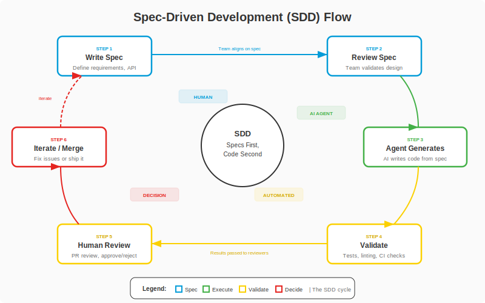

# Fase 5-10 -- A Planta do Castelo: Spec-Driven Development (SDD) Completo

## Change Log

| Versao | Data       | Autor        | Descricao                          |
|--------|------------|--------------|------------------------------------|
| 1.0.0  | 2026-03-18 | Paula Silva  | Criacao inicial do capitulo        |

---

## Sumario

- [Introducao -- O Segredo dos Grandes Construtores](#introducao--o-segredo-dos-grandes-construtores)
- [Secao 1 -- O que e Spec-Driven Development](#secao-1--o-que-e-spec-driven-development)
  - [1.1 Definicao](#11-definicao)
  - [1.2 Por que Importa: A Habilidade Mais Valiosa do Futuro](#12-por-que-importa-a-habilidade-mais-valiosa-do-futuro)
  - [1.3 A Analogia Mario: Antes e Depois da Planta](#13-a-analogia-mario-antes-e-depois-da-planta)
  - [1.4 A Mudanca de Paradigma](#14-a-mudanca-de-paradigma)

<div align="center">

<br><em>Ciclo do Spec-Driven Development</em>
</div>
- [Secao 2 -- O Fluxo Completo do SDD](#secao-2--o-fluxo-completo-do-sdd)
  - [2.1 Os 6 Passos do SDD](#21-os-6-passos-do-sdd)
  - [2.2 Diagrama do Fluxo](#22-diagrama-do-fluxo)
  - [2.3 Tempos Tipicos](#23-tempos-tipicos)
- [Secao 3 -- Anatomia de uma Spec Perfeita](#secao-3--anatomia-de-uma-spec-perfeita)
  - [3.1 Estrutura Completa](#31-estrutura-completa)
  - [3.2 Analogia Mario: As Partes da Planta do Castelo](#32-analogia-mario-as-partes-da-planta-do-castelo)
  - [3.3 Exemplo Completo de uma Spec Real](#33-exemplo-completo-de-uma-spec-real)
- [Secao 4 -- 5 Templates de Spec para Diferentes Cenarios](#secao-4--5-templates-de-spec-para-diferentes-cenarios)
  - [4.1 Template 1: Nova Feature](#41-template-1-nova-feature)
  - [4.2 Template 2: Bug Fix](#42-template-2-bug-fix)
  - [4.3 Template 3: Refactoring](#43-template-3-refactoring)
  - [4.4 Template 4: API Endpoint](#44-template-4-api-endpoint)
  - [4.5 Template 5: Database Migration](#45-template-5-database-migration)
- [Secao 5 -- Spec-Kit: A Ferramenta Oficial](#secao-5--spec-kit-a-ferramenta-oficial)
  - [5.1 O que e o Spec-Kit](#51-o-que-e-o-spec-kit)
  - [5.2 Instalacao e Configuracao](#52-instalacao-e-configuracao)
  - [5.3 Integracao com GitHub Copilot e Coding Agent](#53-integracao-com-github-copilot-e-coding-agent)
  - [5.4 Workflow com Spec-Kit](#54-workflow-com-spec-kit)
  - [5.5 Exemplo Pratico: Da Spec ao PR](#55-exemplo-pratico-da-spec-ao-pr)
- [Secao 6 -- SDD + GitHub Workflow Completo](#secao-6--sdd--github-workflow-completo)
  - [6.1 O Fluxo End-to-End](#61-o-fluxo-end-to-end)
  - [6.2 Diagrama de Sequencia](#62-diagrama-de-sequencia)
  - [6.3 Cada Etapa em Detalhe](#63-cada-etapa-em-detalhe)
- [Secao 7 -- Good Spec vs Bad Spec](#secao-7--good-spec-vs-bad-spec)
  - [7.1 Tabela Comparativa](#71-tabela-comparativa)
  - [7.2 Exemplo 1: Spec de Autenticacao](#72-exemplo-1-spec-de-autenticacao)
  - [7.3 Exemplo 2: Spec de Performance](#73-exemplo-2-spec-de-performance)
  - [7.4 Exemplo 3: Spec de API](#74-exemplo-3-spec-de-api)
- [Secao 8 -- Spec Validation Checklist](#secao-8--spec-validation-checklist)
  - [8.1 O Checklist Completo](#81-o-checklist-completo)
  - [8.2 Como Usar o Checklist](#82-como-usar-o-checklist)
- [Secao 9 -- Anti-Patterns do SDD](#secao-9--anti-patterns-do-sdd)
  - [9.1 Os 6 Anti-Patterns Mortais](#91-os-6-anti-patterns-mortais)
  - [9.2 Como Evitar Cada Anti-Pattern](#92-como-evitar-cada-anti-pattern)
- [Secao 10 -- Metricas de Qualidade](#secao-10--metricas-de-qualidade)
  - [10.1 As 5 Metricas Essenciais](#101-as-5-metricas-essenciais)
  - [10.2 Dashboard de SDD](#102-dashboard-de-sdd)
- [Secao 11 -- SDD com Copilot: Passo a Passo Pratico](#secao-11--sdd-com-copilot-passo-a-passo-pratico)
  - [11.1 Preparacao do Ambiente](#111-preparacao-do-ambiente)
  - [11.2 Tutorial: TodoApp com Prioridade](#112-tutorial-todoapp-com-prioridade)
  - [11.3 Revisando o PR Gerado](#113-revisando-o-pr-gerado)
  - [11.4 Iterando e Fazendo Merge](#114-iterando-e-fazendo-merge)
- [Boss Battle: Exercicio Pratico](#boss-battle-exercicio-pratico)
- [POWER-UP UNLOCKED!](#power-up-unlocked)
- [O que Aprendemos -- Tabela de Resumo](#o-que-aprendemos--tabela-de-resumo)
- [Referencias](#referencias)

---

## Introducao -- O Segredo dos Grandes Construtores

Sofia entrou numa sala enorme do castelo onde Toad arquiteto estava inclinado sobre uma mesa gigantesca. Na mesa, um desenho detalhado -- linhas, anotacoes, medidas, materiais -- uma planta completa de um novo castelo.

"Toad, voce nao vai comecar a construir?" perguntou Sofia.

"Construir SEM a planta?" Toad arregalou os olhos. "Sofia, o segredo dos grandes construtores nao e saber colocar tijolos. QUALQUER NPC sabe colocar tijolos. O segredo e saber DESENHAR A PLANTA. A planta diz quais tijolos, onde, quantos, e por que. Sem planta, voce constroi e torce pra dar certo. Com planta, voce constroi com CERTEZA."

Sofia olhou para a planta. Era impressionantemente detalhada: cada sala tinha um proposito descrito, cada corredor tinha dimensoes, cada porta tinha uma anotacao sobre para onde levava.

"E se a planta for ruim?" ela perguntou.

"Ai o castelo fica ruim," respondeu Toad. "A qualidade do castelo NUNCA supera a qualidade da planta. Se a planta diz 'faz um castelo ai, qualquer um', o NPC construtor vai fazer qualquer coisa. Se a planta diz 'castelo com 7 salas, torre de vigia a leste, ponte levadica com 3 metros, fosso com 2 metros de profundidade' -- ai sim, o castelo fica perfeito."

"Entao... a habilidade mais importante nao e construir. E planejar?"

Toad sorriu. "Bem-vinda ao Spec-Driven Development."

---

## Secao 1 -- O que e Spec-Driven Development

### 1.1 Definicao

**Spec-Driven Development (SDD)** e a pratica de escrever especificacoes detalhadas ANTES de qualquer codigo, e entao usar agentes de IA para gerar a implementacao baseada nessas especificacoes.

Em termos simples:

- **Voce** escreve O QUE precisa ser construido (a spec)
- **O agente** escreve COMO construir (o codigo)
- **Testes e validacoes** confirmam que o codigo atende a spec
- **Voce** revisa e ajusta

SDD nao e uma ferramenta. E uma **forma de trabalhar**. E a evolucao natural do desenvolvimento de software na era da IA.

### 1.2 Por que Importa: A Habilidade Mais Valiosa do Futuro

Aqui esta a verdade que poucos perceberam:

> **A habilidade mais importante do futuro NAO e escrever codigo. E escrever ESPECIFICACOES CLARAS.**

Por que? Porque codigo, cada vez mais, sera gerado por agentes de IA. Mas especificacoes -- a definicao clara do que construir, por que construir, como validar -- isso requer **pensamento humano**. Requer entender o problema, o usuario, o negocio, as restricoes.

| Era | Habilidade Principal | Quem Escreve Codigo |
|-----|---------------------|---------------------|
| **Antes da IA** | Escrever codigo | Humano |
| **IA Assistida (Nivel 1-2)** | Escrever codigo + usar IA | Humano com ajuda da IA |
| **IA Nativa (Nivel 3+)** | Escrever especificacoes | IA, guiada pelo humano |
| **IA Autonoma (Nivel 4)** | Definir estrategia | IA coordenada pelo humano |

### 1.3 A Analogia Mario: Antes e Depois da Planta

> **ANALOGIA MARIO:** Antes do SDD, Mario construia castelos tijolo por tijolo, sem planta. Ele olhava pro terreno e pensava: "Acho que uma sala aqui ficaria legal..." Colocava tijolos, voltava atras, desfazia, refazia. O castelo ficava torto, com salas que nao conectavam direito e portas que davam em paredes. Levava SEMANAS e o resultado era imprevisivel.
>
> Com SDD, Mario PRIMEIRO senta e desenha a PLANTA COMPLETA do castelo. A planta tem: o proposito de cada sala, as dimensoes, os materiais, como as salas conectam entre si, onde ficam as saidas de emergencia, e ate o checklist de inspecao. Depois, Mario entrega a planta para os NPCs construtores (agentes), que seguem fielmente cada instrucao. O castelo fica pronto em HORAS, nao semanas, e o resultado e exatamente o que foi especificado.
>
> **Regra de ouro: Melhor planta = melhor castelo. Melhor spec = melhor codigo.**

### 1.4 A Mudanca de Paradigma

O SDD representa uma mudanca fundamental no papel do desenvolvedor:

```
ANTES (Desenvolvimento Tradicional):
  Desenvolvedor --> [escreve codigo] --> Codigo --> [testa] --> Deploy

AGORA (Spec-Driven Development):
  Desenvolvedor --> [escreve spec] --> Spec --> [agente gera codigo] --> Codigo --> [valida vs spec] --> Deploy
```

| Aspecto | Desenvolvimento Tradicional | Spec-Driven Development |
|---------|---------------------------|------------------------|
| **Foco do dev** | Escrever codigo | Escrever especificacoes |
| **Quem codifica** | Humano | Agente de IA |
| **Code review** | Revisar COMO foi escrito | Revisar se atende a SPEC |
| **Velocidade** | Dias/semanas | Horas |
| **Consistencia** | Depende do dev | Depende da spec |
| **Escalabilidade** | Linear (mais devs = mais codigo) | Exponencial (melhor spec = mais resultado) |

---

## Secao 2 -- O Fluxo Completo do SDD

### 2.1 Os 6 Passos do SDD

O fluxo completo do Spec-Driven Development tem 6 etapas:

**Passo 1: Definir a Spec**
Escrever uma especificacao detalhada: o que, por que, como, criterios de aceite.

**Passo 2: Revisar a Spec**
Time revisa a spec (nao code review -- SPEC review). A spec esta clara? Completa? Testavel?

**Passo 3: Agente Gera Codigo**
O Coding Agent le a spec e cria a implementacao: codigo, testes, documentacao.

**Passo 4: Validacao Automatizada**
Testes, linting, type checking validam o codigo contra a spec.

**Passo 5: Revisao Humana**
Desenvolvedor revisa o codigo gerado contra a INTENCAO da spec. O codigo faz o que a spec pedia?

**Passo 6: Iterar**
Se necessario, refinar a spec e re-gerar. Cada iteracao melhora o resultado.

### 2.2 Diagrama do Fluxo


### 2.3 Tempos Tipicos

| Etapa | Tempo Tipico | Quem Faz |
|-------|-------------|----------|
| Definir a Spec | 20-45 min | Humano |
| Revisar a Spec | 10-20 min | Time |
| Agente Gera Codigo | 3-10 min | Agente |
| Validacao Automatizada | 2-5 min | CI/CD |
| Revisao Humana | 10-20 min | Humano |
| Iterar (se necessario) | 10-15 min | Humano + Agente |
| **TOTAL** | **~55 min - 2h** | **Humano + IA** |

Compare com o metodo tradicional: **1-3 dias** para a mesma feature.

> **ANALOGIA MARIO:** Antes, Mario levava 3 dias para construir uma sala do castelo. Agora, Mario gasta 30 minutos desenhando a planta perfeita e o NPC construtor faz a sala em 5 minutos. Tempo total: 35 minutos vs 3 dias. O segredo? A planta.

---

## Secao 3 -- Anatomia de uma Spec Perfeita

### 3.1 Estrutura Completa

Uma spec perfeita tem as seguintes secoes:

```markdown
# Feature: [Nome da Feature]

## Contexto
Por que essa feature e necessaria. Contexto de negocio. Problema do usuario.
Qual dor resolve. Quem pediu e por que.

## Requisitos

### Requisitos Funcionais
- [ ] Quando [gatilho], o sistema deve [comportamento]
- [ ] Dado [contexto], quando [acao], entao [resultado]
- [ ] O usuario pode [acao] e ver [resultado]

### Requisitos Nao-Funcionais
- Performance: tempo de resposta < 200ms
- Seguranca: validacao de input obrigatoria
- Acessibilidade: WCAG 2.1 AA compliant
- Escalabilidade: suportar 1000 requisicoes/segundo

## Design Tecnico

### Arquitetura
Onde essa feature se encaixa no sistema. Quais servicos/componentes sao afetados.
Diagrama de como os componentes interagem.

### Modelo de Dados
Novas tabelas, campos, relacionamentos.
Migracoes necessarias.

### Contrato de API
Endpoints, metodos HTTP, schemas de request/response.
Codigos de erro e tratamento.

## Criterios de Aceite
- [ ] Criterio 1 (testavel, mensuravel)
- [ ] Criterio 2
- [ ] Criterio 3

## Fora do Escopo
O que essa spec NAO cobre. Explicitar o que nao sera feito.

## Dependencias
O que precisa existir antes dessa feature ser construida.
Outras features, servicos, APIs externas.

## Riscos e Mitigacoes
Riscos conhecidos e como lidar com eles.

| Risco | Probabilidade | Impacto | Mitigacao |
|-------|--------------|---------|-----------|
| ... | ... | ... | ... |
```

### 3.2 Analogia Mario: As Partes da Planta do Castelo

> **ANALOGIA MARIO:** Uma boa planta de castelo tem todas essas partes:
>
> - **Contexto** = O PROPOSITO do castelo ("Castelo de defesa contra Bowser, na fronteira norte")
> - **Requisitos Funcionais** = As SALAS necessarias ("Sala do trono, armaria, cozinha, 3 dormitorios")
> - **Requisitos Nao-Funcionais** = As QUALIDADES ("Muros resistentes a fogo, portas que abrem em 2 segundos, escadas largas o bastante para 3 Toads lado a lado")
> - **Arquitetura** = Como as salas CONECTAM ("Corredor central liga sala do trono a armaria, escada norte leva aos dormitorios")
> - **Modelo de Dados** = A LISTA DE MATERIAIS ("500 blocos de pedra, 20 portas de carvalho, 50 tochas")
> - **Contrato de API** = As PORTAS E JANELAS ("Porta principal: 3m de altura, abre para fora. Janela da torre: 1m x 1m, com grade")
> - **Criterios de Aceite** = O CHECKLIST DE INSPECAO ("Todos os muros suportam 500kg? As portas trancam? O fosso tem agua?")
> - **Fora do Escopo** = O que NAO CONSTRUIR ("Nao inclui jardim, nao inclui estabulo, nao inclui torre de magia")
> - **Dependencias** = O que PRECISA EXISTIR ("Terreno nivelado, ponte de acesso construida, fornecedor de pedras confirmado")
> - **Riscos** = PERIGOS CONHECIDOS ("Risco de enchente no fosso -> instalar drenagem. Risco de ataque aereo -> torre de vigia")

### 3.3 Exemplo Completo de uma Spec Real

```markdown
# Feature: Busca de Tarefas com Autocomplete

## Contexto
Usuarios do TodoApp reportam dificuldade em encontrar tarefas quando tem mais
de 50 itens na lista. Atualmente precisam rolar manualmente pela lista inteira.
Isso aumenta o tempo para localizar tarefas em 300% quando a lista passa de
100 itens (dados da sessao de usabilidade de marco/2026).

## Requisitos

### Requisitos Funcionais
- [ ] Campo de busca posicionado no topo da lista de tarefas
- [ ] Busca em tempo real com debounce de 300ms
- [ ] Resultados filtrados conforme o usuario digita
- [ ] Highlight (destaque visual) do termo buscado nos resultados
- [ ] Se nenhum resultado, exibir mensagem "Nenhuma tarefa encontrada"
- [ ] Icone de lupa a esquerda do campo
- [ ] Botao "X" para limpar a busca (aparece quando ha texto)
- [ ] Quando busca e limpa, lista completa volta a aparecer

### Requisitos Nao-Funcionais
- Performance: filtragem completa em < 100ms para 1000 itens
- Acessibilidade: campo com label acessivel, navegacao por teclado
- Responsividade: funcionar em telas de 320px a 1920px
- Busca case-insensitive
- Busca por substring (nao apenas prefixo)

## Design Tecnico

### Arquitetura
- Novo componente: `SearchBar.tsx` dentro de `src/components/`
- Novo hook: `useSearch.ts` dentro de `src/hooks/`
- Modificar: `TaskList.tsx` para integrar SearchBar acima da lista
- Nenhuma mudanca no backend -- busca e 100% client-side

### Modelo de Dados
Nenhuma mudanca no modelo de dados. A busca usa os dados ja carregados
no estado do componente `TaskList`.

### Contrato de API
Nenhum novo endpoint. A busca e client-side.

## Criterios de Aceite
- [ ] Digitar "compras" filtra e mostra apenas tarefas contendo "compras"
- [ ] Buscar "COMPRAS" retorna os mesmos resultados que "compras"
- [ ] Buscar "pra" retorna tarefas como "Compras do mercado" (substring)
- [ ] Lista com 1000 itens filtra em menos de 100ms
- [ ] Campo e acessivel via Tab e tem aria-label
- [ ] Highlight aparece no trecho que deu match
- [ ] Clicar no "X" limpa busca e restaura lista completa
- [ ] Em tela de 320px, campo ocupa 100% da largura

## Fora do Escopo
- Busca no backend / busca com API
- Busca por tags ou categorias (feature separada)
- Historico de buscas
- Busca por expressoes regulares

## Dependencias
- Componente `TaskList.tsx` existente e funcional
- Lista de tarefas carregada no estado do componente
- Biblioteca de highlight (sugestao: `mark.js` ou implementacao propria)

## Riscos e Mitigacoes

| Risco | Probabilidade | Impacto | Mitigacao |
|-------|--------------|---------|-----------|
| Performance ruim com muitos itens | Media | Alto | Usar `useMemo` para cachear resultados filtrados |
| Re-renders excessivos | Media | Medio | Implementar debounce no input |
| Conflito visual com header existente | Baixa | Baixo | Revisar design antes de implementar |
```

---

## Secao 4 -- 5 Templates de Spec para Diferentes Cenarios

### 4.1 Template 1: Nova Feature

```markdown
# Feature Spec: [Nome da Feature]

## Metadata
- **Autor:** [nome]
- **Data:** [data]
- **Issue:** #[numero]
- **Prioridade:** [Alta/Media/Baixa]

## Contexto
### Problema
[Qual problema do usuario essa feature resolve?]

### Evidencia
[Dados, metricas, feedback de usuarios que justificam a feature]

### Objetivo
[O que essa feature deve alcançar em termos de resultado]

## Requisitos Funcionais
- [ ] RF1: [Quando X acontece, o sistema faz Y]
- [ ] RF2: [Dado contexto A, quando acao B, resultado C]
- [ ] RF3: ...

## Requisitos Nao-Funcionais
- **Performance:** [metricas especificas]
- **Seguranca:** [requisitos especificos]
- **Acessibilidade:** [padrao a seguir]
- **Escalabilidade:** [limites esperados]

## Design Tecnico
### Componentes Afetados
- [Componente 1]: [o que muda]
- [Componente 2]: [o que muda]

### Novos Componentes
- [Novo componente]: [proposito e responsabilidade]

### Modelo de Dados
[Novas tabelas, campos, relacionamentos]

### API
[Novos endpoints ou mudancas em existentes]

## Criterios de Aceite
- [ ] CA1: [criterio testavel e mensuravel]
- [ ] CA2: ...
- [ ] CA3: ...

## Fora do Escopo
- [O que essa spec NAO cobre]

## Dependencias
- [O que precisa existir antes]

## Riscos
| Risco | Mitigacao |
|-------|-----------|
| [risco] | [mitigacao] |
```

**Exemplo preenchido: Autenticacao OAuth**

```markdown
# Feature Spec: Autenticacao OAuth 2.0

## Metadata
- **Autor:** Sofia
- **Data:** 2026-03-18
- **Issue:** #142
- **Prioridade:** Alta

## Contexto
### Problema
Usuarios precisam criar uma conta com email/senha para acessar o app.
70% dos usuarios abandonam o cadastro no meio (dados do Google Analytics).
Concorrentes oferecem login social e tem taxa de conversao 3x maior.

### Evidencia
- Taxa de abandono no cadastro: 70% (GA, ultimo trimestre)
- Feedback no NPS: "Nao quero criar mais uma conta" (mencionado 45 vezes)
- Benchmark: concorrente X tem login social e 85% de taxa de conversao

### Objetivo
Permitir login com Google e Microsoft usando OAuth 2.0 com fluxo PKCE,
reduzindo a taxa de abandono no cadastro para menos de 30%.

## Requisitos Funcionais
- [ ] RF1: Botao "Login com Google" na tela de login
- [ ] RF2: Botao "Login com Microsoft" na tela de login
- [ ] RF3: Fluxo OAuth 2.0 com PKCE (sem client secret no frontend)
- [ ] RF4: Criar conta automaticamente no primeiro login social
- [ ] RF5: Vincular conta social a conta existente (mesmo email)
- [ ] RF6: Permitir desvincular provider nas configuracoes
- [ ] RF7: JWT token com expiracao de 1 hora
- [ ] RF8: Refresh token com expiracao de 7 dias
- [ ] RF9: Logout invalida tokens no servidor

## Requisitos Nao-Funcionais
- **Performance:** Login completo em < 3 segundos (excluindo tempo do provider)
- **Seguranca:** PKCE obrigatorio, tokens armazenados em httpOnly cookies, CSRF protection
- **Acessibilidade:** Botoes com aria-labels, navegacao por teclado
- **Escalabilidade:** Suportar 10.000 logins simultaneos

## Design Tecnico
### Componentes Afetados
- `LoginPage.tsx`: Adicionar botoes de login social
- `AuthContext.tsx`: Suportar tokens OAuth
- `api/auth.ts`: Novos endpoints de OAuth

### Novos Componentes
- `SocialLoginButton.tsx`: Componente reutilizavel para botoes sociais
- `OAuthCallback.tsx`: Pagina de callback do OAuth
- `auth/oauth.service.ts`: Servico backend para fluxo OAuth

### Modelo de Dados
```sql
-- Nova tabela
CREATE TABLE oauth_providers (
  id UUID PRIMARY KEY,
  user_id UUID REFERENCES users(id),
  provider VARCHAR(50) NOT NULL, -- 'google' | 'microsoft'
  provider_user_id VARCHAR(255) NOT NULL,
  email VARCHAR(255),
  created_at TIMESTAMP DEFAULT NOW(),
  UNIQUE(provider, provider_user_id)
);

-- Adicionar coluna na tabela users
ALTER TABLE users ADD COLUMN auth_method VARCHAR(50) DEFAULT 'email';
```

### API
```
POST /api/auth/oauth/google    - Inicia fluxo Google
POST /api/auth/oauth/microsoft - Inicia fluxo Microsoft
GET  /api/auth/oauth/callback  - Callback do provider
POST /api/auth/oauth/unlink    - Desvincula provider
POST /api/auth/refresh         - Renova token
```

## Criterios de Aceite
- [ ] CA1: Usuario clica "Login com Google" e completa login em < 3 cliques
- [ ] CA2: JWT expira em exatamente 1 hora, refresh token em 7 dias
- [ ] CA3: Usuario com email existente tem conta vinculada automaticamente
- [ ] CA4: Usuario pode desvincular Google e manter acesso via email
- [ ] CA5: Tokens armazenados em httpOnly secure cookies
- [ ] CA6: Fluxo funciona em Chrome, Firefox, Safari e Edge
- [ ] CA7: Tela de login acessivel via teclado e leitor de tela

## Fora do Escopo
- Login com Apple (feature separada, issue #143)
- Autenticacao de dois fatores / 2FA (issue #150)
- Reset de senha (ja existe)
- Login com GitHub (fase 2)

## Dependencias
- Credenciais OAuth do Google Cloud Console (DevOps precisa configurar)
- Credenciais OAuth do Azure AD (DevOps precisa configurar)
- Dominio configurado nos providers para callback URL

## Riscos
| Risco | Mitigacao |
|-------|-----------|
| Provider fora do ar | Manter login email/senha como fallback, exibir mensagem clara |
| Token vazado | httpOnly cookies, rotacao de refresh tokens, revogacao no logout |
| Rate limiting do provider | Cache de tokens, retry com backoff exponencial |
```

### 4.2 Template 2: Bug Fix

```markdown
# Bug Fix Spec: [Titulo do Bug]

## Metadata
- **Autor:** [nome]
- **Data:** [data]
- **Issue:** #[numero]
- **Severidade:** [Critica/Alta/Media/Baixa]
- **Reportado por:** [usuario/equipe]

## Descricao do Bug
### Comportamento Atual (Errado)
[O que acontece HOJE]

### Comportamento Esperado (Correto)
[O que DEVERIA acontecer]

### Passos para Reproduzir
1. [Passo 1]
2. [Passo 2]
3. [Passo 3]
4. [Resultado incorreto observado]

### Evidencia
[Screenshots, logs, stack traces, metricas]

## Analise da Causa Raiz
[Qual e a causa tecnica do bug]

## Solucao Proposta
[Como corrigir, qual a abordagem tecnica]

### Arquivos Afetados
- [arquivo 1]: [o que mudar]
- [arquivo 2]: [o que mudar]

## Criterios de Aceite
- [ ] CA1: [Bug nao acontece mais no cenario descrito]
- [ ] CA2: [Teste de regressao adicionado]
- [ ] CA3: [Cenarios adjacentes continuam funcionando]

## Riscos de Regressao
[Que outras funcionalidades podem ser afetadas pela correcao]
```

**Exemplo preenchido: N+1 Query**

```markdown
# Bug Fix Spec: N+1 Query na Listagem de Tarefas

## Metadata
- **Autor:** Sofia
- **Data:** 2026-03-18
- **Issue:** #187
- **Severidade:** Alta
- **Reportado por:** Equipe de Performance

## Descricao do Bug
### Comportamento Atual (Errado)
A pagina de listagem de tarefas faz 1 query para buscar as tarefas e depois
N queries adicionais para buscar o autor de cada tarefa. Com 100 tarefas,
sao 101 queries ao banco de dados. Tempo de resposta: 3.2 segundos.

### Comportamento Esperado (Correto)
A listagem deve usar JOIN ou eager loading para buscar tarefas E autores
em no maximo 2 queries. Tempo de resposta esperado: < 200ms.

### Passos para Reproduzir
1. Criar 100 tarefas com autores diferentes
2. Acessar GET /api/tasks
3. Observar no log do ORM: 101 queries executadas
4. Tempo de resposta: 3.2 segundos

### Evidencia
```
-- Log do ORM mostrando N+1:
SELECT * FROM tasks ORDER BY created_at DESC;         -- 1 query
SELECT * FROM users WHERE id = 'uuid-1';               -- +1 query
SELECT * FROM users WHERE id = 'uuid-2';               -- +1 query
... (repete para cada tarefa)                          -- +N queries
-- Total: 101 queries em 3200ms
```

## Analise da Causa Raiz
O repositorio `TaskRepository.findAll()` usa `find()` sem o parametro
`relations`, fazendo com que o ORM (TypeORM) carregue cada relacao
com lazy loading (uma query por registro).

Arquivo: `src/repositories/TaskRepository.ts`, linha 23.

## Solucao Proposta
Adicionar eager loading na query usando `relations: ['author']` ou
usar QueryBuilder com LEFT JOIN.

### Arquivos Afetados
- `src/repositories/TaskRepository.ts`: Adicionar eager loading
- `src/tests/task-repository.test.ts`: Adicionar teste de performance

## Criterios de Aceite
- [ ] CA1: GET /api/tasks com 100 tarefas executa no maximo 2 queries
- [ ] CA2: Tempo de resposta < 200ms para 100 tarefas
- [ ] CA3: Tempo de resposta < 500ms para 1000 tarefas
- [ ] CA4: Teste automatizado valida numero maximo de queries
- [ ] CA5: Todas as informacoes de autor continuam aparecendo na resposta

## Riscos de Regressao
- Endpoints que usam TaskRepository.findAll() podem retornar mais dados que antes
- Verificar que serializers nao expoe campos sensiveis do autor
```

### 4.3 Template 3: Refactoring

```markdown
# Refactoring Spec: [Titulo do Refactoring]

## Metadata
- **Autor:** [nome]
- **Data:** [data]
- **Issue:** #[numero]

## Motivacao
### Por que Refatorar
[Qual problema tecnico o refactoring resolve]

### Estado Atual
[Como a arquitetura/codigo esta HOJE]

### Estado Desejado
[Como deve ficar DEPOIS do refactoring]

## Escopo do Refactoring
### O que Muda
- [Componente/Modulo 1]: [de X para Y]
- [Componente/Modulo 2]: [de X para Y]

### O que NAO Muda
- [Funcionalidade/API que permanece igual]

## Plano de Migracao
### Fase 1: [descricao]
### Fase 2: [descricao]
### Fase 3: [descricao]

## Criterios de Aceite
- [ ] CA1: Todos os testes existentes passam sem modificacao
- [ ] CA2: Nenhuma mudanca na API publica
- [ ] CA3: [criterio de performance/qualidade]

## Riscos
| Risco | Mitigacao |
|-------|-----------|
| [risco] | [mitigacao] |
```

**Exemplo preenchido: Migracao REST para GraphQL**

```markdown
# Refactoring Spec: Migracao de REST para GraphQL

## Metadata
- **Autor:** Sofia
- **Data:** 2026-03-18
- **Issue:** #201

## Motivacao
### Por que Refatorar
O frontend faz em media 7 chamadas REST para montar uma unica pagina
(tarefas + autores + categorias + comentarios + tags + permissoes + configs).
Isso causa over-fetching (dados desnecessarios) e under-fetching (dados faltantes
que exigem chamadas extras). GraphQL permitira que o frontend peca exatamente
os dados que precisa em UMA unica chamada.

### Estado Atual
- 12 endpoints REST em `/api/v1/`
- Frontend faz 5-8 chamadas por pagina
- Tempo medio de carregamento: 2.1s
- Payload medio total por pagina: 450KB (75% e dados nao usados)

### Estado Desejado
- 1 endpoint GraphQL em `/graphql`
- Frontend faz 1 chamada por pagina
- Tempo medio de carregamento: < 800ms
- Payload medio: apenas dados necessarios (~80KB)
- Endpoints REST mantidos para compatibilidade (deprecated)

## Escopo do Refactoring
### O que Muda
- Backend: adicionar camada GraphQL (Apollo Server)
- Schema: tipos para Task, User, Category, Comment, Tag
- Resolvers: mapear para services existentes
- Frontend: migrar chamadas REST para queries GraphQL

### O que NAO Muda
- Services layer (logica de negocio permanece identica)
- Modelo de dados (banco nao muda)
- Autenticacao (JWT continua igual, passado no header)
- Endpoints REST existentes (mantidos como deprecated)

## Plano de Migracao
### Fase 1: Setup GraphQL (Semana 1)
- Instalar Apollo Server
- Criar schema base (tipos e queries)
- Criar resolvers conectados aos services existentes
- Disponibilizar endpoint `/graphql`

### Fase 2: Migrar Frontend (Semanas 2-3)
- Instalar Apollo Client no frontend
- Migrar pagina por pagina: inicio com TaskList
- Cada pagina migrada continua com fallback REST

### Fase 3: Deprecar REST (Semana 4)
- Marcar endpoints REST como deprecated
- Adicionar headers de deprecation
- Documentar timeline de remocao

## Criterios de Aceite
- [ ] CA1: Todos os 47 testes existentes passam sem modificacao
- [ ] CA2: Endpoint `/graphql` responde a todas as queries equivalentes ao REST
- [ ] CA3: Tempo de carregamento da TaskList < 800ms
- [ ] CA4: Payload da TaskList < 100KB
- [ ] CA5: Endpoints REST continuam funcionando (deprecated, nao removidos)
- [ ] CA6: Schema GraphQL documentado com descricoes em todos os tipos
- [ ] CA7: Rate limiting configurado no endpoint GraphQL

## Riscos
| Risco | Mitigacao |
|-------|-----------|
| Queries N+1 no GraphQL | DataLoader para batching de queries |
| Queries muito complexas | Limitar profundidade maxima (depth limit: 5) |
| Performance pior que REST | Benchmark antes/depois, cache de queries |
| Frontend quebra durante migracao | Feature flag para alternar REST/GraphQL |
```

### 4.4 Template 4: API Endpoint

```markdown
# API Spec: [Metodo] [Endpoint]

## Metadata
- **Autor:** [nome]
- **Data:** [data]
- **Issue:** #[numero]
- **Versao da API:** [v1/v2]

## Descricao
[O que esse endpoint faz e por que e necessario]

## Endpoint
```
[METODO] [URL]
```

## Autenticacao
[Como autenticar: Bearer token, API key, etc.]

## Request
### Headers
| Header | Tipo | Obrigatorio | Descricao |
|--------|------|-------------|-----------|

### Path Parameters
| Param | Tipo | Descricao |
|-------|------|-----------|

### Query Parameters
| Param | Tipo | Obrigatorio | Default | Descricao |
|-------|------|-------------|---------|-----------|

### Body
```json
{
  "campo1": "tipo e descricao",
  "campo2": "tipo e descricao"
}
```

## Response

### Sucesso (200/201)
```json
{
  "campo1": "valor",
  "campo2": "valor"
}
```

### Erros
| Status | Codigo | Descricao |
|--------|--------|-----------|
| 400 | VALIDATION_ERROR | [quando acontece] |
| 401 | UNAUTHORIZED | [quando acontece] |
| 404 | NOT_FOUND | [quando acontece] |
| 429 | RATE_LIMITED | [quando acontece] |

## Limites
- Rate limit: [X requests/minuto]
- Tamanho maximo do body: [X KB]
- Paginacao: [detalhes]

## Criterios de Aceite
- [ ] [criterio 1]
- [ ] [criterio 2]
```

**Exemplo preenchido: Endpoint de Usuarios**

```markdown
# API Spec: GET /api/v2/users

## Metadata
- **Autor:** Sofia
- **Data:** 2026-03-18
- **Issue:** #215
- **Versao da API:** v2

## Descricao
Listar usuarios com paginacao, filtros e ordenacao. Substitui o endpoint
v1 que nao suportava paginacao e retornava todos os usuarios de uma vez,
causando timeouts com mais de 10.000 registros.

## Endpoint
```
GET /api/v2/users
```

## Autenticacao
Bearer token JWT no header Authorization. Requer role "admin" ou "manager".

## Request
### Headers
| Header | Tipo | Obrigatorio | Descricao |
|--------|------|-------------|-----------|
| Authorization | string | Sim | Bearer {jwt_token} |
| Accept | string | Nao | application/json (default) |

### Query Parameters
| Param | Tipo | Obrigatorio | Default | Descricao |
|-------|------|-------------|---------|-----------|
| page | integer | Nao | 1 | Pagina atual (1-indexed) |
| per_page | integer | Nao | 20 | Itens por pagina (max: 100) |
| sort | string | Nao | created_at | Campo de ordenacao |
| order | string | Nao | desc | asc ou desc |
| search | string | Nao | - | Busca por nome ou email |
| role | string | Nao | - | Filtrar por role |
| status | string | Nao | - | active, inactive, suspended |

## Response

### Sucesso (200)
```json
{
  "data": [
    {
      "id": "uuid",
      "name": "Sofia Silva",
      "email": "sofia@example.com",
      "role": "developer",
      "status": "active",
      "created_at": "2026-01-15T10:30:00Z",
      "last_login_at": "2026-03-18T14:22:00Z"
    }
  ],
  "pagination": {
    "page": 1,
    "per_page": 20,
    "total": 1523,
    "total_pages": 77
  }
}
```

### Erros
| Status | Codigo | Descricao |
|--------|--------|-----------|
| 400 | INVALID_PARAMS | per_page > 100, page < 1, sort invalido |
| 401 | UNAUTHORIZED | Token ausente, expirado ou invalido |
| 403 | FORBIDDEN | Usuario nao tem role admin ou manager |
| 429 | RATE_LIMITED | Mais de 100 requests/minuto |

## Limites
- Rate limit: 100 requests/minuto por usuario
- per_page maximo: 100
- Busca minima: 2 caracteres

## Criterios de Aceite
- [ ] CA1: Retorna lista paginada com metadata de paginacao
- [ ] CA2: Busca por "sof" retorna usuarios com nome/email contendo "sof"
- [ ] CA3: Filtro por role=developer retorna apenas developers
- [ ] CA4: per_page=101 retorna erro 400
- [ ] CA5: Tempo de resposta < 200ms para 10.000 usuarios
- [ ] CA6: Usuario sem role admin recebe 403
- [ ] CA7: Campos sensiveis (password_hash, tokens) NUNCA aparecem na resposta
```

### 4.5 Template 5: Database Migration

```markdown
# Database Migration Spec: [Titulo]

## Metadata
- **Autor:** [nome]
- **Data:** [data]
- **Issue:** #[numero]
- **Database:** [PostgreSQL/MySQL/etc.]

## Motivacao
[Por que essa migracao e necessaria]

## Mudancas

### Novas Tabelas
```sql
-- Descricao da tabela
CREATE TABLE nome_tabela (
  -- colunas com comentarios explicando cada uma
);
```

### Alteracoes em Tabelas Existentes
```sql
-- Descricao da alteracao
ALTER TABLE nome_tabela ADD/MODIFY/DROP ...;
```

### Indices
```sql
-- Motivo do indice
CREATE INDEX idx_nome ON tabela(coluna);
```

### Dados Iniciais (Seed)
```sql
-- Dados necessarios para a feature funcionar
INSERT INTO ...;
```

## Plano de Rollback
```sql
-- Como reverter CADA mudanca
DROP TABLE IF EXISTS ...;
ALTER TABLE ... DROP COLUMN ...;
```

## Impacto em Performance
[Tabelas grandes que serao afetadas, tempo estimado de migracao]

## Criterios de Aceite
- [ ] CA1: Migracao roda sem erros em ambiente de staging
- [ ] CA2: Rollback restaura estado anterior sem perda de dados
- [ ] CA3: Queries existentes continuam funcionando
- [ ] CA4: Tempo de migracao < [X minutos] em producao
```

**Exemplo preenchido: Coluna de Verificacao de Email**

```markdown
# Database Migration Spec: Adicionar Verificacao de Email

## Metadata
- **Autor:** Sofia
- **Data:** 2026-03-18
- **Issue:** #230
- **Database:** PostgreSQL 15

## Motivacao
Implementar verificacao de email para novos usuarios. Atualmente, qualquer
pessoa pode criar conta com email falso. Precisamos rastrear se o email
foi verificado e quando, alem de armazenar o token de verificacao.

## Mudancas

### Alteracoes em Tabelas Existentes
```sql
-- Adicionar campos de verificacao na tabela users
ALTER TABLE users
  ADD COLUMN email_verified BOOLEAN NOT NULL DEFAULT FALSE,
  ADD COLUMN email_verified_at TIMESTAMP NULL,
  ADD COLUMN email_verification_token VARCHAR(255) NULL,
  ADD COLUMN email_verification_sent_at TIMESTAMP NULL;

-- Marcar usuarios existentes como verificados (ja estao usando o sistema)
UPDATE users SET email_verified = TRUE, email_verified_at = NOW()
WHERE created_at < '2026-03-18';
```

### Indices
```sql
-- Indice para busca por token de verificacao (usado no link do email)
CREATE UNIQUE INDEX idx_users_email_verification_token
  ON users(email_verification_token)
  WHERE email_verification_token IS NOT NULL;

-- Indice para filtrar usuarios nao verificados (relatorios admin)
CREATE INDEX idx_users_email_verified
  ON users(email_verified)
  WHERE email_verified = FALSE;
```

## Plano de Rollback
```sql
-- Rollback: remover campos adicionados
DROP INDEX IF EXISTS idx_users_email_verified;
DROP INDEX IF EXISTS idx_users_email_verification_token;
ALTER TABLE users
  DROP COLUMN IF EXISTS email_verification_sent_at,
  DROP COLUMN IF EXISTS email_verification_token,
  DROP COLUMN IF EXISTS email_verified_at,
  DROP COLUMN IF EXISTS email_verified;
```

## Impacto em Performance
- Tabela users: 15.000 registros atualmente
- ALTER TABLE com DEFAULT: execucao instantanea no PostgreSQL 11+
- UPDATE de registros existentes: ~2 segundos para 15.000 registros
- Novos indices: criacao < 1 segundo
- **Tempo total estimado: < 5 segundos, sem downtime**

## Criterios de Aceite
- [ ] CA1: Migracao completa em < 10 segundos em staging
- [ ] CA2: Usuarios existentes marcados como email_verified = TRUE
- [ ] CA3: Novos usuarios criados com email_verified = FALSE
- [ ] CA4: Indice no token e UNIQUE (nao permite duplicatas)
- [ ] CA5: Rollback remove todos os campos e indices adicionados
- [ ] CA6: Queries existentes da tabela users nao sao afetadas
```

---

## Secao 5 -- Spec-Kit: A Ferramenta Oficial

### 5.1 O que e o Spec-Kit

O **spec-kit** (https://github.com/github/spec-kit) e a ferramenta oficial do GitHub para Spec-Driven Development. Ele foi criado para resolver um problema fundamental: agentes de IA geram codigo melhor quando recebem especificacoes estruturadas e de alta qualidade.

O spec-kit fornece:

- **Templates estruturados** para diferentes tipos de specs
- **Validacao de specs** para garantir que estao completas e claras
- **Integracao com GitHub** (Issues, PRs, Coding Agent)
- **Linting de specs** para identificar ambiguidades e lacunas
- **Rastreamento** de quais specs geraram quais implementacoes

> **ANALOGIA MARIO:** Spec-Kit e o KIT DE DESENHO MAGICO do castelo. Antes, Mario desenhava plantas a mao livre -- as vezes esquecia uma sala, nao especificava o tamanho das portas, ou deixava corredores sem saida. O Kit de Desenho Magico tem: templates de castelos (para diferentes tipos), reguas encantadas que avisam se algo esta faltando, e uma conexao direta com os NPCs construtores que automaticamente recebem a planta quando ela fica pronta.

### 5.2 Instalacao e Configuracao

```bash
# Instalar spec-kit globalmente
npm install -g @github/spec-kit

# Ou instalar como dependencia do projeto
npm install --save-dev @github/spec-kit

# Verificar instalacao
spec-kit --version
```

**Configuracao do projeto:**

Crie um arquivo `.spec-kit.yml` na raiz do projeto:

```yaml
# .spec-kit.yml
version: 1

# Diretorio onde as specs ficam
spec_dir: specs/

# Templates disponiveis
templates:
  - feature
  - bugfix
  - refactoring
  - api
  - migration

# Validacoes obrigatorias
validation:
  require_context: true
  require_acceptance_criteria: true
  require_out_of_scope: true
  min_acceptance_criteria: 3
  require_dependencies: true

# Integracao com GitHub
github:
  create_issue: true
  link_to_pr: true
  label: "spec-driven"

# Integracao com Coding Agent
agent:
  auto_assign: true
  include_repo_context: true
```

**Estrutura de pastas recomendada:**

```
meu-projeto/
  .spec-kit.yml           # Configuracao do spec-kit
  specs/                   # Diretorio de specs
    templates/             # Templates customizados
      feature.md
      bugfix.md
    active/                # Specs em andamento
      142-oauth-login.md
      187-n1-query-fix.md
    completed/             # Specs implementadas
      100-dark-mode.md
  src/                     # Codigo fonte
  tests/                   # Testes
```

### 5.3 Integracao com GitHub Copilot e Coding Agent

O spec-kit se integra nativamente com o ecossistema GitHub:

**Com GitHub Copilot (Agent Mode):**
```
1. Voce abre a spec no VS Code
2. No Copilot Chat, digita: "Implement the spec in specs/active/142-oauth-login.md"
3. O Agent Mode le a spec, analisa o codebase, e gera a implementacao
4. Voce revisa o codigo gerado no diff do VS Code
```

**Com GitHub Coding Agent:**
```
1. Voce cria uma Issue no GitHub com a spec (ou referencia ao arquivo de spec)
2. Atribui a Issue ao Coding Agent: @copilot implement
3. O Coding Agent le a spec, cria branch, escreve codigo, escreve testes
4. O Coding Agent abre um PR com descricao detalhada
5. Voce revisa e faz merge
```

**Com GitHub Actions (Validacao Automatica):**

```yaml
# .github/workflows/spec-validation.yml
name: Spec Validation

on:
  pull_request:
    paths:
      - 'specs/**'

jobs:
  validate:
    runs-on: ubuntu-latest
    steps:
      - uses: actions/checkout@v4
      - uses: actions/setup-node@v4
        with:
          node-version: '20'
      - run: npm install -g @github/spec-kit
      - run: spec-kit validate specs/active/
      - run: spec-kit lint specs/active/
```

### 5.4 Workflow com Spec-Kit

O workflow completo com spec-kit:

```bash
# 1. Criar uma nova spec a partir de template
spec-kit new feature --name "oauth-login" --issue 142
# Cria: specs/active/142-oauth-login.md (a partir do template feature)

# 2. Editar a spec (no seu editor favorito)
code specs/active/142-oauth-login.md

# 3. Validar a spec
spec-kit validate specs/active/142-oauth-login.md
# Output:
#   Checking context... OK
#   Checking requirements... OK
#   Checking acceptance criteria... OK (7 criteria found)
#   Checking out of scope... OK
#   Checking dependencies... OK
#   All checks passed!

# 4. Lint da spec (busca ambiguidades)
spec-kit lint specs/active/142-oauth-login.md
# Output:
#   Line 23: "should work well" -- vague language, be specific
#   Line 45: Missing performance metrics in non-functional requirements
#   2 warnings found

# 5. Submeter para o Coding Agent
spec-kit submit specs/active/142-oauth-login.md
# Cria Issue no GitHub, atribui ao Coding Agent, linka a spec

# 6. Apos merge, mover para completed
spec-kit complete specs/active/142-oauth-login.md
# Move para: specs/completed/142-oauth-login.md
# Linka ao PR que implementou
```

### 5.5 Exemplo Pratico: Da Spec ao PR

Vamos acompanhar o fluxo completo de uma feature usando spec-kit:

```bash
# Sofia cria uma spec para adicionar modo escuro no TodoApp
spec-kit new feature --name "dark-mode" --issue 250
```

Sofia edita a spec gerada:

```markdown
# Feature: Modo Escuro (Dark Mode)

## Contexto
40% dos usuarios acessam o TodoApp a noite (dados do analytics).
Sem modo escuro, a tela branca causa desconforto visual.
Feature request mais votada no feedback (89 votos).

## Requisitos Funcionais
- [ ] Toggle de tema no header (icone sol/lua)
- [ ] Persistir preferencia no localStorage
- [ ] Respeitar preferencia do sistema operacional (prefers-color-scheme)
- [ ] Transicao suave entre temas (0.3s)
- [ ] Todas as paginas devem suportar ambos os temas

## Requisitos Nao-Funcionais
- Performance: troca de tema em < 50ms (sem flash de cor)
- Acessibilidade: contraste minimo 4.5:1 em ambos os temas
- Compatibilidade: Chrome, Firefox, Safari, Edge (ultimas 2 versoes)

## Design Tecnico
### Componentes Afetados
- `App.tsx`: Adicionar ThemeProvider
- `Header.tsx`: Adicionar toggle de tema
- `styles/`: Adicionar variaveis CSS para dark mode

### Novos Componentes
- `ThemeToggle.tsx`: Botao de alternancia sol/lua
- `ThemeProvider.tsx`: Context que gerencia o tema
- `hooks/useTheme.ts`: Hook para acessar tema atual

## Criterios de Aceite
- [ ] Toggle alterna entre claro e escuro
- [ ] Preferencia persiste apos reload
- [ ] Sem flash branco ao carregar em modo escuro
- [ ] Contraste WCAG AA em todos os textos
- [ ] Responde a mudanca no prefers-color-scheme do SO
```

```bash
# Sofia valida a spec
spec-kit validate specs/active/250-dark-mode.md
# All checks passed!

# Sofia submete para o Coding Agent
spec-kit submit specs/active/250-dark-mode.md
```

O Coding Agent:
1. Le a spec completa
2. Analisa o codebase existente
3. Cria a branch `copilot/250-dark-mode`
4. Implementa ThemeProvider, ThemeToggle, useTheme
5. Adiciona variaveis CSS para dark mode
6. Escreve testes para todos os criterios de aceite
7. Abre PR com descricao detalhada referenciando a spec

Sofia revisa o PR em 15 minutos e faz merge.

> **ANALOGIA MARIO:** Sofia usou o Kit de Desenho Magico para criar uma planta perfeita do novo quarto escuro do castelo. O kit verificou que a planta estava completa, e entao enviou automaticamente para o NPC construtor. O NPC construiu o quarto em minutos. Sofia inspecionou e aprovou. Missao cumprida!

---

## Secao 6 -- SDD + GitHub Workflow Completo

### 6.1 O Fluxo End-to-End

O fluxo completo combina SDD com todas as ferramentas do GitHub:

1. **Criar Issue com Spec** -- O Quest Board do castelo
2. **Spec Review pelo Time** -- PR da propria spec
3. **Atribuir ao Coding Agent** -- NPC construtor recebe a missao
4. **Agente Cria Branch e Codigo** -- NPC constroi seguindo a planta
5. **Checks Automaticos (CI/CD)** -- Inspetores do castelo verificam
6. **Revisao Humana** -- Sofia inspeciona pessoalmente
7. **Merge e Deploy** -- Castelo aberto ao publico

### 6.2 Diagrama de Sequencia


### 6.3 Cada Etapa em Detalhe

**Etapa 1: Criar Issue com Spec**

```markdown
<!-- Titulo da Issue: [Feature] Adicionar modo escuro -->

## Spec
[Cole aqui a spec completa ou referencie o arquivo]

Spec file: `specs/active/250-dark-mode.md`

## Acceptance Criteria
- [ ] Toggle de tema funcional
- [ ] Persistencia no localStorage
- [ ] Sem flash branco
- [ ] Contraste WCAG AA
```

**Etapa 2: Spec Review**

Antes do agente comecar, o time revisa a SPEC (nao o codigo). Perguntas da review:

- A spec esta clara o suficiente para um agente implementar?
- Os criterios de aceite sao testaveis?
- O escopo esta bem definido?
- Falta algo no "fora do escopo"?
- As dependencias estao satisfeitas?

**Etapa 3: Atribuir ao Coding Agent**

```
Comentario na Issue:
@copilot implement this feature based on the spec in specs/active/250-dark-mode.md
```

**Etapa 4-6: Agente Trabalha**

O Coding Agent trabalha autonomamente:
- Le a spec
- Analisa o codebase
- Planeja a implementacao
- Cria branch, escreve codigo, escreve testes
- Abre PR com descricao detalhada

**Etapa 7-8: CI/CD Valida**

```yaml
# O pipeline roda automaticamente:
- Testes unitarios
- Testes de integracao
- Linting (ESLint, Prettier)
- Type checking (TypeScript)
- Security scan (GHAS)
- Spec validation (spec-kit validate)
```

**Etapa 9-10: Revisao Humana**

O dev revisa CONTRA A SPEC, nao apenas o codigo:

| Pergunta de Review | O que Verificar |
|-------------------|-----------------|
| O codigo atende todos os requisitos funcionais? | Cada RF da spec tem implementacao correspondente |
| Os criterios de aceite sao cobertos por testes? | Cada CA tem pelo menos 1 teste |
| O codigo esta dentro do escopo? | Nao implementou nada "fora do escopo" |
| Os requisitos nao-funcionais sao atendidos? | Performance, seguranca, acessibilidade |

---

## Secao 7 -- Good Spec vs Bad Spec

### 7.1 Tabela Comparativa

| Aspecto | Spec Ruim | Spec Boa |
|---------|-----------|----------|
| **Objetivo** | "Adicionar autenticacao" | "Adicionar autenticacao OAuth 2.0 com Google e Microsoft, usando fluxo PKCE, para reduzir taxa de abandono no cadastro de 70% para 30%" |
| **Criterios** | (nenhum) | "Usuario faz login com Google em < 3 cliques, JWT expira em 1h, refresh token em 7d" |
| **Escopo** | "Fazer funcionar" | "Cobre: login, logout, refresh token. NAO cobre: 2FA, reset de senha, login com Apple" |
| **Performance** | "Ser rapido" | "Login completo em < 3 segundos, suportar 10.000 logins simultaneos" |
| **Seguranca** | "Ser seguro" | "PKCE obrigatorio, tokens em httpOnly cookies, CSRF protection, rate limiting" |
| **UX** | "Adicionar botao" | "Botao 'Login com Google' azul com logo Google, 44px de altura, abaixo do formulario de login" |
| **Dados** | (nenhum) | "Nova tabela oauth_providers com colunas: id, user_id, provider, provider_user_id, email, created_at" |
| **Edge Cases** | (nenhum) | "Se provider fora do ar: mostrar mensagem e oferecer login por email. Se email ja existe: vincular contas automaticamente" |
| **Dependencias** | (nenhum) | "Credenciais OAuth configuradas no Google Cloud Console e Azure AD" |

### 7.2 Exemplo 1: Spec de Autenticacao

**SPEC RUIM:**

```markdown
# Adicionar Login

Precisa ter login com Google.
Tem que funcionar bem e ser seguro.
```

Problemas:
- Nao diz qual protocolo (OAuth? SAML? OpenID?)
- "Funcionar bem" e "ser seguro" nao sao testaveis
- Nao define criterios de aceite
- Nao define escopo
- Nao menciona edge cases

**SPEC BOA (reescrita):**

```markdown
# Feature: Login Social com Google OAuth 2.0

## Contexto
70% dos usuarios abandonam o cadastro. Login social reduz fricao
e aumenta conversao em 3x (benchmark do mercado).

## Requisitos Funcionais
- [ ] Botao "Continuar com Google" na tela de login (abaixo do form email/senha)
- [ ] Fluxo OAuth 2.0 Authorization Code com PKCE
- [ ] Auto-criacao de conta no primeiro login
- [ ] Vinculacao automatica se email ja existe
- [ ] JWT (1h) + Refresh Token (7d) em httpOnly cookies

## Requisitos Nao-Funcionais
- Login completo: < 3 segundos
- Seguranca: PKCE, httpOnly, CSRF, rate limit (10 tentativas/min)
- Acessibilidade: botao com aria-label, teclado, foco visivel

## Criterios de Aceite
- [ ] Login com Google funciona em Chrome, Firefox, Safari, Edge
- [ ] Primeiro login cria conta + redireciona para dashboard
- [ ] Token expirado redireciona para login sem erro
- [ ] Rate limiting bloqueia apos 10 tentativas/minuto

## Fora do Escopo
- Login com Microsoft (issue #143)
- 2FA (issue #150)
- Login com Apple (fase 2)
```

### 7.3 Exemplo 2: Spec de Performance

**SPEC RUIM:**

```markdown
# Melhorar Performance

O site ta lento, precisa ficar mais rapido.
```

**SPEC BOA (reescrita):**

```markdown
# Bug Fix: Otimizar Tempo de Carregamento da Dashboard

## Contexto
Dashboard leva 4.2 segundos para carregar (Lighthouse). Meta: < 1.5s.
Core Web Vitals: LCP 4.1s (ruim), FID 180ms (precisa melhorar), CLS 0.15 (precisa melhorar).

## Causa Raiz Identificada
1. Bundle JS de 2.8MB (sem code splitting)
2. 14 chamadas API sequenciais no mount
3. Imagens nao otimizadas (PNG 4000x3000)
4. Sem cache de API responses

## Solucao Proposta
1. Code splitting com React.lazy por rota
2. Paralelizar chamadas API com Promise.all
3. Converter imagens para WebP, usar srcset
4. Implementar SWR/React Query para cache

## Criterios de Aceite
- [ ] LCP < 1.5 segundos (Lighthouse mobile, 4G lenta)
- [ ] FID < 100ms
- [ ] CLS < 0.1
- [ ] Bundle inicial < 200KB (gzipped)
- [ ] Maximo 4 chamadas API no mount
- [ ] Score Lighthouse Performance > 90
```

### 7.4 Exemplo 3: Spec de API

**SPEC RUIM:**

```markdown
# Criar API de usuarios

Endpoint para listar usuarios com filtros.
```

**SPEC BOA (reescrita):**

```markdown
# API Spec: GET /api/v2/users

## Descricao
Listar usuarios com paginacao cursor-based, busca full-text e filtros.

## Endpoint
GET /api/v2/users?cursor={cursor}&limit={limit}&search={term}&role={role}

## Request
| Param | Tipo | Default | Validacao |
|-------|------|---------|-----------|
| cursor | string | null | UUID valido ou null (primeira pagina) |
| limit | integer | 20 | 1-100 |
| search | string | null | min 2 chars, max 100 chars |
| role | enum | null | admin, developer, viewer |

## Response (200)
```json
{
  "data": [{"id": "uuid", "name": "string", "email": "string", "role": "string"}],
  "pagination": {"next_cursor": "uuid|null", "has_more": true}
}
```

## Erros
| Status | Quando |
|--------|--------|
| 400 | limit > 100, search < 2 chars, cursor invalido |
| 401 | Token ausente ou expirado |
| 403 | Role sem permissao de listagem |
| 429 | > 100 req/min |

## Criterios de Aceite
- [ ] Paginacao cursor-based funciona para 50.000 usuarios
- [ ] Busca retorna resultados em < 200ms
- [ ] password_hash NUNCA aparece na resposta
- [ ] Rate limiting funciona corretamente
```

---

## Secao 8 -- Spec Validation Checklist

### 8.1 O Checklist Completo

Use este checklist para validar TODA spec antes de enviar para o agente:

**Contexto e Proposito:**
- [ ] O contexto explica POR QUE (nao apenas O QUE)
- [ ] Existe evidencia ou dados justificando a feature
- [ ] O problema do usuario esta claramente descrito

**Requisitos:**
- [ ] Requisitos sao TESTAVEIS (nao vagos)
- [ ] Cada requisito usa linguagem especifica ("300ms", nao "rapido")
- [ ] Requisitos nao-funcionais incluem numeros concretos
- [ ] Edge cases estao documentados

**Criterios de Aceite:**
- [ ] Pelo menos 3 criterios de aceite definidos
- [ ] Cada criterio e MENSURAVEL (pode ser verificado com teste)
- [ ] Criterios cobrem cenarios de sucesso E de erro

**Escopo:**
- [ ] "Fora do Escopo" esta explicitamente definido
- [ ] Nao tenta resolver tudo em uma unica spec

**Tecnico:**
- [ ] Design tecnico e especifico o bastante para um agente implementar
- [ ] Componentes afetados estao listados com caminhos de arquivo
- [ ] Modelo de dados definido (se aplicavel)
- [ ] Contrato de API definido (se aplicavel)

**Linguagem:**
- [ ] Nenhuma linguagem ambigua ("deve funcionar bem", "ser rapido", "tratar erros")
- [ ] Nenhum termo indefinido sem explicacao
- [ ] Especificacoes de UX incluem detalhes visuais

**Dependencias e Riscos:**
- [ ] Dependencias listadas
- [ ] Riscos identificados com mitigacoes
- [ ] Plano de rollback (se aplicavel)

### 8.2 Como Usar o Checklist

1. **Escreva a spec** usando um dos templates
2. **Passe pelo checklist** item por item
3. **Corrija cada item** que nao passou
4. **Peca review** de pelo menos 1 colega
5. **So entao** envie para o agente

> **ANALOGIA MARIO:** Antes de entregar a planta para o NPC construtor, Mario passa por um checklist de inspecao. "Todas as salas tem proposito definido? As portas tem dimensoes? O fosso tem profundidade especificada? A lista de materiais esta completa?" Se algum item falha, Mario corrige a planta ANTES de mandar construir. Muito mais barato corrigir na planta do que demolir e reconstruir.

---

## Secao 9 -- Anti-Patterns do SDD

### 9.1 Os 6 Anti-Patterns Mortais

**Anti-Pattern 1: Spec Vaga**

O que e: Uma spec sem detalhes suficientes para implementacao.

```markdown
# Ruim:
Adicionar login.

# Bom:
Adicionar autenticacao OAuth 2.0 com Google, fluxo PKCE, JWT 1h, refresh 7d,
botao "Login com Google" abaixo do formulario, auto-criacao de conta no primeiro login.
```

> **ANALOGIA MARIO:** E como dizer para o NPC construtor "faz um castelo ai". Qual castelo? Grande? Pequeno? Com fosso? Com torre? O NPC vai construir qualquer coisa -- e provavelmente nao e o que voce queria. Resultado: demolir e recomecar. Tempo perdido.

**Anti-Pattern 2: Spec Romance**

O que e: 50 paginas de prosa elaborada que nao dizem nada concreto.

```markdown
# Ruim:
"No cenario atual do mercado digital em constante evolucao, identificamos
uma oportunidade transformacional para melhorar a experiencia do usuario
atraves de uma interface de autenticacao moderna e intuitiva que se alinha
com as melhores praticas da industria e as expectativas do consumidor
contemporaneo..." (continua por 20 paragrafos)

# Bom:
## Contexto
70% dos usuarios abandonam o cadastro (dados GA, Q1 2026).
Concorrentes com login social tem 3x mais conversao.
## Requisitos
- [ ] Login com Google OAuth 2.0
- [ ] Login completo em < 3 cliques
```

> **ANALOGIA MARIO:** E como escrever uma novela sobre por que o castelo deveria existir, sem nunca dizer quantas salas ele tem. O NPC construtor le 50 paginas e no final pergunta: "Mas... quantos andares voce quer?" Specs sao documentos TECNICOS, nao romances.

**Anti-Pattern 3: Spec sem Criterios**

O que e: Requisitos listados sem nenhum criterio de aceite ou forma de verificacao.

```markdown
# Ruim:
## Requisitos
- Adicionar busca
- Adicionar filtro
- Melhorar performance
(sem criterios de aceite)

# Bom:
## Requisitos
- [ ] Busca por titulo com debounce 300ms
## Criterios de Aceite
- [ ] Busca case-insensitive retorna resultados em < 100ms para 1000 itens
- [ ] Buscar "compras" filtra corretamente tarefas com "compras" no titulo
```

> **ANALOGIA MARIO:** E como construir um castelo sem checklist de inspecao. "Fica pronto quando ficar pronto." Mas como voce sabe se ficou bom? Como o inspetor avalia? Sem criterios, ninguem sabe quando a missao esta completa. O NPC construtor entrega algo e ninguem consegue dizer se esta certo ou errado.

**Anti-Pattern 4: Spec Eterna**

O que e: Uma unica spec que tenta cobrir TUDO -- feature, refactoring, bug fix, infraestrutura -- num unico documento de 100 paginas.

```markdown
# Ruim:
# Super Spec: Sistema Completo de Usuarios
(100 paginas cobrindo: cadastro, login, OAuth, 2FA, perfil, avatar,
notificacoes, permissoes, auditoria, GDPR, migração de dados...)

# Bom:
# Spec 1: Cadastro basico (issue #100)
# Spec 2: Login OAuth (issue #142)
# Spec 3: 2FA (issue #150)
# Spec 4: Perfil e avatar (issue #155)
(cada uma com 2-4 paginas focadas)
```

> **ANALOGIA MARIO:** E como desenhar a planta de um castelo inteiro com 200 salas num unico pergaminho. O NPC construtor olha e surta. "Por onde eu comeco?!" Divida em fases: primeiro o alicerce, depois o andar terreo, depois o primeiro andar. Cada fase tem sua planta. Cada planta e gerenciavel.

**Anti-Pattern 5: Spec Abandonada**

O que e: A spec foi escrita uma vez e nunca atualizada. O codigo evoluiu, a spec ficou para tras.

> **ANALOGIA MARIO:** E como usar a planta original do castelo para reformas 5 anos depois. "Mas a planta diz que aqui tem uma parede!" A parede foi removida ha 3 anos, ninguem atualizou a planta. Resultado: o NPC construtor bate na parede que nao existe mais -- ou constroi sobre uma parede que deveria ter sido removida. Specs devem ser DOCUMENTOS VIVOS.

**Anti-Pattern 6: Spec Desconectada**

O que e: A spec descreve um sistema ideal que nao corresponde ao codebase real. Fala de componentes que nao existem, usa nomes diferentes dos reais, ignora restricoes tecnicas existentes.

```markdown
# Ruim:
## Design Tecnico
Modificar o UserService para adicionar OAuth.
(mas o codebase nao tem nenhum "UserService" -- chama-se "AuthController")

# Bom:
## Design Tecnico
Modificar `src/controllers/AuthController.ts` (metodo `login()`)
para aceitar tokens OAuth alem de email/senha.
```

> **ANALOGIA MARIO:** E como desenhar uma planta que assume que o castelo tem 3 andares, quando na verdade tem 2. O NPC construtor procura o terceiro andar e nao acha. A planta precisa corresponder ao terreno REAL, nao ao terreno que voce gostaria que existisse.

### 9.2 Como Evitar Cada Anti-Pattern

| Anti-Pattern | Prevencao |
|-------------|-----------|
| **Spec Vaga** | Use templates. Rode `spec-kit lint`. Peca review do colega. |
| **Spec Romance** | Maximo 4 paginas. Use bullet points, nao paragrafos. Cada frase deve ser acionavel. |
| **Spec sem Criterios** | Minimo 3 criterios de aceite. Cada um deve ser verificavel com um teste automatizado. |
| **Spec Eterna** | Maximo 1 feature por spec. Se passou de 5 paginas, divida. |
| **Spec Abandonada** | Revise specs ao fechar PRs. Use `spec-kit complete` para arquivar. |
| **Spec Desconectada** | Referencie arquivos reais (caminhos completos). Rode `spec-kit validate` contra o codebase. |

---

## Secao 10 -- Metricas de Qualidade

### 10.1 As 5 Metricas Essenciais

Para saber se seu processo de SDD esta funcionando, meça estas 5 metricas:

**1. Agent Success Rate (Taxa de Sucesso do Agente)**

```
Agent Success Rate = (PRs do agente que foram merged sem rewrite) / (Total de PRs do agente)
```

| Faixa | Significado | Acao |
|-------|-------------|------|
| < 30% | Specs muito ruins | Melhorar qualidade das specs urgentemente |
| 30-60% | Specs medianas | Usar checklist e pedir mais reviews |
| 60-80% | Specs boas | Continuar refinando |
| > 80% | Specs excelentes | Voce dominou SDD! |

**2. Iteration Count (Contagem de Iteracoes)**

```
Iteration Count = Numero de vezes que a spec foi revisada antes do PR ser aceito
```

| Faixa | Significado |
|-------|-------------|
| 1 | Spec perfeita de primeira (raro, mas possivel) |
| 2-3 | Normal e saudavel |
| 4-5 | Spec precisa melhorar |
| > 5 | Spec tem problemas serios |

**3. Time to Merge (Tempo ate Merge)**

```
Time to Merge = Data do merge - Data de criacao da spec
```

| Faixa | Significado |
|-------|-------------|
| < 4 horas | Excelente - SDD funcionando perfeitamente |
| 4-24 horas | Bom - fluxo normal com review |
| 1-3 dias | Aceitavel - specs complexas ou review demorado |
| > 3 dias | Problema - investigar gargalos |

**4. Spec Coverage (Cobertura de Specs)**

```
Spec Coverage = (Features com specs) / (Total de features implementadas)
```

Meta: > 80% das features com spec antes da implementacao.

**5. Agent Autonomy Level (Nivel de Autonomia do Agente)**

```
Autonomy Level = 1 - (Comentarios humanos no PR / Total de linhas de codigo)
```

Quanto maior, menos o humano precisou intervir no PR gerado pelo agente.

### 10.2 Dashboard de SDD

Crie um dashboard para acompanhar suas metricas:

```markdown
# SDD Dashboard - Semana 12/2026

| Metrica | Valor | Meta | Status |
|---------|-------|------|--------|
| Agent Success Rate | 72% | > 70% | OK |
| Avg Iteration Count | 2.3 | < 3 | OK |
| Avg Time to Merge | 6h | < 8h | OK |
| Spec Coverage | 65% | > 80% | PRECISA MELHORAR |
| Agent Autonomy Level | 0.85 | > 0.80 | OK |

## Tendencia
- Agent Success Rate: 55% → 65% → 72% (melhorando!)
- Spec Coverage: 40% → 55% → 65% (melhorando, mas precisa acelerar)

## Acoes
- Treinar equipe em templates de spec (meta: coverage 80%)
- Revisar specs com lint antes de submeter (meta: success rate 80%)
```

---

## Secao 11 -- SDD com Copilot: Passo a Passo Pratico

### 11.1 Preparacao do Ambiente

```bash
# 1. Certifique-se de ter o VS Code com Copilot instalado
code --install-extension GitHub.copilot
code --install-extension GitHub.copilot-chat

# 2. Instale spec-kit
npm install -g @github/spec-kit

# 3. Crie a estrutura no projeto
mkdir -p specs/active specs/completed specs/templates

# 4. Inicialize spec-kit no projeto
spec-kit init
```

### 11.2 Tutorial: TodoApp com Prioridade

Vamos adicionar "prioridade" as tarefas do TodoApp, do zero ate o merge.

**Passo 1: Criar a Spec**

```bash
spec-kit new feature --name "task-priority" --issue 300
```

Edite `specs/active/300-task-priority.md`:

```markdown
# Feature: Prioridade de Tarefas

## Contexto
Usuarios pedem ha meses a opcao de priorizar tarefas. Atualmente todas as
tarefas tem o mesmo peso visual e de ordenacao. Com 50+ tarefas, e impossivel
saber qual fazer primeiro.

## Requisitos Funcionais
- [ ] Cada tarefa tem uma prioridade: low, medium, high, urgent
- [ ] Prioridade default: medium
- [ ] Dropdown de prioridade na criacao e edicao de tarefa
- [ ] Indicador visual de prioridade (cor + icone)
- [ ] Ordenacao por prioridade (urgent primeiro) como opcao
- [ ] Filtro por prioridade na lista

### Mapeamento Visual de Prioridades
| Prioridade | Cor | Icone | Ordem |
|-----------|-----|-------|-------|
| urgent | #E52521 (vermelho) | !! | 1 |
| high | #FF6B35 (laranja) | ! | 2 |
| medium | #FBD000 (amarelo) | - | 3 |
| low | #43B047 (verde) | . | 4 |

## Requisitos Nao-Funcionais
- Performance: nenhum impacto perceptivel no carregamento
- Acessibilidade: cores com contraste suficiente, aria-labels nos icones

## Design Tecnico
### Componentes Afetados
- `src/components/TaskItem.tsx`: Adicionar badge de prioridade
- `src/components/TaskForm.tsx`: Adicionar dropdown de prioridade
- `src/components/TaskList.tsx`: Adicionar opcao de ordenacao e filtro

### Novos Componentes
- `src/components/PriorityBadge.tsx`: Badge visual da prioridade
- `src/components/PriorityFilter.tsx`: Dropdown de filtro

### Modelo de Dados
```sql
-- Adicionar enum e coluna
CREATE TYPE task_priority AS ENUM ('low', 'medium', 'high', 'urgent');
ALTER TABLE tasks ADD COLUMN priority task_priority NOT NULL DEFAULT 'medium';
CREATE INDEX idx_tasks_priority ON tasks(priority);
```

### API
```
-- Endpoints existentes modificados:
POST /api/tasks       -- body agora aceita "priority": "low"|"medium"|"high"|"urgent"
PUT  /api/tasks/:id   -- body agora aceita "priority"
GET  /api/tasks       -- query params: ?priority=high&sort=priority
```

## Criterios de Aceite
- [ ] Criar tarefa sem prioridade -> default medium
- [ ] Criar tarefa com prioridade urgent -> badge vermelho com "!!"
- [ ] Editar prioridade de existente -> badge atualiza em tempo real
- [ ] Filtrar por "high" -> mostra apenas tarefas high
- [ ] Ordenar por prioridade -> urgent primeiro, low por ultimo
- [ ] Badge tem aria-label descritivo (ex: "Prioridade: urgente")
- [ ] Migracao de banco roda sem erro em menos de 5 segundos

## Fora do Escopo
- Prioridade automatica baseada em data limite
- Notificacoes para tarefas urgentes
- Sub-prioridades (1-10 dentro de cada nivel)

## Dependencias
- TodoApp existente com CRUD de tarefas funcional
- PostgreSQL como banco de dados (para enum type)
```

**Passo 2: Validar a Spec**

```bash
spec-kit validate specs/active/300-task-priority.md

# Output:
#  Checking context... OK
#  Checking functional requirements... OK (6 requirements)
#  Checking non-functional requirements... OK
#  Checking acceptance criteria... OK (7 criteria)
#  Checking out of scope... OK
#  Checking dependencies... OK
#  Checking technical design... OK
#
#  All checks passed! Spec is ready for implementation.
```

**Passo 3: Submeter para o Coding Agent**

Opcao A - Via spec-kit:
```bash
spec-kit submit specs/active/300-task-priority.md
```

Opcao B - Via Issue no GitHub:
```markdown
@copilot implement the feature described in specs/active/300-task-priority.md
```

Opcao C - Via Copilot Agent Mode no VS Code:
```
No Copilot Chat (Agent Mode):
"Implement the feature spec in specs/active/300-task-priority.md.
Follow all requirements and acceptance criteria exactly."
```

### 11.3 Revisando o PR Gerado

O Coding Agent vai gerar um PR com:

- Migracao do banco de dados
- Componente `PriorityBadge.tsx`
- Componente `PriorityFilter.tsx`
- Modificacoes em `TaskItem.tsx`, `TaskForm.tsx`, `TaskList.tsx`
- Testes para todos os criterios de aceite
- Atualizacao na documentacao da API

**O que verificar na revisao:**

```markdown
## Checklist de Revisao do PR

### Contra a Spec
- [ ] Todas as 4 prioridades existem (low, medium, high, urgent)
- [ ] Cores corretas para cada prioridade
- [ ] Default e "medium"
- [ ] Ordenacao funciona (urgent primeiro)
- [ ] Filtro funciona

### Qualidade do Codigo
- [ ] Testes cobrem os 7 criterios de aceite
- [ ] Sem codigo desnecessario (fora do escopo)
- [ ] Migracao tem rollback
- [ ] TypeScript sem erros
- [ ] Componentes acessiveis (aria-labels)
```

### 11.4 Iterando e Fazendo Merge

Se algo nao atende a spec:

```markdown
# Comentario no PR:
"O badge de prioridade 'urgent' esta usando cor laranja em vez de vermelho (#E52521).
A spec define vermelho para urgent e laranja para high. Por favor corrigir."
```

O agente corrige e atualiza o PR. Quando tudo estiver OK:

1. Aprovar o PR
2. Fazer merge
3. Marcar a spec como completa:

```bash
spec-kit complete specs/active/300-task-priority.md
# Move para specs/completed/300-task-priority.md
# Adiciona metadata: PR #305, merged em 2026-03-18
```

---

## Boss Battle: Exercicio Pratico

### O Desafio

Voce foi contratada para adicionar um **sistema de notificacoes em tempo real** ao TodoApp. Os usuarios querem ser notificados quando:
- Uma tarefa atribuida a eles muda de status
- Alguem comenta numa tarefa deles
- Uma tarefa urgente e criada no projeto

**Sua missao:**

1. **Escreva uma spec COMPLETA** usando o template de Nova Feature
2. **Valide com o checklist** da Secao 8 -- todos os itens devem passar
3. **Identifique pelo menos 3 anti-patterns** que voce deve evitar
4. **Descreva o que o agente deveria gerar** a partir da sua spec

**Criterios de avaliacao:**

| Criterio | Pontos |
|----------|--------|
| Contexto com evidencia/dados | 10 |
| Requisitos funcionais especificos (minimo 8) | 20 |
| Requisitos nao-funcionais com numeros | 10 |
| Design tecnico com arquivos e componentes | 15 |
| Modelo de dados completo | 10 |
| Criterios de aceite testaveis (minimo 5) | 15 |
| Fora do escopo definido | 5 |
| Dependencias e riscos | 5 |
| Sem anti-patterns | 10 |
| **TOTAL** | **100** |

> **Dica do Toad:** "Sofia, lembre-se: o agente so sabe o que voce escreve na spec. Se voce esqueceu de dizer que as notificacoes devem funcionar em tempo real (WebSocket), o agente pode implementar com polling de 30 segundos. Seja ESPECIFICA!"

---

## POWER-UP UNLOCKED!

```
================================================
   POWER-UP UNLOCKED!
   "Master Architect"
================================================

   Voce agora escreve PLANTAS, nao tijolos.

   Habilidade desbloqueada:
   - Escrever specs que agentes entendem
   - Validar specs antes de enviar
   - Usar spec-kit no workflow
   - Medir qualidade do processo SDD
   - Evitar os 6 anti-patterns mortais

   "The most important skill of the future
    is not writing code —
    it's writing clear specifications."

   Nivel anterior: Brick Layer
   Nivel atual: MASTER ARCHITECT
================================================
```

---

## O que Aprendemos -- Tabela de Resumo

| Conceito | O que E | Analogia Mario | Por que Importa |
|----------|---------|----------------|-----------------|
| **SDD** | Escrever specs primeiro, agentes geram codigo | Desenhar planta antes de construir castelo | Melhor spec = melhor codigo, 10x mais rapido |
| **Spec Perfeita** | Documento com contexto, requisitos, criterios, design tecnico | Planta completa com todas as medidas e materiais | Agentes precisam de instrucoes claras para produzir bom codigo |
| **Spec-Kit** | Ferramenta oficial para SDD | Kit de desenho magico com templates e validacao | Automatiza criacao, validacao e submissao de specs |
| **Good vs Bad Spec** | Especifica vs vaga, testavel vs ambigua | Planta detalhada vs "faz um castelo ai" | Spec ruim = codigo ruim, sempre |
| **Checklist** | 20 itens para validar toda spec | Inspecao da planta antes de construir | Previne problemas antes que custem caro |
| **Anti-Patterns** | 6 erros comuns ao escrever specs | 6 jeitos errados de desenhar plantas | Saber o que evitar e tao importante quanto saber o que fazer |
| **Metricas** | 5 KPIs para medir qualidade do SDD | Placar do jogo mostrando se voce esta evoluindo | Nao se pode melhorar o que nao se mede |
| **Templates** | 5 modelos prontos para diferentes cenarios | Plantas pre-desenhadas para tipos de castelo | Nao reinvente a roda, use templates testados |

---

## Referencias

| Recurso | Tipo | Link |
|---------|------|------|
| GitHub Spec-Kit | Repositorio oficial | https://github.com/github/spec-kit |
| GitHub Copilot Coding Agent | Documentacao | https://docs.github.com/en/copilot/using-github-copilot/using-copilot-coding-agent |
| GitHub Copilot Docs | Documentacao completa | https://docs.github.com/copilot |
| GitHub Next | Pesquisa e inovacao | https://githubnext.com/ |
| Spec-Driven Development Blog | Blog oficial GitHub | https://github.blog/ai-and-ml/github-copilot/ |
| Microsoft AI Agents for Beginners | Curso | https://github.com/microsoft/ai-agents-for-beginners |

---

*Fase 5-10 concluida! Voce agora domina Spec-Driven Development -- a habilidade mais valiosa da era da IA. Voce nao e mais alguem que coloca tijolos. Voce e uma ARQUITETA que desenha plantas que movem exercitos de construtores. Na proxima fase, vamos colocar tudo junto e ver o quadro completo. Prepare-se para o Boss Final!*

---

<div align="center">

⬅️ [Anterior: Fase 5-9: GitHub Advanced Security](5-9-github-advanced-security.md) · 🗺️ [Mapa dos Mundos](../INDEX.md) · ➡️ [Proximo: Fase 5-BOSS: Quiz](5-boss-quiz.md)

</div>
