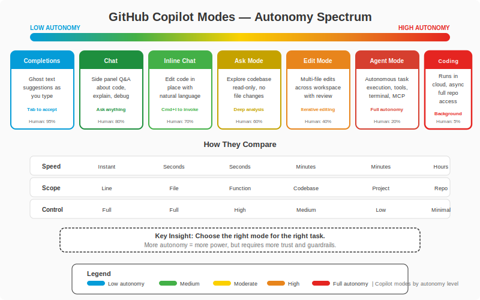

# Fase 5-3 -- O Companion Definitivo: GitHub Copilot Completo

## Change Log

| Versao | Data       | Autor        | Descricao                          |
|--------|------------|--------------|------------------------------------|
| 1.0.0  | 2026-03-18 | Paula Silva  | Criacao inicial do capitulo        |

---

## Sumario

- [Introducao -- O Companion Mais Poderoso do Mushroom Kingdom](#introducao--o-companion-mais-poderoso-do-mushroom-kingdom)
- [Secao 1 -- Visao Geral: Todos os Modos do Copilot](#secao-1--visao-geral-todos-os-modos-do-copilot)
  - [1.1 O Mapa Completo do Companion](#11-o-mapa-completo-do-companion)
  - [1.2 Tabela Mestra: Todos os Modos](#12-tabela-mestra-todos-os-modos)

<div align="center">

<br><em>Espectro de modos do GitHub Copilot por nivel de autonomia</em>
</div>
- [Secao 2 -- Completions: O Companion que Sussurra Dicas](#secao-2--completions-o-companion-que-sussurra-dicas)
  - [2.1 O que sao Completions](#21-o-que-sao-completions)
  - [2.2 Como Completions Funcionam](#22-como-completions-funcionam)
  - [2.3 Analogia Mario: O Sussurro do Companion](#23-analogia-mario-o-sussurro-do-companion)
  - [2.4 Dicas para Melhorar Completions](#24-dicas-para-melhorar-completions)
  - [2.5 Exemplos Praticos de Completions](#25-exemplos-praticos-de-completions)
  - [2.6 Quando Usar Completions](#26-quando-usar-completions)
- [Secao 3 -- Chat: Conversar com o Companion](#secao-3--chat-conversar-com-o-companion)
  - [3.1 O que e o Copilot Chat](#31-o-que-e-o-copilot-chat)
  - [3.2 Como o Chat Funciona](#32-como-o-chat-funciona)
  - [3.3 Analogia Mario: Conversar com Yoshi na Fogueira](#33-analogia-mario-conversar-com-yoshi-na-fogueira)
  - [3.4 Tipos de Perguntas para o Chat](#34-tipos-de-perguntas-para-o-chat)
  - [3.5 Contexto no Chat: Participants e References](#35-contexto-no-chat-participants-e-references)
  - [3.6 Exemplos Praticos de Chat](#36-exemplos-praticos-de-chat)
- [Secao 4 -- Inline Chat: O Companion Aponta para o Codigo](#secao-4--inline-chat-o-companion-aponta-para-o-codigo)
  - [4.1 O que e Inline Chat](#41-o-que-e-inline-chat)
  - [4.2 Como Inline Chat Funciona](#42-como-inline-chat-funciona)
  - [4.3 Analogia Mario: Apontar e Dizer "Melhore Isso"](#43-analogia-mario-apontar-e-dizer-melhore-isso)
  - [4.4 Cenarios Ideais para Inline Chat](#44-cenarios-ideais-para-inline-chat)
  - [4.5 Exemplos Praticos de Inline Chat](#45-exemplos-praticos-de-inline-chat)
- [Secao 5 -- Ask Mode: A Casa de Dicas do Toad](#secao-5--ask-mode-a-casa-de-dicas-do-toad)
  - [5.1 O que e Ask Mode](#51-o-que-e-ask-mode)
  - [5.2 Como Ask Mode Funciona](#52-como-ask-mode-funciona)
  - [5.3 Analogia Mario: Toad's Hint House](#53-analogia-mario-toads-hint-house)
  - [5.4 Quando Usar Ask Mode](#54-quando-usar-ask-mode)
  - [5.5 Exemplos Praticos de Ask Mode](#55-exemplos-praticos-de-ask-mode)
- [Secao 6 -- Plan Mode: O Mapa da Fase](#secao-6--plan-mode-o-mapa-da-fase)
  - [6.1 O que e Plan Mode](#61-o-que-e-plan-mode)
  - [6.2 Como Plan Mode Funciona](#62-como-plan-mode-funciona)
  - [6.3 Analogia Mario: O Mapa Completo da Fase](#63-analogia-mario-o-mapa-completo-da-fase)
  - [6.4 Quando Usar Plan Mode](#64-quando-usar-plan-mode)
  - [6.5 Exemplo Pratico de Plan Mode](#65-exemplo-pratico-de-plan-mode)
- [Secao 7 -- Agent Mode: Yoshi Joga COM Voce](#secao-7--agent-mode-yoshi-joga-com-voce)
  - [7.1 O que e Agent Mode](#71-o-que-e-agent-mode)
  - [7.2 Como Agent Mode Funciona](#72-como-agent-mode-funciona)
  - [7.3 Analogia Mario: Yoshi no Autopilot](#73-analogia-mario-yoshi-no-autopilot)
  - [7.4 O que Agent Mode Pode Fazer](#74-o-que-agent-mode-pode-fazer)
  - [7.5 O Ciclo do Agent Mode](#75-o-ciclo-do-agent-mode)
  - [7.6 Exemplo Pratico de Agent Mode](#76-exemplo-pratico-de-agent-mode)
  - [7.7 Dicas para Usar Agent Mode](#77-dicas-para-usar-agent-mode)
- [Secao 8 -- Coding Agent: Yoshi Vai Solo](#secao-8--coding-agent-yoshi-vai-solo)
  - [8.1 O que e o Coding Agent](#81-o-que-e-o-coding-agent)
  - [8.2 Como o Coding Agent Funciona](#82-como-o-coding-agent-funciona)
  - [8.3 Analogia Mario: Yoshi em Missao Solo](#83-analogia-mario-yoshi-em-missao-solo)
  - [8.4 Quando Usar o Coding Agent](#84-quando-usar-o-coding-agent)
  - [8.5 O Fluxo Completo do Coding Agent](#85-o-fluxo-completo-do-coding-agent)
  - [8.6 Exemplo Pratico do Coding Agent](#86-exemplo-pratico-do-coding-agent)
  - [8.7 Limitacoes e Cuidados](#87-limitacoes-e-cuidados)
- [Secao 9 -- Copilot no GitHub.com](#secao-9--copilot-no-githubcom)
  - [9.1 O que e Copilot no GitHub.com](#91-o-que-e-copilot-no-githubcom)
  - [9.2 Funcionalidades no GitHub.com](#92-funcionalidades-no-githubcom)
  - [9.3 Analogia Mario: O Companion no Mapa do Mundo](#93-analogia-mario-o-companion-no-mapa-do-mundo)
- [Secao 10 -- Copilot in CLI: O Companion no Terminal](#secao-10--copilot-in-cli-o-companion-no-terminal)
  - [10.1 O que e Copilot in CLI](#101-o-que-e-copilot-in-cli)
  - [10.2 Como Usar Copilot in CLI](#102-como-usar-copilot-in-cli)
  - [10.3 Analogia Mario: O Companion no Mapa de Comandos](#103-analogia-mario-o-companion-no-mapa-de-comandos)
  - [10.4 Exemplos Praticos de Copilot in CLI](#104-exemplos-praticos-de-copilot-in-cli)
- [Secao 11 -- Tabela Comparativa Completa: Todos os Modos](#secao-11--tabela-comparativa-completa-todos-os-modos)
- [Secao 12 -- Dicas de Ouro para Usar o Copilot](#secao-12--dicas-de-ouro-para-usar-o-copilot)
  - [12.1 A Regra de Ouro](#121-a-regra-de-ouro)
  - [12.2 Tabela de Dicas](#122-tabela-de-dicas)
  - [12.3 Erros Comuns](#123-erros-comuns)
- [Secao 13 -- A Jornada do Companion: Qual Modo Usar Quando](#secao-13--a-jornada-do-companion-qual-modo-usar-quando)
  - [13.1 Arvore de Decisao](#131-arvore-de-decisao)
  - [13.2 Cenarios do Dia a Dia](#132-cenarios-do-dia-a-dia)
- [O que Aprendemos -- Tabela de Resumo](#o-que-aprendemos--tabela-de-resumo)
- [Referencias](#referencias)

---

## Introducao -- O Companion Mais Poderoso do Mushroom Kingdom

Sofia entrou numa sala especial do castelo -- a **Sala de Treinamento do Companion**. No centro, sobre um pedestal iluminado, flutuava um ovo de Yoshi brilhando com energia. Mas este nao era um Yoshi comum. Ao redor do pedestal, paineis holograficos mostravam OITO modos diferentes de operacao:

- **Sussurro** -- O Yoshi sussurra dicas enquanto voce caminha
- **Conversa** -- Voce para e conversa com o Yoshi cara a cara
- **Aponta** -- O Yoshi aponta para algo especifico e sugere melhorias
- **Consulta** -- Voce vai ate a Casa de Dicas do Toad e pergunta
- **Mapa** -- O Yoshi mostra o mapa completo antes de voce comecar
- **Autopilot** -- O Yoshi joga COM voce, executando acoes complexas
- **Missao Solo** -- O Yoshi vai sozinho completar uma missao
- **Terminal** -- O Yoshi ajuda voce na sala de comandos

"Oito modos?" Sofia ficou impressionada. "Eu achava que o Copilot so fazia autocomplete!"

O Toad instrutor sorriu. "A maioria das pessoas acha isso. E por isso que usam 10% do poder do Copilot. Hoje voce vai aprender TODOS os modos. Quando terminar, voce vai ter um companion que faz MUITO mais do que sussurrar dicas."

---

## Secao 1 -- Visao Geral: Todos os Modos do Copilot

### 1.1 O Mapa Completo do Companion

O GitHub Copilot nao e uma unica ferramenta -- e um ECOSSISTEMA de modos que se complementam. Cada modo tem um proposito, um nivel de autonomia e um contexto ideal de uso.

A progressao de autonomia:

```
MENOS AUTONOMIA ──────────────────────────────── MAIS AUTONOMIA

Completions → Chat → Inline Chat → Ask → Plan → Agent Mode → Coding Agent
 (sussurra)  (conversa) (aponta)  (consulta) (mapa) (joga junto) (vai solo)
```


### 1.2 Tabela Mestra: Todos os Modos

| Modo | O que Faz | Analogia Mario | Autonomia | Onde Roda |
|---|---|---|---|---|
| **Completions** | Sugere linhas de codigo enquanto voce digita | Companion que sussurra dicas | Muito baixa | IDE (VS Code, JetBrains) |
| **Chat** | Voce faz perguntas e ele responde com codigo e explicacoes | Conversar com Yoshi na fogueira | Baixa | IDE (painel lateral) |
| **Inline Chat** | Chat direto no trecho de codigo selecionado | Companion aponta para o bloco e sugere | Baixa-media | IDE (inline no editor) |
| **Ask Mode** | Modo somente-leitura: explica, analisa, responde | Toad's Hint House -- perguntar ao NPC sabio | Baixa | IDE (Chat com toggle) |
| **Plan Mode** | Mostra o plano antes de executar | Mapa completo da fase antes de jogar | Media | IDE (Chat com toggle) |
| **Agent Mode** | Executa tarefas complexas: cria arquivos, instala deps, roda testes | Yoshi no autopilot jogando COM voce | Alta | IDE (Chat com toggle) |
| **Coding Agent** | Resolve issues e abre PRs autonomamente | Yoshi em missao solo -- vai e volta com resultado | Muito alta | GitHub.com (background) |
| **Copilot no GitHub.com** | Assistente no navegador para PRs, issues, code | Companion no mapa do mundo | Variavel | GitHub.com (browser) |
| **Copilot in CLI** | Assistente na linha de comando | Companion na sala de comandos | Baixa-media | Terminal |

---

## Secao 2 -- Completions: O Companion que Sussurra Dicas

### 2.1 O que sao Completions

**Completions** (ou Sugestoes) sao o modo mais basico e mais usado do Copilot. Enquanto voce digita codigo, o Copilot analisa o contexto -- seus arquivos abertos, o nome da funcao, os comentarios, o codigo ao redor -- e sugere linhas ou blocos inteiros de codigo em texto cinza.

Voce aceita com `Tab`, rejeita ignorando, ou veja alternativas com `Alt+]` e `Alt+[`.

### 2.2 Como Completions Funcionam

O Copilot usa varios sinais para gerar completions relevantes:

1. **Contexto do arquivo atual:** O codigo que voce ja escreveu no arquivo
2. **Arquivos abertos:** Outros arquivos abertos no editor servem de referencia
3. **Nome da funcao/variavel:** Nomes descritivos dao pistas ao Copilot
4. **Comentarios:** Comentarios sao a forma mais poderosa de guiar completions
5. **Patterns do projeto:** O Copilot aprende o estilo do seu projeto
6. **Linguagem:** Cada linguagem tem patterns especificos

### 2.3 Analogia Mario: O Sussurro do Companion

> **ANALOGIA MARIO:** Imagine que Yoshi caminha ao lado de Mario e, a cada passo, sussurra dicas no ouvido: "tem uma moeda acima", "pisa naquele Goomba", "pula agora". Mario pode seguir as dicas ou ignora-las. Yoshi nao forca nada -- apenas sugere, em tempo real, baseado no que ele ve ao redor.
>
> Se Mario esta perto de um bloco "?", Yoshi sussurra "pula aqui!". Se Mario esta escrevendo o nome de uma funcao `calcularDesconto`, Yoshi sussurra o corpo inteiro da funcao. Quanto mais claro o contexto (o nome da funcao, os comentarios), melhor sao os sussurros.

### 2.4 Dicas para Melhorar Completions

| Dica | Por Que | Exemplo |
|---|---|---|
| **Escreva comentarios descritivos** | O Copilot usa comentarios como contexto para sugestoes | `// Funcao que calcula o desconto baseado no valor total e tipo de cliente` |
| **De exemplos no codigo** | Mostrar um exemplo ajuda o Copilot a entender o padrao | Escreva o primeiro item de uma lista, o Copilot completa os outros |
| **Use nomes claros para variaveis e funcoes** | Nomes descritivos dao mais contexto | `calcularDescontoCliente()` em vez de `calc()` ou `func1()` |
| **Abra arquivos relevantes** | O Copilot le arquivos abertos como contexto | Abra o model e o controller quando estiver criando a rota |
| **Mantenha o projeto organizado** | Projetos bem estruturados dao melhor contexto | Pastas separadas para components, hooks, services |

### 2.5 Exemplos Praticos de Completions

**Exemplo 1: Comentario guia a completion**
```typescript
// Funcao que valida um endereco de email
// Retorna true se o email e valido, false caso contrario
function validarEmail(email: string): boolean {
  // Copilot sugere:
  const regex = /^[^\s@]+@[^\s@]+\.[^\s@]+$/;
  return regex.test(email);
}
```

**Exemplo 2: Nome da funcao guia a completion**
```typescript
function buscarUsuarioPorId(id: number): Promise<Usuario> {
  // Copilot sugere:
  return prisma.usuario.findUnique({
    where: { id },
  });
}
```

**Exemplo 3: Pattern repetitivo**
```typescript
const rotas = [
  { path: '/usuarios', component: UsuariosPage },
  { path: '/tarefas', component: TarefasPage },
  // Copilot sugere baseado no pattern:
  { path: '/projetos', component: ProjetosPage },
  { path: '/configuracoes', component: ConfiguracoesPage },
];
```

### 2.6 Quando Usar Completions

| Cenario | Completions e Ideal? | Por Que |
|---|---|---|
| Escrevendo codigo do dia a dia | Sim | Acelera digitacao em 2-5x |
| Criando funcoes com logica clara | Sim | Comentario + nome = completion excelente |
| Codigo repetitivo / boilerplate | Sim | Pattern matching e o forte do Copilot |
| Logica de negocio complexa | Parcialmente | Bom para esqueleto, precisa ajustar detalhes |
| Codigo critico de seguranca | Com cuidado | SEMPRE revise sugestoes de seguranca |
| Aprender uma linguagem nova | Sim | Mostra patterns idomiaticos da linguagem |

---

## Secao 3 -- Chat: Conversar com o Companion

### 3.1 O que e o Copilot Chat

O **Copilot Chat** e um painel lateral no VS Code (ou JetBrains) onde voce pode conversar com o Copilot em linguagem natural. Voce faz perguntas, pede explicacoes, solicita codigo, e o Copilot responde com contexto do seu projeto.

### 3.2 Como o Chat Funciona

O Chat tem acesso a:
- Seu projeto inteiro (arquivos, estrutura de pastas)
- Arquivo atualmente aberto
- Codigo selecionado (se houver)
- Terminal e outputs
- Historico da conversa

### 3.3 Analogia Mario: Conversar com Yoshi na Fogueira

> **ANALOGIA MARIO:** Completions sao sussurros rapidos enquanto voce corre pela fase. Chat e quando voce PARA, senta na fogueira com Yoshi, e tem uma conversa completa. "Yoshi, como eu derroto aquele boss?" "Yoshi, explica como funciona essa mecanica de jogo." "Yoshi, me ajuda a planejar a rota para a proxima fase."
>
> Na fogueira, voce pode fazer perguntas longas, ter explicacoes detalhadas, e planejar. Nao e algo para usar enquanto esta correndo -- e para quando precisa PARAR e PENSAR.

### 3.4 Tipos de Perguntas para o Chat

| Tipo de Pergunta | Exemplo | O que Voce Recebe |
|---|---|---|
| **Explicacao** | "Explica o que essa funcao faz" | Descricao em linguagem natural do codigo |
| **Debugging** | "Por que esse loop esta lento?" | Analise do problema + sugestao de solucao |
| **Geracao** | "Cria um hook React para debounce" | Codigo completo + explicacao |
| **Refatoracao** | "Como posso melhorar essa funcao?" | Sugestoes de melhoria com codigo |
| **Testes** | "Gera testes unitarios para essa funcao" | Testes completos com Jest/Vitest |
| **Documentacao** | "Gera documentacao JSDoc para essa funcao" | Documentacao formatada |
| **Arquitetura** | "Qual a melhor forma de estruturar esse modulo?" | Sugestao de arquitetura com exemplos |

### 3.5 Contexto no Chat: Participants e References

O Chat tem um sistema poderoso de contexto:

**Participants (@):**
- `@workspace` -- Referencia todo o workspace/projeto
- `@vscode` -- Perguntas sobre o VS Code
- `@terminal` -- Referencia o conteudo do terminal
- `@github` -- Acessa informacoes do GitHub (issues, PRs, repos)

**References (#):**
- `#file:nome.ts` -- Referencia um arquivo especifico
- `#selection` -- Referencia o codigo selecionado
- `#editor` -- Referencia o arquivo aberto no editor
- `#codebase` -- Busca no codebase inteiro

**Exemplo combinando participants e references:**
```
@workspace Explica a arquitetura do backend,
focando em #file:server.ts e #file:routes/index.ts
```

### 3.6 Exemplos Praticos de Chat

**Exemplo 1: Debugging**
```
Voce: "Esse endpoint esta retornando 500. Aqui esta o log de erro:
[cola o log]. O que pode estar causando?"

Copilot: "Baseado no log, o erro esta na linha 42 de userController.ts.
Voce esta tentando acessar `user.email` mas `user` pode ser null quando
o ID nao existe no banco. Adicione uma verificacao:

if (!user) {
  return res.status(404).json({ error: 'Usuario nao encontrado' });
}
"
```

**Exemplo 2: Aprendizado**
```
Voce: "Explica o que e o pattern Repository em TypeScript
e como eu aplicaria no meu projeto"

Copilot: [Explicacao detalhada + exemplo com codigo do seu projeto]
```

---

## Secao 4 -- Inline Chat: O Companion Aponta para o Codigo

### 4.1 O que e Inline Chat

O **Inline Chat** e o Chat, mas DIRETO no codigo. Voce seleciona um trecho de codigo, pressiona `Ctrl+I` (ou `Cmd+I` no Mac), e uma caixa de dialogo aparece ali mesmo, inline no editor. Voce diz o que quer, e o Copilot modifica o codigo selecionado.

### 4.2 Como Inline Chat Funciona

1. Selecione um trecho de codigo
2. Pressione `Ctrl+I` / `Cmd+I`
3. Digite o que quer (ex: "refatora para usar async/await")
4. Copilot mostra o diff -- o que vai mudar
5. Voce aceita, rejeita ou pede ajuste

### 4.3 Analogia Mario: Apontar e Dizer "Melhore Isso"

> **ANALOGIA MARIO:** Inline Chat e quando Mario aponta para um bloco especifico na fase e diz ao companion: "Yoshi, olha ESSE bloco. Melhora ele." Nao e uma conversa geral sobre a fase inteira -- e sobre AQUELE bloco especifico. Yoshi olha, analisa, e sugere uma melhoria pontual.
>
> "Yoshi, esse muro esta fraco. Reforce." Yoshi ve o muro, entende o contexto ao redor (quais outros muros existem, qual o estilo do castelo), e reforca AQUELE muro mantendo a consistencia com o resto.

### 4.4 Cenarios Ideais para Inline Chat

| Cenario | Comando | Resultado |
|---|---|---|
| **Refatorar funcao** | "Refatora para usar early returns" | Codigo refatorado com early returns |
| **Adicionar tipos** | "Adiciona tipagem TypeScript" | Tipos adicionados a funcao/variavel |
| **Melhorar performance** | "Otimiza esse loop" | Loop otimizado com explicacao |
| **Traduzir** | "Converte de JavaScript para TypeScript" | Codigo convertido com tipos |
| **Simplificar** | "Simplifica essa logica" | Codigo mais limpo e legivel |
| **Documentar** | "Adiciona JSDoc" | Documentacao adicionada inline |

### 4.5 Exemplos Praticos de Inline Chat

**Exemplo: Selecione uma funcao e peca refatoracao**

Antes:
```typescript
function processarPedido(pedido) {
  if (pedido !== null) {
    if (pedido.itens.length > 0) {
      if (pedido.status === 'pendente') {
        // processar
        return calcularTotal(pedido);
      }
    }
  }
  return null;
}
```

Comando Inline Chat: "Refatora usando early returns e adiciona tipos TypeScript"

Depois:
```typescript
function processarPedido(pedido: Pedido | null): number | null {
  if (!pedido) return null;
  if (pedido.itens.length === 0) return null;
  if (pedido.status !== 'pendente') return null;

  return calcularTotal(pedido);
}
```

---

## Secao 5 -- Ask Mode: A Casa de Dicas do Toad

### 5.1 O que e Ask Mode

O **Ask Mode** e um modo especial do Chat onde o Copilot SOMENTE responde perguntas -- ele nao modifica arquivos, nao cria nada, nao executa nada. E um modo puramente informativo e seguro.

### 5.2 Como Ask Mode Funciona

No painel de Chat do VS Code, voce pode alternar entre modos usando o seletor no topo:
- **Ask** -- Somente responde (nao modifica nada)
- **Edit** -- Pode editar arquivos
- **Agent** -- Pode executar acoes complexas

### 5.3 Analogia Mario: Toad's Hint House

> **ANALOGIA MARIO:** Ask Mode e como visitar a **Toad's Hint House** -- aquela casinha no mapa onde um Toad sabio responde suas perguntas. Voce entra, pergunta "como eu derroto o Boss do World 3?", e o Toad explica em detalhes. Mas o Toad NAO sai da casa e vai derrotar o boss por voce. Ele so DA INFORMACAO.
>
> Isso e perfeito para quando voce quer APRENDER ou ENTENDER algo sem risco de o Copilot modificar seus arquivos acidentalmente. E o modo mais seguro -- zero risco de efeitos colaterais.

### 5.4 Quando Usar Ask Mode

| Cenario | Por que Ask Mode |
|---|---|
| Entender codigo desconhecido | Explica sem risco de modificar |
| Aprender um conceito | Informacao pura, sem acao |
| Avaliar opcoes de arquitetura | Compara alternativas sem implementar |
| Investigar um bug | Analisa sem "tentar consertar" precipitadamente |
| Preparar-se para uma tarefa | Entende o escopo antes de comecar a codar |
| Code review mental | Peca analise de um trecho antes de submeter |

### 5.5 Exemplos Praticos de Ask Mode

```
[Ask Mode]

Voce: "Explica o padrao de arquitetura desse projeto.
Quais sao os principais modulos e como se conectam?"

Copilot: "Seu projeto segue uma arquitetura em camadas:
1. Frontend (React) em /frontend -- componentes, hooks, services
2. Backend (Express) em /backend -- controllers, services, models
3. Banco de Dados (PostgreSQL) via Prisma em /prisma
A comunicacao entre frontend e backend acontece via REST API...
[explicacao detalhada SEM modificar nenhum arquivo]"

Voce: "Quais sao os riscos de seguranca que voce ve nesse codigo?"

Copilot: "Identifiquei 3 potenciais riscos:
1. O endpoint /api/users nao valida o JWT token...
2. A query SQL em userService.ts usa concatenacao de string...
3. O CORS esta configurado como '*' em producao...
[explicacao detalhada de cada risco + como corrigir, mas SEM modificar]"
```

---

## Secao 6 -- Plan Mode: O Mapa da Fase

### 6.1 O que e Plan Mode

O **Plan Mode** e quando o Copilot analisa sua solicitacao e mostra um PLANO detalhado de tudo que vai fazer ANTES de executar qualquer acao. Voce ve o mapa completo, avalia se faz sentido, e so entao autoriza a execucao.

### 6.2 Como Plan Mode Funciona

1. Voce descreve o que quer no Chat (em modo Agent ou Edit)
2. O Copilot gera um plano: quais arquivos serao modificados, o que sera criado, o que sera removido
3. Voce revisa o plano
4. Se concordar, autoriza a execucao
5. Se nao concordar, ajusta o pedido e o Copilot gera novo plano

### 6.3 Analogia Mario: O Mapa Completo da Fase

> **ANALOGIA MARIO:** Plan Mode e como quando Yoshi MOSTRA O MAPA da fase antes de voce comecar a jogar. "Olha, Mario: aqui tem 3 Goombas, ali tem um abismo, la no final tem um pipe secreto que leva ao boss. Eu sugiro essa rota [mostra a rota no mapa]. Quer seguir esse plano ou prefere outro caminho?"
>
> Voce VE tudo antes de se comprometer. Se o plano parece arriscado ("Yoshi, nao quero passar por aquele abismo"), voce ajusta antes de comecar. E como ter visao de raio-X da fase antes de pisar nela.

### 6.4 Quando Usar Plan Mode

| Cenario | Por que Plan Mode |
|---|---|
| Tarefas grandes (nova feature) | Garante que o Copilot entendeu o escopo |
| Refatoracao ampla | Ve todos os arquivos que serao afetados |
| Mudanca de arquitetura | Avalia o impacto antes de executar |
| Primeira vez usando Agent Mode | Entende o que vai acontecer antes de autorizar |
| Tarefa ambigua | Valida a interpretacao do Copilot |

### 6.5 Exemplo Pratico de Plan Mode

```
Voce: "Adiciona um sistema de notificacoes em tempo real
usando WebSocket no TodoApp"

Copilot [Plan Mode]:

PLANO DE EXECUCAO:

1. Criar /backend/src/websocket/server.ts
   - Configurar servidor WebSocket com socket.io
   - Definir eventos: 'task:created', 'task:updated', 'task:deleted'

2. Modificar /backend/src/server.ts
   - Integrar WebSocket server com Express
   - Adicionar middleware de autenticacao para WebSocket

3. Criar /frontend/src/hooks/useNotifications.ts
   - Hook customizado para conexao WebSocket
   - Gerenciamento de estado de notificacoes

4. Criar /frontend/src/components/NotificationBell.tsx
   - Componente de UI para exibir notificacoes
   - Badge com contagem de notificacoes nao lidas

5. Modificar /frontend/src/components/TaskList.tsx
   - Integrar hook de notificacoes
   - Atualizar lista em tempo real quando receber evento

6. Criar testes:
   - /backend/src/__tests__/websocket.test.ts
   - /frontend/src/__tests__/useNotifications.test.ts

7. Instalar dependencias:
   - socket.io (backend)
   - socket.io-client (frontend)

Arquivos novos: 4
Arquivos modificados: 2
Dependencias: 2

Deseja prosseguir com este plano?
```

---

## Secao 7 -- Agent Mode: Yoshi Joga COM Voce

### 7.1 O que e Agent Mode

O **Agent Mode** e o modo mais poderoso dentro do IDE. Quando ativado, o Copilot deixa de ser um assistente passivo e se torna um **agente ativo** que pode:

- Criar e modificar arquivos
- Rodar comandos no terminal
- Instalar dependencias
- Executar testes
- Analisar erros e tentar corrigi-los
- Fazer multiplas acoes em sequencia

### 7.2 Como Agent Mode Funciona

No Chat do VS Code, selecione "Agent" no seletor de modo. Depois, descreva a tarefa:

```
"Cria um componente React de formulario de login com validacao,
testes unitarios, e integra com a API de autenticacao existente"
```

O Copilot em Agent Mode:
1. Planeja a tarefa (pode mostrar o plano primeiro)
2. Cria os arquivos necessarios
3. Escreve o codigo
4. Roda os testes para verificar
5. Se testes falham, analisa o erro e tenta corrigir
6. Repete ate tudo funcionar (ou pede ajuda)

### 7.3 Analogia Mario: Yoshi no Autopilot

> **ANALOGIA MARIO:** Agent Mode e quando Yoshi entra no modo **autopilot** e comeca a jogar COM voce ativamente. Voce diz "Yoshi, preciso passar por essa fase", e Yoshi comeca: come inimigos, coleta moedas, abre blocos secretos, e faz tudo que precisa para completar a fase. Voce esta ali assistindo e direcionando -- "nao, vai pela direita", "pega aquele mushroom" -- mas Yoshi faz o trabalho pesado.
>
> A diferenca crucial: Yoshi joga DENTRO da sua fase, COM voce presente. Voce ve tudo que ele faz em tempo real. Se ele faz algo errado, voce pode parar e corrigir imediatamente. E colaboracao ativa, nao delegacao cega.

### 7.4 O que Agent Mode Pode Fazer

| Capacidade | Exemplo | Analogia Mario |
|---|---|---|
| **Criar arquivos** | Cria componentes, services, testes | Yoshi constroi novos blocos na fase |
| **Modificar arquivos** | Refatora, adiciona features, corrige bugs | Yoshi reposiciona blocos existentes |
| **Rodar terminal** | `npm install`, `npm test`, `git status` | Yoshi usa ferramentas especiais |
| **Analisar erros** | Le mensagens de erro e diagnostica | Yoshi investiga por que o bloco quebrou |
| **Iterar** | Se test falha, tenta corrigir e rodar de novo | Yoshi tenta de novo com abordagem diferente |
| **Usar MCP** | Acessa ferramentas externas via Warp Zones | Yoshi viaja a outros mundos buscar recursos |

### 7.5 O Ciclo do Agent Mode

```
┌─────────────┐
│  HUMANO     │  "Cria um sistema de notificacoes"
│  da a ordem │
└──────┬──────┘
       │
       v
┌─────────────┐
│  PLANEJA    │  Analisa o codebase, define o plano
│             │
└──────┬──────┘
       │
       v
┌─────────────┐
│  EXECUTA    │  Cria arquivos, escreve codigo, instala deps
│             │
└──────┬──────┘
       │
       v
┌─────────────┐
│  VERIFICA   │  Roda testes, verifica erros de compilacao
│             │◄──── Se falhar, volta para EXECUTA
└──────┬──────┘
       │ (se passar)
       v
┌─────────────┐
│  APRESENTA  │  Mostra o resultado ao humano
│             │
└──────┬──────┘
       │
       v
┌─────────────┐
│  HUMANO     │  Revisa, ajusta, aprova
│  revisa     │
└─────────────┘
```

### 7.6 Exemplo Pratico de Agent Mode

```
Voce: "Adiciona paginacao na lista de tarefas. 10 itens por pagina.
Inclui botoes de navegacao e mostra o total de paginas."

[Agent Mode em acao:]

> Analisando codebase...
> Encontrei TaskList.tsx e taskService.ts

> Modificando backend:
  - Adicionando parametros skip/take no endpoint GET /api/tasks
  - Retornando total de registros no response

> Modificando frontend:
  - Criando hook usePagination em /frontend/src/hooks/usePagination.ts
  - Criando componente Pagination em /frontend/src/components/Pagination.tsx
  - Modificando TaskList.tsx para usar paginacao

> Rodando testes...
> 2 testes falharam:
  - TaskList.test.tsx: componente espera prop 'tasks' mas agora recebe 'paginatedTasks'
  - taskService.test.ts: endpoint mudou de assinatura

> Corrigindo testes...
> Rodando testes novamente...
> Todos os 14 testes passaram!

Resumo:
- 2 arquivos criados (usePagination.ts, Pagination.tsx)
- 3 arquivos modificados (tasks endpoint, TaskList, testes)
- 14 testes passando
```

### 7.7 Dicas para Usar Agent Mode

| Dica | Por Que | Exemplo |
|---|---|---|
| **Seja especifico** | Agent Mode executa LITERALMENTE o que voce pede | "10 itens por pagina, botoes Anterior/Proximo, mostrar 'Pagina X de Y'" |
| **Peca um passo de cada vez** | Tarefas menores = resultado melhor | "Primeiro, adiciona paginacao no backend" → depois "agora adiciona no frontend" |
| **Revise o resultado** | Agent Mode nao e perfeito | Leia cada arquivo criado/modificado |
| **Use com #codebase** | Da mais contexto ao agente | "Olhando #codebase, adiciona paginacao seguindo o mesmo estilo" |
| **Combine com Plan Mode** | Veja o plano antes de executar | Comece em Plan, revise, depois mude para Agent |

---

## Secao 8 -- Coding Agent: Yoshi Vai Solo

### 8.1 O que e o Coding Agent

O **Coding Agent** (tambem chamado **Copilot Workspace** ou **GitHub Copilot Coding Agent**) e um agente que roda NO GITHUB, nao no seu IDE. Voce atribui uma issue a ele, e ele:

1. Le a issue
2. Le o codebase
3. Planeja a solucao
4. Cria uma branch
5. Escreve o codigo
6. Escreve testes
7. Abre um PR completo
8. Descreve o que fez e por que

Tudo isso **autonomamente**, sem voce estar presente.

### 8.2 Como o Coding Agent Funciona

```
PASSO 1: Voce cria uma Issue no GitHub
  "Adicionar campo de busca na lista de tarefas com debounce de 300ms"

PASSO 2: Voce atribui ao Coding Agent
  Assign → Copilot (ou usa o comando /assign-copilot)

PASSO 3: O Coding Agent trabalha (voce pode ir tomar cafe)
  - Le a issue e o codebase
  - Planeja a implementacao
  - Cria branch: copilot/add-search-field
  - Escreve SearchBar.tsx, useSearch.ts, testes
  - Roda CI/CD automaticamente

PASSO 4: Coding Agent abre um PR
  - Titulo: "Add search field with debounce to task list"
  - Descricao: explicacao detalhada do que fez
  - Arquivos: lista de arquivos criados/modificados
  - Testes: status dos testes

PASSO 5: Voce revisa o PR
  - Le o codigo
  - Sugere ajustes (comentarios no PR)
  - Coding Agent pode responder e fazer ajustes
  - Voce aprova e faz merge
```

### 8.3 Analogia Mario: Yoshi em Missao Solo

> **ANALOGIA MARIO:** O Coding Agent e quando Yoshi vai em uma **missao solo**. Mario olha o Quest Board (Issues do GitHub), ve uma missao ("Derrotar o Koopa na fase 3-2 e coletar a estrela escondida"), e diz: "Yoshi, essa missao e sua. Vai la e volta quando terminar."
>
> Yoshi sai sozinho. Ele conhece o territorio (leu o codebase), sabe lutar (tem skills de desenvolvimento), e tem um objetivo claro (a issue). Ele vai, completa a missao, e volta com o resultado: "Chefe, aqui esta a estrela. Derrotei o Koopa usando fire flower. Aqui esta o relatorio da missao (PR description)."
>
> Mario (voce) revisa o relatorio. "Hmm, Yoshi, voce deveria ter pego as moedas tambem." Yoshi ajusta e entrega de novo. So quando Mario aprova, a missao e considerada completa.

### 8.4 Quando Usar o Coding Agent

| Cenario | Ideal para Coding Agent? | Por Que |
|---|---|---|
| Bug bem definido com steps to reproduce | Sim | Issue clara = resultado previsivel |
| Feature pequena e bem especificada | Sim | Escopo limitado = menos risco |
| Refatoracao mecanica (renomear, mover) | Sim | Tarefas repetitivas sao perfeitas |
| Adicionar testes para codigo existente | Sim | Codigo ja existe, so precisa de testes |
| Feature complexa com muita ambiguidade | Nao | Coding Agent nao lida bem com ambiguidade |
| Mudanca de arquitetura | Nao | Requer decisoes humanas de alto nivel |
| Codigo critico de seguranca | Com supervisao | Sempre revise cuidadosamente |

### 8.5 O Fluxo Completo do Coding Agent

```
┌──────────────────────────────────────────────────────────────┐
│                    FLUXO DO CODING AGENT                     │
│                                                              │
│  [Issue]                                                     │
│     │                                                        │
│     ▼                                                        │
│  [Coding Agent le issue + codebase]                          │
│     │                                                        │
│     ▼                                                        │
│  [Planeja: quais arquivos criar/modificar]                   │
│     │                                                        │
│     ▼                                                        │
│  [Cria branch + implementa + testes]                         │
│     │                                                        │
│     ▼                                                        │
│  [CI/CD roda automaticamente]                                │
│     │                                                        │
│     ├── CI passa ──> [Abre PR]                               │
│     │                    │                                    │
│     │                    ▼                                    │
│     │                [Dev revisa]                             │
│     │                    │                                    │
│     │                    ├── Aprova ──> [Merge]               │
│     │                    │                                    │
│     │                    └── Pede ajuste ──> [Agent ajusta]   │
│     │                                            │            │
│     │                                            └──> [PR]   │
│     │                                                        │
│     └── CI falha ──> [Agent tenta corrigir]                  │
│                          │                                    │
│                          └──> [Roda CI de novo]               │
│                                                              │
└──────────────────────────────────────────────────────────────┘
```

### 8.6 Exemplo Pratico do Coding Agent

```markdown
## Issue #42: Adicionar dark mode ao TodoApp

### Descricao
Implementar toggle de dark mode na aplicacao.
Deve usar CSS variables para cores.
Deve persistir a preferencia no localStorage.
Deve respeitar a preferencia do sistema operacional como default.

### Criterios de aceite
- [ ] Toggle no header
- [ ] Cores via CSS variables
- [ ] Persistencia no localStorage
- [ ] Respeitar prefers-color-scheme
- [ ] Transicao suave (200ms)
- [ ] Testes cobrindo toggle e persistencia
```

Resultado do Coding Agent (PR):

```
PR #87: Implement dark mode with system preference support

## O que foi feito
- Criado hook useTheme com toggle, persistencia e system preference
- Criado componente ThemeToggle no header
- Criado /frontend/src/styles/themes.css com CSS variables
- Modificado App.tsx para usar ThemeProvider
- Adicionados 8 testes unitarios cobrindo todos os cenarios

## Arquivos criados
- frontend/src/hooks/useTheme.ts
- frontend/src/components/ThemeToggle.tsx
- frontend/src/styles/themes.css
- frontend/src/__tests__/useTheme.test.ts

## Arquivos modificados
- frontend/src/App.tsx
- frontend/src/components/Header.tsx

## Testes: 8/8 passando
## CI: Todos os checks passando
```

### 8.7 Limitacoes e Cuidados

| Limitacao | Impacto | Como Mitigar |
|---|---|---|
| **Nao entende contexto de negocio** | Pode implementar algo tecnicamente correto mas errado para o negocio | Escreva issues detalhadas com contexto de negocio |
| **Pode gerar codigo nao idiomatico** | Codigo funciona mas nao segue padroes do projeto | Use .agent.md e instructions para definir padroes |
| **Nao faz deploy** | So cria o PR, nao faz deploy | Configure CI/CD para deploy automatico apos merge |
| **Pode ficar "preso"** | Se o problema e muito complexo, pode travar em loop | Defina timeout e monitore o progresso |
| **Seguranca** | Codigo gerado precisa ser revisado para seguranca | SEMPRE revise PRs do Coding Agent, especialmente seguranca |

> **REGRA DE OURO DO COPILOT:** O Copilot e um acelerador, nao um substituto. Ele te faz ir 10x mais rapido, mas VOCE precisa saber dirigir. Um companion de IA seguindo um jogador nivel 1 que nao sabe nada ainda vai gerar caos. Aprenda os fundamentos!

---

## Secao 9 -- Copilot no GitHub.com

### 9.1 O que e Copilot no GitHub.com

O Copilot tambem funciona diretamente no navegador, no GitHub.com. Sem precisar de IDE, voce pode usar o Copilot para:

- Resumir PRs longos
- Explicar trechos de codigo
- Sugerir descricoes de issues
- Resumir discussions
- Navegar pelo codebase com perguntas em linguagem natural

### 9.2 Funcionalidades no GitHub.com

| Funcionalidade | O que Faz | Onde |
|---|---|---|
| **PR Summaries** | Gera resumo automatico do PR | Na pagina do PR |
| **Code Explanation** | Explica trechos de codigo | Na view de arquivos |
| **Issue Suggestions** | Sugere labels, assignees | Na pagina de issues |
| **Copilot Chat** | Chat com contexto do repositorio | Icone do Copilot no GitHub.com |
| **Search** | Busca semantica no codebase | Barra de busca |
| **Review Assistance** | Ajuda a revisar PRs | Na tab de review |

### 9.3 Analogia Mario: O Companion no Mapa do Mundo

> **ANALOGIA MARIO:** Copilot no GitHub.com e como ter Yoshi no MAPA DO MUNDO, nao dentro da fase. Voce esta olhando o mapa geral (GitHub.com), vendo quais fases existem (repos), quais missoes estao pendentes (issues), e quais relatorios chegaram (PRs). Yoshi esta ali no mapa para resumir coisas, explicar e ajudar a navegar. Mas ele nao esta DENTRO de nenhuma fase -- ele esta na visao geral.

---

## Secao 10 -- Copilot in CLI: O Companion no Terminal

### 10.1 O que e Copilot in CLI

O **Copilot in CLI** (Command Line Interface) e o Copilot no terminal. Voce usa comandos como `gh copilot suggest` e `gh copilot explain` para obter ajuda diretamente na linha de comando.

### 10.2 Como Usar Copilot in CLI

```bash
# Pedir sugestao de comando
gh copilot suggest "como eu encontro todos os arquivos .ts modificados nos ultimos 7 dias"

# Copilot sugere:
# find . -name "*.ts" -mtime -7

# Pedir explicacao de um comando
gh copilot explain "git rebase -i HEAD~3"

# Copilot explica:
# Este comando abre um rebase interativo dos ultimos 3 commits.
# Voce pode reordenar, squash, editar ou remover commits...
```

### 10.3 Analogia Mario: O Companion no Mapa de Comandos

> **ANALOGIA MARIO:** Copilot in CLI e como ter Yoshi na **sala de comandos** do castelo. Voce esta no console de controle (terminal), cheio de alavancas e botoes (comandos), e nao sabe qual apertar. Yoshi esta ali do lado: "Quer encontrar todos os Goombas na fase 3? Aperte ESSA alavanca (find . -name '*.ts')." Ou voce aponta para uma alavanca desconhecida e pergunta: "O que essa faz?" E Yoshi explica.

### 10.4 Exemplos Praticos de Copilot in CLI

```bash
# Cenario 1: Nao lembra como criar um container Docker
gh copilot suggest "criar container Docker a partir do Dockerfile na pasta atual"
# → docker build -t meu-app . && docker run -p 3000:3000 meu-app

# Cenario 2: Comando Git complexo
gh copilot suggest "ver quais branches foram mergeadas na main nos ultimos 30 dias"
# → git log --merges --since="30 days ago" main --oneline

# Cenario 3: Explicar um comando misterioso
gh copilot explain "awk '{print $2}' /etc/passwd | sort | uniq -c | sort -rn"
# → Este comando:
# 1. Extrai o segundo campo de /etc/passwd
# 2. Ordena alfabeticamente
# 3. Conta ocorrencias unicas
# 4. Ordena por contagem (maior primeiro)
```

---

## Secao 11 -- Tabela Comparativa Completa: Todos os Modos

| Aspecto | Completions | Chat | Inline Chat | Ask Mode | Plan Mode | Agent Mode | Coding Agent | GitHub.com | CLI |
|---|---|---|---|---|---|---|---|---|---|
| **Analogia Mario** | Sussurro | Fogueira | Apontar | Hint House | Mapa | Yoshi autopilot | Yoshi solo | Mapa mundo | Sala comandos |
| **Autonomia** | Muito baixa | Baixa | Baixa-media | Baixa | Media | Alta | Muito alta | Variavel | Baixa-media |
| **Modifica arquivos** | Nao | Sim* | Sim | Nao | Nao (mostra plano) | Sim | Sim | Nao | Nao |
| **Roda terminal** | Nao | Nao | Nao | Nao | Nao | Sim | Sim | Nao | Sugere |
| **Precisa de IDE** | Sim | Sim | Sim | Sim | Sim | Sim | Nao | Nao | Nao |
| **Roda em background** | Nao | Nao | Nao | Nao | Nao | Nao | Sim | Nao | Nao |
| **Velocidade** | Instantaneo | Segundos | Segundos | Segundos | Segundos | Minutos | Minutos-horas | Segundos | Segundos |
| **Risco** | Zero | Baixo | Baixo | Zero | Zero | Medio | Medio | Zero | Baixo |
| **Melhor para** | Dia a dia | Duvidas | Refatorar | Aprender | Planejar | Features | Issues | Navegar | Terminal |

---

## Secao 12 -- Dicas de Ouro para Usar o Copilot

### 12.1 A Regra de Ouro

> **REGRA DE OURO:** O Copilot e um acelerador, nao um substituto. Ele te faz ir 10x mais rapido, mas VOCE precisa saber dirigir. Um companion de IA seguindo um jogador nivel 1 que nao sabe nada ainda vai gerar caos. Aprenda os fundamentos!

### 12.2 Tabela de Dicas

| Dica | Por Que | Exemplo |
|---|---|---|
| **Escreva comentarios descritivos** | O Copilot usa comentarios como contexto | `// Funcao que calcula desconto baseado no valor total e tipo de cliente` |
| **De exemplos no codigo** | Mostrar um exemplo ajuda a entender o padrao | Escreva o primeiro item de uma lista, Copilot completa os outros |
| **Use nomes claros** | Nomes descritivos dao mais contexto | `calcularDescontoCliente()` em vez de `calc()` |
| **Abra arquivos relevantes** | Copilot le arquivos abertos como contexto | Abra o model e o controller quando estiver criando a rota |
| **Use o Chat para perguntar** | Em vez de googlar, pergunte ao Copilot | "Por que esse loop esta lento? Como posso otimizar?" |
| **Revise SEMPRE** | O Copilot nao e perfeito -- pode gerar codigo incorreto ou inseguro | Leia e entenda cada sugestao antes de aceitar |
| **Comece pequeno** | Pecas menores = resultado melhor | "Cria o hook de paginacao" → depois "agora o componente" |
| **Use #references** | Da contexto especifico ao Copilot | `#file:userService.ts como adicionar cache nesse service?` |

### 12.3 Erros Comuns

| Erro | Consequencia | Como Evitar |
|---|---|---|
| **Aceitar tudo sem ler** | Codigo com bugs ou inseguro | SEMPRE leia antes de aceitar |
| **Prompts vagos** | Resultado generico e inutil | Seja especifico: diga exatamente o que quer |
| **Ignorar contexto** | Copilot gera codigo desconectado do projeto | Abra arquivos relevantes, use #references |
| **Nao usar Ask Mode** | Modifica arquivos quando so queria informacao | Use Ask Mode para perguntas sem risco |
| **Pedir tarefas enormes** | Agent Mode se confunde em tarefas gigantes | Divida em subtarefas menores |
| **Nao verificar seguranca** | Codigo gerado pode ter vulnerabilidades | Sempre rode SAST/DAST no codigo gerado |

---

## Secao 13 -- A Jornada do Companion: Qual Modo Usar Quando

### 13.1 Arvore de Decisao

```
Voce precisa de ajuda com codigo?
│
├── So quer ENTENDER algo?
│   └── Use ASK MODE (Hint House)
│
├── Quer PLANEJAR antes de executar?
│   └── Use PLAN MODE (Mapa da Fase)
│
├── Esta DIGITANDO codigo?
│   └── Deixe COMPLETIONS ativo (Sussurros)
│
├── Quer MELHORAR um trecho especifico?
│   └── Use INLINE CHAT (Apontar + Melhorar)
│
├── Tem uma DUVIDA geral?
│   └── Use CHAT (Fogueira)
│
├── Precisa de uma TAREFA COMPLEXA no IDE?
│   └── Use AGENT MODE (Yoshi Autopilot)
│
├── Tem uma ISSUE para resolver sem pressa?
│   └── Use CODING AGENT (Yoshi Solo)
│
├── Esta no TERMINAL e precisa de ajuda?
│   └── Use COPILOT CLI (Sala de Comandos)
│
└── Esta no GITHUB.COM navegando?
    └── Use COPILOT no GitHub.com (Mapa do Mundo)
```

### 13.2 Cenarios do Dia a Dia

| Cenario | Modo Recomendado | Por Que |
|---|---|---|
| Escrevendo codigo novo | Completions + Chat | Sussurros para acelerar + fogueira para duvidas |
| Revisando PR de colega | Ask Mode | Entender codigo sem risco de modificar |
| Criando feature completa | Plan Mode → Agent Mode | Planeja primeiro, executa depois |
| Corrigindo bug urgente | Agent Mode | Deixa o agente investigar e propor fix |
| Issue de baixa prioridade | Coding Agent | Delega e revisa quando tiver tempo |
| Aprendendo linguagem nova | Ask Mode + Completions | Perguntas + sugestoes idiomaticas |
| Refatorando funcao | Inline Chat | Seleciona, pede refatoracao, aceita |
| Escrevendo testes | Agent Mode | "Gera testes para todos os services do backend" |
| Nao lembra comando git | Copilot CLI | `gh copilot suggest "desfazer ultimo commit"` |

---

## O que Aprendemos -- Tabela de Resumo

| Modo | O que Faz | Analogia Mario | Quando Usar |
|---|---|---|---|
| **Completions** | Sugere codigo enquanto digita | Companion sussurra dicas | Programacao do dia a dia |
| **Chat** | Conversa com explicacoes e codigo | Yoshi na fogueira | Duvidas, brainstorming |
| **Inline Chat** | Melhora trecho selecionado | Aponta para bloco e melhora | Refatorar codigo especifico |
| **Ask Mode** | Responde SEM modificar nada | Toad's Hint House | Entender, aprender, investigar |
| **Plan Mode** | Mostra plano antes de executar | Mapa completo da fase | Planejar features grandes |
| **Agent Mode** | Executa tarefas complexas no IDE | Yoshi joga COM voce | Criar features, corrigir bugs |
| **Coding Agent** | Resolve issues e abre PRs solo | Yoshi em missao solo | Issues bem definidas |
| **GitHub.com** | Assistente no navegador | Companion no mapa do mundo | Navegar, revisar, resumir |
| **CLI** | Assistente no terminal | Companion na sala de comandos | Comandos do terminal |

---

## Referencias

| Recurso | Tipo | Link |
|---|---|---|
| GitHub Copilot Documentacao Oficial | Documentacao | https://docs.github.com/copilot |
| Copilot Chat no VS Code | Tutorial | https://code.visualstudio.com/docs/copilot/copilot-chat |
| GitHub Copilot CLI | Documentacao | https://github.com/github/copilot-cli |
| Copilot Adventures | Labs praticos | https://github.com/microsoft/CopilotAdventures |
| GitHub Skills | Plataforma | https://learn.github.com |
| Copilot for Business | Documentacao | https://docs.github.com/copilot/copilot-business |
| VS Code Copilot Agent Mode | Docs | https://code.visualstudio.com/docs/copilot/chat/chat-agent-mode |
| GitHub Blog -- Copilot Updates | Blog | https://github.blog/ai-and-ml/github-copilot/ |
| Awesome Copilot | Curadoria | https://github.com/github/awesome-copilot |

---

*Fase 5-3 concluida! Voce agora conhece TODOS os modos do Copilot -- do sussurro ao exercito autonomo. Lembre-se: o Copilot e seu companion, nao seu substituto. Quanto melhor voce se comunicar com ele, melhores resultados tera. Na proxima fase, vamos entender o que e um Agente de IA em profundidade!*

---

<div align="center">

⬅️ [Anterior: Fase 5-2: AI Maturity](5-2-ai-maturity.md) · 🗺️ [Mapa dos Mundos](../INDEX.md) · ➡️ [Proximo: Fase 5-4: What is an Agent](5-4-what-is-an-agent.md)

</div>
