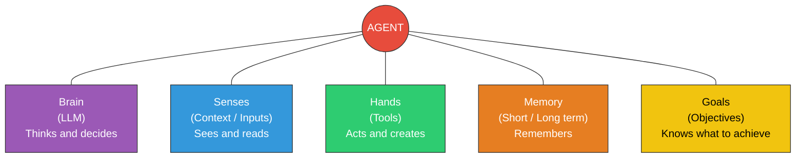
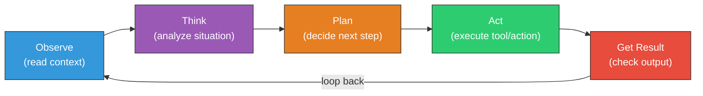

## Change Log

| Version | Date | Author | Changes |
|---------|------|--------|---------|
| 1.0.0 | 2026-03-18 | Paula Silva | Versao inicial — Edicao Super Mario Bros |

# Fase 5-4 -- NPCs que Ganharam Vida: O Que E um Agente de IA

---

**Preparado para:** Sofia
**Versao:** 1.0 (Edicao Mushroom Kingdom)
**Autora:** Paula Silva | Microsoft Latam Software GBB
**Data:** Marco 2026
**Idioma:** Portugues do Brasil (pt-BR)
**Colecao:** Agentic DevOps -- Guia Completo de Desenvolvimento de Software

---

## SUMARIO

- [Introducao -- O NPC que Aprendeu a Pensar](#introducao--o-npc-que-aprendeu-a-pensar)
- [Secao 1 -- O que e um Agente de IA, Afinal?](#secao-1--o-que-e-um-agente-de-ia-afinal)
  - [Definicao Fundamental](#definicao-fundamental)
  - [Os 5 Componentes de um Agente](#os-5-componentes-de-um-agente)
  - [Tabela: Componentes do Agente vs Anatomia do Personagem Mario](#tabela-componentes-do-agente-vs-anatomia-do-personagem-mario)
- [Secao 2 -- O Ciclo Sense-Think-Act: Como um Agente Funciona](#secao-2--o-ciclo-sense-think-act-como-um-agente-funciona)
  - [O Loop Fundamental](#o-loop-fundamental)
  - [Exemplo Pratico: O Agente Resolvendo um Bug](#exemplo-pratico-o-agente-resolvendo-um-bug)
  - [O Loop Completo em Detalhe](#o-loop-completo-em-detalhe)
- [Secao 3 -- Chatbot vs Agente: A Grande Diferenca](#secao-3--chatbot-vs-agente-a-grande-diferenca)
  - [O NPC Comum vs O NPC que Ganhou Vida](#o-npc-comum-vs-o-npc-que-ganhou-vida)
  - [Tabela Comparativa: Chatbot vs Agente vs Agente Autonomo](#tabela-comparativa-chatbot-vs-agente-vs-agente-autonomo)
  - [Os 3 Niveis de Evolucao](#os-3-niveis-de-evolucao)
- [Secao 4 -- Os 5 Orgaos de um Agente em Detalhe](#secao-4--os-5-orgaos-de-um-agente-em-detalhe)
  - [1. O Cerebro (LLM)](#1-o-cerebro-llm)
  - [2. Os Sentidos (Inputs e Contexto)](#2-os-sentidos-inputs-e-contexto)
  - [3. As Maos (Ferramentas / Tools)](#3-as-maos-ferramentas--tools)
  - [4. A Memoria (Curto e Longo Prazo)](#4-a-memoria-curto-e-longo-prazo)
  - [5. Os Objetivos (Goals)](#5-os-objetivos-goals)
  - [Tabela Completa: Os 5 Orgaos](#tabela-completa-os-5-orgaos)
- [Secao 5 -- O Agent Loop: Observe-Think-Plan-Act](#secao-5--o-agent-loop-observe-think-plan-act)
  - [O Ciclo Completo em 6 Passos](#o-ciclo-completo-em-6-passos)
  - [Diagrama do Agent Loop](#diagrama-do-agent-loop)
  - [Exemplo Real: GitHub Copilot como Agente](#exemplo-real-github-copilot-como-agente)
  - [Exemplo Real: Claude como Agente](#exemplo-real-claude-como-agente)
- [Secao 6 -- Por Que Agentes Importam para DevOps](#secao-6--por-que-agentes-importam-para-devops)
  - [Antes e Depois: O Mundo Sem e Com Agentes](#antes-e-depois-o-mundo-sem-e-com-agentes)
  - [O Futuro que Ja Comecou](#o-futuro-que-ja-comecou)
- [O que Aprendemos -- Tabela de Resumo](#o-que-aprendemos--tabela-de-resumo)

---

## Introducao -- O NPC que Aprendeu a Pensar

Sofia estava correndo por uma fase do Mushroom Kingdom quando algo estranho aconteceu. Ela passou por um Toad -- aquele NPC classico que sempre fica parado na frente de uma casinha -- esperando ouvir a mesma frase de sempre: *"Obrigado Mario! Mas a princesa esta em outro castelo!"*

Mas dessa vez, o Toad fez algo diferente.

Ele olhou para Sofia, analisou que ela estava com pouca vida, verificou o inventario dela, lembrou que na ultima vez que se encontraram ela tinha dificuldade com Koopas voadores, e disse: *"Sofia, voce esta com pouca energia. Tem um Super Mushroom escondido atras daquele bloco ali. E cuidado -- na proxima secao tem tres Koopas voadores. Da ultima vez eles te pegaram. Quer que eu va na frente e mostre o caminho seguro?"*

Sofia ficou paralisada. Aquele NPC... *pensou*. Ele *lembrou*. Ele *ofereceu ajuda*. Ele *planejou uma rota*. Ele nao era mais um NPC -- era um **Agente**.

"Bem-vinda a Fase 5-4," disse o Toad, agora com um brilho diferente nos olhos. "Aqui voce vai entender o que me transformou de um simples NPC com falas programadas em um personagem que pensa, planeja, age e aprende. A diferenca entre um chatbot e um agente e a mesma diferenca entre eu ficar parado repetindo a mesma frase para sempre... e eu ganhar vida de verdade."

---

## Secao 1 -- O que e um Agente de IA, Afinal?

### Definicao Fundamental

Um **Agente de IA** e um sistema que pode **perceber** seu ambiente, **raciocinar** sobre o que percebe, **planejar** acoes, **executar** essas acoes usando ferramentas, e **aprender** com os resultados -- tudo de forma autonoma ou semi-autonoma, para atingir um **objetivo**.

Em termos simples: um agente e uma IA que nao apenas *responde perguntas*, mas *faz coisas*.

A formula fundamental de um agente:

```
AGENTE = LLM + Ferramentas + Memoria + Objetivos
```

Onde:
- **LLM** (Large Language Model) = o cerebro que raciocina
- **Ferramentas** (Tools) = as maos que executam acoes no mundo real
- **Memoria** = a capacidade de lembrar contexto e aprendizados
- **Objetivos** = o proposito que guia todas as decisoes

> **ANALOGIA MARIO:** Pense num NPC classico do Mario. Ele fica parado, diz uma frase programada, e repete essa frase para sempre. Nao importa se voce esta com vida cheia ou quase morrendo. Nao importa se voce ja passou por ali 50 vezes. Ele sempre diz a mesma coisa. Agora imagine que esse NPC ganhou um **cerebro** (LLM), **olhos** (sensores de contexto), **maos** (ferramentas para interagir com o mundo), **memoria** (lembra de conversas anteriores), e um **objetivo** (ajudar voce a completar a fase). Ele deixou de ser um NPC e virou um AGENTE -- um personagem que realmente *vive* no jogo.

### Os 5 Componentes de um Agente

Todo agente de IA, seja simples ou complexo, possui 5 componentes fundamentais. Sem qualquer um deles, voce tem algo menor do que um agente completo.

### Diagrama: Componentes de um Agente de IA



### Tabela: Componentes do Agente vs Anatomia do Personagem Mario

| Componente | O que Faz | Analogia Mario | Sem Ele... |
|---|---|---|---|
| **Cerebro (LLM)** | Raciocina, interpreta, gera texto, toma decisoes | O **cerebro do Mario** -- decide quando pular, quando correr, quando atacar | Sem cerebro = NPC que so repete frases. Nao pensa, nao decide. |
| **Sentidos (Inputs)** | Recebe informacoes do ambiente e do usuario | Os **olhos e ouvidos do Mario** -- ve inimigos, ouve musica de perigo, le placas | Sem sentidos = personagem cego e surdo. Age sem saber o que acontece ao redor. |
| **Maos (Tools)** | Executa acoes no mundo real (criar arquivos, rodar comandos, acessar APIs) | As **maos do Mario** -- pega moedas, abre blocos, joga fireballs, usa itens | Sem maos = so fala, nao faz. Pode pensar na solucao mas nao pode implementar. |
| **Memoria** | Lembra de interacoes passadas e acumula conhecimento | O **save game do Mario** -- lembra quais fases completou, quais segredos encontrou | Sem memoria = toda conversa comeca do zero. Esquece tudo a cada interacao. |
| **Objetivos (Goals)** | Define o proposito que guia todas as acoes | A **missao do Mario** -- salvar a Princesa Peach, coletar todas as estrelas | Sem objetivo = age aleatoriamente. Faz coisas sem direcao ou proposito. |

---

## Secao 2 -- O Ciclo Sense-Think-Act: Como um Agente Funciona

### O Loop Fundamental

O comportamento de um agente pode ser resumido em tres palavras: **Perceber**, **Pensar**, **Agir**. Este ciclo se repete continuamente enquanto o agente esta ativo.

```
┌─────────────────────────────────────────────────┐
│                                                 │
│    ┌──────────┐    ┌──────────┐    ┌─────────┐ │
│    │ PERCEBER │───>│  PENSAR  │───>│  AGIR   │ │
│    │ (Sense)  │    │ (Think)  │    │  (Act)  │ │
│    └──────────┘    └──────────┘    └─────────┘ │
│         ^                               │       │
│         │                               │       │
│         └───────────────────────────────┘       │
│              (Observar resultado)               │
│                                                 │
└─────────────────────────────────────────────────┘
```

**PERCEBER (Sense):** O agente recebe informacoes do ambiente. Isso pode ser uma mensagem do usuario, o conteudo de um arquivo, o resultado de um comando, dados de uma API, ou qualquer outra entrada.

**PENSAR (Think):** O agente usa seu cerebro (LLM) para processar as informacoes. Ele interpreta, raciocina, avalia opcoes, e decide o que fazer. E aqui que a "inteligencia" acontece.

**AGIR (Act):** O agente executa uma acao no mundo real usando suas ferramentas. Pode ser escrever codigo, rodar um teste, enviar uma mensagem, ou criar um arquivo.

Depois de agir, o agente **observa o resultado** da sua acao (o que mudou no ambiente?) e o ciclo recomeça. Esse loop continua ate que o objetivo seja atingido ou o agente decida que precisa de ajuda humana.

> **ANALOGIA MARIO:** Mario esta numa fase. Ele **percebe** (ve um Goomba vindo na direcao dele), **pensa** (e um inimigo, preciso pular nele ou desviar, a melhor opcao e pular porque estou no nivel do chao), e **age** (pula em cima do Goomba). Depois, ele **observa o resultado** (o Goomba foi derrotado, ganhou 100 pontos, caminho livre). E continua a fase. Se o pulo falhar, ele observa que perdeu vida e ajusta a estrategia. E um loop constante de perceber-pensar-agir-observar.

### Exemplo Pratico: O Agente Resolvendo um Bug

Vamos ver como o ciclo Sense-Think-Act funciona num cenario real de DevOps:

| Passo | Fase do Ciclo | O que o Agente Faz | Analogia Mario |
|---|---|---|---|
| 1 | **PERCEBER** | Recebe a mensagem: "O botao de login nao funciona no mobile" | Mario ve uma porta trancada no castelo |
| 2 | **PENSAR** | Analisa: "Preciso investigar o componente de login, especificamente para telas mobile" | Mario pensa: "Preciso de uma chave. Onde pode estar?" |
| 3 | **AGIR** | Busca o arquivo `LoginButton.tsx` e analisa o codigo | Mario procura nos blocos ao redor da porta |
| 4 | **PERCEBER** | Le o codigo e detecta um `onClick` que nao funciona em telas touch | Mario encontra a chave num bloco escondido |
| 5 | **PENSAR** | Raciocina: "Preciso adicionar `onTouchStart` alem do `onClick`" | Mario pensa: "Essa chave abre aquela porta" |
| 6 | **AGIR** | Modifica o arquivo, adiciona o handler de touch | Mario usa a chave na porta |
| 7 | **PERCEBER** | Roda os testes e ve que passaram | Mario ve a porta abrir |
| 8 | **PENSAR** | Avalia: "Bug resolvido. Devo criar um PR com a correcao." | Mario pensa: "Missao cumprida, hora de seguir em frente" |
| 9 | **AGIR** | Cria um Pull Request com descricao clara da correcao | Mario passa pela porta e segue para a proxima fase |

### O Loop Completo em Detalhe

Na pratica, o loop de um agente moderno e mais detalhado do que o basico Sense-Think-Act. Ele inclui etapas de planejamento e auto-avaliacao:

```
1. OBSERVAR    → Receber informacao do ambiente
2. INTERPRETAR → Entender o que a informacao significa
3. PLANEJAR    → Criar um plano de acoes
4. SELECIONAR  → Escolher a ferramenta certa para cada acao
5. EXECUTAR    → Usar a ferramenta para agir
6. AVALIAR     → Verificar se a acao teve o resultado esperado
7. ITERAR      → Se nao, ajustar o plano e repetir
8. CONCLUIR    → Se sim, reportar o resultado
```

Esse loop e o que diferencia um agente de um simples programa que segue instrucoes fixas. O agente pode **mudar de plano** no meio da execucao se algo nao sair como esperado -- exatamente como Mario que muda de rota quando encontra um obstaculo inesperado.

---

## Secao 3 -- Chatbot vs Agente: A Grande Diferenca

### O NPC Comum vs O NPC que Ganhou Vida

A confusao mais comum no mundo de IA e achar que todo chatbot e um agente. Nao e. A diferenca e fundamental e tem consequencias praticas enormes.

Um **chatbot** e como um NPC classico do Mario: ele esta ali, voce interage com ele, ele responde com base num script (mesmo que esse script seja muito sofisticado, como um LLM). Mas ele nao *faz* nada alem de falar. Voce pergunta, ele responde. Fim.

Um **agente** e esse NPC que ganhou vida propria. Ele nao apenas responde -- ele *investiga*, *planeja*, *executa*, *aprende*. Se voce pede pra ele corrigir um bug, ele nao te da uma resposta de texto com sugestoes. Ele vai ate o codigo, encontra o problema, escreve a correcao, roda os testes, e cria o Pull Request. Ele *age* no mundo real.

> **ANALOGIA MARIO:** Imagine dois Toads. O **Toad Chatbot** fica parado na entrada do castelo e sempre diz: *"A princesa esta em outro castelo!"* Nao importa quantas vezes voce pergunte, nao importa se voce ja salvou a princesa, nao importa nada. Ele repete a mesma frase. Agora o **Toad Agente**: ele olha pra voce, ve que voce esta perdido, puxa o mapa, identifica a rota mais rapida, abre a porta secreta, e diz: *"Segue por aqui, eu limpo o caminho pra voce."* Ele **pensa**, **planeja**, e **age**. Essa e a diferenca.

### Tabela Comparativa: Chatbot vs Agente vs Agente Autonomo

| Caracteristica | Chatbot (NPC Comum) | Agente (NPC Vivo) | Agente Autonomo (NPC com Missao Propria) |
|---|---|---|---|
| **O que faz** | Responde perguntas | Responde E executa acoes | Executa missoes completas sozinho |
| **Ferramentas** | Nenhuma (so texto) | Usa ferramentas (tools) | Usa ferramentas e escolhe quais usar |
| **Memoria** | Apenas na conversa atual | Conversa + contexto do projeto | Conversa + projeto + historico longo |
| **Planejamento** | Nao planeja | Planeja passos simples | Decompoem missoes em sub-tarefas |
| **Autonomia** | Zero -- so responde quando perguntado | Media -- age quando solicitado | Alta -- age proativamente |
| **Exemplo** | ChatGPT basico, Siri | GitHub Copilot Agent Mode | GitHub Coding Agent (abre PRs sozinho) |
| **Analogia Mario** | Toad que repete frase | Yoshi que executa comandos | Yoshi que completa fases sozinho |
| **Interacao** | Pergunta → Resposta | Pedido → Planejamento → Execucao | Objetivo → Missao completa |
| **Erro** | Responde errado e nao sabe | Tenta de novo com outra abordagem | Tenta multiplas estrategias e escala se necessario |
| **Aprendizado** | Nao aprende entre sessoes | Aprende dentro da sessao | Aprende e acumula entre sessoes |

### Os 3 Niveis de Evolucao

Pense na evolucao de um NPC no Mario:

**Nivel 1 -- O NPC Estatico (Chatbot)**
```
Jogador: "Onde esta a princesa?"
NPC: "A princesa esta em outro castelo!"
Jogador: "Mas eu ja salvei a princesa!"
NPC: "A princesa esta em outro castelo!"
Jogador: "Voce pode me ajudar a lutar?"
NPC: "A princesa esta em outro castelo!"
```
O NPC nao entende contexto, nao muda de comportamento, nao faz nada alem de repetir falas. Chatbots basicos sao assim -- impressionantemente bons em gerar texto, mas incapazes de *agir*.

**Nivel 2 -- O NPC Vivo (Agente)**
```
Jogador: "Tem um bug no meu codigo."
NPC: "Deixa eu olhar... [abre o arquivo] [analisa o codigo] [encontra o erro]
      Achei! Linha 42, voce esqueceu de fechar o parentese. Quer que eu corrija?"
Jogador: "Sim!"
NPC: [edita o arquivo] [roda os testes] "Pronto! Corrigido e testado."
```
O NPC entende o contexto, usa ferramentas para investigar, e executa acoes concretas. A maioria dos agentes de IA modernos esta neste nivel.

**Nivel 3 -- O NPC com Missao Propria (Agente Autonomo)**
```
[O agente detecta uma issue nova no GitHub]
NPC: "Vi que tem uma issue nova sobre performance. Vou investigar."
     [analisa o codigo] [identifica o gargalo] [escreve a correcao]
     [roda os testes] [cria o Pull Request]
NPC: "Criei o PR #142 com a correcao de performance. Reduzi o tempo
      de resposta de 3s para 200ms. Pode revisar?"
```
O NPC age sem ser solicitado, assume missoes, e completa tarefas inteiras sozinho. Este e o futuro que esta sendo construido agora.

---

## Secao 4 -- Os 5 Orgaos de um Agente em Detalhe

Vamos mergulhar em cada componente de um agente. Entender esses "orgaos" e essencial para saber como agentes funcionam e como configura-los corretamente.

### 1. O Cerebro (LLM)

O cerebro de um agente e um **Large Language Model (LLM)** -- um modelo de IA treinado em enormes quantidades de texto que pode entender linguagem natural, raciocinar, gerar codigo, e tomar decisoes.

O LLM e responsavel por:
- **Interpretar** o que o usuario quer
- **Raciocinar** sobre a melhor abordagem
- **Gerar** texto, codigo, planos de acao
- **Decidir** qual ferramenta usar e quando
- **Avaliar** se o resultado foi satisfatorio

Exemplos de LLMs que servem como cerebro de agentes:
- **Claude** (Anthropic) -- usado no GitHub Copilot e no Claude Code
- **GPT-4o** (OpenAI) -- usado no ChatGPT e em agentes customizados
- **Gemini** (Google) -- usado em ferramentas do Google

> **ANALOGIA MARIO:** O LLM e como o **cerebro do Mario**. E ele que decide: "Tem um buraco ali, preciso pular. Tem um Goomba, preciso pular nele ou desviar. Tem um bloco de interrogacao, vale a pena bater nele." Sem cerebro, Mario seria como um personagem em modo demo -- andando em linha reta ate cair num buraco. O cerebro e o que transforma movimento em *estrategia*.

**Qualidade do cerebro importa:** Assim como existe diferenca entre o Mario pequeno (sem power-ups) e o Mario com Super Star, existe diferenca entre LLMs. Um modelo mais capaz toma decisoes melhores, comete menos erros, e resolve problemas mais complexos. Por isso a escolha do modelo (`model: "claude-opus-4-6"` nos arquivos `.agent.md`) e importante.

### 2. Os Sentidos (Inputs e Contexto)

Os sentidos de um agente sao todos os canais por onde ele recebe informacao:

| Sentido | O que Capta | Analogia Mario | Exemplo |
|---|---|---|---|
| **Mensagem do usuario** | O que voce pediu | O comando do jogador (apertar botao A = pular) | "Corrija o bug do login" |
| **Arquivos do projeto** | Codigo, configuracoes, docs | O cenario da fase (blocos, plataformas, moedas) | O conteudo de `LoginButton.tsx` |
| **Resultado de ferramentas** | Output de comandos executados | O resultado de uma acao (moeda coletada, inimigo derrotado) | Output de `npm test` |
| **Historico da conversa** | Mensagens anteriores | Memoria de curto prazo (o que aconteceu nesta fase) | "Voce me pediu para usar TypeScript" |
| **Instrucoes do sistema** | Regras e configuracoes | Regras da fase (gravidade, tempo limite) | Conteudo de `.instructions.md` |
| **Contexto do ambiente** | IDE, terminal, sistema | O mundo ao redor (qual mundo, qual fase) | "Estamos no VS Code, projeto React" |

Quanto mais sentidos um agente tem, melhor ele entende a situacao e mais acertadas sao suas decisoes. Um agente cego (sem acesso ao codigo) e como Mario jogando com os olhos vendados -- ele pode ate acertar alguns pulos, mas vai cair em muitos buracos.

### 3. As Maos (Ferramentas / Tools)

As ferramentas sao o que transformam um chatbot em um agente. Sao as **maos** que permitem ao agente interagir com o mundo real.

| Ferramenta | O que Faz | Analogia Mario | Exemplo de Uso |
|---|---|---|---|
| **Leitura de arquivos** | Le codigo e documentos | Mario olhando o conteudo de um bloco | Ler `package.json` para ver dependencias |
| **Escrita de arquivos** | Cria e edita codigo | Mario construindo blocos e plataformas | Editar `LoginButton.tsx` para corrigir bug |
| **Terminal / Shell** | Executa comandos | Mario acionando alavancas e mecanismos | Rodar `npm test`, `git commit` |
| **Busca de codigo** | Encontra padroes no projeto | Mario usando mapa para encontrar itens | Buscar todos os usos de `useAuth()` |
| **APIs externas** | Conecta com servicos | Mario usando Warp Pipes para outros mundos | Acessar GitHub API, Slack, banco de dados |
| **Navegador web** | Pesquisa na internet | Mario visitando a loja de itens | Buscar documentacao do React |

Sem ferramentas, o agente e um filosofo -- pensa muito, faz nada. Com ferramentas, ele e um engenheiro -- pensa E constroi.

> **ANALOGIA MARIO:** As ferramentas sao como o **inventario de Power-Ups** do Mario. Sem nenhum power-up, Mario so pode correr e pular. Com Fire Flower, ele pode atacar a distancia. Com Cape Feather, ele pode voar. Com Super Star, ele fica invencivel. Cada ferramenta expande o que o agente PODE FAZER. E assim como Mario nao precisa de todos os power-ups em todas as fases, um agente nao precisa de todas as ferramentas para toda tarefa -- o importante e ter as ferramentas certas para o desafio atual.

### 4. A Memoria (Curto e Longo Prazo)

A memoria e o que permite ao agente manter coerencia e aprender. Existem dois tipos fundamentais:

**Memoria de Curto Prazo (Working Memory)**
- Dura enquanto a conversa/sessao esta ativa
- Inclui: mensagens trocadas, resultados de ferramentas, decisoes tomadas
- Analogia Mario: lembrar o que aconteceu NESTA FASE -- quais blocos ja bateu, quais inimigos derrotou, quais caminhos tentou

**Memoria de Longo Prazo (Long-Term Memory)**
- Persiste entre sessoes
- Inclui: preferencias do usuario, padroes do projeto, historico de interacoes
- Analogia Mario: o SAVE GAME -- lembra quais fases completou, quais estrelas coletou, quais segredos descobriu

| Tipo de Memoria | Duracao | O que Guarda | Analogia Mario | Exemplo |
|---|---|---|---|---|
| **Curto Prazo** | Uma sessao | Conversa atual, resultados recentes | Memoria da fase atual | "Voce me pediu para usar TypeScript nesta conversa" |
| **Longo Prazo** | Permanente | Preferencias, padroes, historico | Save game entre sessoes | "Voce sempre prefere React com hooks funcionais" |
| **Contextual** | Variavel | Arquivos abertos, projeto atual | O cenario visivel na tela | "O projeto usa Next.js 14 com App Router" |

A memoria e crucial porque sem ela, toda interacao comeca do zero. Imagine jogar Mario sem save game -- toda vez que liga o console, volta para a Fase 1-1. Frustrante, nao? E exatamente assim que um chatbot sem memoria funciona.

### 5. Os Objetivos (Goals)

Os objetivos sao o que dao *proposito* as acoes do agente. Sem objetivo, um agente com cerebro, sentidos, maos e memoria seria como Mario andando em circulos -- capaz de tudo, mas sem direcao.

Os objetivos podem vir de diferentes fontes:

| Fonte do Objetivo | Quem Define | Analogia Mario | Exemplo |
|---|---|---|---|
| **Usuario** | Voce, ao dar uma instrucao | O jogador apertando botoes | "Corrija o bug de login" |
| **Sistema** | Configuracao pre-definida | A missao principal do jogo | "Mantenha o codigo com zero erros de TypeScript" |
| **Contexto** | Derivado da situacao | O desafio da fase atual | "Tem uma issue aberta que precisa ser resolvida" |
| **Auto-gerado** | O proprio agente identifica | Mario vendo uma passagem secreta | "Notei que esse codigo pode causar problemas de performance" |

> **ANALOGIA MARIO:** O objetivo do Mario e claro: **salvar a Princesa Peach**. Esse objetivo macro se decompoem em sub-objetivos: completar cada mundo, derrotar cada boss, coletar power-ups necessarios. Um agente funciona igual -- ele recebe um objetivo macro ("deploy da aplicacao") e decompoem em sub-objetivos ("rodar testes", "build do container", "push para o registry", "deploy no Kubernetes"). O objetivo e a bussola que guia todas as decisoes.

### Tabela Completa: Os 5 Orgaos

| Orgao | Pergunta que Responde | Sem Ele | Com Ele | Analogia Mario |
|---|---|---|---|---|
| **Cerebro (LLM)** | "O que devo fazer?" | Acao aleatoria | Decisao inteligente | Cerebro do Mario decidindo quando pular |
| **Sentidos (Inputs)** | "O que esta acontecendo?" | Age no escuro | Age com informacao | Olhos do Mario vendo inimigos e obstaculos |
| **Maos (Tools)** | "Como faco isso?" | So fala, nao faz | Fala E faz | Maos do Mario pegando moedas e abrindo blocos |
| **Memoria** | "O que ja aconteceu?" | Toda interacao do zero | Continuidade e aprendizado | Save game do Mario preservando progresso |
| **Objetivos (Goals)** | "Por que estou fazendo isso?" | Acao sem proposito | Acao com direcao | Missao de salvar a Princesa guiando cada passo |

---

## Secao 5 -- O Agent Loop: Observe-Think-Plan-Act

### O Ciclo Completo em 6 Passos

Agora que voce conhece os 5 orgaos, vamos ver como eles trabalham juntos no **Agent Loop** -- o ciclo que define o comportamento de um agente em tempo real.

| Passo | Nome | O que Acontece | Orgao Usado | Analogia Mario |
|---|---|---|---|---|
| 1 | **OBSERVAR** | Receber informacao do ambiente | Sentidos | Mario vendo a fase, inimigos, itens |
| 2 | **PENSAR** | Interpretar e raciocinar sobre a informacao | Cerebro | Mario pensando: "Goomba a frente, preciso pular" |
| 3 | **PLANEJAR** | Criar sequencia de acoes para atingir o objetivo | Cerebro + Memoria + Objetivos | Mario planejando: "Pulo no Goomba, pego a moeda, corro ate o cano" |
| 4 | **AGIR** | Executar a proxima acao do plano usando ferramentas | Maos | Mario pulando no Goomba |
| 5 | **AVALIAR** | Verificar resultado da acao | Sentidos + Cerebro | Mario vendo: "Goomba derrotado, +100 pontos" |
| 6 | **ITERAR** | Decidir: continuar plano, ajustar, ou concluir | Cerebro + Objetivos | Mario decidindo: "Proximo passo do plano -- pegar a moeda" |

### Diagrama: Loop do Agente (Sense-Think-Act)



### Diagrama do Agent Loop

```
         ┌─────────────────────────────────────────┐
         │            OBJETIVO DEFINIDO             │
         │  "Corrigir bug do botao de login"        │
         └───────────────────┬─────────────────────┘
                             │
                             v
                   ┌──────────────────┐
            ┌─────>│  1. OBSERVAR     │
            │      │  Ler contexto,   │
            │      │  mensagem, codigo│
            │      └────────┬─────────┘
            │               │
            │               v
            │      ┌──────────────────┐
            │      │  2. PENSAR       │
            │      │  Interpretar,    │
            │      │  raciocinar      │
            │      └────────┬─────────┘
            │               │
            │               v
            │      ┌──────────────────┐
            │      │  3. PLANEJAR     │
            │      │  Criar sequencia │
            │      │  de acoes        │
            │      └────────┬─────────┘
            │               │
            │               v
            │      ┌──────────────────┐
            │      │  4. AGIR         │
            │      │  Executar acao   │
            │      │  com ferramenta  │
            │      └────────┬─────────┘
            │               │
            │               v
            │      ┌──────────────────┐
            │      │  5. AVALIAR      │
            │      │  Resultado ok?   │
            │      └────────┬─────────┘
            │               │
            │          ┌────┴────┐
            │         NAO      SIM
            │          │        │
            │          v        v
            │   ┌────────┐  ┌──────────┐
            └───┤AJUSTAR │  │ CONCLUIR │
                │ PLANO  │  │ REPORTAR │
                └────────┘  └──────────┘
```

### Exemplo Real: GitHub Copilot como Agente

O GitHub Copilot, quando usado no **Agent Mode**, funciona exatamente com esse loop:

```
Voce: "Adicione um campo de email ao formulario de cadastro"

OBSERVAR: Copilot le o arquivo do formulario atual, ve a estrutura existente
PENSAR:   "Preciso adicionar um campo de input para email, com validacao"
PLANEJAR: 1) Adicionar campo no formulario
          2) Adicionar validacao de email
          3) Atualizar o tipo TypeScript
          4) Adicionar teste
AGIR:     [edita FormCadastro.tsx -- adiciona campo de email]
AVALIAR:  [roda TypeScript check -- encontra erro de tipo]
AJUSTAR:  "Preciso atualizar a interface CadastroForm"
AGIR:     [edita types.ts -- adiciona campo email na interface]
AVALIAR:  [roda TypeScript check -- sem erros]
AGIR:     [edita FormCadastro.test.tsx -- adiciona teste para email]
AVALIAR:  [roda Jest -- todos os testes passam]
CONCLUIR: "Pronto! Adicionei o campo de email com validacao,
           atualizei os tipos, e criei o teste."
```

Note como o agente **ajustou o plano** quando o TypeScript check deu erro. Ele nao parou e disse "deu erro" -- ele entendeu o erro, corrigiu, e continuou. Isso e agencia.

### Exemplo Real: Claude como Agente

O Claude, quando usado como agente (por exemplo no Claude Code), tambem opera com esse loop:

```
Voce: "Analise por que o deploy falhou e corrija"

OBSERVAR: Claude le os logs de deploy, identifica o erro
PENSAR:   "O deploy falhou porque a variavel DATABASE_URL nao esta configurada
           no ambiente de producao"
PLANEJAR: 1) Verificar arquivo de configuracao
          2) Verificar secrets do GitHub
          3) Adicionar variavel faltante
          4) Re-executar deploy
AGIR:     [verifica .env.example -- campo DATABASE_URL existe]
AVALIAR:  "O campo esta no .env.example mas nao no ambiente de producao"
AGIR:     [verifica secrets do repo com GitHub CLI]
AVALIAR:  "Confirmado: DATABASE_URL nao esta nos secrets"
CONCLUIR: "O deploy falhou porque DATABASE_URL nao esta configurada
           nos secrets do GitHub. Aqui esta o comando para adicionar:
           gh secret set DATABASE_URL --body 'sua-url-aqui'
           Depois de adicionar, re-execute o workflow de deploy."
```

---

## Secao 6 -- Por Que Agentes Importam para DevOps

### Antes e Depois: O Mundo Sem e Com Agentes

| Tarefa | Sem Agente (Manual) | Com Agente | Economia |
|---|---|---|---|
| **Corrigir bug** | Dev le issue, busca codigo, entende contexto, escreve fix, testa, cria PR | Agente recebe issue, investiga, corrige, testa, cria PR | Horas → Minutos |
| **Code Review** | Revisor le cada arquivo, comenta, espera correcoes, re-revisa | Agente analisa automaticamente, comenta, sugere correcoes | Dias → Horas |
| **Setup de projeto** | Dev configura manualmente cada ferramenta, escreve configs | Agente gera configs, instala dependencias, configura CI/CD | Dias → Minutos |
| **Deploy** | DevOps verifica manualmente cada etapa, roda scripts | Agente orquestra todo o pipeline, monitora, reporta | Horas → Minutos |
| **Documentacao** | Dev escreve docs manualmente, frequentemente desatualizada | Agente gera e atualiza docs automaticamente com base no codigo | Nunca feito → Sempre atualizado |

> **ANALOGIA MARIO:** Antes de agentes, era como jogar Mario no modo mais dificil: sem power-ups, sem Yoshi, sem save game. Voce fazia tudo sozinho, do zero, toda vez. Com agentes, e como ter um time completo de personagens especializados, cada um com seus power-ups, trabalhando juntos. Mario coordena, Luigi cuida da interface, Toad cuida dos dados, Yoshi cuida da infraestrutura. O jogo nao ficou mais facil -- ficou mais **inteligente**.

### O Futuro que Ja Comecou

Agentes de IA nao sao ficcao cientifica. Eles ja estao em producao:

| Agente | O que Faz | Status |
|---|---|---|
| **GitHub Copilot Agent Mode** | Completa tarefas de codigo com multiplos passos | Disponivel no VS Code |
| **GitHub Coding Agent** | Recebe issues e abre PRs autonomamente | Disponivel no GitHub |
| **Claude Code** | Agente de terminal que edita codigo, roda comandos | Disponivel via CLI |
| **Copilot Workspace** | Planeja e implementa features completas | Em preview |
| **Dependabot** | Atualiza dependencias automaticamente | Disponivel no GitHub |

O mundo do DevOps esta se transformando de "humanos usando ferramentas" para "humanos coordenando agentes que usam ferramentas". E entender como agentes funcionam e o primeiro passo para ser o Mario que coordena o time, nao o NPC que repete falas.

---

## O que Aprendemos -- Tabela de Resumo

| Topico | Conceito-Chave | Analogia Mario | Aplicacao Pratica |
|---|---|---|---|
| **O que e um Agente** | LLM + Tools + Memoria + Objetivos | NPC que ganhou cerebro, maos, memoria e missao | Agentes fazem coisas, chatbots so falam |
| **Sense-Think-Act** | O ciclo fundamental de todo agente | Mario percebendo, pensando, agindo em cada momento da fase | Todo agente opera num loop continuo |
| **Chatbot vs Agente** | Chatbot responde, Agente age | Toad que repete frase vs Toad que abre portas pra voce | Saber a diferenca e essencial para escolher a ferramenta certa |
| **5 Componentes** | Cerebro, Sentidos, Maos, Memoria, Objetivos | Os 5 atributos que transformam NPC em personagem vivo | Cada componente pode ser configurado e otimizado |
| **Agent Loop** | Observar → Pensar → Planejar → Agir → Avaliar → Iterar | Mario constantemente adaptando estrategia a cada obstáculo | Agentes ajustam planos quando algo da errado |
| **Exemplos Reais** | Copilot, Claude, Coding Agent | Time de personagens jogaveis ja em acao no Mushroom Kingdom | Agentes ja estao em producao hoje |

---

**Anterior:** Fase 5-3    |    **Proximo:** Fase 5-5 -- Quem e Quem no Mushroom Kingdom: Tipos de Agente

---

### POWER-UP DESBLOQUEADO!

Sofia agora entende o que e um Agente de IA -- nao apenas como conceito, mas como anatomia funcional. Ela sabe que um agente tem cerebro, sentidos, maos, memoria e objetivos. Sabe a diferenca entre um NPC que repete falas e um NPC que ganhou vida. E sabe que o futuro do desenvolvimento de software e sobre coordenar esses agentes, nao substituir os humanos.

Ela olhou para o Toad que tinha lhe explicado tudo e sorriu. "Entao voce nao e mais um NPC... voce e um Agente."

O Toad piscou. "Exatamente, Sofia. E na proxima fase, voce vai conhecer todos os TIPOS de agente que existem no Mushroom Kingdom. Cada um com seu papel unico."

Ela guardou esse power-up no inventario e seguiu para a proxima fase do Mushroom Kingdom...

*Press START to continue...*

---

## References

- [GitHub Copilot — Concepts and Agents](https://docs.github.com/en/copilot/concepts/agents)
- [Azure AI Services](https://learn.microsoft.com/en-us/azure/ai-services/)
- [GitHub Copilot Documentation](https://docs.github.com/en/copilot)

---

<div align="center">

⬅️ [Anterior: Fase 5-3: GitHub Copilot](5-3-github-copilot.md) · 🗺️ [Mapa dos Mundos](../INDEX.md) · ➡️ [Proximo: Fase 5-5: Agent Types](5-5-agent-types.md)

</div>
