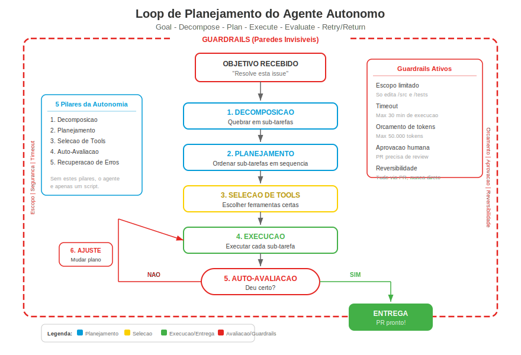

## Change Log

| Version | Date | Author | Changes |
|---------|------|--------|---------|
| 1.0.0 | 2026-03-18 | Paula Silva | Versao inicial — Edicao Super Mario Bros |

# Fase 5-6 -- Os Yoshis que Voam Sozinhos: Agentes Autonomos

---

**Preparado para:** Sofia
**Versao:** 1.0 (Edicao Mushroom Kingdom)
**Autora:** Paula Silva | Software Global Black Belt, Microsoft Americas
**Data:** Marco 2026
**Idioma:** Portugues do Brasil (pt-BR)
**Colecao:** Agentic DevOps -- Guia Completo de Desenvolvimento de Software

---

## SUMARIO

- [Introducao -- O Yoshi que Aprendeu a Voar](#introducao--o-yoshi-que-aprendeu-a-voar)
- [Secao 1 -- O que Torna um Agente "Autonomo"](#secao-1--o-que-torna-um-agente-autonomo)
  - [Autonomo vs Assistido: A Definicao](#autonomo-vs-assistido-a-definicao)
  - [Os 5 Pilares da Autonomia](#os-5-pilares-da-autonomia)
  - [Tabela: Assistido vs Autonomo](#tabela-assistido-vs-autonomo)
- [Secao 2 -- O Loop de Planejamento Autonomo](#secao-2--o-loop-de-planejamento-autonomo)
  - [As 6 Etapas do Planejamento](#as-6-etapas-do-planejamento)
  - [Exemplo Completo: Coding Agent Resolvendo uma Issue](#exemplo-completo-coding-agent-resolvendo-uma-issue)
  - [O Poder da Auto-Avaliacao](#o-poder-da-auto-avaliacao)
- [Secao 3 -- Guardrails: As Paredes Invisiveis](#secao-3--guardrails-as-paredes-invisiveis)
  - [O que sao Guardrails](#o-que-sao-guardrails)
  - [Os 6 Tipos de Guardrails](#os-6-tipos-de-guardrails)
  - [Tabela Completa de Guardrails](#tabela-completa-de-guardrails)
  - [Configurando Guardrails na Pratica](#configurando-guardrails-na-pratica)
- [Secao 4 -- Human-in-the-Loop: O Jogador Nunca Perde o Controle](#secao-4--human-in-the-loop-o-jogador-nunca-perde-o-controle)
  - [O que e Human-in-the-Loop](#o-que-e-human-in-the-loop)
  - [Pontos de Intervencao](#pontos-de-intervencao)
  - [O Princípio do Controle Proporcional](#o-principio-do-controle-proporcional)
- [Secao 5 -- Exemplos Reais de Agentes Autonomos](#secao-5--exemplos-reais-de-agentes-autonomos)
  - [GitHub Copilot Coding Agent](#github-copilot-coding-agent)
  - [Multi-Agent Conversations](#multi-agent-conversations)
  - [Agentes Autonomos no CI/CD](#agentes-autonomos-no-cicd)
- [Secao 6 -- Niveis de Confianca: A Escala do "Deixa Comigo"](#secao-6--niveis-de-confianca-a-escala-do-deixa-comigo)
  - [Os 4 Niveis de Confianca](#os-4-niveis-de-confianca)
  - [Como Subir de Nivel](#como-subir-de-nivel)
  - [Tabela de Supervisao por Nivel](#tabela-de-supervisao-por-nivel)
- [Secao 7 -- Riscos e Mitigacoes: Os Perigos de Voar Alto Demais](#secao-7--riscos-e-mitigacoes-os-perigos-de-voar-alto-demais)
  - [Os 4 Grandes Riscos](#os-4-grandes-riscos)
  - [Tabela de Riscos e Mitigacoes](#tabela-de-riscos-e-mitigacoes)
  - [A Regra de Ouro](#a-regra-de-ouro)
- [Secao 8 -- Construindo Confianca: Do Zero a Autonomo](#secao-8--construindo-confianca-do-zero-a-autonomo)
  - [O Plano de 4 Semanas](#o-plano-de-4-semanas)
  - [Sinais de que Voce Pode Aumentar a Autonomia](#sinais-de-que-voce-pode-aumentar-a-autonomia)
  - [Sinais de que Voce Deve Diminuir a Autonomia](#sinais-de-que-voce-deve-diminuir-a-autonomia)
- [O que Aprendemos -- Tabela de Resumo](#o-que-aprendemos--tabela-de-resumo)

---

## Introducao -- O Yoshi que Aprendeu a Voar

Sofia estava no topo de uma montanha no World 5 quando viu algo incrivel. Um Yoshi azul decolou de uma plataforma distante, voou sobre um vale cheio de Koopas, desviou de tres Bullet Bills, coletou uma estrela escondida atras de uma nuvem, e pousou suavemente na plataforma seguinte -- tudo sozinho, sem ninguem montado nele.

"Ele... ele fez tudo isso sozinho?!" Sofia exclamou, boquiaberta.

O Toad ao lado dela assentiu. "Esse e um Yoshi Autonomo. Voce nao precisa montar nele e controlar cada movimento. Voce diz: 'Yoshi, preciso daquela estrela atras da nuvem.' E ele vai. Planeja a rota, desvia dos obstaculos, pega a estrela, e volta."

"Mas... e se ele errar? E se ele voar pra fora do mapa?"

"Excelente pergunta," O Toad apontou para linhas brilhantes quase invisiveis nas bordas do cenario. "Ve aquelas linhas? Sao **Guardrails** -- paredes invisiveis. O Yoshi pode voar pra qualquer lugar DENTRO dessas paredes. Mas ele nunca sai dos limites. E se ele encontrar algo que nao sabe resolver, ele volta e te pergunta. Ele e autonomo, nao incontrolavel."

Sofia olhou do Yoshi para os Guardrails. "Entao autonomia nao e ausencia de controle..."

"Autonomia e **liberdade com limites inteligentes**," completou o Toad. "E exatamente isso que voce vai aprender nesta fase."

---

## Secao 1 -- O que Torna um Agente "Autonomo"

### Autonomo vs Assistido: A Definicao

Um agente e considerado **autonomo** quando ele pode receber um **objetivo de alto nivel** e completar a tarefa inteira **sem intervencao humana a cada passo**. Ele nao espera instrucoes detalhadas -- ele decompoem o problema, planeja a abordagem, escolhe as ferramentas, executa, avalia o resultado, e itera ate concluir.

A diferenca fundamental:

- **Agente Assistido:** "Me diga exatamente o que fazer a cada passo e eu faco."
- **Agente Autonomo:** "Me diga o que voce quer no final e eu descubro como chegar la."

> **ANALOGIA MARIO:** Um Yoshi **assistido** e aquele que voce monta e controla: "Pula aqui. Agora engole aquele inimigo. Agora corre pra direita. Agora pula de novo." Voce da cada comando. Um Yoshi **autonomo** e aquele que voce diz: "Yoshi, preciso chegar naquela plataforma la em cima" e ele descobre sozinho a melhor rota: pular naquela parede, usar o flutter jump, engolir aquele Koopa pra ganhar impulso, e pousar na plataforma. Mesmo destino, mas o caminho e decisao DELE.

### Os 5 Pilares da Autonomia

Para um agente ser verdadeiramente autonomo, ele precisa dominar 5 capacidades:

| Pilar | O que Significa | Sem Ele | Com Ele | Analogia Mario |
|---|---|---|---|---|
| **1. Decomposicao** | Quebrar um objetivo grande em sub-tarefas | Tenta resolver tudo de uma vez (e falha) | Divide em passos gerenciaveis | Yoshi que divide "chegar la em cima" em "pular, engolir, voar, pousar" |
| **2. Planejamento** | Criar sequencia logica de acoes | Age aleatoriamente | Segue plano estruturado | Yoshi que traca a rota antes de decolar |
| **3. Selecao de Ferramentas** | Escolher a ferramenta certa pra cada sub-tarefa | Usa a mesma ferramenta pra tudo | Usa a ferramenta ideal pra cada etapa | Yoshi que sabe quando engolir, quando cuspir, quando voar |
| **4. Auto-Avaliacao** | Verificar se o resultado esta correto | Entrega sem verificar | Testa e valida antes de entregar | Yoshi que confirma que pousou na plataforma certa |
| **5. Recuperacao de Erros** | Lidar com falhas sem ajuda humana | Para no primeiro erro | Tenta abordagem alternativa | Yoshi que, se a rota falha, tenta outra |


### Tabela: Assistido vs Autonomo

| Aspecto | Agente Assistido | Agente Autonomo |
|---|---|---|
| **Input** | Instrucoes detalhadas, passo a passo | Objetivo de alto nivel |
| **Planejamento** | Humano planeja, agente executa | Agente planeja e executa |
| **Decisoes** | Humano toma todas as decisoes | Agente toma decisoes dentro dos guardrails |
| **Erros** | Agente para e pede ajuda | Agente tenta resolver sozinho, escala se necessario |
| **Supervisao** | Constante (a cada passo) | Pontual (no inicio e no final) |
| **Velocidade** | Limitada pela velocidade do humano | Limitada pela velocidade do agente (geralmente mais rapido) |
| **Risco** | Baixo (humano valida tudo) | Medio (guardrails mitigam) |
| **Melhor para** | Tarefas criticas, decisoes importantes | Tarefas repetitivas, bem definidas |
| **Analogia Mario** | Voce montado no Yoshi, controlando | Yoshi voando sozinho na missao |

---

## Secao 2 -- O Loop de Planejamento Autonomo

<div align="center">

<br/><em>Fluxo do agente autonomo</em>
</div>

### As 6 Etapas do Planejamento

Quando um agente autonomo recebe um objetivo, ele executa um loop de planejamento sofisticado:

```
                    ┌──────────────────────┐
                    │   OBJETIVO RECEBIDO  │
                    │ "Resolve esta issue" │
                    └──────────┬───────────┘
                               │
                               v
                    ┌──────────────────────┐
                    │ 1. DECOMPOSICAO      │
                    │ Quebrar em sub-tarefas│
                    └──────────┬───────────┘
                               │
                               v
                    ┌──────────────────────┐
                    │ 2. PLANEJAMENTO      │
                    │ Ordenar sub-tarefas  │
                    └──────────┬───────────┘
                               │
                               v
                    ┌──────────────────────┐
                    │ 3. SELECAO DE TOOLS  │
                    │ Escolher ferramentas │
                    └──────────┬───────────┘
                               │
                               v
              ┌────────────────────────────────┐
              │ 4. EXECUCAO                    │
              │ Executar cada sub-tarefa       │◄──┐
              └──────────────┬─────────────────┘   │
                             │                     │
                             v                     │
              ┌────────────────────────────────┐   │
              │ 5. AUTO-AVALIACAO              │   │
              │ "Deu certo? Resultado correto?"│   │
              └──────────────┬─────────────────┘   │
                             │                     │
                        ┌────┴────┐                │
                       NAO       SIM               │
                        │         │                │
                        v         v                │
              ┌──────────┐  ┌──────────────┐       │
              │ 6. AJUSTE│  │  ENTREGA     │       │
              │ Mudar    │──┘  Resultado   │       │
              │ plano    │     final       │       │
              └──────────┘  └──────────────┘
```

| Etapa | O que Acontece | Exemplo (Bug Fix) | Analogia Mario |
|---|---|---|---|
| **1. Decomposicao** | Objetivo grande → sub-tarefas menores | "Corrigir bug de login" → a) entender o bug, b) encontrar o codigo, c) corrigir, d) testar, e) criar PR | "Chegar na estrela" → a) pular parede, b) desviar Bullet Bill, c) voar ate nuvem, d) pegar estrela |
| **2. Planejamento** | Ordenar sub-tarefas em sequencia logica | Primeiro entender, depois encontrar, depois corrigir, depois testar | Primeiro pular, depois desviar, depois voar |
| **3. Selecao de Tools** | Escolher a ferramenta certa pra cada etapa | code_search para encontrar, edit para corrigir, terminal para testar | Pulo para parede, flutter para desviar, voo para nuvem |
| **4. Execucao** | Rodar cada sub-tarefa na sequencia | Buscar "login" no codigo → encontrar bug na linha 42 → editar arquivo | Pular → desviar → voar |
| **5. Auto-Avaliacao** | Verificar: deu certo? | Rodar testes → todos passaram? | Estou na plataforma certa? |
| **6. Iteracao** | Se nao deu certo, ajustar e repetir | Teste falhou → ler erro → ajustar correcao → testar de novo | Caiu? Tentar outra rota |

### Exemplo Completo: Coding Agent Resolvendo uma Issue

Veja como o GitHub Copilot Coding Agent resolve uma issue de forma completamente autonoma:

```
ISSUE #247: "O botao 'Salvar' nao funciona quando o formulario
             tem campos opcionais vazios"

─── ETAPA 1: DECOMPOSICAO ───────────────────────────────────

O agente le a issue e decompoem:
  Sub-tarefa 1: Entender a estrutura do formulario
  Sub-tarefa 2: Reproduzir o bug (encontrar o codigo relevante)
  Sub-tarefa 3: Identificar a causa raiz
  Sub-tarefa 4: Escrever a correcao
  Sub-tarefa 5: Adicionar testes
  Sub-tarefa 6: Verificar que tudo passa
  Sub-tarefa 7: Criar PR com descricao

─── ETAPA 2: PLANEJAMENTO ───────────────────────────────────

Plano: 1→2→3→4→5→6→7 (sequencial)

─── ETAPA 3: SELECAO DE TOOLS ──────────────────────────────

  Sub-tarefa 1: code_search (buscar componentes de formulario)
  Sub-tarefa 2: file_read (ler o codigo encontrado)
  Sub-tarefa 3: reasoning (analisar logica do codigo)
  Sub-tarefa 4: file_edit (modificar o arquivo)
  Sub-tarefa 5: file_edit (criar arquivo de teste)
  Sub-tarefa 6: terminal (rodar npm test)
  Sub-tarefa 7: github (criar PR)

─── ETAPA 4: EXECUCAO ──────────────────────────────────────

[code_search] Buscando "SaveButton" e "form submit"...
  → Encontrou: src/components/SaveForm.tsx

[file_read] Lendo SaveForm.tsx...
  → Linha 38: if (!formData.name || !formData.email || !formData.phone)
  → PROBLEMA: phone e opcional mas esta na validacao como obrigatorio!

[file_edit] Corrigindo SaveForm.tsx...
  → Linha 38: if (!formData.name || !formData.email)
  → Removido phone da validacao obrigatoria

[file_edit] Criando SaveForm.test.tsx...
  → Teste 1: "deve salvar quando campos opcionais estao vazios"
  → Teste 2: "deve bloquear quando campos obrigatorios estao vazios"
  → Teste 3: "deve salvar quando todos os campos estao preenchidos"

─── ETAPA 5: AUTO-AVALIACAO ─────────────────────────────────

[terminal] npm test -- --testPathPattern=SaveForm
  → Teste 1: PASS
  → Teste 2: PASS
  → Teste 3: PASS
  → TypeScript: zero erros
  → ESLint: zero warnings

  Avaliacao: TODOS OS TESTES PASSARAM ✓

─── ETAPA 6: SEM NECESSIDADE DE AJUSTE ─────────────────────

─── ETAPA 7: ENTREGA ───────────────────────────────────────

[github] Criando PR...
  Branch: fix/issue-247-save-button-optional-fields
  Titulo: "Fix save button when optional fields are empty"
  Descricao: "The save validation was treating the optional
              'phone' field as required. Removed it from the
              mandatory check. Added 3 tests to cover the
              scenarios."
  → PR #248 criado e pronto para revisao
```

> **ANALOGIA MARIO:** O Yoshi recebeu a missao: "Pegue a estrela atras da nuvem." Ele decolou, tracou a rota (desviar do Bullet Bill pela esquerda, subir pela corrente de vento, contornar a nuvem por cima), executou cada passo, verificou que pegou a estrela certa, e voltou pra plataforma com a estrela na boca. Se o Bullet Bill tivesse mudado de rota, ele teria ajustado o plano no ar. Missao completa, sem precisar de comando a cada segundo.

### O Poder da Auto-Avaliacao

A auto-avaliacao e o que separa um agente autonomo de um script burro. Um script executa e pronto -- nao se importa se deu certo. Um agente autonomo **verifica o resultado** e **ajusta se necessario**.

| Cenario | Script (Sem Auto-Avaliacao) | Agente Autonomo (Com Auto-Avaliacao) |
|---|---|---|
| Teste falha apos correcao | Entrega o codigo quebrado | Le o erro, entende o problema, ajusta a correcao, testa de novo |
| Arquivo nao encontrado | Erro fatal, para tudo | Busca por nomes alternativos, verifica se mudou de lugar |
| Dependencia faltando | Falha de build | Instala a dependencia, re-executa o build |
| TypeScript com erro | Ignora e segue | Analisa o erro de tipo, corrige, re-verifica |
| PR com conflito | Cria PR quebrado | Resolve o conflito, verifica se a resolucao esta correta |

---

## Secao 3 -- Guardrails: As Paredes Invisiveis

### O que sao Guardrails

**Guardrails** sao limites e restricoes que definem o espaco seguro dentro do qual um agente autonomo pode operar. Eles existem para garantir que o agente, por mais autonomo que seja, nunca faca algo perigoso ou fora do escopo permitido.

Guardrails nao sao restricoes que atrapalham -- sao protecoes que permitem dar MAIS autonomia ao agente com seguranca. Sem guardrails, voce teria medo de dar autonomia. Com guardrails, voce pode dar autonomia com confianca.

> **ANALOGIA MARIO:** Guardrails sao as **paredes invisiveis** nos limites de cada fase do Mario. Voce nunca reparou nelas porque elas sao... invisiveis. Mas elas estao la. Mario nao pode sair do mapa, nao pode cair alem do limite inferior, nao pode andar infinitamente pra esquerda. Essas paredes invisiveis nao atrapalham a jogabilidade -- elas PERMITEM a jogabilidade. Sem elas, Mario cairia no vazio infinito. Um Yoshi autonomo com guardrails pode voar livre DENTRO do mapa. Sem guardrails, ele voaria pra fora do jogo e nunca mais voltaria.

### Os 6 Tipos de Guardrails

| Tipo | O que Limita | Por Que Existe | Exemplo | Analogia Mario |
|---|---|---|---|---|
| **1. Escopo** | O QUE o agente pode fazer | Evita que o agente faca coisas fora da sua responsabilidade | "So pode editar arquivos na pasta /frontend" | Paredes da fase -- Yoshi so pode voar dentro desta fase |
| **2. Aprovacao** | QUEM autoriza acoes criticas | Garante supervisao humana em momentos-chave | "PRs para main precisam de aprovacao humana" | Portao do castelo -- so abre com a chave do jogador |
| **3. Orcamento** | QUANTO pode gastar (tokens, API calls, tempo) | Evita explosao de custos | "Maximo 50.000 tokens por execucao" | Limite de moedas -- Yoshi nao pode gastar mais que 100 moedas por missao |
| **4. Tempo** | POR QUANTO TEMPO pode rodar | Evita loops infinitos | "Timeout de 30 minutos" | Relogio da fase -- tempo limitado |
| **5. Seguranca** | O QUE nao pode tocar | Protege recursos criticos | "Nunca acesse banco de producao" | Blocos indestrutíveis -- Yoshi nao pode quebrar certas paredes |
| **6. Reversibilidade** | COMO desfazer | Garante que acoes podem ser revertidas | "Toda mudanca via PR (reversivel), nunca commit direto" | Checkpoint -- se der errado, volta pra ca |

### Tabela Completa de Guardrails

| Guardrail | Configuracao | O que Impede | O que Permite | Nivel de Risco sem Ele |
|---|---|---|---|---|
| **Escopo de Arquivos** | `paths: ["src/**", "tests/**"]` | Agente editar configs de infra, CI/CD, seguranca | Agente editar codigo fonte e testes | ALTO -- agente poderia alterar pipeline de deploy |
| **Branch Protection** | PRs obrigatorios para `main` | Commit direto em producao | Agente criar PRs que serao revisadas | CRITICO -- codigo nao revisado em producao |
| **Token Budget** | `max_tokens: 50000` | Agente consumindo recursos infinitamente | Agente trabalhar dentro de um orcamento | MEDIO -- custo inesperado em API calls |
| **Timeout** | `timeout: 30m` | Loop infinito consumindo recursos | Agente trabalhar por tempo razoavel | MEDIO -- processo travado para sempre |
| **Approval Gates** | `require_approval: ["deploy", "delete"]` | Deploy ou exclusao sem supervisao | Agente preparar tudo, humano aprovar a acao final | CRITICO -- deploy acidental ou perda de dados |
| **Read-Only em Prod** | `production: read_only` | Qualquer escrita em producao | Agente ler logs e metricas de producao | CRITICO -- mudanca acidental em producao |
| **Secret Exclusion** | `exclude: ["*.env", "secrets/**"]` | Agente lendo ou expondo segredos | Agente trabalhar com codigo sem acesso a credenciais | CRITICO -- vazamento de credenciais |
| **Tool Restrictions** | `tools: ["read", "edit", "search"]` | Agente executar comandos perigosos no terminal | Agente ler, editar e buscar codigo com seguranca | ALTO -- execucao de comandos destrutivos |

### Configurando Guardrails na Pratica

Guardrails podem ser configurados em varios niveis:

**Nivel 1 -- No Arquivo do Agent (.agent.md)**
```yaml
---
name: "Frontend Fix Agent"
description: "Corrige bugs no frontend. Escopo limitado a /frontend."
tools:
  - "github"
  - "code_search"
  # NAO inclui "terminal" -- nao pode executar comandos
  # NAO inclui "admin" -- nao pode acessar configs sensiveis
---
```

**Nivel 2 -- Na Configuracao do Repositorio**
```yaml
# .github/copilot-coding-agent.yml (exemplo conceitual)
coding_agent:
  allowed_paths:
    - "src/**"
    - "tests/**"
    - "docs/**"
  blocked_paths:
    - ".github/workflows/**"
    - "infrastructure/**"
    - ".env*"
  max_files_changed: 10
  require_tests: true
  auto_merge: false  # SEMPRE precisa de aprovacao humana
```

**Nivel 3 -- No GitHub (Branch Protection)**
```
Branch: main
  ☑ Require pull request before merging
  ☑ Require approvals (minimum: 1)
  ☑ Require status checks to pass
  ☑ Require conversation resolution
  ☐ Allow force pushes (NUNCA!)
  ☐ Allow deletions (NUNCA!)
```

> **ANALOGIA MARIO:** Configurar guardrails e como o Level Designer configurando as paredes invisiveis de cada fase. **Nivel 1** (Agent): definir os poderes e limitacoes de cada personagem -- Yoshi pode voar mas nao pode cuspir fogo. **Nivel 2** (Repositorio): definir as regras da fase -- esta fase tem paredes aqui, aqui e aqui, e o chao e lava ali. **Nivel 3** (GitHub): definir as regras do JOGO INTEIRO -- para avancar de mundo, precisa derrotar o boss, e ninguem pode pular o boss.

---

## Secao 4 -- Human-in-the-Loop: O Jogador Nunca Perde o Controle

### O que e Human-in-the-Loop

**Human-in-the-Loop (HITL)** e o principio de que, nao importa quao autonomo seja o agente, o humano SEMPRE tem a opcao de intervir, revisar, aprovar ou rejeitar decisoes criticas.

HITL nao significa que o humano faz o trabalho do agente. Significa que o humano e o **tomador de decisao final** para acoes de alto impacto. O agente faz o trabalho pesado, o humano valida o resultado.

> **ANALOGIA MARIO:** Imagine que o Yoshi pode voar autonomamente por toda a fase. Mas quando ele chega na porta do Boss, ele pousa e diz: *"Estou pronto pra entrar. Voce quer que eu va?"* Ele nao entra sozinho no Boss -- essa decisao e SUA. Voce pode dizer "Vai!" ou "Espera, deixa eu verificar se voce esta com vida cheia primeiro." O Yoshi fez todo o trabalho de chegar ate la, mas a decisao critica e do jogador. Isso e Human-in-the-Loop.

### Pontos de Intervencao

| Momento | O que o Agente Faz | O que o Humano Decide | Exemplo |
|---|---|---|---|
| **Antes de comecar** | Apresenta o plano | Aprovar ou ajustar o plano | "Vou corrigir editando estes 3 arquivos. Ok?" |
| **Antes de acao critica** | Prepara a acao | Autorizar a execucao | "Vou deletar esta tabela do banco. Posso prosseguir?" |
| **Apos completar** | Entrega resultado | Aceitar ou rejeitar | "PR pronto para revisao. Merge?" |
| **Quando encontra incerteza** | Explica a duvida | Fornecer direcao | "Encontrei 2 formas de resolver. Qual voce prefere?" |
| **Quando encontra erro** | Explica o erro | Decidir proximos passos | "Os testes falharam. Quer que eu tente outra abordagem?" |

### O Principio do Controle Proporcional

A quantidade de supervisao humana deve ser **proporcional ao risco** da acao:

```
RISCO BAIXO → SUPERVISAO MINIMA
  Exemplo: Corrigir typo em comentario
  Agente: Faz e mostra no PR
  Humano: Aprova com um clique

RISCO MEDIO → SUPERVISAO MODERADA
  Exemplo: Refatorar funcao de validacao
  Agente: Faz e explica as mudancas detalhadamente
  Humano: Revisa o codigo, roda testes, aprova

RISCO ALTO → SUPERVISAO RIGOROSA
  Exemplo: Alterar schema do banco de dados
  Agente: Prepara a migration e PARA
  Humano: Revisa, testa em staging, aprova deploy

RISCO CRITICO → HUMANO DECIDE TUDO
  Exemplo: Deploy em producao no Black Friday
  Agente: Prepara tudo, apresenta checklist
  Humano: Executa cada passo manualmente com o agente assistindo
```

---

## Secao 5 -- Exemplos Reais de Agentes Autonomos

### GitHub Copilot Coding Agent

O Coding Agent e o exemplo mais concreto de um agente autonomo em DevOps hoje:

**Como funciona:**
1. Voce atribui uma issue ao Copilot (`@copilot` na issue)
2. O agente le a issue, analisa o repositorio, cria um plano
3. Cria uma branch, um codespace isolado
4. Escreve codigo, roda testes, itera
5. Abre um Pull Request com descricao detalhada
6. Voce revisa e faz merge (ou pede ajustes)

```
FLUXO DO CODING AGENT:

Issue atribuida ao @copilot
        │
        v
   ┌─────────────┐
   │ Le a issue   │
   │ e o repo     │
   └──────┬──────┘
          │
          v
   ┌─────────────┐
   │ Cria branch  │
   │ e codespace  │
   └──────┬──────┘
          │
          v
   ┌─────────────┐
   │ Escreve      │
   │ codigo       │◄──────────┐
   └──────┬──────┘           │
          │                  │
          v                  │
   ┌─────────────┐           │
   │ Roda testes  │    ┌─────┴─────┐
   └──────┬──────┘    │ Ajusta    │
          │           │ codigo    │
     ┌────┴────┐      └───────────┘
    PASS     FAIL──────────┘
     │
     v
   ┌─────────────┐
   │ Abre PR      │
   │ com descricao│
   └──────┬──────┘
          │
          v
   ┌─────────────┐
   │ HUMANO       │
   │ revisa       │
   └─────────────┘
```

**Guardrails do Coding Agent:**
- Roda em codespace **isolado** (nao toca seu ambiente)
- Toda mudanca via **Pull Request** (revisavel, reversivel)
- Respeita **branch protection** (nao pode fazer merge sozinho)
- Limitado ao **escopo da issue** (nao sai fazendo outras coisas)
- Tem **timeout** (nao roda infinitamente)

> **ANALOGIA MARIO:** O Coding Agent e um Yoshi de elite. Voce mostra a missao no mapa (issue), ele decola, faz todo o trabalho, e volta com o tesouro (PR). Mas ele NUNCA coloca o tesouro no bau real (merge) sozinho -- ele entrega na sua mao pra voce decidir. E ele trabalha num espaco isolado (codespace) -- se algo der errado, nao afeta o castelo real (producao).

### Multi-Agent Conversations

Num cenario avancado, multiplos agentes autonomos podem conversar entre si para resolver um problema complexo:

```
CENARIO: Implementar sistema de pagamentos

ORCHESTRATOR (Mario): "Preciso de um sistema de pagamentos.
                       Luigi, cria os componentes de UI.
                       Toad, cria as tabelas no banco.
                       Yoshi, prepara o deploy."

LUIGI (React Agent):  "Criando componentes... FormaPagamento.tsx,
                       HistoricoPagamentos.tsx, ResumoPedido.tsx.
                       Toad, vou precisar de um endpoint
                       GET /api/payments."

TOAD (DBA Agent):     "Criando tabelas payments, transactions,
                       payment_methods. Luigi, os campos retornados
                       no endpoint serao: id, amount, status, date."

YOSHI (DevOps Agent): "Preparando Dockerfile e kubernetes manifests.
                       Luigi, Toad -- quando terminarem, me avisem
                       pra eu configurar as variaveis de ambiente."

ORCHESTRATOR (Mario): "Luigi terminou, Toad terminou. Yoshi, pode
                       finalizar. Peach, revisa tudo."

PEACH (QA Agent):     "Revisando... encontrei um edge case: o que
                       acontece quando o pagamento e estornado?
                       Luigi, falta um estado 'refunded' no UI."

LUIGI (React Agent):  "Boa, Peach! Adicionando estado 'refunded'
                       ao componente..."
```

### Agentes Autonomos no CI/CD

Agentes autonomos ja sao realidade no CI/CD:

| Agente | Trigger | Acao Autonoma | Guardrail |
|---|---|---|---|
| **Dependabot** | Dependencia desatualizada detectada | Cria PR com atualizacao | Humano precisa aprovar merge |
| **CodeQL** | Push para o repositorio | Scanneia codigo, reporta vulnerabilidades | Pode bloquear merge se encontrar algo critico |
| **Copilot Autofix** | Alerta de seguranca | Gera PR com correcao automatica | Humano revisa antes de merge |
| **Renovate** | Nova versao de dependencia | Cria PR agrupando atualizacoes compativeis | Testes devem passar antes de merge |

---

## Secao 6 -- Niveis de Confianca: A Escala do "Deixa Comigo"

### Os 4 Niveis de Confianca

A relacao entre humano e agente autonomo evolui em 4 niveis de confianca:

| Nivel | Nome | Frase do Agente | O que Acontece | Analogia Mario |
|---|---|---|---|---|
| **1** | **"Olha eu fazendo"** | "Vou fazer enquanto voce assiste" | Agente executa, humano supervisiona cada passo em tempo real | Yoshi andando devagar, voce observando cada movimento |
| **2** | **"Fiz, olha aqui"** | "Terminei, confere o resultado" | Agente executa sozinho, mostra resultado completo para revisao | Yoshi voltou da missao, mostra tudo que fez |
| **3** | **"Fiz, te conto"** | "Fiz tal coisa. Aqui o resumo." | Agente executa e reporta, humano so intervem se algo parecer errado | Yoshi mandou mensagem: "Estrela coletada, 3 Koopas derrotados" |
| **4** | **"Deixa comigo"** | "Pode ir fazer outra coisa" | Agente executa autonomamente, humano e notificado apenas se necessario | Yoshi saiu na missao, voce foi jogar outra fase |

> **ANALOGIA MARIO:** Pense em como voce confia em personagens ao longo do jogo. No comeco, voce nao confia em NINGUEM -- faz tudo sozinho. Depois, monta no Yoshi mas controla cada passo (Nivel 1). Com o tempo, deixa o Yoshi resolver trechos inteiros enquanto voce observa (Nivel 2). Mais tarde, voce recebe o resumo do que ele fez (Nivel 3). E finalmente, confia tanto que manda em missoes e vai fazer outra coisa (Nivel 4). A confianca e CONSTRUIDA, nao assumida.

### Como Subir de Nivel

| De → Para | O que Precisa Acontecer | Quanto Tempo | Exemplo |
|---|---|---|---|
| **1 → 2** | Agente completar 5-10 tarefas sem erro sob supervisao | 1-2 semanas | "O Coding Agent acertou as ultimas 8 issues. Posso parar de assistir cada passo." |
| **2 → 3** | Agente completar 20-30 tarefas com revisoes rapidas (poucos ajustes) | 2-4 semanas | "Os PRs do Coding Agent precisam de poucos ajustes. Posso so ler o resumo." |
| **3 → 4** | Agente completar 50+ tarefas com taxa de acerto >95% | 1-3 meses | "O Dependabot nunca errou uma atualizacao. Posso deixar no auto-merge pra patches." |

### Tabela de Supervisao por Nivel

| Nivel | Frequencia de Revisao | Profundidade da Revisao | Tempo Investido | Confianca |
|---|---|---|---|---|
| **1 -- Olha eu fazendo** | Cada acao | Linha por linha | Alto | Baixa |
| **2 -- Fiz, olha aqui** | Cada entrega | Resultado completo | Medio | Media |
| **3 -- Fiz, te conto** | Cada resumo | Apenas resumo e metricas | Baixo | Alta |
| **4 -- Deixa comigo** | Apenas alertas | Apenas anomalias | Minimo | Muito Alta |

---

## Secao 7 -- Riscos e Mitigacoes: Os Perigos de Voar Alto Demais

### Os 4 Grandes Riscos

Agentes autonomos sao poderosos, mas trazem riscos reais que precisam ser gerenciados:

**1. Alucinacao (Hallucination)**

O agente "inventa" informacoes ou toma decisoes baseadas em fatos que nao existem. Ele pode referenciar funcoes que nao existem, usar APIs com parametros incorretos, ou gerar codigo que parece certo mas esta logicamente errado.

> **ANALOGIA MARIO:** O Yoshi acha que tem uma plataforma invisivel no ar e pula confiante... mas a plataforma nao existe. Ele cai no abismo. Alucinacao e quando o agente "ve" algo que nao esta la e age como se estivesse.

**2. Loop Infinito**

O agente fica preso num ciclo: tenta resolver, falha, tenta de novo da mesma forma, falha de novo, repete... para sempre. Cada iteracao consome recursos (tokens, tempo, dinheiro).

> **ANALOGIA MARIO:** O Yoshi fica correndo contra uma parede, tentando passar, batendo, voltando, correndo de novo, batendo... infinitamente. Nunca para pra pensar "talvez eu precise ir por cima dessa parede em vez de atravessar."

**3. Explosao de Custo**

O agente consome muito mais recursos do que o esperado. Cada chamada ao LLM custa dinheiro. Um agente em loop infinito ou que decompoem uma tarefa em centenas de sub-tarefas pode gerar custos significativos.

> **ANALOGIA MARIO:** O Yoshi decide que para pegar uma moeda, ele precisa derrotar TODOS os inimigos da fase, reconstruir TODAS as plataformas, e repintar TODO o cenario. Uma tarefa simples vira uma producao epica desnecessaria -- e gasta todas as moedas do cofre.

**4. Seguranca**

O agente pode acessar recursos sensiveis, vazar informacoes, ou executar acoes perigosas. Se um agente tem acesso ao terminal e a producao, ele pode causar danos reais.

> **ANALOGIA MARIO:** O Yoshi entra no castelo errado (ambiente de producao em vez de staging), abre as portas, e todos os Koopas invadem. Ou ele encontra a chave secreta do reino (API key) e acidentalmente a deixa cair no meio da praca (log publico).

### Tabela de Riscos e Mitigacoes

| Risco | Probabilidade | Impacto | Mitigacao | Guardrail Correspondente |
|---|---|---|---|---|
| **Alucinacao** | Media-Alta | Medio | Testes automaticos, code review, validacao de output | Auto-avaliacao + testes obrigatorios |
| **Loop Infinito** | Media | Medio-Alto | Timeout, limite de iteracoes | Guardrail de tempo + orcamento |
| **Explosao de Custo** | Media | Alto | Budget maximo, alertas de custo | Guardrail de orcamento |
| **Seguranca** | Baixa-Media | Critico | Escopo minimo, isolamento, sem acesso a producao | Guardrails de escopo + seguranca |
| **Codigo incorreto** | Media | Medio | Testes obrigatorios, code review humano | CI/CD + branch protection |
| **Acoes irreversiveis** | Baixa | Critico | Tudo via PR (reversivel), aprovacao para acoes destrutivas | Guardrail de aprovacao + reversibilidade |

### A Regra de Ouro

```
╔══════════════════════════════════════════════════════════════╗
║                                                              ║
║   REGRA DE OURO DOS AGENTES AUTONOMOS:                      ║
║                                                              ║
║   "Nunca de a um agente mais poder do que voce esta          ║
║    disposto a consertar se ele errar."                       ║
║                                                              ║
║   Se o agente pode editar 5 arquivos e errar → OK,          ║
║   voce reverte o PR em 2 cliques.                            ║
║                                                              ║
║   Se o agente pode deletar o banco de producao e errar →     ║
║   NAO OK. Voce nao reverte isso em 2 cliques.               ║
║                                                              ║
╚══════════════════════════════════════════════════════════════╝
```

> **ANALOGIA MARIO:** Voce deixa o Yoshi voar pela fase coletando moedas? Claro -- se ele errar, voce perdeu umas moedas. Voce deixa o Yoshi voar sozinho ate o Boss final do jogo e lutar por voce? Provavelmente nao -- se ele perder, voce perde o jogo inteiro. O nivel de autonomia deve ser proporcional ao custo do erro.

---

## Secao 8 -- Construindo Confianca: Do Zero a Autonomo

### O Plano de 4 Semanas

Nao comece no Nivel 4. Comece no Nivel 1 e evolua gradualmente:

| Semana | Nivel | O que Fazer | O que Observar | Analogia Mario |
|---|---|---|---|---|
| **Semana 1** | **Nivel 1 -- Olha eu fazendo** | Atribuir issues simples ao Coding Agent. Assistir cada passo. Revisar cada linha. | Qualidade do codigo, acerto no entendimento da issue, quantidade de ajustes necessarios | Montar no Yoshi pela primeira vez, ir devagar |
| **Semana 2** | **Nivel 2 -- Fiz, olha aqui** | Atribuir issues medias. Deixar o agente trabalhar. Revisar o PR completo. | Tempo de resolucao, quantidade de idas e vindas na revisao, cobertura de testes | Deixar Yoshi correr mais rapido, observar resultado |
| **Semana 3** | **Nivel 3 -- Fiz, te conto** | Atribuir multiplas issues. Ler resumos dos PRs. Revisao mais rapida. | Taxa de acerto, frequencia de problemas, tempo economizado | Mandar Yoshi em missoes, ler os relatorios |
| **Semana 4** | **Avaliar** | Analisar metricas das 3 semanas. Decidir se o agente esta pronto para mais autonomia. | Tendencias, melhoria ou piora, tipos de erro recorrentes | Avaliar se o Yoshi esta pronto pra missoes solo |

### Sinais de que Voce Pode Aumentar a Autonomia

- PRs do agente precisam de poucos ou nenhum ajuste
- Testes que o agente escreve cobrem edge cases
- O agente identifica e resolve problemas secundarios (alem da issue)
- Tempo de revisao diminuindo a cada semana
- Zero incidentes de seguranca ou acoes fora do escopo

### Sinais de que Voce Deve Diminuir a Autonomia

- PRs com erros logicos que os testes nao pegaram
- Agente mal-interpretando issues com frequencia
- Custos subindo sem aumento proporcional de produtividade
- Agente fazendo mudancas fora do escopo da issue
- Qualquer incidente de seguranca, por menor que seja

---

## O que Aprendemos -- Tabela de Resumo

| Topico | Conceito-Chave | Analogia Mario | Aplicacao Pratica |
|---|---|---|---|
| **Autonomo vs Assistido** | Autonomo = recebe objetivo, executa sozinho | Yoshi voando sozinho vs Yoshi que voce controla | Agentes autonomos economizam tempo em tarefas bem definidas |
| **Loop de Planejamento** | Decompor → Planejar → Selecionar Tools → Executar → Avaliar → Iterar | Yoshi que traca rota, desvia obstaculos, verifica resultado | O poder esta na auto-avaliacao e iteracao |
| **Guardrails** | Limites que permitem autonomia segura | Paredes invisiveis que mantem o Yoshi dentro do mapa | Escopo, aprovacao, orcamento, tempo, seguranca, reversibilidade |
| **Human-in-the-Loop** | Humano decide em momentos criticos | Yoshi para na porta do Boss e pergunta | Supervisao proporcional ao risco |
| **Niveis de Confianca** | "Olha eu fazendo" → "Fiz, olha" → "Fiz, te conto" → "Deixa comigo" | Confianca construida ao longo de missoes bem-sucedidas | Comece supervisionando, aumente gradualmente |
| **Riscos** | Alucinacao, loops, custo, seguranca | Yoshi pulando em plataforma imaginaria, correndo contra parede | Guardrails e revisao humana mitigam todos |
| **Construindo Confianca** | 4 semanas de evolucao gradual | De Yoshi iniciante a Yoshi de elite | Observe metricas, ajuste autonomia baseado em resultados |

---

**Anterior:** Fase 5-5 -- Quem e Quem no Mushroom Kingdom    |    **Proximo:** Fase 5-7

---

### POWER-UP DESBLOQUEADO!

Sofia agora entende agentes autonomos -- nao como magia, mas como engenharia. Ela sabe que autonomia sem guardrails e um Yoshi voando pra fora do mapa. Sabe que confianca e construida, nao assumida. E sabe que o segredo e dar ao agente exatamente a quantidade certa de liberdade: suficiente para ser util, limitada o bastante para ser seguro.

Ela olhou para o Yoshi autonomo que pousou ao lado dela, segurando uma estrela na boca. "Voce e incrivel," ela disse. "Mas eu sei que voce so e incrivel PORQUE tem guardrails. Sem eles, voce seria um perigo."

O Yoshi piscou, concordando. Ate ele sabia que liberdade sem limites nao e liberdade -- e caos.

Sofia guardou esse power-up no inventario e seguiu para a proxima fase do Mushroom Kingdom...

*Press START to continue...*

---

## References

- [GitHub Copilot — Concepts and Agents](https://docs.github.com/en/copilot/concepts/agents)
- [Azure AI Services](https://learn.microsoft.com/en-us/azure/ai-services/)
- [GitHub Copilot Documentation](https://docs.github.com/en/copilot)

---

<div align="center">

⬅️ [Anterior: Fase 5-5: Agent Types](5-5-agent-types.md) · 🗺️ [Mapa dos Mundos](../INDEX.md) · ➡️ [Proximo: Fase 5-7: MCP Deep Dive](5-7-mcp-deep-dive.md)

</div>
