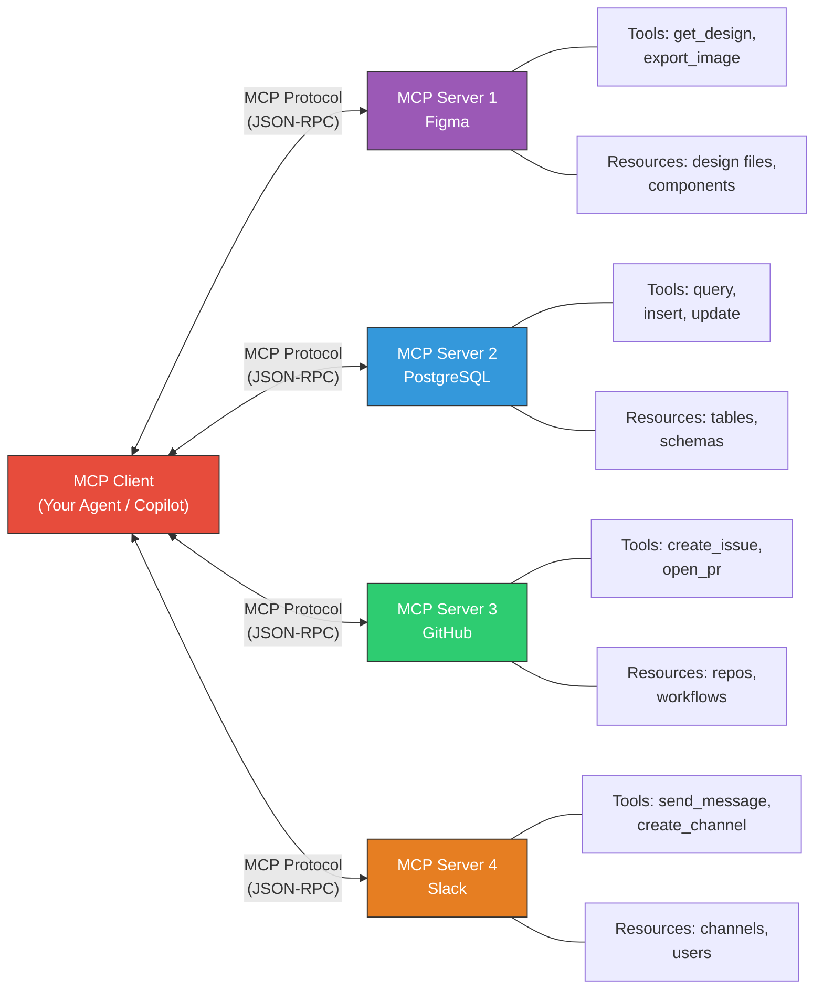

# Fase 5-7 -- Warp Zones Universais: MCP em Profundidade

## Change Log

| Versao | Data       | Autor        | Descricao                          |
|--------|------------|--------------|------------------------------------|
| 1.0.0  | 2026-03-18 | Paula Silva  | Criacao inicial do capitulo        |

---

## Sumario

- [Introducao -- O Mundo dos Canos Incompativeis](#introducao--o-mundo-dos-canos-incompativeis)
- [Secao 1 -- O que e MCP?](#secao-1--o-que-e-mcp)
  - [1.1 Definicao Fundamental](#11-definicao-fundamental)
  - [1.2 O Problema que MCP Resolve](#12-o-problema-que-mcp-resolve)
  - [1.3 A Analogia Mario: O Padrao Universal de Warp Pipes](#13-a-analogia-mario-o-padrao-universal-de-warp-pipes)
- [Secao 2 -- Antes do MCP: O Caos dos Canos Incompativeis](#secao-2--antes-do-mcp-o-caos-dos-canos-incompativeis)
  - [2.1 O Problema das Integracoes Customizadas](#21-o-problema-das-integracoes-customizadas)
  - [2.2 O Problema MxN](#22-o-problema-mxn)
  - [2.3 Analogia Mario: Cada Mundo com Canos Diferentes](#23-analogia-mario-cada-mundo-com-canos-diferentes)
- [Secao 3 -- A Arquitetura do MCP](#secao-3--a-arquitetura-do-mcp)
  - [3.1 Os 4 Componentes Fundamentais](#31-os-4-componentes-fundamentais)
  - [3.2 Como os Componentes se Conectam](#32-como-os-componentes-se-conectam)
  - [3.3 Tabela: Componentes MCP vs Mushroom Kingdom](#33-tabela-componentes-mcp-vs-mushroom-kingdom)
- [Secao 4 -- MCP Server: A Loja Especializada do NPC](#secao-4--mcp-server-a-loja-especializada-do-npc)
  - [4.1 O que e um MCP Server](#41-o-que-e-um-mcp-server)
  - [4.2 Tipos de MCP Servers](#42-tipos-de-mcp-servers)
  - [4.3 Anatomia de um MCP Server](#43-anatomia-de-um-mcp-server)
  - [4.4 Exemplos de MCP Servers Reais](#44-exemplos-de-mcp-servers-reais)
  - [4.5 Analogia Mario: As Lojas Especializadas de Cada Mundo](#45-analogia-mario-as-lojas-especializadas-de-cada-mundo)
- [Secao 5 -- MCP Client: O Companion que Visita as Lojas](#secao-5--mcp-client-o-companion-que-visita-as-lojas)
  - [5.1 O que e um MCP Client](#51-o-que-e-um-mcp-client)
  - [5.2 Exemplos de MCP Clients](#52-exemplos-de-mcp-clients)
  - [5.3 Como o Client Descobre o que o Server Oferece](#53-como-o-client-descobre-o-que-o-server-oferece)
  - [5.4 Analogia Mario: Yoshi Visita a Loja](#54-analogia-mario-yoshi-visita-a-loja)
- [Secao 6 -- Tools: Os Itens que a Loja Vende](#secao-6--tools-os-itens-que-a-loja-vende)
  - [6.1 O que sao Tools no MCP](#61-o-que-sao-tools-no-mcp)
  - [6.2 Anatomia de uma Tool](#62-anatomia-de-uma-tool)
  - [6.3 Exemplos de Tools por Server](#63-exemplos-de-tools-por-server)
  - [6.4 Analogia Mario: Itens Especificos de Cada Loja](#64-analogia-mario-itens-especificos-de-cada-loja)
- [Secao 7 -- Resources: As Informacoes que a Loja Compartilha](#secao-7--resources-as-informacoes-que-a-loja-compartilha)
  - [7.1 O que sao Resources no MCP](#71-o-que-sao-resources-no-mcp)
  - [7.2 Diferenca entre Tools e Resources](#72-diferenca-entre-tools-e-resources)
  - [7.3 Exemplos de Resources](#73-exemplos-de-resources)
  - [7.4 Analogia Mario: O Painel de Informacoes da Loja](#74-analogia-mario-o-painel-de-informacoes-da-loja)
- [Secao 8 -- Prompts no MCP: Receitas Prontas](#secao-8--prompts-no-mcp-receitas-prontas)
  - [8.1 O que sao Prompts no MCP](#81-o-que-sao-prompts-no-mcp)
  - [8.2 Exemplos de Prompts MCP](#82-exemplos-de-prompts-mcp)
  - [8.3 Analogia Mario: Combinacoes de Itens da Loja](#83-analogia-mario-combinacoes-de-itens-da-loja)
- [Secao 9 -- O Protocolo em Detalhes: Como MCP Funciona por Baixo](#secao-9--o-protocolo-em-detalhes-como-mcp-funciona-por-baixo)
  - [9.1 Transporte: stdio vs HTTP/SSE](#91-transporte-stdio-vs-httpsse)
  - [9.2 O Handshake Inicial](#92-o-handshake-inicial)
  - [9.3 O Ciclo de Comunicacao](#93-o-ciclo-de-comunicacao)
  - [9.4 Analogia Mario: Como o Cano Funciona por Dentro](#94-analogia-mario-como-o-cano-funciona-por-dentro)
- [Secao 10 -- Configurando MCP na Pratica](#secao-10--configurando-mcp-na-pratica)
  - [10.1 O Arquivo mcp.json](#101-o-arquivo-mcpjson)
  - [10.2 Configuracao no VS Code](#102-configuracao-no-vs-code)
  - [10.3 Exemplo Completo: MCP com Azure Boards](#103-exemplo-completo-mcp-com-azure-boards)
  - [10.4 Exemplo Completo: MCP com PostgreSQL](#104-exemplo-completo-mcp-com-postgresql)
- [Secao 11 -- Seguranca no MCP](#secao-11--seguranca-no-mcp)
  - [11.1 Principios de Seguranca](#111-principios-de-seguranca)
  - [11.2 Protegendo API Keys](#112-protegendo-api-keys)
  - [11.3 Analogia Mario: A Chave Secreta do Warp Zone](#113-analogia-mario-a-chave-secreta-do-warp-zone)
- [Secao 12 -- O Ecossistema MCP: Servers Disponiveis](#secao-12--o-ecossistema-mcp-servers-disponiveis)
  - [12.1 Servers Oficiais e da Comunidade](#121-servers-oficiais-e-da-comunidade)
  - [12.2 Criando Seu Proprio MCP Server](#122-criando-seu-proprio-mcp-server)
- [Secao 13 -- MCP e Fundamental para Agentic DevOps](#secao-13--mcp-e-fundamental-para-agentic-devops)
  - [13.1 Sem MCP vs Com MCP](#131-sem-mcp-vs-com-mcp)
  - [13.2 O Futuro do MCP](#132-o-futuro-do-mcp)
- [O que Aprendemos -- Tabela de Resumo](#o-que-aprendemos--tabela-de-resumo)
- [Referencias](#referencias)

---

## Introducao -- O Mundo dos Canos Incompativeis

Sofia estava no Mushroom Kingdom quando percebeu algo estranho. Ela precisava viajar entre mundos -- ir ao World dos Designs buscar cores, ao World dos Dados buscar informacoes, e ao World das Tarefas atualizar o progresso. Mas quando tentou usar os Warp Pipes...

"Este cano so funciona com tokens hexagonais!" disse o Toad do World dos Designs.

Sofia foi ao World dos Dados. "Este cano exige uma chave redonda e um protocolo especial!" disse o Toad de la.

No World das Tarefas: "Aqui so aceitamos passes quadrados com autenticacao de tres fatores!"

Sofia estava frustrada. "Cada mundo tem um tipo de cano diferente! Eu preciso de uma chave hexagonal, uma redonda e uma quadrada, e cada uma funciona de um jeito! Isso e insano!"

Um Toad engenheiro apareceu com um sorriso. "E por isso que criamos o **MCP -- Model Context Protocol**. E um padrao UNIVERSAL de canos. Um UNICO tipo de cano que funciona para TODOS os mundos. Voce aprende uma vez, e viaja para qualquer lugar."

"UM padrao para todos?" Sofia arregalou os olhos. "Isso muda tudo!"

"Muda sim. Antes, cada ferramenta externa era um mundo isolado com seu proprio tipo de cano. Agora, com MCP, TODOS os mundos falam a mesma lingua."

---

## Secao 1 -- O que e MCP?

### 1.1 Definicao Fundamental

**MCP (Model Context Protocol)** e um protocolo aberto que padroniza como agentes de IA se conectam a ferramentas e fontes de dados externas. E como um USB para IA -- um conector universal que funciona com qualquer ferramenta.

Sem MCP, o agente de IA esta preso dentro de sua bolha -- ele so sabe o que esta no codigo e no que foi treinado. Com MCP, o agente pode:

- Acessar seu Azure Boards e ler/atualizar work items
- Consultar bancos de dados diretamente
- Chamar APIs externas para buscar dados reais
- Ler documentacao atualizada de ferramentas
- Interagir com servicos como Slack, email, calendario

### 1.2 O Problema que MCP Resolve

Antes do MCP, cada integracao entre IA e ferramenta externa era CUSTOMIZADA. Se voce queria conectar o Copilot ao Azure Boards, precisava de uma integracao especifica. Se queria conectar ao PostgreSQL, outra integracao. Ao Slack, outra. Cada uma com seu protocolo, sua autenticacao, sua API.

Isso criava o **problema MxN**: M agentes de IA tentando se conectar a N ferramentas = M x N integracoes customizadas. Insustentavel.

MCP resolve isso com UM padrao universal: cada ferramenta implementa UM servidor MCP, cada agente implementa UM cliente MCP, e TODOS se conectam.

```
ANTES do MCP (M x N integracoes):
  Copilot ──custom──> Azure Boards
  Copilot ──custom──> PostgreSQL
  Copilot ──custom──> Slack
  Claude  ──custom──> Azure Boards  (outra integracao!)
  Claude  ──custom──> PostgreSQL    (outra integracao!)
  Claude  ──custom──> Slack         (outra integracao!)
  Total: 6 integracoes customizadas (e cresce exponencialmente)

DEPOIS do MCP (M + N):
  Copilot ──MCP──┐
  Claude  ──MCP──┤──> MCP Server Azure Boards
                 ├──> MCP Server PostgreSQL
                 └──> MCP Server Slack
  Total: 2 clients + 3 servers = 5 (cresce linearmente)
```

### 1.3 A Analogia Mario: O Padrao Universal de Warp Pipes

> **ANALOGIA MARIO:** Imagine que ANTES do MCP, cada mundo do Mushroom Kingdom tinha seu proprio tipo de Warp Pipe. O World 1 usava canos verdes redondos. O World 2 usava canos azuis quadrados. O World 3 usava canos vermelhos triangulares. Para viajar entre mundos, Mario precisava aprender um sistema diferente para cada cano, carregar chaves diferentes, e usar protocolos diferentes.
>
> Agora imagine que alguem criou um PADRAO UNIVERSAL: todos os canos sao verdes, todos usam a mesma interface, e uma UNICA chave abre todos. Mario aprende a usar UM cano e pode viajar para QUALQUER mundo. Isso e MCP.
>
> **Sem MCP** = Mario preso no World 1. Limitado ao que esta na frente dele.
> **Com MCP** = Mario viaja entre World 1, 2, 3, 4... sem limites. Cada viagem traz recursos e informacoes de outros mundos.

---

## Secao 2 -- Antes do MCP: O Caos dos Canos Incompativeis

### 2.1 O Problema das Integracoes Customizadas

Antes do MCP, conectar um agente de IA a uma ferramenta externa exigia:

1. **Estudar a API** da ferramenta (cada uma diferente)
2. **Escrever codigo de integracao** especifico (plugin, extensao)
3. **Gerenciar autenticacao** (cada ferramenta com seu metodo)
4. **Manter a integracao** (APIs mudam, versoes atualizam)
5. **Repetir para CADA combinacao** agente/ferramenta

### 2.2 O Problema MxN

Se voce tem 5 agentes de IA e 10 ferramentas, precisa de 50 integracoes customizadas. Cada uma precisa ser desenvolvida, testada e mantida. E quando a API muda, todas as integracoes daquela ferramenta quebram.

| Agentes (M) | Ferramentas (N) | Integracoes Sem MCP (M x N) | Integracoes Com MCP (M + N) |
|---|---|---|---|
| 2 | 3 | 6 | 5 |
| 5 | 10 | 50 | 15 |
| 10 | 20 | 200 | 30 |
| 20 | 50 | 1000 | 70 |

### 2.3 Analogia Mario: Cada Mundo com Canos Diferentes

> **ANALOGIA MARIO:** Sem MCP, imagine o caos: Mario quer ir ao World dos Designs. O Toad do cano diz: "Voce precisa de um token hexagonal, falar em Koopa-linguagem, e entrar de cabeca." Mario consegue. Agora quer ir ao World dos Dados. Outro Toad: "Aqui e diferente. Token redondo, falar em Goomba-linguagem, e entrar de pe." Mario aprende. Agora o World das Tarefas: "Token quadrado, Toad-linguagem, e entrar pulando."
>
> Agora imagine que LUIGI tambem quer visitar esses mundos. Ele precisa aprender TUDO de novo -- cada mundo, cada cano, cada protocolo. E Peach tambem. E Yoshi. E CADA NOVO PERSONAGEM.
>
> Com MCP: TODOS os canos sao iguais. Aprenda uma vez, viaje para qualquer lugar. Qualquer personagem (agente) pode usar qualquer cano (MCP Server).

---

## Secao 3 -- A Arquitetura do MCP

### 3.1 Os 4 Componentes Fundamentais

O MCP tem quatro componentes principais:

1. **MCP Host:** O aplicativo que roda o agente de IA (ex: VS Code, GitHub.com)
2. **MCP Client:** A parte do host que se conecta aos servers MCP
3. **MCP Server:** Um servico que expoe ferramentas e dados para agentes
4. **Transporte:** O "cano" por onde a comunicacao flui (stdio, HTTP/SSE)

### Diagrama: Arquitetura MCP



### 3.2 Como os Componentes se Conectam

```
┌─────────────────────────────────────────────────────────────┐
│                        MCP HOST                              │
│                    (ex: VS Code)                             │
│                                                              │
│  ┌──────────────┐                                            │
│  │  Agente IA   │  (ex: GitHub Copilot)                      │
│  │  (LLM)       │                                            │
│  └──────┬───────┘                                            │
│         │                                                    │
│  ┌──────▼───────┐                                            │
│  │  MCP Client  │  (gerencia conexoes com servers)           │
│  └──────┬───────┘                                            │
│         │                                                    │
└─────────┼────────────────────────────────────────────────────┘
          │ Protocolo MCP (JSON-RPC)
          │
    ┌─────┼──────────────────┐
    │     │                  │
    ▼     ▼                  ▼
┌───────┐ ┌───────┐   ┌───────┐
│ MCP   │ │ MCP   │   │ MCP   │
│Server │ │Server │   │Server │
│ Azure │ │ Postgres│  │ Slack │
│Boards │ │       │   │       │
└───────┘ └───────┘   └───────┘
    │         │            │
    ▼         ▼            ▼
  Azure    PostgreSQL    Slack
  Boards    Database      API
```

### 3.3 Tabela: Componentes MCP vs Mushroom Kingdom

| Componente MCP | Analogia Mario | O que Faz |
|---|---|---|
| **MCP Host** | O **Castelo Principal** onde Mario mora e de onde sai para aventuras | O aplicativo (VS Code) que hospeda o agente |
| **MCP Client** | O **Yoshi** que sabe usar todos os Warp Pipes | A parte que se conecta aos servers -- o "viajante" |
| **MCP Server** | Uma **Loja Especializada** em cada mundo | Servico que expoe ferramentas e dados de uma ferramenta especifica |
| **Tools** | **Itens que a loja vende** (espadas, escudos, pocoes) | Funcoes especificas que o server oferece (criar task, ler board) |
| **Resources** | **Painel informativo da loja** (catalogo, precos, novidades) | Dados que o server compartilha (lista de projetos, status) |
| **Prompts** | **Receitas de combo** (mushroom + fire flower = poder dobrado) | Templates de prompts que o server oferece |
| **Transporte** | O **Cano** propriamente dito (por onde se viaja) | O protocolo de comunicacao (stdio ou HTTP/SSE) |

---

## Secao 4 -- MCP Server: A Loja Especializada do NPC

### 4.1 O que e um MCP Server

Um **MCP Server** e um servico que expoe ferramentas e dados de uma ferramenta externa para agentes de IA. Cada MCP Server e especializado em UMA ferramenta ou servico:

- **MCP Server para Azure Boards:** Expoe ferramentas para criar/ler/atualizar work items
- **MCP Server para PostgreSQL:** Expoe ferramentas para fazer queries, explorar tabelas
- **MCP Server para Slack:** Expoe ferramentas para enviar/ler mensagens
- **MCP Server para Figma:** Expoe ferramentas para ler designs, cores, tipografia

### 4.2 Tipos de MCP Servers

| Tipo | Descricao | Exemplos |
|---|---|---|
| **Oficiais** | Criados pelos mantenedores da ferramenta | Azure Boards MCP, GitHub MCP |
| **Comunidade** | Criados pela comunidade open-source | Postgres MCP, Slack MCP |
| **Customizados** | Criados por voce para suas ferramentas | MCP para sua API interna |

### 4.3 Anatomia de um MCP Server

Todo MCP Server expoe tres tipos de capacidades:

```
MCP Server (ex: Azure Boards)
│
├── Tools (Ferramentas / Acoes)
│   ├── create_work_item    → Cria um work item
│   ├── update_work_item    → Atualiza um work item
│   ├── list_work_items     → Lista work items com filtros
│   └── get_work_item       → Busca um work item por ID
│
├── Resources (Dados / Contexto)
│   ├── projects            → Lista de projetos disponiveis
│   ├── boards              → Boards configurados
│   └── sprints             → Sprints atuais e futuras
│
└── Prompts (Templates)
    ├── create_bug_report   → Template para criar bug report
    └── sprint_summary      → Template para resumo da sprint
```

### 4.4 Exemplos de MCP Servers Reais

| MCP Server | Ferramenta | Tools Oferecidas | Resources Oferecidos |
|---|---|---|---|
| **Azure Boards** | Azure DevOps | Criar/ler/atualizar work items, queries | Projetos, sprints, boards |
| **PostgreSQL** | Banco de dados | Executar queries, listar tabelas, descrever schema | Schema do banco, estatisticas |
| **GitHub** | GitHub | Criar issues, PRs, buscar codigo | Repositorios, branches, contributors |
| **Slack** | Slack | Enviar mensagens, ler canais | Lista de canais, membros |
| **Figma** | Figma | Ler designs, extrair cores/tipografia | Projetos, frames, components |
| **Filesystem** | Sistema de arquivos | Ler/escrever/listar arquivos | Estrutura de diretorios |
| **Brave Search** | Busca web | Buscar na web | Resultados de busca |
| **Memory** | Memoria persistente | Salvar/recuperar informacoes | Base de conhecimento |

### 4.5 Analogia Mario: As Lojas Especializadas de Cada Mundo

> **ANALOGIA MARIO:** Cada MCP Server e como uma **Loja Especializada** em cada mundo do Mushroom Kingdom:
>
> - **Loja do World dos Designs (Figma MCP):** Vende mapas de cores, fontes magicas, e layouts de castelo. Yoshi vai la, pega as cores do projeto, e volta.
> - **Loja do World Subterraneo (PostgreSQL MCP):** Vende cristais de dados, mapas de tabelas, e pergaminhos de queries. Yoshi vai la, faz uma consulta, e traz os resultados.
> - **Loja do World das Tarefas (Azure Boards MCP):** Vende pergaminhos de missoes, atualizacoes de progresso, e listas de quests. Yoshi vai la, atualiza o status da missao, e volta.
>
> Todas as lojas seguem o MESMO padrao: voce entra, olha o catalogo (Resources), escolhe o que quer (Tools), e sai com o item. O cano que leva a cada loja e o MESMO tipo de cano (MCP protocol).

---

## Secao 5 -- MCP Client: O Companion que Visita as Lojas

### 5.1 O que e um MCP Client

O **MCP Client** e a parte do agente de IA que se conecta aos MCP Servers. Ele sabe como "entrar nos canos" e visitar as lojas. No contexto do VS Code com Copilot:

- O **VS Code** e o Host
- O **Copilot** e o agente de IA
- O **MCP Client** integrado ao VS Code gerencia as conexoes com os servers

### 5.2 Exemplos de MCP Clients

| MCP Client | Host | Agente |
|---|---|---|
| **VS Code MCP Client** | VS Code | GitHub Copilot |
| **Claude Desktop** | Claude Desktop | Claude |
| **Cursor** | Cursor IDE | Cursor AI |
| **Windsurf** | Windsurf IDE | Codeium |
| **Continue** | VS Code/JetBrains | Continue AI |

### 5.3 Como o Client Descobre o que o Server Oferece

Quando o MCP Client se conecta a um MCP Server, acontece um "handshake" onde o server informa TUDO que oferece:

```
CLIENT: "Oi, server! O que voce tem pra mim?"

SERVER: "Oi! Eu sou o Azure Boards MCP Server.
  Tools que eu ofereco:
    - create_work_item(title, description, type)
    - update_work_item(id, fields)
    - list_work_items(query)
    - get_work_item(id)
  Resources que eu compartilho:
    - projects: lista de projetos
    - sprints: sprints atuais
  Prompts que eu tenho:
    - create_bug_report: template pra bug"

CLIENT: "Perfeito! Vou guardar isso. Quando meu agente precisar,
  eu sei exatamente o que pedir pra voce."
```

### 5.4 Analogia Mario: Yoshi Visita a Loja

> **ANALOGIA MARIO:** O MCP Client e o Yoshi -- o companion que sabe usar Warp Pipes. Quando Mario (o agente) diz "preciso das cores do projeto no Figma", Yoshi (client) pula no cano verde (MCP), viaja ate a Loja do World dos Designs (Figma MCP Server), consulta o catalogo (handshake), pega as cores (tool call), e volta para Mario com o resultado.
>
> Yoshi nao precisa saber COMO a Loja funciona internamente. Ele so precisa saber que a Loja existe e o que ela oferece. O padrao MCP garante que todas as lojas funcionam do mesmo jeito do ponto de vista do Yoshi.

---

## Secao 6 -- Tools: Os Itens que a Loja Vende

### 6.1 O que sao Tools no MCP

**Tools** sao funcoes especificas que um MCP Server disponibiliza para os agentes de IA. Sao ACOES que o agente pode executar -- coisas que FAZEM algo no mundo externo.

Exemplos:
- `create_work_item` -- CRIA um work item no Azure Boards
- `execute_query` -- EXECUTA uma query no PostgreSQL
- `send_message` -- ENVIA uma mensagem no Slack
- `get_design` -- BUSCA um design no Figma

### 6.2 Anatomia de uma Tool

Cada tool tem uma definicao padronizada:

```json
{
  "name": "create_work_item",
  "description": "Cria um novo work item no Azure Boards",
  "inputSchema": {
    "type": "object",
    "properties": {
      "title": {
        "type": "string",
        "description": "Titulo do work item"
      },
      "description": {
        "type": "string",
        "description": "Descricao detalhada"
      },
      "type": {
        "type": "string",
        "enum": ["Bug", "Task", "User Story", "Feature"],
        "description": "Tipo do work item"
      },
      "assignedTo": {
        "type": "string",
        "description": "Email da pessoa atribuida"
      }
    },
    "required": ["title", "type"]
  }
}
```

O agente de IA le essa definicao e sabe EXATAMENTE como chamar a tool -- quais parametros enviar, quais sao obrigatorios, e o que cada um faz.

### 6.3 Exemplos de Tools por Server

| MCP Server | Tool | O que Faz | Parametros |
|---|---|---|---|
| **Azure Boards** | `create_work_item` | Cria um work item | title, description, type |
| **Azure Boards** | `update_work_item` | Atualiza um work item | id, fields |
| **PostgreSQL** | `execute_query` | Executa uma query SQL | query (string) |
| **PostgreSQL** | `list_tables` | Lista todas as tabelas | schema (opcional) |
| **PostgreSQL** | `describe_table` | Descreve colunas de uma tabela | table_name |
| **GitHub** | `create_issue` | Cria uma issue | title, body, labels |
| **GitHub** | `create_pull_request` | Cria um PR | title, body, head, base |
| **Slack** | `send_message` | Envia mensagem | channel, text |
| **Slack** | `list_channels` | Lista canais | (nenhum) |
| **Figma** | `get_file` | Busca um arquivo Figma | file_key |
| **Figma** | `get_styles` | Busca estilos (cores, fontes) | file_key |

### 6.4 Analogia Mario: Itens Especificos de Cada Loja

> **ANALOGIA MARIO:** Tools sao como os itens especificos que cada loja vende:
>
> - **Loja de Armas (Azure Boards):** Vende "Criar Espada" (create_work_item), "Melhorar Espada" (update_work_item), "Ver Arsenais" (list_work_items)
> - **Loja de Pocoes (PostgreSQL):** Vende "Pocao de Dados" (execute_query), "Mapa de Ingredientes" (list_tables), "Receita de Pocao" (describe_table)
> - **Loja de Comunicacao (Slack):** Vende "Pombo Correio" (send_message), "Lista de Cidades" (list_channels)
>
> Cada item tem instrucoes claras de uso (inputSchema): "Para usar a Pocao de Dados, voce precisa fornecer a RECEITA (query)."

---

## Secao 7 -- Resources: As Informacoes que a Loja Compartilha

### 7.1 O que sao Resources no MCP

**Resources** sao dados que o MCP Server compartilha com o agente de IA como CONTEXTO. Diferente de Tools (que executam acoes), Resources apenas INFORMAM. Sao leitura somente.

### 7.2 Diferenca entre Tools e Resources

| Aspecto | Tools | Resources |
|---|---|---|
| **Natureza** | Acoes / Funcoes | Dados / Contexto |
| **Efeito** | MUDA algo no mundo externo | Somente INFORMA |
| **Exemplo** | `create_work_item` (cria algo) | `projects` (lista projetos existentes) |
| **Analogia Mario** | COMPRAR um item na loja | LER o catalogo da loja |
| **Risco** | Maior (pode criar/modificar coisas) | Menor (somente leitura) |

### 7.3 Exemplos de Resources

| MCP Server | Resource | O que Retorna |
|---|---|---|
| **Azure Boards** | `projects` | Lista de projetos com IDs e nomes |
| **Azure Boards** | `current_sprint` | Sprint atual com datas e itens |
| **PostgreSQL** | `schema` | Schema completo do banco (tabelas, colunas, tipos) |
| **PostgreSQL** | `statistics` | Estatisticas do banco (tamanho, queries lentas) |
| **GitHub** | `repositories` | Lista de repos com metadata |
| **GitHub** | `pull_requests` | PRs abertos com status |

### 7.4 Analogia Mario: O Painel de Informacoes da Loja

> **ANALOGIA MARIO:** Resources sao como o **painel informativo** na entrada de cada loja. Antes de comprar algo (usar uma Tool), Yoshi olha o painel: "Quais projetos existem? Qual sprint estamos? Quais tabelas tem no banco?" O painel nao vende nada -- ele INFORMA. Com essa informacao, Yoshi (e o agente) podem tomar decisoes melhores sobre quais Tools usar.

---

## Secao 8 -- Prompts no MCP: Receitas Prontas

### 8.1 O que sao Prompts no MCP

**Prompts** no MCP sao templates pre-definidos que o server oferece como atalhos para tarefas comuns. Em vez do agente ter que "inventar" como usar as tools, o server ja fornece "receitas prontas".

### 8.2 Exemplos de Prompts MCP

```
Prompt: "create_bug_report"
Descricao: "Cria um bug report completo no Azure Boards"
Parametros: title, steps_to_reproduce, expected, actual
Template:
  1. Chama get_work_items para verificar se ja existe bug similar
  2. Se nao existe, chama create_work_item com tipo "Bug"
  3. Preenche campos padrao da organizacao
  4. Atribui ao dev responsavel pelo componente

Prompt: "sprint_summary"
Descricao: "Gera resumo da sprint atual"
Template:
  1. Chama get_current_sprint para informacoes da sprint
  2. Chama list_work_items com filtro da sprint
  3. Calcula metricas: concluidos, em progresso, pendentes
  4. Gera relatorio formatado
```

### 8.3 Analogia Mario: Combinacoes de Itens da Loja

> **ANALOGIA MARIO:** Prompts MCP sao como **receitas de combo** que a loja oferece. Em vez de voce comprar cada ingrediente separado e descobrir como combinar (mushroom + fire flower + timing perfeito), a loja oferece um combo pronto: "Combo Ataque Supremo: pegue estes 3 itens NESTA ordem e use DESTE jeito." E mais facil, mais rapido e menos propenso a erros.

---

## Secao 9 -- O Protocolo em Detalhes: Como MCP Funciona por Baixo

### 9.1 Transporte: stdio vs HTTP/SSE

O MCP suporta dois tipos de transporte:

| Transporte | Como Funciona | Quando Usar |
|---|---|---|
| **stdio** | Client inicia o server como processo local e comunica via stdin/stdout | MCP Server roda na sua maquina (mais comum no VS Code) |
| **HTTP/SSE** | Client se conecta ao server via HTTP com Server-Sent Events | MCP Server roda em um servidor remoto |

### 9.2 O Handshake Inicial

Quando client e server se conectam, acontece um handshake:

```
1. CLIENT envia: "initialize" com suas capacidades
2. SERVER responde: versao do protocolo + suas capacidades
3. CLIENT envia: "initialized" (confirmacao)
4. Conexao estabelecida! Agora podem trocar mensagens.
```

### 9.3 O Ciclo de Comunicacao

```
AGENTE: "Preciso criar um work item para o bug #42"
   │
   ▼
CLIENT: [Sabe que Azure Boards MCP tem tool 'create_work_item']
   │
   ▼
CLIENT → SERVER: tools/call {
   "name": "create_work_item",
   "arguments": {
     "title": "Fix bug #42 - Login nao funciona no Safari",
     "type": "Bug",
     "description": "O botao de login nao responde no Safari 17..."
   }
}
   │
   ▼
SERVER: [Chama a API do Azure Boards, cria o work item]
   │
   ▼
SERVER → CLIENT: {
   "content": [{
     "type": "text",
     "text": "Work item #1234 criado com sucesso no projeto TodoApp"
   }]
}
   │
   ▼
AGENTE: "Work item criado! ID #1234."
```

### 9.4 Analogia Mario: Como o Cano Funciona por Dentro

> **ANALOGIA MARIO:** Vamos ver o que acontece DENTRO do Warp Pipe quando Yoshi viaja:
>
> 1. **Handshake:** Yoshi chega ao cano e mostra seu "passe de viajante" (initialize). O cano verifica e mostra o destino (server capabilities).
> 2. **Tool Call:** Yoshi diz "quero comprar uma Pocao de Dados com esta receita" (tools/call com arguments).
> 3. **Execucao:** A loja no outro lado prepara a pocao (server chama a API externa).
> 4. **Resposta:** Yoshi recebe a pocao e volta pelo cano (response com resultado).
>
> Tudo isso e padronizado. Nao importa se e o cano para o World dos Dados ou o World dos Designs -- o processo e o MESMO.

---

## Secao 10 -- Configurando MCP na Pratica

### 10.1 O Arquivo mcp.json

No VS Code, a configuracao MCP fica no arquivo `.vscode/mcp.json` do seu projeto:

```json
{
  "servers": {
    "azure-boards": {
      "command": "npx",
      "args": ["-y", "@anthropic/mcp-server-azure-boards"],
      "env": {
        "AZURE_DEVOPS_ORG": "${input:azureOrg}",
        "AZURE_DEVOPS_PAT": "${input:azurePat}"
      }
    },
    "postgres": {
      "command": "npx",
      "args": ["-y", "@anthropic/mcp-server-postgres"],
      "env": {
        "DATABASE_URL": "${input:databaseUrl}"
      }
    },
    "github": {
      "command": "npx",
      "args": ["-y", "@anthropic/mcp-server-github"],
      "env": {
        "GITHUB_TOKEN": "${input:githubToken}"
      }
    }
  }
}
```

### 10.2 Configuracao no VS Code

Passos para configurar MCP no VS Code:

1. Crie a pasta `.vscode/` na raiz do projeto (se nao existir)
2. Crie o arquivo `mcp.json` com as configuracoes dos servers
3. As variaveis sensiveis (tokens, senhas) ficam em `${input:nome}` -- o VS Code pede quando precisar
4. Abra o Chat do Copilot em Agent Mode
5. O Copilot agora tem acesso aos MCP Servers configurados!

### 10.3 Exemplo Completo: MCP com Azure Boards

Cenario: Voce esta no VS Code com Copilot Agent Mode e pede:

```
"Crie um PR para resolver a Issue #42 do Azure Boards"
```

O que acontece:

1. Copilot detecta que precisa de informacoes do Azure Boards
2. MCP Client se conecta ao Azure Boards MCP Server
3. Copilot chama `get_work_item(42)` via MCP para ler os detalhes da issue
4. Copilot entende o que precisa ser feito
5. Copilot escreve o codigo para resolver
6. Copilot cria o PR no GitHub
7. Copilot chama `update_work_item(42, {status: "In Review"})` via MCP
8. Issue atualizada automaticamente!

### 10.4 Exemplo Completo: MCP com PostgreSQL

Cenario: Voce pede ao Copilot:

```
"Analisa a tabela de usuarios e sugere indices para melhorar performance"
```

O que acontece:

1. Copilot detecta que precisa de informacoes do banco
2. MCP Client se conecta ao PostgreSQL MCP Server
3. Copilot chama `describe_table("usuarios")` -- ve as colunas
4. Copilot chama `execute_query("EXPLAIN ANALYZE SELECT * FROM usuarios WHERE email = 'test@test.com'")` -- analisa queries
5. Copilot analisa o resultado e sugere: "Adicione um indice em `email` e outro em `created_at`"
6. Copilot pode ate CRIAR a migration se voce autorizar

---

## Secao 11 -- Seguranca no MCP

### 11.1 Principios de Seguranca

| Principio | O que Significa | Como Implementar |
|---|---|---|
| **Menor privilegio** | MCP Server so deve ter as permissoes MINIMAS necessarias | Token do Azure Boards so com permissao de leitura se nao precisa criar |
| **Segredos protegidos** | Tokens e senhas NUNCA no codigo | Use `${input:}` no mcp.json, NUNCA hardcode |
| **Revisao humana** | Acoes que mudam estado devem ter aprovacao | Configure MCP servers de escrita com confirmacao |
| **Logging** | Toda chamada MCP deve ser registrada | Ative logging para auditoria |
| **Escopo limitado** | Cada server so acessa o que precisa | Postgres MCP so com acesso ao banco do projeto |

### 11.2 Protegendo API Keys

```json
// ERRADO -- chave exposta no codigo!
{
  "env": {
    "GITHUB_TOKEN": "ghp_abc123def456..."
  }
}

// CERTO -- VS Code pede a chave quando precisar
{
  "env": {
    "GITHUB_TOKEN": "${input:githubToken}"
  }
}

// MELHOR AINDA -- usa variavel de ambiente do sistema
{
  "env": {
    "GITHUB_TOKEN": "${env:GITHUB_TOKEN}"
  }
}
```

### 11.3 Analogia Mario: A Chave Secreta do Warp Zone

> **ANALOGIA MARIO:** A chave do Warp Zone (API Key) NUNCA fica exposta no chao do castelo. Voce guarda no **bolso secreto** (.env ou ${input:}) e so mostra quando precisa entrar no portal. Se alguem roubar sua chave, pode entrar em TODOS os mundos que aquela chave abre. Por isso: uma chave por mundo, menor privilegio possivel, e NUNCA compartilhe com estranhos.

---

## Secao 12 -- O Ecossistema MCP: Servers Disponiveis

### 12.1 Servers Oficiais e da Comunidade

| MCP Server | Tipo | O que Conecta | Link |
|---|---|---|---|
| **Filesystem** | Oficial | Sistema de arquivos local | github.com/modelcontextprotocol/servers |
| **GitHub** | Oficial | GitHub (repos, issues, PRs) | github.com/modelcontextprotocol/servers |
| **PostgreSQL** | Oficial | Bancos PostgreSQL | github.com/modelcontextprotocol/servers |
| **Brave Search** | Oficial | Busca web | github.com/modelcontextprotocol/servers |
| **Memory** | Oficial | Memoria persistente | github.com/modelcontextprotocol/servers |
| **Puppeteer** | Oficial | Navegacao web | github.com/modelcontextprotocol/servers |
| **Slack** | Comunidade | Slack | github.com/modelcontextprotocol/servers |
| **Azure Boards** | Comunidade | Azure DevOps | npm: @anthropic/mcp-server-azure-boards |
| **Figma** | Comunidade | Figma | npm: @anthropic/mcp-server-figma |

### 12.2 Criando Seu Proprio MCP Server

Se voce tem uma ferramenta interna (API propria, banco customizado, sistema legado), pode criar seu proprio MCP Server! O SDK esta disponivel em:

- **TypeScript:** `@modelcontextprotocol/sdk`
- **Python:** `mcp`
- **Kotlin:** `io.modelcontextprotocol:kotlin-sdk`

Exemplo basico em TypeScript:

```typescript
import { McpServer } from "@modelcontextprotocol/sdk/server/mcp.js";
import { StdioServerTransport } from "@modelcontextprotocol/sdk/server/stdio.js";

const server = new McpServer({
  name: "meu-servidor-customizado",
  version: "1.0.0"
});

// Registrar uma tool
server.tool("buscar_cliente", { id: "number" }, async ({ id }) => {
  const cliente = await minhaAPI.buscarCliente(id);
  return { content: [{ type: "text", text: JSON.stringify(cliente) }] };
});

// Iniciar o servidor
const transport = new StdioServerTransport();
await server.connect(transport);
```

---

## Secao 13 -- MCP e Fundamental para Agentic DevOps

### 13.1 Sem MCP vs Com MCP

| Aspecto | Sem MCP | Com MCP |
|---|---|---|
| **Alcance do agente** | So ve codigo e arquivos locais | Ve codigo + ferramentas externas + dados reais |
| **Criar work items** | Dev faz manualmente no Azure Boards | Agente cria automaticamente via MCP |
| **Consultar banco** | Dev abre pgAdmin e faz query | Agente consulta via MCP e traz resultado |
| **Atualizar status** | Dev atualiza Jira/Azure Boards manualmente | Agente atualiza automaticamente |
| **Contexto** | Limitado ao codebase | Codebase + mundo externo |
| **Analogia Mario** | Mario preso no World 1 | Mario viajando entre todos os mundos |

> **MCP e fundamental:** Para Agentic DevOps funcionar de verdade, os agentes precisam de MCP para se conectar com ferramentas do mundo real. Sem MCP, o agente e inteligente mas ISOLADO. Com MCP, ele e inteligente E CONECTADO.

### 13.2 O Futuro do MCP

O MCP e um protocolo em crescimento rapido. A tendencia:

- Mais servers oficiais para mais ferramentas
- Melhor seguranca e controle de acesso
- Suporte em mais IDEs e plataformas
- Marketplace de MCP Servers
- Certificacao de seguranca para servers

---

## O que Aprendemos -- Tabela de Resumo

| Conceito | O que E | Analogia Mario | Por que Importa |
|---|---|---|---|
| **MCP** | Protocolo universal para agentes + ferramentas | Padrao universal de Warp Pipes | Um padrao para TODOS os mundos |
| **MCP Server** | Servico que expoe ferramentas de uma ferramenta | Loja especializada em cada mundo | Onde os itens estao |
| **MCP Client** | Parte do agente que se conecta aos servers | Yoshi que sabe usar os canos | O viajante que vai as lojas |
| **Tools** | Funcoes/acoes que o server oferece | Itens que a loja vende | O que o agente pode FAZER |
| **Resources** | Dados que o server compartilha | Painel informativo da loja | O que o agente pode SABER |
| **Prompts** | Templates de uso pre-definidos | Receitas de combo | Atalhos para tarefas comuns |
| **Problema MxN** | Integracoes customizadas explodem | Cada mundo com cano diferente | MCP resolve com M+N |
| **Seguranca** | Tokens protegidos, menor privilegio | Chave secreta no bolso | Nunca exponha suas chaves |

---

## Referencias

| Recurso | Tipo | Link |
|---|---|---|
| MCP Official Specification | Especificacao | https://modelcontextprotocol.io |
| MCP Servers Repository | Repositorio | https://github.com/modelcontextprotocol/servers |
| Microsoft MCP for Beginners | Curso | https://github.com/microsoft/mcp-for-beginners |
| VS Code MCP Documentation | Documentacao | https://code.visualstudio.com/docs/copilot/chat/mcp-servers |
| MCP TypeScript SDK | SDK | https://github.com/modelcontextprotocol/typescript-sdk |
| MCP Python SDK | SDK | https://github.com/modelcontextprotocol/python-sdk |
| Anthropic MCP Blog Post | Blog | https://www.anthropic.com/news/model-context-protocol |

---

*Fase 5-7 concluida! Voce agora entende MCP em profundidade -- o protocolo que conecta agentes de IA ao mundo externo. Com MCP, seu companion deixa de ser um genio isolado e se torna um viajante que busca recursos em TODOS os mundos. Na proxima fase, vamos aprender a estrategia dos Tres Horizontes!*

---

<div align="center">

⬅️ [Anterior: Fase 5-6: Autonomous Agents](5-6-autonomous-agents.md) · 🗺️ [Mapa dos Mundos](../INDEX.md) · ➡️ [Proximo: Fase 5-8: Three Horizons](5-8-three-horizons.md)

</div>
