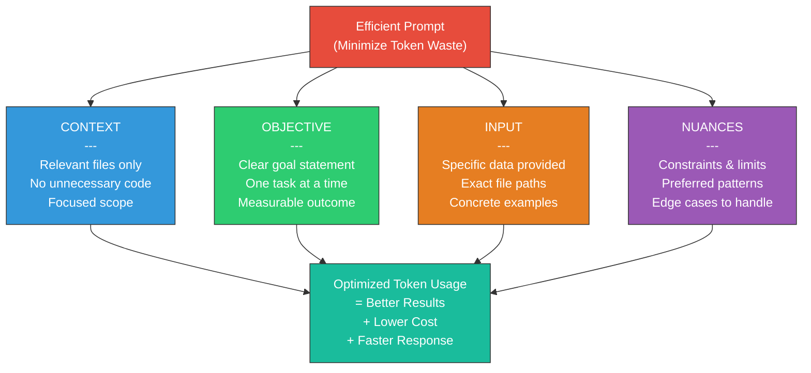

# Fase 6-8 -- Moedas Sabias: Como Economizar Tokens no GitHub Copilot

---

## Change Log

| Versao | Data       | Autor        | Descricao                          |
|--------|------------|--------------|------------------------------------|
| 1.0.0  | 2026-03-18 | Paula Silva  | Criacao inicial com analogias Mario |

---

## Sumario

- [Prologo: O Orcamento de Moedas do Mushroom Kingdom](#prologo-o-orcamento-de-moedas-do-mushroom-kingdom)
- [1. O que sao Tokens?](#1-o-que-sao-tokens)
  - [1.1 Tokens como Moedas do Mario](#11-tokens-como-moedas-do-mario)
  - [1.2 Como a Tokenizacao Funciona](#12-como-a-tokenizacao-funciona)
  - [1.3 A Janela de Contexto: O Tamanho da Bolsa de Moedas](#13-a-janela-de-contexto-o-tamanho-da-bolsa-de-moedas)
  - [1.4 Tabela: Modelos e seus Limites de Moedas](#14-tabela-modelos-e-seus-limites-de-moedas)
- [2. Gerenciamento de Contexto no VS Code](#2-gerenciamento-de-contexto-no-vs-code)
  - [2.1 O Inventario do Jogador: O que o Copilot Ve](#21-o-inventario-do-jogador-o-que-o-copilot-ve)
  - [2.2 Abas Abertas = Itens Equipados](#22-abas-abertas--itens-equipados)
  - [2.3 Arquivos Relevantes vs Ruido](#23-arquivos-relevantes-vs-ruido)
  - [2.4 O Poder do .github/copilot-instructions.md](#24-o-poder-do-githubcopilot-instructionsmd)
  - [2.5 Workspace Indexing: O Mapa Completo da Fase](#25-workspace-indexing-o-mapa-completo-da-fase)
  - [2.6 Pratica: Organizando seu Inventario](#26-pratica-organizando-seu-inventario)
- [3. Otimizacao do Chat](#3-otimizacao-do-chat)
  - [3.1 Prompts Desperdicadores vs Prompts Eficientes](#31-prompts-desperdicadores-vs-prompts-eficientes)
  - [3.2 A Regra do Bloco Multi-Moedas](#32-a-regra-do-bloco-multi-moedas)
  - [3.3 Variaveis de Chat: Atalhos de Warp Pipe](#33-variaveis-de-chat-atalhos-de-warp-pipe)
  - [3.4 Historico de Conversa: A Memoria do Jogador](#34-historico-de-conversa-a-memoria-do-jogador)
  - [3.5 Quando Iniciar Nova Conversa](#35-quando-iniciar-nova-conversa)
  - [3.6 Tabela: Custo Aproximado por Tipo de Interacao](#36-tabela-custo-aproximado-por-tipo-de-interacao)
- [4. Otimizacao de Completions (Inline)](#4-otimizacao-de-completions-inline)
  - [4.1 O Auto-Complete Inteligente](#41-o-auto-complete-inteligente)
  - [4.2 Contexto de Completions: O Raio de Visao do Mario](#42-contexto-de-completions-o-raio-de-visao-do-mario)
  - [4.3 Comentarios como Guias: Placas Indicativas na Fase](#43-comentarios-como-guias-placas-indicativas-na-fase)
  - [4.4 Naming Conventions: Nomes que Contam Historias](#44-naming-conventions-nomes-que-contam-historias)
  - [4.5 Pratica: Maximizando Completions com Minimo de Tokens](#45-pratica-maximizando-completions-com-minimo-de-tokens)
- [5. Eficiencia no Agent Mode](#5-eficiencia-no-agent-mode)
  - [5.1 Agent Mode: Yoshi no Autopilot — Poderoso mas Caro](#51-agent-mode-yoshi-no-autopilot--poderoso-mas-caro)
  - [5.2 A Anatomia de uma Sessao Agent Mode](#52-a-anatomia-de-uma-sessao-agent-mode)
  - [5.3 Estrategias para Reduzir Custo no Agent Mode](#53-estrategias-para-reduzir-custo-no-agent-mode)
  - [5.4 Agent Mode vs Ask Mode vs Completions: Quando Usar Cada Um](#54-agent-mode-vs-ask-mode-vs-completions-quando-usar-cada-um)
  - [5.5 Background Agents e Consumo de Tokens](#55-background-agents-e-consumo-de-tokens)
  - [5.6 Tabela: Custo Relativo por Modo](#56-tabela-custo-relativo-por-modo)
- [6. Governanca Enterprise](#6-governanca-enterprise)
  - [6.1 O Rei Precisa Controlar o Tesouro](#61-o-rei-precisa-controlar-o-tesouro)
  - [6.2 Politicas de Uso: Regras do Torneio](#62-politicas-de-uso-regras-do-torneio)
  - [6.3 Controles de Acesso e Permissoes](#63-controles-de-acesso-e-permissoes)
  - [6.4 Monitoramento de Consumo: O Placar do Jogo](#64-monitoramento-de-consumo-o-placar-do-jogo)
  - [6.5 Content Exclusions: Areas Proibidas do Mapa](#65-content-exclusions-areas-proibidas-do-mapa)
  - [6.6 Audit Logs: O Replay da Partida](#66-audit-logs-o-replay-da-partida)
  - [6.7 Tabela: Controles Enterprise Disponiveis](#67-tabela-controles-enterprise-disponiveis)
- [7. Selecao de Modelos](#7-selecao-de-modelos)
  - [7.1 Cada Fase Pede um Power-Up Diferente](#71-cada-fase-pede-um-power-up-diferente)
  - [7.2 Modelos Disponiveis no Copilot](#72-modelos-disponiveis-no-copilot)
  - [7.3 Custo vs Capacidade: A Matriz de Decisao](#73-custo-vs-capacidade-a-matriz-de-decisao)
  - [7.4 Quando Usar Cada Modelo](#74-quando-usar-cada-modelo)
  - [7.5 Multi-Model Strategy: Combinando Power-Ups](#75-multi-model-strategy-combinando-power-ups)
- [8. Metricas de ROI](#8-metricas-de-roi)
  - [8.1 Medindo o Retorno: Quantas Moedas Voce Economizou?](#81-medindo-o-retorno-quantas-moedas-voce-economizou)
  - [8.2 Metricas de Produtividade](#82-metricas-de-produtividade)
  - [8.3 Metricas de Qualidade](#83-metricas-de-qualidade)
  - [8.4 Metricas de Custo](#84-metricas-de-custo)
  - [8.5 O Dashboard do Copilot: Seu Placar em Tempo Real](#85-o-dashboard-do-copilot-seu-placar-em-tempo-real)
  - [8.6 Calculando ROI na Pratica](#86-calculando-roi-na-pratica)
  - [8.7 Tabela: Framework de ROI Completo](#87-tabela-framework-de-roi-completo)
- [9. Guia Pratico: 10 Regras de Ouro para Economizar Tokens](#9-guia-pratico-10-regras-de-ouro-para-economizar-tokens)
- [10. Tabela Final de Resumo](#10-tabela-final-de-resumo)
- [Referencias](#referencias)

---

## Prologo: O Orcamento de Moedas do Mushroom Kingdom

Sofia havia aprendido a dominar os agentes, criar skills, definir instrucoes, usar prompts reutilizaveis, configurar hooks, conectar ferramentas via MCP e ate orquestrar multiplos agentes em harmonia. Mas havia um segredo que os jogadores avancados do Mushroom Kingdom conheciam bem: **as moedas nao sao infinitas**.

No Super Mario, cada fase tem um numero limitado de moedas. Um jogador novato corre pela fase inteira, pegando 1 moeda aqui, 1 moeda ali -- gastando tempo e energia para acumular trocados. Ja o jogador experiente sabe onde estao os **blocos multi-moedas** -- aqueles blocos que, quando atingidos repetidamente, liberam 5, 10, 15 moedas de uma vez. O jogador mestre conhece os **blocos invisiveis** e as **salas secretas** cheias de moedas.

Tokens no GitHub Copilot funcionam exatamente assim. Cada interacao consome tokens -- suas moedas digitais. Um prompt desperdicador e como correr pela fase pegando 1 moeda por vez. Um prompt otimizado e como encontrar o bloco multi-moedas. E este capitulo vai ensinar voce a ser o jogador que **sempre encontra as salas secretas**.

*"Moedas nao sao infinitas, Sofia. Mas com sabedoria, 100 moedas valem mais que 1.000."*

---

### Diagrama: Otimizacao de Tokens - Framework COIN



## 1. O que sao Tokens?

### 1.1 Tokens como Moedas do Mario

No Mushroom Kingdom digital do GitHub Copilot, **tokens sao as moedas** que alimentam toda a magia. Assim como Mario precisa de moedas para comprar power-ups, o Copilot precisa de tokens para processar suas requisicoes.

Um **token** e a menor unidade de texto que um modelo de linguagem processa. Nao e exatamente uma palavra -- e mais como uma "peca de LEGO linguistica". Exemplos:

```
"Desenvolvimento" = 3-4 tokens (o modelo quebra em pedacos)
"Dev"             = 1 token (curto o suficiente para ser uma peca so)
"Hello World"     = 2 tokens
"function getData() { return fetch('/api') }" = ~12 tokens
```

**A analogia perfeita**: Imagine que cada token e uma moeda do Mario. Quando voce faz uma pergunta ao Copilot, voce esta:

1. **Pagando moedas de ENTRADA** (seu prompt + contexto) -- as moedas que voce coloca no bloco
2. **Recebendo moedas de SAIDA** (a resposta do Copilot) -- as moedas que saem do bloco

Quanto mais longo seu prompt, mais moedas de entrada. Quanto mais longa a resposta, mais moedas de saida. **Ambas contam no seu orcamento.**

### 1.2 Como a Tokenizacao Funciona

O processo de tokenizacao e como o jogo transforma o cenario em blocos:

```
Texto original:     "Crie uma funcao que calcula o IMC"
                          |
                     [Tokenizador]
                          |
Tokens resultantes:  ["Crie", " uma", " func", "ao", " que",
                      " calc", "ula", " o", " IM", "C"]
                          |
                    Total: ~10 tokens
```

**Regras praticas** para estimar tokens:

| Idioma    | Regra Geral                          | Exemplo                    |
|-----------|--------------------------------------|----------------------------|
| Ingles    | 1 token ~ 4 caracteres / 0.75 palavras | "Hello world" ~ 2 tokens |
| Portugues | 1 token ~ 3 caracteres (mais caro!)  | "Ola mundo" ~ 3-4 tokens  |
| Codigo    | 1 token ~ 3-4 caracteres             | `console.log()` ~ 4 tokens |
| JSON      | Tokens extras para formatacao        | `{"key": "value"}` ~ 7 tokens |

**Atencao**: Portugues consome **mais tokens** que ingles para o mesmo conteudo. Isso acontece porque os modelos foram treinados predominantemente em ingles, entao palavras em portugues sao "quebradas" em mais pedacos. E como se moedas brasileiras valessem menos no Mushroom Kingdom -- voce precisa de mais moedas para comprar o mesmo item.

### 1.3 A Janela de Contexto: O Tamanho da Bolsa de Moedas

Cada modelo tem uma **janela de contexto** -- o numero maximo de tokens que pode processar de uma vez. Pense nisso como o tamanho da bolsa de moedas do Mario:

```
+--------------------------------------------------+
|  JANELA DE CONTEXTO = BOLSA DE MOEDAS            |
|                                                  |
|  [Prompt do usuario]     -> Moedas de entrada    |
|  [Contexto dos arquivos] -> Moedas de entrada    |
|  [Instrucoes do sistema] -> Moedas de entrada    |
|  [Historico da conversa] -> Moedas de entrada    |
|  [Resposta do modelo]    -> Moedas de saida      |
|                                                  |
|  TUDO junto precisa CABER na bolsa!              |
+--------------------------------------------------+
```

Se a bolsa esta cheia, o modelo **descarta** as informacoes mais antigas -- como moedas caindo pelo buraco quando a bolsa transborda. E por isso que conversas muito longas perdem contexto: as primeiras mensagens "caem" para abrir espaco.

### 1.4 Tabela: Modelos e seus Limites de Moedas

| Modelo          | Janela de Contexto | Analogia Mario                                   |
|-----------------|-------------------|--------------------------------------------------|
| GPT-4o          | 128K tokens       | Bolsa grande -- cabe o mapa inteiro de um World  |
| GPT-4o mini     | 128K tokens       | Bolsa grande mas mais barata -- moedas de bronze |
| Claude 3.5 Sonnet| 200K tokens      | Bolsa enorme -- cabe o mapa de dois Worlds       |
| Claude Opus 4   | 200K+ tokens      | Mochila de explorador -- a maior disponivel      |
| o1              | 128K tokens       | Bolsa especial -- moedas valem mais (raciocinio) |
| Gemini 2.0      | 1M+ tokens        | Bau do tesouro -- cabe quase tudo                |

---

## 2. Gerenciamento de Contexto no VS Code

### 2.1 O Inventario do Jogador: O que o Copilot Ve

Quando voce abre o VS Code e usa o Copilot, ele nao ve **tudo** no seu computador. Ele ve apenas o que esta no seu **inventario ativo** -- como Mario so pode usar os itens que estao equipados, nao os que estao guardados no bau.

O contexto que o Copilot recebe inclui:

```
+-----------------------------------------------+
|  INVENTARIO DO COPILOT (Context Window)       |
|                                               |
|  1. [Arquivo atual]    -- Item principal      |
|  2. [Abas abertas]     -- Itens equipados     |
|  3. [Imports/deps]     -- Itens relacionados  |
|  4. [copilot-instructions] -- Regras do jogo  |
|  5. [Historico chat]   -- Memoria recente     |
|  6. [Workspace index]  -- Mapa da fase        |
|                                               |
|  TOTAL: Tudo somado deve caber na janela!     |
+-----------------------------------------------+
```

### 2.2 Abas Abertas = Itens Equipados

Cada aba aberta no VS Code e um item que o Copilot **pode** consultar como contexto. Mas cuidado -- mais abas abertas significa mais tokens consumidos para dar contexto ao modelo.

**O erro do jogador novato**: Abrir 30 abas e esperar que o Copilot "entenda tudo". Isso e como carregar 30 itens no inventario -- voce fica pesado e lento.

**A estrategia do jogador experiente**:

```
ERRADO (30 abas, inventario lotado):
+--+--+--+--+--+--+--+--+--+--+--+--+--+--+--+
|  |  |  |  |  |  |  |  |  |  |  |  |  |  |  | ...
+--+--+--+--+--+--+--+--+--+--+--+--+--+--+--+
  ^-- Copilot confuso, contexto poluido, tokens desperdicados

CERTO (3-5 abas relevantes):
+----------+----------+----------+
| Model.ts | Service  | Test.ts  |
+----------+----------+----------+
  ^-- Copilot focado, contexto limpo, tokens otimizados
```

**Regra pratica**: Mantenha abertas apenas as **3 a 5 abas** diretamente relacionadas ao que voce esta fazendo. Feche todo o resto.

### 2.3 Arquivos Relevantes vs Ruido

O Copilot usa heuristicas para decidir quais arquivos sao relevantes. Voce pode ajuda-lo sendo explicito:

**Tecnica 1 -- Mencoes diretas no chat**:
```
@workspace Olhe o arquivo src/models/User.ts e crie um
service similar para Product
```

**Tecnica 2 -- Abrir arquivos de referencia antes de perguntar**:
Se voce quer que o Copilot siga um padrao, abra um arquivo que exemplifique esse padrao antes de pedir.

**Tecnica 3 -- Usar `#file` no chat**:
```
Refatore #file:src/services/auth.ts seguindo o padrao
de #file:src/services/user.ts
```

Isso e como apontar para o Mario exatamente qual bloco bater, em vez de deixar ele correndo a fase toda procurando.

### 2.4 O Poder do .github/copilot-instructions.md

O arquivo `copilot-instructions.md` e a **gravidade** do seu projeto -- sempre ativa, sempre presente, sem custo adicional significativo por interacao. Ele define regras que o Copilot segue automaticamente:

```markdown
# Copilot Instructions

## Estilo de Codigo
- Use TypeScript strict mode
- Prefira interfaces a types
- Funcoes puras sempre que possivel

## Padroes do Projeto
- Repository Pattern para acesso a dados
- Services para logica de negocios
- Controllers finos (apenas roteamento)

## Convencoes
- Nomes em ingles para codigo
- Comentarios em portugues
- Commits seguindo Conventional Commits
```

**Por que economiza tokens**: Sem esse arquivo, voce precisaria repetir essas instrucoes em CADA prompt. Com ele, o Copilot ja sabe. E como a gravidade -- voce nao precisa dizer "aplique gravidade" em cada fase.

**Custo real**: O arquivo e incluido como contexto em cada interacao, mas se for conciso (200-500 palavras), o custo e minimo comparado a repetir instrucoes manualmente em cada prompt.

### 2.5 Workspace Indexing: O Mapa Completo da Fase

O Copilot indexa todo o workspace para entender a estrutura do projeto. Isso custa tokens inicialmente, mas economiza tokens a longo prazo:

```
SEM INDEXACAO:
  Voce: "Onde esta a funcao de autenticacao?"
  Copilot: "Nao sei. Me de mais contexto." (tokens desperdicados)
  Voce: "Esta em src/services/auth.ts, funcao validateToken"
  Copilot: "Agora entendi. [resposta]" (tokens duplicados)

COM INDEXACAO:
  Voce: "Onde esta a funcao de autenticacao?"
  Copilot: "Encontrei em src/services/auth.ts, funcao
            validateToken. [resposta completa]" (tokens otimizados)
```

E como a diferenca entre jogar uma fase no escuro vs com o mapa revelado. O mapa custa moedas para comprar, mas economiza muito mais evitando caminhos errados.

### 2.6 Pratica: Organizando seu Inventario

**Exercicio -- Antes e Depois**:

```
ANTES (Inventario desorganizado):
- 25 abas abertas (15 irrelevantes)
- Sem copilot-instructions.md
- Prompts vagos: "arruma isso"
- Resultado: ~2000 tokens por interacao

DEPOIS (Inventario otimizado):
- 4 abas abertas (todas relevantes)
- copilot-instructions.md configurado
- Prompts especificos: "Adicione validacao de email
  no UserService.createUser, seguindo o padrao de
  validatePhone que ja existe"
- Resultado: ~800 tokens por interacao = 60% economia
```

---

## 3. Otimizacao do Chat

### 3.1 Prompts Desperdicadores vs Prompts Eficientes

A diferenca entre um prompt desperdicador e um eficiente e a mesma entre correr pela fase inteira pegando 1 moeda por vez vs bater no bloco multi-moedas:

```
DESPERDICADOR (1 moeda por vez):
  "O que e um service?"
  "Como criar um service?"
  "Me da um exemplo de service"
  "Agora adapta pro meu projeto"
  "Agora adiciona validacao"
  Total: 5 interacoes, ~5000 tokens

EFICIENTE (Bloco multi-moedas):
  "Crie um ProductService em src/services/product.ts
   seguindo o padrao de UserService, com metodos CRUD
   e validacao de campos obrigatorios (name, price).
   Use o repositorio ProductRepository."
  Total: 1 interacao, ~1500 tokens = 70% economia
```

### 3.2 A Regra do Bloco Multi-Moedas

Para criar prompts eficientes, siga o padrao **COIN**:

| Letra | Significado | Exemplo |
|-------|-------------|---------|
| **C** | **Contexto** -- Onde estou no jogo | "No arquivo src/services/" |
| **O** | **Objetivo** -- O que quero | "Crie um service de produtos" |
| **I** | **Input/Referencia** -- Exemplos a seguir | "Seguindo o padrao de UserService" |
| **N** | **Nuances** -- Detalhes especificos | "Com validacao, TypeScript strict, sem any" |

**Exemplo completo usando COIN**:

```
[C] Estou trabalhando no backend do TodoApp em TypeScript.
[O] Preciso criar um endpoint POST /api/products que
    recebe name, price e category.
[I] Siga o padrao do endpoint POST /api/todos que ja existe
    em src/routes/todos.ts.
[N] Adicione validacao com Zod, retorne 201 com o produto
    criado, e 400 se falhar validacao. Sem usar 'any'.
```

### 3.3 Variaveis de Chat: Atalhos de Warp Pipe

O VS Code oferece variaveis especiais no chat do Copilot que funcionam como Warp Pipes -- atalhos que economizam tokens:

| Variavel | O que faz | Economia |
|----------|-----------|----------|
| `#file:caminho` | Inclui conteudo do arquivo | Evita copiar/colar |
| `#selection` | Inclui texto selecionado | Foca no trecho exato |
| `#terminalLastCommand` | Inclui ultimo comando e saida | Evita descrever erros |
| `@workspace` | Busca no projeto inteiro | Evita "onde esta X?" |
| `#codebase` | Referencia o codebase indexado | Contexto amplo e eficiente |

**Exemplo de economia**:

```
SEM variaveis (desperdicador):
  "Tenho esse erro: TypeError: Cannot read properties
   of undefined (reading 'map') no arquivo
   src/components/TodoList.tsx na linha 42 onde eu
   faco todos.map(todo => ...) e o todos vem do
   hook useTodos que retorna..."
  (~80 tokens so para descrever o problema)

COM variaveis (eficiente):
  "Corrija o erro em #selection do #file:src/components/TodoList.tsx.
   O #terminalLastCommand mostra o stack trace."
  (~25 tokens para o mesmo problema = 70% economia)
```

### 3.4 Historico de Conversa: A Memoria do Jogador

Cada mensagem anterior na conversa e incluida como contexto na proxima mensagem. Isso significa que conversas longas ficam **exponencialmente mais caras**:

```
Mensagem 1:  [prompt 1] + [resposta 1]                    = 500 tokens
Mensagem 2:  [prompt 1] + [resposta 1] + [prompt 2] + [resposta 2] = 1500 tokens
Mensagem 3:  [tudo anterior] + [prompt 3] + [resposta 3]  = 3000 tokens
Mensagem 10: [TUDO]                                        = 15000+ tokens
```

E como uma bola de neve rolando ladeira abaixo -- comeca pequena e fica enorme.

### 3.5 Quando Iniciar Nova Conversa

| Situacao | Acao | Analogia Mario |
|----------|------|----------------|
| Mudou de assunto | Nova conversa | Comecou nova fase -- reset do inventario |
| Conversa > 10 mensagens | Nova conversa com resumo | Fase muito longa -- use o Warp Zone |
| Resposta ficou confusa | Nova conversa reformulando | Game Over -- restart da fase |
| Mesmo assunto, refinando | Continue na conversa | Mesma fase -- mantenha os power-ups |

**Tecnica avancada -- Resumo de Transicao**:

```
"Resuma nossa conversa anterior sobre o ProductService
em 3 bullet points e depois continue implementando o
metodo de busca por categoria."
```

Isso comprime 10 mensagens em 1 paragrafo -- como um Warp Pipe que te leva direto onde parou.

### 3.6 Tabela: Custo Aproximado por Tipo de Interacao

| Tipo de Interacao | Tokens Tipicos (Entrada) | Tokens Tipicos (Saida) | Analogia |
|-------------------|-------------------------|----------------------|----------|
| Completion inline | 500-2000 | 50-200 | Moeda individual |
| Chat simples | 1000-3000 | 200-1000 | Bloco de moedas |
| Chat com `#file` | 2000-5000 | 500-2000 | Bloco multi-moedas |
| Chat com `@workspace` | 3000-8000 | 500-3000 | Sala secreta de moedas |
| Agent Mode (sessao) | 10000-50000 | 5000-20000 | Fase inteira de bonus |

---

## 4. Otimizacao de Completions (Inline)

### 4.1 O Auto-Complete Inteligente

Completions sao as sugestoes que aparecem enquanto voce digita -- o fantasma cinza que completa seu codigo. Sao a forma **mais barata** de usar o Copilot porque processam pouco contexto e geram pouco texto.

```
Voce digita:    function calculateTotalPrice(items
Copilot sugere: : CartItem[]): number {
                  return items.reduce((total, item) =>
                    total + item.price * item.quantity, 0);
                }
```

**Custo**: Baixo. Completions usam uma janela de contexto reduzida (geralmente o arquivo atual + abas abertas proximo). Sao como moedas que aparecem no caminho -- voce pega sem desviar.

### 4.2 Contexto de Completions: O Raio de Visao do Mario

O Copilot para completions olha principalmente para:

```
+------------------------------------------+
|  RAIO DE VISAO (Completion Context)      |
|                                          |
|  1. Linhas ACIMA do cursor (principal)   |
|  2. Linhas ABAIXO do cursor (secundario) |
|  3. Abas abertas relacionadas            |
|  4. Imports do arquivo                   |
|  5. Tipos e interfaces                   |
|                                          |
|  NAO olha: Arquivos fechados, pastas     |
|  distantes, terminal, chat anterior      |
+------------------------------------------+
```

**Otimizacao**: Coloque as definicoes e tipos **antes** do codigo que os usa. Isso maximiza o contexto disponivel sem custo extra.

### 4.3 Comentarios como Guias: Placas Indicativas na Fase

Comentarios antes do codigo funcionam como placas indicativas que guiam o Copilot:

```typescript
// BAD: Sem comentario (Copilot adivinha)
function process(data) {
  // Copilot: ??? (pode gerar qualquer coisa)
}

// GOOD: Com comentario direcionador (Copilot sabe o que fazer)
// Valida os campos obrigatorios do produto (name, price > 0)
// Retorna { valid: boolean, errors: string[] }
function validateProduct(data: ProductInput): ValidationResult {
  // Copilot: Gera exatamente o que foi descrito
}
```

**Custo de um comentario**: ~10-20 tokens. **Economia por gerar codigo correto de primeira**: ~500-2000 tokens (evita correcoes no chat).

### 4.4 Naming Conventions: Nomes que Contam Historias

Nomes descritivos sao contexto **gratis** -- o modelo entende a intencao pelo nome:

```typescript
// RUIM: Nomes genericos = Copilot perdido = mais correcoes depois
function proc(d: any): any { }
const x = getData();

// BOM: Nomes descritivos = Copilot certeiro = zero correcoes
function validateAndTransformUserInput(rawInput: UserFormData): ValidatedUser { }
const activeSubscriptions = getActiveSubscriptionsByPlan(planId);
```

**Custo**: Zero tokens extras. **Economia**: Enorme -- nomes bons sao como placas que guiam o Copilot pelo caminho certo sem gastar moedas adicionais.

### 4.5 Pratica: Maximizando Completions com Minimo de Tokens

**Receita para completions otimizadas**:

1. **Abra os arquivos de referencia** (tipos, interfaces, servicos relacionados)
2. **Escreva a assinatura da funcao** com tipos explicitos
3. **Adicione um comentario** de 1-2 linhas descrevendo o comportamento
4. **Comece a digitar** e deixe o Copilot completar
5. **Aceite com Tab** se estiver correto, **rejeite e refine o comentario** se nao

```
Custo total dessa abordagem:  ~300 tokens
Custo de pedir no chat:       ~2000 tokens
Economia:                     ~85%
```

---

## 5. Eficiencia no Agent Mode

### 5.1 Agent Mode: Yoshi no Autopilot -- Poderoso mas Caro

Agent Mode e como colocar o Yoshi no autopilot -- ele corre, pula, come inimigos e completa a fase por voce. Mas cada acao que o Yoshi toma consome moedas. E ele faz **muitas** acoes:

```
CICLO DE UM AGENT MODE TIPICO:
  1. Le seu prompt                        (~500 tokens)
  2. Analisa o workspace                  (~2000 tokens)
  3. Le arquivos relevantes               (~3000 tokens)
  4. Planeja a solucao                    (~1000 tokens)
  5. Gera codigo                          (~2000 tokens)
  6. Verifica erros                       (~1000 tokens)
  7. Ajusta se necessario                 (~2000 tokens)
  8. Roda testes (se configurado)         (~1500 tokens)
  9. Apresenta resultado                  (~500 tokens)
                                    _______________
                          TOTAL:    ~13500 tokens (1 tarefa)
```

Compare com uma completion inline que custa ~300 tokens. Agent Mode e **45x mais caro** por interacao.

### 5.2 A Anatomia de uma Sessao Agent Mode

Entender o que acontece "por tras das cortinas" ajuda a otimizar:

```
+--------------------------------------------------+
|  AGENT MODE -- Fluxo Interno                     |
|                                                  |
|  [Seu Prompt]                                    |
|       |                                          |
|       v                                          |
|  [System Prompt + Instructions]  <-- Tokens fixos|
|       |                                          |
|       v                                          |
|  [Analise do Workspace]  <-- Tokens variavies    |
|       |                                          |
|       v                                          |
|  [Leitura de Arquivos]  <-- Tokens variavies     |
|       |                                          |
|       v                                          |
|  [Planejamento]  <-- Tokens de raciocinio        |
|       |                                          |
|       v                                          |
|  [Execucao: Editar/Criar/Deletar]                |
|       |                                          |
|       v                                          |
|  [Verificacao e Loop]  <-- Pode repetir N vezes! |
|       |                                          |
|       v                                          |
|  [Resultado Final]                               |
+--------------------------------------------------+
```

O ponto critico e o **loop de verificacao** -- se o Agent Mode encontra erros, ele tenta corrigir automaticamente, e cada tentativa consome mais tokens. Um loop de 5 tentativas pode transformar uma tarefa de 13.000 tokens em 50.000+.

### 5.3 Estrategias para Reduzir Custo no Agent Mode

**Estrategia 1 -- Seja Especifico (Evite Loops)**:

```
RUIM (vago -- Agent Mode vai explorar muito):
  "Melhore o codigo do backend"
  -> Agent le TUDO, tenta TUDO, gasta MUITAS moedas

BOM (especifico -- Agent Mode vai direto ao ponto):
  "No arquivo src/services/todo.ts, adicione tratamento
   de erro try/catch nos metodos create e update,
   logando erros com winston e retornando erro 500."
  -> Agent le 2 arquivos, faz 2 mudancas, gasta POUCAS moedas
```

**Estrategia 2 -- Forneca Contexto Pre-Digerido**:

```
CARO (Agent Mode descobre sozinho):
  "Faca testes para o TodoService"
  -> Agent precisa: ler o service, entender a estrutura,
     descobrir o framework de testes, achar exemplos...

BARATO (voce deu o contexto):
  "Crie testes Jest para TodoService (#file:src/services/todo.ts)
   seguindo o padrao de #file:src/services/__tests__/user.test.ts.
   Teste os metodos create, getAll e delete."
  -> Agent ja sabe TUDO que precisa, vai direto.
```

**Estrategia 3 -- Quebre em Tarefas Menores**:

```
CARO (uma mega-tarefa):
  "Crie um modulo completo de autenticacao com login,
   registro, reset de senha, JWT, middleware, testes
   e documentacao."
  -> Uma sessao ENORME que pode falhar no meio

BARATO (varias tarefas menores):
  Sessao 1: "Crie o model User com campos email e passwordHash"
  Sessao 2: "Crie o AuthService com login e register"
  Sessao 3: "Crie o middleware de autenticacao JWT"
  Sessao 4: "Crie testes para o AuthService"
  -> 4 sessoes menores, mais controlaveis, total menor
```

### 5.4 Agent Mode vs Ask Mode vs Completions: Quando Usar Cada Um

| Tarefa | Modo Recomendado | Custo Relativo | Analogia Mario |
|--------|-----------------|---------------|----------------|
| Completar uma linha | Completion | 1x (moeda) | Moeda no caminho |
| Entender um conceito | Ask Mode | 3x (bloco) | Toad's Hint House |
| Planejar uma feature | Ask/Plan Mode | 5x (blocos) | Mapa da fase |
| Implementar feature simples | Agent Mode | 15x (sala) | Yoshi ajudando |
| Refatorar modulo complexo | Agent Mode | 30x (fase) | Yoshi no autopilot |
| Criar modulo do zero | Agent Mode | 50x (world) | Fase inteira de bonus |

**Regra de ouro**: Use o modo **mais barato** que resolve o problema. Nao mande o Yoshi fazer o que uma simples moeda no caminho resolve.

### 5.5 Background Agents e Consumo de Tokens

Background Agents (Coding Agents) rodam de forma independente, geralmente no GitHub. Eles consomem tokens sem voce ver em tempo real -- como um NPC trabalhando em um castelo distante.

**Cuidados**:

- Defina **escopo claro** na issue antes de acionar o agent
- Use **exit criteria** especificos para evitar loops infinitos
- Monitore o consumo no dashboard do GitHub
- Prefira tarefas **bem definidas e isoladas**

```
BOM para Background Agent:
  "Atualize todas as dependencias do package.json para
   as versoes mais recentes, rode os testes, e crie
   um PR com as mudancas."

RUIM para Background Agent:
  "Melhore a qualidade do codigo do projeto."
  (Vago demais -- agent pode rodar indefinidamente)
```

### 5.6 Tabela: Custo Relativo por Modo

| Modo | Tokens por Interacao | Custo Relativo | Melhor Para |
|------|---------------------|---------------|-------------|
| Completion Inline | 300-2000 | 1x | Completar linhas e funcoes |
| Chat Ask Mode | 1000-5000 | 3-5x | Perguntas e explicacoes |
| Chat Edit Mode | 2000-8000 | 5-10x | Edicoes pontuais |
| Agent Mode (simples) | 5000-15000 | 10-20x | Features pequenas |
| Agent Mode (complexo) | 15000-50000 | 30-60x | Features grandes |
| Background Agent | 50000-200000 | 80-200x | Tarefas autonomas |

---

## 6. Governanca Enterprise

### 6.1 O Rei Precisa Controlar o Tesouro

Em uma empresa, tokens sao como as moedas do Tesouro Real do Mushroom Kingdom. O Rei (administrador) precisa garantir que:

- Ninguem gaste moedas demais
- As moedas sejam usadas em missoes que importam
- Existam registros de cada gasto
- Areas proibidas do mapa estejam bloqueadas

### 6.2 Politicas de Uso: Regras do Torneio

O GitHub Copilot Enterprise e Business permitem configurar politicas que funcionam como regras de torneio:

```
+--------------------------------------------------+
|  POLITICAS ENTERPRISE                            |
|                                                  |
|  [x] Habilitar Copilot Chat                     |
|  [x] Habilitar Completions                      |
|  [x] Habilitar Agent Mode                       |
|  [ ] Permitir modelos de terceiros               |
|  [x] Exigir review de codigo gerado             |
|  [x] Bloquear em repositorios privados criticos |
|                                                  |
|  Modelos permitidos: GPT-4o, Claude Sonnet       |
|  Modelos bloqueados: (nenhum nao-auditado)       |
+--------------------------------------------------+
```

### 6.3 Controles de Acesso e Permissoes

| Nivel | Quem Controla | O que Configura | Analogia |
|-------|--------------|-----------------|----------|
| Organization | Admin da org | Politicas globais, modelos permitidos | Rei do Mushroom Kingdom |
| Team | Lider do time | Ajustes por equipe | Capitao do esquadrao |
| Repository | Maintainer | Regras especificas do repo | Guardiao do castelo |
| Individual | Desenvolvedor | Preferencias pessoais | Estilo de jogo do jogador |

### 6.4 Monitoramento de Consumo: O Placar do Jogo

O GitHub oferece dashboards de consumo do Copilot que funcionam como o placar do jogo:

**Metricas disponiveis**:

- **Sugestoes aceitas vs rejeitadas** -- Taxa de acerto do Copilot
- **Linhas de codigo geradas** -- Produtividade
- **Usuarios ativos** -- Quem esta jogando
- **Linguagens mais usadas** -- Quais mundos sao mais populares
- **Tendencias ao longo do tempo** -- Melhoria ou piora

```
DASHBOARD EXEMPLO:
+--------------------------------------------------+
|  COPILOT USAGE -- Mushroom Kingdom Stats         |
|                                                  |
|  Usuarios ativos:     42 / 50 licencas           |
|  Taxa de aceitacao:   35%                        |
|  Linhas geradas:      12,450 esta semana         |
|  Modo mais usado:     Completions (72%)          |
|  Linguagem top:       TypeScript (45%)           |
|                                                  |
|  [==========----------] 35% acceptance rate      |
|  Meta: 40%                                       |
+--------------------------------------------------+
```

### 6.5 Content Exclusions: Areas Proibidas do Mapa

Content Exclusions permitem bloquear o Copilot de acessar certos arquivos ou repositorios:

```yaml
# .github/copilot-content-exclusions.yaml
exclusions:
  - path: "**/*.env"           # Segredos -- area proibida!
  - path: "**/secrets/**"      # Cofre do tesouro -- ninguem entra
  - path: "**/legacy/**"       # Castelo abandonado -- nao copie isso
  - repo: "company/compliance" # Repo de compliance -- so humanos
```

E como marcar areas do mapa como "proibidas" -- o Mario simplesmente nao consegue entrar ali.

### 6.6 Audit Logs: O Replay da Partida

Audit logs registram todas as interacoes com o Copilot:

| Evento | O que Registra | Para que Serve |
|--------|---------------|---------------|
| `copilot.suggestion_accepted` | Sugestao aceita | Medir adocao |
| `copilot.suggestion_rejected` | Sugestao rejeitada | Identificar problemas |
| `copilot.chat_interaction` | Uso do chat | Medir engajamento |
| `copilot.agent_session` | Sessao de agent mode | Monitorar custo alto |

### 6.7 Tabela: Controles Enterprise Disponiveis

| Controle | Copilot Individual | Copilot Business | Copilot Enterprise |
|----------|-------------------|-------------------|-------------------|
| Completions | Sim | Sim | Sim |
| Chat | Sim | Sim | Sim |
| Agent Mode | Sim | Sim | Sim |
| Content Exclusions | Nao | Sim | Sim |
| Audit Logs | Nao | Sim | Sim |
| Metricas de Uso | Basico | Avancado | Completo |
| Knowledge Bases | Nao | Nao | Sim |
| Politicas por Org | Nao | Sim | Sim |
| Fine-tuning de Modelos | Nao | Nao | Sim |
| IP Indemnity | Nao | Sim | Sim |

---

## 7. Selecao de Modelos

### 7.1 Cada Fase Pede um Power-Up Diferente

Voce nao usa o Super Star (invencibilidade) para pegar uma unica moeda. Da mesma forma, voce nao precisa do modelo mais caro para completar uma linha de codigo.

A selecao de modelo e uma das estrategias **mais impactantes** para otimizar tokens, porque modelos diferentes tem custos dramaticamente diferentes para o mesmo resultado.

### 7.2 Modelos Disponiveis no Copilot

O GitHub Copilot permite selecionar entre diferentes modelos no chat:

| Modelo | Forca | Fraqueza | Custo Relativo |
|--------|-------|----------|---------------|
| GPT-4o | Balanceado, bom em tudo | Pode ser excessivo para tarefas simples | Medio |
| GPT-4o mini | Rapido e barato | Menos preciso em tarefas complexas | Baixo |
| Claude 3.5 Sonnet | Otimo para codigo longo | Mais caro em tokens de entrada | Medio-Alto |
| Claude Opus 4 | Raciocinio avancado | Mais lento e mais caro | Alto |
| o1 | Raciocinio logico superior | Muito caro, muito lento | Muito Alto |
| o3-mini | Raciocinio bom e acessivel | Menos criativo | Medio |

### 7.3 Custo vs Capacidade: A Matriz de Decisao

```
CUSTO
  ^
  |  [o1]              <- Boss final (so quando realmente precisa)
  |
  |  [Claude Opus 4]   <- Castelo de Bowser (tarefas complexas)
  |
  |  [Claude Sonnet]   <- Fases intermediarias
  |  [GPT-4o]
  |
  |  [o3-mini]         <- Fases com raciocinio mas orcamento limitado
  |
  |  [GPT-4o mini]     <- Planicie Verde (dia a dia)
  |
  +---------------------------------> CAPACIDADE
```

### 7.4 Quando Usar Cada Modelo

| Tarefa | Modelo Recomendado | Justificativa |
|--------|-------------------|---------------|
| Completions no dia a dia | GPT-4o mini / Default | Rapido, barato, suficiente |
| Perguntas simples no chat | GPT-4o mini | Nao precisa de raciocinio profundo |
| Gerar codigo complexo | GPT-4o / Claude Sonnet | Bom equilibrio custo-qualidade |
| Refatoracao grande | Claude Sonnet / Opus | Janela de contexto ampla |
| Debugging complexo | o1 / o3-mini | Raciocinio logico superior |
| Revisao de arquitetura | Claude Opus / o1 | Analise profunda justifica o custo |
| Agent Mode features | GPT-4o / Claude Sonnet | Multiplas interacoes -- preco importa |

### 7.5 Multi-Model Strategy: Combinando Power-Ups

A estrategia mais inteligente e usar modelos diferentes para tarefas diferentes -- como usar power-ups diferentes em cada fase:

```
ESTRATEGIA MULTI-MODELO:

Fase do Dia         Modelo          Custo    Analogia
------------------------------------------------------------
Completions         GPT-4o mini     $       Moedas no caminho
Chat rapido         GPT-4o mini     $       Toad's Hint House
Feature nova        GPT-4o          $$      Super Mushroom
Refatoracao         Claude Sonnet   $$$     Fire Flower
Bug impossivel      o1              $$$$    Super Star
Revisao arquitetura Claude Opus     $$$$    Cape Feather

Media ponderada: $$ (em vez de $$$ se usasse GPT-4o para tudo)
```

---

## 8. Metricas de ROI

### 8.1 Medindo o Retorno: Quantas Moedas Voce Economizou?

ROI (Return on Investment) do Copilot e simples de pensar com a analogia Mario: **quantas fases a mais voce consegue completar com o mesmo numero de moedas?**

Na pratica, ROI = (Valor Gerado - Custo) / Custo

### 8.2 Metricas de Produtividade

| Metrica | Como Medir | Meta Tipica | Analogia |
|---------|-----------|------------|----------|
| Sugestoes aceitas (%) | Dashboard Copilot | >30% | Taxa de acerto do power-up |
| Linhas geradas por semana | Dashboard Copilot | Crescente | Moedas coletadas por fase |
| Tempo de desenvolvimento | Comparativo antes/depois | -30% | Tempo para completar a fase |
| PRs por semana | GitHub metrics | +20% | Fases completadas por sessao |
| Tempo ate primeira sugestao | Observacao | <1s | Tempo de reacao do companion |

### 8.3 Metricas de Qualidade

| Metrica | Como Medir | Meta Tipica | Analogia |
|---------|-----------|------------|----------|
| Bugs em producao | Issue tracker | Decrescente | Game Overs por World |
| Code review cycles | PR metrics | -25% | Tentativas ate passar o boss |
| Test coverage | CI/CD reports | >80% | Porcentagem do mapa explorado |
| Security issues | GHAS reports | Decrescente | Armadilhas nao detectadas |

### 8.4 Metricas de Custo

| Metrica | Como Medir | Consideracao |
|---------|-----------|-------------|
| Custo por licenca/mes | Fatura GitHub | $19 (Business) ou $39 (Enterprise) |
| Custo por hora de dev economizada | (Licenca / Horas economizadas) | Meta: <$5/hora |
| Custo evitado em bugs | (Bugs evitados x Custo medio de fix) | Geralmente 10-50x o custo da licenca |
| Custo de tokens adicionais | API usage (se aplicavel) | Monitorar picos |

### 8.5 O Dashboard do Copilot: Seu Placar em Tempo Real

O GitHub fornece metricas nativas em **github.com/organizations/{org}/settings/copilot/usage**:

```
+--------------------------------------------------+
|  COPILOT ROI DASHBOARD                           |
|  Mushroom Kingdom Metrics                        |
|                                                  |
|  PRODUTIVIDADE                                   |
|  [========--------] 42% acceptance rate          |
|  [==========------] 65% de devs ativos           |
|  12,450 linhas geradas esta semana               |
|                                                  |
|  ECONOMIA ESTIMADA                               |
|  Horas economizadas: ~120h/semana                |
|  Custo licencas: $1,950/mes (50 devs)            |
|  Valor gerado: ~$12,000/mes                      |
|  ROI: 515%                                       |
|                                                  |
+--------------------------------------------------+
```

### 8.6 Calculando ROI na Pratica

**Formula simplificada**:

```
ROI = ((Horas Economizadas x Custo/Hora) - Custo Licencas)
      / Custo Licencas x 100

Exemplo:
  - 50 desenvolvedores
  - Cada um economiza 5h/semana com Copilot
  - Custo/hora medio: $50
  - Custo licenca: $19/dev/mes (Business)

  Economia mensal = 50 devs x 5h x 4 semanas x $50 = $50,000
  Custo mensal    = 50 devs x $19 = $950
  ROI             = ($50,000 - $950) / $950 x 100 = 5,163%
```

Mesmo com estimativas conservadoras (2h/semana economizadas), o ROI e positivo. O Copilot se paga no primeiro dia de uso.

### 8.7 Tabela: Framework de ROI Completo

| Dimensao | Metrica | Fonte | Frequencia | Responsavel |
|----------|---------|-------|------------|-------------|
| Adocao | % usuarios ativos | Dashboard GitHub | Semanal | Admin |
| Adocao | Acceptance rate | Dashboard GitHub | Semanal | Admin |
| Produtividade | PRs/semana | GitHub metrics | Mensal | Eng Manager |
| Produtividade | Cycle time | GitHub metrics | Mensal | Eng Manager |
| Qualidade | Bugs/sprint | Issue tracker | Sprint | QA Lead |
| Qualidade | Code coverage | CI/CD | Sprint | QA Lead |
| Custo | Custo/licenca | Fatura GitHub | Mensal | Finance |
| Custo | Horas economizadas | Survey + metrics | Trimestral | Eng Manager |
| Seguranca | Vulnerabilidades | GHAS | Mensal | Security |
| Satisfacao | NPS do dev | Survey interno | Trimestral | People |

---

## 9. Guia Pratico: 10 Regras de Ouro para Economizar Tokens

Estas sao as 10 regras que todo jogador do Mushroom Kingdom deve seguir:

### Regra 1 -- Feche Abas Desnecessarias

```
ANTES: 25 abas abertas = inventario lotado = tokens desperdicados
DEPOIS: 3-5 abas relevantes = inventario limpo = tokens otimizados
```

### Regra 2 -- Use copilot-instructions.md

Escreva as regras UMA vez. O Copilot segue automaticamente em CADA interacao. E como configurar a gravidade -- voce nao precisa repetir.

### Regra 3 -- Prefira Completions para Tarefas Simples

Completions custam 1/10 do chat e 1/50 do Agent Mode. Para completar funcoes e linhas de codigo, Tab e seu melhor amigo.

### Regra 4 -- Use o Padrao COIN para Prompts

**C**ontexto + **O**bjetivo + **I**nput/Referencia + **N**uances = prompt eficiente que resolve na primeira tentativa.

### Regra 5 -- Inicie Conversas Novas Frequentemente

Conversas longas ficam exponencialmente mais caras. Mude de assunto = nova conversa. Comecou a divagar = nova conversa com resumo.

### Regra 6 -- Use Variaveis de Chat

`#file`, `#selection`, `@workspace` sao Warp Pipes que economizam dezenas de tokens de descricao.

### Regra 7 -- Escolha o Modelo Certo para a Tarefa

GPT-4o mini para o dia a dia. GPT-4o para features. Claude para refatoracao. o1 so quando realmente precisa de raciocinio profundo.

### Regra 8 -- Quebre Tarefas Grandes em Menores

Uma tarefa de 50.000 tokens pode virar 4 tarefas de 8.000 tokens = 32.000 tokens total + mais controle.

### Regra 9 -- Escreva Nomes Descritivos

Nomes bons sao contexto gratis. `validateUserEmail` diz mais ao Copilot que `check` sem custar tokens extras.

### Regra 10 -- Monitore e Ajuste

Use o dashboard do GitHub para acompanhar acceptance rate. Se esta abaixo de 30%, seus prompts precisam melhorar, nao o Copilot.

---

## 10. Tabela Final de Resumo

| Conceito | Analogia Mario | Dica Pratica |
|----------|---------------|-------------|
| Token | Moeda do Mario | Cada interacao custa moedas |
| Janela de Contexto | Bolsa de moedas | Tem limite -- nao encha de lixo |
| Completion | Moeda no caminho | Mais barato, use para coisas simples |
| Chat | Bloco de moedas | Medio custo, seja especifico |
| Agent Mode | Fase de bonus | Alto custo, use com estrategia |
| Background Agent | NPC no castelo distante | Muito caro, defina escopo claro |
| copilot-instructions.md | Gravidade | Configure uma vez, vale para sempre |
| Abas abertas | Itens equipados | Menos e mais -- 3 a 5 relevantes |
| `#file`, `@workspace` | Warp Pipes | Atalhos que economizam tokens |
| Conversa nova | Reset da fase | Historico longo = custo exponencial |
| Modelo adequado | Power-up certo | Nao use Star para pegar 1 moeda |
| Dashboard | Placar do jogo | Monitore para melhorar |
| Content Exclusions | Areas proibidas | Bloqueie o que nao deve ser acessado |
| Padrao COIN | Bloco multi-moedas | Contexto + Objetivo + Input + Nuances |
| ROI | Moedas investidas vs ganhas | Copilot se paga no primeiro dia |

---

## Referencias

- [GitHub Copilot Documentation](https://docs.github.com/en/copilot) -- Documentacao oficial do GitHub Copilot
- [GitHub Copilot Trust Center](https://resources.github.com/copilot-trust-center/) -- Centro de confianca e privacidade
- [GitHub Copilot for Business](https://docs.github.com/en/copilot/overview-of-github-copilot/about-github-copilot-business) -- Plano Business
- [GitHub Copilot for Enterprise](https://docs.github.com/en/copilot/overview-of-github-copilot/about-github-copilot-enterprise) -- Plano Enterprise
- [GitHub Copilot Metrics API](https://docs.github.com/en/rest/copilot/copilot-metrics) -- API de metricas
- [OpenAI Tokenizer](https://platform.openai.com/tokenizer) -- Ferramenta para contar tokens
- [Prompt Engineering Guide](https://docs.github.com/en/copilot/using-github-copilot/prompt-engineering-for-github-copilot) -- Guia de engenharia de prompts
- [GitHub Copilot Content Exclusions](https://docs.github.com/en/copilot/managing-copilot/managing-github-copilot-in-your-organization/configuring-content-exclusions-for-github-copilot) -- Configuracao de exclusoes de conteudo
- [VS Code Copilot Settings](https://code.visualstudio.com/docs/copilot/overview) -- Configuracoes do Copilot no VS Code
- [GitHub Copilot Workspace Indexing](https://docs.github.com/en/copilot/using-github-copilot/indexing-repositories-for-copilot-chat) -- Indexacao de repositorios

---

*"No Mushroom Kingdom, moedas sao preciosas. Nao as desperdice correndo atras de 1 moeda por vez. Encontre os blocos multi-moedas, descubra as salas secretas, e gaste com sabedoria. Um jogador sabio com 100 moedas faz mais que um jogador perdido com 1.000."*

*Fase 6-8 concluida. Voce agora sabe gastar moedas como um profissional.*

*Proximo: World 8 -- O Castelo Final. Tudo se conecta.*
