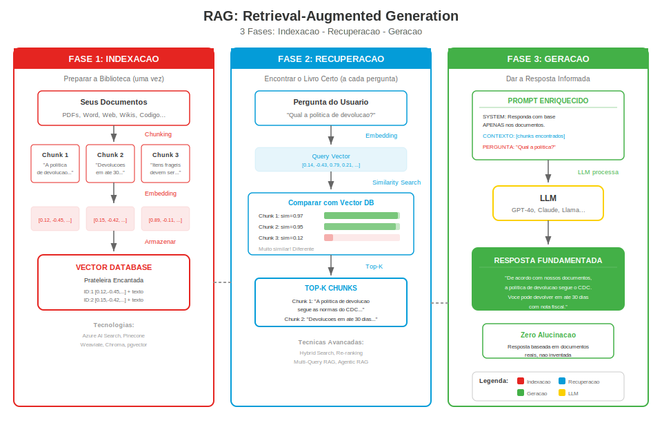

## Change Log

| Version | Date | Author | Changes |
|---------|------|--------|---------|
| 1.0.0 | 2026-03-18 | Paula Silva | Versao inicial — Edicao Super Mario Bros |

# Fase 7-2 — A Biblioteca Magica: RAG (Retrieval-Augmented Generation)

---

**Preparado para:** Sofia
**Versao:** 2.0 (Edicao Mushroom Kingdom)
**Autora:** Paula Silva | Software Global Black Belt, Microsoft Americas
**Data:** Marco 2026
**Idioma:** Portugues do Brasil (pt-BR)
**Colecao:** Agentic DevOps — World 7: Star World (AI Frameworks)

---

## SUMARIO

- [Prologo: O Mario que So Conhecia o World 1](#prologo-o-mario-que-so-conhecia-o-world-1)
- [1. O Problema: LLMs So Sabem o que Aprenderam](#1-o-problema-llms-so-sabem-o-que-aprenderam)
  - [1.1 O Limite do Treinamento](#11-o-limite-do-treinamento)
  - [1.2 O que Acontece Quando o LLM Nao Sabe?](#12-o-que-acontece-quando-o-llm-nao-sabe)
  - [1.3 A Analogia Mario: Mario Preso no World 1](#13-a-analogia-mario-mario-preso-no-world-1)
- [2. A Solucao: RAG — Retrieval-Augmented Generation](#2-a-solucao-rag--retrieval-augmented-generation)
  - [2.1 O que e RAG?](#21-o-que-e-rag)
  - [2.2 RAG em Uma Frase](#22-rag-em-uma-frase)
  - [2.3 A Analogia Mario: A Enciclopedia Magica](#23-a-analogia-mario-a-enciclopedia-magica)

<div align="center">

<br><em>Arquitetura RAG: Indexacao, Busca e Geracao</em>
</div>
- [3. Como RAG Funciona: Passo a Passo](#3-como-rag-funciona-passo-a-passo)
  - [3.1 Fase 1: Indexacao (Preparar a Biblioteca)](#31-fase-1-indexacao-preparar-a-biblioteca)
  - [3.2 Fase 2: Recuperacao (Encontrar o Livro Certo)](#32-fase-2-recuperacao-encontrar-o-livro-certo)
  - [3.3 Fase 3: Geracao (Dar a Resposta Informada)](#33-fase-3-geracao-dar-a-resposta-informada)
  - [3.4 Diagrama Completo em ASCII](#34-diagrama-completo-em-ascii)
- [4. Conceitos-Chave Explicados de Forma Simples](#4-conceitos-chave-explicados-de-forma-simples)
  - [4.1 Embeddings — Coordenadas no Mapa](#41-embeddings--coordenadas-no-mapa)
  - [4.2 Vector Database — A Prateleira Encantada](#42-vector-database--a-prateleira-encantada)
  - [4.3 Chunks — Quebrando o Livro em Paginas](#43-chunks--quebrando-o-livro-em-paginas)
  - [4.4 Similarity Search — Encontrando a Estrela Mais Proxima](#44-similarity-search--encontrando-a-estrela-mais-proxima)
  - [4.5 Grounding — Respostas Baseadas nos Livros](#45-grounding--respostas-baseadas-nos-livros)
  - [4.6 Tabela Completa de Conceitos](#46-tabela-completa-de-conceitos)
- [5. A Analogia Mario Completa: A Biblioteca Magica](#5-a-analogia-mario-completa-a-biblioteca-magica)
  - [5.1 Mario Normal vs RAG Mario](#51-mario-normal-vs-rag-mario)
  - [5.2 A Historia da Biblioteca Magica](#52-a-historia-da-biblioteca-magica)
  - [5.3 Tabela: Sem RAG vs Com RAG](#53-tabela-sem-rag-vs-com-rag)
- [6. Quando Usar RAG](#6-quando-usar-rag)
  - [6.1 Cenarios Ideais para RAG](#61-cenarios-ideais-para-rag)
  - [6.2 Quando NAO Usar RAG](#62-quando-nao-usar-rag)
  - [6.3 Tabela Decisoria](#63-tabela-decisoria)
- [7. Arquitetura RAG na Pratica](#7-arquitetura-rag-na-pratica)
  - [7.1 Componentes de uma Arquitetura RAG](#71-componentes-de-uma-arquitetura-rag)
  - [7.2 Diagrama de Arquitetura Completo](#72-diagrama-de-arquitetura-completo)
  - [7.3 Tecnologias Comuns](#73-tecnologias-comuns)
- [8. Estrategias de Chunking: Como Quebrar seus Documentos](#8-estrategias-de-chunking-como-quebrar-seus-documentos)
  - [8.1 Tipos de Chunking](#81-tipos-de-chunking)
  - [8.2 Overlap: A Tecnica da Sobreposicao](#82-overlap-a-tecnica-da-sobreposicao)
  - [8.3 A Analogia Mario: Cortando o Mapa em Pedacos](#83-a-analogia-mario-cortando-o-mapa-em-pedacos)
- [9. Problemas Comuns e Como Resolver](#9-problemas-comuns-e-como-resolver)
  - [9.1 O Modelo Nao Encontra a Informacao Certa](#91-o-modelo-nao-encontra-a-informacao-certa)
  - [9.2 O Modelo Alucina Mesmo Com RAG](#92-o-modelo-alucina-mesmo-com-rag)
  - [9.3 Respostas Sao Lentas](#93-respostas-sao-lentas)
  - [9.4 Tabela de Troubleshooting](#94-tabela-de-troubleshooting)
- [10. RAG Avancado: Tecnicas para o Proximo Nivel](#10-rag-avancado-tecnicas-para-o-proximo-nivel)
  - [10.1 Hybrid Search (Busca Hibrida)](#101-hybrid-search-busca-hibrida)
  - [10.2 Re-ranking (Reordenacao)](#102-re-ranking-reordenacao)
  - [10.3 Multi-Query RAG](#103-multi-query-rag)
  - [10.4 Agentic RAG](#104-agentic-rag)
- [11. Tabela Final: Sem RAG vs Com RAG](#11-tabela-final-sem-rag-vs-com-rag)

---

## Prologo: O Mario que So Conhecia o World 1

Sofia estava explorando o Star World quando encontrou uma situacao curiosa. Havia um Mario sentado em um banco, parecendo frustrado. Ao lado dele, um grupo de Toads tentava faze-lo responder perguntas.

*"Mario, qual e o segredo para derrotar o Bowser no World 7?"* — perguntou um Toad.

Mario coçou a cabeça. *"Hmm... no World 1, o Bowser e vulneravel a bolas de fogo e voce pode passar por baixo dele..."*

*"Nao, Mario! Estamos no World 7! Aqui e diferente!"*

Mario parecia confuso. *"Eu... eu so conheço o World 1. Foi la que eu treinei. Se voce me perguntar qualquer coisa sobre o World 1, eu sei de cor. Mas os outros mundos..."* Ele deu de ombros. *"Eu teria que adivinhar."*

Sofia entendeu imediatamente. Aquele Mario era como um **LLM sem acesso a dados externos** — ele so sabia o que aprendeu durante o treinamento. Para qualquer coisa fora do seu conhecimento, ele **inventava** (alucinava) ou admitia nao saber.

Entao, uma Toadette misteriosa apareceu carregando uma **mochila dourada brilhante**. Dentro da mochila havia dezenas de **pergaminhos magicos** — mapas, guias, manuais de cada World do Mushroom Kingdom.

*"Mario,"* disse Toadette, *"leve esta Biblioteca Magica com voce. Quando alguem te perguntar algo que voce nao sabe, abra a mochila, encontre o pergaminho certo, leia-o, e ENTAO responda. Assim, voce nunca mais vai precisar adivinhar."*

Mario pegou a mochila, abriu um pergaminho sobre o World 7, e sorriu. *"Ah! Entao AQUI o Bowser e vulneravel a bolas de gelo no terceiro round! Agora sim eu sei!"*

Essa mochila dourada e o **RAG** — Retrieval-Augmented Generation. E este capitulo e a historia completa de como ela funciona.

---

## 1. O Problema: LLMs So Sabem o que Aprenderam

### 1.1 O Limite do Treinamento

Todo Large Language Model (LLM) — como GPT-4, Claude, Llama — foi treinado em um **conjunto gigante de textos**: livros, sites, artigos, codigo, Wikipedia, e muito mais. Esse treinamento aconteceu ate uma **data de corte** (por exemplo, "dados ate outubro de 2023"). Apos essa data, o modelo nao sabe de nada que aconteceu.

**Implicacoes praticas:**

- O modelo **NAO sabe** sobre eventos apos a data de corte
- O modelo **NAO conhece** os documentos internos da sua empresa
- O modelo **NAO tem acesso** ao seu banco de dados
- O modelo **NAO sabe** quais produtos voce vende ou seus precos atuais
- O modelo **NAO conhece** suas politicas internas, processos ou procedimentos

> Pense assim: Mario foi treinado no World 1. Ele conhece cada Goomba, cada Bloco "?", cada cano verde do World 1 de cor e saltado. Mas se voce perguntar sobre o World 5, ele nao tem essa informacao — ela nunca fez parte do seu treinamento.

### 1.2 O que Acontece Quando o LLM Nao Sabe?

Quando um LLM recebe uma pergunta sobre algo que nao esta no seu treinamento, ele tem duas opcoes:

**Opcao 1: Admitir que nao sabe**
```
Pergunta: "Qual e a politica de devolucao da Loja Mario?"
Resposta: "Desculpe, nao tenho informacoes sobre a politica
           de devolucao da Loja Mario."
```
Isso e honesto, mas inutil.

**Opcao 2: Inventar uma resposta (ALUCINACAO)**
```
Pergunta: "Qual e a politica de devolucao da Loja Mario?"
Resposta: "A Loja Mario aceita devolucoes em ate 30 dias
           com nota fiscal. Itens usados nao sao aceitos."
```
Isso PARECE correto, mas o modelo **inventou** tudo. A politica real pode ser completamente diferente. Isso e perigoso porque a resposta e convincente — voce confiaria nela.

**Alucinacao** e o termo tecnico para quando o modelo gera informacao que parece factual mas e **completamente inventada**. E o maior problema de LLMs em aplicacoes empresariais.

### 1.3 A Analogia Mario: Mario Preso no World 1

```
MARIO SEM RAG (LLM puro)
=========================

Conhecimento do Mario:
  World 1: ████████████████████ 100% (conhece tudo!)
  World 2: ░░░░░░░░░░░░░░░░░░░  0%  (nunca esteve la)
  World 3: ░░░░░░░░░░░░░░░░░░░  0%  (nunca esteve la)
  World 4: ░░░░░░░░░░░░░░░░░░░  0%  (nunca esteve la)
  World 5: ░░░░░░░░░░░░░░░░░░░  0%  (nunca esteve la)
  World 6: ░░░░░░░░░░░░░░░░░░░  0%  (nunca esteve la)
  World 7: ░░░░░░░░░░░░░░░░░░░  0%  (nunca esteve la)

Pergunta: "Como derrotar o chefe do World 5?"

Mario SEM RAG: "Hmmm... no World 1 voce usa bolas de fogo...
               entao... acho que no World 5 tambem? Talvez
               precise pular 3 vezes na cabeca dele?"
               (ALUCINACAO — inventou a resposta!)

Mario COM RAG: *abre a Biblioteca Magica*
               *encontra o pergaminho "Guia do World 5"*
               *le a secao "Boss Battle"*
               "De acordo com o Guia do World 5, o chefe e
               vulneravel a bolas de gelo no segundo round,
               e voce precisa usar a plataforma movel para
               alcanca-lo."
               (RESPOSTA FUNDAMENTADA — baseada no documento!)
```

---

## 2. A Solucao: RAG — Retrieval-Augmented Generation

### 2.1 O que e RAG?

**RAG (Retrieval-Augmented Generation)** e uma tecnica que **combina busca de informacao com geracao de texto**. Em vez de confiar apenas no que o modelo aprendeu durante o treinamento, RAG permite que ele **consulte documentos externos** antes de responder.

O nome diz tudo:
- **Retrieval** (Recuperacao): Buscar informacoes relevantes em uma base de documentos
- **Augmented** (Aumentada): Usar essas informacoes para enriquecer o contexto
- **Generation** (Geracao): Gerar uma resposta informada com base no contexto enriquecido

### 2.2 RAG em Uma Frase

> **RAG e dar ao LLM acesso a uma biblioteca de documentos para que ele consulte antes de responder, em vez de confiar apenas na memoria.**

Ou na linguagem Mario:

> **RAG e dar ao Mario uma mochila com pergaminhos de todos os mundos, para que ele consulte antes de responder, em vez de adivinhar.**

### 2.3 A Analogia Mario: A Enciclopedia Magica

| Conceito | Sem RAG | Com RAG |
|---|---|---|
| **O Mario** | So tem o que aprendeu no treinamento | Carrega uma Biblioteca Magica na mochila |
| **Quando recebe uma pergunta** | Tenta lembrar do treinamento | Abre a mochila e procura o pergaminho certo |
| **Se nao sabe a resposta** | Inventa (alucina) ou diz "nao sei" | Consulta o pergaminho e da resposta fundamentada |
| **Qualidade da resposta** | Varia — pode ser boa, ruim, ou inventada | Consistentemente boa — baseada em documentos reais |
| **Atualizacao** | Precisa re-treinar o modelo inteiro (caro, demorado) | Basta adicionar novos pergaminhos a mochila (rapido, barato) |

---


## 3. Como RAG Funciona: Passo a Passo

<div align="center">

<br/><em>Arquitetura RAG detalhada</em>
</div>

RAG funciona em tres fases distintas. Vamos detalhar cada uma.

### 3.1 Fase 1: Indexacao (Preparar a Biblioteca)

A indexacao acontece **antes** de qualquer pergunta ser feita. E o processo de preparar seus documentos para serem consultados rapidamente.

**Passo a passo:**

```
FASE 1: INDEXACAO (acontece UMA VEZ, antes do uso)
===================================================

1. COLETAR DOCUMENTOS
   ┌──────────────────────────────────────────┐
   │  PDFs, Word, PowerPoint, paginas web,    │
   │  emails, wikis, manuais, FAQs, codigo... │
   └──────────────────────────────────────────┘
                      │
                      v
2. QUEBRAR EM CHUNKS (pedacos)
   ┌──────────┐ ┌──────────┐ ┌──────────┐
   │ Chunk 1  │ │ Chunk 2  │ │ Chunk 3  │ ...
   │ "A poli- │ │ "Devolu- │ │ "Itens   │
   │ tica de  │ │ coes em  │ │ frageis  │
   │ devolucao│ │ ate 30   │ │ devem    │
   │ da loja  │ │ dias com │ │ ser em-  │
   │ segue..."│ │ nota..." │ │ balados" │
   └──────────┘ └──────────┘ └──────────┘
                      │
                      v
3. CONVERTER EM EMBEDDINGS (numeros)
   Chunk 1 → [0.12, -0.45, 0.78, 0.23, ...]
   Chunk 2 → [0.15, -0.42, 0.81, 0.19, ...]
   Chunk 3 → [0.89, -0.11, 0.03, 0.67, ...]
                      │
                      v
4. ARMAZENAR NO VECTOR DATABASE
   ┌─────────────────────────────────────┐
   │  VECTOR DATABASE (banco vetorial)    │
   │                                      │
   │  ID: 1  Vector: [0.12, -0.45, ...]  │
   │  ID: 2  Vector: [0.15, -0.42, ...]  │
   │  ID: 3  Vector: [0.89, -0.11, ...]  │
   │  ...                                │
   └─────────────────────────────────────┘
```

> Analogia Mario: A Fase 1 e como **organizar a Biblioteca Magica**. Voce pega todos os pergaminhos do Mushroom Kingdom (documentos), corta em paginas individuais (chunks), cataloga cada pagina com um codigo magico (embeddings), e coloca tudo numa prateleira encantada que consegue encontrar qualquer pagina instantaneamente (vector database).

### 3.2 Fase 2: Recuperacao (Encontrar o Livro Certo)

A recuperacao acontece **quando uma pergunta chega**. O sistema precisa encontrar os chunks mais relevantes para aquela pergunta.

**Passo a passo:**

```
FASE 2: RECUPERACAO (acontece A CADA pergunta)
================================================

1. RECEBER A PERGUNTA
   "Qual e a politica de devolucao da loja?"
                      │
                      v
2. CONVERTER PERGUNTA EM EMBEDDING
   "Qual e a politica..." → [0.14, -0.43, 0.79, 0.21, ...]
                      │
                      v
3. BUSCAR CHUNKS SIMILARES (similarity search)
   Pergunta: [0.14, -0.43, 0.79, 0.21, ...]

   Comparar com todos os chunks:
   Chunk 1: [0.12, -0.45, 0.78, 0.23, ...] → Similaridade: 0.97 ← MUITO SIMILAR!
   Chunk 2: [0.15, -0.42, 0.81, 0.19, ...] → Similaridade: 0.95 ← SIMILAR!
   Chunk 3: [0.89, -0.11, 0.03, 0.67, ...] → Similaridade: 0.12 ← DIFERENTE
                      │
                      v
4. RETORNAR TOP-K CHUNKS (os K mais relevantes)
   ┌──────────────────────────────────────┐
   │  Chunk 1 (similaridade 0.97):        │
   │  "A politica de devolucao da loja    │
   │   segue as normas do Codigo de       │
   │   Defesa do Consumidor..."           │
   │                                      │
   │  Chunk 2 (similaridade 0.95):        │
   │  "Devolucoes em ate 30 dias com      │
   │   nota fiscal. Produtos abertos      │
   │   sao aceitos se em perfeito estado" │
   └──────────────────────────────────────┘
```

> Analogia Mario: A Fase 2 e quando Mario **abre a mochila e procura o pergaminho certo**. Ele nao le TODOS os pergaminhos — seria muito demorado. Em vez disso, a mochila magica **sente** qual pergaminho e mais relevante para a pergunta e o apresenta automaticamente. E como se a mochila tivesse um ima que atrai o pergaminho mais parecido com o que voce precisa.

### 3.3 Fase 3: Geracao (Dar a Resposta Informada)

A geracao e o passo final: combinar a pergunta original com os chunks encontrados e enviar tudo ao LLM.

**Passo a passo:**

```
FASE 3: GERACAO (combinar pergunta + contexto + LLM)
=====================================================

1. MONTAR O PROMPT ENRIQUECIDO
   ┌──────────────────────────────────────────────┐
   │  SYSTEM: Responda com base APENAS nos         │
   │  documentos fornecidos. Se a informacao nao   │
   │  estiver nos documentos, diga "nao encontrei  │
   │  essa informacao nos documentos disponiveis." │
   │                                                │
   │  CONTEXTO (chunks encontrados):                │
   │  "A politica de devolucao da loja segue as     │
   │  normas do CDC. Devolucoes em ate 30 dias      │
   │  com nota fiscal. Produtos abertos sao aceitos │
   │  se em perfeito estado."                       │
   │                                                │
   │  PERGUNTA DO USUARIO:                          │
   │  "Qual e a politica de devolucao da loja?"     │
   └──────────────────────────────────────────────┘
                      │
                      v
2. LLM GERA RESPOSTA FUNDAMENTADA
   ┌──────────────────────────────────────────────┐
   │  "De acordo com nossos documentos, a politica │
   │  de devolucao da loja segue o Codigo de        │
   │  Defesa do Consumidor. Voce pode devolver      │
   │  produtos em ate 30 dias, desde que apresente  │
   │  a nota fiscal. Produtos abertos sao aceitos   │
   │  se estiverem em perfeito estado de uso."       │
   └──────────────────────────────────────────────┘
```

> Analogia Mario: A Fase 3 e quando Mario **le o pergaminho e formula a resposta**. Ele nao esta inventando — esta lendo o conteudo real do pergaminho e explicando com suas proprias palavras. Se o pergaminho nao tem a informacao, Mario honestamente diz: "Nao encontrei isso nos meus pergaminhos." ZERO alucinacao.

### 3.4 Diagrama Completo em ASCII

```
ARQUITETURA RAG COMPLETA
=========================

                         ┌─────────────────────┐
                         │   SEUS DOCUMENTOS    │
                         │  PDFs, Word, Web...  │
                         └──────────┬──────────┘
                                    │
                              [INDEXACAO]
                                    │
                    ┌───────────────┼───────────────┐
                    │               │               │
                    v               v               v
              ┌──────────┐   ┌──────────┐   ┌──────────┐
              │ Chunk 1  │   │ Chunk 2  │   │ Chunk 3  │ ...
              └────┬─────┘   └────┬─────┘   └────┬─────┘
                   │              │              │
              [EMBEDDING]    [EMBEDDING]    [EMBEDDING]
                   │              │              │
                   v              v              v
              ┌──────────────────────────────────────┐
              │        VECTOR DATABASE               │
              │  (prateleira encantada de Toadette)   │
              └──────────────────┬───────────────────┘
                                 │
                                 │ [BUSCA POR SIMILARIDADE]
                                 │
   ┌──────────────┐              │
   │  PERGUNTA    │──[EMBEDDING]─┘
   │  do usuario  │
   └──────┬───────┘
          │
          │         ┌─────────────────────┐
          │         │  TOP-K CHUNKS       │
          │         │  (mais relevantes)  │
          │         └──────────┬──────────┘
          │                    │
          v                    v
   ┌──────────────────────────────────────┐
   │              LLM                      │
   │  Pergunta + Chunks = Resposta         │
   │  fundamentada nos documentos          │
   └──────────────────┬───────────────────┘
                      │
                      v
          ┌──────────────────────┐
          │  RESPOSTA FINAL      │
          │  (fundamentada,      │
          │   sem alucinacao)    │
          └──────────────────────┘
```

---

## 4. Conceitos-Chave Explicados de Forma Simples

Vamos desvendar cada conceito tecnico do RAG usando analogias claras e acessiveis.

### 4.1 Embeddings — Coordenadas no Mapa

**O que sao:** Embeddings sao a conversao de texto em **numeros** (vetores). Cada palavra, frase ou paragrafo e transformado em uma lista de numeros que representam seu **significado**.

**Por que existem:** Computadores nao entendem texto — eles entendem numeros. Embeddings sao a "traducao" do texto para a linguagem matematica.

**Como funcionam:**

```
Texto: "O gato sentou no tapete"  →  [0.23, -0.45, 0.12, 0.89, ...]
Texto: "O felino descansou no carpete" → [0.25, -0.43, 0.14, 0.87, ...]
Texto: "A economia do Brasil cresceu"  → [0.78, 0.34, -0.56, 0.01, ...]
```

Note que as duas primeiras frases tem vetores **parecidos** (significados similares), enquanto a terceira e muito **diferente**.

> **Analogia Mario**: Embeddings sao como **coordenadas num mapa do Mushroom Kingdom**. Cada texto e um ponto no mapa. Textos com significados parecidos ficam **perto** no mapa. O "World 1-1" e o "primeiro nivel do jogo" ficam quase no mesmo ponto do mapa, porque significam a mesma coisa. Ja "receita de bolo de chocolate" fica em uma regiao completamente diferente do mapa.

```
MAPA DE EMBEDDINGS (simplificado em 2D)
=========================================

         "politica de          "prazo de
          devolucao"            devolucao"
              *    ←proximos→    *

                                    "horario de
                                     funcionamento"
                                         *

  "receita de
   bolo"
      *
                        "previsao
                         do tempo"
                            *
```

### 4.2 Vector Database — A Prateleira Encantada

**O que e:** Um banco de dados especializado em armazenar e buscar **vetores** (embeddings). Diferente de um banco de dados normal que busca por palavras exatas, o vector database busca por **significado**.

**Banco de dados normal:**
```
SELECT * FROM docs WHERE title = "politica de devolucao"
→ So encontra se o titulo for EXATAMENTE "politica de devolucao"
```

**Vector database:**
```
BUSCAR documentos similares a "como devolver um produto?"
→ Encontra "politica de devolucao", "prazo para troca",
  "processo de reembolso" — mesmo sem as palavras exatas!
```

> **Analogia Mario**: Um banco de dados normal e como uma prateleira organizada por **titulo do livro** — voce precisa saber o titulo exato para encontrar. Um vector database e uma **prateleira encantada** que encontra livros por **assunto** — voce diz "preciso de algo sobre como derrotar fantasmas" e a prateleira magicamente apresenta todos os livros relevantes, mesmo que nenhum tenha "derrotar fantasmas" no titulo.

**Exemplos de Vector Databases:**

| Vector Database | Analogia Mario | Caracteristica |
|---|---|---|
| **Azure AI Search** | Prateleira oficial do castelo da Princesa | Integrado com Azure, facil de usar |
| **Pinecone** | Prateleira magica de Toadette — rapida e precisa | Cloud-native, muito rapido |
| **Weaviate** | Prateleira do Toad — organizada e open-source | Open-source, versatil |
| **Chroma** | Prateleira portatil do Mario — leve e local | Leve, ideal para prototipos |
| **Qdrant** | Prateleira do Yoshi — engole tudo e organiza | Alta performance, open-source |
| **pgvector** | Extensao da prateleira existente (PostgreSQL) | Adiciona vetores ao Postgres |

### 4.3 Chunks — Quebrando o Livro em Paginas

**O que sao:** Chunks sao pedacos menores de um documento maior. Em vez de indexar um PDF de 100 paginas inteiro como um unico bloco, voce o divide em secoes menores.

**Por que dividir:**
1. **LLMs tem limite de contexto** — nao cabem 100 paginas de uma vez
2. **Precisao** — se voce busca "politica de devolucao", nao precisa das 100 paginas, so da secao relevante
3. **Velocidade** — buscar em chunks pequenos e mais rapido

**Tamanhos comuns:**

| Tamanho do Chunk | Quando Usar | Vantagem | Desvantagem |
|---|---|---|---|
| **256 tokens** (~200 palavras) | Perguntas especificas e diretas | Alta precisao na busca | Pode perder contexto |
| **512 tokens** (~400 palavras) | Uso geral, equilibrado | Bom equilibrio | Padrao recomendado |
| **1024 tokens** (~800 palavras) | Respostas que precisam de mais contexto | Mais contexto por chunk | Busca menos precisa |
| **2048 tokens** (~1600 palavras) | Documentos tecnicos complexos | Maximo contexto | Pode incluir informacao irrelevante |

> **Analogia Mario**: Imagine que voce tem o **Grande Atlas do Mushroom Kingdom** — um livro enorme com informacoes sobre todos os mundos. Se alguem perguntar "Como derrotar o Koopa do World 3?", voce nao vai ler o livro INTEIRO. Voce vai ate o **capitulo do World 3**, abre na **secao de inimigos**, e le apenas a **pagina sobre Koopas**. Cada "pagina" e um chunk. Chunks menores = paginas menores = mais rapido de encontrar e ler.

### 4.4 Similarity Search — Encontrando a Estrela Mais Proxima

**O que e:** Similarity search (busca por similaridade) e o processo de encontrar os chunks cujos embeddings sao **mais proximos** do embedding da pergunta. Quanto mais proximo, mais relevante.

**Como funciona matematicamente:** Usa metricas de distancia como:
- **Cosine Similarity** (mais comum): Mede o angulo entre dois vetores. Quanto menor o angulo, mais similares.
- **Euclidean Distance**: Mede a distancia direta entre dois pontos.
- **Dot Product**: Mede a projecao de um vetor sobre outro.

Voce nao precisa entender a matematica! O importante e o conceito:

```
Pergunta: "Como fazer devolucao?"
Embedding da pergunta: [0.14, -0.43, 0.79, ...]

Chunks mais proximos (TOP-3):
  1. "Politica de devolucao..."     → distancia: 0.03 (MUITO proximo!)
  2. "Prazo para troca de produtos" → distancia: 0.08 (proximo)
  3. "Processo de reembolso..."     → distancia: 0.12 (razoavel)
  ...
  47. "Horario de funcionamento"    → distancia: 0.89 (LONGE)
  48. "Receita de bolo"            → distancia: 0.95 (MUITO longe)
```

> **Analogia Mario**: Imagine que voce esta no mapa do Mushroom Kingdom e precisa encontrar a **estrela mais proxima** da sua posicao. Voce olha ao redor e ve varias estrelas no ceu. A mais brilhante (proxima) e a mais relevante. Similarity search e como ter um **telescopio magico** que automaticamente aponta para as estrelas mais proximas — os chunks mais relevantes para sua pergunta.

### 4.5 Grounding — Respostas Baseadas nos Livros

**O que e:** Grounding (fundamentacao) e o principio de que a resposta do LLM deve ser **baseada nos documentos fornecidos**, e nao na "imaginacao" do modelo.

**Sem grounding:** O modelo pode misturar informacao dos documentos com informacao do seu treinamento (que pode estar errada ou desatualizada).

**Com grounding:** O modelo e instruido a responder **apenas** com base nos documentos. Se a informacao nao esta nos documentos, ele deve dizer "nao encontrei essa informacao."

**Como implementar grounding no prompt:**

```
SYSTEM PROMPT COM GROUNDING:

"Voce e um assistente que responde perguntas com base
EXCLUSIVAMENTE nos documentos fornecidos abaixo.

REGRAS:
1. Responda APENAS com informacoes encontradas nos documentos
2. Se a informacao nao estiver nos documentos, diga:
   'Nao encontrei essa informacao nos documentos disponiveis'
3. NUNCA invente informacoes
4. Cite o trecho do documento que fundamenta sua resposta
5. Se houver ambiguidade, apresente todas as interpretacoes

DOCUMENTOS:
[chunks recuperados pela busca]

PERGUNTA DO USUARIO:
[pergunta]"
```

> **Analogia Mario**: Grounding e como dizer ao Mario: **"Responda APENAS com base nos pergaminhos da mochila. Se o pergaminho nao fala sobre isso, diga que nao sabe. NAO invente. NAO adivinhe."** E a regra que impede Mario de alucinar. Sem grounding, Mario pode misturar informacoes dos pergaminhos com seus "achismos" do World 1. Com grounding, ele e estritamente fiel aos pergaminhos.

### 4.6 Tabela Completa de Conceitos

| # | Conceito | Definicao Tecnica | Analogia Mario | Exemplo Pratico |
|---|---|---|---|---|
| 1 | **Embedding** | Representacao numerica de texto | Coordenadas no mapa do Mushroom Kingdom | "Gato" → [0.23, -0.45, ...] |
| 2 | **Vector Database** | Banco que busca por significado | Prateleira encantada que encontra por assunto | Azure AI Search, Pinecone, Chroma |
| 3 | **Chunk** | Pedaco menor de um documento | Uma pagina individual do Grande Atlas | 512 tokens (~400 palavras) |
| 4 | **Similarity Search** | Busca pelos chunks mais proximos | Telescopio magico que acha estrelas proximas | Cosine similarity entre vetores |
| 5 | **Grounding** | Respostas baseadas nos documentos | Regra: "so responda com base nos pergaminhos" | System prompt com restricao |
| 6 | **Indexacao** | Preparar documentos para busca | Organizar a Biblioteca Magica | Chunking + embedding + armazenamento |
| 7 | **Recuperacao** | Encontrar chunks relevantes | Abrir a mochila e achar o pergaminho certo | Top-K similarity search |
| 8 | **Geracao** | Produzir resposta com contexto | Mario le o pergaminho e explica | LLM + pergunta + chunks |
| 9 | **Alucinacao** | Modelo inventa informacao | Mario chutando a resposta sem consultar | "A politica e 30 dias" (inventado) |
| 10 | **Top-K** | Quantos chunks retornar | Quantos pergaminhos abrir | Top-3, Top-5, Top-10 |

---

## 5. A Analogia Mario Completa: A Biblioteca Magica

### 5.1 Mario Normal vs RAG Mario

```
MARIO NORMAL (LLM sem RAG)
===========================
  ┌─────────┐
  │  MARIO  │  Cerebro: so o que aprendeu no treinamento
  │  (LLM)  │  Mochila: VAZIA
  │         │  Quando nao sabe: inventa ou diz "nao sei"
  └─────────┘

RAG MARIO (LLM com RAG)
=========================
  ┌─────────┐  ┌──────────────────────┐
  │  MARIO  │  │  BIBLIOTECA MAGICA   │
  │  (LLM)  │──│  (Vector Database)   │
  │         │  │                      │
  │         │  │  Pergaminho World 1  │
  │         │  │  Pergaminho World 2  │
  │         │  │  Pergaminho World 3  │
  │         │  │  Manual de Inimigos  │
  │         │  │  Guia de Power-Ups   │
  │         │  │  Mapa do Reino       │
  │         │  │  ...                 │
  └─────────┘  └──────────────────────┘
  Cerebro: treinamento + consulta a biblioteca
  Mochila: CHEIA de pergaminhos
  Quando nao sabe: consulta a biblioteca e responde com base nela
```

### 5.2 A Historia da Biblioteca Magica

Vamos contar a historia completa de como RAG funciona, toda em linguagem Mario:

**Ato 1: Preparando a Biblioteca (Indexacao)**

Toadette, a bibliotecaria do Mushroom Kingdom, recebe uma missao: organizar TODO o conhecimento do reino em uma Biblioteca Magica. Ela:

1. **Coleta todos os pergaminhos** do reino — mapas de fases, manuais de inimigos, guias de power-ups, registros de batalhas (= coletar documentos)

2. **Corta cada pergaminho grande em paginas menores** — o "Grande Manual do World 5" vira 50 paginas individuais (= chunking)

3. **Marca cada pagina com um selo magico** — um selo que brilha quando encontra algo similar. A pagina sobre "bolas de fogo" brilha quando alguem procura "como atacar com fogo" (= embedding)

4. **Coloca tudo numa prateleira encantada** — uma prateleira magica que faz as paginas relevantes flutuarem ate voce quando voce precisa delas (= vector database)

**Ato 2: Mario Recebe uma Pergunta (Recuperacao)**

Um Toad desesperado corre ate Mario: *"Mario! Como derrotamos o Mega Blooper do World 4?!"*

Mario abre sua mochila dourada (conectada a Biblioteca Magica) e:

1. **Fala a pergunta em voz alta** — "Como derrotar o Mega Blooper do World 4?" A mochila transforma a pergunta em um selo magico (= converter pergunta em embedding)

2. **A mochila brilha e busca** — o selo da pergunta "vibra" na mesma frequencia que as paginas relevantes na Biblioteca (= similarity search)

3. **Tres pergaminhos flutuam ate Mario**:
   - Pergaminho 1: "Inimigos Aquaticos do World 4 — secao Mega Blooper"
   - Pergaminho 2: "Fraquezas de Bosses Aquaticos"
   - Pergaminho 3: "Estrategias para Fases Subaquaticas"
   (= top-K retrieval)

**Ato 3: Mario Responde (Geracao)**

Mario le os tres pergaminhos e responde ao Toad:

*"De acordo com o Manual de Inimigos, o Mega Blooper do World 4 e vulneravel a bolas de fogo quando abre os tentaculos. Voce precisa esperar ele atacar, desviar para a direita, e lancar 3 bolas de fogo em sequencia. Segundo o guia de estrategias, use a plataforma movel para se posicionar acima dele."*

**A resposta e precisa, fundamentada, e citavel!** Mario nao inventou nada — ele leu nos pergaminhos e sintetizou a informacao.

### 5.3 Tabela: Sem RAG vs Com RAG

| Aspecto | Sem RAG (Mario sem mochila) | Com RAG (Mario com Biblioteca Magica) |
|---|---|---|
| **Fonte de conhecimento** | Apenas o treinamento (World 1) | Treinamento + documentos externos (todos os Worlds) |
| **Precisao** | Variavel — pode acertar ou inventar | Alta — baseada em documentos reais |
| **Alucinacao** | Frequente em dominios desconhecidos | Rara — modelo e instruido a se basear nos docs |
| **Atualizacao** | Precisa re-treinar (caro, semanas) | Adiciona novos docs a biblioteca (barato, minutos) |
| **Custo** | Baixo (so o LLM) | Medio (LLM + vector database + embedding) |
| **Citabilidade** | Nao pode citar fontes | Pode citar exatamente qual documento usou |
| **Transparencia** | "Como voce sabe isso?" — "Eu... sei" | "Como voce sabe?" — "Li no documento X, pagina Y" |
| **Personalizacao** | Generica para todos | Especifica para seus documentos e dominio |
| **Exemplo** | "Acho que a politica e 30 dias..." | "Segundo o doc de politicas, sao 30 dias com NF." |

---

## 6. Quando Usar RAG

### 6.1 Cenarios Ideais para RAG

RAG brilha quando voce precisa que o LLM responda sobre **informacoes especificas e atualizadas** que nao estavam no treinamento:

| Cenario | Por que RAG e ideal | Exemplo |
|---|---|---|
| **Documentacao interna** | LLM nao conhece seus docs | Chatbot que responde sobre politicas da empresa |
| **Manuais de produtos** | Informacoes especificas e tecnicas | Assistente para suporte tecnico |
| **Base de conhecimento** | FAQ com centenas de perguntas | Central de ajuda automatizada |
| **Documentacao de codigo** | APIs, bibliotecas, SDKs | Assistente de desenvolvimento |
| **Dados regulatorios** | Leis, normas, regulamentacoes | Assistente juridico |
| **Dados que mudam frequentemente** | Precos, estoque, promocoes | Assistente de vendas |
| **Pesquisa academica** | Artigos e papers cientificos | Assistente de pesquisa |

### 6.2 Quando NAO Usar RAG

RAG **nao e necessario** (e adiciona complexidade desnecessaria) em certos cenarios:

| Cenario | Por que NAO precisa de RAG | Alternativa |
|---|---|---|
| **Conhecimento geral** | LLM ja sabe ("Capital da Franca?") | Usar LLM diretamente |
| **Tarefas criativas** | Nao ha "documento certo" para criatividade | Prompt engineering |
| **Conversas casuais** | Chatbot de bate-papo simples | LLM com bom system prompt |
| **Traducao** | LLM ja e otimo em traduzir | Usar LLM diretamente |
| **Resumo de texto** | O texto ja esta no prompt | Enviar texto direto ao LLM |
| **Geracao de codigo generico** | LLM ja sabe programar | Usar LLM com exemplos |

### 6.3 Tabela Decisoria

```
PRECISO DE RAG? FLUXO DE DECISAO
==================================

A informacao que o LLM precisa esta no treinamento dele?
  │
  ├── SIM → NAO precisa de RAG. Use o LLM diretamente.
  │         (Mario ja conhece o World 1 — nao precisa de pergaminho)
  │
  └── NAO → A informacao muda frequentemente?
            │
            ├── SIM → USE RAG! (Atualize docs na biblioteca)
            │         (Novas fases sendo adicionadas ao reino — novos pergaminhos)
            │
            └── NAO → O formato de saida e muito especifico?
                      │
                      ├── SIM → Considere FINE-TUNING
                      │         (Treinar Mario num estilo especifico)
                      │
                      └── NAO → USE RAG! (Mais simples que fine-tuning)
                                (E mais facil dar um pergaminho ao Mario
                                 do que re-treinar ele do zero)
```

---

## 7. Arquitetura RAG na Pratica

### 7.1 Componentes de uma Arquitetura RAG

Uma arquitetura RAG completa tem os seguintes componentes:

| Componente | Funcao | Analogia Mario | Tecnologia Exemplo |
|---|---|---|---|
| **Document Loader** | Ler documentos de varias fontes | Coletor de pergaminhos do reino | LangChain loaders, Azure Document Intelligence |
| **Text Splitter** | Quebrar documentos em chunks | Cortador de pergaminhos em paginas | RecursiveCharacterTextSplitter |
| **Embedding Model** | Converter texto em vetores | Selo magico que marca cada pagina | text-embedding-ada-002, Cohere Embed |
| **Vector Store** | Armazenar e buscar embeddings | Prateleira encantada de Toadette | Azure AI Search, Pinecone, Chroma |
| **Retriever** | Buscar chunks relevantes | Mochila magica do Mario | Similarity search, hybrid search |
| **LLM** | Gerar resposta com contexto | Cerebro de Mario que processa tudo | GPT-4o, Claude, Llama |
| **Prompt Template** | Montar o prompt com contexto | Instrucoes para o Mario de como usar os pergaminhos | System prompt + contexto + pergunta |

### 7.2 Diagrama de Arquitetura Completo

```
ARQUITETURA RAG — VISAO COMPLETA
=================================

                    FASE DE INDEXACAO (uma vez)
   ┌────────────────────────────────────────────────────┐
   │                                                     │
   │  ┌──────────┐   ┌──────────┐   ┌───────────────┐  │
   │  │ Document │   │  Text    │   │   Embedding   │  │
   │  │ Loader   │──>│ Splitter │──>│   Model       │  │
   │  │          │   │          │   │               │  │
   │  │ (le PDFs,│   │ (quebra  │   │ (converte em  │  │
   │  │  Word,   │   │  em      │   │  vetores)     │  │
   │  │  HTML)   │   │  chunks) │   │               │  │
   │  └──────────┘   └──────────┘   └───────┬───────┘  │
   │                                         │          │
   │                                         v          │
   │                                ┌───────────────┐   │
   │                                │ Vector Store  │   │
   │                                │ (armazena     │   │
   │                                │  embeddings)  │   │
   │                                └───────┬───────┘   │
   │                                        │           │
   └────────────────────────────────────────┼───────────┘
                                            │
                    FASE DE CONSULTA (cada pergunta)
   ┌────────────────────────────────────────┼───────────┐
   │                                        │           │
   │  ┌──────────┐   ┌──────────┐           │           │
   │  │ Pergunta │──>│ Embedding│───────────┘           │
   │  │ usuario  │   │ Model    │  [busca por           │
   │  └──────────┘   └──────────┘   similaridade]       │
   │       │                              │             │
   │       │         ┌────────────────────┘             │
   │       │         │                                  │
   │       │         v                                  │
   │       │    ┌──────────┐                            │
   │       │    │ Top-K    │                            │
   │       │    │ Chunks   │                            │
   │       │    │ (mais    │                            │
   │       │    │ relevantes)                           │
   │       │    └─────┬────┘                            │
   │       │          │                                 │
   │       v          v                                 │
   │  ┌──────────────────────┐                          │
   │  │   PROMPT TEMPLATE    │                          │
   │  │                      │                          │
   │  │ System: use os docs  │                          │
   │  │ Contexto: [chunks]   │                          │
   │  │ Pergunta: [usuario]  │                          │
   │  └──────────┬───────────┘                          │
   │             │                                      │
   │             v                                      │
   │  ┌──────────────────────┐                          │
   │  │       LLM            │                          │
   │  │  (gera resposta      │                          │
   │  │   fundamentada)      │                          │
   │  └──────────┬───────────┘                          │
   │             │                                      │
   │             v                                      │
   │  ┌──────────────────────┐                          │
   │  │  RESPOSTA FINAL      │                          │
   │  └──────────────────────┘                          │
   │                                                    │
   └────────────────────────────────────────────────────┘
```

### 7.3 Tecnologias Comuns

| Categoria | Tecnologias | Recomendacao para Iniciantes |
|---|---|---|
| **Vector Database** | Azure AI Search, Pinecone, Chroma, Weaviate, Qdrant | **Chroma** (local, simples) ou **Azure AI Search** (producao) |
| **Embedding Model** | text-embedding-ada-002, text-embedding-3-small, Cohere Embed | **text-embedding-3-small** (barato e bom) |
| **LLM** | GPT-4o, GPT-4o-mini, Claude, Llama | **GPT-4o-mini** (custo-beneficio) |
| **Framework** | LangChain, LlamaIndex, Semantic Kernel | **LangChain** (mais popular, mais documentacao) |
| **Document Processing** | Azure Document Intelligence, Unstructured, PyPDF | **PyPDF** (simples) ou **Azure Doc Intelligence** (avancado) |

---

## 8. Estrategias de Chunking: Como Quebrar seus Documentos

Chunking e uma das decisoes mais importantes em RAG. Chunks ruins = buscas ruins = respostas ruins.

### 8.1 Tipos de Chunking

| Estrategia | Como Funciona | Vantagem | Desvantagem | Analogia Mario |
|---|---|---|---|---|
| **Fixed Size** | Corta a cada N caracteres | Simples de implementar | Pode cortar no meio de uma frase | Cortar o pergaminho com regua — reto mas brutal |
| **Recursive** | Tenta cortar em paragrafos, depois frases | Respeita a estrutura do texto | Um pouco mais complexo | Cortar nas dobras naturais do pergaminho |
| **Semantic** | Agrupa por significado (usa embeddings) | Chunks muito coerentes | Mais lento e caro | Agrupar paginas por assunto magicamente |
| **By Header** | Corta por titulos/secoes do documento | Preserva a estrutura | Depende do doc ter boa formatacao | Cortar por capitulos do livro |
| **Sentence** | Cada frase e um chunk | Maximo de granularidade | Chunks muito pequenos, perdem contexto | Cada palavra num post-it separado |

**Recomendacao**: Comece com **Recursive** (tamanho 512 tokens, overlap 50 tokens). E o melhor equilibrio para a maioria dos casos.

### 8.2 Overlap: A Tecnica da Sobreposicao

Overlap e quando chunks consecutivos **compartilham um pedaco de texto**. Isso evita perder informacao que esta na fronteira entre dois chunks.

```
SEM OVERLAP:
Chunk 1: "A politica de devolucao permite trocas em"
Chunk 2: "ate 30 dias. E necessario apresentar nota fiscal."

A informacao "trocas em ate 30 dias" ficou dividida!
Se buscar "prazo de troca", pode nao encontrar completo.

COM OVERLAP (50 tokens):
Chunk 1: "A politica de devolucao permite trocas em ate 30 dias."
Chunk 2: "trocas em ate 30 dias. E necessario apresentar nota fiscal."

Agora a informacao "trocas em ate 30 dias" aparece nos DOIS chunks!
A busca vai encontrar nao importa qual chunk aparecer.
```

### 8.3 A Analogia Mario: Cortando o Mapa em Pedacos

Imagine que voce tem o mapa completo do World 5 e precisa cortar em pedacos para caber na mochila:

```
SEM OVERLAP (corte seco):
┌─────────┐┌─────────┐┌─────────┐
│ Pedaco 1 ││ Pedaco 2 ││ Pedaco 3 │
│          ││          ││          │
│   Inicio ││   Meio   ││   Final  │
│  da fase ││ da fase  ││ da fase  │
└─────────┘└─────────┘└─────────┘
Problema: a transicao entre o inicio e o meio esta PERDIDA!
O cano verde que conecta os dois pedacos foi cortado ao meio!

COM OVERLAP (corte com sobreposicao):
┌───────────┐
│ Pedaco 1   │
│            │
│   Inicio + │
│   CANO     │
└────────┐   │
   ┌─────┴───┴──┐
   │ Pedaco 2    │
   │  CANO +     │
   │   Meio +    │
   │   PONTE     │
   └────────┐    │
      ┌─────┴────┴─┐
      │ Pedaco 3    │
      │  PONTE +    │
      │   Final     │
      └─────────────┘
Agora o CANO aparece no pedaco 1 E no pedaco 2!
E a PONTE aparece no pedaco 2 E no pedaco 3!
Nenhuma transicao foi perdida!
```

---

## 9. Problemas Comuns e Como Resolver

### 9.1 O Modelo Nao Encontra a Informacao Certa

**Sintoma:** Voce faz uma pergunta e o modelo diz "nao encontrei" ou retorna informacao irrelevante.

**Causas possiveis:**
- Chunks muito grandes (informacao "diluida")
- Chunks muito pequenos (contexto perdido)
- Embedding model fraco
- Pergunta muito diferente do vocabulario dos documentos

**Solucoes:**
- Ajuste o tamanho dos chunks (tente 512 tokens com overlap 50)
- Use um embedding model melhor (text-embedding-3-large)
- Adicione sinonimos e variantes nos documentos
- Use hybrid search (keyword + semantic)

> Analogia Mario: A mochila magica nao encontra o pergaminho certo? Talvez os pergaminhos estejam cortados mal (chunks ruins), ou o selo magico (embedding) nao esta preciso, ou a pergunta foi feita de um jeito que o selo nao reconhece. Refaca os selos ou reformule a pergunta!

### 9.2 O Modelo Alucina Mesmo Com RAG

**Sintoma:** O modelo inclui informacoes que NAO estao nos documentos fornecidos.

**Causas possiveis:**
- System prompt nao e restritivo o suficiente
- Temperature muito alta
- Chunks retornados nao sao relevantes o suficiente
- O modelo esta "preenchendo lacunas" com conhecimento do treinamento

**Solucoes:**
- Reforca o system prompt: "Responda APENAS com base nos documentos. NUNCA adicione informacoes externas."
- Reduza a temperature para 0.1-0.3
- Aumente o threshold de similaridade (so retorne chunks muito relevantes)
- Peca ao modelo que cite a fonte: "Cite o trecho exato do documento."

> Analogia Mario: Mario esta misturando o que leu no pergaminho com o que "acha" que sabe do World 1? Reforce a regra: "Mario, so fale o que esta ESCRITO no pergaminho. Se nao esta escrito, diga que nao sabe. ZERO achismos!"

### 9.3 Respostas Sao Lentas

**Sintoma:** A resposta demora muito para chegar.

**Causas possiveis:**
- Vector database lento
- Muitos chunks sendo retornados (top-K muito alto)
- Embedding de tempo real para cada pergunta
- LLM lento com muito contexto

**Solucoes:**
- Use um vector database mais rapido (Pinecone, Qdrant)
- Reduza o top-K (de 10 para 3-5)
- Cache de embeddings para perguntas frequentes
- Use um LLM mais rapido (GPT-4o-mini em vez de GPT-4)

### 9.4 Tabela de Troubleshooting

| Problema | Causa Provavel | Solucao | Analogia Mario |
|---|---|---|---|
| Nao encontra info | Chunks ruins ou embedding fraco | Ajuste chunking, use embedding melhor | Pergaminhos mal cortados ou selos fracos |
| Resposta irrelevante | Top-K muito alto, lixo nos docs | Reduza top-K, limpe documentos | Muitos pergaminhos ruins na mochila |
| Alucinacao | System prompt fraco | Reforca grounding no prompt | Mario misturando fato com achismo |
| Resposta lenta | Vector DB lento ou top-K alto | Otimize DB, reduza top-K | Mochila pesada demais, demora pra abrir |
| Resposta incompleta | Chunks pequenos demais | Aumente tamanho dos chunks | Paginas muito pequenas, falta contexto |
| Resposta repetitiva | Chunks duplicados ou overlap grande | Reduza overlap, deduplique | Pergaminhos repetidos na mochila |

---

## 10. RAG Avancado: Tecnicas para o Proximo Nivel

Depois de dominar o RAG basico, existem tecnicas avancadas que melhoram significativamente a qualidade.

### 10.1 Hybrid Search (Busca Hibrida)

Combina **busca semantica** (por significado) com **busca por palavras-chave** (por termos exatos). O melhor dos dois mundos.

```
BUSCA SEMANTICA pura:
  "Como resetar credenciais?" → encontra "alterar senha de acesso"
  (bom em sinonimos, ruim em termos tecnicos exatos)

BUSCA POR KEYWORD pura:
  "erro NullPointerException" → encontra docs com "NullPointerException"
  (bom em termos exatos, ruim em sinonimos)

BUSCA HIBRIDA:
  Combina os dois! Pega os melhores resultados de cada abordagem.
  → Encontra TANTO sinonimos QUANTO termos exatos
```

> Analogia Mario: A busca semantica e como procurar na mochila por "assunto" — voce pede "combate contra chefes" e encontra "boss battles". A busca por keyword e como procurar por "titulo exato" — voce pede "Bowser" e encontra tudo com "Bowser" no nome. A busca hibrida usa os DOIS metodos e combina os resultados. Melhor precisao!

### 10.2 Re-ranking (Reordenacao)

Apos a busca retornar o top-K chunks, um **re-ranker** analisa cada chunk em relacao a pergunta e reordena por relevancia real.

```
BUSCA retorna (ordem inicial):
  1. "Politica de privacidade da empresa..."        (relevancia: media)
  2. "Prazo de devolucao e 30 dias com nota fiscal" (relevancia: alta!)
  3. "Horario de atendimento ao cliente..."         (relevancia: baixa)

RE-RANKER reordena:
  1. "Prazo de devolucao e 30 dias com nota fiscal" ← subiu!
  2. "Politica de privacidade da empresa..."        ← desceu
  3. "Horario de atendimento ao cliente..."         ← manteve
```

> Analogia Mario: E como se, depois de abrir a mochila e pegar 5 pergaminhos, Toadette aparecesse e dissesse: "Espera, deixa eu reordenar esses pergaminhos pra voce. ESTE aqui e o mais relevante para sua pergunta, coloca em primeiro." Uma segunda opiniao especializada.

### 10.3 Multi-Query RAG

Em vez de buscar com UMA query, gera multiplas variacoes da pergunta e busca com TODAS. Combina os resultados.

```
Pergunta original: "Como devolver um produto?"

Multi-Query gera variacoes:
  Query 1: "Como devolver um produto?"
  Query 2: "Qual e o processo de devolucao?"
  Query 3: "Politica de troca e reembolso"

Busca com TODAS as queries → Mais chunks relevantes encontrados!
```

> Analogia Mario: Em vez de gritar "Cadê o pergaminho sobre Bowser?!" UMA VEZ na biblioteca, voce grita DE TRES FORMAS DIFERENTES: "Bowser!", "O chefe final!", "O dragao do castelo!" — cada grito ativa pergaminhos diferentes, e juntos cobrem mais informacao.

### 10.4 Agentic RAG

A forma mais avancada: um **agente de IA** decide COMO buscar, QUANDO buscar de novo, e SE precisa refinar a busca. Nao e uma pipeline fixa — e adaptativo.

```
AGENTIC RAG:

1. Agente recebe pergunta
2. Agente decide: "Preciso buscar informacao"
3. Agente formula a query de busca
4. Busca retorna chunks
5. Agente avalia: "Esses chunks respondem a pergunta?"
   - SIM → gera resposta
   - NAO → reformula a busca e tenta de novo
   - PARCIALMENTE → busca informacao complementar
6. Agente gera resposta final
```

> Analogia Mario: E como se Mario, em vez de apenas abrir a mochila e pegar o primeiro pergaminho, fosse **inteligente o suficiente** para avaliar o pergaminho e dizer: "Hmm, este nao responde completamente. Deixa eu procurar outro pergaminho complementar." Mario se torna um **pesquisador autonomo**, nao apenas um consultor passivo.

---

## 11. Tabela Final: Sem RAG vs Com RAG

| # | Aspecto | Sem RAG | Com RAG |
|---|---|---|---|
| 1 | **Fonte de dados** | Apenas treinamento do modelo | Treinamento + seus documentos |
| 2 | **Precisao em dominio especifico** | Baixa (inventa) | Alta (baseada em docs) |
| 3 | **Alucinacao** | Frequente | Rara (com bom grounding) |
| 4 | **Atualizacao de dados** | Re-treinar modelo (semanas, caro) | Atualizar documentos (minutos, barato) |
| 5 | **Citabilidade** | Nao cita fontes | Cita documentos e trechos |
| 6 | **Custo inicial** | Baixo (so LLM) | Medio (LLM + vector DB + embeddings) |
| 7 | **Complexidade** | Simples (1 chamada ao LLM) | Media (pipeline com multiplos componentes) |
| 8 | **Personalizacao** | Generica | Especifica para seu dominio |
| 9 | **Transparencia** | Baixa ("como sabe?") | Alta ("baseado no documento X") |
| 10 | **Latencia** | Rapida (1 chamada) | Um pouco mais lenta (busca + LLM) |
| 11 | **Seguranca de dados** | Dados ficam no modelo | Seus dados ficam no SEU controle |
| 12 | **Escalabilidade** | Limitada ao modelo | Escala com mais documentos |
| 13 | **Analogia Mario** | Mario so com memoria do World 1 | Mario com Biblioteca Magica completa |

---

## Progressao RAG: A Jornada do Bibliotecario Magico

```
PROGRESSAO RAG — De Novato a Mestre
=====================================

Nivel 1 -> Aprendiz de Bibliotecario
             = RAG basico com Playground "On Your Data"
             Upload de docs, perguntas e respostas. Simples e funcional.

Nivel 2 -> Bibliotecario Junior
             = RAG com chunking otimizado e embeddings
             Entende chunks, overlap, e escolhe bons embeddings.

Nivel 3 -> Bibliotecario Senior
             = RAG com Prompt Flow + Evaluation
             Cria pipelines visuais, avalia qualidade, itera.

Nivel 4 -> Bibliotecario Mestre
             = RAG com hybrid search + re-ranking
             Busca hibrida, reordenacao, multi-query.

MESTRE  -> Toadette, a Bibliotecaria Lendaria
             = Agentic RAG com decisoes autonomas
             O sistema decide sozinho como buscar e quando refinar.
```

---

**Anterior:** Fase 7-1 — A Forja de Magikoopa (Azure AI Foundry) | **Proximo:** Fase 7-3 — A Cadeia de Power-Ups (LangChain)

---

### Pergaminho Desbloqueado!

Sofia agora entende a Biblioteca Magica — RAG.
Ela sabe como dar conhecimento ilimitado a qualquer modelo de IA, como organizar documentos em prateleiras encantadas, e como evitar que o Mario alucine.
A proxima fase a levara a descobrir como **encadear** operacoes de IA em combos devastadores — LangChain, a Cadeia de Power-Ups...

**Mapeamento rapido deste capitulo:**

| Conceito Original | Versao Mario |
|---|---|
| RAG | Biblioteca Magica do Mario |
| Embedding | Coordenadas no mapa / Selo magico |
| Vector Database | Prateleira encantada de Toadette |
| Chunk | Pagina individual de um pergaminho |
| Similarity Search | Telescopio que encontra estrelas proximas |
| Grounding | Regra: "so responda com base nos pergaminhos" |
| Alucinacao | Mario chutando a resposta sem consultar |
| Indexacao | Organizar a Biblioteca Magica |
| Recuperacao | Abrir a mochila e encontrar o pergaminho certo |
| Geracao | Mario le o pergaminho e explica |
| Re-ranking | Toadette reordenando os pergaminhos por relevancia |
| Agentic RAG | Mario pesquisador autonomo |

---

## References

- Azure OpenAI RAG Overview — https://learn.microsoft.com/en-us/azure/ai-services/openai/concepts/retrieval-augmented-generation

---

<div align="center">

⬅️ [Anterior: Fase 7-1: Azure AI Foundry](7-1-azure-ai-foundry.md) · 🗺️ [Mapa dos Mundos](../INDEX.md) · ➡️ [Proximo: Fase 7-3: LangChain](7-3-langchain.md)

</div>
