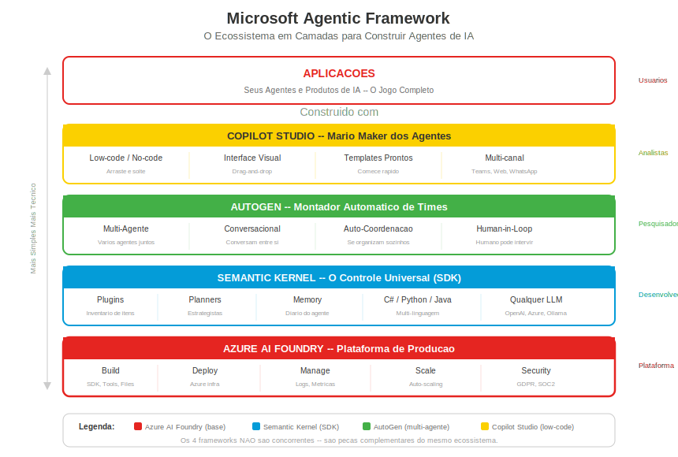

## Change Log

| Version | Date | Author | Changes |
|---------|------|--------|---------|
| 1.0.0 | 2026-03-18 | Paula Silva | Versao inicial — Edicao Super Mario Bros |

# Fase 7-4 — O Framework dos Herois: Microsoft Agentic Framework
## O Arsenal Completo para Construir Agentes de IA

---

**Preparado para:** Sofia
**Versao:** 2.0 — Edicao Mushroom Kingdom
**Autora:** Paula Silva | Software Global Black Belt, Microsoft Americas
**Data:** Marco 2026
**Idioma:** Portugues do Brasil (pt-BR)
**Colecao:** Agentic DevOps — Edicao Super Mario Bros

---

## SUMARIO

1. [Introducao — A Oficina dos Herois](#introducao)
2. [O Ecossistema Microsoft para Agentes de IA](#ecossistema)
3. [Semantic Kernel — O Motor Universal de Magias](#semantic-kernel)
4. [AutoGen — O Montador Automatico de Times](#autogen)
5. [AI Agents SDK (Azure AI Agent Service) — O Kit Oficial de Desenvolvimento](#ai-agents-sdk)
6. [Copilot Studio — O Mario Maker dos Agentes](#copilot-studio)
7. [Tabela Comparativa — Os 4 Frameworks](#tabela-comparativa)
8. [Quando Usar Qual — Guia de Decisao](#quando-usar)
9. [Como Eles se Conectam — Pecas Complementares](#como-conectam)
10. [Exemplo Pratico com Semantic Kernel](#exemplo-pratico)
11. [Conclusao — O Arsenal Completo](#conclusao)

---

## Introducao — A Oficina dos Herois

Sofia chegou a uma fase especial do Star World. Na entrada, havia uma placa enorme:

> **"BEM-VINDA A OFICINA DOS HEROIS — Aqui voce nao joga com personagens... voce CRIA personagens!"**

Ate agora, Sofia jogou com Mario, Luigi, Toad, Yoshi e Peach — personagens que ja existiam. Mas e se ela pudesse **criar seus proprios personagens**? Definir seus poderes, suas habilidades, suas fraquezas? E se pudesse montar times inteiros de personagens que conversam entre si e resolvem problemas sozinhos?

E exatamente isso que o **Microsoft Agentic Framework** oferece. Nao e uma unica ferramenta — e um **ecossistema completo de ferramentas** para construir, treinar, coordenar e gerenciar agentes de IA. Cada ferramenta tem seu papel, e juntas formam o arsenal mais poderoso disponivel para criar agentes inteligentes.

Pense assim: a Nintendo nao fez apenas um jogo Mario. Ela criou um **ecossistema**:
- Um **motor de jogo** (o engine que roda qualquer jogo)
- Um **criador de fases** (Mario Maker)
- Um **kit de desenvolvimento** (para estudio criar jogos oficiais)
- Um **sistema de multiplayer** (para jogadores cooperarem)

A Microsoft fez a mesma coisa para agentes de IA. Vamos conhecer cada peca.

---


## 1. O Ecossistema Microsoft para Agentes de IA

<div align="center">

<br/><em>Stack Microsoft AI</em>
</div>

Antes de mergulhar em cada ferramenta, vamos ver o mapa completo:

```
┌─────────────────────────────────────────────────────────────────┐
│                  MICROSOFT AGENTIC FRAMEWORK                     │
│                  O Ecossistema Completo                           │
│                                                                   │
│  ┌──────────────────┐  ┌──────────────────┐                     │
│  │  SEMANTIC KERNEL  │  │     AUTOGEN       │                     │
│  │  Motor Universal  │  │  Montador de Times│                     │
│  │  de Magias        │  │  Automatico       │                     │
│  │                   │  │                   │                     │
│  │  SDK (C#/Py/Java) │  │  Multi-Agente     │                     │
│  │  Plugins          │  │  Conversacional   │                     │
│  │  Planners         │  │  Auto-coordenacao │                     │
│  │  Memory           │  │                   │                     │
│  └──────────────────┘  └──────────────────┘                     │
│                                                                   │
│  ┌──────────────────┐  ┌──────────────────┐                     │
│  │  AI AGENTS SDK    │  │  COPILOT STUDIO   │                     │
│  │  Kit Oficial de   │  │  Mario Maker dos  │                     │
│  │  Desenvolvimento  │  │  Agentes          │                     │
│  │                   │  │                   │                     │
│  │  Azure AI Agent   │  │  Low-code/No-code │                     │
│  │  Service          │  │  Visual Builder   │                     │
│  │  Deploy & Manage  │  │  Templates prontos│                     │
│  └──────────────────┘  └──────────────────┘                     │
│                                                                   │
└─────────────────────────────────────────────────────────────────┘
```

Cada ferramenta resolve um problema diferente. Nenhuma substitui a outra. Juntas, cobrem **todo o espectro** de criacao de agentes — do mais simples ao mais complexo, do mais tecnico ao mais visual.

---

## 2. Semantic Kernel — O Motor Universal de Magias

### O que e

**Semantic Kernel** e um SDK (Software Development Kit) de codigo aberto que conecta sua aplicacao a **qualquer LLM** (Large Language Model). Ele funciona como uma **camada de abstracao** — voce escreve seu codigo uma vez, e ele funciona com OpenAI, Azure OpenAI, Hugging Face, Ollama, ou qualquer outro provedor de IA.

Disponivel em **C#, Python e Java**, o Semantic Kernel e a base sobre a qual muitos agentes da Microsoft sao construidos.

### Analogia Mario: O Controle Universal

Imagine um controle de videogame que funciona com **qualquer console**:

- Plugou no **Xbox**? Funciona.
- Plugou no **PlayStation**? Funciona.
- Plugou no **Nintendo Switch**? Funciona.
- Plugou no **PC**? Funciona.

Voce nao precisa comprar um controle diferente para cada console. Um controle, todos os consoles. **Semantic Kernel e esse controle universal** — um SDK, todos os LLMs.

```
┌──────────────────────────────────────────────────┐
│              SEMANTIC KERNEL                      │
│           (O Controle Universal)                  │
│                                                   │
│    Seu App ──► Semantic Kernel ──┬──► OpenAI      │
│                                  ├──► Azure OpenAI│
│                                  ├──► Hugging Face│
│                                  ├──► Ollama      │
│                                  └──► Qualquer LLM│
│                                                   │
│    Um codigo. Qualquer modelo. Qualquer hora.     │
└──────────────────────────────────────────────────┘
```

### Os 3 Superpoderes do Semantic Kernel

**Superpoder 1: Plugins (Inventario de Itens)**

Plugins sao como os **itens do inventario do Mario**. Cada plugin adiciona uma habilidade nova ao seu agente:

| Plugin | O que Faz | Analogia Mario |
|---|---|---|
| **WebSearch Plugin** | Busca informacoes na web | Luneta — ve alem do cenario atual |
| **FileIO Plugin** | Le e escreve arquivos | Mochila — guarda e carrega itens |
| **Math Plugin** | Faz calculos complexos | Calculadora de moedas |
| **HTTP Plugin** | Chama APIs externas | Warp Pipe para outros mundos |
| **Custom Plugin** | Qualquer funcao que VOCE criar | Item customizado que voce forjou |

Voce pode criar quantos plugins quiser. Cada um e uma funcao Python (ou C#, ou Java) que o agente pode chamar quando precisar. O agente **decide sozinho** quando usar cada plugin — como Mario decidindo quando usar o Fire Flower ou o Cape Feather.

**Superpoder 2: Planners (Estrategistas)**

Planners sao os **estrategistas** do Semantic Kernel. Eles recebem um objetivo complexo e criam um **plano de acao** usando os plugins disponiveis.

Imagine que voce pede ao Mario: *"Salve a Princesa Peach"*. O Mario nao sai correndo sem pensar. Ele:
1. Olha o mapa
2. Identifica os obstaculos
3. Escolhe quais power-ups precisa
4. Define a ordem das fases
5. Executa o plano

O Planner faz exatamente isso:
1. Recebe o objetivo (*"Analise o repositorio e sugira melhorias"*)
2. Identifica quais plugins estao disponiveis
3. Cria um plano passo a passo
4. Executa cada passo na ordem correta
5. Retorna o resultado final

**Superpoder 3: Memory (Diario de Aventuras)**

Memory e o **diario de aventuras** do agente. Ele lembra de conversas anteriores, decisoes tomadas, fatos aprendidos.

Sem Memory, cada conversa com o agente comeca do zero — como se Mario perdesse toda a memoria cada vez que morre. Com Memory, o agente acumula conhecimento:

- *"Na ultima conversa, o usuario disse que prefere Python"*
- *"O repositorio usa PostgreSQL, nao MySQL"*
- *"A equipe decidiu usar React 18 com Server Components"*

| Tipo de Memoria | O que Guarda | Analogia Mario |
|---|---|---|
| **Short-term** | Conversa atual | O que aconteceu nesta fase |
| **Long-term** | Fatos permanentes | Mapa completo do jogo ja explorado |
| **Working** | Contexto da tarefa atual | Inventario atual de power-ups |

### Arquitetura do Semantic Kernel

```
┌─────────────────────────────────────────────────────┐
│                    SUA APLICACAO                      │
│                                                       │
│  ┌─────────────┐  ┌──────────┐  ┌─────────────────┐ │
│  │   PLUGINS    │  │ PLANNERS │  │     MEMORY       │ │
│  │             │  │          │  │                   │ │
│  │ WebSearch   │  │ Recebe   │  │ Short-term       │ │
│  │ FileIO      │  │ objetivo │  │ Long-term        │ │
│  │ Math        │  │ Cria     │  │ Working          │ │
│  │ HTTP        │  │ plano    │  │                   │ │
│  │ Custom...   │  │ Executa  │  │ Vetorial (RAG)   │ │
│  └──────┬──────┘  └────┬─────┘  └────────┬──────────┘ │
│         │              │                  │            │
│  ┌──────▼──────────────▼──────────────────▼──────────┐ │
│  │              SEMANTIC KERNEL (SDK)                  │ │
│  │         Orquestra tudo, gerencia o fluxo            │ │
│  └──────────────────────┬────────────────────────────┘ │
│                         │                              │
│  ┌──────────────────────▼────────────────────────────┐ │
│  │           CONECTOR DE LLM                          │ │
│  │   OpenAI │ Azure OpenAI │ HuggingFace │ Ollama    │ │
│  └────────────────────────────────────────────────────┘ │
└─────────────────────────────────────────────────────────┘
```

---

## 3. AutoGen — O Montador Automatico de Times

### O que e

**AutoGen** e um framework de codigo aberto para criar **sistemas multi-agente conversacionais**. Em vez de um unico agente, voce cria **varios agentes que conversam entre si** para resolver problemas complexos.

A diferenca fundamental: no Semantic Kernel, voce programa o fluxo. No AutoGen, voce **descreve os agentes e a missao**, e eles se organizam sozinhos.

### Analogia Mario: O Auto-Montador de Times

Imagine que voce chega numa fase do Mario e, em vez de escolher manualmente cada personagem e definir a estrategia, voce simplesmente diz:

> *"Preciso salvar a Princesa no Castelo 8. Montem o time e resolvam."*

E magicamente:
- **Mario** se apresenta como lider
- **Luigi** diz *"Eu cuido das plataformas altas"*
- **Toad** diz *"Eu cuido dos segredos e itens"*
- **Yoshi** diz *"Eu cuido do transporte"*

Eles **conversam entre si**, decidem a estrategia, distribuem tarefas, e executam — tudo automaticamente. Voce so deu a missao. O time se montou e se coordenou sozinho.

### Como o AutoGen Funciona

```
┌──────────────────────────────────────────────────────┐
│                      AUTOGEN                          │
│                                                       │
│   Voce: "Analisem este codigo e sugiram melhorias"    │
│                                                       │
│   ┌──────────┐    ┌──────────┐    ┌──────────┐       │
│   │ Agente 1 │◄──►│ Agente 2 │◄──►│ Agente 3 │       │
│   │ Analista  │    │ Reviewer │    │ Escritor │       │
│   │          │    │          │    │          │       │
│   │ "Encontrei│    │ "Concordo│    │ "Reescrevi│      │
│   │  3 issues"│    │  com 2   │    │  o codigo"│      │
│   │          │    │  deles"  │    │           │      │
│   └──────────┘    └──────────┘    └──────────┘       │
│                                                       │
│   Agentes conversam entre si ate chegar a um consenso │
│   Resultado final: codigo melhorado + relatorio       │
└──────────────────────────────────────────────────────┘
```

**Caracteristicas-chave do AutoGen:**

| Caracteristica | Descricao | Analogia Mario |
|---|---|---|
| **Conversacao Multi-Agente** | Agentes trocam mensagens como num chat | Personagens planejando a estrategia antes da fase |
| **Papeis Definidos** | Cada agente tem uma persona e especialidade | Cada personagem tem sua ficha com poderes unicos |
| **Auto-Coordenacao** | Agentes decidem sozinhos quem fala quando | Time se organiza sem Player 1 ditar tudo |
| **Human-in-the-Loop** | Humano pode entrar na conversa quando necessario | Jogador humano intervem quando o time esta perdido |
| **Terminacao Automatica** | Conversa termina quando o objetivo e atingido | Fase completa quando a bandeira e alcancada |

### Exemplo de Fluxo AutoGen

1. **Voce cria os agentes:** Define 3 agentes — um Analista, um Reviewer, um Escritor
2. **Voce define a missao:** *"Revisem o arquivo auth.py e sugiram melhorias de seguranca"*
3. **Os agentes conversam:**
   - Analista: *"Encontrei que a funcao login() nao valida o tamanho da senha"*
   - Reviewer: *"Concordo, e tambem notei que nao ha rate limiting"*
   - Escritor: *"Vou reescrever a funcao com as correcoes sugeridas"*
   - Analista: *"A reescrita ficou boa, mas faltou tratar o caso de senha vazia"*
   - Escritor: *"Corrigido. Aqui esta a versao final"*
   - Reviewer: *"Aprovado. Todas as issues foram endereadas"*
4. **Resultado:** Codigo corrigido + relatorio de mudancas

### Quando Usar AutoGen

- Problemas que se beneficiam de **multiplas perspectivas** (como um debate entre especialistas)
- Tarefas que requerem **iteracao** (rascunho -> revisao -> correcao -> aprovacao)
- Cenarios onde voce quer que agentes **desafiem uns aos outros** (red team / blue team)
- Prototipagem rapida de **fluxos multi-agente** sem programar toda a logica de coordenacao

---

## 4. AI Agents SDK (Azure AI Agent Service) — O Kit Oficial de Desenvolvimento

### O que e

O **AI Agents SDK** (anteriormente Azure AI Agent Service) e o kit oficial da Microsoft para **construir, implantar e gerenciar agentes de IA em escala** na nuvem Azure. Se o Semantic Kernel e o motor e o AutoGen e o framework de conversacao, o AI Agents SDK e a **plataforma de producao** — onde agentes vivem, rodam e sao monitorados no mundo real.

### Analogia Mario: O Kit de Desenvolvimento Oficial da Nintendo

Quando a Nintendo quer que estudios externos criem jogos para o Switch, ela fornece um **kit de desenvolvimento oficial** (devkit). Esse kit inclui:

- O hardware especial para testes
- As ferramentas de compilacao
- Os guidelines de qualidade
- O sistema de publicacao na eShop
- O monitoramento de performance

O **AI Agents SDK** e o devkit oficial da Microsoft para agentes de IA:

| Nintendo DevKit | AI Agents SDK | O que Faz |
|---|---|---|
| Hardware de teste | Ambiente Azure | Onde o agente roda |
| Ferramentas de compilacao | SDK de build | Como construir o agente |
| Guidelines de qualidade | Best practices | Como fazer direito |
| Sistema de publicacao | Deploy pipeline | Como lancar o agente |
| Monitoramento | Observability | Como saber se esta funcionando |

### Capacidades do AI Agents SDK

**1. Construcao (Build)**

Crie agentes usando Python ou C# com acesso a:
- Modelos OpenAI e Azure OpenAI
- Tools (funcoes que o agente pode chamar)
- File search (busca em documentos)
- Code interpreter (executa codigo)
- Bing grounding (busca na web com fontes)

**2. Implantacao (Deploy)**

Implante agentes na infraestrutura Azure com:
- Escalabilidade automatica (mais usuarios = mais recursos)
- Alta disponibilidade (se um servidor cai, outro assume)
- Seguranca empresarial (autenticacao, autorizacao, rede privada)
- Compliance (GDPR, HIPAA, SOC2)

**3. Gerenciamento (Manage)**

Monitore e gerencie agentes em producao:
- Logs de todas as conversas
- Metricas de performance (latencia, tokens, custos)
- Alertas quando algo da errado
- Versionamento (versao 1, versao 2, rollback)

```
┌──────────────────────────────────────────────────────┐
│               AI AGENTS SDK (Azure)                   │
│           O Kit Oficial de Desenvolvimento             │
│                                                       │
│  ┌─────────┐   ┌──────────┐   ┌───────────────┐     │
│  │  BUILD   │──►│  DEPLOY  │──►│    MANAGE      │     │
│  │         │   │          │   │               │     │
│  │ Python  │   │ Azure    │   │ Logs          │     │
│  │ C#      │   │ Scale    │   │ Metricas      │     │
│  │ Tools   │   │ Security │   │ Alertas       │     │
│  │ Files   │   │ HA       │   │ Versoes       │     │
│  └─────────┘   └──────────┘   └───────────────┘     │
│                                                       │
│  Agentes em PRODUCAO, para usuarios REAIS             │
└──────────────────────────────────────────────────────┘
```

---

## 5. Copilot Studio — O Mario Maker dos Agentes

### O que e

**Copilot Studio** e uma plataforma **low-code/no-code** para criar agentes de IA sem precisar programar. Voce usa uma interface visual de arrastar e soltar (drag-and-drop) para definir fluxos, conectar dados, e publicar agentes que respondem em linguagem natural.

### Analogia Mario: Mario Maker

Lembra do **Super Mario Maker**? O jogo onde voce nao JOGA fases — voce **CRIA fases**? Voce arrasta blocos, posiciona inimigos, coloca power-ups, define o caminho, e publica para o mundo jogar. Nao precisa saber programar. Nao precisa saber game design. So precisa de criatividade e vontade.

**Copilot Studio e o Mario Maker dos agentes de IA:**

| Mario Maker | Copilot Studio | O que Faz |
|---|---|---|
| Arrastar blocos | Arrastar componentes | Construir visualmente |
| Posicionar inimigos | Definir condicoes | Criar logica de decisao |
| Colocar power-ups | Conectar ferramentas | Adicionar capacidades |
| Testar a fase | Testar o agente | Verificar se funciona |
| Publicar | Deploy | Lancar para usuarios |
| Sem programacao | Low-code | Acessivel a todos |

### Quem Usa Copilot Studio

- **Analistas de negocio** que querem automatizar processos
- **Gerentes de projeto** que querem agentes de FAQ
- **Times de suporte** que querem chatbots inteligentes
- **Desenvolvedores** que querem prototipar rapido antes de codificar
- **Qualquer pessoa** que quer criar um agente sem escrever uma linha de codigo

### Capacidades do Copilot Studio

**1. Interface Visual**
Construa fluxos de conversa arrastando componentes. Defina perguntas, respostas, condicoes, loops, e acoes.

**2. Conectores**
Conecte a mais de 1000 fontes de dados: SharePoint, Dynamics 365, Salesforce, bancos de dados, APIs REST, e muito mais.

**3. Generative AI**
O agente usa IA generativa para responder perguntas que nao estao nos fluxos definidos — consulta documentos, sites, e bases de conhecimento.

**4. Multi-Canal**
Publique o agente em: Microsoft Teams, websites, aplicativos moveis, WhatsApp, Facebook Messenger, e mais.

**5. Analytics**
Dashboards mostrando: quantas conversas, satisfacao do usuario, topicos mais perguntados, pontos de abandono.

```
┌──────────────────────────────────────────────────────┐
│                  COPILOT STUDIO                       │
│              O Mario Maker dos Agentes                │
│                                                       │
│   ┌─────────────────────────────────────────────┐    │
│   │          INTERFACE VISUAL                    │    │
│   │   [Pergunta] ──► [Condicao] ──► [Resposta]  │    │
│   │       │              │              │        │    │
│   │       ▼              ▼              ▼        │    │
│   │   [Acao API]    [Consulta IA]  [Feedback]    │    │
│   └─────────────────────────────────────────────┘    │
│                                                       │
│   Publica em: Teams │ Web │ Mobile │ WhatsApp         │
│                                                       │
│   SEM CODIGO. Arrasta, solta, publica.                │
└──────────────────────────────────────────────────────┘
```

---

## 6. Tabela Comparativa — Os 4 Frameworks

Esta e a tabela mais importante deste capitulo. Guarde ela como referencia:

| Aspecto | Semantic Kernel | AutoGen | AI Agents SDK | Copilot Studio |
|---|---|---|---|---|
| **O que e** | SDK para conectar apps a LLMs | Framework multi-agente conversacional | Plataforma de deploy e gerenciamento | Builder visual low-code |
| **Analogia Mario** | Controle universal (funciona em qualquer console) | Montador automatico de times | Kit de desenvolvimento oficial da Nintendo | Mario Maker (crie sem programar) |
| **Linguagens** | C#, Python, Java | Python | Python, C# | Visual (no-code/low-code) |
| **Complexidade** | Media | Media-Alta | Media-Alta | Baixa |
| **Publico** | Desenvolvedores | Pesquisadores e desenvolvedores avancados | Desenvolvedores e equipes de plataforma | Analistas, gerentes, qualquer pessoa |
| **Melhor para** | Integrar IA em apps existentes | Criar sistemas multi-agente | Deploy empresarial em producao | Agentes rapidos sem codigo |
| **Multi-Agente** | Basico (via orquestracao manual) | Nativo (principal funcionalidade) | Suportado | Limitado |
| **Deploy** | Voce gerencia | Voce gerencia | Azure gerencia | Microsoft gerencia |
| **Custo Inicial** | Gratuito (open-source) | Gratuito (open-source) | Pay-as-you-go (Azure) | Licenca Microsoft |
| **Curva de Aprendizado** | Moderada | Ingreme | Moderada | Suave |
| **Codigo Aberto** | Sim | Sim | SDK sim, servico nao | Nao |
| **Integracao Azure** | Excelente | Boa | Nativa | Nativa |
| **Ideal para** | Qualquer app que precisa de IA | Problemas complexos multi-perspectiva | Empresas com escala | Prototipagem e automacao |

### Analogia Resumida

Pense nos 4 frameworks como **4 formas de criar personagens de Mario**:

```
┌─────────────────────────────────────────────────────────┐
│                                                          │
│  SEMANTIC KERNEL = Programar o personagem do zero        │
│  (Voce define cada animacao, cada poder, cada interacao) │
│                                                          │
│  AUTOGEN = Descrever o time e eles se organizam          │
│  ("Preciso de 3 personagens que resolvam este puzzle")   │
│                                                          │
│  AI AGENTS SDK = Publicar o personagem na eShop          │
│  (Build, deploy, monitore, escale para milhoes)          │
│                                                          │
│  COPILOT STUDIO = Mario Maker                            │
│  (Arraste blocos, posicione, teste, publique)            │
│                                                          │
└─────────────────────────────────────────────────────────┘
```

---

## 7. Quando Usar Qual — Guia de Decisao

### Arvore de Decisao

```
Voce quer construir um agente de IA?
│
├── Voce sabe programar?
│   │
│   ├── SIM
│   │   │
│   │   ├── E um UNICO agente integrado ao seu app?
│   │   │   └── ✦ SEMANTIC KERNEL
│   │   │
│   │   ├── Sao MULTIPLOS agentes que conversam entre si?
│   │   │   └── ✦ AUTOGEN
│   │   │
│   │   ├── Precisa rodar em PRODUCAO com escala empresarial?
│   │   │   └── ✦ AI AGENTS SDK
│   │   │
│   │   └── Quer prototipar RAPIDO antes de codificar?
│   │       └── ✦ COPILOT STUDIO (depois migra para codigo)
│   │
│   └── NAO
│       └── ✦ COPILOT STUDIO
│
└── Voce e uma empresa grande?
    │
    ├── SIM → ✦ AI AGENTS SDK + SEMANTIC KERNEL
    └── NAO → ✦ SEMANTIC KERNEL ou AUTOGEN
```

### Cenarios Praticos

| Cenario | Framework Recomendado | Por que |
|---|---|---|
| *"Quero adicionar chat de IA ao meu app React"* | Semantic Kernel | Integra no seu app existente, conecta a qualquer LLM |
| *"Quero 3 agentes que debatam solucoes de arquitetura"* | AutoGen | Multi-agente conversacional e o ponto forte |
| *"Quero um agente de suporte para 10.000 usuarios"* | AI Agents SDK | Escala, seguranca, monitoramento empresarial |
| *"Quero um bot de FAQ para o time de RH"* | Copilot Studio | Sem codigo, rapido, integra com Teams |
| *"Quero um agente DevOps que faz deploy automatico"* | Semantic Kernel + AI Agents SDK | SK para logica, AI Agents SDK para rodar em producao |
| *"Quero experimentar antes de decidir"* | AutoGen ou Copilot Studio | Rapido para prototipar e validar ideias |

---

## 8. Como Eles se Conectam — Pecas Complementares

Este e um ponto **critico** que muita gente confunde: os 4 frameworks **NAO sao concorrentes**. Sao **pecas complementares** de um mesmo quebra-cabeca.

### A Analogia do Restaurante

Pense num restaurante:

| Peca do Restaurante | Framework | Funcao |
|---|---|---|
| **Fogao e panelas** | Semantic Kernel | As ferramentas para cozinhar (SDK base) |
| **Equipe de cozinheiros** | AutoGen | Multiplos chefs coordenando pratos complexos |
| **Cozinha industrial + delivery** | AI Agents SDK | Infraestrutura para servir centenas de clientes |
| **Cardapio digital self-service** | Copilot Studio | Interface facil para o cliente final |

Voce nao escolhe entre ter fogao OU cozinheiros OU delivery. Voce **usa todos juntos**!

### Como se Conectam na Pratica

```
┌───────────────────────────────────────────────────────────┐
│                     FLUXO REAL                             │
│                                                            │
│  1. PROTOTIPAGEM (Copilot Studio)                         │
│     "Vamos validar a ideia com um agente visual rapido"    │
│     ▼                                                      │
│  2. DESENVOLVIMENTO (Semantic Kernel)                      │
│     "Ideia validada! Vamos codificar com plugins e planner"│
│     ▼                                                      │
│  3. MULTI-AGENTE (AutoGen)                                │
│     "Precisamos de agentes que conversem entre si"         │
│     ▼                                                      │
│  4. PRODUCAO (AI Agents SDK)                               │
│     "Tudo pronto! Vamos deploiar no Azure com escala"      │
│                                                            │
└───────────────────────────────────────────────────────────┘
```

**Exemplo concreto:**

1. O time de produto cria um prototipo no **Copilot Studio** para testar com usuarios
2. O feedback e positivo! O time de engenharia reescreve usando **Semantic Kernel** com plugins customizados
3. O agente precisa consultar 3 especialistas (seguranca, performance, arquitetura) — usam **AutoGen** para o fluxo multi-agente
4. O agente vai para producao no **AI Agents SDK** com monitoramento, escala e seguranca

Cada ferramenta brilha numa fase diferente do ciclo de vida do agente.

---

## 9. Exemplo Pratico com Semantic Kernel

Vamos ver codigo real. Este exemplo cria um agente simples que usa Semantic Kernel para responder perguntas sobre um projeto.

### Instalacao

```bash
# Instalar o Semantic Kernel para Python
pip install semantic-kernel

# Instalar o conector para Azure OpenAI (ou OpenAI)
pip install semantic-kernel[azure]
```

### Codigo: Agente Basico com Semantic Kernel

```python
# agente_basico.py
# Um agente simples usando Semantic Kernel
# Analogia: Criando um Toad basico que responde perguntas

import asyncio
from semantic_kernel import Kernel
from semantic_kernel.connectors.ai.open_ai import AzureChatCompletion
from semantic_kernel.functions import kernel_function

# ============================================
# PASSO 1: Criar o Kernel (o Motor Universal)
# Analogia: Ligar o console e conectar o controle
# ============================================
kernel = Kernel()

# Conectar ao modelo de IA (o "cerebro" do agente)
# Funciona com Azure OpenAI, OpenAI, ou outros
servico_ia = AzureChatCompletion(
    deployment_name="gpt-4o",           # Qual modelo usar
    endpoint="https://SEU-ENDPOINT.openai.azure.com/",
    api_key="SUA-CHAVE-AQUI"           # NUNCA commitar isso!
)
kernel.add_service(servico_ia)

# ============================================
# PASSO 2: Criar um Plugin (Item do Inventario)
# Analogia: Dar ao Toad a habilidade de ler arquivos
# ============================================
class PluginProjeto:
    """Plugin que le informacoes do projeto.
    Analogia: A mochila do Toad com mapas do reino."""

    @kernel_function(
        name="ler_readme",
        description="Le o arquivo README do projeto"
    )
    def ler_readme(self) -> str:
        """Le o README.md e retorna o conteudo.
        Analogia: Toad abre o mapa do castelo."""
        try:
            with open("README.md", "r", encoding="utf-8") as f:
                return f.read()
        except FileNotFoundError:
            return "README.md nao encontrado no diretorio atual."

    @kernel_function(
        name="listar_arquivos",
        description="Lista os arquivos do projeto"
    )
    def listar_arquivos(self) -> str:
        """Lista arquivos no diretorio atual.
        Analogia: Toad olha ao redor e lista o que ve."""
        import os
        arquivos = os.listdir(".")
        return "\n".join(arquivos)

# Registrar o plugin no kernel
# Analogia: Toad guarda os itens na mochila
kernel.add_plugin(PluginProjeto(), plugin_name="projeto")

# ============================================
# PASSO 3: Usar o Agente
# Analogia: Perguntar ao Toad sobre o reino
# ============================================
async def main():
    """Funcao principal — conversa com o agente."""
    print("=" * 50)
    print("  TOAD HELPER - Assistente do Projeto")
    print("  (Digite 'sair' para encerrar)")
    print("=" * 50)

    while True:
        # Receber pergunta do usuario
        pergunta = input("\nVoce: ")

        if pergunta.lower() in ["sair", "exit", "quit"]:
            print("\nToad: Ate a proxima aventura! 🍄")
            break

        # Enviar para o agente processar
        # O kernel decide se precisa usar algum plugin
        resultado = await kernel.invoke_prompt(pergunta)
        print(f"\nToad: {resultado}")

# Iniciar o agente
if __name__ == "__main__":
    asyncio.run(main())
```

### O que Este Codigo Faz

```
┌──────────────────────────────────────────────────┐
│              FLUXO DO AGENTE                      │
│                                                   │
│  Usuario: "O que faz este projeto?"               │
│       │                                           │
│       ▼                                           │
│  Kernel recebe a pergunta                         │
│       │                                           │
│       ▼                                           │
│  Planner analisa: "Preciso ler o README"          │
│       │                                           │
│       ▼                                           │
│  Plugin 'ler_readme' e chamado automaticamente    │
│       │                                           │
│       ▼                                           │
│  Conteudo do README + Pergunta → LLM              │
│       │                                           │
│       ▼                                           │
│  LLM gera resposta baseada no README              │
│       │                                           │
│       ▼                                           │
│  Toad: "Este projeto e um app de tarefas que..."  │
└──────────────────────────────────────────────────┘
```

### Pontos Importantes do Codigo

| Linha | O que Faz | Analogia Mario |
|---|---|---|
| `Kernel()` | Cria o motor universal | Liga o console |
| `AzureChatCompletion(...)` | Conecta ao modelo de IA | Conecta o controle |
| `@kernel_function` | Define uma habilidade do plugin | Ensina um poder novo ao Toad |
| `kernel.add_plugin(...)` | Registra o plugin | Toad guarda item na mochila |
| `kernel.invoke_prompt(...)` | Envia pergunta ao agente | Fala com o Toad |

---

## Conclusao — O Arsenal Completo

Sofia agora conhece o **arsenal completo** para criar agentes de IA:

| Framework | Quando Usar | Primeira Coisa a Fazer |
|---|---|---|
| **Semantic Kernel** | Precisa integrar IA no seu app | `pip install semantic-kernel` |
| **AutoGen** | Precisa de agentes que conversam entre si | `pip install autogen-agentchat` |
| **AI Agents SDK** | Precisa rodar em producao empresarial | Criar recurso no Azure AI |
| **Copilot Studio** | Precisa de agente rapido sem codigo | Acessar copilot.microsoft.com |

Lembre-se: essas ferramentas **nao sao concorrentes**. Sao como os diferentes power-ups do Mario — cada um tem seu momento ideal, e combinados sao ainda mais poderosos.

O Controle Universal (Semantic Kernel) funciona com qualquer console. O Montador de Times (AutoGen) cria equipes automaticamente. O Kit Oficial (AI Agents SDK) leva tudo para producao. E o Mario Maker (Copilot Studio) permite que qualquer um crie sem programar.

Juntos, formam o ecossistema mais completo para construir agentes de IA. E Sofia agora tem acesso a tudo.

---

| Anterior: Fase 7-3 | Proximo: Fase 7-5 — Os 4 Mundos dos Agentes |
|---|---|

---

**Habilidade Desbloqueada!**
Sofia agora conhece o ecossistema completo da Microsoft para agentes de IA.
Ela coleciona o Controle Universal, o Montador de Times, o Kit Oficial e o Mario Maker!

**POWER-UP DESBLOQUEADO: Voce agora conhece os 4 frameworks da Microsoft para construir agentes de IA!**

**Fontes:**
- Semantic Kernel — https://learn.microsoft.com/en-us/semantic-kernel/
- AutoGen — https://microsoft.github.io/autogen/
- Azure AI Agent Service — https://learn.microsoft.com/en-us/azure/ai-services/agents/
- Copilot Studio — https://learn.microsoft.com/en-us/microsoft-copilot-studio/

---

## References

- Semantic Kernel — https://learn.microsoft.com/en-us/semantic-kernel/
- AutoGen — https://microsoft.github.io/autogen/
- Azure AI Agent Service — https://learn.microsoft.com/en-us/azure/ai-services/agents/

---

<div align="center">

⬅️ [Anterior: Fase 7-3: LangChain](7-3-langchain.md) · 🗺️ [Mapa dos Mundos](../INDEX.md) · ➡️ [Proximo: Fase 7-5: Four Channels](7-5-four-channels.md)

</div>
