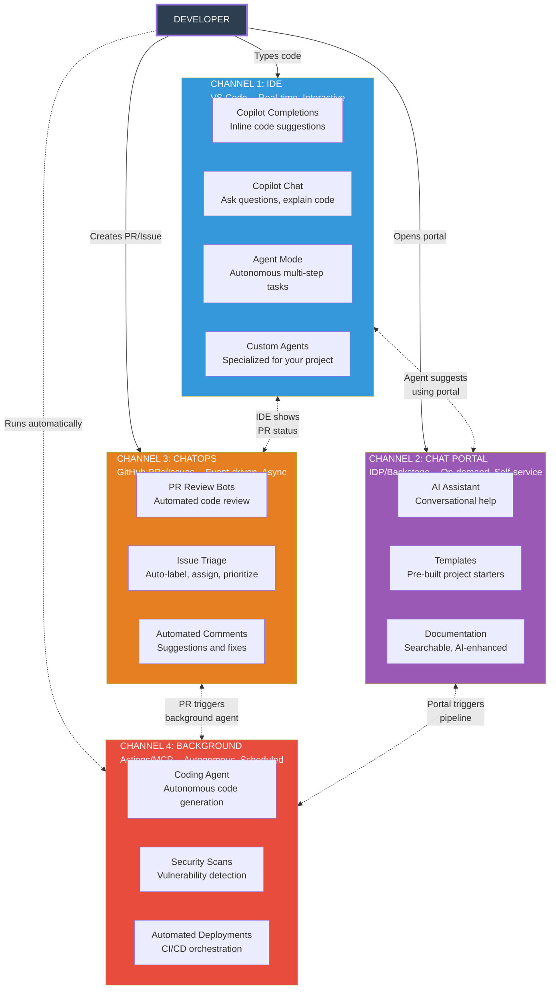

## Change Log

| Version | Date | Author | Changes |
|---------|------|--------|---------|
| 1.0.0 | 2026-03-18 | Paula Silva | Versao inicial — Edicao Super Mario Bros |

# Fase 7-5 — Os 4 Mundos dos Agentes: Canais de Comunicacao e Operacao
## Onde os Agentes Vivem, Trabalham e se Comunicam

---

**Preparado para:** Sofia
**Versao:** 2.0 — Edicao Mushroom Kingdom
**Autora:** Paula Silva | Microsoft Latam Software GBB
**Data:** Marco 2026
**Idioma:** Portugues do Brasil (pt-BR)
**Colecao:** Agentic DevOps — Edicao Super Mario Bros

---

## SUMARIO

1. [Introducao — Os 4 Mundos Onde os Agentes Vivem](#introducao)
2. [Canal 1 — IDE (Yoshi ao Seu Lado)](#canal-1-ide)
3. [Canal 2 — Chat Portal / IDP (A Praca Central com NPCs)](#canal-2-portal)
4. [Canal 3 — ChatOps / GitHub (O Correio dos Parakoopas)](#canal-3-chatops)
5. [Canal 4 — Background / MCP via Actions (Trabalhadores Noturnos)](#canal-4-background)
6. [Tabela Comparativa Completa — Os 4 Canais](#tabela-comparativa)
7. [Como os 4 Canais se Conectam](#como-conectam)
8. [Fluxo Real: Uma Tarefa Passando pelos 4 Canais](#fluxo-real)
9. [Conclusao — O Mushroom Kingdom Completo](#conclusao)

---

## Introducao — Os 4 Mundos Onde os Agentes Vivem

Sofia tinha uma pergunta que nao saia da cabeca:

> *"Eu sei O QUE sao agentes de IA. Eu sei COMO construi-los. Mas ONDE eles vivem? Onde eles trabalham? Como eu falo com eles?"*

Essa pergunta e mais importante do que parece. Um agente que vive dentro do VS Code se comporta de forma completamente diferente de um agente que roda em background num servidor. Um agente que responde a comentarios em PRs tem caracteristicas totalmente diferentes de um agente acessivel via portal web.

Existem **4 Canais** onde agentes de IA operam — 4 mundos distintos, cada um com suas regras, suas caracteristicas, e seus habitantes. Entender esses canais e **fundamental** para saber onde colocar cada agente e como interagir com eles.

Vamos mapea-los para o Mushroom Kingdom:

```
┌──────────────────────────────────────────────────────────────┐
│              OS 4 CANAIS DE OPERACAO DOS AGENTES              │
│                                                               │
│  ┌─────────────┐  ┌─────────────┐                            │
│  │  CANAL 1    │  │  CANAL 2    │                            │
│  │  IDE        │  │  PORTAL     │                            │
│  │             │  │             │                            │
│  │  Yoshi ao   │  │  Praca      │                            │
│  │  seu lado   │  │  Central    │                            │
│  │  TEMPO REAL │  │  ON-DEMAND  │                            │
│  └─────────────┘  └─────────────┘                            │
│                                                               │
│  ┌─────────────┐  ┌─────────────┐                            │
│  │  CANAL 3    │  │  CANAL 4    │                            │
│  │  CHATOPS    │  │  BACKGROUND │                            │
│  │             │  │             │                            │
│  │  Correio    │  │  Castelos   │                            │
│  │  Parakoopa  │  │  Distantes  │                            │
│  │  ASSINCRONO │  │  AUTONOMO   │                            │
│  └─────────────┘  └─────────────┘                            │
│                                                               │
└──────────────────────────────────────────────────────────────┘
```

Cada canal e um mundo diferente com regras diferentes. Vamos explorar cada um em profundidade.

### Diagrama: Os 4 Canais de Operacao dos Agentes



---

## Canal 1 — IDE (Yoshi ao Seu Lado)

### O que e

O Canal 1 e o agente que vive **DENTRO do seu editor de codigo** — VS Code, JetBrains (IntelliJ, PyCharm, WebStorm), ou qualquer IDE que suporte extensoes de IA. Esse agente esta **sempre presente**, vendo o que voce ve, entendendo o contexto do seu arquivo aberto, e respondendo em tempo real.

### Analogia Mario: Yoshi Caminhando ao Seu Lado

No Super Mario World, quando Mario monta no Yoshi, ele ganha um companheiro que esta **sempre ali**. Yoshi nao esta num castelo distante. Yoshi nao chega por correio. Yoshi esta **do seu lado, a cada passo**, pronto para agir:

- Mario pula? Yoshi pula junto.
- Mario encontra um inimigo? Yoshi pode engoli-lo.
- Mario precisa alcanca algo alto? Yoshi estica a lingua.
- Mario precisa voar? Yoshi bate as asas.

**O agente na IDE e o Yoshi.** Ele esta do seu lado, vendo seu codigo, entendendo seu contexto, e pronto para ajudar a qualquer instante.

```
┌──────────────────────────────────────────────────────┐
│                    VS CODE (IDE)                      │
│                                                       │
│  ┌─────────────────────────────────────────────┐     │
│  │  arquivo: auth.service.ts                    │     │
│  │                                              │     │
│  │  export class AuthService {                  │     │
│  │    async login(email: string, pass|          │     │
│  │                          ▲                   │     │
│  │                          │                   │     │
│  │              YOSHI COMPLETA:                  │     │
│  │              "password: string): Promise<     │     │
│  │               AuthResult>"                   │     │
│  │                                              │     │
│  └─────────────────────────────────────────────┘     │
│                                                       │
│  ┌─────────────────────────────────────────────┐     │
│  │  COPILOT CHAT (Yoshi falando)               │     │
│  │                                              │     │
│  │  Voce: "Explica essa funcao"                 │     │
│  │  Yoshi: "Esta funcao autentica o usuario..." │     │
│  └─────────────────────────────────────────────┘     │
└──────────────────────────────────────────────────────┘
```

### Exemplos de Agentes no Canal 1

**GitHub Copilot — O Yoshi Original**

O agente mais popular da IDE. Oferece varias formas de interacao:

| Modo | O que Faz | Analogia Yoshi |
|---|---|---|
| **Completions** | Sugere codigo enquanto voce digita | Yoshi adivinha pra onde Mario quer ir e ja prepara o caminho |
| **Chat** | Conversa em linguagem natural sobre o codigo | Mario pergunta ao Yoshi "o que tem atras daquele bloco?" |
| **Inline Chat** | Edita codigo selecionado via instrucao em texto | Mario aponta para um inimigo e Yoshi ataca exatamente ali |
| **Agent Mode** | Executa tarefas complexas (cria arquivos, roda testes) | Yoshi constroi uma ponte inteira enquanto Mario espera |

**Custom Agents (.agent.md)**

Voce pode criar agentes personalizados que vivem na IDE:

```
.github/agents/
├── react-engineer.agent.md     → Luigi especialista em frontend
├── dba.agent.md                → Toad especialista em banco de dados
├── devops-expert.agent.md      → Yoshi especialista em infra
└── qa-engineer.agent.md        → Peach especialista em testes
```

Cada arquivo `.agent.md` define um personagem com poderes especificos que o Copilot pode assumir dentro do VS Code.

**Skills (SKILL.md)**

Habilidades que o agente da IDE pode executar — workflows definidos com passo a passo:

```
.github/skills/
├── workflow-feature/SKILL.md   → Como criar uma feature nova
├── workflow-bugfix/SKILL.md    → Como corrigir um bug
└── workflow-deploy/SKILL.md    → Como fazer deploy
```

### Caracteristicas do Canal 1

| Caracteristica | Descricao | Analogia |
|---|---|---|
| **Tempo Real** | Responde instantaneamente, enquanto voce digita | Yoshi reage no mesmo instante que Mario |
| **Interativo** | Voce conversa, ele responde, voce ajusta | Dialogo constante entre Mario e Yoshi |
| **Context-Aware** | Ve seus arquivos abertos, sabe o projeto, entende o codigo | Yoshi ve tudo que Mario ve — mesmo campo de visao |
| **Local** | Roda no seu computador (com chamadas a API) | Yoshi esta fisicamente ao lado do Mario |
| **Pessoal** | Cada desenvolvedor tem sua propria instancia | Cada jogador tem seu proprio Yoshi |

### Operacoes do Canal 1

| Operacao | Descricao | Exemplo |
|---|---|---|
| **Code Completion** | Sugere a proxima linha de codigo | `if (user.isAdmin)` → sugere `{ return adminDashboard(); }` |
| **Chat** | Responde perguntas sobre o codigo | "O que faz essa funcao?" → explica em portugues |
| **Inline Suggestions** | Sugere melhorias no codigo selecionado | Seleciona funcao → "Essa funcao pode ser simplificada..." |
| **Agent Mode Tasks** | Executa tarefas completas com multiplos passos | "Crie um componente de login com testes" → cria 5 arquivos |
| **Debug Assistance** | Ajuda a encontrar e corrigir bugs | "Por que esse teste falha?" → analisa e sugere correcao |
| **Refactoring** | Reestrutura codigo mantendo o comportamento | "Extraia essa logica para um custom hook" → refatora |

### Quando Usar o Canal 1

- Voce esta **escrevendo codigo** e precisa de ajuda imediata
- Voce quer **entender** um trecho de codigo que nao conhece
- Voce precisa **refatorar** algo rapido
- Voce quer **criar** algo novo com orientacao passo a passo
- Voce esta **debugando** e precisa de um segundo par de olhos

---

## Canal 2 — Chat Portal / IDP (A Praca Central com NPCs)

### O que e

O Canal 2 e o agente acessivel via **portal web** — uma interface de navegador onde desenvolvedores (e nao-desenvolvedores) podem interagir com agentes de IA. Pode ser um Internal Developer Portal (IDP) como Backstage, um portal customizado da empresa, ou interfaces como GitHub.com e Azure DevOps.

### Analogia Mario: A Praca Central com Barracas de NPCs

Em muitos jogos Mario (especialmente Mario RPG e Paper Mario), existe uma **Praca Central** na cidade. Nessa praca, ha varias barracas de NPCs (personagens nao-jogaveis) que oferecem servicos:

- **Barraca de Informacoes:** NPC que responde qualquer pergunta sobre o reino
- **Barraca de Mapas:** NPC que mostra onde fica cada coisa
- **Barraca de Equipamentos:** NPC que fornece itens e ferramentas
- **Barraca de Missoes:** NPC que distribui tarefas e quests

Voce **caminha ate a barraca**, faz sua pergunta ou pedido, e o NPC responde. E **self-service** — voce vai quando precisa, escolhe qual barraca visitar, e interage no seu ritmo.

```
┌──────────────────────────────────────────────────────────┐
│                    PRACA CENTRAL (PORTAL)                  │
│                                                           │
│   ┌──────────┐  ┌──────────┐  ┌──────────┐              │
│   │ BARRACA  │  │ BARRACA  │  │ BARRACA  │              │
│   │   DE     │  │   DE     │  │   DE     │              │
│   │ CATALOGO │  │TEMPLATES │  │   DOCS   │              │
│   │          │  │          │  │          │              │
│   │ "Quais   │  │ "Crie um │  │ "Como    │              │
│   │ servicos │  │ novo     │  │ configuro│              │
│   │ existem?"│  │ servico" │  │ o OAuth?"│              │
│   └──────────┘  └──────────┘  └──────────┘              │
│                                                           │
│   ┌──────────┐  ┌──────────┐                             │
│   │ BARRACA  │  │ BARRACA  │                             │
│   │   DE     │  │   DE     │                             │
│   │ STATUS   │  │ONBOARDING│                             │
│   │          │  │          │                             │
│   │ "Qual o  │  │ "Sou novo│                             │
│   │ status   │  │  aqui.   │                             │
│   │ do deploy│  │ Me ajuda"│                             │
│   │ ?"       │  │          │                             │
│   └──────────┘  └──────────┘                             │
│                                                           │
│   Sofia caminha ate a barraca que precisa e pergunta...   │
└──────────────────────────────────────────────────────────┘
```

### Exemplos de Agentes no Canal 2

**Portal do Desenvolvedor (IDP) com Assistente de IA**

Um portal web centralizado onde a equipe encontra tudo:
- Catalogo de servicos (quais microservicos existem, quem mantem)
- Templates para criar novos projetos
- Documentacao centralizada
- Status de deploys e pipelines
- Um **assistente de IA integrado** que responde perguntas

**Copilot no GitHub.com**

O GitHub Copilot acessivel via navegador em github.com:
- Chat no repositorio
- Explicacao de codigo pelo browser
- Sugestoes em Pull Requests
- Busca inteligente em issues e discussoes

**Portais Customizados da Empresa**

Muitas empresas criam portais internos com agentes de IA:
- Portal de RH com chatbot para perguntas sobre beneficios
- Portal de TI com agente para troubleshooting
- Portal de engenharia com agente para padroes e melhores praticas

### Caracteristicas do Canal 2

| Caracteristica | Descricao | Analogia |
|---|---|---|
| **On-Demand** | Voce acessa quando precisa, nao esta sempre visivel | Voce vai a Praca quando quer, nao mora la |
| **Request/Response** | Voce pergunta, recebe resposta, fim | Fala com o NPC, recebe a informacao, segue caminho |
| **Contexto Amplo** | Acessa informacoes de toda a organizacao | NPC conhece TODO o reino, nao so sua fase |
| **Team-Wide** | Todos da equipe acessam o mesmo portal | Todos os jogadores vao a mesma Praca |
| **Self-Service** | Nao precisa pedir para alguem — va e faca | Nao precisa de convite — a Praca e publica |
| **Integrado com Catalogos** | Conectado a catalogos de servicos, APIs, docs | Barracas conectadas ao mapa completo do reino |

### Operacoes do Canal 2

| Operacao | Descricao | Exemplo |
|---|---|---|
| **Onboarding** | Ajudar novos membros da equipe | "Sou nova no time. Como configuro o ambiente?" |
| **Doc Lookup** | Buscar documentacao | "Qual e o padrao de autenticacao da empresa?" |
| **Template Generation** | Criar novos projetos a partir de templates | "Crie um novo microservico Node.js com PostgreSQL" |
| **Status Check** | Verificar status de deploys, pipelines, servicos | "Qual e o status do deploy do servico de pagamentos?" |
| **Catalog Search** | Buscar servicos, APIs, bibliotecas | "Quais servicos usam PostgreSQL?" |
| **Knowledge Base** | Responder perguntas tecnicas | "Como funciona o circuit breaker no nosso gateway?" |

### Quando Usar o Canal 2

- Voce precisa de informacoes que **vao alem do seu codigo** (organizacao, time, infraestrutura)
- Voce esta fazendo **onboarding** num novo time ou projeto
- Voce quer **criar algo novo** usando templates padronizados
- Voce precisa saber **quem e responsavel** por determinado servico
- Voce quer uma visao **panoramica** do estado dos sistemas

---

## Canal 3 — ChatOps / GitHub (O Correio dos Parakoopas)

### O que e

O Canal 3 sao agentes que operam **dentro do GitHub** (ou GitLab, Azure DevOps) — respondendo a eventos como criacao de Pull Requests, comentarios em issues, reviews de codigo, e outras interacoes no repositorio. O agente nao esta na sua IDE e nao esta num portal. Ele esta **no fluxo de trabalho do Git**, reagindo a eventos.

### Analogia Mario: O Sistema de Correio dos Parakoopas

No Mushroom Kingdom, os **Parakoopas** (Koopas com asas) funcionam como um **sistema de correio**. Eles carregam cartas (mensagens) entre castelos e mundos:

1. Voce **escreve uma carta** (cria uma issue ou abre um PR)
2. O **Parakoopa pega a carta** (webhook detecta o evento)
3. O **Parakoopa entrega no castelo certo** (agente recebe a mensagem)
4. O **castelo processa** (agente analisa e responde)
5. O **Parakoopa traz a resposta** (comentario aparece no PR/issue)

Voce nao precisa ir ate o castelo. Voce nao precisa estar online. Voce escreve a carta, e o sistema de correio cuida do resto. Quando a resposta chegar, ela estara la esperando por voce.

```
┌──────────────────────────────────────────────────────────┐
│                SISTEMA DE CORREIO PARAKOOPA               │
│                      (CHATOPS)                            │
│                                                           │
│  Desenvolvedor                     Agente                 │
│  ┌──────────┐                     ┌──────────┐           │
│  │          │  ── Cria PR ──────► │          │           │
│  │  Sofia   │                     │  Copilot │           │
│  │          │  ◄── Review ─────── │  Review  │           │
│  │          │                     │  Bot     │           │
│  │          │  ── Comenta ──────► │          │           │
│  │          │                     │          │           │
│  │          │  ◄── Responde ───── │          │           │
│  └──────────┘                     └──────────┘           │
│                                                           │
│  Tudo acontece NO GITHUB, de forma ASSINCRONA             │
│  Sofia nao precisa estar online quando o agente responde  │
└──────────────────────────────────────────────────────────┘
```

### Exemplos de Agentes no Canal 3

**Copilot Code Review**

Quando voce abre um Pull Request, o Copilot pode:
- Analisar o codigo automaticamente
- Deixar comentarios com sugestoes de melhoria
- Identificar bugs potenciais
- Sugerir testes que estao faltando
- Apontar violacoes de padroes

**Bots de Triagem de Issues**

Quando uma issue e criada, um agente pode:
- Classificar automaticamente (bug, feature, question)
- Adicionar labels corretas
- Atribuir ao time responsavel
- Solicitar informacoes faltantes
- Sugerir issues relacionadas ou duplicadas

**Bots de Comentarios em PRs**

Agentes que reagem a comentarios:
- `@copilot explain` → Explica o que o PR faz
- `@copilot suggest tests` → Sugere testes para o codigo alterado
- `@copilot fix` → Tenta corrigir issues apontados no review
- `@copilot docs` → Gera documentacao para as mudancas

**Dependabot e Security Bots**

Agentes que monitoram dependencias:
- Detectam vulnerabilidades em pacotes
- Abrem PRs automaticamente com atualizacoes
- Notificam sobre breaking changes

### Caracteristicas do Canal 3

| Caracteristica | Descricao | Analogia |
|---|---|---|
| **Assincrono** | Voce age agora, resposta chega depois | Envia carta, resposta chega amanha |
| **Event-Driven** | Agente reage a eventos (PR aberto, issue criada) | Parakoopa voa quando detecta carta nova |
| **Colaborativo** | Multiplas pessoas veem e interagem | Cartas ficam no quadro de avisos — todos leem |
| **Auditavel** | Tudo fica registrado no historico do GitHub | Arquivo de correspondencias — nada se perde |
| **Contextual** | Agente ve o diff, a issue, o historico | Parakoopa carrega o contexto completo junto com a carta |
| **Nao-Bloqueante** | Voce continua trabalhando enquanto espera resposta | Voce nao fica esperando o Parakoopa voltar |

### Operacoes do Canal 3

| Operacao | Trigger (Evento) | O que o Agente Faz |
|---|---|---|
| **PR Review** | PR aberto ou atualizado | Analisa diff, comenta sugestoes, aponta bugs |
| **Issue Triage** | Issue criada | Classifica, labela, atribui, pede mais info |
| **Auto-Response** | Comentario com @mention | Responde perguntas, executa comandos |
| **Code Suggestions** | Review solicitado | Sugere melhorias inline no diff |
| **Security Scan** | Codigo novo pusheado | Verifica vulnerabilidades, dependencias |
| **Changelog** | PR mergeado | Gera entry no changelog automaticamente |
| **Release Notes** | Tag/release criada | Compila release notes a partir dos PRs |

### Quando Usar o Canal 3

- Voce quer **code review automatizado** em toda PR
- Voce quer **triagem automatica** de issues
- Voce precisa de **feedback assincrono** no codigo
- Voce quer **auditabilidade** (tudo registrado no Git)
- Voce trabalha com **equipes distribuidas** em fusos horarios diferentes

---

## Canal 4 — Background / MCP via Actions (Trabalhadores Noturnos)

### O que e

O Canal 4 sao agentes que rodam **em segundo plano**, na nuvem, sem interacao humana direta. Eles sao acionados por **eventos** (push de codigo, merge de PR, schedule) ou por **agendamento** (todo dia as 3h da manha, toda segunda-feira). Executam tarefas autonomamente e reportam resultados quando terminam.

### Analogia Mario: NPCs Trabalhando em Castelos Distantes

No Mushroom Kingdom, enquanto Mario dorme, ha **NPCs trabalhando em castelos distantes**:

- **Toads mineradores** extraindo moedas nas minas durante a noite
- **Toads construtores** construindo pontes e estradas
- **Toads alquimistas** preparando pocoes e power-ups
- **Toads guardioes** patrulhando as fronteiras do reino

Mario **nao precisa estar presente**. Ele nao precisa dar ordens em tempo real. Ele dorme, e quando acorda:

> *"Bom dia, Mario! Enquanto voce dormia: construimos 3 pontes, mineramos 500 moedas, e descobrimos uma nova rota secreta!"*

E EXATAMENTE assim que agentes de background funcionam.

```
┌──────────────────────────────────────────────────────────┐
│            CASTELOS DISTANTES (BACKGROUND)                 │
│                                                           │
│  ┌──────────┐  ┌──────────┐  ┌──────────┐               │
│  │ CASTELO  │  │ CASTELO  │  │ CASTELO  │               │
│  │    1     │  │    2     │  │    3     │               │
│  │          │  │          │  │          │               │
│  │ Coding   │  │ Security │  │ Deploy   │               │
│  │ Agent    │  │ Scanner  │  │ Pipeline │               │
│  │          │  │          │  │          │               │
│  │ Escreve  │  │ Verifica │  │ Publica  │               │
│  │ codigo   │  │ vulner.  │  │ versao   │               │
│  │ sozinho  │  │ todo dia │  │ auto     │               │
│  └──────────┘  └──────────┘  └──────────┘               │
│                                                           │
│     zzz...   Sofia dorme enquanto eles trabalham   zzz... │
│                                                           │
│  Manha seguinte:                                          │
│  "3 tarefas concluidas, 0 vulnerabilidades, deploy OK!"  │
└──────────────────────────────────────────────────────────┘
```

### Exemplos de Agentes no Canal 4

**GitHub Copilot Coding Agent**

O agente mais impressionante do Canal 4. Quando ativado:
1. Recebe uma issue do GitHub
2. Cria um branch automaticamente
3. Escreve codigo para resolver a issue
4. Roda testes
5. Abre um Pull Request
6. Espera review humano

**Tudo isso sem nenhuma interacao humana.** Sofia atribui a issue, vai dormir, e acorda com um PR pronto para revisao.

```
┌──────────────────────────────────────────────────────────┐
│            GITHUB COPILOT CODING AGENT                    │
│                                                           │
│  Issue #42: "Adicionar validacao de email no signup"      │
│       │                                                   │
│       ▼ (Sofia atribui ao Copilot e vai dormir)           │
│                                                           │
│  ┌──────────┐                                            │
│  │ AGENTE   │  1. Le a issue                             │
│  │ CODING   │  2. Cria branch feature/email-validation   │
│  │          │  3. Escreve codigo de validacao             │
│  │  (roda   │  4. Escreve testes unitarios               │
│  │   na     │  5. Roda npm test — tudo passa             │
│  │  nuvem)  │  6. Abre PR #43 com descricao detalhada   │
│  └──────────┘                                            │
│       │                                                   │
│       ▼ (Manha seguinte)                                  │
│                                                           │
│  Sofia: "Uau, PR pronta! So preciso revisar e aprovar."  │
└──────────────────────────────────────────────────────────┘
```

**Scans de Seguranca Agendados**

Agentes que rodam periodicamente verificando vulnerabilidades:
- Scan diario de dependencias (Dependabot, Snyk)
- Analise semanal de codigo estatico (CodeQL)
- Verificacao mensal de compliance
- Auditoria de permissoes e acessos

**Deploy Automatizado**

Pipeline que detecta merge na branch main e faz deploy:
- Build automatico
- Testes de integracao
- Deploy em staging
- Smoke tests
- Deploy em producao (se tudo verde)
- Notificacao no Slack

**MCP-Connected Agents em GitHub Actions**

Agentes em Actions que usam MCP (Model Context Protocol) para acessar ferramentas externas:
- Agente que le metricas do Datadog e gera relatorios
- Agente que consulta Jira e atualiza issues
- Agente que verifica status do Kubernetes e escala recursos
- Agente que analisa logs e cria alertas

### Caracteristicas do Canal 4

| Caracteristica | Descricao | Analogia |
|---|---|---|
| **Autonomo** | Roda sem interacao humana | NPCs trabalham sozinhos nos castelos |
| **Agendado ou Event-Triggered** | Ativado por hora ou evento | "Todo dia as 3h" ou "quando alguem faz merge" |
| **Sem Interacao Direta** | Nao ha dialogo — agente executa e reporta | Voce nao conversa com os mineradores — eles trabalham e reportam |
| **Escalavel** | Pode rodar multiplas instancias em paralelo | Dezenas de Toads trabalhando ao mesmo tempo |
| **Reportavel** | Gera relatorios, PRs, notificacoes | "Relatorio matinal: 500 moedas mineradas, 0 problemas" |
| **Custoso (em recursos)** | Consome recursos de nuvem (compute, tokens) | Manter castelos distantes tem custo |

### Operacoes do Canal 4

| Operacao | Trigger | O que o Agente Faz |
|---|---|---|
| **Coding Agent** | Issue atribuida ao agente | Escreve codigo, cria PR |
| **Security Scan** | Schedule (diario) | Verifica vulnerabilidades, gera relatorio |
| **Auto Deploy** | Merge na main | Build, test, deploy automatico |
| **Batch Processing** | Schedule (semanal) | Processa dados, gera relatorios |
| **Dependency Update** | Nova versao detectada | Abre PR com atualizacao |
| **Performance Report** | Schedule (mensal) | Analisa metricas, gera insights |
| **Infrastructure Scaling** | Threshold de CPU/memoria | Escala recursos automaticamente |
| **Log Analysis** | Volume anomalo de erros | Analisa logs, cria alerta, sugere fix |

### Quando Usar o Canal 4

- Tarefas que **nao precisam de interacao humana** durante a execucao
- Processos que devem rodar em **horarios especificos** (fora do horario comercial)
- Tarefas **demoradas** que bloqueariam o desenvolvedor se fossem sincronas
- Operacoes que se beneficiam de **paralelismo** (rodar em muitos repos ao mesmo tempo)
- Automacoes que devem acontecer **sempre** (nao depender de alguem lembrar de executar)

---

## Tabela Comparativa Completa — Os 4 Canais

Esta e a tabela mais importante deste capitulo. Imprima, cole na parede, consulte sempre:

| Aspecto | Canal 1: IDE | Canal 2: Chat Portal | Canal 3: ChatOps | Canal 4: Background |
|---|---|---|---|---|
| **Onde** | VS Code, JetBrains | Portal Web (Backstage, GitHub.com) | GitHub PRs/Issues | Cloud (GitHub Actions, Azure) |
| **Quando** | Tempo real, enquanto voce digita | On-demand, quando voce acessa | Event-driven (PR, issue, comment) | Agendado ou event-triggered |
| **Interacao** | Interativa, dialogo constante | Request/Response (pergunta → resposta) | Assincrona (age agora, responde depois) | Nenhuma (autonomo) |
| **Quem Inicia** | Desenvolvedor (digitando, perguntando) | Desenvolvedor (acessando portal) | Evento (PR aberta, issue criada) | Schedule ou evento (merge, cron) |
| **Latencia** | Milissegundos a segundos | Segundos a minutos | Minutos a horas | Minutos a horas |
| **Contexto** | Arquivo aberto, projeto local | Organizacao inteira, catalogos | Diff do PR, historico da issue | Repositorio completo, dados externos |
| **Visibilidade** | So o desenvolvedor ve | Time inteiro no portal | Todos no PR/issue | Logs e relatorios |
| **Persistencia** | Sessao atual (pode salvar) | Historico no portal | Permanente no GitHub | Logs e artefatos |
| **Exemplo Principal** | Copilot Chat no VS Code | Backstage com AI Assistant | Copilot PR Review | Copilot Coding Agent |
| **Complexidade** | Baixa | Media | Media | Alta |
| **Custo** | Licenca Copilot | Infra do portal + IA | Infra Actions + IA | Compute cloud + tokens IA |
| **Analogia Mario** | Yoshi ao seu lado | Praca Central com NPCs | Correio Parakoopa | Castelos distantes trabalhando a noite |
| **Frase-Chave** | *"Me ajuda AGORA"* | *"Preciso de informacao"* | *"Revisa isso pra mim"* | *"Faz isso enquanto eu durmo"* |

### Resumo Visual

```
┌────────────────────────────────────────────────────────────────┐
│                                                                 │
│  CANAL 1: IDE         "Yoshi, me ajuda com essa linha!"         │
│  ► TEMPO REAL         ► Voce + Agente, lado a lado              │
│                                                                 │
│  CANAL 2: PORTAL      "Ola NPC, onde fica o servico X?"         │
│  ► ON-DEMAND          ► Voce vai ate la quando precisa          │
│                                                                 │
│  CANAL 3: CHATOPS     "Parakoopa, entrega esse review pra mim" │
│  ► ASSINCRONO         ► Envia e continua trabalhando            │
│                                                                 │
│  CANAL 4: BACKGROUND  "Toads, resolvam isso enquanto eu durmo"  │
│  ► AUTONOMO           ► Voce nem esta presente                  │
│                                                                 │
└────────────────────────────────────────────────────────────────┘
```

---

## Como os 4 Canais se Conectam

Os 4 canais nao sao ilhas isoladas. Eles formam um **ecossistema integrado** onde uma tarefa pode fluir de um canal para outro. Veja como se conectam:

### Conexao 1: IDE → ChatOps

Voce esta no Canal 1 (IDE) escrevendo codigo. Termina a feature, abre um PR. Automaticamente, o Canal 3 (ChatOps) entra em acao: o Copilot Review Bot analisa seu PR e deixa comentarios.

```
Canal 1 (IDE)                    Canal 3 (ChatOps)
┌──────────┐  ── git push ──►  ┌──────────┐
│ Escreve  │  ── abre PR ───►  │ Review   │
│ codigo   │                    │ Bot      │
│ com      │  ◄── comentarios── │ analisa  │
│ Copilot  │                    │ o PR     │
└──────────┘                    └──────────┘
```

### Conexao 2: ChatOps → Background

O review bot (Canal 3) aprova o PR. O merge acontece e dispara o pipeline de deploy (Canal 4), que roda em background.

```
Canal 3 (ChatOps)               Canal 4 (Background)
┌──────────┐  ── PR merged ──► ┌──────────┐
│ Review   │                    │ Deploy   │
│ aprovado │                    │ Pipeline │
│ PR merge │                    │ roda     │
└──────────┘                    └──────────┘
```

### Conexao 3: Background → Portal

O deploy (Canal 4) finaliza e atualiza o status no portal (Canal 2). Qualquer pessoa da equipe pode acessar o portal e ver o status.

```
Canal 4 (Background)            Canal 2 (Portal)
┌──────────┐  ── status ──────► ┌──────────┐
│ Deploy   │  ── metricas ────► │ Dashboard│
│ concluido│                    │ atualizado│
└──────────┘                    └──────────┘
```

### Conexao 4: Portal → IDE

Um novo membro do time acessa o portal (Canal 2), encontra um template, e usa ele para criar um novo projeto na IDE (Canal 1).

```
Canal 2 (Portal)                Canal 1 (IDE)
┌──────────┐  ── template ───► ┌──────────┐
│ Escolhe  │  ── scaffold ──►  │ Projeto  │
│ template │                    │ criado   │
│ no portal│                    │ no VS    │
└──────────┘                    └──────────┘
```

### O Ciclo Completo

```
┌────────────────────────────────────────────────────────────┐
│                    CICLO DOS 4 CANAIS                       │
│                                                             │
│   ┌──────────┐        ┌──────────┐                         │
│   │ CANAL 1  │──push──►│ CANAL 3  │                         │
│   │ IDE      │◄─fix───│ ChatOps  │                         │
│   │          │        │          │                         │
│   └────▲─────┘        └────┬─────┘                         │
│        │                   │ merge                          │
│   template              │                               │
│        │                   ▼                                │
│   ┌────┴─────┐        ┌──────────┐                         │
│   │ CANAL 2  │◄─status─│ CANAL 4  │                         │
│   │ Portal   │        │Background│                         │
│   └──────────┘        └──────────┘                         │
│                                                             │
│   Os 4 canais formam um CICLO CONTINUO de desenvolvimento   │
└────────────────────────────────────────────────────────────┘
```

---

## Fluxo Real: Uma Tarefa Passando pelos 4 Canais

Vamos acompanhar uma tarefa real passando pelos 4 canais. Sofia recebeu a tarefa: **"Adicionar validacao de email no formulario de signup."**

### Passo 1 — Canal 2 (Portal): Descoberta

Sofia acessa o portal do desenvolvedor e pergunta ao assistente de IA:

> **Sofia:** "Onde fica o formulario de signup no nosso projeto?"
>
> **Portal AI:** "O formulario de signup esta em `frontend/src/pages/Signup.tsx`. O servico de autenticacao esta em `backend/src/services/auth.service.ts`. O time responsavel e o Time Alpha."

Sofia agora sabe onde ir. O portal deu o contexto amplo da organizacao.

### Passo 2 — Canal 1 (IDE): Desenvolvimento

Sofia abre o VS Code, navega ate o arquivo, e comeca a codar com o Copilot:

> **Sofia:** *digita* `function validateEmail(`
>
> **Copilot (Yoshi):** *sugere* `email: string): boolean { const regex = /^[^\s@]+@[^\s@]+\.[^\s@]+$/; return regex.test(email); }`
>
> **Sofia:** "Copilot, cria testes para essa funcao"
>
> **Copilot (Yoshi):** *cria* `validateEmail.test.ts` com 8 test cases

Sofia termina o desenvolvimento com a ajuda do Yoshi. Codigo escrito, testes passando.

### Passo 3 — Canal 3 (ChatOps): Review

Sofia faz push e abre um PR. O Canal 3 entra em acao automaticamente:

> **Copilot Review Bot:** "Analisei o PR #47. Encontrei 2 sugestoes:
> 1. A regex nao valida dominios com TLD de 1 caractere. Considere usar uma biblioteca como `validator.js`.
> 2. Faltam testes para emails com caracteres unicode.
> Aprovado com sugestoes."

> **Colega (Carlos):** "Concordo com a sugestao 1. Vamos usar `validator.js`."

Sofia volta para o Canal 1 (IDE), faz as correcoes, e atualiza o PR.

### Passo 4 — Canal 4 (Background): Deploy

O PR e aprovado e mergeado. O Canal 4 entra em acao:

1. **GitHub Actions** detecta o merge na main
2. **Pipeline de CI** roda: build, testes, lint — tudo verde
3. **Deploy em staging** automatico
4. **Smoke tests** passam
5. **Deploy em producao** automatico
6. **Notificacao** no Slack: "Deploy v1.23.0 concluido com sucesso"

Sofia nem precisou apertar um botao. Tudo aconteceu em background.

### Passo 5 — Canal 2 (Portal): Verificacao

Sofia acessa o portal e verifica:

> **Dashboard:** Deploy v1.23.0 — Status: OK — Health: 100% — Errors: 0

O ciclo se fechou. Uma tarefa, 4 canais, cada um fazendo sua parte.

```
┌────────────────────────────────────────────────────────────┐
│              FLUXO REAL: VALIDACAO DE EMAIL                  │
│                                                             │
│  Portal ──► "Signup.tsx no frontend, time Alpha"            │
│    │                                                        │
│    ▼                                                        │
│  IDE ──► Escreve codigo + testes com Copilot                │
│    │                                                        │
│    ▼                                                        │
│  ChatOps ──► Review automatico + review humano              │
│    │                                                        │
│    ▼                                                        │
│  Background ──► CI/CD, deploy, notificacao                  │
│    │                                                        │
│    ▼                                                        │
│  Portal ──► Verifica status: tudo verde!                    │
│                                                             │
│  TEMPO TOTAL: 4 horas (sendo 2h de desenvolvimento)        │
└────────────────────────────────────────────────────────────┘
```

---

## Conclusao — O Mushroom Kingdom Completo

Sofia agora entende que agentes de IA nao vivem em apenas um lugar. Eles estao **espalhados por todo o Mushroom Kingdom**, cada um em seu mundo ideal:

| Canal | Mundo Mario | Frase que Resume |
|---|---|---|
| **Canal 1: IDE** | Yoshi ao lado do Mario | *"Estou aqui, sempre que precisar"* |
| **Canal 2: Portal** | Praca Central com NPCs | *"Venha ate mim quando quiser informacoes"* |
| **Canal 3: ChatOps** | Sistema de Correio Parakoopa | *"Mande sua carta, eu cuido do resto"* |
| **Canal 4: Background** | Castelos distantes com NPCs trabalhadores | *"Pode dormir, eu trabalho a noite"* |

O poder real aparece quando os 4 canais trabalham **juntos**. Nenhum canal sozinho e suficiente. Mas os 4 conectados criam um ecossistema onde:

- Voce **descobre** informacoes no portal (Canal 2)
- Voce **desenvolve** com assistencia na IDE (Canal 1)
- Voce **colabora** via PRs e issues (Canal 3)
- Voce **automatiza** tudo em background (Canal 4)

E o **Mushroom Kingdom completo** — todos os mundos conectados, todos os personagens trabalhando em harmonia, todos os canais fluindo naturalmente de um para o outro.

---

| Anterior: Fase 7-4 — Microsoft Agentic Framework | Proximo: Fase 7-6 — IDP e Backstage |
|---|---|

---

**Habilidade Desbloqueada!**
Sofia agora conhece os 4 Canais de Operacao dos Agentes de IA.
Ela sabe onde cada agente vive, como falar com eles, e como os canais se conectam!

**POWER-UP DESBLOQUEADO: Voce agora entende os 4 mundos onde agentes de IA operam — IDE, Portal, ChatOps e Background!**

**Fontes:**
- GitHub Copilot — https://docs.github.com/en/copilot
- GitHub Copilot Coding Agent — https://docs.github.com/en/copilot/using-github-copilot/using-copilot-coding-agent
- Backstage by Spotify — https://backstage.io/docs
- GitHub Actions — https://docs.github.com/en/actions

---

## References

- GitHub Copilot — https://docs.github.com/en/copilot
- Backstage by Spotify — https://backstage.io
