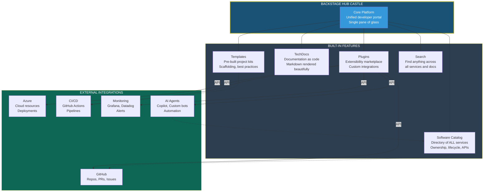

## Change Log

| Version | Date | Author | Changes |
|---------|------|--------|---------|
| 1.0.0 | 2026-03-18 | Paula Silva | Versao inicial — Edicao Super Mario Bros |

# Fase 7-6 — A Praca Central: IDP e Backstage
## O Hub que Conecta Tudo no Mushroom Kingdom

---

**Preparado para:** Sofia
**Versao:** 2.0 — Edicao Mushroom Kingdom
**Autora:** Paula Silva | Microsoft Latam Software GBB
**Data:** Marco 2026
**Idioma:** Portugues do Brasil (pt-BR)
**Colecao:** Agentic DevOps — Edicao Super Mario Bros

---

## SUMARIO

1. [Introducao — O Castelo Central](#introducao)
2. [O que e um IDP (Internal Developer Platform)](#o-que-e-idp)
3. [Por que IDPs Importam — A Dor Sem Eles](#por-que-importam)
4. [Backstage by Spotify — O IDP Mais Popular](#backstage)
5. [Os 5 Pilares do Backstage](#5-pilares)
6. [Como Agentes de IA se Encaixam no IDP](#agentes-no-idp)
7. [Golden Paths — A Rota Otima pelo Reino](#golden-paths)
8. [Tabela: Desenvolvimento Tradicional vs IDP](#tabela-comparativa)
9. [Construindo seu IDP — Primeiros Passos](#primeiros-passos)
10. [Conclusao — O Castelo que Une Todos os Mundos](#conclusao)

---

## Introducao — O Castelo Central

Sofia vinha jogando ha muito tempo. Ela conhecia World 1 (Features), World 2 (Bugfix), World 3 (Deploy), World 4 (Code Review). Conhecia os personagens, os power-ups, os warp pipes. Mas tinha um problema crescente:

> *"Eu sei que existe um servico de autenticacao... mas onde esta o repositorio? Quem mantem? Qual e a API? Onde esta a documentacao? Qual pipeline de deploy usa? Qual banco de dados conecta?"*

Para responder essas perguntas, Sofia precisava:
1. Abrir o GitHub e procurar repositorios
2. Abrir o Slack e perguntar para alguem
3. Abrir a wiki e buscar documentacao (que pode estar desatualizada)
4. Abrir o Azure e procurar resources
5. Abrir o Jira e ver quem e responsavel

**5 ferramentas diferentes para responder 1 pergunta.** E Sofia precisava fazer isso varias vezes por dia.

Agora imagine se existisse um **unico lugar** — um castelo central — onde Sofia pudesse encontrar TUDO:

```
┌──────────────────────────────────────────────────────────┐
│              CASTELO CENTRAL (IDP)                         │
│                                                           │
│  ┌────┐ ┌────┐ ┌────┐ ┌────┐ ┌────┐ ┌────┐             │
│  │ 🚪 │ │ 🚪 │ │ 🚪 │ │ 🚪 │ │ 🚪 │ │ 🚪 │             │
│  │    │ │    │ │    │ │    │ │    │ │    │             │
│  │Cat-│ │Tem-│ │Doc-│ │Sta-│ │API-│ │On- │             │
│  │alo-│ │pla-│ │umen│ │tus │ │ s  │ │boar│             │
│  │go  │ │tes │ │tos │ │    │ │    │ │ding│             │
│  └────┘ └────┘ └────┘ └────┘ └────┘ └────┘             │
│                                                           │
│  Sofia entra no castelo e tem PORTAS para todos os mundos │
│  Nao precisa correr pelo reino inteiro procurando         │
└──────────────────────────────────────────────────────────┘
```

Bem-vinda ao conceito de **IDP — Internal Developer Platform**.

---

### Diagrama: Arquitetura IDP/Backstage



## 1. O que e um IDP (Internal Developer Platform)

### Definicao

Um **Internal Developer Platform (IDP)** e uma plataforma **self-service** que da aos desenvolvedores tudo que precisam em **um unico lugar**:

- Catalogo de todos os servicos e seus donos
- Templates para criar novos projetos
- Documentacao centralizada
- Status de pipelines e deploys
- APIs disponiveis e como usa-las
- Ferramentas e integraces

### Analogia Mario: O Hub Castle do Super Mario 64

Lembra do **Super Mario 64**? O jogo comecava num **castelo central** — o Castelo da Princesa Peach. Dentro do castelo, havia **portas** que levavam a diferentes mundos:

- Porta 1 → Bob-omb Battlefield (World 1)
- Porta 2 → Whomp's Fortress (World 2)
- Porta 3 → Jolly Roger Bay (World 3)
- Porta secreta → Acesso ao porrao (mundos ocultos)

Voce nao precisava percorrer o reino inteiro para chegar a cada mundo. Voce ia ate o **castelo central**, encontrava a porta certa, e entrava. Simples, rapido, organizado.

**Um IDP e o Hub Castle do seu ecossistema de desenvolvimento.** Um castelo central com portas para todos os mundos:

| Porta do Castelo | O que Tem Atras | Equivalente IDP |
|---|---|---|
| Porta do Catalogo | Mapa de todos os mundos e seus guardioes | Software Catalog — lista de todos os servicos |
| Porta dos Templates | Kits de construcao de fases | Software Templates — criar novos projetos |
| Porta da Biblioteca | Manuais e guias do reino | TechDocs — documentacao centralizada |
| Porta do Mercado | Barracas de comerciantes | Plugins — marketplace de funcionalidades |
| Porta da Busca | Bola de cristal que encontra qualquer coisa | Search — busca universal |

### Sem IDP vs Com IDP

**Sem IDP — Mario perdido no Mushroom Kingdom:**

```
Mario precisa encontrar o World 5.
1. Corre para o norte... nao e aqui.
2. Pergunta a um Toad... "Nao sei, pergunta pro outro Toad."
3. Corre para o sul... encontra um cano, mas vai pro lugar errado.
4. Volta, pergunta a outro Toad... "Acho que e naquela direcao."
5. Finalmente encontra... mas perdeu 2 horas.
```

**Com IDP — Mario no Hub Castle:**

```
Mario entra no castelo central.
1. Olha o mapa na parede: "World 5 = porta do segundo andar."
2. Sobe a escada.
3. Entra pela porta.
4. Chegou. 30 segundos.
```

A diferenca e **brutal**. E e exatamente o que acontece quando uma equipe de desenvolvimento tem (ou nao tem) um IDP.

---

## 2. Por que IDPs Importam — A Dor Sem Eles

### O Problema: Carga Cognitiva

**Carga cognitiva** e a quantidade de informacao que voce precisa manter na cabeca para fazer seu trabalho. Sem um IDP, a carga cognitiva de um desenvolvedor e enorme:

| Tarefa | Sem IDP | Com IDP |
|---|---|---|
| "Onde esta o servico X?" | Procurar no GitHub, Slack, wiki, perguntar | Abrir catalogo, buscar, encontrar |
| "Quem mantem o servico Y?" | Perguntar no Slack, esperar resposta | Ver no catalogo — dono listado |
| "Como crio um novo microservico?" | Copiar um existente, adaptar, torcer para nao esquecer nada | Escolher template, preencher formulario, pronto |
| "Qual e o status do deploy?" | Abrir GitHub Actions, encontrar o repo, achar o workflow | Ver no dashboard — status em tempo real |
| "Onde esta a documentacao da API?" | Wiki? README? Swagger? Confluence? Notion? | TechDocs — tudo num lugar so |
| "Estou entrando no time — por onde comeco?" | Perguntar para 5 pessoas, coletar links | Pagina de onboarding no portal |

**Analogia Mario:** Sem IDP e como jogar Mario sem o mapa. Voce nao sabe quantos mundos existem, nao sabe o que cada um contem, nao sabe qual ja completou. Com IDP, voce tem o mapa completo — claro, organizado, sempre atualizado.

### Os Beneficios de um IDP

**1. Developer Experience (DevEx)**

Desenvolvedores felizes sao desenvolvedores produtivos. Um IDP reduz friccao:
- Menos tempo procurando coisas → mais tempo criando coisas
- Menos perguntas repetitivas no Slack → mais autonomia
- Menos "como faz isso?" → mais "ja fiz, proximo!"

**2. Self-Service**

Desenvolvedores nao precisam pedir permissao ou esperar por outro time:
- Quer criar um novo servico? Use o template.
- Quer saber o status do deploy? Veja no dashboard.
- Quer encontrar a documentacao? Busque no portal.

**3. Golden Paths (Caminhos Dourados)**

O IDP define **caminhos recomendados** — a forma "certa" de fazer as coisas:
- *"Para criar um microservico, use ESTE template"*
- *"Para fazer deploy, siga ESTE pipeline"*
- *"Para conectar ao banco, use ESTA biblioteca"*

Voce pode sair do caminho dourado se quiser (liberdade), mas o caminho recomendado esta sempre visivel e acessivel (orientacao).

**4. Padronizacao**

Quando todo mundo usa os mesmos templates e segue os mesmos caminhos:
- Servicos parecem similares → facil de manter
- Onboarding e rapido → novo membro entende logo
- Seguranca e consistente → mesmos padroes em todo lugar

**5. Visibilidade**

Lideranca tecnica tem visao completa:
- Quantos servicos existem?
- Quais estao atualizados?
- Quais tem vulnerabilidades?
- Quais times tem mais servicos?

---

## 3. Backstage by Spotify — O IDP Mais Popular

### A Historia

Em 2020, o **Spotify** abriu o codigo do seu IDP interno: o **Backstage**. Eles tinham mais de 2000 microservicos e precisavam de uma forma de organizar tudo. A solucao foi construir um portal centralizado onde qualquer desenvolvedor pudesse encontrar qualquer servico, criar novos projetos, e acessar documentacao — tudo num unico lugar.

O Backstage se tornou o **framework de IDP mais popular do mundo**, mantido pela Cloud Native Computing Foundation (CNCF) e usado por centenas de empresas como Spotify, Netflix, American Airlines, HP, e muitas outras.

### Analogia Mario: O Castelo Mais Famoso do Mushroom Kingdom

Se o conceito de IDP e um Hub Castle, o Backstage e o **castelo mais famoso e mais usado** de todo o Mushroom Kingdom. Construido originalmente pelo Spotify (um dos reinos mais avancados), o Backstage foi aberto para que **qualquer reino** pudesse construir seu proprio castelo central usando a mesma planta arquitetonica.

```
┌──────────────────────────────────────────────────────────┐
│                    BACKSTAGE                               │
│          O Castelo Central Open-Source                      │
│                                                           │
│  ┌──────────────────────────────────────────────────┐    │
│  │                HALL PRINCIPAL                      │    │
│  │                                                   │    │
│  │  ┌────────┐  ┌────────┐  ┌────────┐             │    │
│  │  │SOFTWARE│  │SOFTWARE│  │  TECH  │             │    │
│  │  │CATALOG │  │TEMPLAT.│  │  DOCS  │             │    │
│  │  │        │  │        │  │        │             │    │
│  │  │ Mapa   │  │ Kits   │  │Manuais │             │    │
│  │  │ dos    │  │ de     │  │ do     │             │    │
│  │  │ Mundos │  │Construc│  │ Reino  │             │    │
│  │  └────────┘  └────────┘  └────────┘             │    │
│  │                                                   │    │
│  │  ┌────────┐  ┌────────┐                          │    │
│  │  │PLUGINS │  │ SEARCH │                          │    │
│  │  │        │  │        │                          │    │
│  │  │Mercado │  │ Bola   │                          │    │
│  │  │ de     │  │ de     │                          │    │
│  │  │Barracas│  │Cristal │                          │    │
│  │  └────────┘  └────────┘                          │    │
│  │                                                   │    │
│  └──────────────────────────────────────────────────┘    │
│                                                           │
│  Construido pelo Spotify. Open-source. CNCF.              │
│  Usado por centenas de empresas no mundo.                  │
└──────────────────────────────────────────────────────────┘
```

---

## 4. Os 5 Pilares do Backstage

O Backstage e construido sobre **5 pilares fundamentais**. Cada pilar resolve um problema especifico e tem sua propria analogia no Mushroom Kingdom.

### Pilar 1: Software Catalog — O Mapa de Todos os Mundos

**O que e:** Um diretorio centralizado de **todos** os componentes de software da organizacao: servicos, APIs, bibliotecas, websites, pipelines, bancos de dados. Cada componente tem metadados: nome, descricao, dono, repositorio, status, dependencias.

**Analogia Mario:** A **Sala do Mapa** no castelo. Uma sala enorme com um mapa gigante na parede mostrando:
- Todos os mundos que existem (servicos)
- Quem e o guardiao de cada mundo (time responsavel)
- Quais mundos se conectam (dependencias)
- Quais mundos estao em bom estado e quais precisam de reparos (health status)

```
┌──────────────────────────────────────────────────────────┐
│                 SOFTWARE CATALOG                           │
│              (Sala do Mapa do Castelo)                     │
│                                                           │
│  ┌──────────────────────────────────────────────────┐    │
│  │  SERVICO           DONO         STATUS  TIPO     │    │
│  │  ─────────────────────────────────────────────── │    │
│  │  auth-service      Time Alpha   OK      Backend  │    │
│  │  user-api          Time Alpha   OK      API      │    │
│  │  payment-service   Time Beta    WARN    Backend  │    │
│  │  frontend-app      Time Gamma   OK      Website  │    │
│  │  notification-svc  Time Beta    OK      Backend  │    │
│  │  shared-lib        Time Alpha   OK      Library  │    │
│  │  deploy-pipeline   Time DevOps  OK      Pipeline │    │
│  │  postgres-main     Time DBA     OK      Database │    │
│  └──────────────────────────────────────────────────┘    │
│                                                           │
│  Cada servico tem: repo, docs, API, pipeline, owner       │
│  Clicar em qualquer um abre TUDO sobre ele                │
└──────────────────────────────────────────────────────────┘
```

**Como funciona na pratica:**

Cada repositorio tem um arquivo `catalog-info.yaml` na raiz:

```yaml
# catalog-info.yaml
# A "placa" na entrada do mundo que diz quem mora aqui

apiVersion: backstage.io/v1alpha1
kind: Component
metadata:
  name: auth-service
  description: Servico de autenticacao OAuth2
  annotations:
    github.com/project-slug: minha-org/auth-service
spec:
  type: service
  lifecycle: production
  owner: team-alpha
  system: authentication
  dependsOn:
    - component:postgres-main
    - component:shared-lib
  providesApis:
    - auth-api
```

Esse arquivo diz ao Backstage: *"Este repositorio contem o servico auth-service, que e mantido pelo team-alpha, esta em producao, depende do postgres-main e shared-lib, e fornece a auth-api."*

O Backstage le esses arquivos de todos os repositorios e monta o catalogo completo automaticamente.

**Por que e poderoso:**
- *"Quem mantem o servico de pagamentos?"* → Time Beta
- *"Quais servicos dependem do PostgreSQL?"* → auth-service, payment-service, user-api
- *"Quais servicos estao em warning?"* → payment-service (precisa de atencao)

### Pilar 2: Software Templates — Kits de Construcao de Fases

**O que e:** Templates pre-construidos para criar novos projetos. Em vez de copiar um repositorio existente e adaptar (processo fragil e propenso a erros), voce escolhe um template, preenche algumas informacoes, e o Backstage cria tudo automaticamente: repositorio, pipeline CI/CD, banco de dados, monitoramento, documentacao inicial.

**Analogia Mario:** **Kits de construcao de fases** no Mario Maker. Em vez de construir cada bloco do zero, voce escolhe:

| Template | O que Cria | Analogia Mario |
|---|---|---|
| **Microservico Node.js** | Repo + CI/CD + Docker + Monitoring | Kit "Fase Terrestre" — terreno, plataformas, inimigos basicos |
| **API REST com Express** | Repo + Swagger + Testes + Deploy | Kit "Fase Subaquatica" — agua, peixes, correntes |
| **Frontend React** | Repo + Vite + Testes + Storybook | Kit "Fase Aerea" — nuvens, plataformas flutuantes |
| **Biblioteca Compartilhada** | Repo + NPM publish + Testes + Docs | Kit "Fase de Castelo" — paredes, lava, Bowser Jr |
| **Funcao Serverless** | Repo + Azure Function + Trigger + Monitoring | Kit "Fase Secreta" — curta, intensa, recompensa especial |

**Como funciona na pratica:**

Sofia quer criar um novo microservico. Em vez de:
1. Criar repositorio manualmente
2. Copiar boilerplate de outro projeto
3. Configurar CI/CD do zero
4. Criar Dockerfile
5. Configurar monitoramento
6. Escrever documentacao inicial
7. (Provavelmente esquecer algo)

Ela simplesmente:
1. Abre o Backstage
2. Clica em "Create"
3. Escolhe o template "Microservico Node.js"
4. Preenche: nome, descricao, time
5. Clica em "Create"
6. **PRONTO.** Tudo criado automaticamente.

```
┌──────────────────────────────────────────────────────────┐
│                SOFTWARE TEMPLATES                          │
│              (Kits de Construcao)                          │
│                                                           │
│  PASSO 1: Escolha o template                              │
│  ┌──────────┐  ┌──────────┐  ┌──────────┐               │
│  │Node.js   │  │React App │  │Serverless│               │
│  │Microserv.│  │Frontend  │  │Function  │               │
│  │          │  │          │  │          │               │
│  │  [OK]    │  │  [ ]     │  │  [ ]     │               │
│  └──────────┘  └──────────┘  └──────────┘               │
│                                                           │
│  PASSO 2: Preencha as informacoes                         │
│  Nome: [meu-novo-servico        ]                         │
│  Descricao: [Servico de notificacoes]                     │
│  Time: [Time Alpha ▼]                                     │
│  Banco: [PostgreSQL ▼]                                    │
│                                                           │
│  PASSO 3:  [>>> CRIAR <<<]                                │
│                                                           │
│  Resultado: Repo criado, CI/CD configurado, docs prontas  │
│  Tempo: 30 segundos (em vez de 2 horas)                   │
└──────────────────────────────────────────────────────────┘
```

### Pilar 3: TechDocs — Os Manuais do Reino

**O que e:** Documentacao que vive **junto ao codigo** (docs-as-code) e e renderizada automaticamente no Backstage. Voce escreve documentacao em Markdown no seu repositorio, e o Backstage gera um site bonito e navegavel automaticamente.

**Analogia Mario:** **Manuais de instrucoes pregados nas paredes do castelo.** Em vez de procurar manuais em gavetas diferentes (Wiki, Confluence, Notion, Google Docs, README...), todos os manuais estao nas paredes do castelo — cada um na sala correspondente ao seu servico.

**Vantagens do docs-as-code:**
- Documentacao atualizada junto com o codigo (mesmo PR)
- Versionada (historico completo de mudancas)
- Revisada (code review inclui a documentacao)
- Proxima (nao precisa sair do fluxo para atualizar docs)

```
Repositorio do auth-service:
├── src/
│   └── auth.service.ts
├── tests/
│   └── auth.test.ts
├── docs/                    ← Documentacao vive AQUI
│   ├── index.md             ← Pagina principal
│   ├── architecture.md      ← Arquitetura do servico
│   ├── api-reference.md     ← Referencia da API
│   └── troubleshooting.md   ← Problemas comuns
├── mkdocs.yml               ← Configuracao do TechDocs
└── catalog-info.yaml
```

Quando Sofia acessa o auth-service no Backstage, a documentacao aparece como uma aba — linda, formatada, sempre atualizada.

### Pilar 4: Plugins — O Mercado de Barracas

**O que e:** O Backstage tem um **ecossistema de plugins** que adiciona funcionalidades ao portal. Cada plugin e como uma barraca nova na Praca Central — traz uma capacidade que antes nao existia.

**Analogia Mario:** O **mercado na Praca Central** com barracas de comerciantes. Cada barraca vende algo diferente, e voce monta a praca de acordo com as necessidades do seu reino:

| Plugin | O que Adiciona | Barraca Mario |
|---|---|---|
| **Kubernetes** | Status dos pods, logs, metricas | Barraca do Mestre das Nuvens — mostra tudo que roda no ceu |
| **GitHub Actions** | Status de pipelines, logs de CI/CD | Barraca do Lakitu — verificacoes de cima |
| **PagerDuty** | Alertas e incidentes | Barraca do Alarme — quando algo da errado, toca o sino |
| **Grafana** | Dashboards de monitoramento | Barraca do Observatorio — graficos e metricas |
| **SonarQube** | Qualidade de codigo | Barraca do Inspetor — nota de qualidade do seu castelo |
| **Azure DevOps** | Pipelines e boards | Barraca do Planejador — tarefas e deploys |
| **Cost Insights** | Custos de infraestrutura | Barraca do Tesoureiro — quanto cada mundo custa |
| **API Docs** | Documentacao de APIs (Swagger) | Barraca do Cartografo — mapas de todas as rotas |

**O ecosistema tem centenas de plugins.** E voce pode criar os seus proprios.

### Pilar 5: Search — A Bola de Cristal

**O que e:** Busca unificada que procura em **tudo** — catalogo, documentacao, APIs, templates, plugins. Uma barra de busca que encontra qualquer coisa no reino inteiro.

**Analogia Mario:** Uma **bola de cristal** no centro do castelo. Voce faz qualquer pergunta e ela mostra a resposta:

- *"Onde esta o servico de pagamentos?"* → Catalogo: payment-service, Time Beta
- *"Como configurar OAuth?"* → TechDocs: guia de autenticacao do auth-service
- *"Template para funcao serverless?"* → Templates: Azure Function Template
- *"Quem mantem o PostgreSQL?"* → Catalogo: Time DBA

```
┌──────────────────────────────────────────────────────────┐
│                      SEARCH                                │
│                 (Bola de Cristal)                          │
│                                                           │
│  ┌──────────────────────────────────────────────────┐    │
│  │  Buscar: [oauth autenticacao                   ] │    │
│  └──────────────────────────────────────────────────┘    │
│                                                           │
│  Resultados:                                              │
│                                                           │
│  CATALOGO                                                 │
│  ► auth-service — Servico de autenticacao OAuth2          │
│    Time Alpha | Backend | Producao                         │
│                                                           │
│  TECHDOCS                                                 │
│  ► Guia de Autenticacao OAuth2                            │
│    Como configurar OAuth no nosso ecossistema              │
│                                                           │
│  API                                                      │
│  ► auth-api — POST /auth/login, POST /auth/refresh        │
│    Swagger disponivel                                      │
│                                                           │
│  TEMPLATE                                                 │
│  ► Microservico com Auth — Template com OAuth pre-config   │
│                                                           │
└──────────────────────────────────────────────────────────┘
```

---

## 5. Como Agentes de IA se Encaixam no IDP

Aqui e onde as coisas ficam **realmente poderosas**. O IDP sozinho ja e incrivel. Mas quando voce adiciona **agentes de IA** ao IDP, o castelo ganha vida propria.

### Agente 1: Assistente de IA no Portal (Canal 2)

Um chatbot integrado ao Backstage que responde perguntas em linguagem natural:

> **Sofia:** "Quais servicos do Time Alpha usam PostgreSQL e estao em producao?"
>
> **Agente:** "O Time Alpha tem 3 servicos em producao com PostgreSQL:
> 1. auth-service — autenticacao
> 2. user-api — gestao de usuarios
> 3. notification-service — notificacoes
> Todos usam PostgreSQL 15 via pool compartilhado."

Sem o agente, Sofia teria que navegar pelo catalogo, filtrar por time, filtrar por banco, filtrar por status. Com o agente, **uma pergunta, uma resposta**.

### Agente 2: Criador de Servicos Inteligente

Um agente que ajuda a criar novos servicos, indo alem de um simples template:

> **Sofia:** "Preciso criar um servico de envio de emails transacionais."
>
> **Agente:** "Baseado nos padroes da organizacao, recomendo:
> - Template: Microservico Node.js com fila
> - Banco: Nao necessario (servico stateless)
> - Fila: Azure Service Bus (padrao do time)
> - Monitoramento: Padrao com Application Insights
> - Estimativa: 10 minutos para criar a estrutura
> Quer que eu crie agora?"

### Agente 3: Buscador de Donos e Especialistas

> **Sofia:** "O servico de pagamentos esta retornando erro 500 em producao. Quem eu chamo?"
>
> **Agente:** "O payment-service e mantido pelo Time Beta.
> - On-call atual: Carlos Silva (carlos@empresa.com)
> - Ultimo deploy: ontem as 15h (PR #234 por Ana Lima)
> - Status do pipeline: verde
> - Logs recentes: mostram timeout na conexao com o gateway
> Posso abrir um incidente no PagerDuty para o Time Beta?"

### Agente 4: Assistente de Onboarding

> **Novo Membro:** "Sou novo no time. Por onde comeco?"
>
> **Agente:** "Bem-vindo ao Time Alpha! Aqui esta seu roteiro de onboarding:
>
> Semana 1:
> - [ ] Configurar ambiente local (guia: link)
> - [ ] Clonar os 3 repos principais (auth, user-api, frontend)
> - [ ] Rodar o docker-compose e verificar que tudo sobe
> - [ ] Ler a arquitetura geral (TechDocs: link)
>
> Semana 2:
> - [ ] Pegar uma issue "good first issue" do auth-service
> - [ ] Seguir o workflow padrao (branch, PR, review)
> - [ ] Fazer pair programming com a mentora (Maria Santos)
>
> Quer que eu envie esse roteiro por email?"

### Agente 5: Monitor de Saude do Catalogo

Um agente que roda em background (Canal 4) verificando a saude do catalogo:

> **Relatorio Semanal do Agente:**
>
> "Analise do Software Catalog — Semana 12/2026:
> - 47 servicos catalogados (3 novos esta semana)
> - 2 servicos sem documentacao atualizada (payment-service, legacy-api)
> - 1 servico sem dono definido (old-notification-svc)
> - 5 servicos com dependencias desatualizadas
> - Recomendacao: Atribuir dono ao old-notification-svc ou deprecar"

```
┌──────────────────────────────────────────────────────────┐
│           AGENTES DE IA NO BACKSTAGE                       │
│                                                           │
│  ┌──────────┐  ┌──────────┐  ┌──────────┐               │
│  │ASSISTENTE│  │ CRIADOR  │  │ BUSCADOR │               │
│  │ DE CHAT  │  │    DE    │  │ DE DONOS │               │
│  │          │  │ SERVICOS │  │          │               │
│  │"Onde fica│  │"Crie novo│  │"Quem     │               │
│  │ o X?"   │  │ servico" │  │ mantem?" │               │
│  └──────────┘  └──────────┘  └──────────┘               │
│                                                           │
│  ┌──────────┐  ┌──────────┐                              │
│  │ONBOARDING│  │ MONITOR  │                              │
│  │          │  │ DE SAUDE │                              │
│  │"Sou novo │  │          │                              │
│  │ aqui"    │  │"Relatorio│                              │
│  │          │  │ semanal" │                              │
│  └──────────┘  └──────────┘                              │
│                                                           │
│  NPCs inteligentes trabalhando DENTRO do castelo          │
└──────────────────────────────────────────────────────────┘
```

---

## 6. Golden Paths — A Rota Otima pelo Reino

### O que sao Golden Paths

**Golden Paths** (Caminhos Dourados) sao os **caminhos recomendados** para realizar tarefas comuns. Nao sao obrigatorios — voce pode sair do caminho dourado se quiser. Mas o caminho dourado e o que foi testado, validado, documentado, e que funciona para a maioria dos casos.

### Analogia Mario: O Speedrun Path

Em toda fase do Mario, existe um **caminho otimo** — o caminho que os speedrunners usam. Nao e o unico caminho. Voce pode explorar, pegar rotas alternativas, encontrar segredos. Mas se voce quer **chegar ao fim de forma rapida, segura e eficiente**, o speedrun path e o melhor:

```
┌──────────────────────────────────────────────────────────┐
│                  GOLDEN PATH                               │
│            (Speedrun Path do Mario)                        │
│                                                           │
│  INICIO ──► Template ──► Repo ──► CI/CD ──► Deploy ──► FIM
│    │         padrao     config.   config.   config.     │
│    │                    auto.     auto.     auto.       │
│    │                                                     │
│    │  Alternativa: fazer tudo manual                      │
│    └──► Criar repo ──► Config CI ──► Config CD ──►       │
│         manual         manual        manual              │
│         (1 hora)       (2 horas)     (3 horas)           │
│                                                           │
│  GOLDEN PATH: 30 minutos                                  │
│  CAMINHO MANUAL: 6+ horas                                 │
└──────────────────────────────────────────────────────────┘
```

### Exemplos de Golden Paths

| Tarefa | Golden Path | Alternativa (sem IDP) |
|---|---|---|
| Criar microservico | Template Backstage → 5 cliques | Copiar repo, adaptar, configurar CI/CD, criar docs... |
| Fazer deploy | Merge na main → auto-deploy | SSH no servidor, build manual, copiar arquivos... |
| Adicionar monitoramento | Plugin Grafana no Backstage | Instalar agente, configurar dashboard, criar alertas... |
| Onboarding | Roteiro automatico no portal | Perguntar pra 5 pessoas, coletar links, descobrir sozinho... |
| Documentar API | TechDocs + Swagger auto | Escrever na wiki, torcer para alguem manter atualizado... |

### Golden Paths nao sao Prisoes

Um ponto crucial: **Golden Paths sao sugestoes, nao obrigacoes.** O desenvolvedor sempre tem liberdade para sair do caminho se precisar. A ideia e:

1. **80% dos casos** seguem o Golden Path — rapido, padronizado, seguro
2. **20% dos casos** precisam de caminho customizado — e tudo bem
3. O Golden Path e **visivel e acessivel** — ninguem precisa procurar

**Analogia Mario:** O speedrun path esta marcado no mapa, mas voce nao e obrigado a segui-lo. Quer explorar? Quer pegar Star Coins escondidas? Quer testar uma rota alternativa? Vai fundo. Mas quando quiser o caminho seguro e rapido, ele esta la.

---

## 7. Tabela: Desenvolvimento Tradicional vs IDP

| Aspecto | Desenvolvimento Tradicional | Com IDP (Backstage) |
|---|---|---|
| **Encontrar servico** | Procurar no GitHub, perguntar no Slack | Buscar no catalogo, 5 segundos |
| **Saber o dono** | Perguntar para alguem, esperar resposta | Listado no catalogo, visivel imediatamente |
| **Criar projeto novo** | Copiar repo, adaptar, 2-6 horas | Template, 5 cliques, 5 minutos |
| **Documentacao** | Wiki separada, frequentemente desatualizada | TechDocs junto ao codigo, sempre atualizada |
| **Status do deploy** | Abrir CI/CD, encontrar pipeline, verificar | Dashboard no portal, visao instantanea |
| **Onboarding** | "Pergunta pro fulano", 1-2 semanas | Roteiro automatico, 2-3 dias |
| **Padronizacao** | Cada time faz do seu jeito | Golden Paths padronizados |
| **Visibilidade** | Ninguem sabe quantos servicos existem | Catalogo completo e atualizado |
| **Dependencias** | "Acho que esse servico depende daquele..." | Grafo de dependencias visual |
| **APIs disponiveis** | "Onde ta o Swagger?" | API docs no portal |
| **Incidentes** | "Quem eu chamo?" | On-call e escalacao no catalogo |
| **Custo** | "Quanto custa rodar tudo?" | Cost insights por servico |
| **Analogia Mario** | Correr pelo reino sem mapa | Hub Castle com portas para tudo |

---

## 8. Construindo seu IDP — Primeiros Passos

Se voce quer comecar a construir um IDP com Backstage, aqui esta o caminho recomendado (Golden Path do IDP!):

### Passo 1: Instalar o Backstage

```bash
# Pre-requisitos: Node.js 18+, yarn, git
# Analogia: Construir as fundacoes do castelo

npx @backstage/create-app@latest
# Responda as perguntas: nome do app, etc.

cd meu-backstage-app
yarn dev
# Abra http://localhost:3000 — seu castelo esta de pe!
```

### Passo 2: Catalogar seus Servicos

Adicione `catalog-info.yaml` em cada repositorio:

```yaml
# catalog-info.yaml — A placa na entrada do mundo
apiVersion: backstage.io/v1alpha1
kind: Component
metadata:
  name: meu-servico
  description: Descricao do que faz
spec:
  type: service
  lifecycle: production
  owner: meu-time
```

### Passo 3: Criar seu Primeiro Template

```yaml
# template.yaml — Kit de construcao de fases
apiVersion: scaffolder.backstage.io/v1beta3
kind: Template
metadata:
  name: node-microservice
  title: Microservico Node.js
  description: Template padrao para criar microservicos
spec:
  owner: team-platform
  type: service
  parameters:
    - title: Informacoes Basicas
      properties:
        name:
          title: Nome do Servico
          type: string
        description:
          title: Descricao
          type: string
        owner:
          title: Time Responsavel
          type: string
  steps:
    - id: create-repo
      name: Criar Repositorio
      action: publish:github
      input:
        repoUrl: github.com?owner=minha-org&repo=${{ parameters.name }}
```

### Passo 4: Adicionar TechDocs

```yaml
# mkdocs.yml — Configuracao dos manuais do castelo
site_name: Auth Service
nav:
  - Home: index.md
  - Arquitetura: architecture.md
  - API Reference: api-reference.md
  - Troubleshooting: troubleshooting.md
plugins:
  - techdocs-core
```

### Passo 5: Instalar Plugins

Escolha os plugins que fazem sentido para seu ecossistema:
- Kubernetes plugin (se usa K8s)
- GitHub Actions plugin (se usa GH Actions)
- PagerDuty plugin (se usa PagerDuty)
- Grafana plugin (se usa Grafana)

### Roteiro de Maturidade

| Fase | O que Fazer | Resultado | Tempo |
|---|---|---|---|
| **1. Fundacao** | Instalar Backstage, catalogar 5 servicos | Portal basico funcionando | 1 semana |
| **2. Catalogo** | Catalogar todos os servicos, definir owners | Visao completa do ecossistema | 2-4 semanas |
| **3. Templates** | Criar 2-3 templates para projetos comuns | Novos projetos em minutos | 2-3 semanas |
| **4. Docs** | Migrar documentacao para TechDocs | Docs junto ao codigo | 4-6 semanas |
| **5. Plugins** | Adicionar plugins de monitoramento e CI/CD | Portal completo | 4-8 semanas |
| **6. IA** | Integrar assistente de IA ao portal | Portal inteligente | 2-4 semanas |
| **7. Golden Paths** | Definir e documentar caminhos recomendados | Padronizacao completa | Continuo |

---

## Conclusao — O Castelo que Une Todos os Mundos

Sofia agora entende que um IDP nao e apenas mais uma ferramenta. E o **centro de gravidade** de todo o ecossistema de desenvolvimento. E o castelo central do Super Mario 64 — o hub que conecta todos os mundos, que organiza todos os recursos, que da visibilidade a todos os jogadores.

**Backstage** e a planta arquitetonica mais popular para construir esse castelo. Com seus 5 pilares — Catalogo, Templates, TechDocs, Plugins e Search — ele fornece tudo que uma equipe precisa para transformar o caos de microservicos em um ecossistema organizado e self-service.

E quando voce adiciona **agentes de IA** ao castelo, ele ganha vida. NPCs inteligentes que respondem perguntas, criam servicos, encontram responsaveis, ajudam no onboarding, e monitoram a saude de todo o reino.

Lembre-se:

| Conceito | Analogia | Resultado |
|---|---|---|
| **IDP** | Hub Castle do Mario 64 | Tudo num unico lugar |
| **Software Catalog** | Sala do Mapa | Saber o que existe e quem mantem |
| **Templates** | Kits de construcao | Criar rapido e padronizado |
| **TechDocs** | Manuais nas paredes | Documentacao viva e atualizada |
| **Plugins** | Barracas do mercado | Funcionalidades extensiveis |
| **Search** | Bola de cristal | Encontrar qualquer coisa |
| **Golden Paths** | Speedrun path | Caminho seguro e eficiente |
| **Agentes no IDP** | NPCs inteligentes no castelo | Castelo que responde e age |

O Mushroom Kingdom esta mais organizado do que nunca. E Sofia agora sabe como construir o castelo central.

---

| Anterior: Fase 7-5 — Os 4 Canais | Proximo: Fase 7-BOSS — Construindo seu Primeiro Agente |
|---|---|

---

**Habilidade Desbloqueada!**
Sofia agora entende IDPs, Backstage e Golden Paths.
Ela sabe construir o castelo central que conecta todos os mundos!

**POWER-UP DESBLOQUEADO: Voce agora sabe o que e um IDP, como funciona o Backstage, e como agentes de IA transformam o portal do desenvolvedor!**

**Fontes:**
- Backstage by Spotify — https://backstage.io
- Backstage Documentation — https://backstage.io/docs
- CNCF Backstage — https://www.cncf.io/projects/backstage/
- Internal Developer Platforms — https://internaldeveloperplatform.org/

---

## References

- Backstage by Spotify — https://backstage.io
- Backstage Documentation — https://backstage.io/docs/overview/what-is-backstage
- Internal Developer Platform — https://internaldeveloperplatform.org
