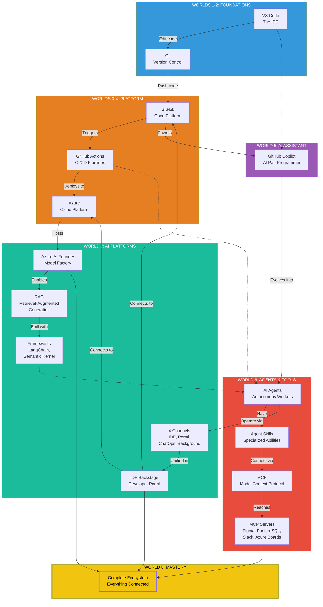
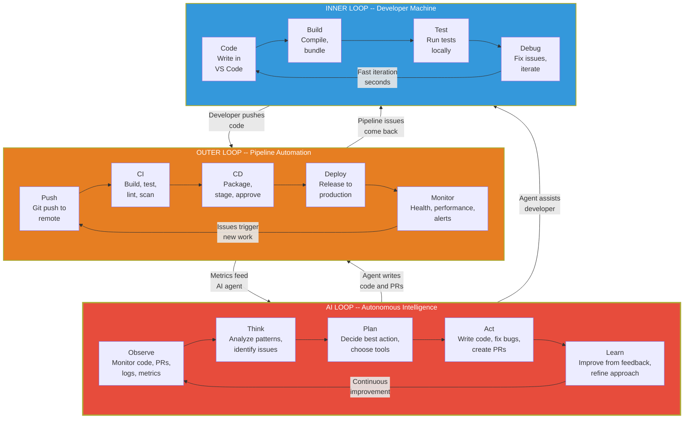

# Fase 8-1 -- O Mapa Completo: Como Tudo Se Conecta

---

## Change Log

| Versao | Data       | Autor        | Descricao                          |
|--------|------------|--------------|------------------------------------|
| 1.0.0  | 2026-03-18 | Paula Silva  | Criacao inicial com analogias Mario |

---

## Sumario

- [Prologo: O Mapa que Revela Todos os Segredos](#prologo-o-mapa-que-revela-todos-os-segredos)
- [1. O Mapa Completo do Mushroom Kingdom](#1-o-mapa-completo-do-mushroom-kingdom)
  - [1.1 Visao Geral: Os 8 Worlds](#11-visao-geral-os-8-worlds)
  - [1.2 O Mapa em ASCII Art](#12-o-mapa-em-ascii-art)
  - [1.3 Legenda do Mapa](#13-legenda-do-mapa)
- [2. As Conexoes Entre os Mundos](#2-as-conexoes-entre-os-mundos)
  - [2.1 O Fluxo Principal: Do START ao FINAL](#21-o-fluxo-principal-do-start-ao-final)
  - [2.2 Os Warp Pipes Secretos: Conexoes Nao Obvias](#22-os-warp-pipes-secretos-conexoes-nao-obvias)
  - [2.3 Diagrama de Dependencias](#23-diagrama-de-dependencias)
  - [2.4 Tabela: Cada Ferramenta e Suas Conexoes](#24-tabela-cada-ferramenta-e-suas-conexoes)
- [3. O Fluxo Completo do Desenvolvedor](#3-o-fluxo-completo-do-desenvolvedor)
  - [3.1 De "Apertei START" a "Comando um Exercito de Agentes"](#31-de-apertei-start-a-comando-um-exercito-de-agentes)
  - [3.2 Os 12 Passos da Jornada](#32-os-12-passos-da-jornada)
  - [3.3 O Pipeline Completo em ASCII Art](#33-o-pipeline-completo-em-ascii-art)
- [4. O Dia da Sofia: Um Cenario Real Completo](#4-o-dia-da-sofia-um-cenario-real-completo)
  - [4.1 7:30 -- Chegando no Escritorio (World 1)](#41-730--chegando-no-escritorio-world-1)
  - [4.2 8:00 -- Planejando a Sprint (World 2)](#42-800--planejando-a-sprint-world-2)
  - [4.3 9:00 -- Desenvolvendo com Copilot (World 5 e 6)](#43-900--desenvolvendo-com-copilot-world-5-e-6)
  - [4.4 11:00 -- Testes e Qualidade (World 3)](#44-1100--testes-e-qualidade-world-3)
  - [4.5 13:00 -- Code Review e Seguranca (World 4 e 5)](#45-1300--code-review-e-seguranca-world-4-e-5)
  - [4.6 14:30 -- Deploy e Monitoramento (World 4)](#46-1430--deploy-e-monitoramento-world-4)
  - [4.7 15:30 -- Construindo um Agente RAG (World 7)](#47-1530--construindo-um-agente-rag-world-7)
  - [4.8 17:00 -- Revisao no Portal Interno (World 7)](#48-1700--revisao-no-portal-interno-world-7)
  - [4.9 17:30 -- Fim do Dia: Retrospectiva (World 8)](#49-1730--fim-do-dia-retrospectiva-world-8)
  - [4.10 Tabela Resumo: O Dia Completo](#410-tabela-resumo-o-dia-completo)
- [5. As 5 Camadas do Ecossistema](#5-as-5-camadas-do-ecossistema)
  - [5.1 Camada 1: Fundacao (Worlds 1-2)](#51-camada-1-fundacao-worlds-1-2)
  - [5.2 Camada 2: Ferramentas (World 3)](#52-camada-2-ferramentas-world-3)
  - [5.3 Camada 3: Praticas (World 4)](#53-camada-3-praticas-world-4)
  - [5.4 Camada 4: Inteligencia (Worlds 5-6)](#54-camada-4-inteligencia-worlds-5-6)
  - [5.5 Camada 5: Ecossistema (World 7)](#55-camada-5-ecossistema-world-7)
  - [5.6 Diagrama de Camadas](#56-diagrama-de-camadas)
- [6. Os Warp Zones Revelados: Todas as Passagens Secretas](#6-os-warp-zones-revelados-todas-as-passagens-secretas)
  - [6.1 Warp Zone 1: Do Codigo a Nuvem](#61-warp-zone-1-do-codigo-a-nuvem)
  - [6.2 Warp Zone 2: Do Humano ao Agente](#62-warp-zone-2-do-humano-ao-agente)
  - [6.3 Warp Zone 3: Dos Dados a Decisao](#63-warp-zone-3-dos-dados-a-decisao)
  - [6.4 Mapa de Warp Zones Completo](#64-mapa-de-warp-zones-completo)
- [7. Padroes de Integracao: Receitas do Mushroom Kingdom](#7-padroes-de-integracao-receitas-do-mushroom-kingdom)
  - [7.1 Padrao "Inner Loop" (Desenvolvimento Local)](#71-padrao-inner-loop-desenvolvimento-local)
  - [7.2 Padrao "Outer Loop" (CI/CD e Deploy)](#72-padrao-outer-loop-cicd-e-deploy)
  - [7.3 Padrao "AI Loop" (Agentes e Automacao)](#73-padrao-ai-loop-agentes-e-automacao)
  - [7.4 Os 3 Loops Conectados](#74-os-3-loops-conectados)
- [8. Tabela Final: O Inventario Completo do Heroi](#8-tabela-final-o-inventario-completo-do-heroi)
- [Referencias](#referencias)

---

## Prologo: O Mapa que Revela Todos os Segredos

Sofia parou. Respirou fundo. Olhou para tras.

Atras dela, uma trilha que se estendia por 7 mundos inteiros. A Planicie Verde onde aprendeu a dar os primeiros passos. As Cavernas Subterraneas onde descobriu o que existia por baixo de tudo. O Mundo Aereo onde voou alto entre ferramentas e linguagens. O Mundo Aquatico onde mergulhou na arquitetura avancada. Os dois Castelos de Bowser onde dominou IA, Agentes e o ecossistema Copilot. O Star World onde forjou armas magicas com frameworks de IA.

Agora, diante dela, erguia-se o **Castelo Final** -- World 8. A porta era enorme, feita de todos os materiais que ela havia encontrado: tijolos verdes da Planicie, cristais das Cavernas, plataformas do Mundo Aereo, corais do Mundo Aquatico, lava do Castelo de Bowser, e estrelas do Star World.

Na parede ao lado da porta, um mapa brilhava. Nao era um mapa de uma unica fase -- era o **Mapa Completo do Mushroom Kingdom**. Cada World, cada fase, cada conexao, cada Warp Pipe, cada passagem secreta. Tudo visivel. Tudo revelado.

*"Voce percorreu cada caminho individualmente,"* disse a voz familiar. *"Agora, pela primeira vez, voce vai ver como TODOS os caminhos se conectam. Este e o mapa que poucos jogadores chegam a ver -- porque poucos completam todos os mundos."*

Sofia sorriu. Era hora de ver a foto completa.

---

## 1. O Mapa Completo do Mushroom Kingdom

### 1.1 Visao Geral: Os 8 Worlds

Antes de ver o mapa detalhado, vamos relembrar o que cada World representa:

| World | Nome | Tema | O que Voce Aprendeu |
|-------|------|------|---------------------|
| 1 | Planicie Verde | Fundamentos | VS Code, Git, GitHub, Actions, Azure |
| 2 | Cavernas Subterraneas | Infraestrutura | Ambientes, APIs, Seguranca, DNS, DevOps, Observabilidade |
| 3 | Mundo Aereo | Ferramentas | Terminal, Docker, Testes, Bancos de Dados, Linguagens, Frameworks |
| 4 | Mundo Aquatico | Arquitetura | Auth, Cloud Models, Microservices, Deploy, Git Workflows, Cache |
| 5 | Castelo Bowser Pt1 | IA e Agentes | Copilot, Agentes, Tipos de Agente, Autonomia, MCP, Security |
| 6 | Castelo Bowser Pt2 | Copilot Ecosystem | Custom Agents, Skills, Instructions, Prompts, Hooks, MCP, Orquestracao, Tokens |
| 7 | Star World | Frameworks IA | AI Foundry, RAG, LangChain, Agentic Frameworks, Canais, IDP |
| 8 | Castelo Final | Visao Completa | Como tudo se conecta, revisao, proximos passos, glossario |

### 1.2 O Mapa em ASCII Art

```
================================================================================================
                    MAPA COMPLETO DO MUSHROOM KINGDOM
                    Agentic DevOps -- Todos os Mundos
================================================================================================

                                  [WORLD 8]
                              CASTELO FINAL
                           +------------------+
                           | 8-1 Mapa Completo|
                           | 8-2 Boss Rush    |
                           | 8-3 Proximos     |
                           | 8-F Glossario    |
                           +--------+---------+
                                    |
                     +--------------+--------------+
                     |                             |
              [WORLD 7]                     [WORLD 6]
            STAR WORLD                   CASTELO BOWSER 2
         +--------------+             +------------------+
         | AI Foundry   |             | Custom Agents    |
         | RAG          |<---MCP----->| Skills           |
         | LangChain    |             | Instructions     |
         | Agentic Fw   |             | Prompts          |
         | 4 Canais     |             | Hooks            |
         | IDP/Backstage|<---IDP----->| MCP              |
         +---------+----+             | Orquestracao     |
                   |                  | Token Optim.     |
                   |                  +--------+---------+
                   |                           |
                   +-------------+-------------+
                                 |
                          [WORLD 5]
                       CASTELO BOWSER 1
                    +-------------------+
                    | Evolucao DevOps   |
                    | Maturidade IA     |
                    | GitHub Copilot    |
                    | O Que E Agente    |
                    | Tipos de Agente   |
                    | Agentes Autonomos |
                    | MCP Detalhado     |
                    | 3 Horizontes      |
                    | GHAS Security     |
                    +---------+---------+
                              |
              +---------------+---------------+
              |                               |
       [WORLD 3]                       [WORLD 4]
     MUNDO AEREO                    MUNDO AQUATICO
  +----------------+             +------------------+
  | Terminal       |             | Auth/JWT/OAuth   |
  | Docker         |<--Deploy-->| Cloud Models     |
  | Testes         |             | Microservices    |
  | Open Source    |             | Deploy Avancado  |
  | Bancos Dados   |<---SQL---->| Git Workflows    |
  | Boas Praticas  |             | Cache/Perf       |
  | Internet       |             | Mensageria       |
  | Linguagens     |             | JSON/Dados       |
  | Frameworks     |             |                  |
  | Pacotes        |             |                  |
  +--------+-------+             +--------+---------+
           |                              |
           +----------+---+---+-----------+
                       |   |   |
                    [WORLD 2]
                 CAVERNAS SUBTERRANEAS
              +---------------------+
              | Ambientes           |
              | APIs                |
              | Seguranca           |
              | DNS/Dominios        |
              | Metodologias        |
              | DevOps/IaC          |
              | Observabilidade     |
              +----------+----------+
                         |
                    [WORLD 1]
                  PLANICIE VERDE
              +---------------------+
              | VS Code             |
              | Git                 |
              | GitHub              |
              | GitHub Actions      |
              | Azure               |
              | Azure AI            |
              | Fluxo Completo      |
              +----------+----------+
                         |
                      [START]
                    "Press START"
                  Sofia comeca aqui

================================================================================================
```

### 1.3 Legenda do Mapa

```
LEGENDA:
  |       = Caminho direto (pre-requisito)
  <--->   = Conexao bidirecional (se complementam)
  --XXX-- = Warp Pipe nomeado (atalho tematico)
  [    ]  = World (agrupamento principal)
  +----+  = Castelo/Area (conteudo do World)
```

---

### Diagrama: O Mapa Completo do Ecossistema



### Diagrama: Jornada do Desenvolvedor


### Diagrama: Os Tres Loops



## 2. As Conexoes Entre os Mundos

### 2.1 O Fluxo Principal: Do START ao FINAL

A jornada principal segue uma progressao logica:

```
START --> VS Code --> Git --> GitHub --> Actions --> Azure
  |         |          |        |          |          |
  |    (W1: Controle) (W1: Save) (W1: MP) (W1: Auto) (W1: Nuvem)
  |
  +--> Ambientes --> APIs --> Seguranca --> DNS --> DevOps
  |       |           |          |           |        |
  |  (W2: Infra)  (W2: Comm) (W2: Prot) (W2: Map) (W2: Ops)
  |
  +--> Terminal --> Docker --> Testes --> DB --> Linguagens
  |       |           |          |         |        |
  |  (W3: CMD)   (W3: Pack) (W3: QA)  (W3: Data) (W3: Code)
  |
  +--> Auth --> Cloud --> Microservices --> Deploy --> Cache
  |       |       |            |              |         |
  |  (W4: ID) (W4: IaaS) (W4: Arch)    (W4: Ship) (W4: Speed)
  |
  +--> Copilot --> Agentes --> Tipos --> Autonomia --> GHAS
  |       |           |          |           |           |
  |  (W5: AI)   (W5: NPCs) (W5: Class) (W5: Auto) (W5: Shield)
  |
  +--> Agents --> Skills --> Instructions --> MCP --> Orquestracao
  |       |          |            |            |          |
  |  (W6: Create) (W6: Power) (W6: Rules) (W6: Warp) (W6: Multi)
  |
  +--> AI Foundry --> RAG --> LangChain --> Frameworks --> IDP
  |       |            |          |              |           |
  |  (W7: Forge)  (W7: Lib) (W7: Chain) (W7: Tools)  (W7: Hub)
  |
  +--> MAPA COMPLETO --> BOSS RUSH --> PROXIMOS PASSOS --> GLOSSARIO
          |                  |               |                 |
     (W8: Vision)      (W8: Review)    (W8: Future)     (W8: Reference)
          |
        FINAL
   "Thank you Mario!"
```

### 2.2 Os Warp Pipes Secretos: Conexoes Nao Obvias

Alem do caminho principal, existem conexoes que atravessam mundos -- como os Warp Pipes secretos do Mario:

```
WARP PIPES SECRETOS (Conexoes Cross-World):

W1 (Git) --------Warp-------> W4 (Git Workflows)
   "Save system basico leva a estrategias avancadas de branching"

W1 (Actions) ----Warp-------> W3 (Docker + Testes)
   "CI/CD depende de containers e testes automatizados"

W2 (APIs) ------Warp-------> W4 (Auth/JWT)
   "APIs precisam de autenticacao -- uma nao vive sem a outra"

W2 (Seguranca) --Warp-------> W5 (GHAS)
   "Seguranca basica evolui para seguranca AI-powered"

W3 (Docker) -----Warp-------> W4 (Deploy)
   "Containers sao a base do deploy moderno"

W5 (Copilot) ----Warp-------> W6 (Ecossistema inteiro)
   "Entender Copilot e pre-requisito para customiza-lo"

W5 (MCP) --------Warp-------> W7 (IDP/Backstage)
   "MCP e o protocolo; IDP e o hub que usa esse protocolo"

W6 (Agents) -----Warp-------> W7 (Agentic Frameworks)
   "Custom Agents manuais levam a frameworks de automacao"

W6 (Tokens) -----Warp-------> W7 (AI Foundry)
   "Otimizar tokens requer entender como modelos funcionam"

W7 (RAG) --------Warp-------> W6 (MCP)
   "RAG busca dados; MCP conecta fontes de dados"
```

### 2.3 Diagrama de Dependencias

```
                    DIAGRAMA DE DEPENDENCIAS
         (O que voce PRECISA saber antes de cada World)

World 1: Nenhum pre-requisito (START aqui!)
    |
World 2: Precisa de World 1 (VS Code, Git, GitHub)
    |
World 3: Precisa de World 1-2 (Fundamentos + Infra)
    |
World 4: Precisa de World 1-3 (tudo anterior)
    |
World 5: Precisa de World 1-4 (base completa)
    |
World 6: Precisa de World 5 (entender Copilot/Agentes)
    |
World 7: Precisa de World 5-6 (IA + Copilot ecosystem)
    |
World 8: Precisa de World 1-7 (TUDO -- e a revisao final)
```

### 2.4 Tabela: Cada Ferramenta e Suas Conexoes

| Ferramenta | World | Se Conecta Com | Tipo de Conexao |
|------------|-------|----------------|-----------------|
| VS Code | W1 | Copilot (W5), Extensions (W3), Git (W1) | Ambiente central |
| Git | W1 | GitHub (W1), Git Workflows (W4), Hooks (W6) | Versionamento |
| GitHub | W1 | Actions (W1), Copilot (W5), Issues/PRs (W2) | Plataforma central |
| GitHub Actions | W1 | Docker (W3), Testes (W3), Deploy (W4), Azure (W1) | Automacao CI/CD |
| Azure | W1 | AI Foundry (W7), Deploy (W4), DNS (W2) | Nuvem |
| APIs | W2 | Auth (W4), Mensageria (W4), MCP (W6) | Comunicacao |
| Docker | W3 | Deploy (W4), Actions (W1), Microservices (W4) | Empacotamento |
| Testes | W3 | CI/CD (W1), QA Agent (W6), TDD (W4) | Qualidade |
| Auth/JWT | W4 | APIs (W2), Seguranca (W2), GHAS (W5) | Identidade |
| Deploy | W4 | Docker (W3), Actions (W1), Azure (W1) | Entrega |
| GitHub Copilot | W5 | VS Code (W1), Agents (W6), AI Foundry (W7) | Assistente IA |
| Custom Agents | W6 | Copilot (W5), Skills (W6), Orquestracao (W6) | Personagens IA |
| MCP | W6 | APIs (W2), IDP (W7), Warp Zones (W5) | Protocolo de conexao |
| AI Foundry | W7 | Copilot (W5), RAG (W7), Azure (W1) | Plataforma IA |
| RAG | W7 | MCP (W6), AI Foundry (W7), Bancos Dados (W3) | Conhecimento |
| IDP/Backstage | W7 | MCP (W6), APIs (W2), Observabilidade (W2) | Hub central |

---

## 3. O Fluxo Completo do Desenvolvedor

### 3.1 De "Apertei START" a "Comando um Exercito de Agentes"

A jornada do desenvolvedor moderno segue uma evolucao que espelha os 8 Worlds:

```
EVOLUCAO DO DESENVOLVEDOR:

Level 1: "Sei abrir o VS Code"
         (Sabe usar o controle)

Level 2: "Sei fazer commit e push"
         (Sabe salvar e jogar online)

Level 3: "Sei criar PR e usar Actions"
         (Sabe jogar multiplayer com automacao)

Level 4: "Sei usar Docker, testes e CI/CD"
         (Domina ferramentas avancadas)

Level 5: "Sei projetar sistemas e deployar"
         (Arquiteta mundos complexos)

Level 6: "Sei usar Copilot efetivamente"
         (Tem um companion de IA)

Level 7: "Sei criar e orquestrar agentes"
         (Comanda um exercito de NPCs inteligentes)

Level 8: "Sei construir com AI Foundry e RAG"
         (Forja suas proprias armas magicas)

Level FINAL: "Sei como TUDO se conecta"
             (Ve o mapa completo -- este capitulo)
```

### 3.2 Os 12 Passos da Jornada

O fluxo completo de um desenvolvedor Agentic DevOps, do inicio ao fim:

| Passo | Acao | Ferramenta | World |
|-------|------|-----------|-------|
| 1 | Abre o editor | VS Code | W1 |
| 2 | Clona o repositorio | Git | W1 |
| 3 | Cria uma branch | Git + GitHub | W1 |
| 4 | Pede ajuda ao Copilot | GitHub Copilot | W5 |
| 5 | Delega para agentes especializados | Custom Agents | W6 |
| 6 | Agentes usam skills e instructions | Skills + Instructions | W6 |
| 7 | Conecta ferramentas externas via MCP | MCP | W6 |
| 8 | Roda testes e linting automaticamente | Hooks + Actions | W6 + W1 |
| 9 | Cria PR com revisao de agente | Agent Mode + GHAS | W5 + W6 |
| 10 | Deploy automatizado | Actions + Azure | W1 + W4 |
| 11 | Agente RAG monitora e responde | AI Foundry + RAG | W7 |
| 12 | IDP centraliza tudo num portal | IDP/Backstage | W7 |

### 3.3 O Pipeline Completo em ASCII Art

```
O PIPELINE COMPLETO DO AGENTIC DEVOPS:

  DESENVOLVEDOR (Sofia)
        |
        v
  +============+     +============+     +============+
  |  VS CODE   |---->|    GIT     |---->|   GITHUB   |
  | (Controle) |     | (Save)    |     | (Servidor) |
  | + Copilot  |     | + Hooks   |     | + Issues   |
  | + Agents   |     | (W6)      |     | + PRs      |
  | (W1+W5+W6) |     |  (W1)     |     |  (W1)      |
  +============+     +============+     +=====+======+
                                              |
                     +------------------------+
                     |
                     v
  +============+     +============+     +============+
  |  ACTIONS   |---->|  DOCKER    |---->|   TESTES   |
  | (Lakitu)   |     | (Caixas)  |     | (Treino)   |
  | CI/CD auto |     | Container |     | Jest/Lint  |
  |  (W1)      |     |  (W3)     |     |  (W3)      |
  +============+     +============+     +=====+======+
                                              |
                     +------------------------+
                     |
                     v
  +============+     +============+     +============+
  |   DEPLOY   |---->|   AZURE    |---->|   GHAS     |
  | Blue/Green |     | (Nuvem)   |     | (Escudo)   |
  | Canary     |     | App Svc   |     | Scanning   |
  |  (W4)      |     |  (W1)     |     |  (W5)      |
  +============+     +============+     +=====+======+
                                              |
                     +------------------------+
                     |
                     v
  +============+     +============+     +============+
  | AI FOUNDRY |---->|    RAG     |---->|    IDP     |
  | (Forja)    |     | (Biblio)  |     | (Praca)    |
  | Modelos IA |     | Consulta  |     | Portal Hub |
  |  (W7)      |     |  (W7)     |     |  (W7)      |
  +============+     +============+     +============+
        |                                     |
        v                                     v
  +============+                    +==================+
  | MCP/AGENTS |                    | OBSERVABILIDADE  |
  | Orquestr.  |                    | Logs, Metrics    |
  |  (W6)      |                    |  (W2)            |
  +============+                    +==================+
```

---

## 4. O Dia da Sofia: Um Cenario Real Completo

Este e o cenario mais importante do capitulo: um dia inteiro na vida de Sofia, usando TODAS as ferramentas dos 8 Worlds. Cada hora do dia mapeia para um ou mais Worlds.

### 4.1 7:30 -- Chegando no Escritorio (World 1)

Sofia abre o notebook e lanca o **VS Code** (World 1 -- o console do jogo). O terminal integrado mostra que seu repositorio esta atualizado. Ela roda `git pull` para sincronizar com a branch `main`.

```bash
# World 1: Git + VS Code
cd ~/projects/todo-app
git checkout main
git pull origin main
git checkout -b feature/product-catalog
```

O **GitHub** (World 1 -- servidor multiplayer) mostra 3 issues assignadas para ela no Sprint atual. Ela abre o **GitHub Projects** board para visualizar o backlog.

**Ferramentas usadas**: VS Code, Git, GitHub, GitHub Projects

### 4.2 8:00 -- Planejando a Sprint (World 2)

Antes de codar, Sofia verifica os **ambientes** (World 2). O ambiente de staging esta rodando a versao 2.3.1. Producao esta na 2.3.0. Ela olha o **dashboard de observabilidade** (World 2 -- Grafana) e ve que a API de produtos esta respondendo em 200ms (saudavel).

Ela consulta a **documentacao da API** (World 2 -- APIs) para entender o contrato do endpoint que vai implementar.

```
GET /api/products      -> Lista produtos (existente)
POST /api/products     -> Criar produto (NOVA -- issue #42)
PUT /api/products/:id  -> Atualizar produto (NOVA -- issue #43)
```

**Ferramentas usadas**: Ambientes, APIs, Observabilidade, Metodologias (Scrum board)

### 4.3 9:00 -- Desenvolvendo com Copilot (World 5 e 6)

Agora comeca o desenvolvimento. Sofia abre o **Copilot Chat** (World 5) e seleciona o agente **Luigi** (React Frontend Engineer -- World 6):

```
Sofia (via Copilot Agent Mode):
  "@luigi Preciso criar o formulario de cadastro de produtos
   com campos name, price, category e image_url. Siga o
   padrao do formulario de TodoForm que ja existe.
   Use o ProductService que vou criar no backend."
```

O agente Luigi (World 6 -- Custom Agent) ativa automaticamente a skill **workflow-feature** (World 6 -- Skill), que segue o fluxo: Plan -> Implement -> Review -> Verify.

Enquanto Luigi trabalha no frontend, Sofia muda para o backend e usa **completions inline** (World 5 -- modo mais barato de tokens, aprendido no World 6 fase 6-8):

```typescript
// Copilot completa baseado no padrao existente
// Sofia economiza tokens usando completions ao inves do chat
class ProductService {
  async create(data: CreateProductInput): Promise<Product> {
    // Copilot sugere: validacao + persistencia + retorno
    // Tab para aceitar -- ~300 tokens (vs 2000 no chat)
  }
}
```

Ela tambem usa **MCP** (World 6) para conectar o Copilot ao banco de dados de staging e validar que o schema esta correto:

```
Sofia: "@workspace Verifique via MCP/PostgreSQL se a tabela
        products existe no banco de staging e quais colunas tem."
Copilot (via MCP): "Tabela products encontrada com colunas:
                    id, name, price, category, image_url, created_at"
```

**Ferramentas usadas**: GitHub Copilot, Custom Agents, Skills, Instructions, MCP, Token Optimization

### 4.4 11:00 -- Testes e Qualidade (World 3)

Com o codigo pronto, Sofia roda os **testes** (World 3). O agente **Peach** (QA Engineer -- World 6) ja criou testes unitarios usando a skill **jest-testing**:

```bash
# World 3: Testes
npm test -- --coverage
# 42 testes passando, coverage 87%

# World 3: Docker
docker-compose up -d
# Sobe PostgreSQL + Redis + App localmente

# World 3: Linting
npm run lint
# 0 errors, 0 warnings
```

Os **Hooks** (World 6 -- Blocos "?") disparam automaticamente:
- **pre-commit**: ESLint + Prettier formatam o codigo
- **commit-msg**: Verifica que a mensagem segue Conventional Commits

```bash
git add .
git commit -m "feat(products): add CRUD endpoints and form"
# [Hook: pre-commit] Running ESLint... PASS
# [Hook: commit-msg] Validating format... PASS
# Commit criado com sucesso
```

**Ferramentas usadas**: Testes (Jest), Docker, Linting (ESLint), Hooks (Husky)

### 4.5 13:00 -- Code Review e Seguranca (World 4 e 5)

Sofia cria um **Pull Request** no GitHub (World 1). Automaticamente:

1. **GitHub Actions** (World 1) dispara o pipeline CI:
   - Build com Docker (World 3)
   - Testes automatizados (World 3)
   - Linting e type-checking (World 3)

2. **GHAS** (World 5 -- Escudo Estelar) escaneia o codigo:
   - Code Scanning: 0 vulnerabilidades
   - Secret Scanning: 0 segredos expostos
   - Dependabot: 1 dependencia desatualizada (nao-critica)

3. O agente **Toadette** (Code Reviewer -- World 6) faz review automatico e deixa comentarios:

```
Toadette (Code Reviewer Agent):
  "src/services/product.ts:42 -- Considere adicionar
   rate limiting ao endpoint POST para prevenir abuso.
   Veja o padrao em src/middleware/rateLimiter.ts"

  "src/components/ProductForm.tsx:18 -- O campo price
   aceita valores negativos. Adicione validacao min: 0"
```

Sofia faz os ajustes, o colega **Pedro** aprova o PR, e o merge acontece.

**Ferramentas usadas**: Pull Requests, GitHub Actions, GHAS (Code Scanning, Secret Scanning, Dependabot), Custom Agent (Code Reviewer), Auth/JWT (API protegida)

### 4.6 14:30 -- Deploy e Monitoramento (World 4)

O merge na `main` dispara o **deploy automatizado** (World 4):

```
PIPELINE DE DEPLOY:
  main merge
    |
    v
  [Build Docker Image]     -- World 3
    |
    v
  [Push to ACR]            -- World 1 (Azure)
    |
    v
  [Deploy to Staging]      -- World 4 (Blue-Green)
    |
    v
  [Smoke Tests]            -- World 3
    |
    v
  [Deploy to Production]   -- World 4 (Canary 10%)
    |
    v
  [Monitor Metrics]        -- World 2 (Observabilidade)
    |
    v
  [Full Rollout 100%]      -- World 4
```

O deploy usa **estrategia Canary** (World 4 -- Deploy Avancado): primeiro 10% do trafego vai para a nova versao. Metricas sao monitoradas por 15 minutos. Se tudo estiver saudavel, 100% do trafego e redirecionado.

**Ferramentas usadas**: Deploy (Canary), Docker, Azure, Observabilidade, GitHub Actions

### 4.7 15:30 -- Construindo um Agente RAG (World 7)

Com a feature em producao, Sofia dedica o fim da tarde a um projeto especial: um **chatbot interno** que responde perguntas sobre a documentacao do produto.

Ela usa o **Azure AI Foundry** (World 7 -- Forja de Magikoopa) para:

1. Selecionar o modelo **GPT-4o** como base
2. Configurar **RAG** (World 7 -- Biblioteca Magica) com a documentacao do produto
3. Usar **LangChain** (World 7 -- Cadeia de Power-Ups) para orquestrar o fluxo:

```
Pergunta do usuario
    |
    v
[Embedding]  --> Converte pergunta em vetor
    |
    v
[Azure AI Search]  --> Busca documentos relevantes
    |
    v
[GPT-4o + Context]  --> Gera resposta com base nos docs
    |
    v
Resposta fundamentada
```

O **Semantic Kernel** (World 7 -- Motor Universal) conecta tudo usando plugins.

**Ferramentas usadas**: AI Foundry, RAG, LangChain, Semantic Kernel, Azure AI Search

### 4.8 17:00 -- Revisao no Portal Interno (World 7)

Sofia acessa o **IDP** (World 7 -- Praca Central/Backstage) para registrar o novo servico no catalogo interno:

```
+--------------------------------------------------+
|  BACKSTAGE -- Developer Portal                   |
|                                                  |
|  Servicos Registrados:                           |
|  [x] todo-api          v2.3.1  (saudavel)       |
|  [x] product-api       v1.0.0  (novo!)          |
|  [x] product-chatbot   v0.1.0  (beta)           |
|                                                  |
|  Pipelines:                                      |
|  [v] product-api CI    -- PASSED                 |
|  [v] product-api CD    -- DEPLOYED               |
|                                                  |
|  Docs: Auto-geradas via OpenAPI                  |
|  Runbooks: Linkados                              |
|  Owner: Sofia                                    |
+--------------------------------------------------+
```

O IDP conecta todas as informacoes em um unico lugar -- como a Praca Central do Mario 64 de onde voce acessa todos os quadros (mundos).

**Ferramentas usadas**: IDP/Backstage, Observabilidade, Documentacao

### 4.9 17:30 -- Fim do Dia: Retrospectiva (World 8)

Sofia olha para tras e percebe que, em um unico dia, usou ferramentas de **TODOS os 8 Worlds**:

```
RETROSPECTIVA DO DIA:

07:30  VS Code + Git + GitHub          = World 1
08:00  Ambientes + APIs + Observ.      = World 2
09:00  Copilot + Agents + MCP + Tokens = World 5 + 6
11:00  Testes + Docker + Hooks         = World 3 + 6
13:00  PR + Actions + GHAS + Review    = World 1 + 4 + 5 + 6
14:30  Deploy Canary + Monitor         = World 4 + 2
15:30  AI Foundry + RAG + LangChain    = World 7
17:00  IDP/Backstage                   = World 7
17:30  Visao completa                  = World 8 (este momento)
```

Nenhuma ferramenta funciona sozinha. Todas dependem umas das outras. O VS Code e inutil sem Git. Git e inutil sem GitHub. GitHub e inutil sem Actions. E nenhum agente de IA funciona sem infraestrutura, seguranca, testes e deploy por tras.

**A licao final**: Agentic DevOps nao e sobre UMA ferramenta. E sobre como TODAS as ferramentas formam um ecossistema integrado.

### 4.10 Tabela Resumo: O Dia Completo

| Hora | Atividade | Worlds Usados | Ferramentas |
|------|-----------|---------------|-------------|
| 07:30 | Setup e sync | W1 | VS Code, Git, GitHub |
| 08:00 | Planejamento | W2 | Ambientes, APIs, Observabilidade |
| 09:00 | Desenvolvimento | W5, W6 | Copilot, Agents, Skills, MCP |
| 11:00 | Testes e qualidade | W3, W6 | Jest, Docker, ESLint, Hooks |
| 13:00 | Review e seguranca | W1, W4, W5, W6 | PR, Actions, GHAS, Agent Review |
| 14:30 | Deploy | W1, W2, W3, W4 | Canary, Docker, Azure, Observ. |
| 15:30 | Projeto IA | W7 | AI Foundry, RAG, LangChain |
| 17:00 | Portal interno | W7 | IDP/Backstage |
| 17:30 | Retrospectiva | W8 | Visao completa |

---

## 5. As 5 Camadas do Ecossistema

### 5.1 Camada 1: Fundacao (Worlds 1-2)

A base sobre a qual tudo se constroi. Sem esses fundamentos, nada mais funciona:

- **VS Code**: O editor onde voce vive
- **Git**: O sistema de saves
- **GitHub**: A plataforma multiplayer
- **Azure**: A nuvem onde tudo roda
- **Ambientes**: Dev, staging, producao
- **APIs**: Como sistemas conversam
- **Seguranca**: Protecao basica

### 5.2 Camada 2: Ferramentas (World 3)

As ferramentas que voce usa no dia a dia para construir software:

- **Terminal**: Poder puro via linha de comando
- **Docker**: Empacotamento universal
- **Testes**: Qualidade garantida
- **Bancos de Dados**: Persistencia
- **Linguagens e Frameworks**: Suas armas

### 5.3 Camada 3: Praticas (World 4)

Padroes e estrategias avancadas:

- **Autenticacao**: Identidade e seguranca
- **Arquitetura**: Microservices, monolitos
- **Deploy avancado**: Blue-green, canary
- **Cache e performance**: Velocidade

### 5.4 Camada 4: Inteligencia (Worlds 5-6)

A camada de IA que potencializa tudo:

- **GitHub Copilot**: Assistente pessoal
- **Custom Agents**: Personagens especializados
- **Skills e Instructions**: Poderes e regras
- **MCP**: Conexao com ferramentas externas
- **Orquestracao**: Multiplos agentes coordenados
- **Token Optimization**: Eficiencia de custo

### 5.5 Camada 5: Ecossistema (World 7)

O nivel mais avancado -- construir com IA:

- **AI Foundry**: Plataforma de modelos
- **RAG**: Conhecimento contextual
- **Frameworks Agenticos**: AutoGen, Semantic Kernel
- **IDP/Backstage**: Hub central de tudo

### 5.6 Diagrama de Camadas

```
+============================================================+
|  CAMADA 5: ECOSSISTEMA (World 7)                           |
|  AI Foundry | RAG | LangChain | Frameworks | IDP          |
+============================================================+
|  CAMADA 4: INTELIGENCIA (Worlds 5-6)                       |
|  Copilot | Agents | Skills | MCP | Orquestracao | Tokens   |
+============================================================+
|  CAMADA 3: PRATICAS (World 4)                              |
|  Auth | Microservices | Deploy | Cache | Git Workflows     |
+============================================================+
|  CAMADA 2: FERRAMENTAS (World 3)                           |
|  Terminal | Docker | Testes | DBs | Linguagens | Frameworks|
+============================================================+
|  CAMADA 1: FUNDACAO (Worlds 1-2)                           |
|  VS Code | Git | GitHub | Actions | Azure | APIs | Seg.   |
+============================================================+

  ^  Cada camada DEPENDE das camadas abaixo.
  |  Voce nao pode pular camadas (como no Mario,
  |  nao pula do World 1 pro World 7).
```

---

## 6. Os Warp Zones Revelados: Todas as Passagens Secretas

### 6.1 Warp Zone 1: Do Codigo a Nuvem

```
CODIGO LOCAL -----> REPOSITORIO -----> CI/CD -----> NUVEM
  (VS Code)         (GitHub)         (Actions)     (Azure)

  "Voce escreve"    "Voce salva"    "Robo verifica" "Mundo ve"
```

Esta e a passagem mais fundamental: como o codigo sai do seu computador e chega ate os usuarios.

### 6.2 Warp Zone 2: Do Humano ao Agente

```
HUMANO -----> COPILOT -----> AGENT -----> AGENT AUTONOMO
(digita)     (sugere)      (executa)    (decide sozinho)

"Voce pede"  "IA ajuda"   "IA faz"     "IA decide e faz"
```

A progressao da automacao: de voce fazendo tudo ate agentes autonomos operando com guardrails.

### 6.3 Warp Zone 3: Dos Dados a Decisao

```
DADOS BRUTOS -----> EMBEDDING -----> BUSCA -----> LLM -----> RESPOSTA
 (documentos)       (vetores)        (RAG)       (razao)    (decisao)

"Informacao"   "Representacao"  "Encontrar"  "Pensar"    "Agir"
```

O fluxo de RAG: como transformar dados brutos em respostas inteligentes.

### 6.4 Mapa de Warp Zones Completo

```
+------------------------------------------------------------------+
|                  MAPA DE WARP ZONES                              |
|                                                                  |
|  [Codigo] --pipe1--> [Repo] --pipe2--> [CI/CD] --pipe3--> [Cloud]|
|     |                   |                  |                  |   |
|     |--pipe4--> [Copilot] --pipe5--> [Agents]                |   |
|                    |                    |                     |   |
|                    |--pipe6--> [MCP] --pipe7--> [Ferramentas] |   |
|                                 |                            |   |
|                                 |--pipe8--> [RAG] --pipe9--> |   |
|                                              |               |   |
|                                    [AI Foundry] --pipe10-->  |   |
|                                              |               |   |
|                                         [IDP/Hub] <-----------   |
|                                                                  |
+------------------------------------------------------------------+

LEGENDA:
  pipe1  = git push
  pipe2  = webhook trigger
  pipe3  = deploy pipeline
  pipe4  = inline completion / chat
  pipe5  = agent delegation
  pipe6  = tool connection
  pipe7  = external API call
  pipe8  = document indexing
  pipe9  = context injection
  pipe10 = model serving
```

---

## 7. Padroes de Integracao: Receitas do Mushroom Kingdom

### 7.1 Padrao "Inner Loop" (Desenvolvimento Local)

O loop que acontece no computador do desenvolvedor, dezenas de vezes por dia:

```
INNER LOOP (Local):
  Escrever codigo
      |
      v
  Copilot sugere (completion/chat)
      |
      v
  Testar localmente
      |
      v
  Commit (hooks disparam)
      |
      v
  Push para branch
      |
      +----> Volta para "Escrever codigo"

  Tempo medio: 15-60 minutos por ciclo
  Ferramentas: VS Code, Git, Copilot, Docker, Jest, Hooks
  Worlds: 1, 3, 5, 6
```

### 7.2 Padrao "Outer Loop" (CI/CD e Deploy)

O loop que acontece no servidor, apos o push:

```
OUTER LOOP (Servidor):
  Push/PR criado
      |
      v
  CI: Build + Test + Lint + Scan
      |
      v
  Code Review (humano + agente)
      |
      v
  Merge para main
      |
      v
  CD: Deploy para staging
      |
      v
  Smoke tests
      |
      v
  Deploy para producao (canary)
      |
      v
  Monitoramento
      |
      +----> Volta para "Push/PR criado" (proximo feature)

  Tempo medio: 30 min - 2 horas
  Ferramentas: GitHub Actions, Docker, GHAS, Azure, Observabilidade
  Worlds: 1, 2, 3, 4, 5
```

### 7.3 Padrao "AI Loop" (Agentes e Automacao)

O loop de inteligencia artificial que permeia os outros dois:

```
AI LOOP (Transversal):
  Contexto coletado (workspace, arquivos, historico)
      |
      v
  Agente analisa e planeja
      |
      v
  Agente executa (cria/edita codigo, roda comandos)
      |
      v
  Verificacao automatica (testes, lint)
      |
      v
  Humano aprova ou ajusta
      |
      +----> Volta para "Contexto coletado"

  Tempo medio: Continuo
  Ferramentas: Copilot, Agents, Skills, MCP, AI Foundry
  Worlds: 5, 6, 7
```

### 7.4 Os 3 Loops Conectados

```
+------------------------------------------------------------------+
|                    OS 3 LOOPS CONECTADOS                          |
|                                                                  |
|  +-------- INNER LOOP (Local) --------+                          |
|  |  Code -> Copilot -> Test -> Commit |                          |
|  +------------------+-----------------+                          |
|                     |                                            |
|                     v                                            |
|  +-------- OUTER LOOP (Servidor) -----+                          |
|  |  CI -> Review -> Merge -> Deploy   |                          |
|  +------------------+-----------------+                          |
|                     |                                            |
|                     v                                            |
|  +-------- AI LOOP (Transversal) -----+                          |
|  |  Agentes permeiam ambos os loops   |                          |
|  |  Coletam contexto, executam, aprendem |                       |
|  +------------------------------------+                          |
|                                                                  |
|  Resultado: Desenvolvimento continuo, inteligente e automatizado |
+------------------------------------------------------------------+
```

---

## 8. Tabela Final: O Inventario Completo do Heroi

Apos completar todos os 8 Worlds, este e o inventario completo de Sofia:

| # | Ferramenta/Conceito | World | Analogia Mario | Status |
|---|---------------------|-------|---------------|--------|
| 1 | VS Code | W1 | Console do jogo | Equipado |
| 2 | Git | W1 | Sistema de saves | Equipado |
| 3 | GitHub | W1 | Servidor multiplayer | Equipado |
| 4 | GitHub Actions | W1 | Lakitu na nuvem | Equipado |
| 5 | Azure | W1 | O mundo aberto | Equipado |
| 6 | Ambientes (Dev/Staging/Prod) | W2 | Mundos paralelos | Equipado |
| 7 | APIs | W2 | Mensageiros entre reinos | Equipado |
| 8 | Seguranca | W2 | Feiticos de protecao | Equipado |
| 9 | DNS | W2 | Mapa do mundo | Equipado |
| 10 | DevOps/IaC | W2 | Alianca entre classes | Equipado |
| 11 | Observabilidade | W2 | Sentidos do personagem | Equipado |
| 12 | Terminal | W3 | Console de comandos | Equipado |
| 13 | Docker | W3 | Arte de empacotar | Equipado |
| 14 | Testes | W3 | Treino antes da batalha | Equipado |
| 15 | Bancos de Dados | W3 | Castelo dos dados | Equipado |
| 16 | Linguagens | W3 | Classes do RPG | Equipado |
| 17 | Frameworks | W3 | Armas e armaduras | Equipado |
| 18 | Auth/JWT/OAuth | W4 | Protecao avancada | Equipado |
| 19 | Microservices | W4 | Mapa da fortaleza | Equipado |
| 20 | Deploy avancado | W4 | Estrategias de lancamento | Equipado |
| 21 | Git Workflows | W4 | Fluxos de trabalho | Equipado |
| 22 | Cache | W4 | Super Star Mode | Equipado |
| 23 | GitHub Copilot | W5 | Companion definitivo | Equipado |
| 24 | Conceito de Agentes | W5 | NPCs que ganharam vida | Equipado |
| 25 | Tipos de Agente | W5 | Quem e quem | Equipado |
| 26 | Agentes Autonomos | W5 | Yoshis que voam sozinhos | Equipado |
| 27 | GHAS | W5 | Escudo Estelar | Equipado |
| 28 | Custom Agents | W6 | Tela de selecao | Equipado |
| 29 | Skills | W6 | Power-Ups | Equipado |
| 30 | Instructions | W6 | Regras do jogo | Equipado |
| 31 | Prompts | W6 | Warp Pipes | Equipado |
| 32 | Hooks | W6 | Blocos "?" | Equipado |
| 33 | MCP | W6 | Warp Zones | Equipado |
| 34 | Orquestracao | W6 | Multiplayer coordenado | Equipado |
| 35 | Token Optimization | W6 | Moedas sabias | Equipado |
| 36 | AI Foundry | W7 | Forja de Magikoopa | Equipado |
| 37 | RAG | W7 | Biblioteca Magica | Equipado |
| 38 | LangChain | W7 | Cadeia de Power-Ups | Equipado |
| 39 | Agentic Frameworks | W7 | Framework dos Herois | Equipado |
| 40 | IDP/Backstage | W7 | Praca Central | Equipado |

**Total: 40 ferramentas e conceitos dominados. Inventario completo. Heroi pronto.**

---

## Referencias

- [GitHub Documentation](https://docs.github.com) -- Documentacao oficial do GitHub
- [Azure Documentation](https://learn.microsoft.com/azure) -- Documentacao do Azure
- [GitHub Copilot](https://docs.github.com/en/copilot) -- Documentacao do Copilot
- [VS Code Documentation](https://code.visualstudio.com/docs) -- Documentacao do VS Code
- [GitHub Actions](https://docs.github.com/en/actions) -- Documentacao do GitHub Actions
- [Azure AI Foundry](https://learn.microsoft.com/azure/ai-studio) -- Azure AI Foundry docs
- [Model Context Protocol](https://modelcontextprotocol.io/) -- Especificacao do MCP
- [Backstage.io](https://backstage.io/) -- Internal Developer Portal
- [LangChain Documentation](https://docs.langchain.com/) -- LangChain docs
- [Semantic Kernel](https://learn.microsoft.com/semantic-kernel) -- Semantic Kernel docs
- [GitHub Advanced Security](https://docs.github.com/en/get-started/learning-about-github/about-github-advanced-security) -- GHAS docs

---

*"O mapa esta completo. Cada Warp Pipe, cada passagem secreta, cada conexao -- tudo revelado. Voce nao e mais um jogador que segue o caminho. Voce e um jogador que VE o mapa inteiro. E quem ve o mapa inteiro nao se perde mais."*

*Fase 8-1 concluida. O mapa do Mushroom Kingdom agora e seu.*

---

<div align="center">

⬅️ [Anterior: Fase 7-BOSS: Practical Project](../world-7-star-world/7-boss-practical-project.md) · 🗺️ [Mapa dos Mundos](../INDEX.md) · ➡️ [Proximo: Fase 8-2: Boss Rush](8-2-boss-rush.md)

</div>
